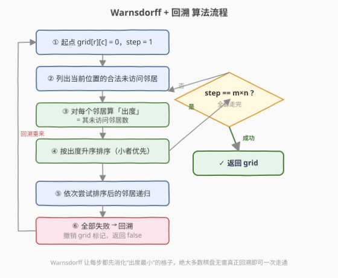
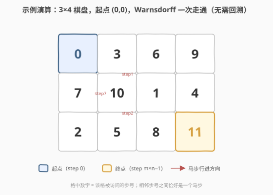

# 巡逻的骑士

- **题目名称**：巡逻的骑士
- **链接**：[2664. 巡逻的骑士](https://leetcode.cn/problems/the-knights-tour/)
- **难度**：中等
- **标签**：数组、回溯、矩阵

## 1. 题目概述

> ⚠️ 本题为 LeetCode 付费题，题意描述根据官方示例用例与相似题信息重建，可能与官方题面有出入。

给定一个 `rows × cols` 的棋盘和一个起始位置 `(rStart, cStart)`。一个国际象棋的「马」从 `(rStart, cStart)` 出发，按马的走法（「日」字形 / L 形，每次横向走 2 格 + 纵向走 1 格）移动，要求**访问棋盘上的每个格子恰好一次**（即一条「骑士巡游」/ Knight's Tour）。

返回一个 `rows × cols` 的二维网格 `grid`，其中 `grid[i][j]` 表示马**第几步**访问到格子 `(i, j)`，起始格子为第 `0` 步（即 `grid[rStart][cStart] = 0`）。若不存在合法巡游，返回空数组 `[]`。答案不唯一，返回任意一种合法方案即可。

**示例 1**：

```text
输入：rows = 1, cols = 1, rStart = 0, cStart = 0
输出：[[0]]
解释：棋盘只有 1 个格子，马已在起点，无需移动，该格即第 0 步。
```

**示例 2**：

```text
输入：rows = 3, cols = 4, rStart = 0, cStart = 0
输出：
[[0, 3, 6, 9],
 [7,10, 1, 4],
 [2, 5, 8,11]]
解释：一种合法巡游，马按步号 0→1→2→…→11 依次访问全部 12 个格子，相邻步号之间恰好是一个马步。
```

**约束条件**（根据示例与题意重建，实际以官方为准）：

- `1 <= rows, cols`（棋盘规模较小，回溯 + 启发式可解）
- `0 <= rStart < rows`，`0 <= cStart < cols`

> 💡 本题是 [2596. 检查骑士巡视方案](https://leetcode.cn/problems/check-knight-tour-configuration/) 的「构造版」——2596 给定网格验证它是否合法，2664 则要你**构造**出一张合法网格。两题共享「马步 + 0 编号网格」的表示法，可对照阅读。

---

## 2. 解题思路

### 2.1 暴力思路：朴素回溯枚举

从起点出发，每步尝试 8 个方向中所有「未越界、未访问」的格子，递归到 `step == rows × cols` 即成功。这是最朴素的回溯，但分支因子最高 8，路径数随棋盘变大呈指数爆炸——例如 8×8 棋盘朴素回溯几乎跑不完。需要剪枝/启发式把搜索空间压下来。

### 2.2 核心观察：Warnsdorff 启发式（贪心选「出度最小」的下一步）


骑士巡游的难点在于：**走到后半段容易把自己剩下的可走格子耗尽，掉进死胡同**。Warnsdorff 规则用一个简单贪心大幅降低这种风险：

> **每一步，从当前格子的所有合法未访问邻居中，优先走向「出度最小」的那个——即下一步可走方向最少（最「孤立」）的格子。**

直觉：出路少的格子如果不先去走，等会儿再回来就走不了了（它的入口会变少甚至归零）。先把这种「难走的、容易被孤立」的格子消化掉，把出路多的格子留到后面——后者灵活，随时能接上。这等价于一种「**留下最大灵活性**」的贪心。

> 💡 **为什么有效？** Warnsdorff 在几乎所有存在巡游的棋盘上**一次走通、无需回溯**。它把指数级搜索压成几乎线性的 `O(rows·cols)`。加上回溯兜底（万一贪心失败），就能保证：**有解必找到**。

### 2.3 算法流程图



**完整步骤**：

1. **初始化**：`grid` 全置 `-1`（未访问），`grid[rStart][cStart] = 0`，从起点开始递归 `dfs(rStart, cStart, 0)`
2. **DFS 函数** `dfs(r, c, step)`：
   - **标记**：`grid[r][c] = step`
   - **终止（成功）**：`step == rows × cols − 1` → 全部走完，返回 `true`
   - **列邻居**：遍历 8 个方向，收集所有「越界检查通过且 `grid == -1`」的邻居
   - **算出度并排序**：对每个邻居算其出度（它自身的未访问邻居数），按出度**升序**排序
   - **依次递归**：按排序后顺序逐个尝试 `dfs(邻居, step+1)`，任一成功则返回 `true`
   - **回溯**：全部失败 → `grid[r][c] = -1`（撤销标记），返回 `false`
3. 起点递归成功则返回 `grid`，否则返回 `[]`

> ⚠️ **回溯不能省**：理论上存在 Warnsdorff 贪心走不通、但换条路能通的棋盘。保留「失败回溯、换下一个邻居」的逻辑，才能保证有解必找到。实际中回溯极少触发。

### 2.4 示例演算

以 `rows=3, cols=4, rStart=0, cStart=0` 为例。Warnsdorff 一次走通、全程零回溯：



逐步看 Warnsdorff 如何选择（出度 = 该邻居当前还能走向的未访问格子数）：

| 步号 | 当前格 | 候选邻居(出度) | 选择 | 说明 |
|------|--------|----------------|------|------|
| 0 | (0,0) | (1,2)出2 / (2,1)出3 | (1,2) | 出度小者优先 |
| 1 | (1,2) | (2,0)出2 | (2,0) | 唯一合法邻居 |
| 2 | (2,0) | (0,1)出2 | (0,1) | (1,2)已访问 |
| 3 | (0,1) | (1,3)出1 / (2,2)出2 | (1,3) | 出1 最小，先走 |
| 4 | (1,3) | (2,1)出1 | (2,1) | 唯一 |
| 5 | (2,1) | (0,2)出2 | (0,2) | 唯一 |
| 6 | (0,2) | (1,0)出1 / (2,3)出1 | (1,0) | 并列取方向序在前者 |
| 7 | (1,0) | (2,2)出1 | (2,2) | 唯一 |
| 8 | (2,2) | (0,3)出1 | (0,3) | 唯一 |
| 9 | (0,3) | (1,1)出1 | (1,1) | 唯一 |
| 10 | (1,1) | (2,3)出1 | (2,3) | 唯一，`step==11` → 成功 ✓ |

最终网格：

```text
 0  3  6  9
 7 10  1  4
 2  5  8 11
```

> 💡 注意第 3 步和第 6 步出现了「出度为 1」的格子——这正是 Warnsdorff 的精髓：在它们变成死胡同之前抢先走掉。朴素回溯可能先走灵活的格子、把这种孤立格留到最后而卡死，Warnsdorff 反其道而行。

---

## 3. 参考代码

### C++

```cpp
// 巡逻的骑士.cpp —— Warnsdorff 启发式 + 回溯兜底
// 编译: g++ -O2 -std=c++17 巡逻的骑士.cpp -o knightstour
class Solution {
    int m, n;
    vector<vector<int>> g;            // -1 表示未访问，否则为步号
    int dx[8] = {-2,-2,-1,-1, 1, 1, 2, 2};
    int dy[8] = {-1, 1,-2, 2,-2, 2,-1, 1};

    // 计算 (r,c) 的「出度」：其未访问的合法邻居数
    int deg(int r, int c) {
        int d = 0;
        for (int k = 0; k < 8; k++) {
            int nr = r + dx[k], nc = c + dy[k];
            if (nr >= 0 && nr < m && nc >= 0 && nc < n && g[nr][nc] == -1) d++;
        }
        return d;
    }

    bool dfs(int r, int c, int step) {
        g[r][c] = step;                       // 标记
        if (step == m * n - 1) return true;   // 全部走完
        // 收集合法未访问邻居，并按出度升序排序
        vector<array<int,3>> nb;              // {出度, 行, 列}
        for (int k = 0; k < 8; k++) {
            int nr = r + dx[k], nc = c + dy[k];
            if (nr >= 0 && nr < m && nc >= 0 && nc < n && g[nr][nc] == -1)
                nb.push_back({deg(nr, nc), nr, nc});
        }
        sort(nb.begin(), nb.end());
        for (auto& e : nb)
            if (dfs(e[1], e[2], step + 1)) return true;
        g[r][c] = -1;                         // 回溯：撤销
        return false;
    }

public:
    vector<vector<int>> tourOfKnight(int rows, int cols, int rStart, int cStart) {
        m = rows; n = cols;
        g.assign(m, vector<int>(n, -1));
        bool ok = dfs(rStart, cStart, 0);
        return ok ? g : vector<vector<int>>{};
    }
};
```

### Python

```python
class Solution:
    def tourOfKnight(self, rows: int, cols: int, rStart: int, cStart: int) -> list[list[int]]:
        g = [[-1] * cols for _ in range(rows)]
        # 8 个马步方向
        dirs = [(-2,-1),(-2,1),(-1,-2),(-1,2),(1,-2),(1,2),(2,-1),(2,1)]

        def degree(r: int, c: int) -> int:
            """(r,c) 的出度：其未访问的合法邻居数"""
            return sum(
                1 for dr, dc in dirs
                if 0 <= r + dr < rows and 0 <= c + dc < cols and g[r + dr][c + dc] == -1
            )

        def dfs(r: int, c: int, step: int) -> bool:
            g[r][c] = step                       # 标记
            if step == rows * cols - 1:          # 全部走完
                return True
            # 收集合法未访问邻居，按出度升序排序（出度小者优先）
            nbrs = []
            for dr, dc in dirs:
                nr, nc = r + dr, c + dc
                if 0 <= nr < rows and 0 <= nc < cols and g[nr][nc] == -1:
                    nbrs.append((degree(nr, nc), nr, nc))
            nbrs.sort()
            for _, nr, nc in nbrs:
                if dfs(nr, nc, step + 1):
                    return True
            g[r][c] = -1                         # 回溯：撤销
            return False

        return g if dfs(rStart, cStart, 0) else []
```

> 💡 **两个实现细节**：① `degree()` 计算邻居出度时要**实时**算（因为访问状态随搜索变化），不能预计算一张静态表；② `sort` 默认按元组/数组首元素（出度）升序，出度相同时按 `(行,列)` 的方向序天然去重，简单稳定。回溯的「撤销 `g[r][c] = -1`」与 79 单词搜索的「恢复字符」是同一个「选择-递归-撤销」三步走。

---

## 4. 复杂度分析

| 维度 | 复杂度 | 说明 |
|------|--------|------|
| **时间** | $O(rows \cdot cols)$ 期望 / $O(8^{rows \cdot cols})$ 最坏 | Warnsdorff 几乎不回溯，每步常数级排序（最多 8 邻居），期望近线性；最坏退化为朴素回溯指数级 |
| **空间** | $O(rows \cdot cols)$ | `grid` 本身 + 递归栈深度至多 $rows \cdot cols$ |

> ⚠️ **为什么时间不是严格多项式？** 骑士巡游的「保证有解」目前没有多项式算法的严格证明。Warnsdorff 是**启发式**：它在实践中近乎线性，但理论上仍可能触发回溯，最坏情况指数级。对本题的小棋盘足够快，8×8 也能瞬间完成。

---

## 5. 扩展：无解判定与封闭巡游

### 5.1 哪些棋盘无解

并非所有棋盘都存在骑士巡游。例如 `2×2`、`3×3`、`4×4` 从角落出发无解（4×4 棋盘任意起点都无开放巡游）。本题返回 `[]` 即可。一个快速排除：**双色染色**——马每步必换黑白格，若棋盘黑白格数差超过 1，开放巡游必无解（起点终点的颜色需不同且差 1）。这可用于提前剪枝，但 Warnsdorff+回溯本身也会穷尽后返回 `[]`，故非必需。

### 5.2 封闭巡游（Closed Tour）

若要求最后一步能再跳回起点形成环，称为「封闭巡游 / 闭巡游」。Warnsdorff 稍作修改：在 `step == m·n − 1` 时额外检查「当前格能否一步跳回起点」。封闭巡游对棋盘奇偶性要求更严（如 8×8 有闭巡游，3×4 等需具体判定）。

### 5.3 进一步优化：二级 Warnsdorff / tie-break

当多个邻居出度相同时，可引入**二级启发式**：在并列者中再比较「它们各自邻居的最小出度」，进一步打破平局，减少回溯概率。对 8×8 及以上棋盘效果更好，但本题小棋盘用一级 Warnsdorff 已绰绰有余。

> 💡 **面试加分点**：能说出 Warnsdorff 的直觉（「先消化易被孤立的格子，留下最大灵活性」）并指出它是启发式而非保证多项式，就足以区分「背模板」与「理解算法」的候选人。

---

## 6. 面试要点

1. **Warnsdorff 为什么「先走出度小的格子」？**

   > 出度小 = 该格子的入口少、容易被孤立。若不抢先走，等会儿它的入口可能归零再也进不去，导致巡游中断。先消化这些「死胡同候选」，把出路多的灵活格子留到后面，等价于「每步保留最大灵活性」的贪心。

2. **为什么还要保留回溯？**

   > Warnsdorff 是启发式，理论上存在贪心走不通但换条路能通的棋盘。保留「失败则撤销标记、尝试下一个邻居」的回溯，才能保证「有解必找到」。实际中回溯极少触发，所以性能仍接近线性。

3. **出度（degree）能不能预计算成静态表？**

   > 不能。访问状态随搜索动态变化——一个格子的出度会因邻居被访问而减少。必须在每次选邻居时**实时**计算当前未访问邻居数。这是 Warnsdorff 与静态图算法的关键区别。

4. **朴素回溯为什么会爆炸？**

   > 每步最多 8 个方向，$rows \cdot cols$ 步的路径数最坏 $8^{rows \cdot cols}$。8×8 约 $8^{64}$，远超可计算范围。Warnsdorff 把分支因子从「8」压成「几乎 1」，才让 8×8 瞬间完成。

5. **这题和 2596「检查骑士巡视方案」什么关系？**

   > 2596 是**验证**——给定网格判断它是否合法（相邻步号是马步、起点为 0、覆盖所有格）。2664 是**构造**——输出一张合法网格。两者共享「0 编号网格 + 马步判定」表示法，2664 的输出可直接喂给 2596 的判定逻辑做自检。

> 💡 **一句话总结**：2664 巡逻的骑士用 **Warnsdorff 启发式**（每步走向出度最小的邻居）+ 回溯兜底，把指数级回溯压成近线性。它是「贪心剪枝 + 回溯保底」的范本，与 79 单词搜索共享「选择-递归-撤销」三步走，区别在于用启发式给「选哪个分支」排序。

---

## 7. 同类练习题

- [2596. 检查骑士巡视方案](https://leetcode.cn/problems/check-knight-tour-configuration/)：本题的验证版，判定给定网格是否为合法骑士巡游，对照理解「0 编号网格 + 马步」表示法
- [79. 单词搜索](https://leetcode.cn/problems/word-search/)（[题解](../0001-0100/79_单词搜索.md)）：网格 DFS + 回溯招牌，共享「选择-递归-撤销」三步走，区别在无启发式排序
- [52. N 皇后 II](https://leetcode.cn/problems/n-queens-ii/)：经典回溯 + 位运算剪枝，与本题同为「构造合法布局」类回溯，可对照剪枝思路
- [1219. 黄金矿工](https://leetcode.cn/problems/path-with-maximum-gold/)：网格 DFS + 回溯求最大路径，与骑士巡游同为「网格遍历不重复」类搜索
