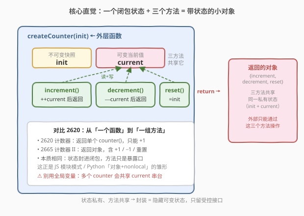
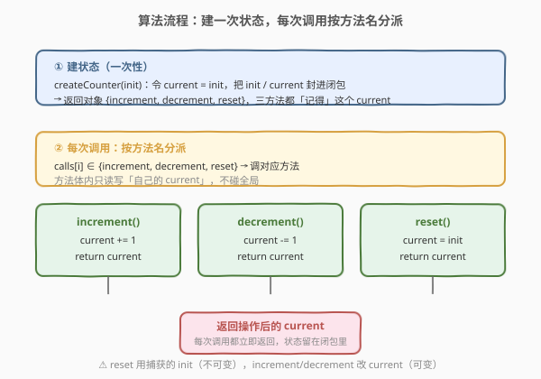
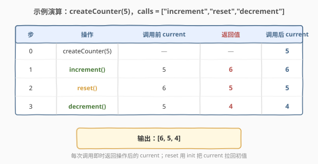

# LeetCode 计数器 II 题解

## 1. 题目概述

- **标题 / 题号**：计数器 II（#2665，easy）
- **链接**：https://leetcode.cn/problems/counter-ii/
- **难度**：简单
- **标签**：闭包、函数式编程、设计、模块模式

**题意**：请你编写函数 `createCounter`。它接收一个初始整数值 `init`，并返回一个包含三个函数的对象：

- `increment()` 将当前值加 1 并返回。
- `decrement()` 将当前值减 1 并返回。
- `reset()` 将当前值重置为 `init` 并返回。

**示例 1**：

```text
输入：init = 5, calls = ["increment","reset","decrement"]
输出：[6,5,4]
解释：
const counter = createCounter(5);
counter.increment(); // 6
counter.reset(); // 5
counter.decrement(); // 4
```

**示例 2**：

```text
输入：init = 0, calls = ["increment","increment","decrement","reset","reset"]
输出：[1,2,1,0,0]
解释：
const counter = createCounter(0);
counter.increment(); // 1
counter.increment(); // 2
counter.decrement(); // 1
counter.reset(); // 0
counter.reset(); // 0
```

**约束**：

- `-1000 <= init <= 1000`
- `0 <= calls.length <= 1000`
- `calls[i]` 是 "increment"、"decrement" 和 "reset" 中的一个

> 💡 本题是 [2620. 计数器](https://leetcode.cn/problems/counter/) 的进阶版：2620 返回「单个只能 +1 的函数」，本题返回「一组方法（+1 / −1 / 重置）共享同一状态」。考点仍是**闭包**，但更进一步展示了「闭包 = 对象的雏形」——即 JS 经典的**模块模式**。

## 2. 解题思路

### 2.1 暴力思路：用全局变量

最直白的写法：开两个全局变量 `g_init`、`g_current`，`createCounter` 把初值塞进去，三个方法各自读写 `g_current`，`reset` 再读 `g_init`。

```text
g_init = 0, g_current = 0          // 全局
createCounter(init): g_init = g_current = init; return 对象
increment(): g_current += 1; return g_current
decrement(): g_current -= 1; return g_current
reset():      g_current = g_init; return g_current
```

问题与 2620 如出一辙：全局变量是**共享可变状态**。两个计数器 `c1 = createCounter(5)`、`c2 = createCounter(0)` 会读写同一对全局变量、互相串台；而且状态暴露在外、难以回收、难以测试。

### 2.2 核心观察：闭包 + 对象——「一组方法共享同一私有状态」



**关键转变**：把全局变量换成「外层函数的局部变量」即可：

- `createCounter(init)` 不返回值，而**返回一个对象**，对象里的三个方法都是**内层函数**；
- 这三个内层函数都**捕获**了外层的 `init`（只读，用于 reset）和 `current`（可变，用于增减）；
- 于是 `init` / `current` 成为只属于这个对象的**私有状态**，三个方法共享它、外部却碰不到它。

> 💡 **为什么三个方法能共享同一个 `current`？** 它们都定义在 `createCounter` 的函数作用域内，`nonlocal current`（Python）/ 捕获 `cur`（C++ `shared_ptr`）/ 闭包引用 `current`（JS `let`）指向的是**同一个变量单元**。任一方法改了它，另外两个立刻能看到——这正是「对象：一组方法 + 共享状态」的本质。

> ⚠️ **`init` 不可变、`current` 可变**：`reset` 用捕获的 `init`（按值/不可变捕获即可，它从不被修改）把 `current` 拉回初值；`increment` / `decrement` 只动 `current`。区分这两类状态能避免「reset 后再也回不到初值」的经典 bug——如果你把初值也存进可变变量又被覆盖了，就回不去了。

### 2.3 算法流程图



整体只有两段：

1. **建状态**（一次性）：`createCounter(init)` 令 `current = init`，把 `init` / `current` 封进闭包，返回对象 `{increment, decrement, reset}`；
2. **每次调用**：按 `calls[i]` 分派到对应方法，方法体内读写「自己的 `current`」后立即返回。

> 💡 与 2620 相比，2620 的「先取后增」语义在这里被拆成了显式的三支：`++current`、`--current`、`current = init`。由于每个方法都**返回操作后的 `current`**，不存在 2620 里「先取后增」的顺序陷阱。

### 2.4 示例演算



以 `init = 5`、`calls = ["increment","reset","decrement"]` 为例：

| 步 | 操作 | 调用前 current | 返回值 | 调用后 current |
|----|------|----------------|--------|----------------|
| 0 | `createCounter(5)` | — | — | 5 |
| 1 | `increment()` | 5 | **6** | 6 |
| 2 | `reset()` | 6 | **5** | 5 |
| 3 | `decrement()` | 5 | **4** | 4 |

输出 `[6, 5, 4]`。注意第 2 步 `reset()`：它用捕获的 `init=5` 把 `current` 从 6 拉回 5 并返回 5——这正是「init 不可变、current 可变」分工的价值。

## 3. 参考代码

### C++

```cpp
#include <functional>
#include <memory>

// 返回类型：含三个方法的对象
struct Counter {
    std::function<int()> increment;
    std::function<int()> decrement;
    std::function<int()> reset;
};

// 写法一：闭包 + shared_ptr（最贴近 JS 模块模式：状态被多个闭包共享）
Counter createCounter(int init) {
    auto cur = std::make_shared<int>(init);   // 堆上「可变盒子」，三闭包共享
    return Counter{
        [cur]() { return ++(*cur); },               // increment
        [cur]() { return --(*cur); },               // decrement
        [cur, init]() { *cur = init; return *cur; }  // reset（init 按值捕获，只读）
    };
}

// 写法二：带成员的 struct（最直白，状态即成员变量）
struct Counter2 {
    int init_, cur_;
    Counter2(int x) : init_(x), cur_(x) {}
    int increment() { return ++cur_; }
    int decrement() { return --cur_; }
    int reset()      { cur_ = init_; return cur_; }
};
Counter2 createCounter2(int init) { return Counter2{init}; }
```

> 💡 **为什么用 `shared_ptr`？** 三个闭包要**共享同一个**可变 `current`，而不是各持一份副本。`shared_ptr<int>` 是一个「共享盒子」：按值捕获 `cur`（指针本身）只拷贝指针，三个闭包指向同一块堆内存，改一处处处可见。这正是 JS 闭包「引用捕获」语义的 C++ 翻译；写法二用 struct 成员变量则更接近「对象 = 数据 + 方法」的常规写法。

### Python

```python
import types

# 写法一：闭包 + SimpleNamespace（最贴近 JS 模块模式）
def createCounter(init: int):
    current = init                          # 外层局部变量，被三个内层函数共享
    def increment():
        nonlocal current
        current += 1
        return current
    def decrement():
        nonlocal current
        current -= 1
        return current
    def reset():
        nonlocal current
        current = init                      # 用外层捕获的 init 复位
        return current
    return types.SimpleNamespace(increment=increment, decrement=decrement, reset=reset)

# 写法二：class（最 Pythonic，状态即实例属性）
class Counter:
    def __init__(self, init: int):
        self._init = init
        self._cur = init
    def increment(self):
        self._cur += 1
        return self._cur
    def decrement(self):
        self._cur -= 1
        return self._cur
    def reset(self):
        self._cur = self._init
        return self._cur

def createCounter2(init: int):
    return Counter(init)
```

> ⚠️ **`nonlocal` 不可省**：三个内层函数都写 `nonlocal current`，它们绑定的是 `createCounter` 作用域里**同一个** `current` 单元，所以共享状态。若漏掉 `nonlocal`，Python 会把 `current` 当成各自的局部变量，赋值前读取即 `UnboundLocalError`，三方法也不再共享。这与 2620 单闭包场景的 `nonlocal` 同义，只是这里有三份。

> 💡 **额外附 JavaScript 原版**（题目官方语言，便于对照）：
> ```javascript
> var createCounter = function (init) {
>     let current = init;
>     return {
>         increment: () => ++current,
>         decrement: () => --current,
>         reset: () => (current = init),
>     };
> };
> ```
> 三个箭头函数都闭包引用同一个 `let current`；`reset` 的 `current = init` 是赋值表达式，其值即新的 `current`，直接被箭头函数返回。

## 4. 复杂度分析

| 维度 | 复杂度 | 说明 |
|------|--------|------|
| 时间复杂度 | $O(1)$ 每次调用 / $O(1)$ 创建 | 每个方法仅一次读 + 一次写 `current` |
| 空间复杂度 | $O(1)$ 每个计数器 | 只持有 `init` 与 `current` 两个整型状态，与调用次数无关 |

> 💡 本题没有「规模」可言，复杂度恒为常数；考点在**封装**而非性能。`calls.length <= 1000` 只表明调用次数有限，不影响渐近分析。

## 5. 扩展：从闭包到对象——模块模式与封装

- **闭包即对象的雏形**：2620 用「一个闭包 + 一个方法」做计数器；2665 用「一个闭包状态 + 三个方法」做带 +1 / −1 / reset 的计数器。继续往前一步——再加 `set(x)`、`get()` 等方法、把状态扩成多个字段——就得到了完整的「对象」。JS 的模块模式、Python 的 `SimpleNamespace` + 闭包、C++ 的 struct，差别只在语法糖。
- **状态可见性**：闭包 / 私有成员把 `current` 藏起来，外部只能通过 `increment` / `decrement` / `reset` 操作。这就是**封装**：不是「不能」直接改，而是「不让你」直接改，从而保证不变量（如 `current` 永远可被 `reset` 拉回 `init`）。
- **共享 vs 副本**：C++ 写法一用 `shared_ptr` 共享，写法二用成员变量；若误把 C++ lambda 写成按值捕获 `int cur = init` 再各自 `++cur`，三个闭包会各持一份副本、互不影响——这对应「不可变捕获」，不是我们要的共享语义。JS `let` / Python `nonlocal` 默认就是引用语义，无需操心。
- **重置的语义**：`reset` 回到的是「构造时的 `init`」而非「上次某值」。因此 `init` 必须作为不可变状态保留——若只有一个 `current` 又被各种方法改过，就无法复位了。这是「初值快照」思想，类似 LRU 里保留原始 key。

## 6. 面试要点

1. **本题和 2620 计数器有什么区别？为什么说它是「模块模式」？**

   > 2620 返回单个只能 +1 的函数；2665 返回一个对象，含 `increment` / `decrement` / `reset` 三个方法。三者共享同一份私有状态（`init` + `current`），这正是「对象 = 数据 + 操作」的雏形，即 JS 经典模块模式：用闭包藏状态、用返回的方法暴露受控接口。

2. **为什么三个方法能共享同一个 `current`？底层是什么机制？**

   > 它们定义在同一个外层函数作用域，`nonlocal current` / 闭包引用 / `shared_ptr` 都指向**同一个变量单元**。JS 中 `let current` 被三个箭头函数闭包引用同一绑定；Python 中三个 `nonlocal current` 绑定同一 cell；C++ 中三个 lambda 捕获同一个 `shared_ptr`，指向同一块堆内存。改一处，处处可见。

3. **`reset` 里的 `init` 和 `increment` / `decrement` 里的 `current` 有何不同？**

   > `init` 是**不可变**快照，用于把状态拉回初值，按值 / 只读捕获即可；`current` 是**可变**当前值，被增减方法读写。必须保留 `init` 不被覆盖，否则 reset 后回不到初值——这是「初值快照」思想。

4. **用全局变量实现会有什么问题？**

   > 共享可变状态：多个计数器会读写同一对全局变量、互相串台；状态暴露在外、难以回收、难以测试、无法并发安全使用。闭包把状态绑在实例上，每个计数器持有独立的 `current`，互不干扰。

5. **Python 里三个内层函数都写 `nonlocal current`，它们指的是同一个变量吗？漏写会怎样？**

   > 是同一个——都绑定 `createCounter` 作用域里的 `current` 单元。若漏写 `nonlocal`，Python 把 `current` 当成各自的局部变量，赋值前读取即 `UnboundLocalError`，三方法也不再共享状态。

## 同类练习题

| # | 题目 | 与本题的关联 |
|---|------|-------------|
| 2620 | [计数器](https://leetcode.cn/problems/counter/) | 本题前传，返回单个只能 +1 的函数，先掌握「闭包封装单一状态」再看本题的「一组方法共享状态」 |
| 2666 | [只允许一次函数调用](https://leetcode.cn/problems/allow-one-function-call/) | 闭包加一个布尔标志位实现「调用一次后失效」，同一封装思想、不同语义 |
| 2623 | [记忆函数](https://leetcode.cn/problems/memoize/) | 闭包持有缓存字典，把「记忆」状态封进函数，是「函数 + 私有状态」的典型应用 |
| 2621 | [睡眠函数](https://leetcode.cn/problems/sleep/) | 同属 30 Days of JS 系列，闭包 + Promise / 定时器，对照「函数即值」的延时调用 |
