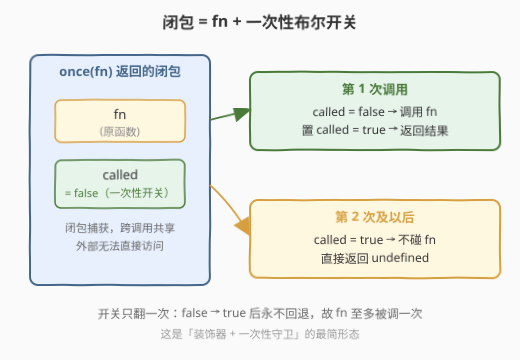
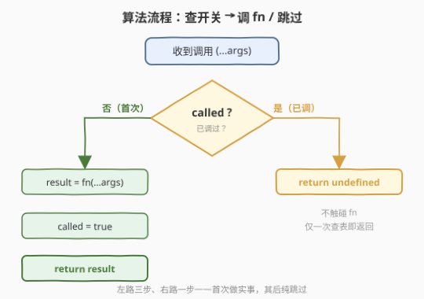
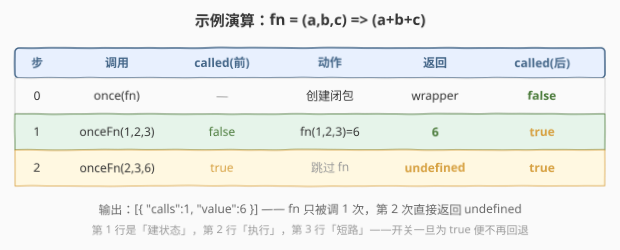

# LeetCode 只允许一次函数调用 题解

## 1. 题目概述

- **标题 / 题号**：只允许一次函数调用（#2666，easy）
- **链接**：https://leetcode.cn/problems/allow-one-function-call/
- **难度**：简单
- **标签**：闭包、高阶函数、装饰器模式

**题意**：给定一个函数 `fn`，请你编写一个函数 `once`，它返回一个新函数。返回的函数与 `fn` 行为完全相同，但确保 `fn` **最多被调用一次**：

- 第一次调用返回的函数时，执行 `fn` 并返回其结果；
- 第一次之后的每次调用，直接返回 `undefined`，不再触碰 `fn`。

**示例 1**：

```text
输入：fn = (a,b,c) => (a + b + c), calls = [[1,2,3],[2,3,6]]
输出：[{"calls":1,"value":6}]
解释：
const onceFn = once(fn);
onceFn(1, 2, 3); // 6，fn 被调用
onceFn(2, 3, 6); // undefined，fn 未被调用
```

**示例 2**：

```text
输入：fn = (a,b,c) => (a * b * c), calls = [[5,7,4],[2,3,6],[4,6,8]]
输出：[{"calls":1,"value":140}]
解释：
const onceFn = once(fn);
onceFn(5, 7, 4); // 140，fn 被调用
onceFn(2, 3, 6); // undefined，fn 未被调用
onceFn(4, 6, 8); // undefined，fn 未被调用
```

**约束**：

- `calls` 是一个有效的 JSON 数组
- `1 <= calls.length <= 10`
- `1 <= calls[i].length <= 100`
- `2 <= JSON.stringify(calls).length <= 1000`

> 💡 本题是 LeetCode「30 天 JavaScript」系列题目，不考算法复杂度，考的是**闭包 + 一次性布尔开关**——这是「装饰器（decorator）」与「一次性守卫（one-shot guard）」的最简形态。`once` 是函数式编程与工程实践中极其常见的高阶工具（Lodash `_.once`、Underscore `_.once`、jQuery `.one()`），下文以 JS 为提交语言，并给出 Python / C++ 的等价实现。

## 2. 解题思路

### 2.1 暴力思路：用全局变量记开关

最直白的写法：开一个**全局布尔变量** `g_called` 当开关，`once` 返回的包装函数先查它：

```text
g_called = false                  // 全局
once(fn): return wrapper
wrapper(...args):
  if g_called: return undefined
  g_called = true
  return fn(...args)
```

逻辑没错，但**全局变量是共享可变状态**。若同时创建两个 `once` 包装器——`o1 = once(f1)`、`o2 = once(f2)`——它们读写同一个 `g_called`：调一次 `o1` 把 `g_called` 翻成 `true`，`o2` 还没被调过却已经永远返回 `undefined`，`f2` 被无声地「封死」。这和 2620 计数器里两个计数器共享全局 `g` 的串台问题同构。

### 2.2 核心观察：闭包 + 一次性布尔开关（one-shot latch）



把全局 `g_called` 换成**外层函数的局部变量 `called`**，让内层包装函数通过闭包捕获它——状态就变成了**每个 `once(fn)` 实例私有**：

- `once(fn)` 不返回值，而**返回一个内层函数** `wrapper`；
- `wrapper` 闭包捕获两样东西：原函数 `fn`、布尔开关 `called`（初值 `false`）；
- 每次 `wrapper(...)` 被调：若 `called` 为 `false`，调 `fn`、把 `called` 翻成 `true`、返回结果；若 `called` 已是 `true`，直接返回 `undefined`，不碰 `fn`。

这样 `o1` 和 `o2` 各自持有**独立的** `called`，互不干扰——正是封装的意义：开关不再暴露在全局，而是绑在闭包实例上。

> 💡 **开关的「单调性」是关键**：`called` 只会从 `false` 翻成 `true`，**永不回退**。这是一种**一次性锁存（one-shot latch）**——一旦「上锁」就锁死，无需任何「重置」逻辑。正因为单向，第一次调用后所有后续调用必然走「已上锁」分支，`fn` 至多被调一次这个不变量才成立。

> ⚠️ **判定「已调过」用布尔而非「覆盖 fn」**：一种看似更巧的写法是首次调用后把 `fn` 替换成 `() => undefined`（自替换模式），后续调用自然返回 `undefined`。这能跑通，但每次仍会「调用」那个 no-op，不如布尔开关在 `if` 处直接短路——后者连函数调用都省了，语义也更直白（「不调 fn」而非「调一个空函数」）。见第 3 节的两种写法对照。

### 2.3 算法流程图



整体只有一个分叉 `called ?`：左路（否）三步——算 `fn`、上锁、返回结果；右路（是）一步——直接返回 `undefined`。首次走左路并把开关翻成 `true`，其后所有调用都走右路短路。

### 2.4 示例演算



以**示例 1**（`fn = (a,b,c) => (a+b+c)`）为例：

| 步 | 调用 | called(前) | 动作 | 返回 | called(后) |
|----|------|-----------|------|------|-----------|
| 0 | `once(fn)` | — | 创建闭包 | `wrapper` | `false` |
| 1 | `onceFn(1,2,3)` | `false` | `fn(1,2,3) = 6` | **6** | `true` |
| 2 | `onceFn(2,3,6)` | `true` | 跳过 `fn` | **undefined** | `true` |

输出 `[{"calls":1,"value":6}]`：`fn` 只被调 1 次（`calls=1`），首次结果为 `6`（`value=6`）。第 2 步开关已是 `true`，短路返回 `undefined`，`fn` 完全未被触碰。

## 3. 参考代码

### JavaScript（提交语言：闭包 + 布尔开关）

```javascript
/**
 * @param {Function} fn
 * @return {Function}
 */
var once = function (fn) {
    let called = false;                // 一次性开关，闭包私有
    return function (...args) {
        if (called) return undefined; // 已调过：短路
        called = true;                // 上锁（单调，永不回退）
        return fn(...args);           // 首次：执行并返回结果
    };
};
```

> 💡 `called` 用 `let` 而非 `const`：内层函数要修改它，`let` 允许重新赋值。这对应 Python 的 `nonlocal`、C++ lambda 的 `mutable`——都是「让闭包捕获的状态可变」。

**自替换变体**（首次后把 `fn` 换成 no-op，省掉布尔变量）：

```javascript
var once = function (fn) {
    return function (...args) {
        const result = fn(...args);   // 首次：真调一次
        fn = () => undefined;         // 把 fn 替换成 no-op（参数绑定可重新赋值）
        return result;
    };
};
```

此变体每次仍会「调用」`fn`（只是第二次起 `fn` 已是 no-op），不如布尔开关在 `if` 处彻底短路；但它无需额外状态变量，是「自禁用（self-disabling）」模式的典型写法。

### Python（概念等价）

> 本题 LeetCode 仅开放 JS/TS，Python 版作概念对照。`undefined` 在 Python 中对应 `None`。

```python
from typing import Callable, Any

def once(fn: Callable[..., Any]) -> Callable[..., Any]:
    called = False

    def wrapper(*args: Any) -> Any:
        nonlocal called          # 声明修改外层捕获的 called
        if called:
            return None          # 对应 undefined
        called = True
        return fn(*args)

    return wrapper
```

> ⚠️ **`nonlocal` 不可省**：若内层只写 `called = True` 而无 `nonlocal`，Python 会把 `called` 当成**局部变量**，因赋值前读取（`if called`）而抛 `UnboundLocalError`。`nonlocal` 告诉解释器「这个 `called` 是外层捕获来的」，与 JS 的 `let`、C++ 的 `mutable` 同义。

### C++（概念等价）

> C++ 没有 `undefined`，用 `std::optional` 的 `nullopt` 表达「无值」。下面以 `int(int,int,int)` 签名为例。

```cpp
#include <functional>
#include <optional>

// optional<nullopt> 对应 JS 的 undefined
std::function<std::optional<int>(int, int, int)>
once(std::function<int(int, int, int)> fn) {
    return [fn, called = false](int a, int b, int c) mutable
           -> std::optional<int> {
        if (called) return std::nullopt;   // 已调过
        called = true;                      // 上锁
        return fn(a, b, c);                  // 首次
    };
}
```

> 💡 **`mutable` 不可省**：C++ lambda 默认把按值捕获的变量视为 `const`，不加 `mutable` 就无法 `called = true`。这与 2620 计数器的 `n++` 完全同理——都是「让闭包的状态可变」。

## 4. 复杂度分析

| 维度 | 复杂度 | 说明 |
|------|--------|------|
| 时间复杂度 | $O(1)$ 每次 | 一次布尔判断 +（首次）一次 `fn` 调用；其后仅一次判断即短路返回 |
| 空间复杂度 | $O(1)$ 每个 `once` 实例 | 只持有 `fn` 引用与一个布尔 `called`，与调用次数无关 |

> 💡 本题没有「规模」可言，复杂度恒为常数；`calls.length <= 10` 仅说明调用次数有限，不影响渐近分析。考点在**封装**与**一次性守卫**而非性能。

## 5. 扩展：「once」是工程中最常见的装饰器之一

### 5.1 标准库与生态中的 once

`once` 是几乎所有主流库都提供的基础设施：

- **Lodash / Underscore**：`_.once(fn)` —— 正是本题的名字与语义；
- **jQuery**：`$(el).one('click', handler)` —— 事件触发一次后自动解绑，是「once」在事件系统中的特化；
- **Rust**：`std::sync::Once` —— 线程安全的「初始化一次」原语，用于全局单例的惰性初始化；
- **Python**：标准库无 `once`，但 `functools.cache` / `lru_cache` 是「按输入记忆」的泛化，`once` 可看作「对所有输入只记第一次」的极端退化版。

### 5.2 once 的本质：单调状态机

`once` 的开关是一个**两状态、单向**的有限状态机：

$$
\text{未调} \xrightarrow{\text{首次调用}} \text{已调} \quad (\text{不可逆})
$$

这种「单调锁存」无处不在：

- **Promise 的状态**：`pending → fulfilled`（或 `rejected`）后永不回退，故 Promise 只能被 resolve 一次——本质就是一个 `once`；
- **单例惰性初始化**：「只初始化一次」= `once(init)`，后续访问直接返回首次结果（Java 双重检查锁、Go `sync.Once`、Rust `Once` 都是线程安全版）；
- **一次性事件监听**：`addEventListener(type, handler, { once: true })` 触发后自动 `removeEventListener`。

### 5.3 与 debounce / throttle / memoize 的对照

| 模式 | 状态机 | 与 once 的关系 |
|------|--------|---------------|
| **once** | 未调 → 已调（单向，永不回退） | 最严格：整个生命周期至多 1 次 |
| **debounce**（2627） | 每次调用重置计时器 | 可重复触发，但合并密集调用为一次 |
| **throttle** | 每 N ms 放行一次 | 可重复触发，但限频 |
| **memoize**（2623） | 按输入键命中缓存 | 可重复，但相同输入只算一次 |

`once` 是这条谱系里「最简也最严」的：不区分输入、不限频次窗口，只关心「这辈子调过没有」。

### 5.4 泛化：至多 N 次

把布尔 `called` 换成计数器 `count`、把 `if (called)` 换成 `if (count >= N)`、把 `called = true` 换成 `count += 1`，就得到「至多调 N 次」的 `nTimes(fn, N)`——可见 `once` 是 `N=1` 的特例，计数器（2620）是「不限次但记录次数」的近亲。

## 6. 面试要点

1. **什么是 `once` 模式？为什么用闭包而非全局变量？**

   > `once` 让一个函数至多被调用一次，其后返回 `undefined`。用闭包把布尔开关 `called` 封进 `once(fn)` 返回的包装函数，使其成为**每个实例私有**；全局变量会让多个 `once` 包装器共享同一开关，一个被调就封死全部，发生串台。

2. **开关为什么是「单调」的？能回退吗？**

   > `called` 只从 `false` 变 `true`、永不回退，是一种一次性锁存。若允许回退（如调一次后重置为 `false`），就不再是 `once` 而成了「可重新装弹」的开关——`once` 的语义正建立在不可逆性上：首次调用后所有后续必然走「已调」分支，`fn` 至多 1 次这个不变量才成立。

3. **`once` 和 `memoize`（2623）有什么区别？**

   > `memoize` 按**输入键**缓存，相同输入返回缓存、不同输入仍会调 `fn`（多次调用，每次针对新键）；`once` 不看输入，无论传什么参数，`fn` 整个生命周期只被调 1 次。`once` 可看作 `memoize` 的退化：所有输入都映射到同一个「只记第一次」的键。

4. **自替换模式（首次后把 `fn` 换成 no-op）和布尔开关模式哪个好？**

   > 布尔开关更好。它在 `if (called)` 处直接短路，后续调用连函数都不碰；自替换模式后续仍会「调用」那个 no-op（虽然返回 `undefined`），多一次无意义调用。两者都 $O(1)$，但布尔开关语义更直白（「不调 fn」vs「调一个空函数」），也更容易泛化到「至多 N 次」。

5. **`once` 在工程中有哪些实际应用？**

   > 单例的惰性初始化（`sync.Once` / 双重检查锁）、一次性事件监听（`once: true`）、Promise 的单次 resolve、Lodash `_.once` 包装初始化函数防止重复执行。核心都是「这件事只能发生一次」的单调守卫。

> 💡 **一句话总结**：2666 = 「闭包持 `fn` + 布尔 `called`，首次调 `fn` 并上锁，其后短路返回 `undefined`」。本质是一个**单向、不可逆的一次性锁存**——工程中最常见的装饰器之一。

## 同类练习题

| # | 题目 | 与本题的关联 |
|---|------|-------------|
| 2620 | [计数器](https://leetcode.cn/problems/counter/)（[题解](../2601-2700/2620_计数器.md)） | 同属「闭包 + 可变私有状态」范式，把 `once` 的布尔换成整数自增即得计数器 |
| 2623 | [记忆函数](https://leetcode.cn/problems/memoize/)（[题解](../2601-2700/2623_记忆函数.md)） | 高阶函数装饰器 + 闭包缓存，`once` 可看作「所有输入只记第一次」的退化记忆化 |
| 2622 | [有时间限制的缓存](https://leetcode.cn/problems/cache-with-time-limit/)（[题解](../2601-2700/2622_有时间限制的缓存.md)） | 装饰器 + 闭包持有 TTL 状态，与 `once` 的「一次性开关」同为「函数 + 私有状态」家族 |
| 2627 | [函数防抖](https://leetcode.cn/problems/debounce/)（[题解](../2601-2700/2627_函数防抖.md)） | 高阶函数 + 定时器状态，对照 `once` 的「至多 1 次」看「合并多次为一次」的另一面 |
