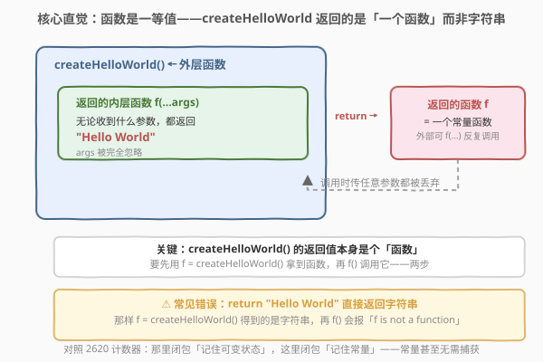
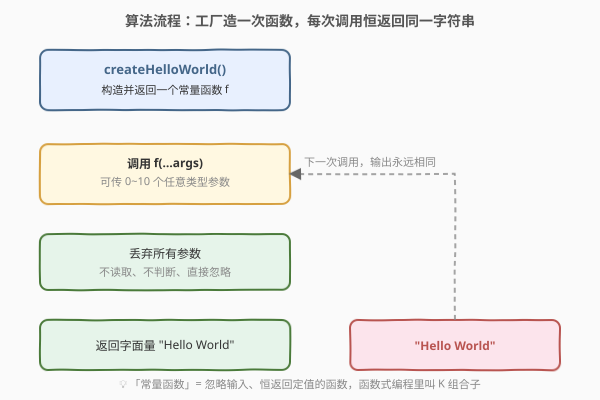
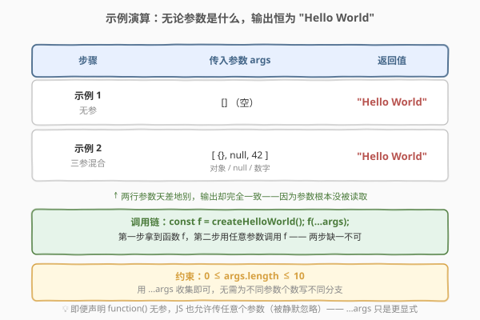

# 创建 Hello World 函数

- **题目名称**：创建 Hello World 函数
- **链接**：[2667. 创建 Hello World 函数](https://leetcode.cn/problems/create-hello-world-function/)
- **难度**：简单
- **标签**：闭包、函数式编程、高阶函数、Rest 参数

## 1. 题目概述

请你编写一个名为 `createHelloWorld` 的函数。它应该返回一个新的函数，该函数总是返回 `"Hello World"`。

**示例 1**：

```text
输入：args = []
输出："Hello World"
解释：
const f = createHelloWorld();
f(); // "Hello World"

createHelloWorld 返回的函数应始终返回 "Hello World"。
```

**示例 2**：

```text
输入：args = [{},null,42]
输出："Hello World"
解释：
const f = createHelloWorld();
f({}, null, 42); // "Hello World"

可以传递任何参数给函数，但它应始终返回 "Hello World"。
```

**约束条件**：

- `0 <= args.length <= 10`

> 💡 本题是 30 Days of JavaScript 系列的**入门第一题**，不考算法复杂度，考的是「**函数是一等值**」与「**闭包**」这两条语言基石：一个函数可以**返回另一个函数**，而返回的函数可以**忽略一切输入、恒返回定值**。题目官方以 JavaScript 为载体，但「常量函数」思想跨语言通用，下文给出 C++ 与 Python 的等价实现。

---

## 2. 解题思路

### 2.1 暴力思路：直接返回字符串

最直白的「能跑」写法，是把 `createHelloWorld` 当成一个普通函数，直接 `return "Hello World"`：

```text
createHelloWorld(): return "Hello World"     // 错！返回的是字符串
```

问题：题目要求 `createHelloWorld` **返回一个函数**，再由那个函数返回字符串。这样写之后 `f = createHelloWorld()` 拿到的是**字符串本身**，而非函数；随后 `f()` 会抛出 `TypeError: f is not a function`——因为字符串不是可调用对象。

> ⚠️ 这是最常见的新手错误：混淆了「**返回一个值**」与「**返回一个产生该值的函数**」。题目刻意把调用拆成两步：先 `f = createHelloWorld()` 拿到函数，再 `f(...args)` 调用它。`createHelloWorld` 是一个**工厂**（factory），负责「造」函数，而非直接产出结果。

### 2.2 核心观察：闭包——返回一个「常量函数」



**两条语言基石**：

1. **函数是一等值（first-class）**：函数可以像数字、字符串一样被当作**值**传递——可以赋给变量、当作参数、更可以作为另一个函数的**返回值**。`createHelloWorld` 不返回数据，而**返回一个函数**。

2. **闭包（closure）**：被返回的内层函数，连同它定义时所处的环境，一起「打包」交给调用方——即便外层 `createHelloWorld` 已经执行完毕返回，内层函数依然可用（这里它甚至不需要捕获任何可变状态，只是恒返回一个字面量）。

把两者结合：`createHelloWorld` 返回一个**常量函数**——一个无论收到什么参数都返回 `"Hello World"` 的函数。它是「闭包」最朴素的形态：闭包「记住」一段环境，这里记住的就是「永远回答 Hello World」这件事实。

> 💡 **对照 2620 计数器**：那里的闭包「记住一个**可变**状态 `n`」，每次调用推进它；这里闭包「记住一个**常量**」——常量甚至无需捕获，直接在内层返回字面量即可。二者是闭包光谱的两端：有状态闭包 ↔ 无状态常量函数。

> ⚠️ **`...args` 的作用**：内层函数声明为 `function(...args)`，用 **rest 参数**收集所有传入实参。它并非真的要用这些参数，而是**显式宣告**「我接受任意数量、任意类型的参数并丢弃它们」。即便声明成无参 `function()`，JS 也不会因实参多于形参而报错（多余实参被静默忽略），但 `...args` 让意图一目了然，也更契合题意。

### 2.3 算法流程图



整体只有两段：

1. **造函数（一次性）**：`createHelloWorld()` 构造并返回常量函数 `f`；
2. **每次调用**：`f(...args)` 丢弃全部参数 → 返回字面量 `"Hello World"`。

由于没有任何状态被读写，无论调用多少次、传什么参数，输出永远相同——这正是「常量函数」的定义。

> 💡 **函数式编程视角**：忽略输入、恒返回定值的函数叫 **K 组合子**（K combinator，源自 SKI 组合子演算），在 lodash 里是 `_.constant(x)`，在 ramda 里是 `R.always(x)`，在 Haskell 里是 `const x`。`createHelloWorld` 本质就是手写一个 `_.constant("Hello World")`。

### 2.4 示例演算



| 步骤 | 传入参数 args | 返回值 |
|------|---------------|--------|
| 示例 1（无参） | `[]` | `"Hello World"` |
| 示例 2（三参混合） | `[{}, null, 42]` | `"Hello World"` |

两行参数天差地别——空数组、对象、`null`、数字——输出却完全一致，因为参数根本没被读取。调用链始终是 `const f = createHelloWorld(); f(...args);` 两步：先拿函数，再调用。

---

## 3. 参考代码

### JavaScript（写法一：函数表达式 + rest 参数）

```javascript
/**
 * @return {Function}
 */
var createHelloWorld = function () {
    return function (...args) {
        return "Hello World";
    };
};

/**
 * const f = createHelloWorld();
 * f(); // "Hello World"
 */
```

> 💡 这是最贴近题目骨架的写法：外层 `createHelloWorld` 返回一个内层函数；内层用 `...args` 收集任意参数却并不使用，直接 `return` 字符串字面量。`...args` 在此处主要是**语义标注**——即便写成 `function ()` 也能 AC，因为 JS 不校验实参个数。

### JavaScript（写法二：箭头函数，最简）

```javascript
var createHelloWorld = function () {
    return () => "Hello World";
};
```

> 💡 箭头函数 `() => "Hello World"` 是单表达式函数，隐式返回表达式结果，等价于 `function () { return "Hello World"; }`。如果还想保留「接受任意参数」的显式语义，写 `(...args) => "Hello World"` 亦可。两写法 AC 结果一致，箭头函数更简洁但缺自己的 `this`/`arguments`——本题用不到，故无差别。

### TypeScript

```typescript
function createHelloWorld() {
    return function (...args): string {
        return "Hello World";
    };
}

/**
 * const f = createHelloWorld();
 * f(); // "Hello World"
 */
```

> 💡 TS 与 JS 写法几乎一致，只是给内层函数标注了返回类型 `: string`，让「恒返回字符串」的契约进入类型系统。外层 `createHelloWorld` 的返回类型会被自动推断为 `(...args: unknown[]) => string`。

### C++

```cpp
#include <functional>
#include <string>
#include <any>
#include <vector>

// 写法一：lambda 返回 lambda（最贴近 JS 闭包语义）
std::function<std::string()> createHelloWorld() {
    return []() {
        return std::string("Hello World");
    };
}

// 写法二：若需显式声明「接受任意参数并忽略」
std::function<std::string(const std::vector<std::any>&)> createHelloWorld2() {
    return [](const std::vector<std::any>& /*args*/) {
        return std::string("Hello World");
    };
}
```

> 💡 C++ 用 `std::function` 把 lambda 包成可调用对象返回。`[]() { ... }` 是不捕获任何变量的 lambda，等价于一个无状态的常量函数。JS 的 `...args` 在 C++ 没有直接对应物；若要显式表达「接受任意参数」，可用 `std::vector<std::any>` 收集（写法二），但本题不读参数，无参 lambda 即可。

### Python

```python
# 写法一：闭包 + 忽略参数（标准写法）
def createHelloWorld():
    def f(*args):           # *args 收集任意位置参数
        return "Hello World"
    return f

# 写法二：lambda 单行
def createHelloWorld2():
    return lambda *args: "Hello World"
```

> 💡 Python 的 `def f(*args)` 对应 JS 的 `function(...args)`，用 `*args` 收集所有位置参数为一个元组；这里同样不读取它。`lambda *args: "Hello World"` 是单表达式版，与 JS 箭头函数异曲同工。注意 Python lambda 不能含语句，但单表达式 `return` 字符串正合适。

> 💡 **额外附 JavaScript 原版**（题目官方语言，便于对照）：
> ```javascript
> var createHelloWorld = function() {
>     return function(...args) {
>         return "Hello World";
>     };
> };
> ```

---

## 4. 复杂度分析

| 维度 | 复杂度 | 说明 |
|------|--------|------|
| **时间复杂度** | $O(1)$ 创建 / $O(1)$ 每次调用 | 创建仅构造一个函数对象；每次调用仅返回一个常量，无计算 |
| **空间复杂度** | $O(1)$ | 只分配一个函数对象（闭包），不随参数或调用次数增长 |

> 💡 本题没有「规模」可言，复杂度恒为常数。`args.length <= 10` 只说明测试参数个数有限，不影响渐近分析。考点在「函数作为返回值」的语义理解，而非性能。

---

## 5. 扩展：常量函数与「函数即值」

- **K 组合子**：忽略输入恒返回定值的函数，是函数式编程的最基本组合子之一。lodash 的 `_.constant(x)`、ramda 的 `R.always(x)`、Haskell 的 `const x` 都是它的库化封装。`createHelloWorld` 就是手写 `_.constant("Hello World")`——理解它就理解了「把数据包装成函数」的转换：`value → () => value`。

- **为何要「数据包成函数」？** 在惰性求值、依赖注入、回调契约中，常需要「一个无参的值生产者」。把字符串包成 `() => "Hello World"` 后，它就能和「需要回调的地方」无缝拼接——调用方约定「我调你拿值」，而不关心值是算出来的还是常量。React 的「渲染函数」、Thunk 模式都源于此思想。

- **`...args` vs 无参声明**：JS 函数声明形参个数不限制实参个数——声明 `function()` 也能被 `f(1, 2, 3)` 调用，多余实参静默忽略；声明 `function(...args)` 则把所有实参收进数组。后者**不改变行为**，但让「我接受任意参数」的意图进入签名，更自文档化。在 TS 中，`(...args: unknown[])` 还能把这条意图编入类型检查。

- **闭包的「记忆」**：本题闭包「记住」的是常量，甚至无需捕获外层变量——内层直接返回字面量。对比 2620 计数器「记住可变 `n`」、2666「记住是否已调用」、2623 记忆函数「记住缓存表」，本题是闭包光谱上「零状态」的极端：闭包机制仍在（内层函数确实被外层返回并独立存活），只是它无可变状态可记。掌握这一极简形态，有助于看清「闭包 = 函数 + 它能访问的环境」这条定义的最小内核。

---

## 6. 面试要点

1. **`createHelloWorld` 返回的是字符串还是函数？为什么不能直接 `return "Hello World"`？**

   > 返回的是一个**函数**。直接 `return "Hello World"` 返回的是字符串本身，调用方 `f = createHelloWorld()` 拿到字符串后再 `f()` 会抛 `TypeError: f is not a function`。题目把调用拆成两步——先拿函数、再调用——`createHelloWorld` 是「造函数的工厂」，而非直接产值的函数。

2. **什么是闭包？本题中闭包「记住」了什么？**

   > 闭包 = 函数 + 它定义时能访问的外层环境。本题内层函数被 `createHelloWorld` 返回后，依然带着自己的环境独立存活——但它甚至**没有可变状态**要记，只是恒返回字面量 `"Hello World"`。这是闭包的极简形态：闭包机制依然生效（内层函数独立存活），只是无可变状态可捕获，凸显「闭包 = 函数 + 环境」的最小内核。

3. **`...args` 是干什么的？写成无参 `function()` 行不行？**

   > `...args` 是 **rest 参数**，把所有传入实参收集成一个数组。它在本题中并非真的要用这些参数，而是**显式宣告**「我接受任意数量、任意类型的参数并忽略它们」。写成无参 `function()` 也能 AC，因为 JS 不校验实参个数，多余实参被静默忽略；但 `...args` 让意图一目了然，更自文档化。

4. **为什么无论传 `[]` 还是 `[{}, null, 42]` 输出都一样？**

   > 因为内层函数**根本不读取** `args`。参数被收进 `args` 数组后，函数体直接 `return "Hello World"`，从不访问 `args[i]`。这就是「常量函数」（K 组合子）的定义：输出与输入无关，恒为定值。

5. **箭头函数 `() => "Hello World"` 和 `function() { return "Hello World"; }` 有区别吗？**

   > 在**本题中无差别**——两者都返回字符串、都无状态。箭头函数是单表达式隐式返回，更简洁；但它没有自己的 `this` 与 `arguments`。本题既不碰 `this` 也不用 `arguments`，故等价。若将来需要内层用 `this`（如方法回调），则必须用普通 `function`。

---

## 7. 同类练习题

- [2620. 计数器](https://leetcode.cn/problems/counter/)（[题解](../2601-2700/2620_计数器.md)）：同属 30 Days of JS 开篇系列，闭包「记住**可变**状态 `n`」，对照本题闭包「记住**常量**」的零状态极简形态
- [2666. 只允许一次函数调用](https://leetcode.cn/problems/allow-one-function-call/)：闭包加一个布尔标志位实现「调用一次后失效」，同一封装思想、不同语义（有状态 ↔ 一次性状态）
- [2665. 计数器 II](https://leetcode.cn/problems/counter-ii/)：返回 `counter/reset/increment/decrement` 一组方法共享同一私有状态，巩固「闭包封装多个操作」
- [2623. 记忆函数](https://leetcode.cn/problems/memoize/)：闭包持有缓存字典，把「记忆」状态封进函数，是「函数 + 私有状态」的典型应用
