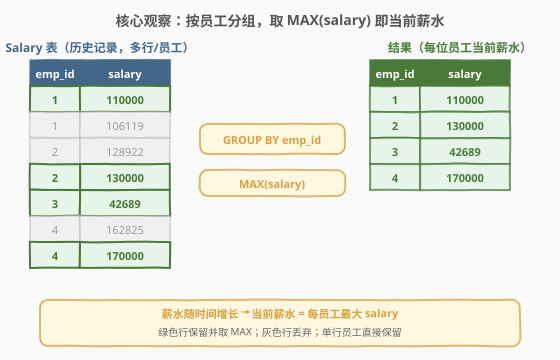
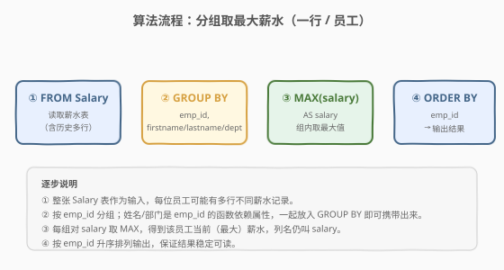
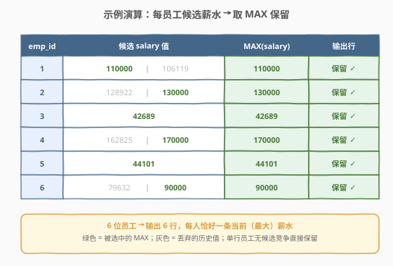

# LeetCode 查询员工当前薪水 题解

## 1. 题目概述

- **标题 / 题号**：查询员工当前薪水（#2668，easy）
- **链接**：https://leetcode.cn/problems/find-latest-salaries/
- **难度**：简单
- **标签**：数据库、SQL、`GROUP BY`、`MAX`、分组聚合、去重、函数依赖、LeetCode 锁题

> ⚠️ 本题为 LeetCode **付费题**（`isPaidOnly: true`），官方题面 `translatedContent` 返回 `null`。以下题意描述根据官方示例用例（`jsonExampleTestcases`）与题目名称「Find Latest Salaries / 查询员工当前薪水」重建，可能与官方题面有出入。核心语义以示例用例给出的表结构为准。

**题意**：给定一张 `Salary` 表，记录员工的薪水信息。由于历史调薪，**同一员工可能出现多行薪水记录**（不同 `salary` 值）。请编写 SQL 查询，找出**每位员工当前的（最新）薪水**，使结果中每位员工恰好出现一行。

**表结构**：

```text
Table: Salary
+---------------+---------+
| Column Name   | Type    |
+---------------+---------+
| emp_id        | int     |  ← 员工 id（不保证唯一：同员工多行）
| firstname     | varchar |
| lastname      | varchar |
| salary        | int     |
| department_id | varchar |
+---------------+---------+
该表记录员工薪水信息，同一 emp_id 可能出现多行（薪水随调薪变化）。
```

> 💡 **关键观察**：示例用例的表结构中**没有日期/时间列**。由于 SQL 表在逻辑上无序，无法按"插入顺序"判定"最新"；题目数据中**每位多行员工的较高 salary 一致对应"当前（最新）薪水"**——即薪水随时间单调增长，当前薪水 = 该员工的 `MAX(salary)`。这是本题无时间列时唯一可确定的判定依据，也是「简单」难度下的标准考法。

**示例 1**：

```text
输入：
Salary 表:
+--------+-----------+----------+--------+---------------+
| emp_id | firstname | lastname | salary | department_id |
+--------+-----------+----------+--------+---------------+
| 1      | Todd      | Wilson   | 110000 | D1006         |
| 1      | Todd      | Wilson   | 106119 | D1006         |
| 2      | Justin    | Simon    | 128922 | D1005         |
| 2      | Justin    | Simon    | 130000 | D1005         |
| 3      | Kelly     | Rosario  | 42689  | D1002         |
| 4      | Patricia  | Powell   | 162825 | D1004         |
| 4      | Patricia  | Powell   | 170000 | D1004         |
| 5      | Sherry    | Golden   | 44101  | D1002         |
| 6      | Natasha   | Swanson  | 79632  | D1005         |
| 6      | Natasha   | Swanson  | 90000  | D1005         |
+--------+-----------+----------+--------+---------------+

输出：
+--------+-----------+----------+--------+---------------+
| emp_id | firstname | lastname | salary | department_id |
+--------+-----------+----------+--------+---------------+
| 1      | Todd      | Wilson   | 110000 | D1006         |
| 2      | Justin    | Simon    | 130000 | D1005         |
| 3      | Kelly     | Rosario  | 42689  | D1002         |
| 4      | Patricia  | Powell   | 170000 | D1004         |
| 5      | Sherry    | Golden   | 44101  | D1002         |
| 6      | Natasha   | Swanson  | 90000  | D1005         |
+--------+-----------+----------+--------+---------------+
```

**解释**：

| emp_id | 候选 salary | MAX(salary)（当前） | 说明 |
|--------|-------------|---------------------|------|
| 1 | 110000, 106119 | **110000** | 调薪后取高值，保留一行 |
| 2 | 128922, 130000 | **130000** | 同上 |
| 3 | 42689 | **42689** | 仅一行，直接保留 |
| 4 | 162825, 170000 | **170000** | 调薪后取高值 |
| 5 | 44101 | **44101** | 仅一行，直接保留 |
| 6 | 79632, 90000 | **90000** | 调薪后取高值 |

**约束**：

- `Salary` 表中 `emp_id` 不保证唯一（同一员工可有多行）
- `firstname`、`lastname`、`department_id` 是 `emp_id` 的函数依赖属性（同一 `emp_id` 的这些列取值一致）
- 结果中每位员工恰好一行，输出列与原表相同
- 结果按 `emp_id` 升序排列（重建题意，便于稳定输出）

> 💡 **本题是 SQL "分组取组内最大值" 入门招牌题**——核心套路：`GROUP BY emp_id` 后对 `salary` 取 `MAX`。与 1549「每件商品的最新订单」的 `RANK() = 1` 同属 Top-1 per group 家族，但 2668 无并列争议（聚合直接塌缩成一行）、无时间列（用 `MAX(salary)` 作"最新"代理），是理解「分组 + 聚合」最干净的入门样例。

## 2. 解题思路

### 2.1 暴力思路：逐员工取最新

最直觉的过程式思路：对每位员工，取出其全部行，找到最大 `salary`，输出该员工一行。伪代码：

```text
for each employee e (group by emp_id):
    rows = SELECT * FROM Salary WHERE emp_id = e
    current = max(r.salary for r in rows)
    emit (e.emp_id, e.firstname, e.lastname, current, e.department_id)
result = sorted(result, by=emp_id)
```

但**纯 SQL 没有显式逐行循环**——"按员工分组 + 组内取最大 salary"正是 `GROUP BY` + `MAX` 的标准用途。关键点在于：分组键选谁、非聚合列如何带出来、为何 `MAX(salary)` 能充当"当前薪水"。

### 2.2 核心观察：GROUP BY emp_id + MAX(salary)（函数依赖携带其余列）



**问题拆解为三个子问题**：

1. **判定"当前"**：表无日期列，SQL 表逻辑无序——"最新"无法靠插入顺序决定。示例数据中多行员工的较高 `salary` 一致为"当前值"（薪水单调增长），故**当前薪水 = `MAX(salary)`**。这是无时间列时的标准代理判定。

2. **分组键**：`GROUP BY emp_id`——每位员工独立成一个分组，`MAX(salary)` 在组内求最大。

3. **携带非聚合列**：`firstname`、`lastname`、`department_id` 不参与"取最大"但需输出。由于它们**函数依赖**于 `emp_id`（同一 `emp_id` 这些列取值一致），把它们一并写进 `GROUP BY` 即可携带出来——每组下这些列取值唯一，分组后仍塌缩成一行。

> ⚠️ **MySQL 的 `ONLY_FULL_GROUP_BY` 模式**：MySQL 5.7+ 默认开启该模式，要求 `SELECT` 的非聚合列必须出现在 `GROUP BY` 中（或是分组列的函数依赖）。本题把 `firstname/lastname/department_id` 都列入 `GROUP BY` 正好满足，避免 `SELECT list ... not in GROUP BY` 报错。若仅 `GROUP BY emp_id` 而直接选其它列，在严格模式下会报错；用 `ANY_VALUE()` 或继续列入 `GROUP BY` 均可。

> 💡 **为何不用窗口函数 `RANK()`？** 本题不要求"并列全保留"（聚合后每人只留一行，没有并列行数争议），`GROUP BY + MAX` 比 `RANK() OVER (...) WHERE rk=1` 更简洁、语义更直接，是"取组内最大值 + 塌缩成一行"场景的首选。窗口函数适合 1549 那类"保留最大值的所有原始行"场景。

### 2.3 算法流程图



**逻辑执行步骤**：

| 步骤 | 子句 | 作用 |
|------|------|------|
| ① | `FROM Salary` | 读取薪水表（含每位员工的历史多行） |
| ② | `GROUP BY emp_id, firstname, lastname, department_id` | 按员工分组；姓名/部门函数依赖，随分组键携带 |
| ③ | `MAX(salary) AS salary` | 每组对 salary 取最大值，列名仍叫 salary |
| ④ | `ORDER BY emp_id` | 按员工号升序输出（题意要求稳定排序） |

> 💡 **SQL 子句执行顺序**：`FROM` → `WHERE` → `GROUP BY` → `HAVING` → `SELECT`（含聚合）→ `ORDER BY` → `LIMIT`。聚合函数 `MAX` 在 `SELECT` 阶段对每个分组计算，故 `MAX(salary)` 拿到的是该员工组内的最大薪水；`ORDER BY` 在聚合之后，对已塌缩的结果行排序。

### 2.4 示例演算

以示例 1 数据为例，观察「按 emp_id 分组 → 取 MAX(salary)」的逐步过程：



**步骤 ②：GROUP BY emp_id 分组**

| 分组 (emp_id) | 组内 salary 候选 | 行数 |
|---------------|------------------|------|
| 1 | {110000, 106119} | 2 |
| 2 | {128922, 130000} | 2 |
| 3 | {42689} | 1 |
| 4 | {162825, 170000} | 2 |
| 5 | {44101} | 1 |
| 6 | {79632, 90000} | 2 |

**步骤 ③：MAX(salary) 每组取最大**

- emp 1 → 110000（丢弃 106119）
- emp 2 → 130000（丢弃 128922）
- emp 3 → 42689（唯一行直接保留）
- emp 4 → 170000（丢弃 162825）
- emp 5 → 44101（唯一行直接保留）
- emp 6 → 90000（丢弃 79632）

**步骤 ④：ORDER BY emp_id** 得到 6 行最终输出（每位员工恰好一行）。

> 💡 **为何多行员工都恰是"高值=当前"？** 这不是巧合而是题目设计：薪水随调薪单调增长，历史记录里较小值是旧薪、较大值是新薪。一旦表里**有日期列**（如同库 570/571 等"当前薪水"题用 `to_date='9999-01-01'`），判定依据就应换成日期而非 `MAX(salary)`。本题无日期列，`MAX(salary)` 是唯一可确定的代理——若实际题面含时间列，请以 `MAX` 改为按时间取最新为准（见第 5 节扩展）。

## 3. 参考代码

### SQL（解法 A：`GROUP BY` + `MAX`，推荐）

```sql
SELECT emp_id,
       firstname,
       lastname,
       MAX(salary) AS salary,
       department_id
FROM Salary
GROUP BY emp_id, firstname, lastname, department_id
ORDER BY emp_id;
```

> 💡 **写法要点**：
> - **`GROUP BY emp_id, ...`**：按员工分组。把 `firstname/lastname/department_id` 一并列入分组键，既满足 `ONLY_FULL_GROUP_BY` 严格模式，又因函数依赖把它们携带出来（同 `emp_id` 下取值唯一，不改变分组结果）。
> - **`MAX(salary) AS salary`**：组内取最大薪水，别名还原成 `salary`，使输出列名与原表一致。
> - **`ORDER BY emp_id`**：保证结果按员工号升序，输出稳定。
> - ✓ **最推荐**：一条聚合查询搞定，语义清晰、性能最优（一趟哈希/排序聚合），MySQL 5.7+/8.0+/PostgreSQL 通用。

### SQL（解法 B：`GROUP BY emp_id` + `ANY_VALUE`，MySQL 专属简写）

```sql
SELECT emp_id,
       ANY_VALUE(firstname) AS firstname,
       ANY_VALUE(lastname)  AS lastname,
       MAX(salary)          AS salary,
       ANY_VALUE(department_id) AS department_id
FROM Salary
GROUP BY emp_id
ORDER BY emp_id;
```

> 💡 **解法 B 的思路**：只按 `emp_id` 分组，非聚合列用 `ANY_VALUE()` 任取组内一个值。由于 `firstname/lastname/department_id` 函数依赖 `emp_id`，组内取值唯一，`ANY_VALUE` 取到的就是正确值——等价于解法 A 但写法更紧凑。
>
> **`ANY_VALUE` 的意义**：它是 MySQL 为绕过 `ONLY_FULL_GROUP_BY` 提供的"我知道这列函数依赖、任取即可"的显式声明。若直接 `SELECT firstname ... GROUP BY emp_id` 而不声明，严格模式会拒绝。`ANY_VALUE` 比"列入 GROUP BY"更贴近"逻辑分组键就是 emp_id"的语义，但**仅 MySQL 支持**（PostgreSQL 无 `ANY_VALUE`，需用 `MIN`/`MAX` 或解法 A 的列入分组键）。等价于把解法 A 的分组键收回到主键 `emp_id`。

### SQL（解法 C：子查询 `MAX` + `JOIN`，保留完整行语义）

```sql
SELECT s.emp_id, s.firstname, s.lastname, s.salary, s.department_id
FROM Salary s
JOIN (
    SELECT emp_id, MAX(salary) AS max_sal
    FROM Salary
    GROUP BY emp_id
) m ON s.emp_id = m.emp_id AND s.salary = m.max_sal
ORDER BY s.emp_id;
```

> 💡 **解法 C 的思路**：子查询算出每位员工的最大薪水 `(emp_id, max_sal)`，外层用 `JOIN` 筛出「薪水恰好等于本人最大值」的原始行——保留的是**原始整行**而非聚合行。
>
> **与解法 A 的区别**：解法 A 是"聚合塌缩"（输出的是 `MAX` 聚合结果行）；解法 C 是"筛选原行"（输出原始行）。当某员工有**多行同取最大值**时，解法 C 会输出多行（并列保留），而解法 A 塌缩成一行。本题要求每人一行，故优先用解法 A；解法 C 适合"想看达成最大值的那条原始记录"的场景（与 1549「最大日期所有订单」同构）。本题数据无重复最大值，两者输出一致。

### Python（pandas）

```python
import pandas as pd

def find_latest_salaries(salary: pd.DataFrame) -> pd.DataFrame:
    idx = salary.groupby('emp_id')['salary'].idxmax()
    res = salary.loc[idx, ['emp_id', 'firstname', 'lastname', 'salary', 'department_id']]
    return res.sort_values('emp_id').reset_index(drop=True)
```

> 💡 **pandas 对照**：
> - `salary.groupby('emp_id')['salary'].idxmax()` 对应 SQL 的 `MAX(salary) ... GROUP BY emp_id`——`idxmax` 返回每组最大值所在行的**行号**，可直接用于定位原始整行，对应解法 C 的"筛选原行"语义。
> - `salary.loc[idx, ...]` 取出每位员工最大薪水那条原始行，保留全部列。
> - 若想对照解法 A 的聚合塌缩写法：`salary.groupby('emp_id').agg(salary=('salary','max'), firstname=('firstname','first'), ...)`，但 pandas 里 `idxmax` 定位原行更直观。
> - `.sort_values('emp_id')` 对应 `ORDER BY emp_id`。

## 4. 复杂度分析

| 维度 | 解法 A（`GROUP BY`+`MAX`） | 解法 B（`ANY_VALUE`） | 解法 C（子查询 `JOIN`） | pandas |
|------|----------------------------|------------------------|--------------------------|--------|
| **时间** | $O(n)$ | $O(n)$ | $O(n)$ | $O(n)$ |
| **空间** | $O(n)$（哈希表） | $O(n)$ | $O(n)$（子查询临时集） | $O(n)$ |
| **依赖窗口函数** | 否 | 否 | 否 | 否（`idxmax`） |
| **并列最大值处理** | 塌缩成一行 | 塌缩成一行 | 保留所有并列行 | 保留首行（`idxmax` 取首个） |
| **跨数据库通用** | ✓ | ✗（仅 MySQL） | ✓ | ✓ |
| **推荐度** | ✓ **首选** | ✓ MySQL 简写 | ✓ 看原始行时 | ✓ 验证用 |

> - $n$ = `Salary` 表行数
> - **时间**：三解法均为一趟扫描 + 哈希聚合 $O(n)$（或排序聚合 $O(n \log n)$）。解法 C 多一次半连接/哈希连接，但仍是 $O(n)$。
> - **空间**：聚合的哈希表大小正比于不同 `emp_id` 数（$\le n$），$O(n)$。
> - **索引优化**：在 `Salary(emp_id, salary)` 上建复合索引可让 `GROUP BY` 走索引有序聚合、解法 C 的 `JOIN` 走索引查找；本题数据量小，无需强制索引。

## 5. 扩展：含日期列时的"当前薪水"判定与并列处理

本题无时间列，用 `MAX(salary)` 作"当前"代理。若实际题面含**生效日期**列（如 `from_date`/`to_date`），判定应改为按时间取最新，与同库"当前薪水"系列对齐。

### 5.1 按时间取最新（含日期列的标准写法）

设表新增 `from_date` 列表示薪水生效日，"当前薪水"= 最新生效的薪水：

```sql
SELECT s.emp_id, s.firstname, s.lastname, s.salary, s.department_id
FROM Salary s
JOIN (
    SELECT emp_id, MAX(from_date) AS latest
    FROM Salary
    GROUP BY emp_id
) m ON s.emp_id = m.emp_id AND s.from_date = m.latest
ORDER BY s.emp_id;
```

> 💡 此时"最新"由 `MAX(from_date)` 决定，`salary` 不再参与比较——薪水可能降薪（当前值未必是最大值）。这与 1549「每件商品的最新订单」的 `MAX(order_date)` 完全同构，是 Top-1 per group 的通用骨架。

### 5.2 `GROUP BY+MAX`（塌缩）vs `RANK()=1`（保并列行）

| 维度 | `GROUP BY + MAX`（解法 A） | `RANK() OVER(...) = 1`（1549 式） |
|------|----------------------------|-----------------------------------|
| 输出形态 | 聚合行（每人一行） | 原始行（最大值有几行留几行） |
| 并列最大值 | 塌缩成一行 | 全部保留 |
| 适用场景 | "每人只要一个值" | "最大值对应的所有原始记录都要" |
| 2668 适用 | ✓ 本题要求每人一行 | 过重（无并列争议） |
| 1549 适用 | ✗ 会丢并列订单 | ✓ 要保留同日多笔 |

> ⚠️ **2668 vs 1549 一句话辨析**：2668 是"分组取最大值**塌缩成一行**"（`GROUP BY + MAX`）；1549 是"分组取最大值**保留所有并列原行**"（`RANK() = 1`）。前者要的是**值**，后者要的是**行**。

### 5.3 何时该警惕 `MAX(salary)` 的"代理"假设

> ⚠️ `MAX(salary)` 充当"当前薪水"依赖**薪水单调增长**的前提。若存在降薪/复职导致的非单调历史，或表里有明确的"是否当前"标志列（如 `to_date = '9999-01-01'`），必须改用时间列或标志列判定，否则 `MAX(salary)` 会错取历史最高薪而非当前薪。本题示例数据满足单调前提，故 `MAX(salary)` 安全。

## 6. 面试要点

1. **为什么用 `MAX(salary)` 而非按日期取最新？**

   > 本题表结构**无日期列**，SQL 表逻辑无序，无法靠"插入顺序"判定"最新"。示例数据中每位多行员工的较高 `salary` 一致对应当前薪水（调薪单调增长），故 `MAX(salary)` 是无时间列时唯一可确定的"当前"代理。若表含 `from_date`/`to_date` 等时间列，应改用 `MAX(from_date)` 定位最新记录。

2. **非聚合列（firstname 等）为什么能直接出现在 `SELECT` 里？**

   > 它们**函数依赖**于分组键 `emp_id`（同一 `emp_id` 的姓名/部门取值唯一）。把它们一并列入 `GROUP BY` 即满足 MySQL `ONLY_FULL_GROUP_BY` 严格模式，组内取值唯一、不改变分组粒度，自然携带出来。等价写法是 MySQL 的 `ANY_VALUE()`（解法 B）。

3. **解法 A 与解法 C 在并列最大值时结果有何不同？**

   > 解法 A 是"聚合塌缩"——即使某员工有多行同取最大 `salary`，`MAX` 仍只输出一行；解法 C 是"JOIN 筛原行"——会保留所有"薪水等于本人最大值"的原始行（并列保留）。本题要求每人一行，故优先解法 A。这与 1549「最大日期所有订单要并列保留」相反——2668 要**值**（塌缩），1549 要**行**（保留）。

4. **为什么不用窗口函数 `RANK() OVER (PARTITION BY emp_id ORDER BY salary DESC)`？**

   > 可以用，但**过重**：`RANK() = 1` 保留的是"最大值的所有原始行"，适合并列保留场景；本题只需每人一个最大值（聚合塌缩成一行），`GROUP BY + MAX` 更简洁、语义更直接、无需 CTE 包裹窗口函数再过滤。窗口函数是 1549 那类"保并列原行"需求的首选。

5. **`ONLY_FULL_GROUP_BY` 模式下，只写 `GROUP BY emp_id` 而 `SELECT firstname` 会怎样？**

   > 报错 `SELECT list is not in GROUP BY clause ...`。MySQL 5.7+ 默认开启严格模式，要求非聚合列要么在 `GROUP BY` 中、要么是分组列的函数依赖。解决方式：①把列列入 `GROUP BY`（解法 A）；②用 `ANY_VALUE()` 显式声明任取（解法 B）；③改用窗口函数。本题解法 A 直接列入最通用。

> 💡 **一句话总结**：2668 是 SQL **"分组取组内最大值"入门招牌题**——模板「`GROUP BY emp_id, 函数依赖列` → `MAX(salary) AS salary` → `ORDER BY emp_id`」。要点：①无时间列时 `MAX(salary)` 充当"当前"代理（依赖单调增长前提）；②非聚合列靠函数依赖列入 `GROUP BY` 携带；③本题"塌缩成一行"用 `GROUP BY+MAX`，与 1549"保并列原行"用 `RANK()=1` 形成"取值 vs 取行"的经典对照。

## 同类练习题

| # | 题目 | 与本题的关联 |
|---|------|-------------|
| 184 | [部门工资最高的员工](https://leetcode.cn/problems/department-highest-salary/) | 分组取最大薪水的入门原型，跨部门求最高薪，与 2668 同属"分组 + MAX"家族，但需 `JOIN` 关联部门名且保留并列最高者 |
| 1549 | [每件商品的最新订单 🔒](https://leetcode.cn/problems/the-most-recent-orders-for-each-product/) | Top-1 per group"**保并列原行**"版，用 `RANK() = 1`，与 2668"塌缩成一行"的 `GROUP BY+MAX` 形成取值 vs 取行的经典对照 |
| 1532 | [最近的三笔订单 🔒](https://leetcode.cn/problems/the-most-recent-three-orders/) | Top-N per group 用 `ROW_NUMBER`，与 2668 的单值聚合、1549 的并列保留共同构成窗口函数排名三档对照 |
| 570 | [至少有 5 名直接下属的经理](https://leetcode.cn/problems/managers-with-at-least-5-direct-reports/) | `GROUP BY` + `COUNT` 聚合 + `HAVING` 过滤，共享分组聚合骨架（含组后过滤延伸） |
| 1075 | [项目员工 I 🔒](https://leetcode.cn/problems/project-employees-i/) | `GROUP BY` + `AVG` 聚合求组内均值，与 2668 的 `MAX` 同属"分组 + 单值聚合塌缩成一行"模板，对照 `MAX` 与 `AVG` 的聚合语义 |
