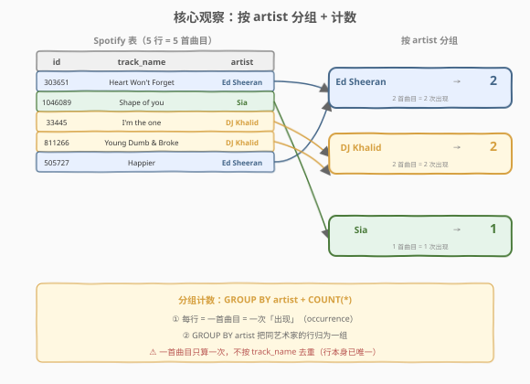
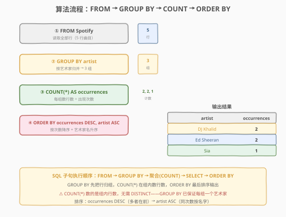
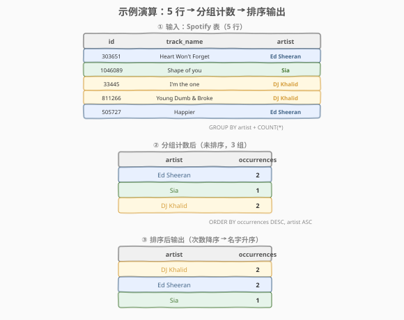

# LeetCode 统计 Spotify 排行榜上艺术家出现次数 题解

## 1. 题目概述

- **标题 / 题号**：统计 Spotify 排行榜上艺术家出现次数（#2669，easy）
- **链接**：https://leetcode.cn/problems/count-artist-occurrences-on-spotify-ranking-list/
- **难度**：简单
- **标签**：数据库、SQL、`GROUP BY`、`COUNT(*)` 聚合、`ORDER BY` 排序、分组计数、LeetCode 锁题

> ⚠️ 本题为 LeetCode 付费题，题意描述根据官方示例用例与 hints 重建，可能与官方题面有出入。

**题意**：给定 `Spotify` 排行榜表，每行记录一首曲目及其演唱艺术家。编写 SQL 查询，统计**每位艺术家在排行榜上出现的次数**（即每位艺术家有几首曲目入榜）。结果包含 `artist`（艺术家名）和 `occurrences`（出现次数）两列，按出现次数降序排列，次数相同者按艺术家名升序排列。

**表结构**：

```text
Table: Spotify
+------------+----------+
| Column Name| Type     |
+------------+----------+
| id         | int      |  ← 主键（曲目编号）
| track_name | varchar  |  ← 曲目名称
| artist     | varchar  |  ← 艺术家名称
+------------+----------+
id 是本表的主键（具有唯一值的列）。
每一行包含一首曲目及其关联艺术家的信息。
```

> 💡 **主键是 `id`**：每行唯一代表一首曲目。同一艺术家可有多首曲目入榜（多行），这正是需要 `GROUP BY artist` 的根因——把同一艺术家的多行归并为一组再计数。

**示例 1**：

```text
输入：
Spotify 表:
+---------+----------------------+------------+
| id      | track_name           | artist     |
+---------+----------------------+------------+
| 303651  | Heart Won't Forget   | Ed Sheeran |
| 1046089 | Shape of you         | Sia        |
| 33445   | I'm the one          | DJ Khalid  |
| 811266  | Young Dumb & Broke   | DJ Khalid  |
| 505727  | Happier              | Ed Sheeran |
+---------+----------------------+------------+

输出：
+------------+------------+
| artist     | occurrences|
+------------+------------+
| DJ Khalid  | 2          |
| Ed Sheeran | 2          |
| Sia        | 1          |
+------------+------------+

解释：
Ed Sheeran 有 2 首曲目入榜（Heart Won't Forget、Happier）。
DJ Khalid 有 2 首曲目入榜（I'm the one、Young Dumb & Broke）。
Sia 有 1 首曲目入榜（Shape of you）。
按次数降序排列，次数相同（2=2）时按艺术家名升序：DJ Khalid 排在 Ed Sheeran 前。
```

**解释拆解**：

| artist | 对应曲目 | 行数 | occurrences |
|--------|---------|------|-------------|
| Ed Sheeran | Heart Won't Forget, Happier | 2 | **2** |
| DJ Khalid | I'm the one, Young Dumb & Broke | 2 | **2** |
| Sia | Shape of you | 1 | **1** |

**约束**：

- `id` 是 `Spotify` 表的主键，每行唯一。
- `track_name` 和 `artist` 为字符串。
- 同一 `artist` 可对应多行（多首曲目）。
- `artist` 列非空（每首曲目必有演唱者）。
- 结果按 `occurrences` 降序、`artist` 升序排列。

> 💡 **审题关键**：① 「出现次数」= 每位艺术家有几**行**（几首曲目），不是去重后的曲目数——`id` 已保证行唯一，`COUNT(*)` 直接数行即可；② 输出列名 `occurrences` 要与题意一致；③ 排序是「次数降序 → 名字升序」二级排序，同次数时按字母序。掌握这三点，本题退化为一行 `SELECT artist, COUNT(*) FROM ... GROUP BY artist ORDER BY ...`。

## 2. 解题思路

### 2.1 暴力思路：逐艺术家遍历计数

最直觉的过程式思维：取出所有不重复的艺术家，对每个艺术家数其在 `Spotify` 表中出现的行数，输出结果。

```text
artists = DISTINCT artist in Spotify
for a in artists:
    occurrences = COUNT(rows where artist == a)
    output (a, occurrences)
sort output by occurrences DESC, artist ASC
```

逻辑完全正确——但 SQL 有更声明式的表达：用 `GROUP BY artist` 一次性把同一艺术家的行归并为一组，再用 `COUNT(*)` 在组内数行数。分组 + 计数 + 排序三步合一，无需显式循环。

> ⚠️ **过程式思维的陷阱**：有人会担心「同一曲目会不会被数多次」——不会。`id` 是主键，每行就是一首不同的曲目，`COUNT(*)` 数的是组内的行数（即曲目数），天然正确。只有当题目要求「不同曲目名」的计数时才需要 `COUNT(DISTINCT track_name)`——但本题问的是「出现次数」（入榜次数），每行即一次出现。

### 2.2 核心观察：分组 + 计数



题目的两个语义——「**按艺术家分组**」和「**数每组有几行**」——分别对应 SQL 的两个机制，叠加即得答案：

| 题意要求 | SQL 机制 | 语义 |
|----------|----------|------|
| 「每位艺术家」 | `GROUP BY artist` | **分组**：把同一 `artist` 的多行归并为一组 |
| 「出现次数」 | `COUNT(*)` | **组内计数**：数每组有几行（每行 = 一次出现） |
| 「次数降序、名字升序」 | `ORDER BY occurrences DESC, artist ASC` | **二级排序**：先按次数降序，同次数按名字升序 |

三步一气呵成：`GROUP BY` 把 5 行归为 3 组，`COUNT(*)` 在每组内数行数得 `{2, 1, 2}`，`ORDER BY` 把结果排序为 `[(DJ Khalid, 2), (Ed Sheeran, 2), (Sia, 1)]`。

$$\text{occurrences}_a = \left| \{\, \text{row} \in \text{Spotify} \mid \text{row.artist} = a \,\} \right|$$

> 💡 **为什么用 `COUNT(*)` 而非 `COUNT(DISTINCT ...)`？** 题目问「出现次数」即入榜的行数。`GROUP BY artist` 已经保证每组内都是同一艺术家的行，`COUNT(*)` 数组内所有行即可——每行就是一次出现，不存在重复。只有当**组内可能有重复行**且需去重时才用 `COUNT(DISTINCT col)`。本题 `id` 是主键，行本身唯一，`COUNT(*)` 天然正确。对照 2082 题（富有客户的数量），那里是「先 `WHERE` 过滤行再 `COUNT(DISTINCT customer_id)`」——因为同一客户的多张富账单需去重；本题是「先 `GROUP BY` 再 `COUNT(*)`」——分组后组内无需去重。**判断口诀**：先过滤后计数用 `COUNT(DISTINCT)`，先分组后计数用 `COUNT(*)`。

> ⚠️ **二级排序的顺序**：`ORDER BY occurrences DESC, artist ASC`——第一关键字 `occurrences DESC`（次数多者在前），第二关键字 `artist ASC`（同次数时按艺术家名字字母序）。漏写第二排序键会导致同次数行顺序不确定，可能不通过判定。

### 2.3 算法流程图



**逻辑执行步骤**：

| 步骤 | 子句 | 作用 |
|------|------|------|
| ① | `FROM Spotify` | 读取全部曲目行（5 行） |
| ② | `GROUP BY artist` | 按艺术家归组（3 组：Ed Sheeran、Sia、DJ Khalid） |
| ③ | `COUNT(*) AS occurrences` | 每组数行数，得出现次数（2, 1, 2） |
| ④ | `ORDER BY occurrences DESC, artist ASC` | 按次数降序 + 名字升序排序输出 |

> 💡 **SQL 子句执行顺序**：`FROM` → `WHERE`（本题无）→ `GROUP BY`（分组）→ 聚合函数 `COUNT(*)`（组内计数）→ `SELECT`（选列 + 命名）→ `ORDER BY`（排序）。理解「`GROUP BY` 先归组，`COUNT` 在组内计数，`ORDER BY` 最后排序」的顺序是关键：先有 3 组，才谈得上每组数行数，最后排序输出。

### 2.4 示例演算

以示例 1 的 5 行曲目为例，观察三阶段处理：



**阶段 ①：输入（`FROM Spotify`）**

5 行曲目，每行的 `artist` 列决定其归属分组：

| 行 | id | track_name | artist | 归属组 |
|----|----|-----------|--------|--------|
| 1 | 303651 | Heart Won't Forget | Ed Sheeran | Ed Sheeran |
| 2 | 1046089 | Shape of you | Sia | Sia |
| 3 | 33445 | I'm the one | DJ Khalid | DJ Khalid |
| 4 | 811266 | Young Dumb & Broke | DJ Khalid | DJ Khalid |
| 5 | 505727 | Happier | Ed Sheeran | Ed Sheeran |

**阶段 ②：分组计数（`GROUP BY artist` + `COUNT(*)`）**

`GROUP BY artist` 把 5 行按 `artist` 值归并，同一 `artist` 的行进同一组：

| 分组 | 组内行 | 组内行数 (`COUNT(*)`) |
|------|--------|----------------------|
| Ed Sheeran | 行 1, 行 5 | 2 |
| Sia | 行 2 | 1 |
| DJ Khalid | 行 3, 行 4 | 2 |

此时结果（未排序）：`[(Ed Sheeran, 2), (Sia, 1), (DJ Khalid, 2)]`。

> 💡 **分组的本质**：`GROUP BY artist` 等价于「按 `artist` 列的值做哈希分桶」——相同 `artist` 值的行落入同一桶。桶数 = 不同 `artist` 值的个数（本题 3 个）。`COUNT(*)` 在每个桶内数行数。理解这点，所有「分组 + 聚合」题都能套用此骨架。

**阶段 ③：排序输出（`ORDER BY occurrences DESC, artist ASC`）**

对 3 组结果按 `occurrences` 降序、`artist` 升序排列：

| 排序前 | occurrences | artist | 排序后 |
|--------|-------------|--------|--------|
| (Ed Sheeran, 2) | 2 | "Ed Sheeran" | ②（2 次，E > D，排第 2） |
| (Sia, 1) | 1 | "Sia" | ③（1 次，最少，排最后） |
| (DJ Khalid, 2) | 2 | "DJ Khalid" | ①（2 次，D < E，排第 1） |

最终输出：`[(DJ Khalid, 2), (Ed Sheeran, 2), (Sia, 1)]`。

> ⚠️ **同次数时按名字排序**：DJ Khalid 和 Ed Sheeran 都是 2 次，按 `artist ASC` 排序时比较字符串 "DJ Khalid" < "Ed Sheeran"（首字母 'D' < 'E'），故 DJ Khalid 排前。漏写 `artist ASC` 会导致这两个的顺序不确定。

## 3. 参考代码

### SQL（解法 A：`GROUP BY` + `COUNT(*)`，推荐）

```sql
SELECT artist, COUNT(*) AS occurrences
FROM Spotify
GROUP BY artist
ORDER BY occurrences DESC, artist ASC;
```

> 💡 **写法要点**：
> - `GROUP BY artist`：按艺术家分组，同一 `artist` 的多行归为一组。
> - `COUNT(*)`：数每组内的行数（每行 = 一次出现）。组内行已由 `GROUP BY` 归并，无需 `DISTINCT`。
> - `AS occurrences`：列别名必须与题目要求的输出列名一致。
> - `ORDER BY occurrences DESC, artist ASC`：二级排序——次数降序为主，名字升序为辅。
> - ✓ **最自然**：`GROUP BY` 表达「每位艺术家」，`COUNT(*)` 表达「出现次数」，`ORDER BY` 表达「排序」，语义一气呵成。

### SQL（解法 B：子查询 + 外层排序，思路对照）

```sql
SELECT artist, occurrences
FROM (
    SELECT artist, COUNT(*) AS occurrences
    FROM Spotify
    GROUP BY artist
) t
ORDER BY occurrences DESC, artist ASC;
```

> 💡 **解法 B 的思路**：子查询先 `GROUP BY artist` + `COUNT(*)` 得到每位艺术家的出现次数，外层再 `ORDER BY` 排序。逻辑与解法 A 完全等价，只是把「计数」和「排序」拆到内外两层。MySQL 等数据库允许在 `SELECT` 层用列别名做 `ORDER BY`（解法 A），故解法 A 更紧凑；解法 B 展示了「子查询产出中间表 + 外层消费」的通用骨架，适合需在外层做更多处理时（如 `WHERE occurrences > 1` 筛选）。

### SQL（解法 C：`COUNT(id)` 替代 `COUNT(*)`，等价写法）

```sql
SELECT artist, COUNT(id) AS occurrences
FROM Spotify
GROUP BY artist
ORDER BY occurrences DESC, artist ASC;
```

> 💡 **解法 C 的思路**：用 `COUNT(id)` 替代 `COUNT(*)`。因为 `id` 是主键（非空且唯一），`COUNT(id)` 与 `COUNT(*)` 完全等价——都数组内行数。`COUNT(*)` 数所有行（含 NULL），`COUNT(id)` 数 `id` 非 NULL 的行；主键非空，两者结果相同。优先选 `COUNT(*)`——它是 SQL 中表达「数行数」的惯用写法，不依赖某列非空的前提，更通用。

### Python（pandas）

```python
import pandas as pd

def count_artist_occurrences(spotify: pd.DataFrame) -> pd.DataFrame:
    result = (spotify.groupby('artist')
              .size()
              .reset_index(name='occurrences')
              .sort_values(['occurrences', 'artist'], ascending=[False, True]))
    return result[['artist', 'occurrences']]
```

> 💡 **pandas 对照**：
> - `spotify.groupby('artist')` 对应 SQL 的 `GROUP BY artist`，按 `artist` 列分组。
> - `.size()` 对应 `COUNT(*)`，返回每组的行数（Series，索引为 `artist`）。
> - `.reset_index(name='occurrences')` 把 Series 转为 DataFrame，列名设为 `occurrences`。
> - `.sort_values(['occurrences', 'artist'], ascending=[False, True])` 对应 `ORDER BY occurrences DESC, artist ASC`——`ascending=[False, True]` 表示第一列降序、第二列升序。
> - 注意 `.size()` 返回的是行数（含所有行），与 `COUNT(*)` 行为一致；若需去重可用 `.nunique()`。

## 4. 复杂度分析

| 维度 | 解法 A（`GROUP BY`+`COUNT(*)`） | 解法 B（子查询） | 解法 C（`COUNT(id)`） | pandas |
|------|-------------------------------|-----------------|----------------------|--------|
| **时间** | $O(n \log k)$ | $O(n \log k)$ | $O(n \log k)$ | $O(n \log k)$ |
| **空间** | $O(k)$ | $O(k)$ | $O(k)$ | $O(n)$ |
| **写法** | 紧凑一步到位 | 内外两层 | 等价变体 | DataFrame |
| **推荐度** | ✓ **首选** | ✓ 骨架可扩展 | ✓ 等价 | ✓ 验证用 |

> - $n$ = `Spotify` 表行数，$k$ = 不同艺术家数（$k \le n$）
> - **时间**：全表扫描一次 $O(n)$ + 分组聚合 $O(k)$ + 排序 $O(k \log k)$。因 $k \le n$，总体 $O(n \log k)$。若 `artist` 列有索引，`GROUP BY` 可走索引扫描，降至 $O(\log n + n)$（索引范围扫描 + 聚合）。
> - **空间**：分组需物化 $k$ 组的聚合结果 $O(k)$；pandas 需 $O(n)$ 存 DataFrame。
> - **索引优化**：在 `artist` 列建索引可加速分组（索引有序，扫描即可分组）；若查询频繁且只取 `artist` + 计数，可建 `(artist, id)` 复合索引实现 index-only scan（覆盖索引），避免回表。

## 5. 扩展：`COUNT(*)` vs `COUNT(col)` vs `COUNT(DISTINCT col)`

### 5.1 `COUNT` 的四种形态

`COUNT` 是 SQL 中最易混淆的聚合函数，四种写法语义截然不同：

| 写法 | 计数对象 | 是否去重 | 是否忽略 NULL | 示例（组内 3 行，artist 全相同） |
|------|---------|---------|--------------|----------------------------------|
| `COUNT(*)` | **所有行**（含 NULL） | ✗ | ✗（数所有行） | 3 |
| `COUNT(id)` | `id` 非 NULL 的行 | ✗ | ✓ | 3（主键非空） |
| `COUNT(DISTINCT track_name)` | `track_name` 的**不同值** | ✓ | ✓ | 看曲目名是否重复 |
| `COUNT(1)` | 所有行（`1` 是常量非 NULL） | ✗ | ✗ | 3 |

> 💡 **本题为什么用 `COUNT(*)`**：题目问「出现次数」即入榜行数。`GROUP BY artist` 已保证组内全为同一艺术家的行，`COUNT(*)` 数组内所有行即得出现次数。`COUNT(id)` 因主键非空也等价。只有当题目要求「不同曲目名的数量」时才需 `COUNT(DISTINCT track_name)`——但本题问的是「出现次数」（入榜次数），每行即一次出现。**判断口诀**：问「行数」用 `COUNT(*)`，问「某列非空值个数」用 `COUNT(col)`，问「某列不同值个数」用 `COUNT(DISTINCT col)`。

### 5.2 分组 vs 过滤：`GROUP BY` 与 `WHERE` 的分工

「按艺术家计数」和「筛出特定艺术家」是两种不同的操作，对应 SQL 的不同子句：

| 操作 | SQL 子句 | 语义 | 示例 |
|------|---------|------|------|
| **分组计数** | `GROUP BY artist` + `COUNT(*)` | 把行按 `artist` 归组，每组数行数 | 统计每位艺术家的曲目数 |
| **行级过滤** | `WHERE artist = 'Ed Sheeran'` | 筛出特定艺术家的行 | 只看 Ed Sheeran 的曲目 |

> 💡 **选择原则**：① 要「分组后对每组做聚合」（如每组计数、每组求和）→ 用 `GROUP BY`；② 要「按条件筛行」（如只看某艺术家）→ 用 `WHERE`；③ 两者可叠加：`WHERE year = 2024 GROUP BY artist`（先筛 2024 年的行，再按艺术家分组计数）。本题是纯分组计数，无过滤条件，故只用 `GROUP BY`。

### 5.3 变体：若题目改为「只输出出现次数 ≥ 2 的艺术家」

若题目加一个「只保留出现至少 2 次的艺术家」条件，需引入 `HAVING`（组级过滤）：

```sql
SELECT artist, COUNT(*) AS occurrences
FROM Spotify
GROUP BY artist
HAVING COUNT(*) >= 2
ORDER BY occurrences DESC, artist ASC;
```

> 💡 这正是 `GROUP BY` 骨架的扩展——当条件从「行级」（单行属性）升级为「组级」（聚合后的属性）时，`WHERE` 无法表达（`WHERE` 在 `GROUP BY` 之前执行，此时还没有组），必须用 `HAVING`（在 `GROUP BY` 之后执行，对组做过滤）。理解「行级条件用 `WHERE`，组级条件用 `HAVING`」的分工，是 SQL 查询设计的基础认知。

## 6. 面试要点

1. **为什么用 `COUNT(*)` 而非 `COUNT(DISTINCT artist)`？**

   > `GROUP BY artist` 已经把行按 `artist` 归组——每组内的 `artist` 值都相同，`COUNT(*)` 数组内行数即得出现次数。`COUNT(DISTINCT artist)` 在组内对 `artist` 去重计数——但组内 `artist` 全相同，去重后恒为 1，答案是 1 而非实际行数，完全错误。**口诀**：分组后组内无需再按分组键去重。

2. **`ORDER BY occurrences DESC, artist ASC` 中两个排序键的顺序能否颠倒？**

   > 不能。第一关键字是 `occurrences DESC`（按次数降序），第二关键字是 `artist ASC`（同次数按名字升序）。若写成 `ORDER BY artist ASC, occurrences DESC`，则变成「先按名字排序，再按次数排序」——名字是主排序键，次数是辅，结果完全不同。`ORDER BY` 中列的先后即优先级，前者为主、后者为辅。

3. **如果 `Spotify` 表很大（数亿行），如何优化？**

   > 在 `artist` 列建索引，使 `GROUP BY artist` 走索引扫描——索引天然按 `artist` 有序，扫描即可分组，避免全表扫描 + 哈希聚合。进一步可建 `(artist, id)` 复合索引实现 index-only scan（覆盖索引）——查询只需访问索引即可得到 `artist` 分组 + 行数（索引项计数），无需回表读数据行。面试中提到「`artist` 列建索引把分组从 $O(n)$ 哈希聚合优化为 $O(\log n + n)$ 索引有序扫描」即可。

4. **`GROUP BY` 和 `DISTINCT` 有什么区别？**

   > `GROUP BY` 是「分组 + 聚合」——把行按某列归组后，可对每组做聚合运算（`COUNT`、`SUM`、`AVG` 等），输出每组一行 + 聚合值。`DISTINCT` 是「去重」——只去除结果中的重复行，不做聚合。本题需要「分组后计数」，必须用 `GROUP BY`；若只需「所有不同艺术家名单」（不要计数），则 `SELECT DISTINCT artist FROM Spotify` 即可。`GROUP BY` 在「只去重不聚合」时与 `DISTINCT` 等价，但 `GROUP BY` 更强大——它能做聚合。

5. **为什么 `COUNT(*)` 不需要 `DISTINCT`，而 2082 题需要？**

   > 关键区别在「分组」与「过滤」的顺序。本题是「先 `GROUP BY artist` 再 `COUNT(*)`」——分组后组内行已是同一艺术家，`COUNT(*)` 数行数即可，无需去重。2082 题是「先 `WHERE amount > 500` 过滤行再 `COUNT(DISTINCT customer_id)`」——过滤后同一客户可能有多张富账单（多行），直接 `COUNT(*)` 会重复计数，必须 `DISTINCT`。**判断口诀**：先分组后计数用 `COUNT(*)`，先过滤后计数用 `COUNT(DISTINCT)`——前者分组保证唯一，后者过滤后可能有重复。

> 💡 **一句话总结**：2669 是 SQL **"分组计数入门招牌题"**——核心就一句 `SELECT artist, COUNT(*) AS occurrences FROM Spotify GROUP BY artist ORDER BY occurrences DESC, artist ASC`。考点覆盖三要素：**分组（`GROUP BY artist`，同艺术家归组）、组内计数（`COUNT(*)`，数行数无需 DISTINCT）、二级排序（`occurrences DESC, artist ASC`，次数降序 + 名字升序）**。理解「分组后组内无需去重」「排序键顺序即优先级」这两点，所有「分组 + 计数 + 排序」类 SQL 题都能覆盖。

## 同类练习题

| # | 题目 | 与本题的关联 |
|---|------|-------------|
| 596 | [超过 5 名学生的课](https://leetcode.cn/problems/classes-with-at-least-5-students/) | `GROUP BY` + `HAVING COUNT(*) >= 5` 组级过滤——在 2669 的分组计数骨架上叠加 `HAVING`，从「数所有组」到「只留满足条件的组」 |
| 1757 | [可回收且低脂的产品](https://leetcode.cn/problems/recyclable-and-low-fat-products/) | `WHERE` 双布尔条件 + `COUNT`——对照 2669 理解「行级过滤后计数」与「分组后计数」的区别（前者无 `GROUP BY`，后者有） |
| 1148 | [文章浏览 I](https://leetcode.cn/problems/article-views-i/) | `WHERE` 等值过滤 + `DISTINCT` 去重——对照 2669 理解「去重列出不同值」与「分组计数」的区别（`DISTINCT` 不做聚合，`GROUP BY` 可做聚合） |
| 2082 | [富有客户的数量](https://leetcode.cn/problems/the-number-of-rich-customers/)（[题解](../2001-2100/2082_富有客户的数量.md)） | `WHERE` + `COUNT(DISTINCT customer_id)`——对照 2669 的「先分组后 `COUNT(*)`」，2082 是「先过滤后 `COUNT(DISTINCT)`」，辨析两种计数路径的去重需求差异 |
