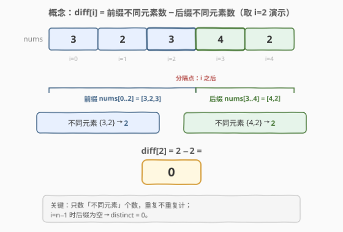
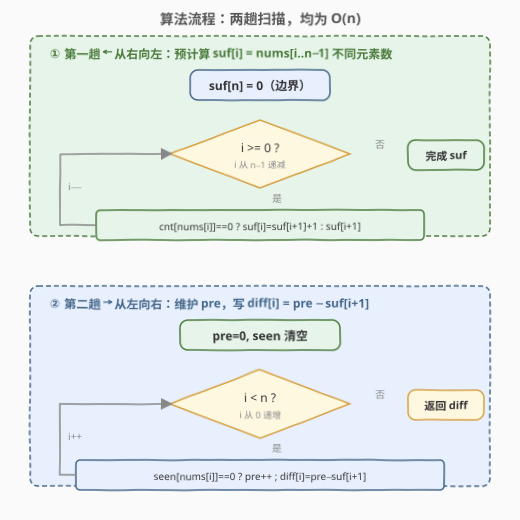

# 找出不同元素数目差数组

- **题目名称**：找出不同元素数目差数组
- **链接**：[2670. 找出不同元素数目差数组](https://leetcode.cn/problems/find-the-distinct-difference-array/)
- **难度**：简单
- **标签**：数组、哈希表

## 1. 题目概述

给你一个下标从 **0** 开始的数组 `nums`，长度为 $n$。定义 `nums` 的**不同元素数目差**数组 `diff`，其中：

$$
\text{diff}[i] = \text{prefixDistinct}(i) - \text{suffixDistinct}(i)
$$

- $\text{prefixDistinct}(i)$：前缀 $\text{nums}[0, \dots, i]$ 中**不同元素**的数目；
- $\text{suffixDistinct}(i)$：后缀 $\text{nums}[i+1, \dots, n-1]$ 中**不同元素**的数目。

返回该数组 `diff`。注意当 $i > j$ 时 $\text{nums}[i, \dots, j]$ 表示空子数组（故 $i = n-1$ 时后缀为空，不同元素数为 $0$）。

**示例 1**：

```text
输入：nums = [1,2,3,4,5]
输出：[-3,-1,1,3,5]
解释：
i=0：前缀 {1}→1，后缀 {2,3,4,5}→4，diff[0]=1-4=-3
i=1：前缀 {1,2}→2，后缀 {3,4,5}→3，diff[1]=2-3=-1
i=2：前缀 {1,2,3}→3，后缀 {4,5}→2，diff[2]=3-2=1
i=3：前缀 {1,2,3,4}→4，后缀 {5}→1，diff[3]=4-1=3
i=4：前缀 {1,2,3,4,5}→5，后缀 {}→0，diff[4]=5-0=5
```

**示例 2**：

```text
输入：nums = [3,2,3,4,2]
输出：[-2,-1,0,2,3]
解释：
i=0：前缀 {3}→1，后缀 {2,3,4,2}→3，diff[0]=1-3=-2
i=1：前缀 {3,2}→2，后缀 {3,4,2}→3，diff[1]=2-3=-1
i=2：前缀 {3,2}（3 重复）→2，后缀 {4,2}→2，diff[2]=2-2=0
i=3：前缀 {3,2,4}→3，后缀 {2}→1，diff[3]=3-1=2
i=4：前缀 {3,2,4}（2 重复）→3，后缀 {}→0，diff[4]=3-0=3
```

**约束条件**：

- $1 \le n = \text{nums.length} \le 50$
- $1 \le \text{nums}[i] \le 50$

> 💡 两个关键信号：① 值域 $\text{nums}[i] \le 50$ 极小，可用定长数组当「集合」做 $O(1)$ 增删查；② `diff[i]` = 两个「不同元素数」之差，而「不同元素数」可沿前缀/后缀**增量维护**——无须每个 $i$ 重建集合。

---

## 2. 解题思路

### 2.1 暴力思路：逐位重建前后缀集合

最直白的写法：对每个 $i$，把 $\text{nums}[0..i]$ 与 $\text{nums}[i+1..n-1]$ 各自建成集合，取大小相减。

```text
for i in 0..n-1:
    pre = |set(nums[0..i])|
    suf = |set(nums[i+1..n-1])|
    diff[i] = pre - suf
```

逻辑没错，但每个 $i$ 都从零切两次子数组、建两次集合，时间 $O(n^2)$。在 $n \le 50$ 下虽能过，却浪费了两条可增量维护的性质：

1. **前缀的累积性**：$\text{nums}[0..i]$ 与 $\text{nums}[0..i-1]$ 只差一个元素，无需每次重建集合，遇到新元素就让前缀计数 `+1`；
2. **后缀也可预计算**：后缀 $\text{nums}[i+1..n-1]$ 随 $i$ 增大而**收缩**，但从右向左看恰是「前缀的累积性」——只要预先从右到左扫一遍，就能一次性得到每个位置的后缀不同元素数。

> ⚠️ 本题真正的考点是：发现「后缀不同元素数」可由一次从右向左的扫描预计算，从而把 $n$ 次独立求交压缩成两次线性扫描。

### 2.2 核心观察：两趟扫描，前缀增量 + 后缀预算



把 `diff[i]` 拆成两个可独立线性维护的量：

- **后缀不同元素数 $\text{suf}[i]$**：定义为 $\text{nums}[i..n-1]$ 中不同元素的数目，并令 $\text{suf}[n] = 0$（空后缀）。那么 $\text{diff}[i]$ 里的后缀项就是 $\text{suf}[i+1]$。
- **前缀不同元素数 $\text{pre}$**：从左到右扫描，遇到首次出现的元素就 `pre += 1`。

**第一趟（从右向左）填 $\text{suf}$**：用一个值域计数数组 $\text{cnt}[1..50]$ 记录后缀中各值是否已出现。从 $i = n-1$ 往左走：

$$
\text{suf}[i] = \begin{cases} \text{suf}[i+1] + 1, & \text{若 } \text{nums}[i] \text{ 此前在后缀中未出现（cnt 为 0）} \\ \text{suf}[i+1], & \text{否则} \end{cases}
$$

并在任何情况下把 $\text{cnt}[\text{nums}[i]]$ 置为已出现。这一趟过后，每个位置的后缀不同元素数都备好了。

**第二趟（从左向右）写 $\text{diff}$**：用另一个计数数组 $\text{seen}[1..50]$ 维护前缀出现情况，$\text{pre} = 0$。对 $i = 0 \dots n-1$：

- 若 $\text{nums}[i]$ 首次出现，$\text{pre} \mathrel{+}= 1$，并标记 $\text{seen}$；
- $\text{diff}[i] = \text{pre} - \text{suf}[i+1]$。

| 观察 | 含义 |
|------|------|
| **后缀随 $i$ 增大而收缩** | 但从右端看是「逐个加入」，于是 $\text{suf}[i]$ 可由 $\text{suf}[i+1]$ 加一个 0/1 增量得到，无须重建 |
| **值域 $\le 50$ 可用定长数组当集合** | 用 $\text{cnt}/\text{seen}$ 数组（大小 51）做 $O(1)$ 查改，避免哈希集合开销；对任意值域换哈希表即可 |
| **前后缀用两套计数器** | 第一趟的 $\text{cnt}$ 只服务后缀预算，第二趟的 $\text{seen}$ 只服务前缀，互不污染 |

> 💡 **为什么不一趟搞定？** 因为后缀不同元素数依赖「未来」元素，单次从左到右无法得知。但「从右向左」时后缀的「未来」恰是已扫过的部分——故先反向预算后缀、再正向算前缀，两趟各 $O(n)$。

### 2.3 算法流程图



两趟均为单重循环、每步 $O(1)$：

1. 初始化 $\text{suf}[n] = 0$，$\text{cnt}[1..50] = 0$；
2. **第一趟** $i$ 从 $n-1$ 递减到 $0$：若 $\text{cnt}[\text{nums}[i]] == 0$ 则 $\text{suf}[i] = \text{suf}[i+1] + 1$，否则 $\text{suf}[i] = \text{suf}[i+1]$；置 $\text{cnt}[\text{nums}[i]] = 1$；
3. 初始化 $\text{seen}[1..50] = 0$，$\text{pre} = 0$；
4. **第二趟** $i$ 从 $0$ 递增到 $n-1$：若 $\text{seen}[\text{nums}[i]] == 0$ 则 $\text{pre} \mathrel{+}= 1$、置 $\text{seen}[\text{nums}[i]] = 1$；$\text{diff}[i] = \text{pre} - \text{suf}[i+1]$；
5. 返回 $\text{diff}$。

> 💡 `suf` 数组长 $n+1$，用 $\text{suf}[i+1]$ 取后缀项时 $i = n-1$ 自然落到 $\text{suf}[n] = 0$，无需对空后缀特判——这是「哨兵边界」消分支的常见手法。

### 2.4 示例演算

![示例演算：nums=[3,2,3,4,2] 逐位追踪 pre / suf / diff](../images/p2670_example_walkthrough.svg)

以**示例 2** $\text{nums} = [3,2,3,4,2]$ 追踪。先反向填 $\text{suf}$（从右往左累计不同元素）：$\text{suf} = [3,3,3,2,1,0]$（$\text{suf}[0]=3$ 对应 $\{3,2,4\}$、$\text{suf}[2]$ 含 $\{3,4,2\}$ 也是 $3$、$\text{suf}[3]=2$ 对应 $\{4,2\}$，重复值不增量）。再正向算前缀与 $\text{diff}$：

| $i$ | nums[i] | 前缀不同元素 | $\text{pre}$ | $\text{suf}[i+1]$ | $\text{diff}[i]$ |
|:---:|:-------:|:------------:|:------------:|:------------------:|:-----------------:|
| 0 | 3 | {3} | 1 | 3 | $1-3 = -2$ |
| 1 | 2 | {3,2} | 2 | 3 | $2-3 = -1$ |
| 2 | 3 | {3,2}（3 重复） | 2 | 2 | $2-2 = 0$ |
| 3 | 4 | {3,2,4} | 3 | 1 | $3-1 = 2$ |
| 4 | 2 | {3,2,4}（2 重复） | 3 | 0 | $3-0 = 3$ |

最终 $\text{diff} = [-2, -1, 0, 2, 3]$，与示例一致 ⭐。

> 💡 看点：$i=2$ 处 $\text{nums}[2]=3$ 与前缀已有重复，$\text{pre}$ 不增（停在 2），而后缀 $\text{suf}[3]=2$ 恰等于 $\text{pre}$，差为 $0$——这正是「重复元素既不增前缀也不增后缀」的对称体现。

---

## 3. 参考代码

### C++（两趟扫描 + 值域计数数组，$O(n)$ / $O(n)$）

```cpp
class Solution {
public:
    vector<int> distinctDifferenceArray(vector<int>& nums) {
        int n = nums.size();
        const int M = 51;
        vector<int> suf(n + 1, 0), cnt(M, 0);   // suf[i] = nums[i..n-1] 不同元素数
        for (int i = n - 1; i >= 0; --i) {
            if (cnt[nums[i]]++ == 0) suf[i] = suf[i + 1] + 1;  // 首次在后缀出现
            else                     suf[i] = suf[i + 1];
        }
        vector<int> diff(n), seen(M, 0);
        int pre = 0;
        for (int i = 0; i < n; ++i) {
            if (seen[nums[i]]++ == 0) ++pre;                    // 首次在前缀出现
            diff[i] = pre - suf[i + 1];
        }
        return diff;
    }
};
```

> 💡 `cnt[nums[i]]++ == 0` 用后置自增：返回自增**前**的旧值，旧值为 0 即「该值此前未出现」——把「查 + 标记」压成一句。`suf` 长 $n+1$，下标 $i+1$ 越过 $n-1$ 时取到哨兵 $\text{suf}[n]=0$，免去空后缀特判。

### Python（两趟扫描 + 值域计数数组，$O(n)$ / $O(n)$）

```python
class Solution:
    def distinctDifferenceArray(self, nums: List[int]) -> List[int]:
        n = len(nums)
        suf = [0] * (n + 1)          # suf[i] = nums[i..n-1] 不同元素数，suf[n]=0
        seen = [0] * 51
        for i in range(n - 1, -1, -1):
            if seen[nums[i]] == 0:
                suf[i] = suf[i + 1] + 1
            else:
                suf[i] = suf[i + 1]
            seen[nums[i]] = 1

        diff = []
        seen = [0] * 51
        pre = 0
        for i in range(n):
            if seen[nums[i]] == 0:
                pre += 1
                seen[nums[i]] = 1
            diff.append(pre - suf[i + 1])
        return diff
```

> ⚠️ Python 版刻意把 `seen` 在两趟之间重新初始化——第一趟的 `seen` 只记后缀出现情况，第二趟要从前缀零状态重新累计，二者语义不同，不能共用同一张表。

---

## 4. 复杂度分析

| 维度 | 复杂度 | 说明 |
|------|--------|------|
| **时间复杂度** | $O(n)$ | 两趟扫描各一遍，每步 $O(1)$ 的查改与加减 |
| **空间复杂度** | $O(n + V)$ | $\text{suf}$ 数组 $O(n)$ + 值域计数数组 $O(V)$，$V=50$；输出数组不计额外空间 |
| 对照：暴力重建集合 | $O(n^2)$ 时间 / $O(n)$ 空间 | 每个 $i$ 切两次子数组、建两次集合，未利用累积性与后缀可预算 |

> 💡 $O(n)$ 已是最优：$\text{diff}$ 有 $n$ 项必须逐个产出，下界 $\Omega(n)$。后缀预算用一次反向扫描消去了 $n$ 次重复求不同元素数，是本题唯一非平凡的优化点。

---

## 5. 扩展：位掩码 + popcount

值域 $\text{nums}[i] \le 50$ 时，出现情况可压进一个 64 位整数：第 $x$ 位为 1 表示 $x$ 已出现。`bit_count()` 直接给出不同元素数，省去计数数组与 `if` 分支。

```python
class Solution:
    def distinctDifferenceArray(self, nums: List[int]) -> List[int]:
        n = len(nums)
        suf = [0] * (n + 1)
        mask = 0
        for i in range(n - 1, -1, -1):
            mask |= 1 << nums[i]
            suf[i] = mask.bit_count()
        diff = []
        mask = 0
        for i in range(n):
            mask |= 1 << nums[i]
            diff.append(mask.bit_count() - suf[i + 1])
        return diff
```

- `mask |= 1 << nums[i]` 把「标记出现」与「去重」合为按位或——重复置位不改变掩码；
- `mask.bit_count()` 直接给出当前不同元素数，无需维护 `pre`/`++` 分支。

| 对比 | 值域计数数组 | 位掩码 |
|------|--------------|--------|
| 时间 | $O(n)$ | $O(n)$（`bit_count` 为单指令级） |
| 空间 | $O(n+V)$（suf + 计数数组） | $O(n)$（suf + 两个 64 位整数） |
| 通用性 | 任意值域（换哈希表） | 受限于掩码位数（$V \le 63$） |
| 分支 | 显式 `if 首次出现` 判定 | 隐式：按位或天然幂等，无分支 |

> 💡 位掩码版把「首次出现判定」换成「按位或 + popcount」，更短更优雅；但**仅当值域 $\le 63$** 时可用一个机器字承载。计数数组版对任意值域（题目改为 $\text{nums}[i]$ 可达 $10^9$）依然成立——只需把定长数组换成哈希集合。面试可先给计数数组版（讲清「后缀为何可预算」），再点出位掩码版体现对数据规模的敏感度。

---

## 6. 面试要点

1. **为什么后缀不同元素数可以预先线性算出？**

   > 因为 $\text{suf}[i] = \text{nums}[i..n-1]$ 的不同元素数，而 $\text{nums}[i..n-1]$ 与 $\text{nums}[i+1..n-1]$ 只差 $\text{nums}[i]$ 一个元素。从右向左扫时，$\text{suf}[i+1]$ 已知，$\text{nums}[i]$ 是否为「新成员」一次查表可知，故 $\text{suf}[i] = \text{suf}[i+1] + (\text{nums}[i] \text{ 是否首次出现})$，单趟能填完整张表。

2. **为什么前缀不同元素数不能也预算、必须正向算？**

   > 也能预算，但前缀本就随 $i$ 增大而**扩张**，正向扫描时自然增量维护即可，无需额外一趟。把前缀正向增量、后缀反向预算，刚好两趟同向衔接，逻辑最清晰。若强行预算前缀再用反向写答案，反而不直观。

3. **暴力集合解法哪里浪费了？**

   > 每个 $i$ 都对 $\text{nums}[0..i]$ 与 $\text{nums}[i+1..n-1]$ 重新切片建集合，时间 $O(n^2)$，既未利用前缀累积性（相邻前缀只差一个元素），也未利用后缀可预算性。两趟扫描把两处浪费都消除：后缀一次预算 + 前缀增量维护，降到 $O(n)$。

4. **`suf` 数组为什么开 $n+1$？**

   > 为了让 $i = n-1$ 取 $\text{suf}[i+1] = \text{suf}[n]$ 时落到哨兵 $0$，对应空后缀不同元素数为 $0$，无需特判。这是「多开一位边界值」消分支的常见技巧，与 304/303 等前缀和题里 `prefix[0]=0` 同源。

5. **若值域不限于 50（如 $\text{nums}[i] \le 10^9$）怎么办？**

   > 把定长计数数组 $\text{cnt}/\text{seen}$ 换成哈希集合 `set`，查/改仍 $O(1)$ 均摊，整体仍 $O(n)$。位掩码版失效（一个机器字装不下），故计数数组/哈希集合是更通用的范式；位掩码仅在值域极小时更省空间。

> 💡 **一句话总结**：2670 = 「后缀反向预算 + 前缀正向增量」两次线性扫描，$\text{diff}[i] = \text{pre} - \text{suf}[i+1]$；值域 $\le 50$ 用定长数组当集合，$O(n)$ 时间、$O(n)$ 空间。

---

## 7. 同类练习题

- [2574. 左侧右侧求和差值](https://leetcode.cn/problems/left-and-right-sum-differences/)（[题解](../2501-2600/2574_左侧右侧求和差值.md)）：同样的「左侧 − 右侧」差结构，把「不同元素数」换成「元素和」，前缀和/后缀和两次线性扫描，对照最简形态
- [2657. 找到两个数组的前缀公共数组](https://leetcode.cn/problems/find-the-prefix-common-array-of-two-arrays/)（[题解](../2601-2700/2657_找到两个数组的前缀公共数组.md)）：同样用值域计数数组增量维护「不同/公共元素数」，对照「计数驱动决策」范式
- [2640. 一个数组所有前缀的分数](https://leetcode.cn/problems/find-the-score-of-all-prefixes-of-an-array/)（[题解](../2601-2700/2640_一个数组所有前缀的分数.md)）：同样逐前缀增量计算并填入结果数组，对照「前缀累积维护」通用骨架
- [448. 找到所有数组中消失的数字](https://leetcode.cn/problems/find-all-numbers-disappeared-in-an-array/)（[题解](../0401-0500/448_找到所有数组中消失的数字.md)）：同样利用「值域 $\le n$」用定长数组/下标当哈希键做 $O(1)$ 标记，对照「值域受限即数组当集合」
- [187. 重复的 DNA 序列](https://leetcode.cn/problems/repeated-dna-sequences/)（[题解](../0101-0200/187_重复的DNA序列.md)）：位掩码编码 + 哈希计数的经典题，对照第 5 节「位掩码替代计数数组」的扩展思路
