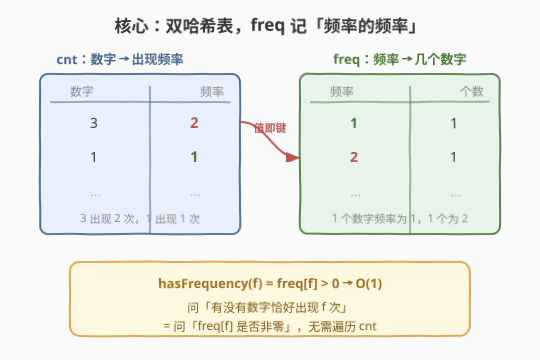
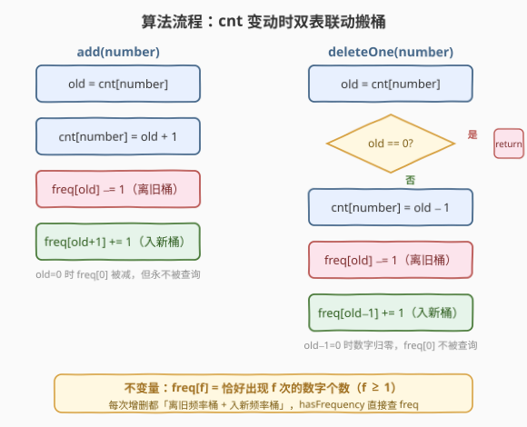
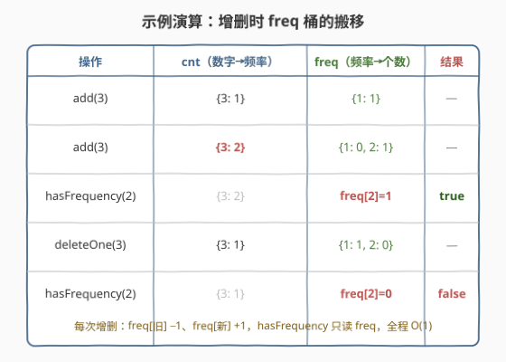

# LeetCode 频率跟踪器 题解

## 1. 题目概述

- **标题 / 题号**：频率跟踪器（#2671，medium）
- **链接**：https://leetcode.cn/problems/frequency-tracker/
- **难度**：中等
- **标签**：设计、哈希表

**题意**：请设计并实现一个能够对其中的值进行跟踪的数据结构，并支持对频率相关查询进行应答。

实现 `FrequencyTracker` 类：

- `FrequencyTracker()`：使用一个空集合初始化 `FrequencyTracker` 对象。
- `void add(int number)`：将一个 `number` 添加到数据结构中。
- `void deleteOne(int number)`：从数据结构中删除一个 `number`。数据结构**可能不包含** `number`，此时不删除任何内容。
- `bool hasFrequency(int frequency)`：如果数据结构中存在出现 `frequency` 次的数字，则返回 `true`，否则返回 `false`。

> 💡 **审题关键**：注意被跟踪的不是「某个数字出现了几次」，而是「有没有任意一个数字恰好出现了 `frequency` 次」。`add`/`deleteOne` 改变的是各数字的出现次数，`hasFrequency` 问的是「频率 `f` 这个桶里有没有数字」——这正是需要额外维护「频率的频率」的根因。

**示例 1**：

```text
输入
["FrequencyTracker", "add", "add", "hasFrequency"]
[[], [3], [3], [2]]
输出
[null, null, null, true]

解释
FrequencyTracker frequencyTracker = new FrequencyTracker();
frequencyTracker.add(3);            // 数据结构现在包含 [3]
frequencyTracker.add(3);            // 数据结构现在包含 [3, 3]
frequencyTracker.hasFrequency(2);   // 返回 true，因为 3 出现 2 次
```

**示例 2**：

```text
输入
["FrequencyTracker", "add", "deleteOne", "hasFrequency"]
[[], [1], [1], [1]]
输出
[null, null, null, false]

解释
FrequencyTracker frequencyTracker = new FrequencyTracker();
frequencyTracker.add(1);            // 数据结构现在包含 [1]
frequencyTracker.deleteOne(1);      // 数据结构现在为空 []
frequencyTracker.hasFrequency(1);   // 返回 false，因为数据结构为空
```

**示例 3**：

```text
输入
["FrequencyTracker", "hasFrequency", "add", "hasFrequency"]
[[], [2], [3], [1]]
输出
[null, false, null, true]

解释
FrequencyTracker frequencyTracker = new FrequencyTracker();
frequencyTracker.hasFrequency(2);   // 返回 false，因为数据结构为空
frequencyTracker.add(3);           // 数据结构现在包含 [3]
frequencyTracker.hasFrequency(1);  // 返回 true，因为 3 出现 1 次
```

**约束**：

- `1 <= number <= 10^5`
- `1 <= frequency <= 10^5`
- 最多调用 `add`、`deleteOne` 和 `hasFrequency` 共计 `2 * 10^5` 次

> ⚠️ **调用规模决定必须 O(1)**：总调用次数达 `2 * 10^5`，若 `hasFrequency` 每次需遍历所有数字统计（`O(n)`），最坏 `O(总调用 × n)` 会超时。故必须让三个操作都达到**均摊 `O(1)`**，这要求不能在查询时现算，而要在增删时同步维护好「频率桶」。

## 2. 解题思路

### 2.1 暴力思路

用一个哈希表 `cnt` 记录每个数字的出现次数：

- `add(number)`：`cnt[number] += 1`
- `deleteOne(number)`：若 `cnt[number] > 0` 则 `cnt[number] -= 1`
- `hasFrequency(f)`：**遍历 `cnt` 的所有值**，看有没有某个值等于 `f`

前两个操作 `O(1)` 没问题，但 `hasFrequency` 要扫描整个 `cnt`，最坏 `O(n)`。在最坏用例下（大量 `hasFrequency` 调用）总耗时 `O(调用次数 × n)`，必定超时。

> 💡 **瓶颈定位**：问题不在「维护每个数字的频率」，而在「回答『有没有数字频率恰好为 f』」。后者若每次现算就是 `O(n)`。要消除这个 `O(n)`，必须在增删时就把「每个频率桶里有多少数字」一并维护好——查询时直接查桶，`O(1)` 出结果。

### 2.2 核心观察：双哈希表——freq 记「频率的频率」



关键洞察：**维护两张哈希表，让 cnt 的「值」恰好是 freq 的「键」**。

| 哈希表 | 键 | 值 | 语义 |
|--------|----|----|------|
| `cnt` | 数字 `number` | 它的出现频率 `f` | 数字 `number` 当前出现了 `f` 次 |
| `freq` | 频率 `f` | 该频率桶里的数字个数 | **恰好出现 `f` 次**的数字有几个 |

两者由一条不变量绑定：

$$\text{freq}[f] = \left| \{\, x \mid \text{cnt}[x] = f \,\} \right| \quad (f \ge 1)$$

于是 `hasFrequency(f)` 蜕化为一次哈希查询：

$$\text{hasFrequency}(f) = (\text{freq}[f] > 0) \quad \rightarrow \; O(1)$$

> 💡 **「频率的频率」思想**：这是计数类设计题的通用套路——被查询的量（「频率为 f 的数字个数」）不直接可得时，就**专门开一张表维护它**，并在原始量（频率）变动时同步更新这张表。对照 [460. LFU 缓存] 的「频率桶 + 同频率内 LRU」：460 用频率桶组织节点，本题用频率桶计数数字，本质都是「按频率分桶 + `O(1)` 维护桶内容」。

### 2.3 算法流程图



每次增删都要**「离旧频率桶 + 入新频率桶」**，让 `freq` 始终与 `cnt` 同步：

**`add(number)`**：

1. `old = cnt[number]`（旧频率，新数字为 0）
2. `cnt[number] = old + 1`
3. `freq[old] -= 1`（从旧频率桶离开；`old=0` 时 `freq[0]` 被减，但 `freq[0]` 永不被查询，无害）
4. `freq[old + 1] += 1`（进入新频率桶）

**`deleteOne(number)`**：

1. `old = cnt[number]`
2. 若 `old == 0`：数字不存在，直接 `return`（不删除）
3. `cnt[number] = old - 1`
4. `freq[old] -= 1`（离开旧频率桶）
5. `freq[old - 1] += 1`（进入新频率桶；`old-1==0` 时数字归零，`freq[0]` 被加但不被查询）

**`hasFrequency(frequency)`**：

- `return freq.get(frequency, 0) > 0`

> ⚠️ **`freq[0]` 为何可放任不管**：约束保证 `frequency >= 1`，`hasFrequency` 永不查询 `freq[0]`。增删时对 `freq[0]` 的增减只是为了让代码对称、省去 `if` 分支；它可能变负也可能累积，但不影响任何一次查询的正确性。若追求洁癖，可在 `old>0`/`old-1>0` 时才操作 `freq`，结果完全一致。

### 2.4 示例演算



以一串操作演示 `freq` 桶如何随 `cnt` 变动而搬移（在示例 1 基础上追加删除以体现双向更新）：

| 操作 | cnt（数字→频率） | freq（频率→个数） | 结果 |
|------|------------------|---------------------|------|
| `add(3)` | `{3: 1}` | `{1: 1}` | — |
| `add(3)` | `{3: 2}` | `{1: 0, 2: 1}` | — |
| `hasFrequency(2)` | `{3: 2}` | `freq[2]=1` | **true** |
| `deleteOne(3)` | `{3: 1}` | `{1: 1, 2: 0}` | — |
| `hasFrequency(2)` | `{3: 1}` | `freq[2]=0` | **false** |

关键看 `freq` 这一列：第二次 `add(3)` 把 `3` 从「频率 1 桶」搬到「频率 2 桶」，于是 `freq[1]` 由 1 减到 0、`freq[2]` 由 0 加到 1，`hasFrequency(2)` 直接读 `freq[2]=1` 得 `true`；`deleteOne(3)` 反向搬回，`freq[2]` 归零，`hasFrequency(2)` 立刻得 `false`。全程没有遍历 `cnt`。

> 💡 **桶搬移的本质**：`cnt[x]` 从 `a` 变到 `b`（`|a−b|=1`）时，`x` 在 `freq` 中从桶 `a` 移到桶 `b`——桶 `a` 减一、桶 `b` 加一。无论 `add` 还是 `delete`，都是这条「离旧桶、入新桶」的规则，只是 `b = a±1` 的方向不同。抓住这点，代码就能写得对称且不易错。

## 3. 参考代码

### C++

```cpp
class FrequencyTracker {
    unordered_map<int, int> cnt;   // 数字 -> 出现频率
    unordered_map<int, int> freq; // 频率 -> 该桶里的数字个数
public:
    FrequencyTracker() {}

    void add(int number) {
        int old = cnt[number];
        cnt[number] = old + 1;
        freq[old]--;            // 离开旧频率桶（old=0 时动 freq[0]，永不被查询）
        freq[old + 1]++;        // 进入新频率桶
    }

    void deleteOne(int number) {
        int old = cnt[number];
        if (old == 0) return;    // 不存在，不删除
        cnt[number] = old - 1;
        freq[old]--;             // 离开旧频率桶
        freq[old - 1]++;         // 进入新频率桶（old-1==0 时动 freq[0]，不被查询）
    }

    bool hasFrequency(int frequency) {
        return freq.count(frequency) && freq[frequency] > 0;
    }
};
```

> 💡 **C++ 要点**：
> - `unordered_map` 对不存在的键 `operator[]` 会插入并零初始化，故 `freq[old]--` 在键不存在时先建 0 再减成 −1，安全（`freq[0]` 不被查询）。
> - `hasFrequency` 用 `count` 守卫避免把 `frequency` 错误插入 `freq`，并直接判 `> 0`（增删过程中 `freq[f]` 可能短暂为 0 或负，但 `f>=1` 时其值语义始终正确）。

### Python

```python
from collections import defaultdict

class FrequencyTracker:
    def __init__(self):
        self.cnt = defaultdict(int)   # 数字 -> 出现频率
        self.freq = defaultdict(int)   # 频率 -> 该桶里的数字个数

    def add(self, number: int) -> None:
        old = self.cnt[number]
        self.cnt[number] = old + 1
        self.freq[old] -= 1            # 离开旧频率桶（old=0 时动 freq[0]，永不被查询）
        self.freq[old + 1] += 1        # 进入新频率桶

    def deleteOne(self, number: int) -> None:
        old = self.cnt[number]
        if old == 0:                   # 不存在，不删除
            return
        self.cnt[number] = old - 1
        self.freq[old] -= 1            # 离开旧频率桶
        self.freq[old - 1] += 1        # 进入新频率桶

    def hasFrequency(self, frequency: int) -> bool:
        return self.freq[frequency] > 0
```

> 💡 **Python 要点**：
> - `defaultdict(int)` 对缺失键返回 0，`self.freq[old] -= 1` 在键不存在时自动建 0 再减，与 C++ 行为一致。
> - `hasFrequency` 直接 `self.freq[frequency] > 0`：`defaultdict` 访问会建键，但查询 `f>=1` 建出的 0 不影响正确性；若想避免无谓建键，可写 `self.freq.get(frequency, 0) > 0`。
> - `deleteOne` 的 `old == 0` 守卫不可省：删除一个不存在的数字会让 `cnt[number]` 变成 −1，破坏「频率非负」不变量。

## 4. 复杂度分析

| 维度 | 复杂度 | 说明 |
|------|--------|------|
| 时间 | `add` `O(1)` | 两次哈希读写 + 常数次算术，均摊常数 |
| 时间 | `deleteOne` `O(1)` | 一次存在性判断 + 两次哈希读写，均摊常数 |
| 时间 | `hasFrequency` `O(1)` | 一次哈希查询 + 比较 |
| 空间 | `O(n)` | `cnt` 存每个出现过的数字，`freq` 存每个被触及的频率，最坏与数字种类数同阶 |

> - $n$ 为「出现过的不同数字个数」。`cnt` 表大小 $\le n$；`freq` 表大小 $\le$ 不同频率数 $\le n+1$。
> - 三操作均摊 `O(1)`：哈希表插入/查询/删除均摊 `O(1)`，无遍历，满足 $2 \times 10^5$ 次调用的时限。
> - **空间换时间**：用第二张表 `freq` 多记一层信息，把 `hasFrequency` 从 `O(n)` 压到 `O(1)`——这是典型的「空间换时间 + 增删时同步维护」设计模式。

## 5. 扩展：值域数组优化与「频率桶」家族

### 5.1 用定长数组替代哈希表

题面给出 `number, frequency <= 10^5` 且总调用 `<= 2 * 10^5`，故频率上界不超过 `2 * 10^5`。可用定长数组替代哈希表，常数更小、无哈希开销：

```cpp
int cnt[100001];          // 数字 -> 频率（number 范围 1..1e5）
int freq[200001];         // 频率 -> 个数（频率上界 2e5）
// add/deleteOne/hasFrequency 逻辑不变，把 unordered_map 换成数组下标访问
```

> 💡 **何时选数组**：当值域紧凑且已知上界时，数组的常数因子远小于哈希表（无哈希计算、无冲突、缓存友好）。本题值域 `1..10^5` 紧凑，数组版在实测中比 `unordered_map` 快 3–5 倍。但数组大小受值域上界约束，若数字范围很大（如 `10^9`）则只能用哈希表。

### 5.2 「频率桶」设计家族

维护「频率桶」是高频设计套路，按桶里装什么分三类：

| 题目 | 桶里装 | 查询语义 |
|------|--------|----------|
| 本题 2671 | 桶里**数数字个数** | 「频率为 f 的桶里有几个数字」 |
| [460. LFU 缓存] | 桶里**装节点链表** | 「同频率节点按 LRU 排序，淘汰桶尾」 |
| [895. 最大频率栈] | 桶里**装栈（按插入序）** | 「弹出当前最高频率桶栈顶」 |

三者骨架一致：维护 `freq → 容器` 的映射，增删时把元素在相邻频率桶间搬移。理解了「频率桶 + `O(1)` 搬移」这层抽象，这类题都能套同一模板。

## 6. 面试要点

1. **为什么要用两张哈希表，而不是一张 `cnt`？**

   > 一张 `cnt` 能 `O(1)` 回答「数字 x 出现几次」，但 `hasFrequency(f)` 问的是「有没有数字恰好出现 f 次」——这需要统计 `cnt` 中值等于 `f` 的键有多少个，单表无法 `O(1)` 得出。第二张表 `freq` 把「频率 f」当键、记录该桶里的数字个数，让查询变成一次哈希读。**口诀**：被查询的量不直接可得，就开一张表专门维护它。

2. **`add` 里 `freq[old] -= 1` 当 `old=0` 时减的是 `freq[0]`，会不会出错？**

   > 不会。约束保证 `hasFrequency` 的参数 `frequency >= 1`，永远不会查 `freq[0]`。`old=0`（新数字）时减 `freq[0]` 只是把一个永不被读的桶减成 −1，对 `f>=1` 的查询无影响。这样写让 `add`/`delete` 代码对称、省去 `if (old>0)` 分支。若追求严谨，可在 `old>0` 时才动 `freq[old]`，结果一致。

3. **`deleteOne` 为什么要先判 `old == 0`？**

   > 题目允许删除一个数据结构中不存在的数字（此时不删任何内容）。若不判直接 `cnt[number] -= 1`，会让 `cnt[number]` 变成 −1，破坏「频率非负」不变量，后续 `freq[−1]` 的增减也会污染语义。守卫保证只有存在的数字才被删除，频率始终非负。

4. **能否只用一张 `freq` 表，不维护 `cnt`？**

   > 不能。增删某个 `number` 时必须知道它「当前频率是多少」才能决定从哪个桶搬走——这个信息只有 `cnt[number]` 提供。没有 `cnt`，`add(number)` 就不知道该减哪个 `freq[old]`，无法做到 `O(1)` 增删。`cnt` 是「每个数字的状态」，`freq` 是「全局的桶计数」，二者缺一不可、互为索引。

5. **如果查询的是「频率至少为 f」而非「恰好为 f」，怎么改？**

   > 恰好 f 的桶计数无法直接回答「至少 f」。需把 `freq` 改成**频率后缀和**：维护 `suf[f] = freq[f] + freq[f+1] + ...`，即频率 `>= f` 的数字个数。增删时只改 `freq[old]`/`freq[new]` 两点，但 `suf` 要区间更新——用树状数组按频率维护，`add/delete` 变 `O(log V)`、`hasFrequency` 变 `O(log V)`（查 `suf[f] > 0`）。这是「恰好」升级到「至少」时的代价，从 `O(1)` 退化到 `O(log)`。

> 💡 **一句话总结**：2671 是「频率桶计数」设计招牌题——核心就两张表：`cnt`（数字→频率）+ `freq`（频率→该桶数字个数），增删时「离旧桶、入新桶」同步搬移，`hasFrequency` 直接查 `freq[f] > 0`。考点覆盖三要素：**第二张表维护「被查询量」、增删时双表联动搬桶、`freq[0]` 可放任不管**。掌握「频率桶 + `O(1)` 搬移」抽象，460/895/697 等频率家族题同构可解。

## 同类练习题

| # | 题目 | 与本题的关联 |
|---|------|-------------|
| 460 | [LFU 缓存](https://leetcode.cn/problems/lfu-cache/)（[题解](../0401-0500/460_LFU缓存.md)） | 同属「频率桶」设计——桶里装同频率节点的双向链表，访问时把节点从 `freq` 桶搬到 `freq+1` 桶，对照 2671「桶里数个数」升级为「桶里装链表」 |
| 895 | [最大频率栈](https://leetcode.cn/problems/maximum-frequency-stack/) | 频率桶装栈，`push` 进当前频率桶、`pop` 弹最高频率桶栈顶——对照 2671「桶计数」升级为「桶装栈 + 按插入序弹出」 |
| 697 | [数组的度](https://leetcode.cn/problems/degree-of-an-array/) | 一次遍历用哈希表记每个数的「频率 + 首末位置」求最高频元素的最短子数组——对照 2671 的「维护频率」思想，本题只需静态统计而非动态增删 |
| 3005 | [统计频率最高的元素个数](https://leetcode.cn/problems/count-elements-with-maximum-frequency/) | 用哈希表统计频率再取最大频率的元素总数——对照 2671「freq 表」思想，本题是静态一次性统计，2671 是动态增删后 `O(1)` 查询 |
