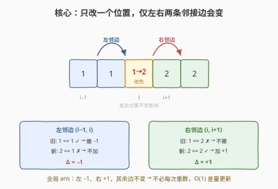
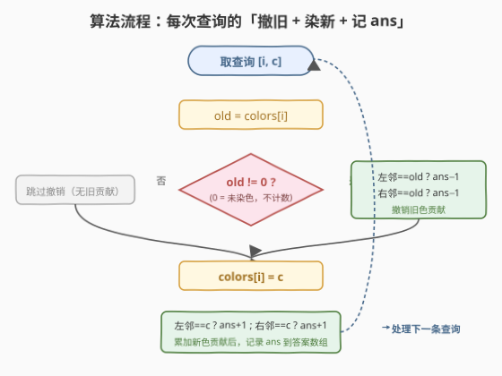
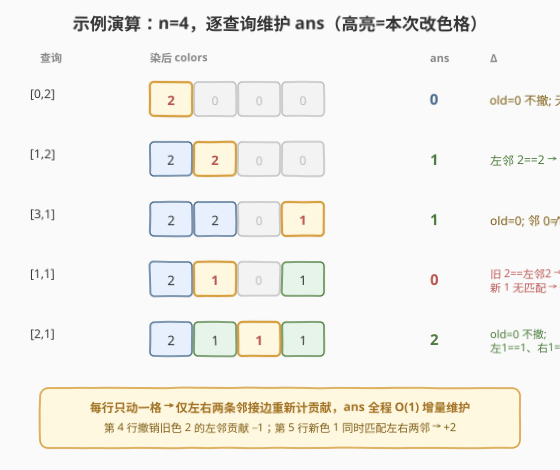

# 有相同颜色的相邻元素数目

- **题目名称**：有相同颜色的相邻元素数目
- **链接**：[2672. 有相同颜色的相邻元素数目](https://leetcode.cn/problems/number-of-adjacent-elements-with-the-same-color/)
- **难度**：中等
- **标签**：数组

## 1. 题目概述

给定一个整数 `n` 表示长度为 `n` 的数组 `colors`，初始所有元素均为 `0`，表示**未染色**。同时给定一个二维整数数组 `queries`，其中 `queries[i] = [index_i, color_i]`。对于第 `i` 个**查询**：

- 将 `colors[index_i]` 染色为 `color_i`。
- 统计 `colors` 中**颜色相同的相邻对**的数量（无论 `color_i`）。

请返回一个长度与 `queries` 相等的数组 `answer`，其中 `answer[i]` 是前 `i` 个操作后的答案。

> 💡 **审题关键**：相邻同色对统计的是**全局**所有相邻位置 `(j, j+1)` 中 `colors[j] == colors[j+1]` 且均非零的对数，而非只统计新染色的那一种颜色。注意 `0` 表示**未染色**，两个相邻的 `0` **不算**同色对（见示例 1 第 1 次查询 `[2,0,0,0]` 答案为 `0`）。

**示例 1**：

```text
输入：n = 4, queries = [[0,2],[1,2],[3,1],[1,1],[2,1]]
输出：[0,1,1,0,2]
```

解释：

| 查询 | 染后 colors | 答案 | 同色相邻对 |
|------|-------------|------|-----------|
| `[0,2]` | `[2,0,0,0]` | `0` | 无 |
| `[1,2]` | `[2,2,0,0]` | `1` | (0,1)=2,2 |
| `[3,1]` | `[2,2,0,1]` | `1` | (0,1)=2,2 |
| `[1,1]` | `[2,1,0,1]` | `0` | 无 |
| `[2,1]` | `[2,1,1,1]` | `2` | (1,2)=1,1、(2,3)=1,1 |

**示例 2**：

```text
输入：n = 1, queries = [[0,100000]]
输出：[0]
```

**约束条件**：

- `1 <= n <= 10^5`
- `1 <= queries.length <= 10^5`
- `queries[i].length == 2`
- `0 <= index_i <= n - 1`
- `1 <= color_i <= 10^5`

> ⚠️ **规模决定必须 O(1) 单次**：`n` 与 `queries.length` 均达 `10^5`。若每次查询都 `O(n)` 重数整个数组，总耗时 `O(n·q) = 10^{10}`，必超时。必须把单次查询压到**均摊 `O(1)`**，这要求不现算、而是用一个全局计数器做差量增量维护。

---

## 2. 解题思路

### 2.1 暴力思路

维护 `colors` 数组，每次查询：

1. 令 `colors[index] = color`；
2. **遍历整个数组**，数 `colors[j] == colors[j+1] != 0` 的对数，写入答案。

染色本身 `O(1)`，但统计 `O(n)`，总 `O(n·q)`，最坏 `10^{10}`，超时。

> 💡 **瓶颈定位**：问题不在「染色」，而在「每次都从头重数全局」。其实每次只改了**一个位置**，全局同色相邻对里只有该位置涉及的两条边可能变化，其余所有边维持原样。抓住「单点改动只波及局部」这一点，就能把 `O(n)` 统计压成 `O(1)` 差量。

### 2.2 核心观察：差量更新——只看左右两条邻接边



关键洞察：**单点染色 `index` 时，全局答案中只有两条邻接边 `(index−1, index)` 与 `(index, index+1)` 会改变**。维护一个全局计数器 `ans`，每次只对这两条边做「撤销旧色贡献 + 累加新色贡献」：

$$\Delta ans = \big([c=L] + [c=R]\big) - \big([\text{old}=L] + [\text{old}=R]\big)$$

其中 $L=\text{colors}[i-1]$、$R=\text{colors}[i+1]$ 为左右邻居，$[\cdot]$ 是指示函数（条件成立为 1 否则 0）。

| 步骤 | 作用 | 条件 |
|------|------|------|
| 撤销旧色 | 若 `old != 0` 且左/右邻 == `old`，则 `ans−−` | `0` 未染色不参与计数 |
| 染新色 | `colors[i] = c`（`c >= 1`） | — |
| 累加新色 | 若左/右邻 == `c`，则 `ans++` | 邻居为 `0` 时自然不匹配 |

> 💡 **为何 `old != 0` 守卫不可省**：若 `old == 0`（该位此前未染色），其与邻居（即便邻居也是 `0`）从未贡献过同色对——两个相邻 `0` 不算同色对。若不守卫、看到 `colors[nb] == old(==0)` 就 `ans−−`，会把本不存在的贡献扣掉，使 `ans` 偏小甚至变负。守卫保证只撤销「旧色确实贡献过」的边。
>
> ⚠️ **颜色不变时天然正确**：若 `old == c`（重复染同色），撤销阶段扣掉 `old` 的贡献、累加阶段加回 `c` 的贡献，左/右各 −1 后 +1 净 `0`，`ans` 不变——与「数组实际没变」一致，无需特判。

### 2.3 算法流程图



每次查询的固定四段：

1. `old = colors[i]`
2. 若 `old != 0`：左邻==`old` 则 `ans−1`、右邻==`old` 则 `ans−1`（**撤销旧色**对两条邻接边的贡献）
3. `colors[i] = c`
4. 左邻==`c` 则 `ans+1`、右邻==`c` 则 `ans+1`（**累加新色**对两条邻接边的贡献），随后把 `ans` 写入答案数组

> 💡 **对称结构**：撤销与累加是同一套模板的两个方向——都是「该位置与某邻居颜色相同且非零则计 1」。撤销用旧色、累加用新色，先撤后加保证 `old==c` 时净零。抓住这个对称性，代码不易写错。

### 2.4 示例演算



以示例 1 演示 `ans` 如何随单点染色差量变化（高亮格为本次改色位置）：

- 第 2 次查询 `[1,2]`：`old=0` 不撤；新色 `2` 与左邻 `2` 相同 → `+1`，`ans: 0→1`。
- 第 4 次查询 `[1,1]`：`old=2` 与左邻 `2` 相同 → 撤 `−1`；新色 `1` 无匹配 → `+0`，`ans: 1→0`。**这是撤销分支**。
- 第 5 次查询 `[2,1]`：`old=0` 不撤；新色 `1` 同时匹配左邻 `1` 与右邻 `1` → `+2`，`ans: 0→2`。**一条查询可同时贡献左右两条边**。

> 💡 **观察要点**：每次答案的变化量 `Δ` 只由「本次改色位置与它两个邻居的关系」决定，与其余位置无关。第 5 次一条查询 `+2` 证明「左右两条边可同时命中」，这正是必须同时检查两侧的原因。

---

## 3. 参考代码

### C++

```cpp
class Solution {
public:
    vector<int> colorTheArray(int n, vector<vector<int>>& queries) {
        vector<int> colors(n, 0), ans_arr;
        ans_arr.reserve(queries.size());
        int ans = 0;
        for (auto& q : queries) {
            int i = q[0], c = q[1], old = colors[i];
            // 撤销旧颜色对左右邻接边的贡献（0 表示未染色，不参与计数）
            if (old != 0) {
                if (i - 1 >= 0 && colors[i - 1] == old) --ans;
                if (i + 1 < n && colors[i + 1] == old) --ans;
            }
            colors[i] = c;
            // 累加新颜色对左右邻接边的贡献
            if (i - 1 >= 0 && colors[i - 1] == c) ++ans;
            if (i + 1 < n && colors[i + 1] == c) ++ans;
            ans_arr.push_back(ans);
        }
        return ans_arr;
    }
};
```

> 💡 **C++ 要点**：
> - 边界用 `i - 1 >= 0` / `i + 1 < n` 守卫，避免越界访问；`colors` 初始化为全 `0` 表示未染色。
> - `ans_arr.reserve(queries.size())` 预分配，避免 `push_back` 反复扩容。
> - 撤销与累加**不合一**：必须先撤销旧色（用改前的 `colors` 与 `old` 比较）、再写 `colors[i] = c`、最后累加新色（用改后的 `colors` 与 `c` 比较）。顺序颠倒会用错颜色。

### Python

```python
class Solution:
    def colorTheArray(self, n: int, queries: List[List[int]]) -> List[int]:
        colors = [0] * n
        ans = 0
        res = []
        for i, c in queries:
            old = colors[i]
            if old != 0:                       # 0 = 未染色，不参与计数
                if i > 0 and colors[i - 1] == old:
                    ans -= 1
                if i < n - 1 and colors[i + 1] == old:
                    ans -= 1
            colors[i] = c
            if i > 0 and colors[i - 1] == c:
                ans += 1
            if i < n - 1 and colors[i + 1] == c:
                ans += 1
            res.append(ans)
        return res
```

> 💡 **Python 要点**：
> - 边界用 `i > 0` / `i < n - 1`，Python 的短路 `and` 自然避免越界。
> - `old != 0` 守卫不可省（同 C++ 理由）：否则两个相邻 `0` 会被误判为同色而错误扣减。
> - 顺序仍是「撤旧 → 写入 → 加新」。`old == c` 时撤多少加多少、净零，无需特判。

---

## 4. 复杂度分析

| 维度 | 复杂度 | 说明 |
|------|--------|------|
| 时间 | `O(n + q)` | 初始化 `colors` 为 `O(n)`；每条查询只做常数次比较与赋值，均摊 `O(1)`，共 `q` 条 |
| 空间 | `O(n + q)` | `colors` 数组 `O(n)`；答案数组 `O(q)`（不计返回值则 `O(n)`） |

> - $q$ 为查询数。每条查询的撤销/累加各至多查两个邻居、共至多 4 次比较，常数极小。
> - **从 `O(n·q)` 到 `O(n+q)`**：把「每次重数全局」替换为「维护全局计数器 + 单点改动只差量更新受影响的 `O(1)` 条边」，这是**增量维护**思想的典型收益。

---

## 5. 面试要点

1. **为什么不能每次查询遍历数组统计？复杂度是多少？**

   > 每次查询遍历整个数组数同色相邻对是 `O(n)`，`q` 条查询共 `O(n·q)`。本题 `n, q ≤ 10^5`，最坏 `10^{10}`，必超时。必须把单次压到 `O(1)`，办法是维护一个全局计数器 `ans`，每次只更新受单点改动影响的两条邻接边。

2. **每次只改一个位置，为什么全局只有两条边会变？**

   > 相邻同色对由所有相邻位置对 `(j, j+1)` 构成。改 `colors[i]` 只影响包含 `i` 的两条对：`(i−1, i)` 与 `(i, i+1)`。其余对两端颜色都没动，贡献不变。故只需重算这两条边，把差量加到 `ans` 上即可。

3. **撤销旧色时为什么要加 `old != 0` 的判断？去掉会怎样？**

   > `0` 表示未染色，两个相邻 `0` 不算同色对，从未计入 `ans`。若 `old == 0` 时不守卫、看到 `colors[nb] == 0` 就 `ans−−`，会扣掉本不存在的贡献，使 `ans` 偏小甚至变负。守卫保证只撤销「旧色确实贡献过」的边。等价写法是定义指示函数 $[a \ne 0 \land a = b]$ 统一处理两侧。

4. **如果同一条查询的新旧颜色相同（`old == c`）怎么办？**

   > 天然正确，无需特判。撤销阶段按 `old` 扣、累加阶段按 `c(=old)` 加，每条匹配边各 −1 再 +1 净 `0`，`ans` 不变——与「数组实际未变、答案不应变」一致。先撤后加的顺序保证不会出现「用错颜色」的问题。

5. **能否把撤销和累加合并成一次差量公式？**

   > 可以。记 $f(x, y) = [x \ne 0 \land x = y]$（两侧均非零且相等才计 1），则 $\Delta = f(c, L) + f(c, R) - f(\text{old}, L) - f(\text{old}, R)$，`ans += Δ`。这与「先撤后加」等价，但代码上「先撤（用 old）→ 写入 → 后加（用 c）」更直观、不易把 `old` 与 `c` 用反，故实现常选后者。

> 💡 **一句话总结**：2672 是「单点更新 + 增量维护全局相邻关系计数」的招牌题——核心就一个全局计数器 `ans` 加「撤旧色贡献、染新色、加新色贡献」三段差量。考点三要素：**单点改动只波及 `O(1)` 条邻接边**、**`0` 未染色需守卫撤销**、**先撤后加保证 `old==c` 净零**。掌握「只看受影响局部做差量」这一思想，2210/2012 等相邻关系计数题同构可解。

---

## 6. 同类练习题

- [2210. 统计数组中峰和谷的数量](https://leetcode.cn/problems/count-hills-and-valleys-in-an-array/)：按与左右邻居的大小比较判定峰谷并计数——对照 2672「相邻元素关系定义计数」，但 2210 是静态一遍扫描，2672 是动态增量更新
- [2038. 如果相邻两个颜色均相同则删除当前颜色](https://leetcode.cn/problems/remove-colored-pieces-if-both-neighbors-are-the-same-color/)：统计连续三同色段可被消除的次数——同属「相邻同色」主题，用计数代替模拟，对照 2672 的相邻同色判定
- [2012. 数组美丽值求和](https://leetcode.cn/problems/sum-of-beauty-in-the-array/)：每个位置美丽值由「左侧最大值/右侧最小值与该元素比较」决定——对照 2672 的局部性，2012 需预处理前缀最大/后缀最小，2672 只需即时邻居
- [2352. 相等行列对](https://leetcode.cn/problems/equal-row-and-column-pairs/)：统计矩阵中完全相等的行列对数——同为「相等配对计数」，2352 用哈希把行列序列化后匹配，对照 2672 用增量维护相邻相等对
