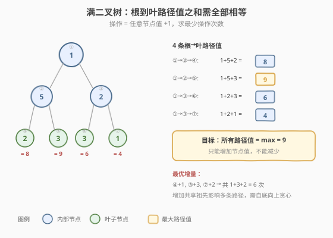
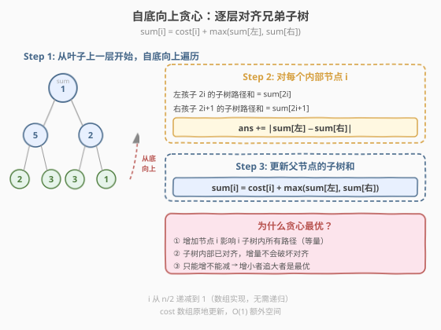
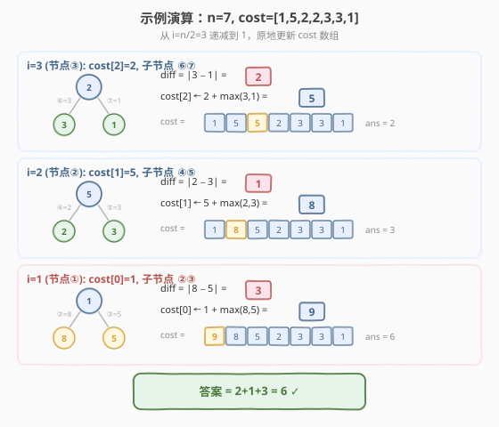

# LeetCode 使二叉树所有路径值相等的最小代价 题解

## 1. 题目概述

- **标题 / 题号**：使二叉树所有路径值相等的最小代价（#2673，medium）
- **链接**：https://leetcode.cn/problems/make-costs-of-paths-equal-in-a-binary-tree/
- **难度**：中等
- **标签**：贪心、树、数组、动态规划、二叉树

**题意**：给你一个整数 $n$ 表示一棵**满二叉树**里面节点的数目，节点编号从 $1$ 到 $n$。根节点编号为 $1$，树中每个非叶子节点 $i$ 都有两个孩子，分别是左孩子 $2 \times i$ 和右孩子 $2 \times i + 1$。

树中每个节点都有一个值，用下标从 $0$ 开始、长度为 $n$ 的整数数组 $cost$ 表示，其中 $cost[i]$ 是第 $i+1$ 个节点的值。每次操作，你可以将树中**任意**节点的值**增加** $1$。你可以执行操作**任意**次。

你的目标是让根到每一个**叶子节点**的路径值相等。请你返回**最少**需要执行增加操作多少次。

> 💡 **满二叉树**：除了叶子节点外每个节点都恰好有 2 个子节点，且所有叶子节点距离根节点距离相同。**路径值**指路径上所有节点的值之和。注意：只能**增加**不能减少。

**示例 1**：

```text
输入：n = 7, cost = [1,5,2,2,3,3,1]
            ①
           / \
          ②   ③
         / \  / \
        ④  ⑤ ⑥  ⑦
输出：6
解释：将节点④增加1次、节点③增加3次、节点⑦增加2次，
      所有根→叶路径值都变为 9，共 1+3+2 = 6 次。
```

**示例 2**：

```text
输入：n = 3, cost = [5,3,3]
        ①
       / \
      ②   ③
输出：0
解释：两条路径值已相等（5+3 = 5+3 = 8），无需操作。
```

**约束**：

- $3 \le n \le 10^5$
- $n+1$ 是 $2$ 的幂
- $cost.length == n$
- $1 \le cost[i] \le 10^4$

> 💡 **关键语义**：① $n+1$ 是 $2$ 的幂保证这是一棵**完美二叉树**（perfect binary tree），可以用数组隐式表示（节点 $i$ 的子节点是 $2i$ 和 $2i+1$）。② 只能增加不能减少，所以最优策略是让所有路径对齐到**最大**那条，而非取平均。③ 增加一个共享祖先节点的值会**同时**影响多条路径，这是优化的关键。

## 2. 解题思路

### 2.1 暴力思路：枚举所有路径，逐个补齐

朴素做法：先计算所有根→叶路径的值，找到最大值 $\text{maxSum}$，然后对每条路径补差值。但问题在于——增加一个内部节点会**同时**影响多条路径，逐路径补差会重复计算。

更暴力的思路是穷举所有节点的增量组合，但节点数 $n \le 10^5$、增量范围 $[0, 10^4]$，搜索空间爆炸。

### 2.2 核心观察：自底向上贪心，逐层对齐兄弟



**关键洞察**：增加节点 $i$ 的值会影响 $i$ 子树内所有根→叶路径（等量增加），但**不影响**其他子树的路径。因此，**从叶子向根逐层处理**，在每个内部节点处对齐其左右子树的路径和，是最优的。

定义 $\text{sum}[i]$ 为从节点 $i$ 到其子树中某个叶子的**最大路径和**（经过处理后的值）。

对于内部节点 $i$（子节点为 $2i$ 和 $2i+1$）：

$$\text{ans} \mathrel{+}= |\text{sum}[2i] - \text{sum}[2i+1]|$$

$$\text{sum}[i] = \text{cost}[i] + \max(\text{sum}[2i],\; \text{sum}[2i+1])$$

> 💡 **为什么对？** ① **只能增不能减** → 最小操作就是增小者追大者，差值 $|\text{sum}[左] - \text{sum}[右]|$ 不可减少。② **增加子树根节点**（即 $2i$ 或 $2i+1$）会使该子树内**所有**路径等量增加——因为子树内部的路径已经在更底层对齐过了，增量不会破坏已有的对齐。③ **自底向上**保证处理节点 $i$ 时，其子节点的子树内路径已全部相等，所以 $\text{sum}[2i]$ 和 $\text{sum}[2i+1]$ 各代表一个确定的值。

### 2.3 算法流程图



1. **遍历顺序**：$i$ 从 $n/2$ 递减到 $1$（即从最后一个内部节点开始，自底向上到根）。叶子节点是 $n/2+1$ 到 $n$，无需处理。

2. **对每个内部节点 $i$**（1-indexed）：
   - 左孩子 $= 2i$，右孩子 $= 2i+1$（0-indexed 数组下标为 $2i-1$ 和 $2i$）
   - $\text{diff} = |\text{cost}[2i-1] - \text{cost}[2i]|$
   - $\text{ans} \mathrel{+}= \text{diff}$
   - $\text{cost}[i-1] \mathrel{+}= \max(\text{cost}[2i-1],\; \text{cost}[2i])$

3. **原地更新**：$\text{cost}$ 数组在处理过程中被原地修改，$\text{cost}[i-1]$ 更新后存储的就是 $\text{sum}[i]$（该子树的最大路径和），供父节点使用。

> ⚠️ **索引注意**：节点是 1-indexed（$1 \sim n$），数组是 0-indexed（$0 \sim n-1$），$\text{cost}[i-1]$ 对应节点 $i$ 的值。叶子节点 $j$ 的 $\text{sum}[j] = \text{cost}[j-1]$（初始值即为路径和）。

### 2.4 示例演算



以示例 1 $n=7,\; \text{cost} = [1,5,2,2,3,3,1]$ 演算：

**Step 1: $i=3$（节点③），子节点⑥⑦**

| 项 | 值 |
|----|-----|
| $\text{sum}[6] = \text{cost}[5] = 3$ | 叶子 |
| $\text{sum}[7] = \text{cost}[6] = 1$ | 叶子 |
| $\text{diff} = \|3-1\| = 2$ | $\text{ans} = 2$ |
| $\text{cost}[2] \leftarrow 2 + \max(3,1) = 5$ | $\text{cost} = [1,5,\mathbf{5},2,3,3,1]$ |

**Step 2: $i=2$（节点②），子节点④⑤**

| 项 | 值 |
|----|-----|
| $\text{sum}[4] = \text{cost}[3] = 2$ | 叶子 |
| $\text{sum}[5] = \text{cost}[4] = 3$ | 叶子 |
| $\text{diff} = \|2-3\| = 1$ | $\text{ans} = 3$ |
| $\text{cost}[1] \leftarrow 5 + \max(2,3) = 8$ | $\text{cost} = [1,\mathbf{8},5,2,3,3,1]$ |

**Step 3: $i=1$（节点①，根），子节点②③**

| 项 | 值 |
|----|-----|
| $\text{sum}[2] = \text{cost}[1] = 8$ | 已处理 |
| $\text{sum}[3] = \text{cost}[2] = 5$ | 已处理 |
| $\text{diff} = \|8-5\| = 3$ | $\text{ans} = 6$ |
| $\text{cost}[0] \leftarrow 1 + \max(8,5) = 9$ | $\text{cost} = [\mathbf{9},8,5,2,3,3,1]$ |

最终 $\text{ans} = 2 + 1 + 3 = 6$ ✓，最终 $\text{sum}[1] = 9$ 即所有路径对齐后的公共值。

> 💡 **验证**：最终 $\text{cost}$ 数组中，$\text{cost}[0]=9$ 是根节点的子树最大路径和（即所有路径对齐后的公共值）。原始 4 条路径值为 $8, 9, 6, 4$，最大为 $9$，操作后全部等于 $9$。

## 3. 参考代码

### C++

```cpp
class Solution {
public:
    int minIncrements(int n, vector<int>& cost) {
        int ans = 0;
        for (int i = n / 2; i >= 1; --i) {
            int left  = cost[2 * i - 1];
            int right = cost[2 * i];
            ans += abs(left - right);
            cost[i - 1] += max(left, right);
        }
        return ans;
    }
};
```

> ⚠️ **易错点**：(1) 循环从 $i = n/2$ 开始——$n/2$ 是最后一个内部节点的编号，$n/2+1 \sim n$ 都是叶子。(2) `cost` 数组被原地修改——处理节点 $i$ 时，其子节点的 `cost` 值已经是该子树的最大路径和 $\text{sum}$（如果是叶子则还是原始值）。(3) **不需要额外数组**：原地更新 `cost[i-1]` 后，父节点直接读取即可。

### Python

```python
from typing import List


class Solution:
    def minIncrements(self, n: int, cost: List[int]) -> int:
        ans = 0
        for i in range(n // 2, 0, -1):
            left = cost[2 * i - 1]
            right = cost[2 * i]
            ans += abs(left - right)
            cost[i - 1] += max(left, right)
        return ans
```

> 💡 **为什么不需要建树？** 满二叉树的数组隐式表示天然有序：节点 $i$ 的子节点恰为 $2i$ 和 $2i+1$，无需指针或邻接表。$n+1$ 是 $2$ 的幂这一约束保证了树是完美的——每个内部节点都有两个子节点，叶子恰好从 $n/2+1$ 开始，不会有"半空"的内部节点。

## 4. 复杂度分析

| 维度 | 复杂度 | 说明 |
|------|--------|------|
| 时间复杂度 | $O(n)$ | 遍历 $n/2$ 个内部节点，每个 $O(1)$，总计 $O(n/2) = O(n)$ |
| 空间复杂度 | $O(1)$ | 原地修改 `cost` 数组，只用常数个额外变量 |
| 对照：建树+DFS | $O(n)$ / $O(n)$ | 需额外建树结构，空间 $O(n)$；本题数组隐式表示省去建树 |

> 💡 本题最大路径和上界：树高 $\le \log_2(n) + 1 \le 18$（$n \le 10^5$），每层最多一个节点贡献 $10^4$，最大路径和 $\le 18 \times 10^4 = 1.8 \times 10^5$，远小于 `int` 上界。C++ 直接用 `int` 即可。

## 5. 扩展：为什么不能减少？—— 对称性分析

本题只允许**增加**操作，如果同时允许**增加和减少**会怎样？

- **只增不减**：所有路径对齐到**最大**路径值，答案 $= \sum (\text{maxSum} - \text{pathSum}_j)$（但实际计算用自底向上贪心，不需要枚举路径）。
- **可增可减**：所有路径对齐到某个**中间值**，最小化 $\sum |\text{pathSum}_j - \text{target}|$，此时 $\text{target}$ 取所有路径值的中位数（绝对偏差最小化）。这是一个更难的变体，因为减少一个共享祖先会同时降低多条路径，贪心不再直接适用。

> 💡 **本题贪心成立的关键**：只能增 → 大者不动、小者追 → 每层只需对齐兄弟 → 自底向上 $O(n)$ 一趟搞定。这是「**单调约束催生贪心**」的典型范式。

## 6. 面试要点

1. **为什么自底向上处理是最优的？能不能自顶向下？**

   > 自底向上保证处理节点 $i$ 时，其子节点的子树内所有路径已经对齐，$\text{sum}[2i]$ 和 $\text{sum}[2i+1]$ 各是一个确定的值。自顶向下则无法确定增量对下层的影响——增加节点 $i$ 后，左右子树的路径和变化不同，还需在子树内继续调整，可能产生次优解。自底向上是**贪心选择性质**的保证。

2. **增加一个内部节点 vs 增加一个叶子节点，有什么区别？**

   > 增加内部节点 $i$ 会影响 $i$ 子树内**所有**路径（等量增加）；增加叶子只影响**一条**路径。本题的贪心策略选择增加子树根节点（即 $2i$ 或 $2i+1$）来对齐兄弟，因为这样只需一次操作就同时提升了该子树内所有路径，效率最高。

3. **原地修改 cost 数组会不会影响后续计算？**

   > 不会。处理节点 $i$ 时，读取的是子节点 $2i$ 和 $2i+1$ 的值，写入的是 $\text{cost}[i-1]$（父节点位置）。因为遍历是 $i$ 从 $n/2$ 递减到 $1$，处理 $i$ 时 $i$ 的子节点（$> i$）已经处理完毕不会再被读取，而 $\text{cost}[i-1]$ 只会被 $i$ 的父节点（$< i$）读取，尚未处理。所以读写不冲突。

4. **如果不只增不减，而是可以增减，算法需要怎么改？**

   > 贪心不再直接适用。需要改为：自底向上收集每条路径的原始路径值，然后找使 $\sum |\text{pathSum}_j - \text{target}|$ 最小的 $\text{target}$（中位数）。但增加/减少共享祖先会同时影响多条路径，问题变成更复杂的优化，可能需要 DP。

5. **n+1 是 2 的幂这个约束有什么用？**

   > 保证树是完美二叉树：每个内部节点都有两个子节点，叶子恰好从 $n/2+1$ 开始。如果没有这个约束（比如普通完全二叉树），最后一个内部节点可能只有一个子节点，需要额外处理边界。本题约束简化了代码，无需判断子节点是否存在。

> 💡 **一句话总结**：自底向上贪心，每个内部节点对齐左右子树的最大路径和，差值即增量，原地更新 `cost` 数组，$O(n)$ 时间 $O(1)$ 空间。

## 同类练习题

| # | 题目 | 与本题的关联 |
|---|------|-------------|
| 979 | [在二叉树中分配硬币](https://leetcode.cn/problems/distribute-coins-in-binary-tree/) | 树 + 贪心 + 后序 DFS，每个节点向父传递溢出/缺口，同样是自底向上处理二叉树操作的贪心范式 |
| 2471 | [逐层排序二叉树所需的最少操作数目](https://leetcode.cn/problems/minimum-number-of-operations-to-sort-a-binary-tree-by-level/) | 逐层独立排序求最少交换，与本题「逐层对齐」思路呼应，但操作语义不同（交换 vs 增值） |
| 814 | [二叉树剪枝](https://leetcode.cn/problems/binary-tree-pruning/) | 后序 DFS 删除全 0 子树，同样是自底向上处理子树性质的经典题 |
| 2265 | [统计值等于子树平均值的节点数](https://leetcode.cn/problems/count-nodes-equal-to-average-of-subtree/) | 后序 DFS 同时返回子树和与节点数，自底向上聚合子树信息的模板 |
