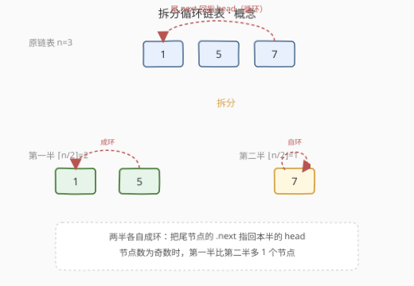
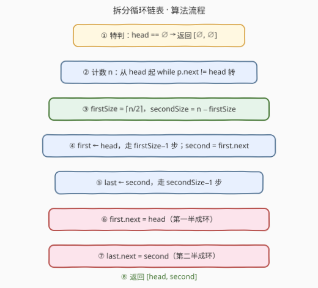

# LeetCode 拆分循环链表 题解

## 1. 题目概述

- **标题 / 题号**：拆分循环链表（#2674，medium）
- **链接**：https://leetcode.cn/problems/split-a-circular-linked-list/
- **难度**：中等
- **标签**：链表、双指针

> ⚠️ 本题为 LeetCode 付费题（Plus 会员专享），题意描述根据官方示例用例与 hints 重建，可能与官方题面有出入。下方函数签名亦为根据题意重建，提交时以官方代码模板为准。

**题意**：给定一个**循环单向链表**的头节点 `head`：链表最后一个节点的 `next` 指针不是 `null`，而是回指第一个节点 `head`，从而形成一个环。请将其拆分成**两个循环单向链表**，并返回由两个新头节点组成的数组/列表 `[head1, head2]`。

拆分要求：

- 两个新链表各自保持**循环**结构（各自的尾节点 `next` 指回自己的头）。
- 两部分的长度**尽可能相等**；当节点总数 $n$ 为奇数时，**第一半比第二半多 1 个节点**，即第一半长度为 $\lceil n/2 \rceil$、第二半长度为 $\lfloor n/2 \rfloor$。
- 节点保持原链表中的相对顺序。

**示例 1**：

```text
输入：head = [1,5,7]
输出：[[1,5],[7]]
解释：n=3，第一半 2 个节点 [1,5]（5.next 回指 1），第二半 1 个节点 [7]（7.next 回指 7）。
```

**示例 2**：

```text
输入：head = [2,6,1,5]
输出：[[2,6],[1,5]]
解释：n=4，两半各 2 个节点，[2,6] 与 [1,5] 各自成环。
```

**约束条件**（依据 hints 与常见版本重建）：

- 链表中节点数目范围 $[0, 1000]$（空链表时 `head` 为 `null`）。
- $0 \le \text{Node.val} \le 1000$。
- 输入保证为合法的循环单向链表。

## 2. 解题思路

### 2.1 暴力思路：转成数组再重建

先把循环链表"破环"遍历一遍，把所有节点（或值）存进数组，再按 $\lceil n/2\rceil$ 切成两段，分别重建两条循环链表。能用，但：

- 需要 $O(n)$ 额外空间。
- 重建链表会产生新节点或反复改指针，逻辑冗余。
- 没有利用"原链表本身就是循环"这一性质——**直接在原地把指针重连两下即可**。

### 2.2 核心观察：计数 + 原地重连两根指针



关键直觉：循环链表已经"首尾相接"，要把它一分为二，只需**找到切分点，再把两段分别"闭环"**。具体地，一共只需要确定四个关键节点：

| 角色 | 含义 | 作用 |
|------|------|------|
| `head` | 第一半的头（= 原 head） | 返回值之一 |
| `first` | 第一半的**尾** | 让 `first.next = head`，第一半成环 |
| `second` | 第二半的头（= `first.next`） | 返回值之二 |
| `last` | 第二半的**尾**（= 原 tail） | 让 `last.next = second`，第二半成环 |

原链表中，`last.next` 本来指向 `head`（这就是"循环"的定义）。我们只要：

1. **断开** `last → head` 这条回边；
2. 把它改写成 `last → second`（第二半内部闭环）；
3. 再补一条 `first → head`（第一半内部闭环）。

两条新链表就自然形成了——不需要新建任何节点，空间 $O(1)$。

> 💡 **一句话理解**：拆分循环链表 = 「找中点 + 改两根 `next` 指针」。原链表唯一的"环边"是 `last→head`，把它从"跨两半"改写成"只在第二半内"，再给第一半补一条同方向的环边即可。

**怎么找到 `first`（中点）？** 官方 hints 明确给出：**先用 while 循环数出节点总数 $n$**，于是第一半长度 `firstSize = (n+1)/2`（整除即 $\lceil n/2\rceil$）。从 `head` 走 `firstSize−1` 步即到 `first`，`second = first.next`，再从 `second` 走 `secondSize−1` 步即到 `last`。

### 2.3 算法流程图



完整步骤：

1. **特判**：`head == null` → 返回 `[null, null]`。
2. **计数 $n$**：从 `head` 出发，`p = head.next`，只要 `p != head` 就 `p = p.next` 并 `n++`。
3. **定长**：`firstSize = (n + 1) / 2`，`secondSize = n - firstSize`；若 `secondSize == 0`（仅 1 个节点）→ 返回 `[head, null]`。
4. **找 `first` / `second`**：`first = head`，走 `firstSize−1` 步；`second = first.next`。
5. **找 `last`**：`last = second`，走 `secondSize−1` 步。
6. **第一半成环**：`first.next = head`。
7. **第二半成环**：`last.next = second`。
8. **返回** `[head, second]`。

> ⚠️ **顺序很重要**：必须先记下 `second = first.next`（此时 `first.next` 仍指向第二半的头），再做第 6 步的 `first.next = head`。否则一旦先把 `first.next` 改写，第二半的头就"丢"了——和反转链表时"先存 `next` 再改指针"是同一个道理。

### 2.4 示例演算

![示例演算：[1,5,7] 与 [2,6,1,5] 的拆分过程](../images/p2674_example_walkthrough.svg)

**示例 1：`[1,5,7]`，$n=3$，`firstSize=2`**

- `first`：从 1 走 1 步 → 节点 5；`second = 5.next = 7`。
- `last`：从 7 走 `secondSize−1 = 0` 步 → 节点 7（即 `second` 本身，单节点第二半）。
- `first.next = head`：`5.next = 1`，第一半成环 `[1,5]`。
- `last.next = second`：`7.next = 7`，第二半成环 `[7]`。
- 返回 `[1, 7]`。

**示例 2：`[2,6,1,5]`，$n=4$，`firstSize=2`**

- `first`：从 2 走 1 步 → 节点 6；`second = 6.next = 1`。
- `last`：从 1 走 `secondSize−1 = 1` 步 → 节点 5。
- `first.next = head`：`6.next = 2`，第一半成环 `[2,6]`。
- `last.next = second`：`5.next = 1`，第二半成环 `[1,5]`。
- 返回 `[2, 1]`。

## 3. 参考代码

> 函数名 `splitCircularList` 与返回类型为依据题意重建，提交时请对齐官方代码模板。

### C++

```cpp
/**
 * Definition for singly-linked list.
 * struct ListNode {
 *     int val;
 *     ListNode *next;
 *     ListNode() : val(0), next(nullptr) {}
 *     ListNode(int x) : val(x), next(nullptr) {}
 *     ListNode(int x, ListNode *next) : val(x), next(next) {}
 * };
 */
class Solution {
  public:
    vector<ListNode*> splitCircularList(ListNode* head) {
        if (!head) return {nullptr, nullptr};

        // ② 计数 n（循环链表：走到 next 又等于 head 即一圈）
        int n = 1;
        for (ListNode* p = head->next; p != head; p = p->next) ++n;

        // ③ 定长：奇数时第一半多 1
        int firstSize = (n + 1) / 2;
        int secondSize = n - firstSize;
        if (secondSize == 0) return {head, nullptr}; // 仅 1 个节点

        // ④ first = 第一半尾，second = 第二半头（先存！）
        ListNode* first = head;
        for (int i = 1; i < firstSize; ++i) first = first->next;
        ListNode* second = first->next;

        // ⑤ last = 第二半尾（= 原 tail，本指向 head）
        ListNode* last = second;
        for (int i = 1; i < secondSize; ++i) last = last->next;

        // ⑥ ⑦ 各自成环（先存 second 故顺序无忧）
        first->next = head;    // 第一半闭环
        last->next = second;   // 第二半闭环
        return {head, second}; // ⑧
    }
};
```

### Python

```python
# Definition for singly-linked list.
# class ListNode:
#     def __init__(self, val=0, next=None):
#         self.val = val
#         self.next = next
class Solution:
    def splitCircularList(self, head: Optional['ListNode']) -> List[Optional['ListNode']]:
        if not head:
            return [None, None]

        # ② 计数 n
        n = 1
        p = head.next
        while p != head:
            n += 1
            p = p.next

        # ③ 定长
        first_size = (n + 1) // 2
        second_size = n - first_size
        if second_size == 0:
            return [head, None]

        # ④ first / second（先存 second）
        first = head
        for _ in range(first_size - 1):
            first = first.next
        second = first.next

        # ⑤ last
        last = second
        for _ in range(second_size - 1):
            last = last.next

        # ⑥ ⑦ 各自成环
        first.next = head
        last.next = second
        return [head, second]
```

## 4. 复杂度分析

| 维度 | 复杂度 | 说明 |
|------|--------|------|
| 时间复杂度 | $O(n)$ | 计数遍历 $n$ 步 + 找 `first`/`last` 合计再走 $n-2$ 步，整体线性 |
| 空间复杂度 | $O(1)$ | 只用常数个指针，原地修改、不新建节点 |

## 5. 扩展：快慢指针找中点（免计数）

计数法直观且和官方 hints 一致，但需要**两趟遍历**（先数 $n$，再走切分点）。利用「快慢指针」可在**一趟**内定位 `first`，无需事先知道 $n$：

```cpp
// 扩展：快慢指针，一趟找中点（奇数/偶数统一指向第一半尾）
class Solution {
  public:
    vector<ListNode*> splitCircularList(ListNode* head) {
        if (!head) return {nullptr, nullptr};
        if (head->next == head) return {head, nullptr}; // 单节点自环

        ListNode *slow = head, *fast = head;
        // fast 走 2、slow 走 1；fast 下一格或下两格回到 head 即停
        while (fast->next != head && fast->next->next != head) {
            slow = slow->next;
            fast = fast->next->next;
        }
        ListNode* second = slow->next;       // 第二半头
        // 找原 tail（next 指向 head 的那个），让第二半成环
        ListNode* last = second;
        while (last->next != head) last = last->next;
        slow->next = head;     // 第一半成环
        last->next = second;   // 第二半成环
        return {head, second};
    }
};
```

**为什么循环条件是 `fast->next != head && fast->next->next != head`？**

- `fast` 每轮走 2 步，停在"快到头"的位置：偶数时 `fast->next == head`、奇数时 `fast->next->next == head`。
- 无论奇偶，循环结束时 `slow` 恰好停在**第一半的尾节点**：
  - $n$ 偶（如 `[2,6,1,5]`）：`slow=6`，第一半 `[2,6]`，第二半 `[1,5]`。
  - $n$ 奇（如 `[1,5,7]`）：`slow=5`，第一半 `[1,5]`，第二半 `[7]`。

> ⚠️ 与计数法相比，快慢指针法省掉了显式计数那趟，但**仍需第二趟找 `last`**（从 `second` 走到 `next==head`），所以渐近时间仍是 $O(n)$，只是常数更优。面试中两种写法都可作为主解，计数法更易讲清"为什么第一半多 1"。

## 6. 面试要点

1. **循环链表怎么遍历一圈而不死循环？**

   - 起点固定为 `head`，用 `p = head.next; while (p != head) p = p.next` 的"先迈一步再判等"写法。绝不能写成 `while (p != head) {...; p = p.next}` 后再在循环里先访问 `p`——那样首个节点 `head` 本身会被漏数。本题计数正好靠这个细节保证 $n$ 准确。

2. **为什么第一半长度取 $\lceil n/2\rceil$ 而不是 $\lfloor n/2\rfloor$？**

   - 题目约定"尽可能相等，奇数时第一半多 1"。$\lceil n/2\rceil = (n+1)/2$（整除）天然满足：$n=3\to 2$、$n=4\to 2$、$n=5\to 3$。取下整会让第二半更长，违反"前面不少于后面"。

3. **改 `first.next` 之前为什么要先存 `second`？**

   - `second = first.next` 这条边一旦被 `first.next = head` 覆盖，第二半的头就再也找不到了（循环链表没有 `null` 兜底，乱指会成死环）。和反转链表"先存 `next` 再掉头"完全同构。

4. **单节点（$n=1$）怎么处理？**

   - 单节点的循环链表 `head.next == head`。此时第二半长度为 0，应返回 `[head, null]`；若不做特判，`second` 会被算成 `head` 自身，导致两个头指向同一节点、语义错误。空表 `head==null` 同理返回 `[null, null]`。

5. **原地修改会不会破坏原链表？**

   - 会。本题就是**破坏性**拆分：原链表的 `last→head` 回边被改写成 `last→second`，并新增 `first→head`。调用方拿到的是两条独立循环链表，原"大环"已不存在。若要求保留原表，需要深拷贝后再拆，空间升到 $O(n)$。

6. **本题和环形链表检测（141/142）、K 个一组翻转（25）有何联系？**

   - 141/142 处理的是"可能有环、要判环并找入口"，重点是**快慢指针判圈数学**；本题输入**保证**是环，重点是**沿环切分与重连**。25（K 个一组翻转）同样是"分段 + 重连指针"，但针对单向链表分段翻转。三者共享"慎改 `next`、先存后改"的链表操作纪律。

## 同类练习题

| # | 题目 | 与本题的关联 |
|---|------|-------------|
| 725 | [分隔链表](https://leetcode.cn/problems/split-linked-list-in-parts/) | 单向链表按定长 `k` 分段（非循环），对照本题"循环链表按长度对半分"。 |
| 876 | [链表的中间结点](https://leetcode.cn/problems/middle-of-the-linked-list/) | 快慢指针找中点的母题，本题扩展解法直接复用其思想。 |
| 141 | [环形链表](https://leetcode.cn/problems/linked-list-cycle/)（[题解](../0101-0200/141_环形链表.md)） | 快慢指针判环，理解"环上指针运动"的基础。 |
| 142 | [环形链表 II](https://leetcode.cn/problems/linked-list-cycle-ii/)（[题解](../0101-0200/142_环形链表 II.md)） | 找环入口，与本题"在环上定位切分点"互为参照。 |
| 206 | [反转链表](https://leetcode.cn/problems/reverse-linked-list/)（[题解](../0201-0300/206_反转链表.md)） | 同为"改 `next` 指针"的原地操作，"先存 `next` 再改"的纪律在此延续。 |
