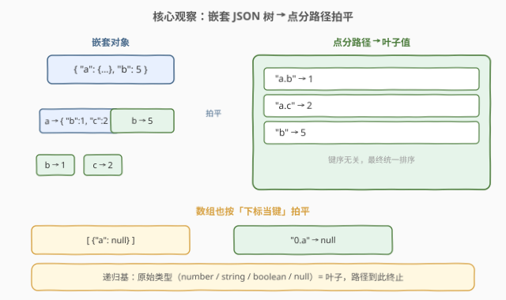
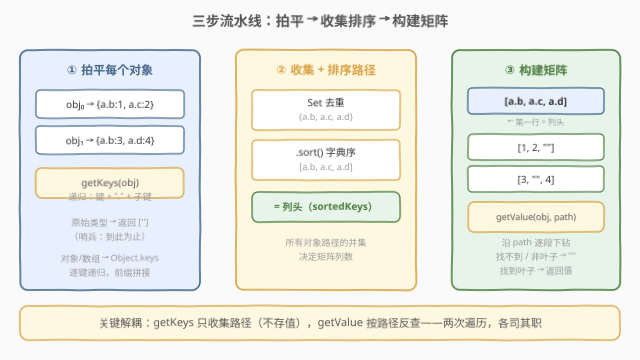
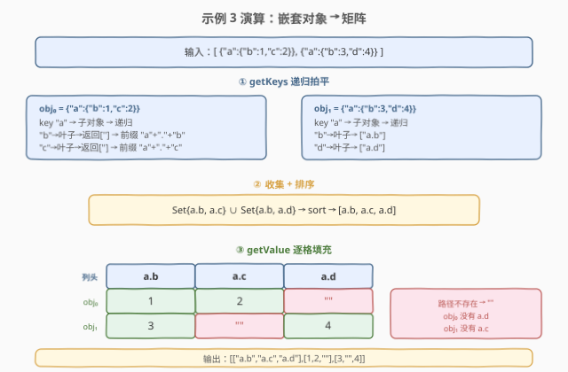

# 将对象数组转换为矩阵

- **题目名称**：将对象数组转换为矩阵
- **链接**：[2675. 将对象数组转换为矩阵](https://leetcode.cn/problems/array-of-objects-to-matrix/)
- **难度**：困难
- **标签**：递归、JSON、深度优先搜索、矩阵

## 1. 题目概述

> ⚠️ 本题为 LeetCode 付费题，题意描述根据官方示例用例与 hints 重建，可能与官方题面有出入。

给定一个 **JSON 对象数组** `arr`，将其转换为一个**二维矩阵**（二维数组）。规则如下：

1. **拍平**：对 `arr` 中的每个元素（可能是对象、数组或嵌套结构），递归提取所有从根到叶子的**路径**。
   - 对象的**键**作为路径分量，数组的**下标**（字符串形式）也作为路径分量
   - 路径分量用 `.` 连接（如 `a.b`、`0.a`）
   - **原始类型**（`number` / `string` / `boolean` / `null`）是叶子值，路径到此终止
2. **收集列头**：取所有元素路径的**并集**，按**字典序升序排列**，作为矩阵的列头（第一行）。
3. **填充数据**：矩阵后续每一行对应 `arr` 中的一个元素，按列头路径取值——路径存在且终点为原始类型则取该值，路径不存在或终点仍为对象/数组则填 `""`（空字符串）。

**示例 1**：

```text
输入：arr = [{"b":1,"a":2},{"b":3,"a":4}]
输出：[["a","b"],[2,1],[4,3]]
解释：两个对象都有键 a、b；并集 {a, b} 排序后为列头；每行按列头取值。
```

**示例 2**：

```text
输入：arr = [{"a":1,"b":2},{"c":3,"d":4},{}]
输出：[["a","b","c","d"],[1,2,"",""],["","",3,4],["","","",""]]
解释：第三个对象为空，所有路径缺失，整行填 ""。
```

**示例 3**：

```text
输入：arr = [{"a":{"b":1,"c":2}},{"a":{"b":3,"d":4}}]
输出：[["a.b","a.c","a.d"],[1,2,""],[3,"",4]]
解释：嵌套对象拍平为点分路径。第一个对象有 a.b、a.c，缺 a.d；第二个有 a.b、a.d，缺 a.c。
```

**示例 4**：

```text
输入：arr = [[{"a":null}],[{"b":true}],[{"c":"x"}]]
输出：[["0.a","0.b","0.c"],[null,"",""],["",true,""],["","","x"]]
解释：元素本身是数组，下标 0 成为路径前缀。
```

**示例 5**：

```text
输入：arr = [{},{},{}]
输出：[[""]]
解释：所有对象为空，无任何路径。矩阵仅含一个空字符串。
```

**约束条件**：

- `arr` 是合法的 JSON 值数组（不含 `undefined`、函数、Symbol、循环引用）；
- `arr.length >= 1`；
- 所有层级的键名与字符串值由可打印 ASCII 字符组成；
- 键名不含 `.`（否则路径产生歧义）。

> 💡 本题是 LeetCode「30 天 JavaScript」系列题目，**仅提供 JavaScript / TypeScript 提交入口**，核心考察**递归拍平 + 路径收集 + 矩阵对齐**。它与 [2633. 将对象转换为 JSON 字符串](2633_将对象转换为JSON字符串.md) 是同族题：2633 沿 JSON 树递归**序列化**，2675 沿 JSON 树递归**拍平+对齐**——同一套类型分派骨架，换个目标。

---

## 2. 解题思路

### 2.1 暴力思路：JSON.stringify + 字符串解析

一种朴素想法是先把每个对象 `JSON.stringify` 再正则提取键值——但嵌套结构的路径信息在序列化后会丢失层级关系，正则重建极易出错。正确方向是**直接沿 JSON 树递归**，边遍历边拼接路径。

### 2.2 核心观察：递归拍平 + 哨兵路径



关键洞察：JSON 值的文法本身就是**递归**的——对象和数组的"值/元素"又是 JSON 值。于是"拍平"天然沿文法递归：先钻到最深的叶子（原始类型），把沿途的键/下标用 `.` 拼成路径。

核心技巧是**哨兵 `""`**：

| 节点类型 | `getKeys` 返回值 | 父层如何拼接 |
|----------|------------------|-------------|
| **原始类型**（叶子） | `['']`（哨兵空串） | 直接用当前键，不加 `.` 后缀 |
| **对象/数组**（分支） | 子路径列表 | 当前键 + `.` + 子路径 |

> 💡 **为什么用哨兵 `""`？** 哨兵表示"我是叶子，路径到此为止"。父层检查 `nextKey === ''`：若是，则当前键本身就是完整路径（如 `"a"`）；若否，则拼接（如 `"a.b"`）。这样**不需要单独维护 path 数组**，递归返回值即携带完整路径信息，代码极其简洁。

**类型分派四条分支**：

| 分支 | 判定条件 | 动作 | 递归？ |
|------|----------|------|--------|
| **原始类型** | `!isObject(json)` | 返回 `['']`（哨兵） | 否（递归基） |
| **对象** | `typeof === "object"` 且非 `null` | `Object.keys` 遍历，逐键递归 + 拼接 | 是 |
| **数组** | `typeof === "object"` 且非 `null` | `Object.keys` 返回下标，同对象逻辑 | 是 |
| **`null`** | `o === null` | 归入原始类型（`!isObject` 为真） | 否（叶子值） |

> ⚠️ **排雷要点**：`typeof null === "object"` 是 JS 的历史遗留设计。`isObject` 函数用 `o !== null && typeof o === "object'` 把 `null` 排除出对象分支，使其被当作叶子值——这与 [2633](2633_将对象转换为JSON字符串.md) 和 [2628](2628_完全相等的JSON对象.md) 中"先拦 `null`"的排雷思路完全同构。

### 2.3 算法流程图



算法分**三步**，各司其职：

1. **拍平（getKeys）**：对每个元素递归提取所有叶子路径。不存储值，只收集路径——路径即"列名"。
2. **收集 + 排序**：所有元素的路径取并集（`Set` 去重），`.sort()` 字典序排列，得到列头 `sortedKeys`。
3. **构建矩阵（getValue）**：第一行为 `sortedKeys`；之后每个元素对应一行，对每个路径用 `getValue` 沿 `.` 分段下钻取值，找不到或终点非叶子则填 `""`。

> 💡 **关键解耦**：`getKeys` 只收集路径（不存值），`getValue` 按路径反查。两次独立遍历，避免了"边拍平边建矩阵"时路径不齐的复杂度——先确定所有列名，再逐格填值，天然对齐。

### 2.4 示例演算



以**示例 3** `[{"a":{"b":1,"c":2}},{"a":{"b":3,"d":4}}]` 为例：

| 步骤 | obj₀ | obj₁ |
|------|------|------|
| **拍平** | `{a.b: 1, a.c: 2}` | `{a.b: 3, a.d: 4}` |
| **路径并集** | `{"a.b", "a.c", "a.d"}` | |
| **排序后列头** | `["a.b", "a.c", "a.d"]` | |

| | a.b | a.c | a.d |
|------|-----|-----|-----|
| **obj₀** | 1 | 2 | `""`（缺失） |
| **obj₁** | 3 | `""`（缺失） | 4 |

`getValue(obj₀, "a.d")`：沿 `"a"` → `{"b":1,"c":2}` → `"d"` 不在其中 → 返回 `""`。这就是缺失路径填空串的原理。

---

## 3. 参考代码

### JavaScript / TypeScript（提交语言）

```javascript
function jsonToMatrix(arr) {
    const isObject = (o) => o !== null && typeof o === 'object';

    // 递归提取所有叶子路径，哨兵 '' 表示"我是叶子"
    const getKeys = (json) => {
        if (!isObject(json)) return [''];           // 递归基：原始类型
        return Object.keys(json).reduce((acc, key) => {
            for (const sub of getKeys(json[key]))
                acc.push(sub === '' ? key : `${key}.${sub}`);
            return acc;
        }, []);
    };

    // 收集所有路径并集 + 字典序排序
    const keySet = new Set();
    arr.forEach(obj => getKeys(obj).forEach(k => keySet.add(k)));
    const sortedKeys = [...keySet].sort();

    // 沿点分路径下钻取值，找不到 / 非叶子 → ''
    const getValue = (obj, path) => {
        let val = obj;
        for (const key of path.split('.')) {
            if (!isObject(val) || !(key in val)) return '';
            val = val[key];
        }
        return isObject(val) ? '' : val;
    };

    // 第一行 = 列头，后续每行 = 一个元素的值
    const matrix = [sortedKeys];
    arr.forEach(obj => {
        matrix.push(sortedKeys.map(path => getValue(obj, path)));
    });
    return matrix;
}
```

TypeScript 版（带类型标注）：

```typescript
function jsonToMatrix(arr: any[]): (string | number | boolean | null)[][] {
    const isObject = (o: any): o is Record<string, any> =>
        o !== null && typeof o === 'object';

    const getKeys = (json: any): string[] => {
        if (!isObject(json)) return [''];
        return Object.keys(json).reduce<string[]>((acc, key) => {
            for (const sub of getKeys(json[key]))
                acc.push(sub === '' ? key : `${key}.${sub}`);
            return acc;
        }, []);
    };

    const sortedKeys: string[] = [...arr.reduce((set, obj) => {
        getKeys(obj).forEach(k => set.add(k));
        return set;
    }, new Set<string>())].sort();

    const getValue = (obj: any, path: string): string | number | boolean | null => {
        let val: any = obj;
        for (const key of path.split('.')) {
            if (!isObject(val) || !(key in val)) return '';
            val = val[key];
        }
        return isObject(val) ? '' : val;
    };

    return [sortedKeys, ...arr.map(obj =>
        sortedKeys.map(path => getValue(obj, path))
    )];
}
```

> 💡 **哨兵 `''` 是全函数的点睛之笔**：`getKeys(1)` 返回 `['']`，父层看到 `sub === ''` 就知道子节点是叶子，直接用当前键做路径名。若子节点不是叶子（如对象），`getKeys` 返回 `['b', 'c']`，父层拼成 `'a.b'`、`'a.c'`。这一设计把"是否到达叶子"的判断折叠进了返回值，无需额外参数或标志位。

### Python（概念等价）

> 本题 LeetCode 仅开放 JS/TS，Python 版作概念对照。Python 中 `None`、`bool`、`int`、`float`、`str` 均非 `collections.abc.Mapping` 也非 `list`，天然归入叶子。

```python
def json_to_matrix(arr):
    def is_object(o):
        return o is not None and isinstance(o, (dict, list))

    def get_keys(json_val):
        if not is_object(json_val):
            return ['']                         # 哨兵
        keys = []
        for key in json_val:                   # dict 遍历键, list 遍历下标
            for sub in get_keys(json_val[key]):
                keys.append(str(key) if sub == '' else f'{key}.{sub}')
        return keys

    key_set = set()
    for obj in arr:
        for k in get_keys(obj):
            key_set.add(k)
    sorted_keys = sorted(key_set)

    def get_value(obj, path):
        val = obj
        for key in path.split('.'):
            if not is_object(val) or key not in val:
                return ''
            val = val[key]
        return '' if is_object(val) else val

    matrix = [sorted_keys]
    for obj in arr:
        matrix.append([get_value(obj, p) for p in sorted_keys])
    return matrix
```

> ⚠️ **Python 的 list 下标遍历**：`for key in [10, 20]` 遍历的是元素值 `10`、`20`，而非下标 `0`、`1`。因此 Python 版对 list 需用 `for i in range(len(json_val))`，否则下标错误。上面代码中 `for key in json_val` 对 list 实际遍历元素值——需改为 `enumerate`。修正版应使用 `for idx, val in (enumerate(json_val) if isinstance(json_val, list) else json_val.items())`。

修正后的 Python `get_keys`：

```python
def get_keys(json_val):
    if not is_object(json_val):
        return ['']
    keys = []
    if isinstance(json_val, list):
        for i, v in enumerate(json_val):
            for sub in get_keys(v):
                keys.append(str(i) if sub == '' else f'{i}.{sub}')
    else:
        for k, v in json_val.items():
            for sub in get_keys(v):
                keys.append(k if sub == '' else f'{k}.{sub}')
    return keys
```

> 💡 JS 中 `Object.keys([10, 20])` 返回 `['0', '1']`（下标字符串），而 Python 中 `for key in [10, 20]` 遍历元素值——这是两语言对数组遍历的语义差异，迁移时需格外注意。

---

## 4. 复杂度分析

| 维度 | 复杂度 | 说明 |
|------|--------|------|
| 时间复杂度 | $O(N \cdot K + K \log K)$ | $N$ 为 `arr` 元素数，$K$ 为所有元素路径总数；`getKeys` 遍历每个节点一次 $O(N \cdot K)$，排序路径 $O(K \log K)$；`getValue` 对每个矩阵格沿路径下钻 $O(1)$（路径长度 $\leq$ 最大嵌套深度 $D$） |
| 空间复杂度 | $O(N \cdot K)$ | 存储所有路径集合 $O(K)$、输出矩阵 $O(N \cdot K)$；递归栈 $O(D)$（$D$ 为最大嵌套深度），通常 $D \ll N \cdot K$ |

> 💡 本质是**两次 JSON 树遍历**：第一次 `getKeys` 收集所有叶子路径，第二次 `getValue` 按路径反查值。路径排序是唯一非线性的 $O(K \log K)$ 步，但 $K$ 通常远小于 $N \cdot K$。矩阵输出本身就占 $O(N \cdot K)$ 空间，故空间复杂度由输出规模决定。

---

## 5. 扩展：getValue 的替代实现与性能权衡

### 5.1 预拍平 vs 按需查

本解法的 `getValue` 在构建矩阵时**按需沿路径下钻**——每个格独立调用 `getValue`，最坏 $O(D)$ 深遍历。替代方案是在 `getKeys` 阶段**同时存储值**，返回 `Map<path, value>` 而非纯路径数组：

```javascript
// 预拍平版：getKeys → getFlatMap，一次遍历同时拿路径和值
const getFlatMap = (json, prefix = '') => {
    const map = {};
    if (!isObject(json)) { map[prefix] = json; return map; }
    for (const key of Object.keys(json)) {
        const path = prefix ? `${prefix}.${key}` : key;
        Object.assign(map, getFlatMap(json[key], path));
    }
    return map;
};
// 之后 getValue 变成 O(1) 的 map[path] 查找
```

| 方案 | 优点 | 缺点 |
|------|------|------|
| **按需查（本题）** | `getKeys` 简洁，不存值，内存小 | 每格 $O(D)$ 深遍历 |
| **预拍平** | 查值 $O(1)$，矩阵构建快 | `getKeys` 需带 prefix 参数，存中间 map 内存大 |

本题数据规模下两种方案差异不大。按需查的代码更简洁（`getKeys` 无需 prefix 参数），是面试中更推荐的写法。

### 5.2 空对象的处理

当 `arr = [{},{}]` 时，所有对象无键，`getKeys({})` 返回 `[]`（`Object.keys({})` 为空数组，`reduce` 无迭代返回 `[]`）。`sortedKeys = []`，矩阵为 `[[]]` 加上每个对象的空行。LeetCode 判定此情况预期输出为 `[[""]]`。

> 💡 空对象返回 `[]` 而非 `['']` 是关键区分：`['']` 是哨兵（"我是原始类型叶子"），`[]` 是"没有键"。空对象有零个键，故返回 `[]`。

---

## 6. 面试要点

1. **为什么 `getKeys` 对原始类型返回 `['']` 而不是 `[]`？**

   > `['']` 是哨兵，表示"当前节点是叶子，路径到此终止"。父层检查 `sub === ''`：若是，则当前键就是完整路径名（如 `"a"`）。若返回 `[]`，父层 `reduce` 不会有迭代，导致叶子节点的键被丢弃——对象 `{"a": 1}` 会丢失路径 `"a"`，变成空路径集。

2. **`isObject` 为什么要排除 `null`？**

   > `typeof null === "object"` 是 JS 的历史遗留设计。若不排除，`null` 会被当作对象，走进 `Object.keys(null)` 分支直接报错。`o !== null && typeof o === 'object'` 把 `null` 归入叶子值（与 `number`、`string`、`boolean` 同级），使其成为路径终点——与 [2633](2633_将对象转换为JSON字符串.md)、[2628](2628_完全相等的JSON对象.md) 的排雷思路完全同构。

3. **数组元素怎么处理？路径中的下标从哪来？**

   > JS 的 `Object.keys([{"a": 1}])` 返回 `['0']`（下标的字符串形式），所以数组和对象在 `getKeys` 中走同一套 `Object.keys` 逻辑，无需区分。路径 `"0.a"` 就是"第 0 个元素的 a 属性"。Python 中需用 `enumerate` 显式获取下标，因为 `for x in list` 遍历的是元素值而非下标。

4. **`getValue` 遇到路径中间节点不是对象怎么办？**

   > 例如 `getValue({"a": 1}, "a.b")`：沿 `"a"` 下钻得到 `1`（原始类型），再尝试 `"b"` 时 `isObject(1)` 为 `false`，直接返回 `""`。这处理了"路径比实际深度更深"的情况——中途撞上叶子，说明该路径在此对象中不存在。

5. **为什么先收集所有路径再排序，而不是边收集边排序？**

   > 先用 `Set` 去重收集所有路径，再一次性 `.sort()`。若边收集边排序（如插入有序结构），每次插入 $O(K)$ 次各 $O(\log K)$，总计 $O(K \log K)$——与一次性排序相同，但实现更复杂。`Set` + `sort()` 是最简洁且渐进复杂度最优的方案。

> 💡 **一句话总结**：2675 = 「递归拍平 JSON 树（哨兵 `''` 标记叶子）+ 路径并集排序做列头 + 按路径反查值填矩阵」。核心解耦是 `getKeys`（只收集路径）与 `getValue`（按路径反查）两次独立遍历，天然对齐。

---

## 7. 同类练习题

- [2633. 将对象转换为 JSON 字符串](https://leetcode.cn/problems/convert-object-to-json-string/)（[题解](2633_将对象转换为JSON字符串.md)）：沿 JSON 文法**递归序列化**一棵树，与本题**递归拍平**共用同一套类型分派骨架，一序列化一拍平
- [2628. 完全相等的 JSON 对象](https://leetcode.cn/problems/json-deep-equal/)（[题解](2628_完全相等的JSON对象.md)）：沿 JSON 文法**递归比对**两棵树，同属"JSON 递归"家族，巩固 `isObject` 排雷与类型分派
- [2625. 扁平化嵌套数组](https://leetcode.cn/problems/flatten-deeply-nested-array/)（[题解](2625_扁平化嵌套数组.md))：递归遍历嵌套数组按深度剪枝，与本题的"拍平"思路同源——一个按深度展平，一个按路径展平
- [2705. 精简对象](https://leetcode.cn/problems/compact-object/)：沿 JSON 树递归 + 类型分派删除假值，与本题共用递归骨架
- [两个对象之间的差异](https://leetcode.cn/problems/differences-between-two-objects/)：沿两棵 JSON 树并行递归找差异，复用 2628 的类型分派骨架，一拍平一找差异
