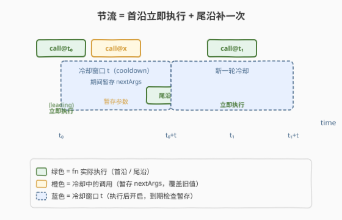
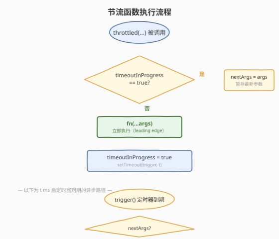
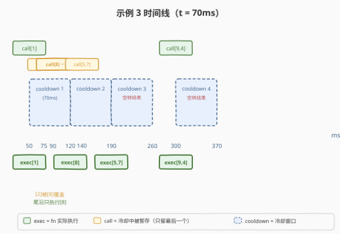

# LeetCode 节流 题解

## 1. 题目概述

- **标题 / 题号**：节流（#2676，medium）
- **链接**：https://leetcode.cn/problems/throttle/
- **难度**：中等
- **标签**：函数、闭包、定时器、节流

> ⚠️ 本题为 LeetCode 付费题，题意描述根据官方示例用例与 hints 重建，可能与官方题面有出入。

**题意**：编写函数 `throttle(fn, t)`，接收一个函数 `fn` 和时间 `t`（毫秒），返回 `fn` 的**节流版本**。

**节流函数**的行为由两条规则驱动：

1. **首沿（leading edge）**：当不在冷却期时调用，**立即执行** `fn`，并开启一个 `t` 毫秒的**冷却窗口**。
2. **尾沿（trailing edge）**：冷却窗口内若有新调用，**只暂存最新调用的参数**（覆盖旧值）；冷却到期时，若暂存参数非空，用其执行 `fn` 并**重新开启**一轮 `t` 毫秒冷却；若暂存为空，则**结束冷却**，回到"可立即执行"状态。

直观地说：**第一次调用立即响应，之后每 `t` 毫秒至多放行一次（放行的是窗口内最后一次的参数），停止调用后补一次尾沿再沉寂。**

**示例 1**：

```text
输入：t = 100
calls = [{"t": 20, "inputs": [1]}]
输出：[{"time": 20, "inputs": [1]}]
解释：
- call@20([1]) 不在冷却期 → 立即执行 fn(1) 于 t=20；开启冷却至 t=120；
- 无后续调用，t=120 冷却到期、暂存为空 → 结束冷却。
```

**示例 2**：

```text
输入：t = 50
calls = [{"t": 50, "inputs": [1]}, {"t": 75, "inputs": [2]}]
输出：[{"time": 50, "inputs": [1]}, {"time": 100, "inputs": [2]}]
解释：
- call@50([1]) 不在冷却期 → 立即执行 fn(1) 于 t=50；开启冷却至 t=100；
- call@75([2]) 在冷却期内 → 暂存参数 [2]；
- t=100 冷却到期，暂存非空 → 执行 fn(2)，重新开启冷却至 t=150；
- t=150 冷却到期，暂存为空 → 结束冷却。
```

**示例 3**：

```text
输入：t = 70
calls = [
  {"t": 50, "inputs": [1]},
  {"t": 75, "inputs": [2]},
  {"t": 90, "inputs": [8]},
  {"t": 140, "inputs": [5, 7]},
  {"t": 300, "inputs": [9, 4]}
]
输出：[
  {"time": 50, "inputs": [1]},
  {"time": 120, "inputs": [8]},
  {"time": 190, "inputs": [5, 7]},
  {"time": 300, "inputs": [9, 4]}
]
解释：
- call@50([1]) 首沿 → 执行于 t=50；冷却至 t=120；
- call@75([2]) 冷却中暂存；call@90([8]) 覆盖暂存为 [8]；
- t=120 尾沿 → 执行 [8]；冷却至 t=190；
- call@140([5,7]) 冷却中暂存；
- t=190 尾沿 → 执行 [5,7]；冷却至 t=260；
- t=260 暂存为空 → 结束冷却；
- call@300([9,4]) 不在冷却期 → 立即执行于 t=300；冷却至 t=370；
- t=370 暂存为空 → 结束冷却。
```

**约束**：

- `0 <= t <= 1000`
- `1 <= calls.length <= 10`
- `0 <= calls[i].t <= 1000`
- `0 <= calls[i].inputs.length <= 10`

> 💡 本题是 LeetCode「30 天 JavaScript」系列，**仅提供 JavaScript / TypeScript 提交入口**，核心考察**闭包**与 `setTimeout` 的配合，以及"首沿 + 尾沿"的双沿节流语义。本文以 JS 为提交语言，并给出 Python 概念等价实现。

## 2. 解题思路

### 2.1 暴力思路：轮询 + 时间戳

用 `setInterval` 周期性巡逻：每次调用只记 `lastArgs` 和 `lastCallTime`，由固定间隔的 interval 检查"距上次执行 ≥ t 且有待执行"就触发 `fn(...lastArgs)` 并清待执行位。

```javascript
function throttle(fn, t) {
  let lastArgs = null, lastExec = 0, pending = false;
  setInterval(() => {
    if (pending && Date.now() - lastExec >= t) {
      pending = false;
      lastExec = Date.now();
      fn(...lastArgs);
    }
  }, 10);
  return function (...args) {
    if (Date.now() - lastExec >= t) {
      lastExec = Date.now();
      fn(...args);
    } else {
      lastArgs = args; pending = true;
    }
  };
}
```

可行但差劲：interval 即使空闲也**持续空转**耗 CPU；首沿逻辑与尾沿逻辑混杂在两处，`lastExec` 初值为 0 时首次调用会误判时间差。问题本质是"冷却到期精确触发一次"，轮询是把"事件驱动"硬拧成"时间驱动"。

### 2.2 核心观察：闭包 + setTimeout 自驱动尾沿



关键洞察：**让 `setTimeout` 自己管"冷却到期"，而非轮询去查"到没到时间"**。

闭包里维护两个变量：

| 变量 | 职责 | 类比 |
|------|------|------|
| `timeoutInProgress`（布尔） | 标记当前是否在冷却窗口内 | "门是否关着" |
| `nextArgsToCall`（参数数组 / null） | 冷却期间暂存的最新调用参数 | "门缝里塞的最后一张条" |

**两条路径**：

- **同步路径（调用时）**：若 `timeoutInProgress` 为 `false` → 立即执行 `fn`（首沿），置 `timeoutInProgress = true`，挂一个 `t` 毫秒的 `setTimeout`；若为 `true` → 只把 `nextArgsToCall` 更新为本次 `args`（覆盖旧值）。
- **异步路径（定时器到期）**：若 `nextArgsToCall` 非空 → 执行 `fn(...nextArgsToCall)`（尾沿），清空暂存，**再挂一轮** `t` 毫秒 `setTimeout`（续杯冷却）；若为空 → 置 `timeoutInProgress = false`（开门），结束。

于是产生一条**不变式**：冷却期内**至多暂存一组参数**，且每次冷却到期**要么续杯要么开门**。冷却不会无限运行——一旦无新调用，到期即开门沉寂。

> ⚠️ **尾沿执行后必须续杯，不能直接开门**：尾沿执行本身代表"窗口内有新调用"，新调用又需要 `t` 毫秒冷却保护。若尾沿执行后立即开门，紧接而来的调用会变成首沿立即执行，与"每 `t` 毫秒至多一次"语义冲突。续杯保证了"尾沿执行时刻 → 下一轮窗口"的连续冷却链。

### 2.3 算法流程图



上半部为**同步路径**（调用即判定，不阻塞）：先看是否冷却中——是则暂存参数返回，否则首沿执行并挂定时器。下半部为**异步路径**（`t` 毫秒后定时器到期）：检查暂存——非空则尾沿执行 + 续杯定时器，为空则开门结束。两条路径通过闭包变量 `timeoutInProgress` 与 `nextArgsToCall` 解耦。

### 2.4 示例演算



- **call@90([8]) 覆盖 call@75([2])**：两者均在冷却窗口 1（`[50, 120]`）内，暂存被后到的 `[8]` 覆盖，`[2]` **永远不会执行**——这是节流"只放行窗口内最后一次"的核心体现。
- **t=260 与 t=370 的空转结束**：冷却到期且暂存为空时，函数回到"可立即执行"状态。`call@300` 正因此能首沿立即执行，而非等 70ms。

> 💡 **对比防抖（2627）**：防抖每次调用 `clearTimeout` **重置时钟**，连续调用期间执行被无限推迟；节流**不重置时钟**，冷却到期就放行一次。防抖 = 清零重来，节流 = 按节奏放行。

## 3. 参考代码

### JavaScript（提交语言）

```javascript
/**
 * @param {Function} fn
 * @param {number} t
 * @return {Function}
 */
var throttle = function (fn, t) {
    let timeoutInProgress = false; // 是否在冷却窗口内
    let nextArgsToCall = null;    // 冷却期间暂存的最新参数

    return function (...args) {
        if (timeoutInProgress) {
            // 冷却中：暂存最新参数（覆盖旧值）
            nextArgsToCall = args;
        } else {
            // 首沿：立即执行并开启冷却
            fn.apply(this, args);
            timeoutInProgress = true;
            const trigger = () => {
                if (nextArgsToCall) {
                    // 尾沿：用暂存参数执行并续杯冷却
                    fn.apply(this, nextArgsToCall);
                    nextArgsToCall = null;
                    setTimeout(trigger, t);
                } else {
                    // 无暂存：结束冷却
                    timeoutInProgress = false;
                }
            };
            setTimeout(trigger, t);
        }
    };
};
```

> 💡 箭头函数 `trigger` 捕获外层 `function (...args)` 的 `this`，使尾沿执行时 `this` 与首沿调用者一致（对象方法节流时更稳妥）。`trigger` 是 `const` 声明，其函数体内引用自身名做递归续杯——声明在 `setTimeout` 触发前已完成初始化，无 TDZ 问题。

### TypeScript

```typescript
function throttle(fn: (...args: any[]) => void, t: number) {
    let timeoutInProgress = false;
    let nextArgsToCall: any[] | null = null;

    return function (this: unknown, ...args: any[]) {
        if (timeoutInProgress) {
            nextArgsToCall = args;
        } else {
            fn.apply(this, args);
            timeoutInProgress = true;
            const trigger = () => {
                if (nextArgsToCall) {
                    fn.apply(this, nextArgsToCall);
                    nextArgsToCall = null;
                    setTimeout(trigger, t);
                } else {
                    timeoutInProgress = false;
                }
            };
            setTimeout(trigger, t);
        }
    };
}
```

### Python（概念等价，threading.Timer）

> 本题 LeetCode 仅开放 JS/TS，Python 版作概念对照。`threading.Timer(interval, func)` 在 `interval` 秒后于**后台线程**执行 `func`，对应 `setTimeout`；布尔标志 `in_cooldown` 对应 `timeoutInProgress`。

```python
import threading


def throttle(fn, t):
    in_cooldown = False  # 是否在冷却窗口内
    next_args = None     # 冷却期间暂存的最新参数

    def throttled(*args):
        nonlocal in_cooldown, next_args
        if in_cooldown:
            # 冷却中：暂存最新参数
            next_args = args
        else:
            # 首沿：立即执行并开启冷却
            fn(*args)
            in_cooldown = True

            def trigger():
                nonlocal in_cooldown, next_args
                if next_args is not None:
                    # 尾沿：执行并续杯
                    fn(*next_args)
                    next_args = None
                    threading.Timer(t / 1000, trigger).start()
                else:
                    # 无暂存：结束冷却
                    in_cooldown = False

            threading.Timer(t / 1000, trigger).start()

    return throttled
```

> ⚠️ `threading.Timer` 在后台线程触发，与 JS 单线程事件循环模型不同。若需单线程异步语义，可用 `asyncio`：`loop.call_later(t / 1000, trigger)` 配合协程调度，对应关系更贴切，但要求 `fn` 在事件循环上下文里运行。

## 4. 复杂度分析

| 维度 | 复杂度 | 说明 |
|------|--------|------|
| 时间复杂度 | $O(1)$ | 每次调用仅常数次闭包操作 + 至多一次 `setTimeout` 注册；与 `t`、调用次数无关 |
| 空间复杂度 | $O(1)$ | 仅维护一个布尔标志 + 一组暂存参数；定时器到期后闭包可被 GC |

> 💡 真实"延迟成本"是 $O(t)$ 毫秒的冷却等待，但属**调度开销**而非**计算复杂度**——冷却期间主线程空闲，可处理其它任务。

## 5. 扩展：节流的 leading/trailing 变体与 lodash 选项

| 变体 | 首沿 | 尾沿 | 行为 | 典型场景 |
|------|------|------|------|----------|
| **leading + trailing（本题）** | ✅ 立即执行 | ✅ 到期补一次 | 首次响应 + 窗口内最后一次兜底 | `scroll` / `resize` 限频 |
| **leading only** | ✅ 立即执行 | ❌ 丢弃 | 纯限频，窗口内调用全部丢弃 | 按钮防连点（只认第一次） |
| **trailing only** | ❌ 推迟 | ✅ 到期补一次 | 首次也等 `t` ms 才执行 | 需要延迟响应的限频 |

- lodash `_.throttle(fn, t, { leading: true, trailing: true })` 即为本题实现；设 `{ trailing: false }` 切到 leading only，`{ leading: false }` 切到 trailing only。
- **节流 vs 防抖的本质**：节流**不重置时钟**（冷却到期就放行），防抖**每次调用重置时钟**（只要还在动就不输出）。工程上用 `maxWait` 选项把防抖拉回"防抖 + 节流"折中——保证至多每 `maxWait` ms 必触发一次，避免输入不停时防抖永不执行。

> 💡 一句话区分：**节流是"按节奏放行"**（时钟不被重置，到点放一个），**防抖是"清零重来"**（每次调用重置时钟，只留最后）。

## 6. 面试要点

1. **尾沿执行后为什么要续杯定时器，不能直接开门？**

   > 尾沿执行说明"窗口内有新调用"，新调用需要 `t` ms 冷却保护。若尾沿后立即开门，紧接的调用会变成首沿立即执行，破坏"每 `t` ms 至多一次"。续杯保证了"尾沿时刻 → 下一轮窗口"的连续冷却链。

2. **冷却窗口内的多次调用，为什么只执行最后一个？**

   > 闭包变量 `nextArgsToCall` 每次被**覆盖**而非追加，窗口内无论调用多少次，暂存的始终是最新参数。到期时只读一次 `nextArgsToCall`，故只执行最后一次。这与"节流限频"的语义一致：窗口内只放行一个代表。

3. **箭头函数 `trigger` 为什么能递归引用自身？**

   > `const trigger = () => { ... setTimeout(trigger, t) ... }` 中 `trigger` 是 `const` 声明，箭头函数体内引用自身名。由于 `setTimeout` 注册的回调在声明语句执行完毕后才会触发（异步），此时 `trigger` 已完成 TDZ 初始化，可安全引用自身做续杯递归。

4. **节流和防抖有什么本质区别？**

   > 防抖**重置时钟**：连续调用期间时钟被不断推后，只有"停顿够久"才触发，执行的是最后一次；节流**不重置时钟**：到点就放行一次，连续调用按固定速率被采样。防抖 = 去抖动（只要还在动就不输出），节流 = 限频（动多久就按固定频率输出）。

5. **`timeoutInProgress` 用布尔标志而非存储定时器 ID，会不会有问题？**

   > 本题的定时器**永远到期执行**，无需中途取消（与防抖的 `clearTimeout` 不同），故布尔标志足够。定时器到期后要么续杯（重新 `setTimeout`）、要么开门（置 `false`），不存在"定时器悬挂"的情况。若需支持手动取消节流（如 `cancel()` 方法），则需存储 ID 以便 `clearTimeout`。

> 💡 **一句话总结**：2676 = 「布尔标志管冷却、暂存变量管最新参数；首沿立即执行 + 挂 `setTimeout`，到期看暂存——有则尾沿执行 + 续杯，无则开门」。节流 = 按节奏放行，首沿 + 尾沿双沿。

## 同类练习题

| # | 题目 | 与本题的关联 |
|---|------|-------------|
| 2627 | [函数防抖](https://leetcode.cn/problems/debounce/) | `clearTimeout` + `setTimeout` 重置时钟，"清零重来"只放行最后一次；节流是其"不重置、按节奏放行"的对照组（[题解](../2601-2700/2627_函数防抖.md)） |
| 2622 | [有时间限制的缓存](https://leetcode.cn/problems/cache-with-time-limit/) | `setTimeout` + `clearTimeout` 管键过期，覆盖时必须清旧 timer 防误删，与节流"挂定时器管冷却"思想相通（[题解](../2601-2700/2622_有时间限制的缓存.md)） |
| 2621 | [睡眠函数](https://leetcode.cn/problems/sleep/) | `new Promise(r => setTimeout(r, millis))`，一次性延迟回调；节流是其"反复首沿 + 尾沿续杯"的升级（[题解](../2601-2700/2621_睡眠函数.md)） |
| 2637 | [有时间限制的 Promise 对象](https://leetcode.cn/problems/promise-time-limit/) | 给 Promise 加超时取消，"延迟 + 撤销"思想相通，对照"到期触发"与"超时中断"（[题解](../2601-2700/2637_有时间限制的Promise对象.md)） |
