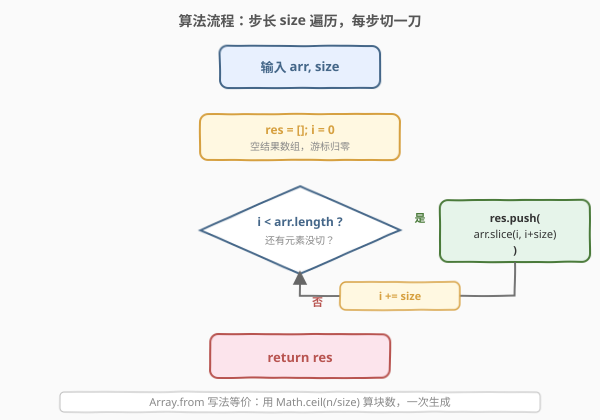
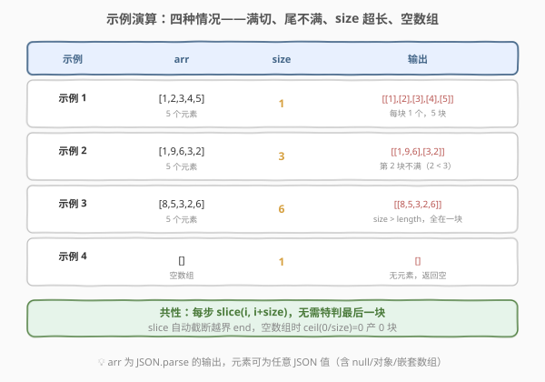

# 分块数组

- **题目名称**：分块数组
- **链接**：[2677. 分块数组](https://leetcode.cn/problems/chunk-array/)
- **难度**：简单
- **标签**：数组、模拟、`Array.prototype.slice`

## 1. 题目概述

给定一个数组 `arr` 和一个块大小 `size`，返回一个**分块**的数组。

**分块**的数组包含了 `arr` 中的原始元素，但是每个子数组的长度都是 `size`。如果 `arr.length` 不能被 `size` 整除，那么最后一个子数组的长度可能小于 `size`。

你可以假设该数组是 `JSON.parse` 的输出结果（有效 JSON）。**不得使用 lodash 的 `_.chunk` 函数。**

**示例 1**：

```text
输入：arr = [1,2,3,4,5], size = 1
输出：[[1],[2],[3],[4],[5]]
解释：数组 arr 被分割成了每个只有一个元素的子数组。
```

**示例 2**：

```text
输入：arr = [1,9,6,3,2], size = 3
输出：[[1,9,6],[3,2]]
解释：数组 arr 被分割成了每个有三个元素的子数组。然而，第二个子数组只有两个元素。
```

**示例 3**：

```text
输入：arr = [8,5,3,2,6], size = 6
输出：[[8,5,3,2,6]]
解释：size 大于 arr.length，因此所有元素都在第一个子数组中。
```

**示例 4**：

```text
输入：arr = [], size = 1
输出：[]
解释：没有元素需要分块，因此返回一个空数组。
```

**约束条件**：

- `arr` 是表示数组的字符串
- $2 \leq \text{JSON.stringify(arr).length} \leq 10^5$
- $1 \leq \text{size} \leq \text{arr.length} + 1$

> 💡 本题是 30 Days of JavaScript 系列的**数组操作题**，核心考点是 `Array.prototype.slice` 的边界特性：`slice` 会自动把越界的 `end` 截断到数组末尾，因此**无需特判最后一块是否凑满**——一刀切下去，不满自然短。题目以 JavaScript 为载体，下文另给 Python 等价实现。

---

## 2. 解题思路

### 2.1 暴力思路：逐个 push

最直白的写法是维护一个临时数组 `cur`，逐个元素 push，满了就推入结果并清空：

```text
cur = []
for x in arr:
    cur.push(x)
    if cur.length == size:
        res.push(cur); cur = []
if cur.length > 0: res.push(cur)   // ← 还得手动处理尾巴
```

能 AC，但有两个累赘：

1. **需要手动处理「尾巴不满」**：循环结束后要单独判断 `cur` 是否还有残留元素再 push 一次，多一个分支。
2. **状态多**：同时维护 `res`、`cur`、计数器三个变量，逻辑分散。

> ⚠️ 新手常犯的错误是**忘记处理尾巴**——当 `arr.length % size != 0` 时，最后不满一块的元素会丢失。这并非「错误」而是「遗漏」，但说明逐个 push 的写法把边界责任交给了调用方。

### 2.2 核心观察：`slice` 天然处理「最后一块不满」


**关键洞察**：`arr.slice(i, i + size)` 有一个绝妙的边界特性——当 `i + size` 超过数组长度时，`slice` **不会报错、不会补 null，而是自动截断到数组末尾**。这意味着：

- **满块**：`slice(0, 3)` 从长度 5 的数组取出 `[1,9,6]`，正好 3 个。
- **不满块**：`slice(3, 6)` 从长度 5 的数组取出 `[3,2]`，因为只有下标 3、4 有值，`end=6` 被截断到 5，自然只取 2 个。
- **空数组**：`slice(0, 1)` 从空数组取出 `[]`，但循环根本不进入，结果为 `[]`。

因此，**不需要任何 `if` 判断最后一块**——步长 `size` 遍历，每步切一刀，`slice` 替你处理所有边界。这是「把边界责任下沉到语言内置 API」的典型范例。

> 💡 **对照 lodash 的 `_.chunk`**：lodash 内部实现正是用 `Math.ceil(length / size)` 算块数，然后逐块 `slice`。题目禁止用 `_.chunk`，但允许你手写同样的逻辑——理解了 `slice` 的截断特性，你就是在手写 `_.chunk`。

### 2.3 算法流程图



两种等价写法：

1. **for 循环**：`i` 从 0 出发，步长 `size`，每步 `res.push(arr.slice(i, i + size))`，`i >= arr.length` 时停止。
2. **`Array.from`**：块数 = `Math.ceil(arr.length / size)`，用 `Array.from({length: 块数}, (_, i) => arr.slice(i * size, i * size + size))` 一次性生成。

两种写法的切片逻辑完全相同，区别只是「循环 push」还是「一次映射」。

### 2.4 示例演算



| 示例 | arr | size | 切片过程 | 输出 |
|------|-----|------|----------|------|
| 1 | `[1,2,3,4,5]` | 1 | `slice(0,1)`×5 | `[[1],[2],[3],[4],[5]]` |
| 2 | `[1,9,6,3,2]` | 3 | `slice(0,3)` → `[1,9,6]`；`slice(3,6)` → `[3,2]` | `[[1,9,6],[3,2]]` |
| 3 | `[8,5,3,2,6]` | 6 | `slice(0,6)` → 全部 5 个（end 截断） | `[[8,5,3,2,6]]` |
| 4 | `[]` | 1 | `ceil(0/1)=0`，0 块 | `[]` |

四种情况——满切、尾不满、size 超长、空数组——**无一例外**，`slice` 全部正确处理，零特判。

---

## 3. 参考代码

### JavaScript（写法一：for 循环 + slice）

```javascript
/**
 * @param {Array} arr
 * @param {number} size
 * @return {Array}
 */
var chunk = function (arr, size) {
    const res = [];
    for (let i = 0; i < arr.length; i += size) {
        res.push(arr.slice(i, i + size));
    }
    return res;
};
```

> 💡 最直白、最通用的写法。步长 `size` 推进游标 `i`，每步切一刀 `slice(i, i + size)`。`slice` 自动截断越界 `end`，因此最后不满一块无需任何特判。空数组时 `0 < 0` 为假，循环不进入，返回 `[]`。

### JavaScript（写法二：Array.from 一次性生成）

```javascript
var chunk = function (arr, size) {
    return Array.from(
        { length: Math.ceil(arr.length / size) },
        (_, i) => arr.slice(i * size, i * size + size)
    );
};
```

> 💡 用 `Math.ceil(arr.length / size)` 算出块数，交给 `Array.from` 生成。`Array.from` 的第二个参数是 map 函数，`_` 是占位（忽略值），`i` 是下标。这种写法更函数式，把「循环 + push」压缩成一行映射。空数组时 `ceil(0/size) = 0`，生成空数组。

### JavaScript（写法三：while 循环）

```javascript
var chunk = function (arr, size) {
    const res = [];
    let i = 0;
    while (i < arr.length) {
        res.push(arr.slice(i, i + size));
        i += size;
    }
    return res;
};
```

> 💡 while 与 for 等价，只是把步长推进和条件判断拆开。适合需要在循环体内做更多操作（如提前 break）的场景。

### TypeScript

```typescript
type JSONValue = null | boolean | number | string | JSONValue[] | { [key: string]: JSONValue };
type Obj = Record<string, JSONValue> | Array<JSONValue>;

function chunk(arr: Obj[], size: number): Obj[][] {
    const res: Obj[][] = [];
    for (let i = 0; i < arr.length; i += size) {
        res.push(arr.slice(i, i + size));
    }
    return res;
};
```

> 💡 TS 版与 JS 几乎一致，只是声明了类型：输入 `Obj[]`（JSON 值数组）、输出 `Obj[][]`（分块后的二维数组）。`JSONValue` 联合类型覆盖了所有合法 JSON 值。

### Python

```python
from typing import Any, List

def chunk(arr: List[Any], size: int) -> List[List[Any]]:
    res = []
    for i in range(0, len(arr), size):
        res.append(arr[i:i + size])
    return res
```

> 💡 Python 的列表切片 `arr[i:i+size]` 与 JS 的 `arr.slice(i, i+size)` 行为完全一致——越界 `end` 自动截断到末尾。`range(0, len(arr), size)` 以步长 `size` 生成起点序列，等价于 JS 的 `for (let i = 0; i < arr.length; i += size)`。空列表时 `range(0, 0, size)` 为空，返回 `[]`。

---

## 4. 复杂度分析

| 维度 | 复杂度 | 说明 |
|------|--------|------|
| **时间复杂度** | $O(n)$ | `slice` 总共拷贝 $n$ 个元素，块数 $\lceil n / \text{size} \rceil$ 次切片，每次拷贝 $\leq \text{size}$ 个，总和恰为 $n$ |
| **空间复杂度** | $O(n)$ | 结果数组含 $n$ 个元素的引用（浅拷贝），不递归复制嵌套对象 |

> 💡 `slice` 是**浅拷贝**——只复制一层引用。若 `arr` 元素是对象（如 `{}`），分块后原对象与结果中的引用指向同一实例，修改一方会影响另一方。本题只要求分块结构，不要求深拷贝，故浅拷贝足够。若需深拷贝，可用 `structuredClone` 或 `JSON.parse(JSON.stringify(...))`。

---

## 5. 扩展：`slice` 的截断特性与 lodash `_.chunk`

- **`slice` 的三种边界**：`slice(start, end)` 中，若 `end > length` 则截断到 `length`；若 `start < 0` 则从末尾倒数；若 `start >= length` 则返回空数组。本题只用到了第一种——`end` 越界自动截断。这把「最后一块不满」的边界责任从调用方下沉到了语言内置 API，是最优雅的「零特判」来源。

- **lodash `_.chunk` 内部实现**：lodash 源码中 `_.chunk` 先算 `Math.ceil(length / size)`，然后用 `baseSlice(array, start, end)` 逐块切片——与你手写的 `Array.from` 写法几乎逐行对应。题目禁止用 `_.chunk`，恰恰是让你理解它背后这几行代码。

- **`Array.from` 的妙用**：`Array.from({length: n}, mapFn)` 是 JS 中「生成定长数组并映射」的惯用法，等价于 Python 的列表推导 `[f(i) for i in range(n)]`。它比 `new Array(n).fill().map(...)` 更语义化，且不会因 `fill` 产生意外共享引用。

- **深拷贝 vs 浅拷贝**：`slice` 只复制一层。若题目改为「分块且每块独立修改不影响原数组」，则需深拷贝。但大多数分块场景（分页、批处理、矩阵分块）只关心结构划分，浅拷贝即足够。

---

## 6. 面试要点

1. **为什么不需要特判最后一块是否凑满？**

   > 因为 `Array.prototype.slice(i, i + size)` 在 `i + size` 超过数组长度时，会**自动截断到末尾**而不报错。最后一块自然只取到数组末尾的元素，长度可能小于 `size`。这是 `slice` 的内置边界行为，无需调用方处理。

2. **for 循环写法和 `Array.from` 写法有什么区别？如何选？**

   > 两者逻辑等价。for 循环写法更易读、易调试，适合在循环体内需要额外逻辑时用；`Array.from` 写法更声明式、一行搞定，适合纯映射场景。性能上无实质差异——`Array.from` 内部也是循环 + map。选哪种看团队风格偏好。

3. **空数组 `[]` 的边界情况如何处理？**

   > for 循环写法：`0 < 0` 为假，循环不进入，返回空数组 `[]`。`Array.from` 写法：`Math.ceil(0 / size) = 0`，`Array.from({length: 0})` 生成空数组。两种写法都天然返回 `[]`，无需特判。

4. **`slice` 是深拷贝还是浅拷贝？如果元素是对象会怎样？**

   > `slice` 是**浅拷贝**——只复制引用，不递归复制嵌套对象。若 `arr` 元素是对象（如 `{a: 1}`），分块后结果中的引用与原数组指向同一实例，修改一方会影响另一方。本题只要求分块结构，不要求深拷贝，故浅拷贝足够。若需深拷贝可用 `structuredClone`。

5. **题目说「不能使用 lodash 的 `_.chunk`」，那 lodash 内部是怎么实现的？**

   > lodash 的 `_.chunk` 内部正是用 `Math.ceil(length / size)` 算块数，然后逐块用 `baseSlice(array, start, end)` 切片——与手写的 `Array.from` 写法逐行对应。题目禁止用 `_.chunk`，恰恰是让你理解它背后这几行代码：算块数 + 逐块 slice。

---

## 7. 同类练习题

- [2619. 数组原型对象的最后一个元素](https://leetcode.cn/problems/array-prototype-last/)：给 `Array` 原型加 `last()` 方法，考原型链与 `this` 绑定，同属 30 Days of JS 数组系列
- [2626. 数组归约运算](https://leetcode.cn/problems/array-reduce-transformation/)：手写 `Array.prototype.reduce`，考回调累积语义，与分块同为「数组遍历 + 聚合」系列
- [2635. 转换数组中的每个元素](https://leetcode.cn/problems/apply-transform-over-each-element-in-array/)：手写 `map`，考「遍历 + 变换」，与分块的「遍历 + 切片」结构同构
- [2634. 过滤数组中的元素](https://leetcode.cn/problems/filter-elements-from-array/)：手写 `filter`，考「遍历 + 条件保留」，同为数组原型方法实现系列
