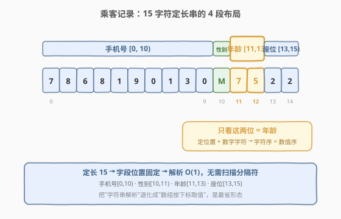
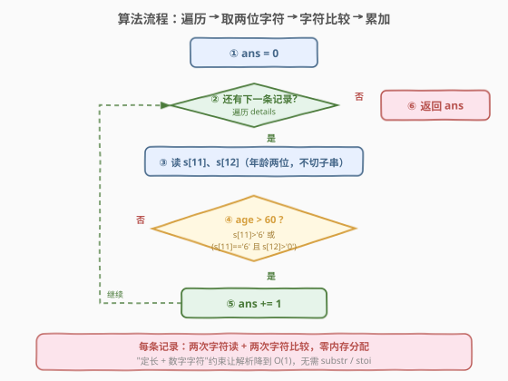
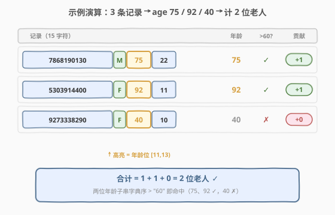

# 老人的数目

- **题目名称**：老人的数目
- **链接**：[2678. 老人的数目](https://leetcode.cn/problems/number-of-senior-citizens/)
- **难度**：简单
- **标签**：数组、字符串

## 1. 题目概述

给你一个下标从 $0$ 开始的字符串数组 `details`，其中每个元素都是一位乘客的信息，用**长度为 15 的字符串**表示，格式如下：

- 前 $10$ 个字符是乘客的**手机号码**；
- 接下来 $1$ 个字符是乘客的**性别**（`'M'` / `'F'` / `'O'`）；
- 接下来 $2$ 个字符是乘客的**年龄**；
- 最后 $2$ 个字符是乘客的**座位号**。

请你返回乘客中**年龄严格大于 $60$ 岁**的人数。

**示例 1**：

```text
输入：details = ["7868190130M7522","5303914400F9211","9273338290F4010"]
输出：2
解释：下标为 0、1 和 2 的乘客年龄分别为 75、92 和 40。所以有 2 人年龄大于 60 岁。
```

**示例 2**：

```text
输入：details = ["1313579440F2036","2921522980M5644"]
输出：0
解释：没有乘客的年龄大于 60 岁。
```

**约束条件**：

- $1 \le \text{details.length} \le 100$
- $\text{details[i].length} == 15$
- `details[i]` 中的数字只包含 `'0'` 到 `'9'`。
- `details[i][10]` 是 `'M'`、`'F'` 或 `'O'` 之一。
- 所有乘客的手机号码和座位号互不相同。

> 💡 **审题关键**：① 记录是**定长 15 字符串**，年龄**固定占第 11、12 位**（下标 11、12），无需扫描定位字段，直接按下标取；② "严格大于 60" 意味着 $60$ 岁本身**不计入**（即 $\ge 61$ 才算）；③ 年龄恒为两位十进制字符，"定长 + 定位置 + 数字字符"这三点合起来，让本题可以**绕开整数解析**，见 2.2。

---

## 2. 解题思路

### 2.1 暴力思路：切片转整数再比较

最直白的做法：对每条记录切出第 11、12 位作子串，转成整数，再与 $60$ 比较，满足就累加。

```python
ans = 0
for s in details:
    if int(s[11:13]) > 60:
        ans += 1
```

逻辑正确、可读性高，$n \le 100$ 时 $O(n)$ 完全在时限内。缺点是每条记录都要做一次 `substr` + `stoi`：子串会**临时分配字符串对象**（C++ 的 `s.substr(11,2)` 拷贝两个字符），`stoi` 还要逐位 $\times 10 + d$ 算出数值。对 $n=100$ 这些开销可忽略，但当题目变形为「海量记录 / 极致性能」时，可以更省——见 2.2。

> 💡 面试中先报这版（讲清下标定位 + 转换 + 比较），再主动点出"年龄是定长两位数字字符，其实不必转 int"，是加分项——展示你看到了**数据格式的结构**而不仅是"能过就行"。

### 2.2 核心观察：定长 + 数字字符 → 字符直接比较（免转 int）



关键观察由题面约束直接保证：

| 约束 | 推论 |
|------|------|
| `details[i].length == 15` | 年龄**恒占**下标 11、12 两位，**无需查找字段位置**，按下标取即可 |
| `details[i][11]`、`details[i][12]` 都是 `'0'..'9'` | 两位都是**数字字符**，字符码 `'0'<'1'<…<'9'` 与数值 $0<1<…<9$ 顺序一致 |
| 年龄恒为两位 | 子串与阈值 `"60"` **等长**，等长纯数字串的**字典序 == 数值序** |

由这三点推出：**两位年龄子串与 `"60"` 的字典序比较，等价于数值比较**，于是

```python
s[11:13] > "60"   # 等价于 int(s[11:13]) > 60，但免去 substr 分配与 stoi 计算
```

直接成立。再进一步，连子串都不必切，**就地比两个字符**即可判断 `age > 60`：

$$\text{age} > 60 \iff s_{11} > \texttt{'6'} \;\cup\; (s_{11} = \texttt{'6'} \,\cap\, s_{12} > \texttt{'0'})$$

即：十位字符比 `'6'` 大（$\Rightarrow$ 年龄 $\ge 70$）直接成立；十位等于 `'6'` 时再看个位是否大于 `'0'`（$\Rightarrow$ 年龄 $\in [61,69]$）。两种情形并起来，恰好覆盖 $61 \sim 99$，而 $60$（`'6','0'`）与 $\le 59$ 都落空。

| age 子串 | $s_{11}$ | $s_{12}$ | 十位 $>$ `'6'`? | 十位 $=$ `'6'` 且个位 $>$ `'0'`? | 计入? |
|----------|----------|----------|----------------|----------------------------------|-------|
| `"75"` | `'7'` | `'5'` | ✓ | — | ✓ |
| `"92"` | `'9'` | `'2'` | ✓ | — | ✓ |
| `"61"` | `'6'` | `'1'` | ✗ | ✓ | ✓ |
| `"60"` | `'6'` | `'0'` | ✗ | ✗（`'0'>'0'` 假） | ✗ |
| `"40"` | `'4'` | `'0'` | ✗ | ✗ | ✗ |
| `"07"` | `'0'` | `'7'` | ✗ | ✗ | ✗ |

> ⚠️ **"严格大于"对边界 `"60"` 的处理**：`'6'=='6'` 但 `'0'>'0'` 为假，故 $60$ 岁不计入——这是"严格"二字的落地。若题目改成 $\ge 60$，把个位判定由 $>$ 改为 $\ge$ 即可（即 $s_{12} \ge \texttt{'0'}$，此时十位 $=$ `'6'` 恒成立，等价于 $s_{11} > \texttt{'6'} \cup s_{11} = \texttt{'6'}$）。

### 2.3 算法流程图



**逻辑执行步骤**：

| 步骤 | 动作 | 说明 |
|------|------|------|
| ① | `ans = 0` | 初始化计数器 |
| ② | 还有下一条记录? | 遍历 `details`，逐条处理 |
| ③ | 读 `s[11]`、`s[12]` | 取年龄的十位、个位字符（**不切子串、不转 int**） |
| ④ | `s[11]>'6'` 或 (`s[11]=='6'` 且 `s[12]>'0'`)? | 字符级判定 `age > 60` |
| ⑤ | `ans += 1` | 命中则计数 |
| ⑥ | 返回 `ans` | 遍历结束输出结果 |

> 💡 全程只读两个字符、做两次字符比较，每条记录 $O(1)$ 且**零内存分配**。这是"定长定位置"格式解析的典型最优形态。

### 2.4 示例演算



以示例 1 的三条记录为例，逐条抽取年龄（高亮第 11、12 位）并判定：

| 记录（15 字符） | 手机号 | 性别 | 年龄子串 | 数值 | `> 60`? | 贡献 |
|-----------------|--------|------|----------|------|---------|------|
| `7868190130M7522` | 7868190130 | M | **75** | 75 | ✓ | +1 |
| `5303914400F9211` | 5303914400 | F | **92** | 92 | ✓ | +1 |
| `9273338290F4010` | 9273338290 | F | **40** | 40 | ✗ | +0 |

合计 $1 + 1 + 0 = 2$ 位老人 $\checkmark$，与示例 1 输出一致。

> 💡 对示例 2（`["1313579440F2036","2921522980M5644"]`）：年龄子串分别为 `"20"`（$20$）、`"56"`（$56$），均 $\le 60$，合计 $0$ $\checkmark$。注意第二条的年龄是第 11、12 位 `"56"` 而非座位号 `"44"`——下标定位时别看错段，这是本题最易犯的低级错误。

---

## 3. 参考代码

### 方法一：切片转 int（直观首选）

### C++

```cpp
class Solution {
public:
    int countSeniors(vector<string>& details) {
        int ans = 0;
        for (const string& s : details) {
            if (stoi(s.substr(11, 2)) > 60) ++ans;
        }
        return ans;
    }
};
```

### Python

```python
class Solution:
    def countSeniors(self, details: List[str]) -> int:
        return sum(int(s[11:13]) > 60 for s in details)
```

### 方法二：字符直接比较（免转 int，最优）

### C++

```cpp
class Solution {
public:
    int countSeniors(vector<string>& details) {
        int ans = 0;
        for (const string& s : details) {
            // age > 60  <=>  十位>'6'  或 (十位=='6' 且 个位>'0')
            if (s[11] > '6' || (s[11] == '6' && s[12] > '0')) ++ans;
        }
        return ans;
    }
};
```

### Python

```python
class Solution:
    def countSeniors(self, details: List[str]) -> int:
        ans = 0
        for s in details:
            if s[11] > '6' or (s[11] == '6' and s[12] > '0'):
                ans += 1
        return ans
```

> 💡 **Python 还有一行等价写法**：`return sum(s[11:13] > "60" for s in details)`——利用"等长纯数字串字典序 == 数值序"。它比方法二的字符级判定多切一次子串，但比方法一免去 `int()` 解析，可读性最佳，是 Python 中最地道的版本。三者复杂度同为 $O(n)$，差别仅在常数级开销。

> ⚠️ **C++ 切勿写成 `s[11] > 6`（数字 `6`）**：`s[11]` 是 `char`，与 `int` 比较时 `s[11]` 会被提升为它的 ASCII 值（如 `'7'`→$55$），而 $55 > 6$ 恒真，于是**所有乘客都被计入**。必须与**字符字面量** `'6'` 比较，比较的才是字符序。这是 C++ 字符处理的高频坑。

---

## 4. 复杂度分析

| 维度 | 方法 | 复杂度 | 说明 |
|------|------|--------|------|
| 时间复杂度 | 切片转 int | $O(n)$ | 每条一次 `substr`（拷贝）+ `stoi`（逐位 $\times 10+d$），常数较大 |
| 空间复杂度 | 切片转 int | $O(1)$ | 临时子串为短串（长 2），通常在 SSO 缓冲内，不计额外堆分配 |
| 时间复杂度 | 字符直接比较 | $O(n)$ | 每条两次字符读取 + 两次字符比较，常数最小、零分配 |
| 空间复杂度 | 字符直接比较 | $O(1)$ | 仅 `ans` 与循环引用 |

> - $n = \text{details.length} \le 100$，两种方法实测耗时均可忽略。
> - 真正的差异在**常数**：方法二每条记录只碰两个字节、不分配任何对象，在记录数放大到 $10^7$ 量级（或被高频调用）时，方法一因 `substr`/`stoi` 的额外开销会被方法二拉开数倍差距。面试中点出"看到定长数字字段、用字符比较省去解析"即体现对常数因子的敏感度。

---

## 5. 扩展：定长记录的"按位解析"范式

本题是**定长定位置记录解析**的典型范式：每个字段的位置和宽度在题面给定（手机号 $[0,10)$、性别 $[10,11)$、年龄 $[11,13)$、座位 $[13,15)$），解析时**无需扫描分隔符、无需查找字段名**，按下标直接取即可。这把"字符串解析"退化成了"数组按下标取值"，是最省的形态。

与之对照的是**变长记录**（如 CSV 用 `,` 分隔、日志用空格分隔），那里必须先 `split` 再按下标取列——多了一次线性扫描与切分。本题的"定长"约束正是为了让解析 $O(1)$ 化。

### 5.1 "等长纯数字串字典序 == 数值序"的成立条件

方法二赖以成立的等价关系 $\text{lex}(s_{11:13}, \texttt{"60"}) = \text{num}(s_{11:13}) > 60$，要求三条同时满足：

1. **等长**：待比串与阈值串长度相同（本题都是 2）。若长度不同（如比 `"6"` 与 `"60"`），字典序会先比长度无关的逐字符，短串可能误判（`"9" < "60"` 但 $9 < 60$ 也成立，看似对；可 `"10"` 与 `"9"`：字典序 `"10" < "9"`（因 `'1'<'9'`），但数值 $10 > 9$——立刻出错）。
2. **纯数字字符**：每位都是 `'0'..'9'`，字符码序与数值序一致。若混入字母（如十六进制 `"a"`），字符码 `'a'`>$`'9'`$ 会破坏对应关系。
3. **无符号、无前导空格**：本题年龄无符号位、无空白填充。

> 💡 一旦三条件中任一被破坏（如年龄可能是一位 `s[11]`、或带符号），就老老实实转 `int` 比较——方法一永远安全。方法二是"看懂约束后做的针对性优化"，不是普适技巧。

### 5.2 从"逐字段"到"整批 SIMD"

当记录数极大（$10^7+$）时，逐条循环仍有循环开销。进一步可把所有记录的年龄两位看作一个 $n \times 2$ 的字节矩阵，用 SIMD 一次比对 16/32 条记录的十位字符与 `'6'`——这是把"按位解析"推向数据并行的极致。本题 $n \le 100$ 用不到，但理解这条路径，就能在面对海量日志解析（如按位抽取时间戳字段）时知道优化方向。

---

## 6. 面试要点

1. **为什么可以不转 int 直接比字符？**

   > 三条约束合起来保证："年龄恒占第 11、12 位"→位置固定；"两位都是数字字符"→字符码序等于数值序；"恒为两位"→与阈值 `"60"` 等长，字典序等价数值序。于是 `s[11:13] > "60"` 直接成立，再细到字符级即 `s[11]>'6' || (s[11]=='6' && s[12]>'0')`。

2. **"严格大于 60"如何体现在字符比较里？**

   > 60 岁对应 `"60"`，即 $s_{11}=\texttt{'6'}, s_{12}=\texttt{'0'}$。判定中"十位等于 `'6'` 时要求个位 $>$ `'0'`"——而 `'0' > '0'` 为假，故 60 不计入。若改成 $\ge 60$，把个位条件放宽为 $\ge \texttt{'0'}$（恒真，退化为 $s_{11} \ge \texttt{'6'}$）即可。

3. **C++ 里 `s[11] > 6` 为什么是错的？**

   > `s[11]` 是 `char`，与 `int` 字面量 `6` 比较时整型提升为 ASCII 值（如 `'7'`→$55$），$55 > 6$ 恒真，于是所有乘客都被算成老人。必须与字符字面量 `'6'` 比较，比的是字符序而非整数值。这是 C++ 字符处理的高频陷阱。

4. **方法二比方法一快在哪里？快多少？**

   > 方法二每条记录只读两个字符、做两次字符比较，**零内存分配**；方法一每条要 `substr`（拷贝两个字符到临时串）+ `stoi`（逐位 $\times 10+d$ 算值）。$n=100$ 时两者实测都可忽略；但当 $n$ 放大到 $10^7$ 或被高频调用时，方法一因对象分配与解析的常数开销会被方法二拉开数倍。面试提一句"看到定长数字字段、用字符比较省去解析"即可体现对常数的敏感度。

5. **如果年龄字段位置不固定（如带分隔符的变长记录），怎么改？**

   > 不能再按下标直接取，需先按分隔符 `split` 得到字段数组再取年龄列。本题能 $O(1)$ 定位字段，正得益于"定长 15、字段位置固定"的约束——理解这一点，就知道何时能用方法二、何时必须退回方法一。

> 💡 **一句话总结**：2678 是"定长记录按位解析"的入门招牌题——核心就一句 `return sum(s[11:13] > "60" for s in details)`。考点覆盖三要素：**定位置取字段**（年龄恒占第 11、12 位）、**等长纯数字串字典序 == 数值序**（免去 `int` 解析）、**严格大于的边界处理**（`"60"` 不计入）。看懂"定长 + 数字字符"这两条约束如何把解析降到 $O(1)$ 且零分配，所有"按位取字段计数"类题都能覆盖。

---

## 7. 同类练习题

- [1773. 统计匹配检索规则的物品数量](https://leetcode.cn/problems/count-items-matching-a-rule/)：给定物品数组（`[type,color,name]`）与 `ruleKey/ruleValue`，统计匹配的物品数。与 2678 同为"按字段下标取值再计数"，只是字段用数组而非定长串、需经一次 `ruleKey→索引` 映射
- [2103. 环和杆](https://leetcode.cn/problems/rings-and-rods/)：给定形如 `"B0R0G0R1..."` 的串，每 2 字符为"颜色+杆号"。与 2678 同为"定长 chunk 按位解析"，本题按 2 字符定长块切分再归桶计数，是 2678 的多字段版
- [1945. 字符串转化后的各位数字之和](https://leetcode.cn/problems/sum-of-digits-of-string-after-convert/)：把字母按位置转成数字再求各位和。与 2678 共享"字符↔数字"的转换主题，对照"按位取值后做数值运算"的另一种用法
- [2278. 字母在字符串中的百分比](https://leetcode.cn/problems/percentage-of-letter-in-string/)：统计某字母在串中的占比。同属"按字符扫描计数"家族，对照 2678 理解"整串扫描计数"与"定位置取字段计数"的切入差异
- [2114. 句子中的最多单词数](https://leetcode.cn/problems/maximum-number-of-words-found-in-sentences/)：按空格切分句子数单词数取最大。与 2678 同为"解析记录后取统计量"，但用 `split` 处理变长记录，对照"变长分隔"与"定长按位"两种解析范式
