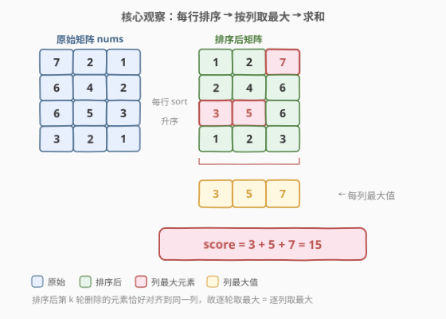
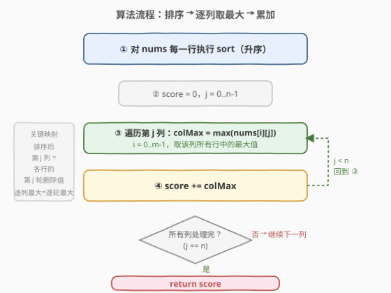
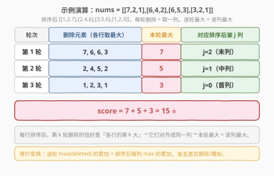

# 矩阵中的和

- **题目名称**：矩阵中的和
- **链接**：[2679. 矩阵中的和](https://leetcode.cn/problems/sum-in-a-matrix/)
- **难度**：中等
- **标签**：数组、矩阵、排序、模拟、堆（优先队列）

## 1. 题目概述

给你一个下标从 **0** 开始的二维整数数组 `nums`。一开始你的分数为 `0`。你需要执行以下操作直到矩阵变为空：

1. 矩阵中每一行选取最大的一个数，并删除它。如果一行中有多个最大的数，选择任意一个并删除。
2. 在步骤 1 删除的所有数字中找到最大的一个数字，将它添加到你的 **分数** 中。

请你返回最后的 **分数**。

**示例 1**：

```text
输入：nums = [[7,2,1],[6,4,2],[6,5,3],[3,2,1]]
输出：15
解释：第一步操作中，我们删除 7 ，6 ，6 和 3 ，将分数增加 7 。下一步操作中，删除 2 ，4 ，5 和 2 ，将分数增加 5 。最后删除 1 ，2 ，3 和 1 ，将分数增加 3 。所以总得分为 7 + 5 + 3 = 15 。
```

**示例 2**：

```text
输入：nums = [[1]]
输出：1
解释：我们删除 1 并将分数增加 1 ，所以返回 1 。
```

**约束条件**：

- `1 <= nums.length <= 300`
- `1 <= nums[i].length <= 500`
- `0 <= nums[i][j] <= 10^3`

> 💡 **审题关键**：① 每轮操作**每一行**都要删除一个元素（各删各的），不是全矩阵只删一个；② 计分只看本轮删除集合中的**最大值**，其余删除值丢弃；③ 同行有多个最大值时任选一个，不影响结果（因为本轮仍取全集合的最大，并列最大删谁最终分都一样）。把握住「逐轮、逐行删最大、取本轮最大累加」三要素即可。

---

## 2. 解题思路

### 2.1 暴力思路：直接模拟

最直觉的写法是照搬题面：循环直到矩阵为空，每轮扫描每行找最大值并删除，再对这批删除值取最大累加分数。

```text
while matrix 非空:
    deleted = []
    for row in matrix:
        mx = max(row)            # 找该行最大
        row.remove(mx)           # 删除
        deleted.append(mx)
    score += max(deleted)        # 本轮最大累加
return score
```

逻辑完全正确。问题是**删除代价高**：若用 `list.remove` 每行每次 $O(n)$ 扫描 + 搬移，共 $n$ 轮，单轮 $m$ 行，总时间 $O(m \cdot n^2)$。当 $m=300,\ n=500$ 时约 $7.5\times10^7$，虽勉强可过但低效，且每轮重新找最大重复劳动。

> ⚠️ **模拟思维的瓶颈**：每轮都要「全行扫描找最大 + 删除搬迁」，下一轮又从头扫一遍。但每行的删除顺序其实是**固定的**——始终按从大到小删——这一结构未被利用。

### 2.2 核心观察：每行排序 + 按列取最大



关键洞察：每行的删除顺序恒为「从最大删到最小」。若把**每一行升序排序**，则第 $k$ 轮删除的元素恰好对齐到**同一列**——它们分别是各行的「第 $k$ 大」。于是：

| 题意要求 | 等价操作 |
|----------|----------|
| 「每行删最大」 | 每行排序后从末列向首列逐列取 |
| 「本轮删除集合的最大值」 | 排序后**该列所有行的最大值** |
| 「逐轮累加」 | **逐列取最大后求和** |

$$\text{score} = \sum_{j=0}^{n-1} \max_{i=0}^{m-1}\, \text{nums}_{\text{sorted}}[i][j]$$

排序把「逐轮横向删除」转换成「逐列纵向取最大」——这是本题的「降维」一击。

> 💡 **为什么排序不改变答案？** 同一行内部，按什么顺序删最大值，删的元素集合不变（只是顺序不同），而**本轮分只取决于本轮集合的最大值**。排序让各行的同排名元素对齐到同一列后，第 $k$ 轮删除集合 = 第 $(n-1-k)$ 列（升序），其最大就是该列最大。故「逐轮取最大累加」与「逐列取最大累加」等价。**口诀**：行内删序不影响列集合，排序让逐轮退化为逐列。

### 2.3 算法流程图



**逻辑执行步骤**：

| 步骤 | 操作 | 作用 |
|------|------|------|
| ① | `for row in nums: row.sort()` | 每行升序排序 |
| ② | `score = 0`，遍历列 `j = 0..n-1` | 初始化分数与列游标 |
| ③ | `colMax = max(nums[i][j] for i in range(m))` | 取第 j 列所有行的最大值 |
| ④ | `score += colMax` | 累加到分数 |
| ↻ | `j < n` 则回到 ③，否则返回 `score` | 逐列推进直到处理完所有列 |

### 2.4 示例演算

以示例 1 为例，每行排序后矩阵为 `[[1,2,7],[2,4,6],[3,5,6],[1,2,3]]`，每轮删除对应一列：



| 轮次 | 删除元素（各行取最大） | 本轮最大 | 对应排序列 |
|------|------------------------|----------|------------|
| 第 1 轮 | 7, 6, 6, 3 | **7** | j=2（末列） |
| 第 2 轮 | 2, 4, 5, 2 | **5** | j=1（中列） |
| 第 3 轮 | 1, 2, 3, 1 | **3** | j=0（首列） |

`score = 7 + 5 + 3 = 15`，与示例一致。

> 💡 **对齐的直观理解**：第 1 轮删的是各行最大（末列 7,6,6,3），第 2 轮删各行次大（中列 2,4,5,2），第 3 轮删各行最小（首列 1,2,3,1）。排序让「同排名」的元素物理对齐到同一列，于是「本轮最大」=「该列最大」，无需真正删除。

---

## 3. 参考代码

### C++（解法 A：排序 + 逐列取最大，推荐）

```cpp
class Solution {
public:
    int matrixSum(vector<vector<int>>& nums) {
        for (auto& row : nums) {
            sort(row.begin(), row.end());
        }
        int m = nums.size(), n = nums[0].size();
        int score = 0;
        for (int j = 0; j < n; j++) {
            int colMax = 0;
            for (int i = 0; i < m; i++) {
                colMax = max(colMax, nums[i][j]);
            }
            score += colMax;
        }
        return score;
    }
};
```

> 💡 **写法要点**：
> - `for (auto& row : nums)` 用**引用**遍历，保证 `sort` 修改原行（值遍历会拷贝、改不到原矩阵）。
> - 内层 `colMax` 初值取 `0` 安全：约束 `nums[i][j] >= 0`，故 `0` 不会比任何真实值大；若元素可能为负，应初始化为 `INT_MIN` 或取首元素。
> - 列数 `n` 取自 `nums[0].size()`——题目保证是矩阵（各行等长）。

### Python（解法 A：`zip(*nums)` 取列，一行流）

```python
class Solution:
    def matrixSum(self, nums: List[List[int]]) -> int:
        for row in nums:
            row.sort()
        return sum(max(col) for col in zip(*nums))
```

> 💡 **`zip(*nums)` 的妙用**：`*nums` 把每行解包为 `zip` 的多个参数，`zip` 按**位置**配对——第 j 个元组正是所有行的第 j 列。`max(col)` 取该列最大，`sum(...)` 累加。等价于 C++ 的双层循环，但用 Python 的迭代器协议一行表达。注意 `row.sort()` 原地排序，修改的是 `nums` 本身。

### Python（解法 B：堆模拟，思路对照）

```python
import heapq

class Solution:
    def matrixSum(self, nums: List[List[int]]) -> int:
        heaps = [[-x for x in row] for row in nums]  # 最大堆（取负）
        for h in heaps:
            heapq.heapify(h)
        score = 0
        n = len(nums[0])
        for _ in range(n):
            deleted = [-heapq.heappop(h) for h in heaps]  # 每行弹出最大
            score += max(deleted)
        return score
```

> 💡 **解法 B 的思路**：为每行维护一个最大堆（Python 用最小堆 + 取负实现），每轮从每行堆顶弹出最大值，取这批弹出值的最大累加。这是对 2.1 暴力模拟的**优化版**——把「每轮全行扫描找最大 $O(n)$」降到「堆弹出 $O(\log n)$」。总时间 $O(m \cdot n \log n)$，与排序解法同阶，但常数更大、空间 $O(m \cdot n)$（需建堆）。适合作为「不发现排序等价性时的稳健写法」。

---

## 4. 复杂度分析

| 维度 | 解法 A（排序 + 逐列取最大） | 解法 B（堆模拟） | 暴力模拟 |
|------|---------------------------|------------------|----------|
| **时间** | $O(m \cdot n \log n)$ | $O(m \cdot n \log n)$ | $O(m \cdot n^2)$ |
| **空间** | $O(1)$（原地排序） | $O(m \cdot n)$（建堆） | $O(n)$（删除缓冲） |
| **推荐度** | ✓ **首选** | ✓ 稳健 | ✗ 低效 |

> - $m$ = `nums` 行数，$n$ = 列数。
> - **解法 A 时间**：每行排序 $O(n \log n)$，共 $m$ 行 → $O(m \cdot n \log n)$；逐列取最大 $O(m \cdot n)$。后者被前者支配，总为 $O(m \cdot n \log n)$。
> - **解法 A 空间**：原地排序 $O(\log n)$ 栈空间（快排），可视为 $O(1)$ 额外；Python 的 `zip` 是惰性迭代器，不额外存列。
> - **解法 B**：每行建堆 $O(n)$，共 $O(m \cdot n)$ 空间；每轮 $m$ 次弹出 $O(\log n)$，共 $n$ 轮 → $O(m \cdot n \log n)$。常数更大，仅作对照。

---

## 5. 扩展：堆模拟 vs 排序等价性

### 5.1 两种视角的统一

「逐轮模拟」和「排序 + 逐列」表面是两种算法，本质同构：

| 视角 | 数据结构 | 第 k 轮/列处理 | 取最大 |
|------|---------|----------------|--------|
| 模拟（堆） | 每行一个最大堆 | 弹出每行堆顶 | `max(deleted)` |
| 排序等价 | 每行排序数组 | 取第 $(n-1-k)$ 列 | `max(column)` |

排序相当于「一次性把每行所有元素按大小入位」，堆则是「惰性按需弹出」。当**每轮都需要取所有行的最大值**时（本题正是），排序把 $n$ 轮的 $O(\log n)$ 弹出摊销为一次 $O(n \log n)$ 排序，省去堆的常数与空间。

> 💡 **何时选堆而非排序？** 当删除**不是每行都参与**（如只删某些行的最大），或删除顺序受**外部条件**动态影响（如某些行提前清空、行间存在依赖）时，堆的惰性优势才显现。本题每轮每行必删一个，顺序固定，排序等价性成立，故排序最优。

### 5.2 若行长度不等

题面保证 `nums` 是矩阵（各行等长）。若放宽为「各行长度不等」，排序等价性仍可适配：列数取最大行长 `n_max`，对短行在末尾补 $-\infty$ 哨兵（不影响 `max`），排序后逐列取最大即得——短行提前删完时该行不贡献本轮最大，等价于哨兵 $-\infty$ 不参与 `max`。

---

## 6. 面试要点

1. **为什么排序不改变最终分数？**

   > 同一行内，无论按什么顺序删最大值，删掉的元素**集合**不变（都是这一行的全部元素），而每轮分只依赖本轮删除集合的最大值。排序只是把各行的同排名元素对齐到同一列，使「逐轮取最大」退化为「逐列取最大」。行内删序的任意性被「只取最大」吸收，故排序前后答案一致。

2. **排序升序还是降序有区别吗？**

   > 无区别。升序时第 $k$ 轮删第 $(n-1-k)$ 列；降序时第 $k$ 轮删第 $k$ 列。无论哪种，总分数都是「所有列的列最大值之和」——因为每一列恰好对应一轮、每轮贡献等于该列最大，列的遍历顺序不影响求和。习惯上用升序，配合 `zip(*nums)` 取列最自然。

3. **时间复杂度瓶颈在哪？为什么不是 $O(m \cdot n)$？**

   > 瓶颈在**排序**：每行 $O(n \log n)$，共 $m$ 行得 $O(m \cdot n \log n)$。逐列取最大只是 $O(m \cdot n)$，被排序支配。若题目放宽到元素值域很小（如 $0 \sim 10^3$），可用**计数排序**把每行排成 $O(n + V)$，总时间降到 $O(m \cdot (n + V))$，$V=1000$ 时近似 $O(m \cdot n)$。但本题 $n \le 500$，快排已足够。

4. **如果要求记录每轮删除的具体元素，还能用排序等价吗？**

   > 仍可。排序后第 $k$ 轮删除的就是「第 $(n-1-k)$ 列的所有元素」（升序），直接按列读出即可还原每轮删除集合。排序等价性不仅给出分数，还保留了每轮的结构信息——这正是它优于纯模拟之处：模拟只给过程，排序给出可索引的等价表示。

5. **`zip(*nums)` 在 Python 中为什么不额外占空间？**

   > `zip` 返回的是**惰性迭代器**，逐列按需产出元组，不预先物化整个转置矩阵。`for col in zip(*nums)` 每次只持有当前一列的 $m$ 个元素引用，用完即释放。空间为 $O(m)$（一列大小），而非 $O(m \cdot n)$（整个转置）。注意 `zip` 在 Python 3 才是迭代器，Python 2 的 `zip` 会物化列表（本题用 Python 3 不受影响）。

> 💡 **一句话总结**：2679 是「**排序化简模拟**」的招牌题——核心就一步等价变换：把「逐轮横向删最大取最大」化归为「每行排序后逐列取最大求和」。考点覆盖三要素：**行内排序（对齐同排名）、逐列取最大（轮→列等价）、累加求和**。理解「删序任意性被只取最大吸收」「排序让逐轮退化为逐列」这两点，所有「按行重复取最大再聚合」类矩阵题都能覆盖。

---

## 7. 同类练习题

- [2500. 删除每行中的最大值](https://leetcode.cn/problems/delete-greatest-value-in-each-row/)：与 2679 几乎同题（逐行删最大、取本轮最大累加），排序 + 逐列取最大直接秒杀，作为 2679 的入门平替
- [2545. 根据第 K 场考试的分数排序](https://leetcode.cn/problems/sort-the-students-by-their-kth-score/)：按矩阵某一列对行排序，对照 2679 理解「行排序」与「列选取」两种矩阵视角的转换
- [1337. 矩阵中战斗力最弱的 K 行](https://leetcode.cn/problems/the-k-weakest-rows-in-a-matrix/)：对每行求一个指标（1 的个数）再排序取前 K，对照 2679 理解「逐行聚合 + 全行排序」的矩阵处理范式
- [1072. 按列翻转得到最大值等行数](https://leetcode.cn/problems/flip-columns-for-maximum-number-of-equal-rows/)：通过列翻转让最多行相等，考察矩阵列级操作与行模式的关系，扩展 2679 的「列视角」思维
