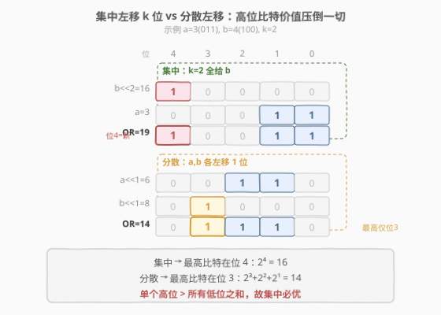

# 最大或值

- **题目名称**：最大或值
- **链接**：[2680. 最大或值](https://leetcode.cn/problems/maximum-or/)
- **难度**：中等
- **标签**：贪心、位运算、数组、前缀和

## 1. 题目概述

给定一个下标从 **0** 开始、长度为 $n$ 的正整数数组 `nums` 和一个整数 $k$。每一次操作中，你可以选择数组中的一个数并将它乘 $2$（即左移一位）。

你最多可以进行 $k$ 次操作，请返回 `nums[0] | nums[1] | … | nums[n-1]` 的**最大值**。其中 `|` 表示**按位或**。

**示例 1**：

```text
输入：nums = [12,9], k = 1
输出：30
解释：对下标 1 的元素操作，新数组为 [12,18]，12 | 18 = 30。
```

**示例 2**：

```text
输入：nums = [8,1,2], k = 2
输出：35
解释：对下标 0 的元素操作 2 次，新数组为 [32,1,2]，32 | 1 | 2 = 35。
```

**约束条件**：

- $1 \le \text{nums.length} \le 10^5$
- $1 \le \text{nums[i]} \le 10^9$
- $1 \le k \le 15$

> 💡 关键信号：乘 $2$ 等价于**左移一位**，$k$ 次操作等价于左移 $k$ 位。而按位或「只增不减」——一个比特一旦被某数置 $1$，其它数再怎么移也盖不掉它。这暗示操作的收益在于把某个数的比特**推到尽可能高的位置**，而集中左移显然比分散左移推得更高。

---

## 2. 解题思路

### 2.1 暴力思路：枚举每个数的操作次数？

最直白的做法：把 $k$ 次操作分配给 $n$ 个数，枚举所有分配方案（每个数分 $0\sim k$ 次，总和 $\le k$），每种方案算一次全体 OR 取最大。分配方案数是 $\binom{n+k}{k}$ 量级，$n=10^5$ 时完全爆炸。

即便退一步只考虑「每个数要么不操作、要么操作若干次」，状态空间仍然巨大。必须找到**结构性结论**来剪掉绝大多数方案。

### 2.2 核心观察：k 次操作必须集中在同一个数上



**结论**：最优解一定把全部 $k$ 次操作作用在**同一个**元素上。

直觉很直接——乘 $2$ 即左移一位，$k$ 次操作即左移 $k$ 位。左移的本质是把一个数**所有置位比特整体抬高**：

- **集中**：把 $k$ 次操作全给元素 $a$，$a$ 的比特从位置 $[0, m_a]$ 抬到 $[k,\ m_a+k]$，最高比特到达 $m_a+k$。
- **分散**：把 $j$ 次给 $a$、$k-j$ 次给 $b$（$0<j<k$），$a$ 的比特只抬到 $m_a+j$，$b$ 只抬到 $m_b+(k-j)$，最高比特 $\le \max(m_a,m_b)+\max(j,k-j) < \max(m_a,m_b)+k$。

> 💡 **为什么更高的比特更重要？** 因为一个位置 $p$ 上的比特贡献 $2^p$，它大于**所有低于 $p$ 的比特之和**（$\sum_{i=0}^{p-1}2^i=2^p-1<2^p$）。所以「把某个比特推到更高的、原本没人占据的位置」带来的收益，压倒性地大于在低位多填几个比特。集中左移能把比特推到最高的新位置，分散则不能——这就是集中必优的根因。

更严格地说，按位或是**单调且粘性**的运算：比特一旦被某数置 $1$ 就不会被其它数清零。把 $k$ 次全给元素 $i$ 时，其余 $n-1$ 个数保持原值不变，它们贡献的比特一个不丢；而元素 $i$ 的比特被整体抬高 $k$ 位，腾出的低位由其余数填补、抬高的高位是**净新增**。分散操作无法让任何单个数的比特抬高 $k$ 位，故最高新增比特严格更低，总值必然不优于集中方案。

### 2.3 算法流程图

![算法流程：枚举集中目标 i，前缀或 | (nums[i]<<k) | 后缀或，取最大](../images/p2680_algorithm_flow.svg)

既然 $k$ 次操作集中在同一个数上，只需**枚举这个数是哪个**。选定元素 $i$ 后：

- 元素 $i$ 变成 $\text{nums}[i] \ll k$；
- 其余元素保持原值；
- 全体 OR =（$i$ 之前所有数的或）$\mid$（$\text{nums}[i] \ll k$）$\mid$（$i$ 之后所有数的或）。

记 $\text{pre}[i] = \text{nums}[0] \mid \cdots \mid \text{nums}[i-1]$（前缀或），$\text{suf}[i] = \text{nums}[i+1] \mid \cdots \mid \text{nums}[n-1]$（后缀或），则选定 $i$ 时的结果为

$$\text{candidate}(i) = \text{pre}[i] \ \big|\ (\text{nums}[i] \ll k)\ \big|\ \text{suf}[i]$$

答案即 $\max_{0\le i<n}\text{candidate}(i)$。

流程三步：

1. **预处理后缀或**：从右往左扫一遍，$\text{suf}[i] = \text{nums}[i+1] \mid \text{suf}[i+1]$，$\text{suf}[n-1]=0$。
2. **从左往右枚举 $i$**：维护前缀或 $\text{pre}$（初始 $0$），算 $\text{pre} \mid (\text{nums}[i] \ll k) \mid \text{suf}[i]$，更新答案；随后 $\text{pre} \mid= \text{nums}[i]$。
3. 返回最大值。

> 💡 前缀或**不需要数组**，一个变量 `pre` 边走边累加即可（或运算的累积性：$\text{pre}_i = \text{pre}_{i-1} \mid \text{nums}[i-1]$）；后缀或需要一个数组，因为枚举是从左往右、后缀要从右往左预处理。

### 2.4 示例演算

![示例演算：nums=[8,1,2], k=2，枚举每个 i 的前缀或/左移/后缀或/候选值](../images/p2680_example_walkthrough.svg)

以示例 2 `nums = [8, 1, 2], k = 2` 为例。先预处理后缀或：

| $i$ | $\text{nums}[i]$ | $\text{suf}[i]$（右侧或） |
|:---:|:---:|:---|
| 0 | 8 | $1 \mid 2 = 3$ |
| 1 | 1 | $2$ |
| 2 | 2 | $0$ |

再从左往右枚举 $i$，维护前缀或 `pre`：

| $i$ | `pre`（左侧或） | $\text{nums}[i] \ll k$ | $\text{suf}[i]$ | 候选 $= \text{pre} \mid (\ll k) \mid \text{suf}$ | 二进制 |
|:---:|:---:|:---:|:---:|:---:|:---|
| 0 | 0 | $8 \ll 2 = 32$ | 3 | $0 \mid 32 \mid 3 = 35$ | `100011` |
| 1 | 8 | $1 \ll 2 = 4$ | 2 | $8 \mid 4 \mid 2 = 14$ | `001110` |
| 2 | $8 \mid 1 = 9$ | $2 \ll 2 = 8$ | 0 | $9 \mid 8 \mid 0 = 9$ | `001001` |

最大值为 $35$ ⭐（集中在 $i=0$）。注意 $i=0$ 时 `pre=0`（左侧无数）、$i=2$ 时 `suf=0`（右侧无数），首尾元素的哨兵处理让代码无需特判。

---

## 3. 参考代码

### C++

```cpp
class Solution {
  public:
    long long maximumOr(vector<int>& nums, int k) {
        int n = nums.size();
        vector<int> suf(n);
        suf[n - 1] = 0;
        for (int i = n - 2; i >= 0; --i)
            suf[i] = suf[i + 1] | nums[i + 1];
        long long ans = 0, pre = 0;
        for (int i = 0; i < n; ++i) {
            ans = max(ans, pre | ((long long)nums[i] << k) | suf[i]);
            pre |= nums[i];
        }
        return ans;
    }
};
```

### Python

```python
class Solution:
    def maximumOr(self, nums: List[int], k: int) -> int:
        n = len(nums)
        suf = [0] * n
        for i in range(n - 2, -1, -1):
            suf[i] = suf[i + 1] | nums[i + 1]
        ans = 0
        pre = 0
        for i in range(n):
            ans = max(ans, pre | (nums[i] << k) | suf[i])
            pre |= nums[i]
        return ans
```

> ⚠️ **溢出注意**：$\text{nums}[i] \le 10^9 < 2^{30}$，左移 $k\le15$ 位后最大约 $2^{45}$，超出 32 位 `int` 范围（$2^{31}-1$）。C++ 中 `nums[i] << k` 默认按 `int` 移位会溢出，必须先转 `long long`：`(long long)nums[i] << k`。Python 整数任意精度，无需操心。

---

## 4. 复杂度分析

| 维度 | 复杂度 | 说明 |
|------|--------|------|
| 时间复杂度 | $O(n)$ | 后缀或预处理一遍 $O(n)$ + 枚举一遍 $O(n)$，每步常数次或运算 $O(1)$ |
| 空间复杂度 | $O(n)$ | 后缀或数组 `suf` 占 $n$ 个元素；前缀或只用一个变量 `pre` |

> 💡 空间可优化到 $O(1)$：注意到全体或 $T = \text{nums}[0] \mid \cdots \mid \text{nums}[n-1]$ 与选定 $i$ 时的「其余元素或」$\text{pre}[i] \mid \text{suf}[i]$ 之间满足 $\text{pre}[i] \mid \text{suf}[i] = T \setminus \text{nums}[i]$ 的**近似关系**——但因或运算不可逆（无法从 $T$ 中「减去」$\text{nums}[i]$ 的比特），不能直接用 $T$ 反推。故 $O(n)$ 后缀数组是当前思路的下界。若用**按位计数**（记录每个比特位有多少个数贡献），则可 $O(1)$ 额外空间，但常数较大、实现更繁琐，收益有限。

---

## 5. 扩展：按位计数法（O(1) 额外空间）

若把后缀或换成「每个比特位的计数」，可省掉后缀数组：维护 `cnt[b]` = 当前前缀里第 $b$ 位有几个数置 $1$。枚举 $i$ 时，先从计数里**移除** $\text{nums}[i]$（每位减 1），得到「除 $i$ 外所有数的或」（某位计数 $>0$ 即为 $1$），再与 $\text{nums}[i] \ll k$ 或起来。但由于 $\text{nums}[i] \le 10^9$ 只有约 30 位、$k\le15$ 故最多 45 位，计数数组大小 45，空间严格说也是 $O(45)=O(1)$，只是常数项比一个后缀或数组大。

此法与 [1318. 或运算的最小翻转次数](https://leetcode.cn/problems/minimum-bit-flips-to-make-number-equal-or-bitwise-or/) 同属「按位拆解 + 计数」套路，适合需要精确控制每一位的场景。本题用前缀/后缀或已足够简洁。

---

## 6. 面试要点

1. **为什么 $k$ 次操作必须集中在同一个数上？**

   > 乘 $2$ 即左移一位，$k$ 次即左移 $k$ 位。集中给一个数，它的所有置位比特整体抬高 $k$ 位，最高比特到达 $m+k$；分散给两个数（各 $j$、$k-j$ 次），最高比特只有 $\max(m_a+j, m_b+k-j) < \max(m_a,m_b)+k$。而一个位置 $p$ 的比特价值 $2^p$ 大于所有低位之和，故「推到更高位置」收益压倒一切，集中必优。

2. **为什么用前缀或和后缀或，而不是对每个 $i$ 重新算一遍？**

   > 选定 $i$ 时，结果 $=$（$i$ 左侧所有数的或）$\mid$（$\text{nums}[i] \ll k$）$\mid$（$i$ 右侧所有数的或）。两侧的「所有数的或」可用前缀/后缀数组 $O(1)$ 查询，避免每个 $i$ 都 $O(n)$ 重算，总体降到 $O(n)$。

3. **前缀或为什么不需要数组，后缀或却需要？**

   > 枚举 $i$ 是从左往右扫的，前缀或 $\text{pre}_i = \text{pre}_{i-1} \mid \text{nums}[i-1]$ 可用一个变量边走边累加；后缀或却要从右往左预处理并存数组，因为枚举时按 $i$ 递增取用、无法即时递推。

4. **为什么 C++ 必须先转 `long long` 再左移？**

   > $\text{nums}[i]$ 是 `int`，`nums[i] << k` 在 `int` 上运算，移位超过 31 位即未定义/溢出（$10^9 \ll 15 \approx 2^{45}$）。先写 `(long long)nums[i] << k` 把操作数提升到 64 位，移位才安全。Python 无此问题。

5. **能不能不预处理后缀，用全体或 $T$ 减去 $\text{nums}[i]$ 来算？**

   > 不能。或运算**不可逆**——$T$ 里某位为 $1$ 可能由多个数共同贡献，无法从 $T$ 中「减去」$\text{nums}[i]$ 的影响（除非该位只有 $\text{nums}[i]$ 贡献，但单凭 $T$ 无法判断）。这正是需要前缀/后缀或或按位计数的根因。

> 💡 **一句话总结**：2680 的关键洞察是「$k$ 次左移必须集中在同一个数上」——因为高比特价值远大于所有低位之和。据此把指数级分配方案降为 $O(n)$ 枚举，用前缀或（单变量）+ 后缀或（数组）$O(1)$ 求出每个候选 $\text{pre} \mid (\text{nums}[i] \ll k) \mid \text{suf}$，取最大即为答案。

---

## 7. 同类练习题

- [2317. 最大异或之后的或](https://leetcode.cn/problems/maximum-xor-after-operations/)：同为「按位或/异或 + 操作次数」的位运算贪心，分析每个比特位能否被独立置位
- [810. 异或矩阵](https://leetcode.cn/problems/chalkboard-xor-game/)：异或与或的组合性质题，关注「全体值」与「单元素移除」的关系，承接本题前缀/后缀或思想
- [1318. 或运算的最小翻转次数](https://leetcode.cn/problems/minimum-bit-flips-to-make-number-equal-or-bitwise-or/)：按位拆解 + 贪心，与本题第 5 节的按位计数法同套路
- [2275. 按位与结果大于零的最大组合数](https://leetcode.cn/problems/largest-combination-with-bitwise-and-greater-than-zero/)：按位计数求最大子集，对照「或的粘性」与「与的严苛」两种位运算计数视角
