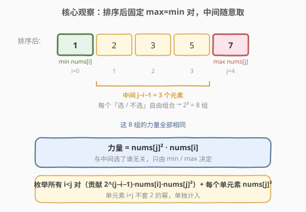
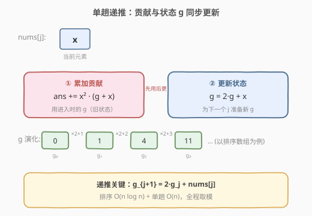

# LeetCode 英雄的力量 题解

## 1. 题目概述

- **标题 / 题号**：英雄的力量（#2681，hard）
- **链接**：https://leetcode.cn/problems/power-of-heroes/
- **难度**：困难
- **标签**：数组、数学、动态规划、前缀和、排序

**题意**：给定下标从 0 开始的整数数组 `nums`，表示英雄的能力值。任选一个**非空**子集（英雄组），其**力量**定义为：

$$\text{power} = \max(\text{子集})^2 \cdot \min(\text{子集})$$

即子集中最大元素的平方乘以最小元素。返回**所有可能的非空英雄组的力量之和**，结果对 $10^9+7$ 取余。

**示例 1**：

```text
输入：nums = [2,1,4]
输出：141
解释：
[2]     → 2²·2 = 8
[1]     → 1²·1 = 1
[4]     → 4²·4 = 64
[2,1]   → 2²·1 = 4
[2,4]   → 4²·2 = 32
[1,4]   → 4²·1 = 16
[2,1,4] → 4²·1 = 16
合计 8 + 1 + 64 + 4 + 32 + 16 + 16 = 141
```

**示例 2**：

```text
输入：nums = [1,1,1]
输出：7
解释：共 7 个非空子集，每个力量都是 1²·1 = 1，合计 7。
```

**约束**：

- $1 \le$ `nums.length` $\le 10^5$
- $1 \le$ `nums[i]` $\le 10^9$

> 💡 关键在于「力量只由子集的 **min 和 max** 决定，与中间元素无关」。把数组**排序**后，min/max 就变成了子集在有序序列中的「左端点 / 右端点」，中间元素可随意取舍，组合数立刻变成 2 的幂——这正是把指数级枚举压成线性的突破口。

## 2. 解题思路

### 2.1 暴力思路：枚举所有子集

枚举全部 $2^n - 1$ 个非空子集，对每个子集扫一遍求 min/max 并累加力量。

- 子集数 $2^{10^5}$ 天文数字，且每个子集还要 $O(n)$ 求 min/max，**完全不可行**。
- 瓶颈在于「逐子集计算」，没有利用「力量只依赖 min/max」这一结构。

> ⚠️ 突破口：排序后，子集的 min/max 就是它在有序数组里的左右端点。固定一对端点 $(i, j)$，**中间元素无论怎么选力量都相同**——于是「逐子集」可重写成「逐端点对 × 组合数」。

### 2.2 核心观察：排序后枚举最大值，最小值贡献 2 的幂

**第一步：排序**。设 `nums` 升序排列。对任一子集，min 是最左端元素 $nums[i]$，max 是最右端元素 $nums[j]$（$i \le j$），力量恒为 $nums[j]^2 \cdot nums[i]$。

**第二步：固定端点对计数**。固定一对 $(i, j)$ 且 $i < j$：中间下标 $i+1, \dots, j-1$（共 $j-i-1$ 个）每个「选 / 不选」自由组合，故以 $nums[i]$ 为 min、$nums[j]$ 为 max 的子集恰有 $2^{j-i-1}$ 个，每个力量都是 $nums[i] \cdot nums[j]^2$。

> 单元素子集 $\{nums[j]\}$（即 $i = j$）力量为 $nums[j]^3$，单独计入，**不套 2 的幂公式**（否则会出现 $2^{-1}$）。



于是总和（按 $j$ 分组，把所有 $i \le j$ 的贡献归到「以 $nums[j]$ 为 max」一项）：

$$\text{ans} = \sum_{j=0}^{n-1} nums[j]^2 \cdot \left(nums[j] + \sum_{i=0}^{j-1} 2^{j-i-1} \cdot nums[i]\right)$$

其中内层独立的 $nums[j]$ 是单元素贡献，求和项是所有 $i < j$ 对的贡献。

### 2.3 算法流程图：单趟递推

直接算内层求和仍是 $O(n^2)$。注意到内层只依赖一个**滚动状态** $g_j = \sum_{i=0}^{j-1} 2^{j-1-i} \cdot nums[i]$，且它有线性递推：

$$g_{j+1} = 2\,g_j + nums[j], \qquad g_0 = 0$$

每处理 $nums[j]$ 时：**先用当前的 $g_j$ 算贡献，再用 $nums[j]$ 更新到 $g_{j+1}$**。



> 💡 **递推直觉**：从 $j$ 到 $j+1$，原先在 $nums[j]$ 左侧的每个 $nums[i]$ 到新右端的距离多了一格，组合数翻倍（$2^{j-i-1} \to 2^{j-i}$），故整体 $\times 2$；同时新右端的前一个元素 $nums[j]$ 自己也成了「可选中间元素」，单独 $+nums[j]$。这就是 $g_{j+1} = 2g_j + nums[j]$ 的来源。

### 2.4 示例演算

以 `nums = [2,1,4]` 为例，排序得 `[1,2,4]`：

![示例演算：nums=[2,1,4] → 排序 [1,2,4]，三步累加得 141](../images/p2681_example_walkthrough.svg)

- $j=0,\ x=1$：$g=0$，贡献 $1^2\cdot(0+1)=1$，$ans=1$，更新 $g=2\cdot0+1=1$；
- $j=1,\ x=2$：$g=1$，贡献 $2^2\cdot(1+2)=12$，$ans=13$，更新 $g=2\cdot1+2=4$；
- $j=2,\ x=4$：$g=4$，贡献 $4^2\cdot(4+4)=128$，$ans=141$，更新 $g=2\cdot4+4=12$（末项不再使用）。

最终 $ans=141$，与示例一致。

## 3. 参考代码

### C++

```cpp
// 英雄的力量.cpp —— 排序 + 单趟递推
// 编译: g++ -O2 -std=c++17 英雄的力量.cpp -o power
#include <vector>
#include <algorithm>
using namespace std;

class Solution {
  public:
    int sumOfPower(vector<int>& nums) {
        const long long MOD = 1e9 + 7;
        sort(nums.begin(), nums.end());
        long long ans = 0, g = 0;
        for (long long x : nums) {
            long long x2 = x * x % MOD;                   // nums[j]^2
            ans = (ans + x2 * ((g + x) % MOD)) % MOD;     // 贡献 = x^2·(g+x)
            g = (2 * g + x) % MOD;                        // 状态递推
        }
        return (int)ans;
    }
};
```

### Python

```python
class Solution:
    def sumOfPower(self, nums: List[int]) -> int:
        MOD = 10**9 + 7
        nums.sort()
        ans = 0
        g = 0                         # g_j = Σ 2^(j-1-i)·nums[i], i<j
        for x in nums:
            ans = (ans + x * x % MOD * (g + x)) % MOD   # 贡献 = x^2·(g+x)
            g = (2 * g + x) % MOD                       # 状态递推
        return ans
```

> ⚠️ **取模顺序**：`x^2` 与 `g+x` 都要先 `% MOD` 再相乘，否则 $nums[i] \le 10^9$ 时 $x^2 \le 10^{18}$、再乘 $(g+x)$ 可达 $10^{27}$，C++ `long long`（上限约 $9.2\times10^{18}$）也会溢出。正确写法是「每步乘完即取模」。Python 大整数不会溢出，但取模可控制规模、避免大数运算拖慢速度。又因排序后遍历顺序与原下标无关，**原地排序不改变答案**（力量只依赖取出的值集合，与位置无关）。

## 4. 复杂度分析

| 维度 | 复杂度 | 说明 |
|------|--------|------|
| **时间复杂度** | $O(n \log n)$ | 排序 $O(n\log n)$ 为瓶颈；单趟递推 $O(n)$，每步 $O(1)$ |
| **空间复杂度** | $O(\log n)$ | 原地排序的递归栈；递推只用常数额外变量 `ans`、`g` |

> ⚠️ 本题最优下界即 $O(n\log n)$（排序），已无更优渐进。$n=10^5$ 时约 $10^5 \log 10^5 \approx 1.7\times10^6$ 次比较，毫秒级通过。

## 5. 扩展：按 min 分组的对称视角

### 5.1 视角一：按 max 分组（本文做法）

把每个子集归到它的 **max 元素** $nums[j]$，min 在 $nums[j]$ 左侧任取。得到 $ans = \sum_j nums[j]^2\,(g_j + nums[j])$，状态 $g_{j+1}=2g_j+nums[j]$，**从左往右**递推。

### 5.2 视角二：按 min 分组

对称地，把每个子集归到它的 **min 元素** $nums[i]$，max 在右侧任取 $nums[j]$（$j > i$），中间 $i+1\dots j-1$ 自由组合。固定 $nums[i]$ 为 min，其右侧所有「以更大元素为 max」的子集贡献之和为：

$$nums[i] \cdot \sum_{j>i} 2^{j-i-1} \cdot nums[j]^2$$

令 $h_i = \sum_{j>i} 2^{j-i-1} \cdot nums[j]^2$，则 $h_i = nums[i+1]^2 + 2\,h_{i+1}$，**从右往左**递推。加上单元素贡献 $nums[i]^3$，得等价公式 $ans = \sum_i nums[i]\,(h_i + nums[i]^2)$。

两种视角对称，本文按 max 分组更直观（「向左累加 min」与常见的「前缀和」方向一致，符合阅读习惯）。

### 5.3 与「贡献计数法」的共性

本题属于「**按某维度固定端点、其余自由组合**」的贡献计数范式：先把指数级子集枚举转化为「端点对 × $2$ 的幂」，再用线性递推把内层求和压缩。这类「先贡献拆解、后线性合并」的思路在 [907. 子数组的最小值之和](https://leetcode.cn/problems/sum-of-subarray-minimums/)（单调栈贡献法）、[828. 统计子串中的唯一字符](https://leetcode.cn/problems/count-unique-characters-of-all-substrings-of-a-given-string/)（按字符位置贡献）中同样核心。

## 6. 面试要点

1. **为什么排序不改变答案？**

   - 力量只依赖子集的 min/max 两个**值**，与元素在原数组中的位置无关。排序只是重排顺序，不改变任何子集的取值集合，因此每个子集的力量不变，总和自然不变。排序的目的是把 min/max 转化为有序序列的左右端点，从而用 $2$ 的幂计数。

2. **递推 $g_{j+1}=2g_j+nums[j]$ 怎么来的？**

   - $g_j = \sum_{i<j} 2^{j-1-i}\cdot nums[i]$。把 $g_{j+1}=\sum_{i<j+1}2^{j-i}\cdot nums[i]$ 拆开：对 $i<j$ 的项，指数比 $g_j$ 多 1，整体 $\times 2$；对 $i=j$ 的新增项，$2^{0}\cdot nums[j]=nums[j]$。两段合并即 $g_{j+1}=2g_j+nums[j]$。关键是「距离多一格 → 组合数翻倍 + 新增一个可选元素」。

3. **取模为什么这样写？溢出风险在哪？**

   - $nums[i]\le 10^9$，$x^2\le 10^{18}$，再乘 $(g+x)\le 2\times10^9$ 可达 $10^{27}$，远超 C++ `long long`（约 $9.2\times10^{18}$）。必须**每步乘完即取模**：`x2 = x*x%MOD` 先把 $x^2$ 压到模域内，再 `x2 * ((g+x)%MOD)` 保证中间积 $\le 10^9\times10^9=10^{18}$ 不溢出。Python 无此风险，但取模可避免大整数运算变慢。

4. **单元素子集怎么处理？为什么不直接套 $2^{j-i-1}$？**

   - $i=j$ 时 $2^{j-i-1}=2^{-1}$ 无意义。单元素子集 $\{nums[j]\}$ 力量为 $nums[j]^3=nums[j]^2\cdot nums[j]$，恰好对应公式中括号内那项独立的 $nums[j]$（即 $g_j$ 之外的 $+nums[j]$）。这样**单元素与成对贡献统一进同一个公式**，无需写 `if` 分支：贡献 $=nums[j]^2\cdot(g_j+nums[j])$，括号里前半是多元素、后半是单元素。

5. **按 max 分组和按 min 分组哪个好？**

   - 两者完全对称、均 $O(n)$。按 max 分组从左往右递推，与「前缀和」方向一致、更符合直觉，面试讲清即可；按 min 分组从右往左递推，需注意边界。若题目改成「求力量最大的子集」则不涉及求和，另当别论。

> 💡 **一句话总结**：2681 把「子集 min/max 决定力量」这一结构发挥到极致——排序后固定 max 端点，min 在左侧自由组合，组合数 $2$ 的幂用线性递推 $g_{j+1}=2g_j+nums[j]$ 一趟压平，单元素贡献作为 $+nums[j]$ 项天然并入公式，全程 $O(n\log n)$。

## 同类练习题

| # | 题目 | 与本题的关联 |
|---|------|-------------|
| 1498 | [满足条件的子序列数目](https://leetcode.cn/problems/number-of-subsequences-that-satisfy-the-given-sum-condition/) | 排序 + 双指针固定 min/max 后用 $2^{r-l}$ 计数子序列，与本题「固定端点 + 2 的幂计数」同构 |
| 907 | [子数组的最小值之和](https://leetcode.cn/problems/sum-of-subarray-minimums/) | 按最小值贡献拆解求和（单调栈），与本题「按 max 贡献分组」属同一贡献计数范式 |
| 2104 | [子数组范围和](https://leetcode.cn/problems/sum-of-subarray-ranges/) | 907 的「最大值 − 最小值」变体，贡献法同时处理 max 与 min |
| 795 | [区间子数组个数](https://leetcode.cn/problems/number-of-subarrays-with-bounded-maximum/) | 按子数组最大值落点计数，本题「按 max 分组」思想的连续子数组版 |
| 828 | [统计子串中的唯一字符](https://leetcode.cn/problems/count-unique-characters-of-all-substrings-of-a-given-string/) | 按字符位置贡献拆解子串计数，贡献计数法的另一典型 |
