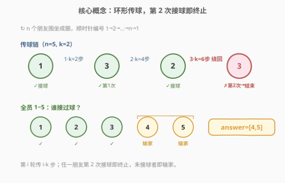
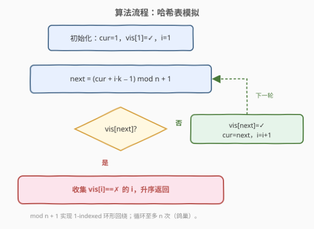
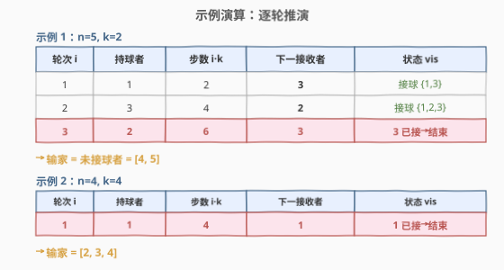

# 找出转圈游戏输家

- **题目名称**：找出转圈游戏输家
- **链接**：[2682. 找出转圈游戏输家](https://leetcode.cn/problems/find-the-losers-of-the-circular-game/)
- **难度**：简单
- **标签**：数组、哈希表、模拟

## 1. 题目概述

`n` 个朋友围坐成一圈，按**顺时针方向**从 `1` 到 `n` 编号。从第 `i` 个朋友位置顺时针走 `1` 步到达第 `i+1` 个朋友（`1 ≤ i < n`），从第 `n` 个朋友走 `1` 步回到第 `1` 个朋友。

游戏规则：

1. **第 `1` 个朋友先接球**。
2. 接着，第 `1` 个朋友把球传给距离他顺时针方向 `k` 步的朋友。
3. 然后，接球的朋友把球传给距离他顺时针方向 `2 * k` 步的朋友。
4. 接着传 `3 * k` 步，以此类推。

> 换句话说，**在第 `i` 轮中持球的那位朋友需要把球传给距离他顺时针方向 `i * k` 步的朋友**。

当某个朋友**第 2 次**接到球时，游戏**结束**。在整场游戏中没有接到过球的朋友是**输家**。

给定 `n` 和 `k`，按**升序**返回包含所有输家编号的数组 `answer`。

**示例 1**：

```text
输入：n = 5, k = 2
输出：[4,5]
解释：
1）第 1 个朋友接球，第 1 个朋友将球传给距离他顺时针方向 2 步的玩家 —— 第 3 个朋友。
2）第 3 个朋友将球传给距离他顺时针方向 4 步的玩家 —— 第 2 个朋友。
3）第 2 个朋友将球传给距离他顺时针方向 6 步的玩家 —— 第 3 个朋友。
4）第 3 个朋友接到两次球，游戏结束。
```

**示例 2**：

```text
输入：n = 4, k = 4
输出：[2,3,4]
解释：
1）第 1 个朋友接球，第 1 个朋友将球传给距离他顺时针方向 4 步的玩家 —— 第 1 个朋友。
2）第 1 个朋友接到两次球，游戏结束。
```

**约束条件**：

- $1 \le k \le n \le 50$

> 💡 **审题关键**：① 传球的步长不是常数 `k`，而是**逐轮递增** `i·k`（第 `i` 轮走 `i·k` 步）；② 终止条件是「某人第 2 次接球」，而非走完所有朋友——这意味着每个朋友在游戏结束前**至多被接球一次**，是鸽巢上界的关键；③ 输家 = 从未接球者，等价于「未被访问」集合，直接用一个哈希表/布尔数组标记即可得出。

---

## 2. 解题思路

### 2.1 暴力思路：直接模拟

最直觉的做法是照搬题面：用一个标记数组 `vis[1..n]` 记录谁接过球，从朋友 `1` 开始，按轮次 `i = 1, 2, 3, ...` 每轮走 `i·k` 步算出下一个接球者，若该朋友**已接过球**则游戏终止，否则标记并继续。

```text
vis[1] = true, cur = 1, i = 1
loop:
    next = (cur + i*k 步, 在圈内回绕) 
    if vis[next]: 游戏结束, break
    vis[next] = true, cur = next, i = i + 1
answer = [i for i in 1..n if not vis[i]]
```

逻辑完全正确，且数据规模 $n \le 50$ 极小。唯一要解决的是**环形回绕**的写法，下节给出统一的取模公式。这个模拟解法就是本题的标准解，$n \le 50$ 下不存在「不够快」的问题。

> ⚠️ 模拟的隐藏风险只有「取模写错导致下标越界/落点偏一」，而非复杂度。务必用 1-indexed 的统一公式（见 2.2）一次性写对。

### 2.2 核心观察：环形取模公式 + 鸽巢定上界



**观察一（环形回绕公式）**。编号为 `1..n`，顺时针走 `step` 步等价于在以 `1` 为起点的模 `n` 余数系上前进。为兼容 1-indexed，落点公式为：

$$\text{next} = \big((\text{cur} - 1) + \text{step}\big) \bmod n + 1$$

其中第 `i` 轮的 `step = i \cdot k`。展开即：

$$\text{next} = \big((\text{cur} - 1) + i \cdot k\big) \bmod n + 1 = (\text{cur} + i \cdot k - 1) \bmod n + 1$$

`cur - 1` 把 1-indexed 折成 0-indexed 做模运算，再 `+1` 折回，这样 `next` 始终落在 `[1, n]`，不会越界。两行算两例验证：

- 示例 1 轮 3：`cur=2, i·k=6` → `(2+6-1) % 5 + 1 = 7 % 5 + 1 = 3` ✓（落回 3 号）
- 示例 2 轮 1：`cur=1, i·k=4` → `(1+4-1) % 4 + 1 = 4 % 4 + 1 = 1` ✓（落回 1 号）

> 💡 **口诀**：「`-1` 取模 `+1` 回」。0-indexed 做模干净利落，1-indexed 直接模会让 0-indexed 的 `0`（即第 `n` 号）无法表达，故统一先 `-1` 再 `+1`。

**观察二（鸽巢定上界 → O(n)）**。终止条件是「某人第 2 次接球」。游戏结束前，每个被接球的朋友**至多接球一次**（谁接第二次谁就触发了终止）。因此球访问的朋友序列是一条**无重复**的链。由鸽巢原理，`n` 个朋友至多被无重复地访问 `n` 次，于是第 `n+1` 次必然落回某个已访问者——故模拟循环**至多执行 `n` 轮**即终止。时间复杂度 $O(n)$，与 $k$ 无关。

把这两点合起来，算法就是：一个长度 $\le n$ 的循环 + 一次 $O(n)$ 的扫表收集输家，总计 $O(n)$ 时间、$O(n)$ 空间（标记数组）。

> 💡 **为什么不用 set 也能 O(n)？** 因为标记表的大小固定为 `n`，循环轮数也被鸽巢界定为 `n`，两者都线性于 `n`。若改用哈希集合，渐近仍是 $O(n)$，但常数更大；`n ≤ 50` 时布尔数组最简单稳妥。

### 2.3 算法流程图



**逻辑执行步骤**：

| 步骤 | 操作 | 作用 |
|------|------|------|
| ① | `vis[1]=true; cur=1; i=1` | 朋友 1 先接球，初始化标记与轮号 |
| ② | `next = (cur + i·k − 1) % n + 1` | 1-indexed 环形取模算下一接球者 |
| ③ | 若 `vis[next]` 为真 | 该朋友第 2 次接球 → 终止循环 |
| ④ | 否则 `vis[next]=true; cur=next; i++` | 标记新接球者，推进到下一轮 |
| ↻ | 回到 ② | 循环至多 `n` 次（鸽巢）后必终止 |
| ⑤ | 收集 `vis[i]==false` 的 `i` | 未接球者即输家，天然升序 |

### 2.4 示例演算



以**示例 1** `n=5, k=2` 逐轮推演：

| 轮次 `i` | 持球者 `cur` | 步数 `i·k` | 下一接收者 `next` | 状态 `vis` |
|----------|--------------|------------|-------------------|------------|
| 1 | 1 | 2 | $(1{+}2{-}1)\%5{+}1=3$ | 接球 `{1,3}` |
| 2 | 3 | 4 | $(3{+}4{-}1)\%5{+}1=2$ | 接球 `{1,2,3}` |
| 3 | 2 | 6 | $(2{+}6{-}1)\%5{+}1=3$ | **3 已接 → 结束** |

第 3 轮落回 3 号（已接球），游戏终止。未接球者为 `{4,5}` → `answer = [4,5]`。注意轮 3 的 `6` 步：`6 mod 5 = 1`，等价于从 2 号顺时针走 1 步到 3 号，所以「绕了一整圈又多 1 步」。

以**示例 2** `n=4, k=4` 推演：轮 1 持球者 `1`，步数 `4`，`next = (1+4−1)%4+1 = 1`，落回 1 号本身 → 立即终止。未接球者 `{2,3,4}` → `answer = [2,3,4]`。这里 `k=4` 恰为 `n` 的倍数，一步即绕回起点。

> 💡 **特例洞察**：当 `k` 是 `n` 的整数倍时（如示例 2 `k=n=4`），每轮步长 `i·k` 都是 `n` 的倍数，落点恒为持球者本人——第 1 轮就落回 1 号，瞬间终止，输家即 `{2,…,n}`。

---

## 3. 参考代码

### C++

```cpp
class Solution {
public:
    vector<int> circularGameLosers(int n, int k) {
        vector<char> vis(n + 1, 0);   // 1-indexed 标记数组
        int cur = 1;                  // 第 1 个朋友先接球
        vis[cur] = 1;
        for (int i = 1;; ++i) {
            int nxt = (cur + i * k - 1) % n + 1;   // 环形回绕：-1 取模 +1 回
            if (vis[nxt]) break;                   // 第 2 次接球 → 结束
            vis[nxt] = 1;
            cur = nxt;
        }
        vector<int> ans;
        for (int i = 1; i <= n; ++i)
            if (!vis[i]) ans.push_back(i);         // 天然升序
        return ans;
    }
};
```

### Python

```python
class Solution:
    def circularGameLosers(self, n: int, k: int) -> List[int]:
        vis = [False] * (n + 1)        # 1-indexed
        cur = 1                        # 第 1 个朋友先接球
        vis[cur] = True
        i = 1
        while True:
            nxt = (cur + i * k - 1) % n + 1   # 环形回绕
            if vis[nxt]:
                break                       # 第 2 次接球 → 结束
            vis[nxt] = True
            cur = nxt
            i += 1
        return [i for i in range(1, n + 1) if not vis[i]]   # 天然升序
```

> 💡 **写法要点**：
> - 取模公式 `(cur + i·k - 1) % n + 1` 是 1-indexed 环形的标准写法，**不要**写成 `cur + i·k` 后再手动减 `n`——那样要写循环判断且易漏边界，取模一行搞定且不会越界。
> - 收集输家时按 `1..n` 顺序遍历，结果天然升序，无需额外排序。
> - C++ 用 `vector<char>` 而非 `vector<bool>` 以避免代理引用带来的读写陷阱（`vector<bool>` 的 `[i]` 返回代理而非真正引用）。
> - `i * k` 最大约为 $n \cdot n \le 2500$，`cur + i·k - 1 ≤ 2549`，远在 `int` 范围内，无溢出风险。

---

## 4. 复杂度分析

| 维度 | 复杂度 | 说明 |
|------|--------|------|
| 时间复杂度 | $O(n)$ | 模拟循环至多 `n` 次（鸽巢：`n` 个朋友无重复访问至多 `n` 次，下一次必重复）+ 一次 `O(n)` 扫表 |
| 空间复杂度 | $O(n)$ | 标记数组 `vis[1..n]` |

> 💡 时间复杂度与 `k` **无关**：无论 `k` 多大，环形回绕用取模吸收，落点计算仍是 $O(1)$；而终止仅取决于「是否重复接球」，上界由朋友数 `n` 决定，故 $O(n)$。

---

## 5. 扩展：持球者序列与三角数模 n

把各轮持球者写出来观察规律。记第 `0` 轮（初始）持球者为 `1`，第 `i` 轮（`i ≥ 1`）传 `i·k` 步后的落点为：

$$p_i = \big(1 - 1 + k(1 + 2 + \cdots + i)\big) \bmod n + 1 = \Big(k \cdot \frac{i(i+1)}{2} \bmod n\Big) + 1$$

即持球者序列由**三角数** $T_i = i(i+1)/2$ 对 `n` 取模再乘 `k` 决定。于是「游戏结束前被访问的朋友集合」= $\{p_0, p_1, p_2, \ldots\}$ 在**首次出现重复**之前的所有不同值。

$$\text{访问集} = \left\{\, \left(k \cdot T_i \bmod n\right) + 1 \;\middle|\; i = 0, 1, 2, \ldots \,\right\} \quad \text{（取到首次重复前）}$$

由此可引出两个观察：

- **何时一击即终**？若 $k \bmod n = 0$（即 `k` 是 `n` 的倍数），则 $k \cdot T_i \bmod n = 0$ 恒成立，$p_i \equiv 1$，朋友 1 第 1 轮就接到第 2 次球，瞬间终止——这正是示例 2（`k=n=4`）的成因。
- **何时全员接球**？需要序列 $k \cdot T_i \bmod n$ 在重复前遍历全部 `n` 个余数。由于 $T_i \bmod n$ 的周期与 $\gcd$ 结构有关，并非所有 `k` 都能覆盖全员；本题不要求分类讨论，模拟即可。

> 💡 这条三角数视角在 $n$ 放大时可用于**数学求解**（如直接算访问集大小而不逐轮模拟），但本题 $n \le 50$，模拟既简单又不会错。理解公式有助于解释「为何某些 `k` 会瞬间终止」「为何输家集合随 `k` 变化」。

---

## 6. 面试要点

1. **环形回绕的取模公式怎么写？为什么先减 1 再加 1？**

   > 落点 `next = (cur + step - 1) % n + 1`。因为编号是 1-indexed，直接对 `n` 取模会让本该是第 `n` 号的下标变成 `0`；先 `-1` 折成 0-indexed 做干净的模运算，再 `+1` 折回 1-indexed，落点恒落在 `[1, n]`，不越界、不偏一。

2. **循环会不会无限进行？时间复杂度是多少？**

   > 不会。终止条件是「某人第 2 次接球」，游戏结束前每个朋友至多接球一次，故访问序列无重复；由鸽巢原理，`n` 个朋友至多被无重复访问 `n` 次，第 `n+1` 次必重复。所以循环至多 `n` 轮，时间 $O(n)$，与 `k` 无关。

3. **为什么输家集合天然升序，不用排序？**

   > 收集阶段按 `i = 1..n` 顺序遍历标记数组，命中「未接球」就追加，下标递增即追加顺序递增，结果天然升序。若改用哈希集合存访问者，则需额外排序——这也是布尔数组优于集合的细节之一。

4. **`k` 是 `n` 的倍数时会发生什么？**

   > 步长 `i·k` 是 `n` 的整数倍，取模后步长贡献为 0，落点恒等于持球者本人。第 1 轮朋友 1 就把球传给自己，立即第 2 次接球，游戏瞬间终止，输家即 `{2, 3, …, n}`。示例 2（`k=n=4`）正是此特例。

5. **如果用哈希集合代替布尔数组，复杂度和取舍如何？**

   > 渐近时间仍 $O(n)$（均摊 $O(1)$ 插入/查询），但常数更大、且收集输家需再排序。布尔数组空间固定 `n`、随机访问连续、收集时天然升序，在 $n \le 50$ 的整数键场景下全面更优；集合仅在「键稀疏或非整数」时才有必要。

> 💡 **一句话总结**：2682 是「**环形模拟 + 鸽巢上界**」的招牌题——考点就三要素：**1-indexed 取模回绕公式（`-1 % n +1`）、终止即首次重复（鸽巢保证 O(n)）、未访问即输家（布尔表扫表）**。把握住「步长逐轮递增 `i·k`」与「第 2 次接球终止」这两条题意，配一个标记数组即可一气呵成。

---

## 7. 同类练习题

- [1823. 找出游戏的获胜者](https://leetcode.cn/problems/find-the-winner-of-the-circular-game/)：约瑟夫环经典，同为「n 人围圈、逐轮按固定步长淘汰一人」的环形模拟。对比 2682：它是**每轮淘汰**（步长恒定 `k`、圆圈缩小），2682 是**每轮接球**（步长递增 `i·k`、圆圈不变、首次重复终止），两题合看能厘清环形模拟的两种终止范式
- [390. 消除游戏](https://leetcode.cn/problems/elimination-game/)：列表交替从两端消除，本质是环形/线性删除的数学化简。同属「模拟→发现数学规律」路线，可对照 2682 的三角数模 n 视角
- [2293. 极大极小游戏](https://leetcode.cn/problems/min-max-game/)：逐轮按 min/max 规则收缩数组直至 1 个元素。同为「逐轮规则模拟」，但每轮多元素并行处理，对照 2682 的「逐轮单一传递」理解模拟的串/并差异
- [292. Nim 游戏](https://leetcode.cn/problems/nim-game/)：取石子游戏，但用数学（`n % 4`）一击判定而非模拟。对照 2682：并非所有游戏题都要模拟，当存在闭合公式时数学解 $O(1)$ 更优；2682 因步长递增难有简洁闭合式，模拟反为正解
