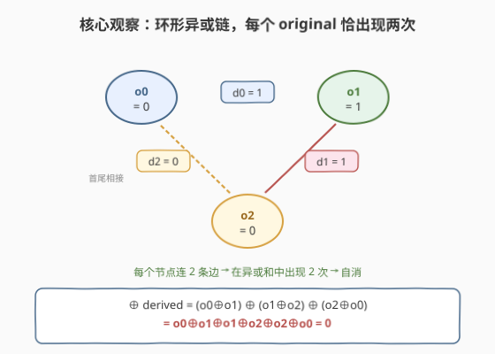
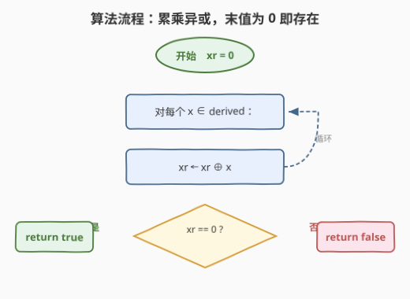
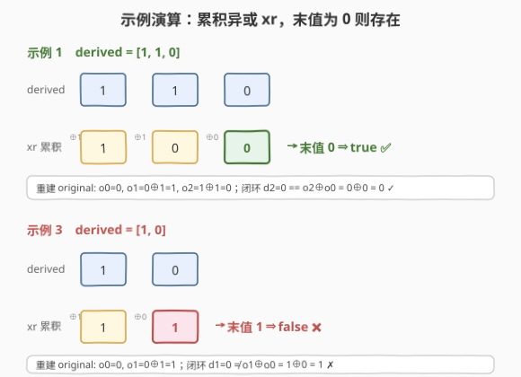

# LeetCode 相邻值的按位异或 题解

## 1. 题目概述

- **标题 / 题号**：相邻值的按位异或（#2683，medium）
- **链接**：https://leetcode.cn/problems/neighboring-bitwise-xor/
- **难度**：中等
- **标签**：位运算、数组

**题意**：下标从 **0** 开始、长度为 $n$ 的数组 `derived` 由同样长度为 $n$ 的**原始二进制数组** `original` 经「相邻值按位异或」派生而来。对每个下标 $i \in [0, n-1]$：

- 若 $i = n-1$：$\text{derived}[i] = \text{original}[i] \oplus \text{original}[0]$（**首尾相接，环形**）；
- 否则：$\text{derived}[i] = \text{original}[i] \oplus \text{original}[i+1]$。

`original` 是二进制数组（仅含 $0/1$）。给定 `derived`，判断是否存在一个能派生出 `derived` 的**有效** `original`。存在返回 `true`，否则 `false`。

**示例 1**：

```text
输入：derived = [1,1,0]
输出：true
解释：original = [0,1,0] 可派生得到 derived
  derived[0] = 0 ⊕ 1 = 1
  derived[1] = 1 ⊕ 0 = 1
  derived[2] = 0 ⊕ 0 = 0   （首尾相接）
```

**示例 2**：

```text
输入：derived = [1,1]
输出：true
解释：original = [0,1]
  derived[0] = 0 ⊕ 1 = 1
  derived[1] = 1 ⊕ 0 = 1   （首尾相接）
```

**示例 3**：

```text
输入：derived = [1,0]
输出：false
解释：不存在能派生得到 [1,0] 的二进制 original。
```

**约束**：

- $n == \text{derived.length}$
- $1 \le n \le 10^5$
- $\text{derived}[i]$ 为 $0$ 或 $1$

> 💡 关键信号：异或 $\oplus$ 是**自反运算**（$a \oplus a = 0$，$a \oplus 0 = a$）且**自求逆**（由 $\text{derived}[i] = \text{original}[i] \oplus \text{original}[i+1]$ 可反解 $\text{original}[i+1] = \text{original}[i] \oplus \text{derived}[i]$）。再加上「首尾相接」形成闭环——闭环带来的是一条**自洽性约束**而非自由度，这正是判断可行性的核心。

## 2. 解题思路

### 2.1 暴力思路：模拟重建 + 校验闭环

由于异或自求逆，一旦**固定** $\text{original}[0]$，整个 `original` 就被 `derived` 唯一确定：

$$
\text{original}[i+1] = \text{original}[i] \oplus \text{derived}[i], \quad i = 0, 1, \dots, n-2
$$

`original` 是二进制数组，$\text{original}[0]$ 只有 $0$ 或 $1$ 两种取值，看似要枚举两种。但有一个关键事实可省去一半工作：**把 `original` 整体按位取反（每个元素 $\oplus 1$）后，所有相邻异或值不变**——因为 $(a \oplus 1) \oplus (b \oplus 1) = a \oplus b$。所以两种初值要么**都**满足闭环、要么**都不**满足，只需测试 $\text{original}[0] = 0$ 一种情况即可。

模拟流程：

1. 令 $\text{cur} = 0$（即 $\text{original}[0] = 0$）；
2. 对 $i = 0, \dots, n-2$：$\text{cur} \mathrel{\oplus}= \text{derived}[i]$（此步后 $\text{cur}$ 即 $\text{original}[i+1]$）；
3. 闭环校验：$\text{derived}[n-1] \stackrel{?}{=} \text{original}[n-1] \oplus \text{original}[0] = \text{cur} \oplus 0 = \text{cur}$。

即只需判断 $\text{derived}[n-1] \stackrel{?}{=} \bigoplus_{i=0}^{n-2} \text{derived}[i]$。时间 $O(n)$，空间 $O(1)$（无需真正存数组，一个滚动变量即可）。

### 2.2 核心观察：所有 derived 的异或和必为 0



把上一节的闭环条件 $\text{derived}[n-1] = \bigoplus_{i=0}^{n-2} \text{derived}[i]$ 两边再 $\oplus$ 上 $\text{derived}[n-1]$，得到等价条件：

$$
\bigoplus_{i=0}^{n-1} \text{derived}[i] = 0
$$

即 **`derived` 全体元素的异或和必须为 0**。这一条件有一个更直观、无需推导的「看出」方式——直接展开异或和：

$$
\bigoplus_{i=0}^{n-1} \text{derived}[i] = (\text{o}_0 \oplus \text{o}_1) \oplus (\text{o}_1 \oplus \text{o}_2) \oplus \cdots \oplus (\text{o}_{n-1} \oplus \text{o}_0)
$$

环形结构让每个 $\text{original}[i]$ 恰好出现在**两个** `derived` 项里（$\text{derived}[i-1]$ 的右项与 $\text{derived}[i]$ 的左项，下标取模），异或两次必自消为 $0$。所以**只要 `derived` 由某个 `original` 派生而来，其异或和必然是 0**（必要性）。

反过来也成立（充分性）：若 $\bigoplus \text{derived} = 0$，令 $\text{original}[0] = 0$、按 $2.1$ 递推得到 $\text{original}[1..n-1]$，则闭环条件 $\text{derived}[n-1] = \text{original}[n-1] \oplus \text{original}[0]$ 恰好等价于异或和为零，必然成立。于是**充要条件**就是：异或和为零则存在，否则不存在。

> 💡 一句话：**闭环异或链的全体异或和恒为零——这是必要条件；而它同时也是充分条件，因为任取初值都能递推出一个自洽的 `original`。**

### 2.3 算法流程图



步骤：

1. `xr = 0`（异或累加器，初始为单位元 $0$）；
2. 对每个 $x \in \text{derived}$：`xr ^= x`；
3. 返回 `xr == 0`。

### 2.4 示例演算



- **示例 1** `derived = [1,1,0]`：
  - 累积异或：$0 \to 1 \to 0 \to 0$，最终 $\text{xr} = 0$ → 返回 `true` ⭐；
  - 对应 `original` 重建（$\text{o}_0=0$）：$\text{o}_1 = 0\oplus1 = 1$，$\text{o}_2 = 1\oplus1 = 0$；闭环 $\text{derived}[2]=0 \stackrel{?}{=} \text{o}_2\oplus\text{o}_0 = 0\oplus0 = 0$ ✓。
- **示例 2** `derived = [1,1]`：累积 $0\to1\to0$，$\text{xr}=0$ → `true` ⭐。
- **示例 3** `derived = [1,0]`：
  - 累积异或：$0 \to 1 \to 1$，最终 $\text{xr} = 1$ → 返回 `false` ⭐；
  - 重建（$\text{o}_0=0$）：$\text{o}_1 = 0\oplus1 = 1$；闭环 $\text{derived}[1]=0 \stackrel{?}{=} \text{o}_1\oplus\text{o}_0 = 1\oplus0 = 1$，$0 \ne 1$ ✗。

## 3. 参考代码

### C++

```cpp
class Solution {
public:
    bool doesValidArrayExist(vector<int>& derived) {
        int xr = 0;
        for (int x : derived) xr ^= x;   // 环形异或链：每个 original 元素出现两次必相消
        return xr == 0;                  // 异或和为零 ⇔ 存在自洽的 original
    }
};
```

### Python

```python
class Solution:
    def doesValidArrayExist(self, derived: List[int]) -> bool:
        xr = 0
        for x in derived:
            xr ^= x        # 环形异或链：每个 original 元素出现两次必相消
        return xr == 0     # 异或和为零 ⇔ 存在自洽的 original
```

**`reduce` 一行版**：

```python
from functools import reduce
from operator import xor

class Solution:
    def doesValidArrayExist(self, derived: List[int]) -> bool:
        return reduce(xor, derived) == 0
```

**对照版：模拟重建 + 闭环校验（思路 2.1 的直译）**

```python
class Solution:
    def doesValidArrayExist(self, derived: List[int]) -> bool:
        cur = 0                                   # original[0] = 0（取反版同效，测一种即可）
        for i in range(len(derived) - 1):
            cur ^= derived[i]                      # cur 演化为 original[i+1]
        return derived[-1] == cur                  # 闭环：derived[n-1] == original[n-1] ⊕ original[0]
```

> 💡 三种写法等价：`reduce` 版把「异或和为零」直接表达；模拟版把「重建 + 校验」过程显式写出，便于面试时讲清因果。两者都只扫一遍、只用一个滚动变量。

## 4. 复杂度分析

| 维度 | 复杂度 | 说明 |
|------|--------|------|
| **时间复杂度** | $O(n)$ | 单趟遍历 `derived`，每个元素参与一次异或；$n \le 10^5$ 轻松通过 |
| **空间复杂度** | $O(1)$ | 仅一个累加器 `xr`（或 `cur`），不依赖输入规模 |

> 💡 $O(n)$ 已是该问题**渐近下界**：`derived` 的每个元素都必须被读取至少一次才能给出判断（任意未读元素都可能翻转最终异或和的奇偶性），$\Omega(n)$ 不可破。

## 5. 扩展：非环形版与环形版的对照

本题是 **LeetCode 1720（解码异或后的数组）** 的「环形进阶版」。

- **1720（非环形）**：$\text{derived}[i] = \text{original}[i] \oplus \text{original}[i+1]$，$i \in [0, n-2]$，且**已知** $\text{original}[0]$。由于没有首尾相接的闭环，递推 $\text{original}[i+1] = \text{original}[i] \oplus \text{derived}[i]$ 无任何自洽约束——**必然可解**，问题只是「解码」。
- **2683（环形）**：多出 $\text{derived}[n-1] = \text{original}[n-1] \oplus \text{original}[0]$ 这条**闭环**，且 $\text{original}[0]$ **未知**。闭环把「自由度」吃掉一个、换来一条「自洽性」约束，于是从「必然可解」变成「**有条件可解**」——条件即异或和为零。

二者的对照恰好揭示了**环形结构如何把「无约束的解码问题」变成「带可行性判定的约束问题」**：环让每个变量出现两次，从而产生一个不依赖于具体取值的全局不变量（异或和为零）。理解这一点，遇到任何「环形相邻异或/差分」类问题都能迅速定位到「检查全局不变量」这一步。

> ⚠️ 若把环去掉但 $\text{original}[0]$ 仍未知（即给 `derived` 求 `original` 是否存在），则必然可解（取任意 $\text{original}[0]$ 递推即可，无闭环校验）。可见「不可解」的根源**全在闭环**，而非递推本身。

## 6. 面试要点

1. **为什么只需测试 $\text{original}[0]=0$ 一种初值？**

   > 因为对 `original` 整体按位取反后，任意相邻两项的异或不变：$(a\oplus1)\oplus(b\oplus1)=a\oplus b$。于是两种初值要么同时满足闭环、要么同时不满足，测一种即可代表两种。

2. **「异或和为零」为什么是充要条件，而不只是必要条件？**

   > 必要性来自展开异或和：环形让每个 $\text{original}[i]$ 出现两次必自消为零。充分性来自构造：若异或和为零，令 $\text{original}[0]=0$ 并按 $\text{original}[i+1]=\text{original}[i]\oplus\text{derived}[i]$ 递推，则闭环条件 $\text{derived}[n-1]=\text{original}[n-1]\oplus\text{original}[0]$ 恰等价于异或和为零，必然成立，构造成功。

3. **能否不遍历全部元素就给出判断？**

   > 不能。任意一个未读取的 $\text{derived}[i]$ 都可能改变全体异或和的奇偶性，从而翻转 true/false 结论。必须读完全部 $n$ 个元素，$\Omega(n)$ 是下界。

4. **若 `derived` 元素不是二进制（可为任意整数），结论还成立吗？**

   > 仍然成立。推导只用到异或的自反性（$a\oplus a=0$）与可加可换性，与取值是否为 $0/1$ 无关。题目限定二进制只是让「初值枚举」看起来像两种；但因整体取反不变异或，二进制约束其实没有缩小解空间——任意整数环上结论一致。

5. **模拟版和异或和版，面试写哪个？**

   > 写异或和版最简短，但**讲**的时候建议先讲模拟版（固定初值 → 递推 → 校验闭环），再指出闭环条件等价于异或和为零，自然过渡到一行版。这样既展示「会做」又展示「看穿」，比直接甩一行 `reduce` 更有说服力。

> 💡 **一句话总结**：2683 = 「环形相邻异或链的全局不变量：全体异或和必为零」。$O(n)$ 一趟、$O(1)$ 空间，判断 $\bigoplus \text{derived} == 0$ 即可。

## 同类练习题

| # | 题目 | 与本题的关联 |
|---|------|-------------|
| 1720 | [解码异或后的数组](https://leetcode.cn/problems/decode-xored-array/) | 本题的**非环形**版，给定 $\text{original}[0]$ 直接递推解码，无闭环约束、必然可解，对照理解「环带来了可行性判定」 |
| 1734 | [解码异或后的排列](https://leetcode.cn/problems/decode-xored-permutation/) | 相邻异或解码的排列变体，需先用「全体异或」技巧求出某一位再反推，强化「整体异或消去偶数次项」的思路 |
| 2997 | [使数组异或和等于 K 的最少操作次数](https://leetcode.cn/problems/minimum-number-of-operations-to-make-array-xor-equal-to-k/) | 操作使全体异或和归零/等于目标，同属「异或和作为全局不变量」的题型 |
| 1310 | [子数组异或查询](https://leetcode.cn/problems/xor-queries-of-a-subarray/) | 前缀异或思想（$[l,r]$ 异或 $= \text{pre}[r+1]\oplus\text{pre}[l]$），巩固「异或自消」在区间求值中的应用 |
