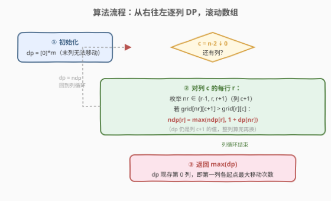
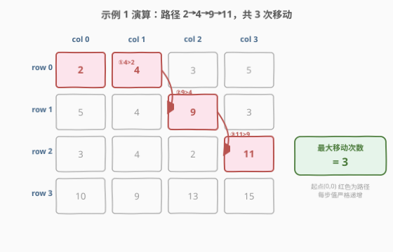

# 矩阵中移动的最大次数

- **题目名称**：矩阵中移动的最大次数
- **链接**：[2684. 矩阵中移动的最大次数](https://leetcode.cn/problems/maximum-number-of-moves-in-a-grid/)
- **难度**：中等
- **标签**：数组、动态规划、矩阵

## 1. 题目概述

给你一个下标从 $0$ 开始、大小为 $m \times n$ 的矩阵 `grid`，矩阵由若干**正**整数组成。

你可以从矩阵**第一列**中的**任意**单元格出发，按以下方式遍历 `grid`：

- 从单元格 $(row, col)$ 可以移动到 $(row - 1, col + 1)$、$(row, col + 1)$ 和 $(row + 1, col + 1)$ 三个单元格中任一满足值**严格大于**当前单元格的单元格。

返回你在矩阵中能够**移动**的**最大**次数。

**示例 1**：

```text
输入：grid = [[2,4,3,5],[5,4,9,3],[3,4,2,11],[10,9,13,15]]
输出：3
解释：可以从单元格 (0, 0) 开始并按下面的路径移动：
- (0, 0) -> (0, 1).
- (0, 1) -> (1, 2).
- (1, 2) -> (2, 3).
```

**示例 2**：

```text
输入：grid = [[3,2,4],[2,1,9],[1,1,7]]
输出：0
解释：从第一列的任一单元格开始都无法移动。
```

**约束条件**：

- $m == \text{grid.length}$
- $n == \text{grid[i].length}$
- $2 \le m, n \le 1000$
- $4 \le m \cdot n \le 10^5$
- $1 \le \text{grid[i][j]} \le 10^6$

> 💡 **关键信号**：每次移动**必定跨入右一列**（`col+1`），列下标严格递增——这是**有向无环图（DAG）**的招牌特征，天然适合按列做动态规划。又因为转移只依赖右一列，可用滚动数组把空间压到 $O(m)$。

---

## 2. 解题思路

### 2.1 暴力思路

从第一列每个起点各做一次 DFS，枚举三条分支递归到底、取最深路径。问题在于：同一格子会被多条路径反复访问，路径数随列数指数增长，$m, n$ 到 $1000$ 时完全不可行。本质缺陷是**重复子问题**没有消除。

### 2.2 核心观察：列向右单调推进，按列 DP + 滚动数组

![核心观察：只能向右移一格，dp[r][c] 只依赖右一列](../images/p2684_move_directions_concept.svg)

**第一层：移动方向只向右 → 无环 → 可 DP。**

三种走法 $(r-1,c+1)$、$(r,c+1)$、$(r+1,c+1)$ 的列坐标都变成 $c+1$，列下标只增不减，绝不会回头。因此状态依赖关系是一条**从右向左**的有向无环链：右列的值先算好，左列直接查表，绝无循环依赖。

**第二层：定义 $dp[r][c]$ = 从 $(r,c)$ 出发能走的最大移动次数。**

- **基准**：最右列 $c=n-1$ 无法再移动，$dp[r][n-1] = 0$；
- **转移**：$dp[r][c] = \max\{\,1 + dp[nr][c+1] \mid nr \in \{r-1,r,r+1\},\; \text{grid}[nr][c+1] > \text{grid}[r][c]\,\}$，若无合法邻居则 $0$；
- **答案**：起点在第一列，故 $\text{ans} = \max_{r} dp[r][0]$。

**第三层：只读右一列 → 滚动 1D 数组。**

转移只用到列 $c+1$ 的 $dp$ 值，算完一整列再整体替换。用一维 `dp[m]` 表示"当前右列"的值，新开 `ndp[m]` 算"当前列"，整列算完后 `dp = ndp`。空间从 $O(mn)$ 降到 $O(m)$，对 $m \cdot n \le 10^5$ 足够宽松。

> ⚠️ **易错点**：值必须**严格大于**，相等不能移动（示例 2 中 `grid[0][0]=3`、`grid[0][1]=2`、`grid[1][1]=1`、`grid[2][1]=1` 全部不大于起点，故输出 $0$）。另外 `ndp` 必须按**整列**算完才回写 `dp`，不能边算边覆盖——否则同一列内会读到已被改动的右列值。

### 2.3 算法流程图



步骤：

1. 初始化 `dp = [0] * m`，代表最右列（无法移动）；
2. 从 $c = n-2$ 向左遍历到 $c = 0$：
   - 新建 `ndp = [0] * m`；
   - 对每行 $r$，枚举 $nr \in \{r-1, r, r+1\}$（均在列 $c+1$）；
   - 若 $nr$ 不越界且 $\text{grid}[nr][c+1] > \text{grid}[r][c]$：`ndp[r] = max(ndp[r], 1 + dp[nr])`；
   - 整列算完，`dp = ndp`；
3. 循环结束后 `dp` 存的是第 $0$ 列各起点的最大移动次数，返回 `max(dp)`。

### 2.4 示例演算



以示例 1 `grid = [[2,4,3,5],[5,4,9,3],[3,4,2,11],[10,9,13,15]]`（$4 \times 4$）为例，按列从右往左推：

| 列 $c$ | 该列 `grid` 值 | 算出的 `dp`（本列最大移动次数） | 说明 |
|--------|---------------|--------------------------------|------|
| $3$（末列） | $[5,3,11,15]$ | $[0,0,0,0]$ | 末列基准，无法再移动 |
| $2$ | $[3,9,2,13]$ | $[1,1,1,1]$ | 各行都能找到右列更大的邻居（如 $r{=}0$：$5>3$；$r{=}3$：$15>13$） |
| $1$ | $[4,4,4,9]$ | $[2,2,2,2]$ | 套上一步 $+1$，如 $r{=}0$：$9>4$ → $1+1=2$ |
| $0$ | $[2,5,3,10]$ | $[\mathbf{3},0,3,0]$ | $r{=}0$：$4>2$ → $1+2=\mathbf{3}$；$r{=}1$：右邻均 $\le 5$ → $0$ |

最终 `max(dp) = 3`，对应路径 $(0,0)\!-\!(0,1)\!-\!(1,2)\!-\!(2,3)$，值 $2 \to 4 \to 9 \to 11$ 严格递增，共 $3$ 次移动。$r{=}1$（$5$）与 $r{=}3$（$10$）右邻都更小，故停在 $0$。

---

## 3. 参考代码

### C++

```cpp
class Solution {
public:
    int maxMoves(vector<vector<int>>& grid) {
        int m = grid.size(), n = grid[0].size();
        vector<int> dp(m, 0);            // dp[r] = 当前右列 c+1 各行最大移动次数；末列全 0
        int ans = 0;
        for (int c = n - 2; c >= 0; c--) {
            vector<int> ndp(m, 0);
            for (int r = 0; r < m; r++) {
                for (int dr : {-1, 0, 1}) {
                    int nr = r + dr;
                    if (nr >= 0 && nr < m && grid[nr][c + 1] > grid[r][c])
                        ndp[r] = max(ndp[r], 1 + dp[nr]);
                }
            }
            dp = move(ndp);              // 整列算完再换，避免覆盖右列值
        }
        for (int r = 0; r < m; r++) ans = max(ans, dp[r]);
        return ans;
    }
};
```

### Python

```python
class Solution:
    def maxMoves(self, grid: List[List[int]]) -> int:
        m, n = len(grid), len(grid[0])
        dp = [0] * m                      # 末列：无法再移动
        for c in range(n - 2, -1, -1):
            ndp = [0] * m
            for r in range(m):
                for dr in (-1, 0, 1):
                    nr = r + dr
                    if 0 <= nr < m and grid[nr][c + 1] > grid[r][c]:
                        ndp[r] = max(ndp[r], 1 + dp[nr])
            dp = ndp                      # 整列算完再换
        return max(dp)
```

---

## 4. 复杂度分析

| 维度 | 复杂度 | 说明 |
|------|--------|------|
| **时间复杂度** | $O(m \cdot n)$ | 每格只算一次，每次查 $3$ 个右邻，常数 $3$；整体线性于格子总数 |
| **空间复杂度** | $O(m)$ | 滚动数组只保留一列 $m$ 个值；不计输入 `grid` 本身 |

> 💡 本题 $m \cdot n \le 10^5$，$O(mn)$ 时间、$O(m)$ 空间绰绰有余。若用二维 $dp$ 空间为 $O(mn)$ 也能过，但滚动 1D 更省内存、缓存更友好。

---

## 5. 扩展：左到右 BFS / 记忆化 DFS

**左到右推进 DP**：也可定义 $dp[r][c]$ = 到达 $(r,c)$ 的最大移动次数，从第 $0$ 列向右推，转移读左一列，答案取全局 $\max$。与上述右到左版等价，仅方向相反，同样可滚动。

**记忆化 DFS**：对每个起点 `dfs(r,0)` 递归 + `memo` 缓存，天然消除重复子问题。复杂度同为 $O(mn)$，但递归栈在 $n{=}1000$ 时偏深、常数偏大，不如迭代列 DP 直接。迭代法是面试首选写法。

---

## 6. 面试要点

1. **为什么能保证无环、可以 DP？**

   > 每次移动列坐标 $+1$，列下标严格递增不可能回头，状态依赖构成 DAG。DAG 上必存在拓扑序，此处拓扑序就是"列从右到左"，按此序填表即得最优子结构。

2. **滚动数组为什么要"整列算完再换"，不能边算边覆盖？**

   > 算第 $c$ 列时反复读 `dp[nr]`（第 $c+1$ 列的值）。若用同一个数组原地写，$r$ 较小时会把后面 $r$ 还要读的右列值覆盖掉。新开 `ndp`、整列算完后 `dp = ndp` 才能保证读到的始终是上一列的旧值。

3. **严格大于 vs 大于等于，差在哪？**

   > 题目要求目标值**严格大于**当前格。若误写成 $\ge$，示例 2 中 $3 \to 3$（相等）会被错误允许，输出 $1$ 而非 $0$。相等不可移动是边界条件的常见踩坑点。

4. **起点为什么只在第一列？答案为什么是 `max(dp)` 而非全局最大？**

   > 题目限定从第一列出发。右到左 DP 算完后 `dp` 恰好存第 $0$ 列各起点的最大移动次数，对其取 `max` 即答案。若起点可任意，则要取全表 `max`——两种问法仅差一个取值范围。

5. **本题和 [62. 不同路径](https://leetcode.cn/problems/unique-paths/) 等"网格 DP"的关系？**

   > 同属"网格 + 方向受限 + 按列/行推进"的 DP 家族。62 只能向右/向下且求**方案数**（加法累加）；本题向右三方向且带"值递增"约束求**最值**（取 max）。核心都是"方向受限 → 无环 → 按维度递推"。

> 💡 **一句话总结**：2684 = 「只能向右走一格的网格最长路径」。列坐标严格递增 → DAG → 按列从右往左 DP，转移 $dp[r][c] = \max(1 + dp[nr][c+1])$，滚动 1D 压到 $O(m)$ 空间。

---

## 7. 同类练习题

- [62. 不同路径](https://leetcode.cn/problems/unique-paths/)：网格只能向右/向下，求方案数（加法版），同属"方向受限无环 DP"
- [64. 最小路径和](https://leetcode.cn/problems/minimum-path-sum/)：网格只能向右/向下求路径和最小（取 min 版），巩固按维度递推
- [329. 矩阵中的最长递增路径](https://leetcode.cn/problems/longest-increasing-path-in-a-matrix/)：四方向 + 值严格递增求最长路径，本题的"四方向无固定方向"进阶，需记忆化 DFS
- [2328. 统计网格图中可达得到点数的方法数](https://leetcode.cn/problems/number-of-increasing-paths-in-a-grid/)：值严格递增 + 四方向求路径数，329 的计数变体
- [1594. 矩阵的最大非负积](https://leetcode.cn/problems/maximum-non-negative-product-in-a-matrix/)：网格向右/向下求最大积，方向受限 DP 但乘积需同时维护最大最小
