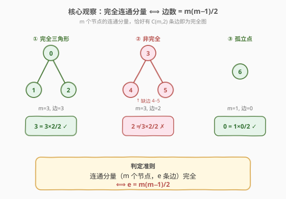
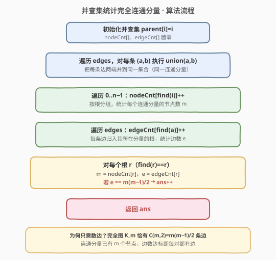
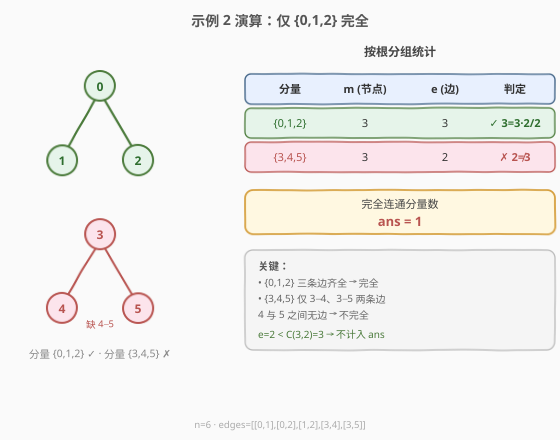

# LeetCode 统计完全连通分量的数量 题解

## 1. 题目概述

- **标题 / 题号**：统计完全连通分量的数量（#2685，medium）
- **链接**：https://leetcode.cn/problems/count-the-number-of-complete-components/
- **难度**：中等
- **标签**：并查集、深度优先搜索、广度优先搜索、图

**题意**：给定整数 `n`，一个包含 `n` 个顶点的**无向图**，顶点编号 `0` 到 `n-1`，边由 `edges` 给出，`edges[i] = [ai, bi]` 表示 `ai` 与 `bi` 间有一条**无向边**。

返回图中**完全连通分量**的数量。

- **连通分量**：子图中任意两点都有路径相通，且子图中任一顶点都不与子图外的顶点共享边。
- **完全连通分量**：连通分量中**每对节点之间都存在一条边**（即子图是一个完全图 $K_m$）。

**示例 1**：

```text
输入：n = 6, edges = [[0,1],[0,2],[1,2],[3,4]]
输出：3
解释：分量 {0,1,2} 是三角形（完全）；{3,4} 单边（完全）；{5} 孤立点（完全）。共 3 个。
```

**示例 2**：

```text
输入：n = 6, edges = [[0,1],[0,2],[1,2],[3,4],[3,5]]
输出：1
解释：{0,1,2} 完全；{3,4,5} 缺 4−5 边，不完全。仅 1 个完全连通分量。
```

**约束**：

- `1 <= n <= 50`
- `0 <= edges.length <= n * (n - 1) / 2`
- `edges[i].length == 2`
- `0 <= ai, bi <= n - 1`，`ai != bi`
- 不存在重复的边

## 2. 解题思路

### 2.1 暴力思路

用 DFS/BFS 找出每个连通分量的全部顶点，再对每个分量检查「任意两点是否都有边」（用邻接表/邻接矩阵查每对顶点）。时间复杂度 $O(n^2)$（$n\le 50$ 轻松通过）。但逐对查边啰嗦且不够通用——下面用**完全图的边数性质**把判定降到 $O(1)$。

### 2.2 核心观察：边数 = m(m−1)/2



一个 $m$ 个节点的**完全图** $K_m$ 恰好有 $\binom{m}{2} = \frac{m(m-1)}{2}$ 条边——这是「每对节点都有一条边」的等价刻画。而**连通分量**已经保证组内 $m$ 个顶点连通，于是判定退化成一个等式：

$$\text{连通分量完全} \iff e = \frac{m(m-1)}{2}$$

其中 $e$ 是该分量的边数、$m$ 是该分量的节点数。

> 💡 **关键直觉**：我们不必逐对检查「有无边」，只需**数节点、数边**再比对一个公式。完全图的边数上界就是 $C(m,2)$，边数达标即每对都有边（边不可能更少也不可能有重边），不可能「凑够边数却漏某对」。

### 2.3 算法流程图



用**并查集**把每条边两端并到同一集合后，按根分组即可一次扫完统计：

1. 初始化并查集，`union` 所有边。
2. 遍历 `0..n-1`：`nodeCnt[find(i)]++`，按根统计每个分量的节点数 $m$。
3. 遍历 `edges`：`edgeCnt[find(a)]++`，每条边归入其所在根，统计边数 $e$。
4. 对每个根 $r$：若 `edgeCnt[r] == nodeCnt[r]·(nodeCnt[r]-1)/2`，则 `ans++`。

> ⚠️ 边数计数**只遍历原始 `edges` 列表**（每条无向边在其中只出现一次），故 `edgeCnt` 每条边计 $1$ 次，无需除以 $2$；若改用邻接表逐邻接点统计则每条边会被数两次，需 `// 2`。

### 2.4 示例演算



以**示例 2**（`n=6`，`edges=[[0,1],[0,2],[1,2],[3,4],[3,5]]`）为例：

- `union` 全部边后得两个连通分量：根 `{0,1,2}`、根 `{3,4,5}`。
- 统计节点数：`nodeCnt = {0:3, 3:3}`（其余根为孤立点 `{5}`，已并入根 3）。
- 统计边数：`edgeCnt = {0:3, 3:2}`（边 0−1、0−2、1−2 归根 0；边 3−4、3−5 归根 3）。
- 判定：
  - 根 0：$m=3, e=3$，$3 = 3\times2/2 = 3$ ✓ → `ans++`
  - 根 3：$m=3, e=2$，$2 \ne 3$ ✗
- 返回 `ans = 1`。✓

## 3. 参考代码

### C++（并查集 + 路径压缩）

```cpp
class Solution {
public:
    int countCompleteComponents(int n, vector<vector<int>>& edges) {
        parent.resize(n);
        iota(parent.begin(), parent.end(), 0);
        for (auto& e : edges) unite(e[0], e[1]);

        vector<int> nodeCnt(n, 0), edgeCnt(n, 0);
        for (int i = 0; i < n; i++) nodeCnt[find(i)]++;          // 按根统计节点数
        for (auto& e : edges) edgeCnt[find(e[0])]++;             // 按根统计边数

        int ans = 0;
        for (int i = 0; i < n; i++) {
            if (find(i) == i) {                                  // 只在根处判定一次
                int m = nodeCnt[i];
                if (edgeCnt[i] == m * (m - 1) / 2) ans++;
            }
        }
        return ans;
    }
private:
    vector<int> parent;
    int find(int x) {
        if (parent[x] != x) parent[x] = find(parent[x]);         // 路径压缩
        return parent[x];
    }
    void unite(int x, int y) {
        int rx = find(x), ry = find(y);
        if (rx != ry) parent[rx] = ry;
    }
};
```

### Python（并查集 + 路径压缩）

```python
class Solution:
    def countCompleteComponents(self, n: int, edges: List[List[int]]) -> int:
        parent = list(range(n))

        def find(x):
            while parent[x] != x:
                parent[x] = parent[parent[x]]                   # 隔代压缩
                x = parent[x]
            return x

        def union(x, y):
            parent[find(x)] = find(y)

        for a, b in edges:
            union(a, b)

        node_cnt = [0] * n
        edge_cnt = [0] * n
        for i in range(n):
            node_cnt[find(i)] += 1                               # 按根统计节点数
        for a, _ in edges:
            edge_cnt[find(a)] += 1                              # 按根统计边数

        ans = 0
        for i in range(n):
            if find(i) == i:                                    # 只在根处判定一次
                m = node_cnt[i]
                if edge_cnt[i] == m * (m - 1) // 2:
                    ans += 1
        return ans
```

## 4. 复杂度分析

| 维度 | 复杂度 | 说明 |
|------|--------|------|
| 时间复杂度 | $O(n + m \cdot \alpha(n))$ | `union` $m$ 条边各一次均摊 $O(\alpha(n))$；统计节点/边各 $O(n+m)$；判定 $O(n)$ |
| 空间复杂度 | $O(n)$ | `parent`、`nodeCnt`、`edgeCnt` 各 $O(n)$ |

> 💡 本题 $n \le 50$，$\alpha(n) < 5$ 实为常数，整体近线性。DFS 逐对查边法 $O(n^2)$ 也能过，但并查集 + 边数公式更省、更通用。

## 5. 扩展：DFS 逐分量收集法

不用并查集，直接 DFS/BFS 把每个连通分量的顶点收集到一个集合 `comp`，再用邻接集合/矩阵查每对是否相邻：

```cpp
class Solution {
public:
    int countCompleteComponents(int n, vector<vector<int>>& edges) {
        vector<set<int>> g(n);
        for (auto& e : edges) { g[e[0]].insert(e[1]); g[e[1]].insert(e[0]); }
        vector<int> vis(n, 0);
        int ans = 0;
        for (int i = 0; i < n; i++) {
            if (vis[i]) continue;
            vector<int> comp;                                  // 收集本分量所有顶点
            dfs(i, g, vis, comp);
            bool ok = true;
            for (int a = 0; a < (int)comp.size() && ok; a++)
                for (int b = a + 1; b < (int)comp.size(); b++)
                    if (!g[comp[a]].count(comp[b])) { ok = false; break; }
            if (ok) ans++;
        }
        return ans;
    }
    void dfs(int u, vector<set<int>>& g, vector<int>& vis, vector<int>& comp) {
        vis[u] = 1; comp.push_back(u);
        for (int v : g[u]) if (!vis[v]) dfs(v, g, vis, comp);
    }
};
```

- 逐对查边最坏 $O(m \cdot \binom{m}{2})$，本题 $n\le 50$ 可接受。
- 相比并查集 + 边数公式，它「显式枚举每对」，更直观但更慢、更啰嗦；面试时可先讲它再优化到边数公式。

## 6. 面试要点

1. **为什么数边数就能判定完全图？不会出现边数够却漏某对吗？**

   - $m$ 个顶点最多有 $\binom{m}{2}$ 条边（每对一条）。边数恰好等于这个上界，意味着每对都贡献了一条边，不可能「凑够总数却漏某对」（漏一对边数必少于上界）。又因题目保证无重边、无自环，$e = \binom{m}{2}$ 与「每对相邻」严格等价。

2. **为什么要先 `union` 再统计，能不能边 `union` 边统计？**

   - 统计 `nodeCnt`/`edgeCnt` 依赖每个顶点/边的**最终归属根**。若边 `union` 边统计，某节点后续可能因路径压缩而换根，导致计数分散到旧根上、判定出错。**先 `union` 完毕、统一 `find` 后再统计**才保证每个分量计数完整归一。

3. **孤立点（无边）算不算完全连通分量？**

   - 算。$m=1, e=0$，$0 = 1\times0/2$，恒成立。一个孤立点自身就是 $K_1$（平凡完全图）。本题示例 1 的节点 5 即此情况。

4. **`edgeCnt` 用邻接表统计时要注意什么？**

   - 邻接表中每条无向边被存为两条有向弧，逐邻接点统计会把每条边数两次，判定前需 `edgeCnt / 2`。直接遍历原始 `edges` 列表（每条边只出现一次）则无需除 2，更不易错。

5. **并查集相比 DFS 逐对查边的优势？**

   - 并查集把判定降到按根的 $O(1)$ 公式比对，整体近线性 $O(n+m\alpha(n))$；DFS 逐对查边需 $O(\binom{m}{2})$ 次邻接查询。当 $n$ 变大（如 $10^5$）时差距显著，并查集 + 边数公式更可扩展。

## 同类练习题

| # | 题目 | 与本题的关联 |
|---|------|-------------|
| 547 | [省份数量](https://leetcode.cn/problems/number-of-provinces/)（[题解](../0501-0600/547_省份数量.md)） | 并查集求连通分量个数，本题在其基础上加「完全性」判定 |
| 684 | [冗余连接](https://leetcode.cn/problems/redundant-connection/)（[题解](../0601-0700/684_冗余连接.md)） | 并查集判环，加边时两端已同根即冗余，同为并查集图论基础 |
| 1319 | [连通网络的操作次数](https://leetcode.cn/problems/number-of-operations-to-make-network-connected/) | 并查集数连通分量，求最少接线数，巩固按根分组的统计技巧 |
| 1971 | [寻找图中是否存在路径](https://leetcode.cn/problems/find-if-path-exists-in-graph/) | 并查集判两点连通性的最简应用，可作为入门练习 |
| 1791 | [找出星型图的中心节点](https://leetcode.cn/problems/find-center-of-star-graph/) | 无向图度数观察，与完全图的度数性质对照 |
