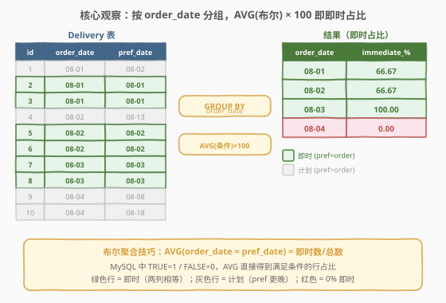
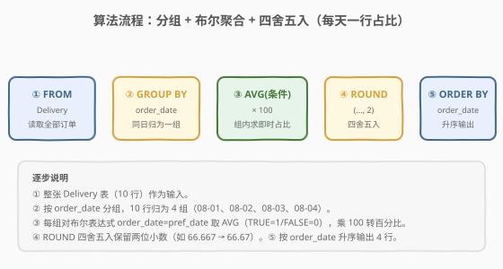
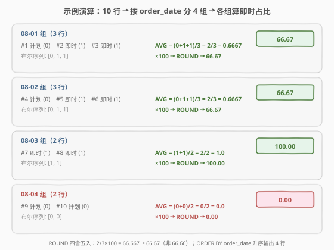

# 即时食物配送 III

- **题目名称**：即时食物配送 III
- **链接**：[2686. 即时食物配送 III 🔒](https://leetcode.cn/problems/immediate-food-delivery-iii/)
- **难度**：中等
- **标签**：数据库、SQL、`GROUP BY`、`AVG`、`ROUND`、布尔表达式聚合、百分比计算、LeetCode 锁题

## 1. 题目概述

> ⚠️ 本题为 LeetCode **付费题**（`isPaidOnly: true`），官方题面 `translatedContent` 返回 `null`。以下题意描述根据官方示例用例（`jsonExampleTestcases`）与题目名称「Immediate Food Delivery III / 即时食物配送 III」重建，可能与官方题面有出入。核心语义以示例用例给出的表结构为准。

给定一张 `Delivery` 表，记录客户的食物配送订单。每行包含订单日期（`order_date`）和客户期望配送日期（`customer_pref_delivery_date`）。若**期望配送日期与订单日期相同**，则该订单称为**即时订单（immediate）**；否则称为**计划订单（scheduled）**。

请编写 SQL 查询，找出**每个不同 `order_date` 上即时订单所占的百分比**，结果四舍五入保留两位小数。返回的结果表按 `order_date` **升序**排列。

**表结构**：

```text
Table: Delivery
+-----------------------------+---------+
| Column Name                 | Type    |
+-----------------------------+---------+
| delivery_id                 | int     |  ← 主键
| customer_id                 | int     |
| order_date                  | date    |  ← 下单日期
| customer_pref_delivery_date | date    |  ← 客户期望配送日期（≥ order_date）
+-----------------------------+---------+
delivery_id 是本表的主键（具有唯一值的列）。
每一行包含一笔配送订单的信息：客户在 order_date 下单，并指定期望配送日期（当天或之后）。
```

> 💡 **关键定义**：`order_date = customer_pref_delivery_date` → **即时订单**；`order_date < customer_pref_delivery_date` → **计划订单**。判定只需比较两列是否相等，无需额外的时间差计算。

**示例 1**：

```text
输入：
Delivery 表:
+-------------+-------------+------------+-----------------------------+
| delivery_id | customer_id | order_date | customer_pref_delivery_date |
+-------------+-------------+------------+-----------------------------+
| 1           | 1           | 2019-08-01 | 2019-08-02                  |
| 2           | 2           | 2019-08-01 | 2019-08-01                  |
| 3           | 1           | 2019-08-01 | 2019-08-01                  |
| 4           | 3           | 2019-08-02 | 2019-08-13                  |
| 5           | 3           | 2019-08-02 | 2019-08-02                  |
| 6           | 2           | 2019-08-02 | 2019-08-02                  |
| 7           | 4           | 2019-08-03 | 2019-08-03                  |
| 8           | 1           | 2019-08-03 | 2019-08-03                  |
| 9           | 5           | 2019-08-04 | 2019-08-08                  |
| 10          | 2           | 2019-08-04 | 2019-08-18                  |
+-------------+-------------+------------+-----------------------------+

输出：
+------------+----------------------+
| order_date | immediate_percentage |
+------------+----------------------+
| 2019-08-01 | 66.67                |
| 2019-08-02 | 66.67                |
| 2019-08-03 | 100.00               |
| 2019-08-04 | 0.00                 |
+------------+----------------------+
```

**解释**：

| order_date | 订单数 | 即时数 | 计划数 | 计算 | immediate_percentage |
|------------|--------|--------|--------|------|----------------------|
| 2019-08-01 | 3 | 2（#2,#3） | 1（#1） | $2/3 \times 100$ | **66.67** |
| 2019-08-02 | 3 | 2（#5,#6） | 1（#4） | $2/3 \times 100$ | **66.67** |
| 2019-08-03 | 2 | 2（#7,#8） | 0 | $2/2 \times 100$ | **100.00** |
| 2019-08-04 | 2 | 0 | 2（#9,#10） | $0/2 \times 100$ | **0.00** |

**约束条件**：

- `delivery_id` 是 `Delivery` 表的主键，每行唯一。
- `customer_pref_delivery_date` 大于或等于 `order_date`（客户不会要求在下单前配送）。
- 结果按 `order_date` 升序排列，百分比四舍五入到 2 位小数。

> 💡 **本题是 SQL "分组求占比" 招牌题**——核心套路：`GROUP BY order_date` 后用**布尔表达式聚合**求即时订单占比。与即时配送系列 I/II 同源，但本题按 `order_date` 分组而非全局或按客户首单，是理解「`GROUP BY` + `AVG(条件)` 计算组内占比」最干净的样例。

---

## 2. 解题思路

### 2.1 暴力思路：逐日期统计

最直觉的过程式思路：找出所有不同的 `order_date`，对每个日期统计该日期下的总订单数和即时订单数，再算百分比。

```text
dates = DISTINCT order_date in Delivery
for d in dates:
    total = COUNT(rows where order_date = d)
    immediate = COUNT(rows where order_date = d AND order_date = customer_pref_delivery_date)
    pct = ROUND(immediate / total * 100, 2)
    output (d, pct)
sort output by order_date ASC
```

逻辑正确，但 SQL 有更声明式的表达：用 `GROUP BY order_date` 一次性把同日期的行归并为一组，再用聚合函数在组内计算即时占比——无需显式循环。

### 2.2 核心观察：GROUP BY order_date + 布尔表达式聚合



**问题拆解为三个子问题**：

1. **分组键**：`GROUP BY order_date`——每个日期独立成一组，组内所有订单共享同一下单日。

2. **判定即时**：`order_date = customer_pref_delivery_date`——两列相等即为即时。在 MySQL 中，布尔比较返回 `1`（真）或 `0`（假），可直接作为数值参与聚合。

3. **计算占比**：即时占比 = $\frac{\text{即时订单数}}{\text{总订单数}} \times 100$。这有两种 SQL 表达方式：

   | 写法 | 公式 | 语义 |
   |------|------|------|
   | **`AVG(条件)`** | $\frac{\sum \text{bool}}{\text{count}} = \frac{\text{即时数}}{\text{总数}}$ | 布尔值的平均值 = 即时占比（最简洁） |
   | **`SUM(IF(条件,1,0))/COUNT(*)`** | $\frac{\text{即时数}}{\text{总数}}$ | 显式拆分分子分母（最通用） |

$$\text{immediate\_percentage}_d = \frac{\left| \{\, r \in \text{Delivery} \mid r.\text{order\_date} = d \,\} \right|_{\text{immediate}}}{\left| \{\, r \in \text{Delivery} \mid r.\text{order\_date} = d \,\} \right|_{\text{all}}} \times 100$$

> 💡 **MySQL 布尔表达式的数值化**：MySQL 中 `order_date = customer_pref_delivery_date` 的结果是 `1`（TRUE）或 `0`（FALSE）。对一组行取 `AVG`，等价于「TRUE 的行数 / 总行数」——恰好就是即时占比。这是 MySQL 的一个惯用技巧：`AVG(条件)` 直接得到满足条件的行占比，无需手写 `SUM(IF(...))/COUNT(*)`。乘以 100 转百分比，再 `ROUND(..., 2)` 保留两位小数。

> ⚠️ **跨数据库注意**：`AVG(布尔表达式)` 是 MySQL 特有写法（布尔隐式转 0/1）。PostgreSQL 中布尔类型不能直接 `AVG`，需改用 `AVG(CASE WHEN 条件 THEN 1 ELSE 0 END)` 或 `SUM(CASE WHEN ...)`/`COUNT(*)` 写法（见解法 B）。

### 2.3 算法流程图



**逻辑执行步骤**：

| 步骤 | 子句 | 作用 |
|------|------|------|
| ① | `FROM Delivery` | 读取全部配送订单（10 行） |
| ② | `GROUP BY order_date` | 按下单日期归组（4 组：08-01, 08-02, 08-03, 08-04） |
| ③ | `AVG(order_date = customer_pref_delivery_date) * 100` | 组内布尔求均值即即时占比，乘 100 转百分比 |
| ④ | `ROUND(..., 2)` | 四舍五入保留两位小数 |
| ⑤ | `ORDER BY order_date` | 按日期升序输出 |

> 💡 **SQL 子句执行顺序**：`FROM` → `WHERE`（本题无）→ `GROUP BY`（归组）→ 聚合函数 `AVG/SUM/COUNT`（组内计算）→ `SELECT`（选列 + ROUND + 命名）→ `ORDER BY`（排序）。`GROUP BY` 先把 10 行归为 4 组，聚合函数在每组内算占比，最后排序输出。

### 2.4 示例演算

以示例 1 的 10 行数据为例，观察「按 `order_date` 分组 → 组内算即时占比」的逐步过程：



**阶段 ①：分组（`GROUP BY order_date`）**

| 分组 (order_date) | 组内订单 | 组内行数 |
|--------------------|---------|----------|
| 2019-08-01 | #1(计划), #2(即时), #3(即时) | 3 |
| 2019-08-02 | #4(计划), #5(即时), #6(即时) | 3 |
| 2019-08-03 | #7(即时), #8(即时) | 2 |
| 2019-08-04 | #9(计划), #10(计划) | 2 |

**阶段 ②：组内聚合（`AVG(布尔)*100` → `ROUND`）**

- 08-01 组：布尔序列 `[0, 1, 1]` → `AVG = 2/3 = 0.6667` → `×100 = 66.667` → `ROUND → 66.67`
- 08-02 组：布尔序列 `[0, 1, 1]` → `AVG = 2/3 = 0.6667` → `×100 = 66.667` → `ROUND → 66.67`
- 08-03 组：布尔序列 `[1, 1]` → `AVG = 2/2 = 1.0` → `×100 = 100.0` → `ROUND → 100.00`
- 08-04 组：布尔序列 `[0, 0]` → `AVG = 0/2 = 0.0` → `×100 = 0.0` → `ROUND → 0.00`

**阶段 ③：排序输出（`ORDER BY order_date`）**

4 行结果按 `order_date` 升序排列：`(08-01, 66.67), (08-02, 66.67), (08-03, 100.00), (08-04, 0.00)`。

> 💡 **为何 66.67 不是 66.66**：$2/3 = 0.66666\ldots$，`ROUND` 四舍五入到两位小数时，第三位 6 ≥ 5 进一，得 66.67。若误用 `TRUNCATE`（截断）会得 66.66，导致判定不通过。`ROUND` 是四舍五入，`TRUNCATE` 是直接截断——面试中务必区分。

---

## 3. 参考代码

### SQL（解法 A：`AVG(布尔)`，MySQL 推荐，最简洁）

```sql
SELECT order_date,
       ROUND(AVG(order_date = customer_pref_delivery_date) * 100, 2) AS immediate_percentage
FROM Delivery
GROUP BY order_date
ORDER BY order_date;
```

> 💡 **写法要点**：
> - **`GROUP BY order_date`**：按下单日期分组，同一天的订单归为一组。
> - **`AVG(order_date = customer_pref_delivery_date)`**：MySQL 布尔比较返回 1/0，`AVG` 直接得到即时订单占比（小数）。无需手写 `SUM(IF(...))/COUNT(*)`，一行搞定。
> - **`* 100`**：占比小数转百分比。
> - **`ROUND(..., 2)`**：四舍五入保留两位小数（如 $66.667 \to 66.67$）。
> - ✓ **最推荐**：语义清晰，利用 MySQL 布尔聚合技巧，最简洁。

### SQL（解法 B：`SUM(IF) / COUNT(*)`，跨数据库通用）

```sql
SELECT order_date,
       ROUND(100 * SUM(IF(order_date = customer_pref_delivery_date, 1, 0)) / COUNT(*), 2) AS immediate_percentage
FROM Delivery
GROUP BY order_date
ORDER BY order_date;
```

> 💡 **解法 B 的思路**：显式拆分分子分母——`SUM(IF(条件, 1, 0))` 数即时订单数，`COUNT(*)` 数组内总行数，相除得占比。逻辑与解法 A 完全等价，但写法更显式，且**跨数据库通用**（`IF` 是 MySQL 函数，可替换为 `CASE WHEN ... THEN 1 ELSE 0 END` 用于 PostgreSQL/SQL Server）。
>
> **`IF` vs `CASE WHEN`**：`IF(cond, a, b)` 是 MySQL 专属简写，等价于 `CASE WHEN cond THEN a ELSE b END`。跨数据库场景用 `CASE WHEN` 更安全。

### SQL（解法 C：`COUNT(IF) / COUNT(*)`，计数思路）

```sql
SELECT order_date,
       ROUND(100 * COUNT(IF(order_date = customer_pref_delivery_date, 1, NULL)) / COUNT(*), 2) AS immediate_percentage
FROM Delivery
GROUP BY order_date
ORDER BY order_date;
```

> 💡 **解法 C 的思路**：用 `COUNT(IF(条件, 1, NULL))` 数即时订单数——`COUNT` 忽略 NULL，只数满足条件的行。与解法 B 的 `SUM(IF(条件,1,0))` 效果相同，但语义不同：`COUNT` 数非 NULL 值个数，`SUM` 对 0/1 求和。两者在本题等价，`COUNT(IF(..., NULL))` 更贴近「数满足条件的行数」语义。

### Python（pandas）

```python
import pandas as pd

def immediate_food_delivery(delivery: pd.DataFrame) -> pd.DataFrame:
    is_immediate = (delivery['order_date'] == delivery['customer_pref_delivery_date']).astype(float)
    result = (delivery.assign(immediate=is_immediate)
              .groupby('order_date', as_index=False)
              .agg(immediate_percentage=('immediate', 'mean')))
    result['immediate_percentage'] = (result['immediate_percentage'] * 100).round(2)
    return result[['order_date', 'immediate_percentage']].sort_values('order_date')
```

> 💡 **pandas 对照**：
> - `(delivery['order_date'] == delivery['customer_pref_delivery_date']).astype(float)` 对应 SQL 的布尔表达式——将 True/False 转为 1.0/0.0，便于后续 `mean` 聚合。
> - `.groupby('order_date').agg(...)` 对应 `GROUP BY order_date` + 聚合函数。
> - `.mean()` 对应 `AVG(布尔)`——布尔均值即即时占比。
> - `* 100).round(2)` 对应 `ROUND(占比 * 100, 2)`——`pandas.round` 默认四舍五入，与 SQL `ROUND` 一致。
> - `.sort_values('order_date')` 对应 `ORDER BY order_date`。

---

## 4. 复杂度分析

| 维度 | 解法 A（`AVG(布尔)`） | 解法 B（`SUM(IF)/COUNT`） | 解法 C（`COUNT(IF)/COUNT`） | pandas |
|------|----------------------|--------------------------|-----------------------------|--------|
| **时间** | $O(n)$ | $O(n)$ | $O(n)$ | $O(n \log k)$ |
| **空间** | $O(k)$ | $O(k)$ | $O(k)$ | $O(n)$ |
| **跨数据库** | ✗（MySQL 布尔聚合） | ✓（换 `CASE WHEN`） | ✓（换 `CASE WHEN`） | ✓ |
| **简洁度** | ✓ 最简洁 | 显式拆分 | 计数语义 | DataFrame |
| **推荐度** | ✓ **MySQL 首选** | ✓ 通用首选 | ✓ 备选 | ✓ 验证用 |

> - $n$ = `Delivery` 表行数，$k$ = 不同 `order_date` 数（$k \le n$）
> - **时间**：全表扫描一次 $O(n)$ + 分组聚合 $O(k)$ + 排序 $O(k \log k)$。因 $k \le n$，总体 $O(n \log k)$。若 `order_date` 有索引，`GROUP BY` 可走索引有序扫描，降至 $O(\log n + n)$。
> - **空间**：分组需物化 $k$ 组的聚合结果 $O(k)$；pandas 需 $O(n)$ 存 DataFrame。
> - **索引优化**：在 `Delivery(order_date, customer_pref_delivery_date)` 上建复合索引可实现 index-only scan（覆盖索引），`GROUP BY order_date` 走索引有序扫描、`AVG/SUM` 只需访问索引列无需回表。

---

## 5. 扩展：即时配送系列三题对照与 ROUND 细节

### 5.1 即时配送系列 I / II / III 对照

三道题共享同一张 `Delivery` 表和「即时 vs 计划」定义，但分组维度不同：

| 题号 | 分组维度 | 计算对象 | 核心写法 |
|------|---------|----------|----------|
| **1173（I）** | **全局**（不分组） | 全部订单中即时占比 | `SELECT ROUND(AVG(条件)*100, 2) FROM Delivery` |
| **1174（II）** | **每个客户的首单** | 各客户首笔订单中即时占比 | 子查询取 `MIN(order_date)` 首单 + `AVG(条件)` |
| **2686（III）** | **每个 order_date** | 每天下单中即时占比 | `GROUP BY order_date` + `AVG(条件)*100` |

> 💡 **一句话辨析**：I 是「全局一条占比」、II 是「每个客户首单的占比」、III 是「每天下单的占比」。I 最简（无 `GROUP BY`），III 次之（`GROUP BY order_date`），II 最复杂（需先筛首单再聚合）。三题串联理解「聚合粒度」从全局到分组到条件筛选的递进。

### 5.2 `ROUND` vs `TRUNCATE` vs `CAST`

百分比保留两位小数有三种常见写法，行为不同：

| 函数 | 行为 | $66.666\ldots$ 的结果 | $66.6$ 的结果 |
|------|------|----------------------|---------------|
| `ROUND(x, 2)` | 四舍五入 | 66.67 | 66.60 |
| `TRUNCATE(x, 2)` | 直接截断 | 66.66 | 66.60 |
| `CAST(x AS DECIMAL(10,2))` | 四舍五入（等价 ROUND） | 66.67 | 66.60 |

> ⚠️ 本题要求「四舍五入」，必须用 `ROUND`（或等价的 `CAST AS DECIMAL`）。误用 `TRUNCATE` 会导致 $2/3 \times 100 = 66.66$ 而非 $66.67$，判定不通过。

### 5.3 整数除法陷阱

> ⚠️ 在某些 SQL 方言中，`SUM(IF(条件,1,0)) / COUNT(*)` 若两侧都是整数，会执行**整数除法**（截断小数），导致 $2/3 = 0$。MySQL 中 `/` 默认返回 DECIMAL，不会截断；但 SQL Server 中 `int / int = int`，需先 `* 100` 再除、或 `CAST` 为浮点。解法 A 的 `AVG(布尔)` 天然返回浮点，规避此陷阱——这也是解法 A 更安全的另一个原因。

---

## 6. 面试要点

1. **为什么 `AVG(order_date = customer_pref_delivery_date)` 能直接得到即时占比？**

   > MySQL 中布尔比较返回 `1`（TRUE）或 `0`（FALSE）。`AVG` 对组内所有行求均值，等价于「`1` 的个数 / 总行数」——恰好就是即时订单占比。无需手写 `SUM(IF(...))/COUNT(*)`，`AVG(条件)` 是 MySQL 中「求组内满足条件的行占比」的最简洁惯用写法。乘以 100 转百分比，`ROUND` 保留两位小数。

2. **解法 A 和解法 B 有什么区别？何时选哪个？**

   > 解法 A 用 `AVG(布尔)`，依赖 MySQL 的布尔隐式转 0/1 特性，最简洁但仅 MySQL 可用。解法 B 用 `SUM(IF(条件,1,0))/COUNT(*)`，显式拆分分子分母，跨数据库通用（`IF` 换成 `CASE WHEN` 即可用于 PostgreSQL/SQL Server）。面试中先用解法 A 展示 MySQL 惯用法，再提解法 B 展示通用性，是最佳回答策略。

3. **`ROUND(66.666..., 2)` 的结果为什么是 66.67 而非 66.66？**

   > `ROUND` 是四舍五入——第三位小数 6 ≥ 5，向第二位进一，得 66.67。`TRUNCATE` 是直接截断——丢弃第二位之后的所有位，得 66.66。本题要求「四舍五入保留两位小数」，必须用 `ROUND`。这是最常见的 SQL 百分比题陷阱。

4. **如果表很大（数百万行），如何优化？**

   > 在 `Delivery(order_date, customer_pref_delivery_date)` 上建复合索引实现 index-only scan（覆盖索引）——`GROUP BY order_date` 走索引有序扫描，`AVG/SUM` 只需访问索引列即可完成聚合，无需回表读数据行。查询从全表扫描 $O(n)$ 优化为索引范围扫描 + 聚合 $O(\log n + n)$，I/O 大幅减少。面试提到「建 `(order_date, customer_pref_delivery_date)` 覆盖索引」即可。

5. **即时配送系列三题有什么区别？**

   > I（1173）是全局占比——不分组，一条 `AVG` 出一条结果。II（1174）是每个客户**首单**的即时占比——需子查询取 `MIN(order_date)` 筛首单再聚合。III（2686）是每个 `order_date` 的即时占比——直接 `GROUP BY order_date`。三题共享同一张表和「即时」定义，串联理解「聚合粒度」从全局到分组到条件筛选的递进。

> 💡 **一句话总结**：2686 是 SQL **"分组求占比入门招牌题"**——模板「`GROUP BY order_date` → `ROUND(AVG(布尔)*100, 2)` → `ORDER BY order_date`」。考点覆盖三要素：**分组（`GROUP BY order_date`，同日期归组）、布尔聚合（`AVG(条件)` 求占比，MySQL 惯用技巧）、四舍五入（`ROUND(..., 2)` 而非 `TRUNCATE`）**。掌握这三点，所有「分组 + 计算组内占比」类 SQL 题都能覆盖。

---

## 7. 同类练习题

- [1173. 即时食物配送 I 🔒](https://leetcode.cn/problems/immediate-food-delivery-i/)：即时配送系列 I——**全局**即时占比，无 `GROUP BY`，一条 `AVG(条件)*100` 出一条结果，是 2686 的退化版（去掉分组）
- [1174. 即时食物配送 II 🔒](https://leetcode.cn/problems/immediate-food-delivery-ii/)：即时配送系列 II——每个客户**首单**的即时占比，需子查询取 `MIN(order_date)` 筛首单再聚合，是 2686 的进阶版（增加条件筛选）
- [1211. 查询结果的质量和占比 🔒](https://leetcode.cn/problems/queries-quality-and-percentage/)：`GROUP BY` + 百分比计算——按 `query_name` 分组算质量占比，与 2686 同属「分组 + 组内占比」模板，但条件更复杂（涉及 `rating` 与 `position` 比较）
- [1633. 各赛事的用户注册率](https://leetcode.cn/problems/percentage-of-users-attended-a-contest/)：`GROUP BY` + `COUNT`/总用户数 百分比——按 `contest_id` 分组算注册率，与 2686 同属「分组 + 占比」家族，但分母是跨表的总用户数而非组内行数
