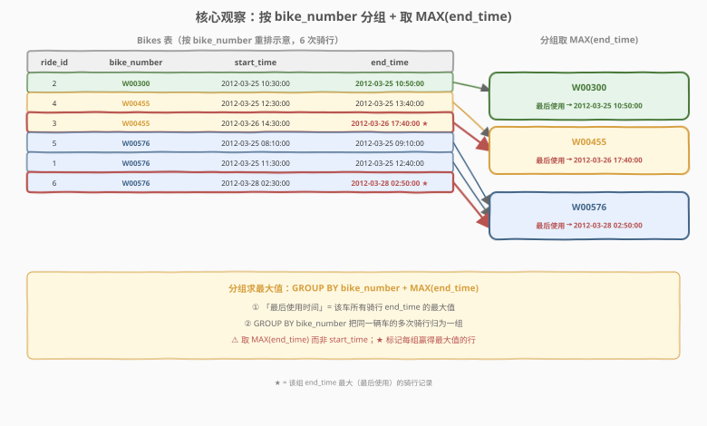
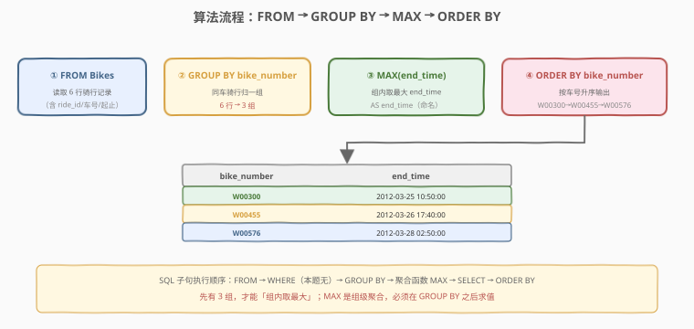
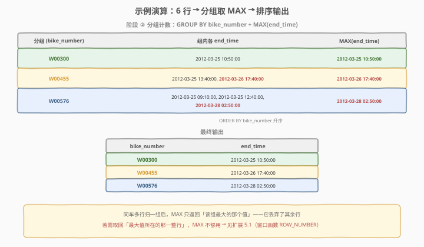

# 自行车的最后使用时间

- **题目名称**：自行车的最后使用时间
- **链接**：[2687. 自行车的最后使用时间](https://leetcode.cn/problems/bikes-last-time-used/)
- **难度**：简单
- **标签**：数据库、SQL、`GROUP BY`、`MAX()` 聚合、`ORDER BY` 排序、分组求最大值、LeetCode 锁题

## 1. 题目概述

> ⚠️ 本题为 LeetCode 付费题，题意描述根据官方示例用例与 hints 重建，可能与官方题面有出入。

给定 `Bikes` 骑行记录表，每行记录一次自行车骑行：骑行编号、车辆编号、起止时间。编写 SQL 查询，找出**每辆自行车最后一次被使用的时间**（即每辆车所有骑行的 `end_time` 最大值）。结果包含 `bike_number`（车辆编号）和 `end_time`（最后使用时间）两列，按 `bike_number` 升序排列。

**表结构**：

```text
Table: Bikes
+-------------+----------+
| Column Name | Type     |
+-------------+----------+
| ride_id     | int      |  ← 主键（骑行编号）
| bike_number | varchar  |  ← 车辆编号
| start_time  | datetime |  ← 骑行开始时间
| end_time    | datetime |  ← 骑行结束时间
+-------------+----------+
ride_id 是本表的主键（具有唯一值的列）。
每一行包含一次骑行的信息：哪辆车、何时开始、何时结束。
```

> 💡 **主键是 `ride_id`**：每行唯一代表一次骑行。同一辆车（同 `bike_number`）可被多次骑行（多行），这正是需要 `GROUP BY bike_number` 的根因——把同一辆车的多次骑行归并为一组，再取组内 `end_time` 的最大值。

**示例 1**：

```text
输入：
Bikes 表:
+---------+-------------+---------------------+---------------------+
| ride_id | bike_number | start_time          | end_time            |
+---------+-------------+---------------------+---------------------+
| 1       | W00576      | 2012-03-25 11:30:00 | 2012-03-25 12:40:00 |
| 2       | W00300      | 2012-03-25 10:30:00 | 2012-03-25 10:50:00 |
| 3       | W00455      | 2012-03-26 14:30:00 | 2012-03-26 17:40:00 |
| 4       | W00455      | 2012-03-25 12:30:00 | 2012-03-25 13:40:00 |
| 5       | W00576      | 2012-03-25 08:10:00 | 2012-03-25 09:10:00 |
| 6       | W00576      | 2012-03-28 02:30:00 | 2012-03-28 02:50:00 |
+---------+-------------+---------------------+---------------------+

输出：
+-------------+---------------------+
| bike_number | end_time            |
+-------------+---------------------+
| W00300      | 2012-03-25 10:50:00 |
| W00455      | 2012-03-26 17:40:00 |
| W00576      | 2012-03-28 02:50:00 |
+-------------+---------------------+

解释：
W00300 只有 1 次骑行（ride 2），最后使用时间为 2012-03-25 10:50:00。
W00455 有 2 次骑行（ride 3、ride 4），end_time 分别为 2012-03-26 17:40:00 与 2012-03-25 13:40:00，最大值为 2012-03-26 17:40:00。
W00576 有 3 次骑行（ride 1、ride 5、ride 6），end_time 最大值为 2012-03-28 02:50:00（ride 6）。
按 bike_number 升序输出：W00300、W00455、W00576。
```

**解释拆解**：

| bike_number | 对应 ride_id | 组内各 end_time | MAX(end_time) |
|-------------|--------------|-----------------|---------------|
| W00300 | 2 | 2012-03-25 10:50:00 | **2012-03-25 10:50:00** |
| W00455 | 4, 3 | 2012-03-25 13:40:00, 2012-03-26 17:40:00 | **2012-03-26 17:40:00** |
| W00576 | 5, 1, 6 | 2012-03-25 09:10:00, 2012-03-25 12:40:00, 2012-03-28 02:50:00 | **2012-03-28 02:50:00** |

**约束条件**：

- `ride_id` 是 `Bikes` 表的主键，每行唯一。
- `bike_number` 为字符串，标识一辆车；同一辆车可有多行。
- `start_time` / `end_time` 为 `datetime`，且 `start_time < end_time`。
- 结果按 `bike_number` 升序排列。

> 💡 **审题关键**：① 「最后使用时间」= 该车所有骑行 `end_time` 的**最大值**（不是 `start_time`，也不是最近一次骑行的开始时刻）；② 同一辆车多次骑行需**分组**后取组内最大——`GROUP BY bike_number` + `MAX(end_time)`；③ 输出列名 `end_time` 要与题意一致，并按 `bike_number` 升序。掌握这三点，本题退化为一行 `SELECT bike_number, MAX(end_time) AS end_time FROM Bikes GROUP BY bike_number ORDER BY bike_number`。

---

## 2. 解题思路

### 2.1 暴力思路：逐车遍历取最大

最直觉的过程式思维：取出所有不重复的车号，对每辆车扫描其全部骑行，逐行比较 `end_time` 记录最大值，最后按车号排序输出。

```text
bikes = DISTINCT bike_number in Bikes
for b in bikes:
    last = max(row.end_time for row in Bikes if row.bike_number == b)
    output (b, last)
sort output by bike_number
```

逻辑完全正确——但这是「应用层逐车循环」的思路。SQL 是声明式的：用 `GROUP BY bike_number` 一次性把同一辆车的行归并为一组，再用 `MAX(end_time)` 在组内求最大，分组 + 求最大 + 排序三步合一，无需显式循环。

> ⚠️ **过程式思维的陷阱**：有人会想「按 `end_time DESC` 排序后取每车第一条」——可行但绕路（需窗口函数 `ROW_NUMBER` 或子查询去重），且只取时间值时多此一举。本题只要「最大的那个值」，`MAX` 一步到位；只有当需要**回取最大值所在的整行**（含 `ride_id`、`start_time`）时，才轮到排序/窗口方案（见扩展 5.1）。

### 2.2 核心观察：分组 + 取最大



题目的两个语义——「**按车分组**」和「**组内取最大 end_time**」——分别对应 SQL 的两个机制，叠加即得答案：

| 题意要求 | SQL 机制 | 语义 |
|----------|----------|------|
| 「每辆车」 | `GROUP BY bike_number` | **分组**：把同一 `bike_number` 的多次骑行归并为一组 |
| 「最后使用时间」 | `MAX(end_time)` | **组内求最大**：取每组 `end_time` 的最大值（最后归还时刻） |
| 「按车号升序」 | `ORDER BY bike_number` | **排序**：输出按 `bike_number` 升序 |

三步一气呵成：`GROUP BY bike_number` 把 6 行归为 3 组，`MAX(end_time)` 在每组内取最大得 `{10:50, 17:40, 02:50}`，`ORDER BY bike_number` 排序为 `W00300 → W00455 → W00576`。

$$\text{last\_used}(b) = \max\bigl\{\, \text{row}.\text{end\_time} \;\big|\; \text{row}.\text{bike\_number} = b \,\bigr\}$$

> 💡 **为什么取 `MAX(end_time)` 而非 `start_time`？** 「最后使用时间」指的是这辆车**最后一次被骑完后归还的时刻**。一次骑行从 `start_time` 到 `end_time`，车被「使用中」的终点是 `end_time`。故「最后使用」= 该车所有骑行 `end_time` 的最大值。若误取 `start_time`，会把「最后那次骑行的出发时刻」当成答案，语义偏差（车出发后还被骑了一段时间才归还）。**口诀**：问「最后使用/归还」看 `end_time`，问「最后出发」看 `start_time`。

> 💡 **为什么不需要 `DISTINCT` 或窗口函数？** 本题只要「最大值」这一个标量，`MAX` 聚合直接产出，天然无需去重。`GROUP BY bike_number` 已保证每组输出一行，`MAX` 在组内对所有行取最大，不存在重复计数问题。只有当题目改为「取出最后使用的那一整行（含 `ride_id`、`start_time`）」时，`MAX` 才不够——它只给值不给行，那时需用窗口函数 `ROW_NUMBER()` 或自连接回原表（见扩展 5.1）。

### 2.3 算法流程图



**逻辑执行步骤**：

| 步骤 | 子句 | 作用 |
|------|------|------|
| ① | `FROM Bikes` | 读取全部骑行行（6 行） |
| ② | `GROUP BY bike_number` | 按车号归组（3 组：W00300、W00455、W00576） |
| ③ | `MAX(end_time) AS end_time` | 每组取 `end_time` 最大值，命名输出列 |
| ④ | `ORDER BY bike_number` | 按车号升序输出 |

> 💡 **SQL 子句执行顺序**：`FROM` → `WHERE`（本题无）→ `GROUP BY`（分组）→ 聚合函数 `MAX`（组内求值）→ `SELECT`（选列 + 命名）→ `ORDER BY`（排序）。理解「`GROUP BY` 先归组，`MAX` 在组内求最大，`ORDER BY` 最后排序」的顺序是关键：先有 3 组，才谈得上每组取最大，最后排序输出。

### 2.4 示例演算

以示例 1 的 6 行骑行记录为例，观察分组取最大的全过程：



**阶段 ①：输入（`FROM Bikes`）**

6 行骑行记录，每行的 `bike_number` 列决定其归属分组：

| 行 | ride_id | bike_number | end_time | 归属组 |
|----|---------|-------------|----------|--------|
| 1 | 1 | W00576 | 2012-03-25 12:40:00 | W00576 |
| 2 | 2 | W00300 | 2012-03-25 10:50:00 | W00300 |
| 3 | 3 | W00455 | 2012-03-26 17:40:00 | W00455 |
| 4 | 4 | W00455 | 2012-03-25 13:40:00 | W00455 |
| 5 | 5 | W00576 | 2012-03-25 09:10:00 | W00576 |
| 6 | 6 | W00576 | 2012-03-28 02:50:00 | W00576 |

**阶段 ②：分组取最大（`GROUP BY bike_number` + `MAX(end_time)`）**

`GROUP BY bike_number` 把 6 行按车号归并，同一车号的行进同一组，组内对 `end_time` 求最大：

| 分组 | 组内行 | 组内 end_time 值 | MAX(end_time) |
|------|--------|------------------|---------------|
| W00300 | 行 2 | 2012-03-25 10:50:00 | **2012-03-25 10:50:00** |
| W00455 | 行 3, 行 4 | 2012-03-26 17:40:00, 2012-03-25 13:40:00 | **2012-03-26 17:40:00** |
| W00576 | 行 1, 行 5, 行 6 | 2012-03-25 12:40:00, 2012-03-25 09:10:00, 2012-03-28 02:50:00 | **2012-03-28 02:50:00** |

此时结果（未排序）：`[(W00300, 10:50), (W00455, 17:40), (W00576, 02:50)]`。

> 💡 **分组的本质**：`GROUP BY bike_number` 等价于「按 `bike_number` 列的值做哈希分桶」——相同车号的行落入同一桶。桶数 = 不同车号个数（本题 3 个）。`MAX(end_time)` 在每个桶内取最大值。理解这点，所有「分组 + 聚合」题都能套用此骨架。

**阶段 ③：排序输出（`ORDER BY bike_number`）**

对 3 组结果按 `bike_number` 升序排列：

| 排序前 | bike_number | 排序后 |
|--------|-------------|--------|
| (W00300, 10:50) | "W00300" | ①（W003… 字母序最小） |
| (W00455, 17:40) | "W00455" | ② |
| (W00576, 02:50) | "W00576" | ③ |

最终输出：`[(W00300, 2012-03-25 10:50:00), (W00455, 2012-03-26 17:40:00), (W00576, 2012-03-28 02:50:00)]`。

> ⚠️ **字符串排序按字典序**：`bike_number` 是字符串，`ORDER BY bike_number` 按字典序（逐字符比较）升序。`W00300 < W00455 < W00576`（第 4 位 `3 < 4 < 5`）。若车号格式不统一（如 `W300` 与 `W00300` 混排），字典序与数值序可能不同，本题示例车号格式统一，无此问题。

---

## 3. 参考代码

### SQL（解法 A：`GROUP BY` + `MAX`，推荐）

```sql
SELECT bike_number, MAX(end_time) AS end_time
FROM Bikes
GROUP BY bike_number
ORDER BY bike_number;
```

> 💡 **写法要点**：
> - `GROUP BY bike_number`：按车号分组，同一辆车的多次骑行归为一组。
> - `MAX(end_time)`：取每组 `end_time` 的最大值（最后归还时刻）。组内已由 `GROUP BY` 归并，无需 `DISTINCT`。
> - `AS end_time`：列别名与题目要求的输出列名一致（输出列叫 `end_time`，而非 `last_time_used`）。
> - `ORDER BY bike_number`：按车号升序输出，匹配示例顺序。
> - ✓ **最自然**：`GROUP BY` 表达「每辆车」，`MAX` 表达「最后使用时间」，`ORDER BY` 表达「排序」，语义一气呵成。

### SQL（解法 B：子查询 + 外层排序，思路对照）

```sql
SELECT bike_number, end_time
FROM (
    SELECT bike_number, MAX(end_time) AS end_time
    FROM Bikes
    GROUP BY bike_number
) t
ORDER BY bike_number;
```

> 💡 **解法 B 的思路**：子查询先 `GROUP BY bike_number` + `MAX(end_time)` 得到每车的最后使用时间，外层再 `ORDER BY` 排序。逻辑与解法 A 完全等价，只是把「求最大」和「排序」拆到内外两层。MySQL 允许在 `SELECT` 层用列别名做 `ORDER BY`（解法 A），故解法 A 更紧凑；解法 B 展示「子查询产出中间表 + 外层消费」的通用骨架，适合需在外层做更多处理时（如 `WHERE end_time > '2012-03-26'` 筛选）。

### SQL（解法 C：相关子查询，不分组取最大）

```sql
SELECT DISTINCT b1.bike_number,
       (SELECT MAX(end_time) FROM Bikes b2
        WHERE b2.bike_number = b1.bike_number) AS end_time
FROM Bikes b1
ORDER BY bike_number;
```

> 💡 **解法 C 的思路**：不用 `GROUP BY`，对原表每行用**相关子查询**算出「该车号的 `MAX(end_time)`」，再用 `DISTINCT` 去重（同一车号多行算出相同值）。语义等价，但通常**更慢**：每行都触发一次子查询，无索引时近 $O(n^2)$；而 `GROUP BY` 单趟哈希聚合 $O(n)$。适合作为「不依赖 `GROUP BY` 的等价写法」对照理解，生产中优先解法 A。

### Python（pandas）

```python
import pandas as pd

def bikes_last_time_used(bikes: pd.DataFrame) -> pd.DataFrame:
    result = (bikes.groupby('bike_number', as_index=False)['end_time']
              .max()
              .sort_values('bike_number'))
    return result[['bike_number', 'end_time']]
```

> 💡 **pandas 对照**：
> - `bikes.groupby('bike_number', as_index=False)['end_time']` 对应 SQL 的 `GROUP BY bike_number`，按车号分组并选中 `end_time` 列；`as_index=False` 让分组键保留为普通列（而非索引），便于后续选列。
> - `.max()` 对应 `MAX(end_time)`，返回每组的最大 `end_time`。
> - `.sort_values('bike_number')` 对应 `ORDER BY bike_number`，按车号升序。
> - `return result[['bike_number', 'end_time']]` 保证列顺序与输出契约一致。

---

## 4. 复杂度分析

| 维度 | 解法 A（`GROUP BY`+`MAX`） | 解法 B（子查询） | 解法 C（相关子查询） | pandas |
|------|---------------------------|-----------------|----------------------|--------|
| **时间** | $O(n)$ | $O(n)$ | $O(n^2)$（无索引） | $O(n)$ |
| **空间** | $O(k)$ | $O(k)$ | $O(k)$ | $O(n)$ |
| **写法** | 紧凑一步到位 | 内外两层 | 不分组等价 | DataFrame |
| **推荐度** | ✓ **首选** | ✓ 骨架可扩展 | ✗ 低效对照 | ✓ 验证用 |

> - $n$ = `Bikes` 表行数，$k$ = 不同车号数（$k \le n$）。
> - **解法 A 时间**：全表扫描一次 $O(n)$ + 分组聚合 $O(k)$ + 排序 $O(k \log k)$。因 $k \le n$，总体 $O(n)$。若 `bike_number` 列有索引，`GROUP BY` 可走索引有序扫描，避免哈希聚合的全表扫描。
> - **空间**：分组需物化 $k$ 组的聚合结果 $O(k)$；pandas 需 $O(n)$ 存 DataFrame。
> - **解法 C**：相关子查询对原表每行触发一次「同车号取 `MAX`」子查询，无索引时每行 $O(n)$ 扫描，共 $n$ 行 → $O(n^2)$。有 `(bike_number, end_time)` 索引时降至 $O(n \log n)$，但仍劣于解法 A 的单趟聚合。
> - **索引优化**：在 `bike_number` 列建索引可加速分组（索引有序，扫描即分组）；若查询频繁且只取车号 + 最大时间，可建 `(bike_number, end_time)` 复合索引实现 index-only scan（覆盖索引），分组与求最大都可在索引上完成，避免回表。

---

## 5. 扩展：从「取最大值」到「取最大值所在的整行」

### 5.1 本题只取值 vs 取整行

本题只要「最后使用时间」这一个标量，`MAX(end_time)` 直接产出。但若题目改为「**输出每辆车最后一次骑行的完整记录**（含 `ride_id`、`start_time`、`end_time`）」，`MAX` 就不够用了——它只返回最大值，**丢弃了该值所在行的其余列**。

| 需求 | 方法 | 输出 |
|------|------|------|
| 只取最大值（本题） | `GROUP BY` + `MAX(end_time)` | 车号 + 最大时间（2 列） |
| 取最大值所在的整行 | 窗口函数 `ROW_NUMBER` / 子查询 `JOIN` | 车号 + `ride_id` + `start_time` + `end_time`（全列） |

**取整行的窗口函数写法**（本题扩展）：

```sql
SELECT ride_id, bike_number, start_time, end_time
FROM (
    SELECT *,
           ROW_NUMBER() OVER (PARTITION BY bike_number ORDER BY end_time DESC) AS rn
    FROM Bikes
) t
WHERE rn = 1
ORDER BY bike_number;
```

> 💡 **`ROW_NUMBER()` 的作用**：`PARTITION BY bike_number` 按车号分区，`ORDER BY end_time DESC` 把每区按 `end_time` 降序编号，最大值的行拿到 `rn = 1`。外层 `WHERE rn = 1` 只保留每车最大值所在行，从而**取回整行**（含 `ride_id`、`start_time`）。这是 SQL 中「分组取最值所在行」的标准范式。

> ⚠️ **并列（同车同一最大 `end_time` 出现多次）的差异**：`ROW_NUMBER` 在并列时**只留一行**（不确定留哪行）；若需保留所有并列行，改用 `RANK()`（并列都给 `rn = 1`，`WHERE rn = 1` 全留）。本题扩展若声明「同时间取任一行」，`ROW_NUMBER` 即可；若声明「同时间全留」，用 `RANK`。对照 1112（每位学生的最高成绩）、1194（锦标赛优胜者）正是「分组取最值 + 并列 tie-break」的代表题。

### 5.2 子查询 + JOIN 取整行（无窗口函数版）

MySQL 5.7 及以下不支持窗口函数，可用「先求每车最大值，再 JOIN 回原表定位行」：

```sql
SELECT b.ride_id, b.bike_number, b.start_time, b.end_time
FROM Bikes b
JOIN (
    SELECT bike_number, MAX(end_time) AS end_time
    FROM Bikes
    GROUP BY bike_number
) m ON b.bike_number = m.bike_number AND b.end_time = m.end_time
ORDER BY b.bike_number;
```

> 💡 **思路**：子查询 `m` 算出每车的 `(bike_number, MAX(end_time))`，再 `JOIN` 回原表 `Bikes`，用 `(bike_number, end_time)` 双键匹配到最大值所在的行。⚠️ 若同车有多个行 `end_time` 等于最大值（并列），`JOIN` 会**返回所有并列行**（行为类似 `RANK` 全留）。这是「分组取最值所在行」最兼容老版本数据库的写法。

### 5.3 聚合函数家族：`MAX` 的同伴

`MAX` 与 `MIN`/`SUM`/`AVG`/`COUNT` 同为 SQL 聚合函数，都在 `GROUP BY` 后于组内求一个标量：

| 聚合函数 | 语义 | 本题若改为 |
|----------|------|-----------|
| `MAX(end_time)` | 组内最大 | 「最后使用时间」（本题） |
| `MIN(start_time)` | 组内最小 | 「最早一次出发时间」 |
| `COUNT(*)` | 组内行数 | 「每车共被骑了几次」 |
| `SUM(TIMESTAMPDIFF(...))` | 组内求和 | 「每车累计骑行时长」 |

> 💡 **统一骨架**：`SELECT 分组键, 聚合函数(目标列) FROM 表 GROUP BY 分组键 ORDER BY 分组键`。换聚合函数即换业务语义，骨架不变。本题是此骨架的最简实例（`MAX`），2314/1112/1194 是其「取整行」进阶，596 是叠加 `HAVING` 的「组级过滤」变体。

---

## 6. 面试要点

1. **为什么用 `MAX(end_time)` 而非 `MAX(start_time)`？**

   > 「最后使用时间」指这辆车最后一次被骑完**归还的时刻**。一次骑行从 `start_time` 到 `end_time`，车处于「使用中」的终点是 `end_time`。故「最后使用」= 该车所有骑行 `end_time` 的最大值。取 `start_time` 会把「最后那次骑行的出发时刻」当答案，语义偏差。**口诀**：问归还/使用结束看 `end_time`，问出发看 `start_time`。

2. **`GROUP BY bike_number` 后为什么不需要 `DISTINCT`？**

   > `GROUP BY` 已保证每组输出一行——同一车号的多行被归并为一组，`MAX` 在组内对所有行求最大后输出一个值，天然不重复。`DISTINCT` 用于「去重列出」，`GROUP BY` 用于「分组聚合」，本题是后者，加 `DISTINCT` 是多余的。若只想要「所有不同车号名单」（不要最大值），才用 `SELECT DISTINCT bike_number`。

3. **如果 `Bikes` 表很大（数亿行），如何优化？**

   > 在 `bike_number` 列建索引，使 `GROUP BY bike_number` 走索引有序扫描——索引天然按车号有序，扫描即可分组，避免全表扫描 + 哈希聚合。进一步建 `(bike_number, end_time)` 复合索引实现 index-only scan（覆盖索引）——分组与 `MAX(end_time)` 都能在索引上完成（每区索引项的最大值即组最大），无需回表读数据行。面试中提到「`bike_number` 建索引把分组从 $O(n)$ 哈希聚合优化为索引有序扫描，复合索引可覆盖索引免回表」即可。

4. **`ORDER BY bike_number` 能否省略？**

   > 不能依赖 `GROUP BY` 的隐含排序。SQL 标准**不保证** `GROUP BY` 输出的顺序（虽然某些数据库实现会顺带按分组键排序，如 MySQL 旧版本）。题目要求按 `bike_number` 升序输出，必须显式 `ORDER BY bike_number` 收尾。涉及「按某列排序输出」的 SQL 题，`ORDER BY` 是必须显式写出的步骤，省略可能导致乱序被判错。

5. **若要取出每车最后骑行的整行（含 `ride_id`），`MAX` 为什么不够？**

   > `MAX(end_time)` 只返回最大**值**，丢弃了该值所在行的其余列（`ride_id`、`start_time`）。要取整行需用窗口函数 `ROW_NUMBER() OVER (PARTITION BY bike_number ORDER BY end_time DESC)` 取 `rn = 1`，或子查询算出 `(bike_number, MAX(end_time))` 再 `JOIN` 回原表定位行。本题只要时间标量，`MAX` 足矣；进阶取整行是「分组取最值所在行」的标准范式（见 2314/1112/1194）。**口诀**：取值用 `MAX`，取行用 `ROW_NUMBER`。

> 💡 **一句话总结**：2687 是 SQL **"分组求最大值入门招牌题"**——核心就一句 `SELECT bike_number, MAX(end_time) AS end_time FROM Bikes GROUP BY bike_number ORDER BY bike_number`。考点覆盖三要素：**分组（`GROUP BY bike_number`，同车归组）、组内取最大（`MAX(end_time)`，最后归还时刻）、排序（`ORDER BY bike_number`，车号升序）**。理解「最后使用看 `end_time` 而非 `start_time`」「只取值用 `MAX`、取整行用 `ROW_NUMBER`」这两点，所有「分组 + 聚合 + 排序」类 SQL 题都能覆盖。

---

## 7. 同类练习题

- [2314. 每个城市最高气温的第一天](https://leetcode.cn/problems/the-first-day-of-the-maximum-recorded-degree-in-each-city/)（[题解](../2301-2400/2314_每个城市最高气温的第一天.md)）：分组取最值**所在整行**——在 2687 的 `GROUP BY` + `MAX` 骨架上升级为「取最大值对应的那一天」，需窗口函数 `ROW_NUMBER` 或子查询 `JOIN` 回原表，是 2687「取值」到「取行」的直接进阶
- [1112. 每位学生的最高成绩](https://leetcode.cn/problems/highest-grade-for-each-student/)（[题解](../1101-1200/1112_每位学生的最高成绩.md)）：分组取最值 + 并列 tie-break——每位学生最高分所在课程，并列时取 `course_id` 最小，在 2687 骨架上叠加「最大值所在行 + 次级排序键」，辨析 `ROW_NUMBER` 与 `RANK` 在并列时的行为差异
- [1194. 锦标赛优胜者](https://leetcode.cn/problems/tournament-winners/)（[题解](../1101-1200/1194_锦标赛优胜者.md)）：分组聚合 + 跨表 `JOIN` + tie-break——先 `GROUP BY` 求每队总分别再取最大组，在 2687 的分组聚合之上叠加多表关联与并列处理，综合度更高
- [619. 只出现一次的最大数字](https://leetcode.cn/problems/biggest-single-number/)：`MAX` + `NULL` 处理——只出现一次的数字中取最大，`MAX` 在空集返回 `NULL` 需 `IFNULL` 兜底，对照 2687 理解 `MAX` 对空组的行为与 `GROUP BY` 分组求最大的区别
- [596. 超过 5 名学生的课](https://leetcode.cn/problems/classes-with-at-least-5-students/)（[题解](../0501-0600/596_超过5名学生的课.md)）：`GROUP BY` + `HAVING COUNT(*) >= 5` 组级过滤——在 2687 的分组计数骨架上叠加 `HAVING`，从「输出所有组」到「只留满足条件的组」，辨析行级 `WHERE` 与组级 `HAVING` 的分工
