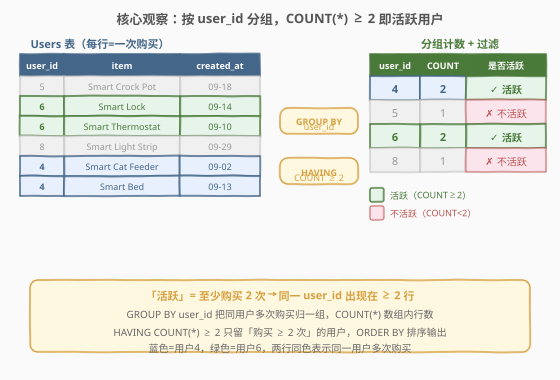
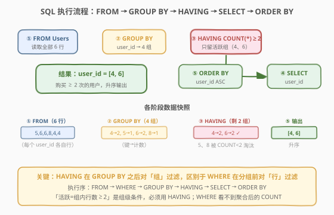

# 查找活跃用户

- **题目名称**：查找活跃用户
- **链接**：[2688. 查找活跃用户](https://leetcode.cn/problems/find-active-users/)
- **难度**：中等
- **标签**：数据库、SQL、`GROUP BY`、`HAVING` 组级过滤、`COUNT()` 聚合、`ORDER BY` 排序、LeetCode 锁题

## 1. 题目概述

> ⚠️ 本题为 LeetCode 付费题，题意描述根据官方示例用例与 hints 重建，可能与官方题面有出入。

给定 `Users` 购买记录表，每行记录一次用户购买行为：用户编号、商品名称、购买时间、金额。编写 SQL 查询，找出**活跃用户**——即**至少购买过 2 次**（同一 `user_id` 在表中出现 ≥ 2 行）的用户。结果只包含 `user_id` 一列，按 `user_id` 升序排列。

**表结构**：

```text
Table: Users
+-------------+---------+
| Column Name | Type    |
+-------------+---------+
| user_id     | int     |  ← 用户编号
| item        | varchar |  ← 商品名称
| created_at  | date    |  ← 购买时间
| amount      | int     |  ← 购买金额
+-------------+---------+
（此表无显式主键；同一 user_id 可出现多行，每行代表一次购买）
```

> 💡 **"活跃"的定义**：本题「活跃用户」= 在 `Users` 表中出现 **≥ 2 行**（即购买过至少 2 次）的用户。这与产品分析中常见的「重复购买者」「复购用户」语义一致——只买过一次的用户不算活跃。判定依据是**同一 `user_id` 的行数**，因此需 `GROUP BY user_id` 归并同一用户的多次购买，再 `COUNT(*)` 数组内行数，最后用 `HAVING COUNT(*) >= 2` 只留满足条件的组。

**示例 1**：

```text
输入：
Users 表:
+---------+-------------------+------------+--------+
| user_id | item              | created_at | amount |
+---------+-------------------+------------+--------+
| 5       | Smart Crock Pot   | 2021-09-18 | 698882 |
| 6       | Smart Lock        | 2021-09-14 | 11487  |
| 6       | Smart Thermostat  | 2021-09-10 | 674762 |
| 8       | Smart Light Strip | 2021-09-29 | 630773 |
| 4       | Smart Cat Feeder  | 2021-09-02 | 693545 |
| 4       | Smart Bed         | 2021-09-13 | 170249 |
+---------+-------------------+------------+--------+

输出：
+---------+
| user_id |
+---------+
| 4       |
| 6       |
+---------+

解释：
user 4 有 2 次购买（Smart Cat Feeder 09-02、Smart Bed 09-13）→ 活跃 ✓
user 5 有 1 次购买（Smart Crock Pot 09-18）→ 不活跃 ✗
user 6 有 2 次购买（Smart Lock 09-14、Smart Thermostat 09-10）→ 活跃 ✓
user 8 有 1 次购买（Smart Light Strip 09-29）→ 不活跃 ✗
按 user_id 升序输出活跃用户：4、6。
```

**解释拆解**：

| user_id | 购买次数 | 组内行数 | COUNT(*) ≥ 2？ | 活跃？ |
|---------|----------|----------|----------------|--------|
| 4 | 2 | 2 | ✓ | **是** |
| 5 | 1 | 1 | ✗ | 否 |
| 6 | 2 | 2 | ✓ | **是** |
| 8 | 1 | 1 | ✗ | 否 |

**约束条件**：

- `Users` 表无显式主键；`user_id` 为用户标识，同一用户可出现多行。
- `item` 为商品名称（字符串），`created_at` 为购买日期，`amount` 为购买金额（整数）。
- 结果只含 `user_id` 一列，按 `user_id` 升序排列。

> 💡 **审题关键**：① 「活跃」= 同一 `user_id` 在表中出现 ≥ 2 行（复购用户），不是金额门槛、也不是天数门槛——纯看**行数**；② 需先 `GROUP BY user_id` 归并同一用户的多次购买，再 `COUNT(*)` 数组内行数；③ 「≥ 2」是**组级条件**（对聚合后的计数判断），必须用 `HAVING` 而非 `WHERE`——`WHERE` 在分组前作用于单行，看不到 `COUNT`。掌握这三点，本题退化为一行 `SELECT user_id FROM Users GROUP BY user_id HAVING COUNT(*) >= 2 ORDER BY user_id`。

---

## 2. 解题思路

### 2.1 暴力思路：逐用户扫描计数

最直觉的过程式思维：取出所有不重复的用户编号，对每个用户扫描全部购买行，数一数有几行，行数 ≥ 2 就加入结果，最后排序输出。

```text
users = DISTINCT user_id in Users
for u in users:
    cnt = count(row for row in Users if row.user_id == u)
    if cnt >= 2:
        output u
sort output by user_id
```

逻辑完全正确——但这是「应用层逐用户循环」的思路。SQL 是声明式的：用 `GROUP BY user_id` 一次性把同一用户的购买行归并为一组，再用 `COUNT(*)` 数组内行数，最后用 `HAVING` 过滤组，分组 + 计数 + 过滤 + 排序四步合一，无需显式循环。

> ⚠️ **常见错误：用 `WHERE COUNT(*) >= 2`**：有人会把过滤条件写成 `WHERE COUNT(*) >= 2`——这是**语法错误**。`WHERE` 在 `GROUP BY` **之前**执行，作用于单行，此时还没有「组」、也没有 `COUNT` 值，无法对聚合结果过滤。对聚合结果过滤必须用 `HAVING`，它专门在 `GROUP BY` 之后对「组」施加条件。`WHERE` 管行、`HAVING` 管组，这是 SQL 的硬性分工（详见 2.3）。

### 2.2 核心观察：分组 + 计数 + 组级过滤



题目的三个语义——「**按用户分组**」「**组内数行数**」「**只留 ≥ 2 的组**」——分别对应 SQL 的三个机制，叠加即得答案：

| 题意要求 | SQL 机制 | 语义 |
|----------|----------|------|
| 「每个用户」 | `GROUP BY user_id` | **分组**：把同一 `user_id` 的多次购买归并为一组 |
| 「购买几次」 | `COUNT(*)` | **组内计数**：数每组内的行数（购买次数） |
| 「至少 2 次」 | `HAVING COUNT(*) >= 2` | **组级过滤**：只保留组内行数 ≥ 2 的组（活跃用户） |
| 「升序输出」 | `ORDER BY user_id` | **排序**：输出按 `user_id` 升序 |

四步一气呵成：`GROUP BY user_id` 把 6 行归为 4 组，`COUNT(*)` 数得 `{4:2, 5:1, 6:2, 8:1}`，`HAVING COUNT(*) >= 2` 只留用户 4 和 6，`ORDER BY user_id` 排序为 `4 → 6`。

$$\text{active}(u) \iff \bigl|\bigl\{\,\text{row} \in \text{Users} \;\big|\; \text{row}.\text{user\_id} = u \,\bigr\}\bigr| \geq 2$$

> 💡 **为什么用 `COUNT(*)` 而非 `COUNT(user_id)`？** `COUNT(*)` 数**所有行**（含 NULL 行），`COUNT(列)` 数该列**非 NULL** 的行数。本题以 `user_id` 为分组键，同组内 `user_id` 必非 NULL（否则进不了这组），故 `COUNT(*)` 与 `COUNT(user_id)` 数值相同。习惯上「数行数」用 `COUNT(*)`，语义更直白：星号代表「整行」，不挑列。只有当某列可能为 NULL、且你想排除 NULL 时，才用 `COUNT(该列)`。

> 💡 **为什么是 `>= 2` 而非 `> 2`？** 「至少购买 2 次」= 行数 ≥ 2，即 `COUNT(*) >= 2`，等价于 `COUNT(*) > 1`。两者完全等价，写哪个都行。注意别写成 `> 2`（那是「至少 3 次」）或 `>= 1`（那是「至少 1 次」= 全部用户，失去过滤意义）。**口诀**：「至少 N 次」写 `COUNT(*) >= N`。

### 2.3 算法流程图



**逻辑执行步骤**：

| 步骤 | 子句 | 作用 |
|------|------|------|
| ① | `FROM Users` | 读取全部购买行（6 行） |
| ② | `GROUP BY user_id` | 按用户归组（4 组：4、5、6、8） |
| ③ | `HAVING COUNT(*) >= 2` | 只留组内行数 ≥ 2 的组（用户 4、6） |
| ④ | `SELECT user_id` | 选出分组键作为输出列 |
| ⑤ | `ORDER BY user_id` | 按用户编号升序输出 |

> 💡 **SQL 子句执行顺序**：`FROM` → `WHERE`（本题无）→ `GROUP BY`（分组）→ 聚合函数 `COUNT`（组内计数）→ `HAVING`（组级过滤）→ `SELECT`（选列）→ `ORDER BY`（排序）。理解「`GROUP BY` 先归组，`COUNT` 在组内数行，`HAVING` 再过滤组，`SELECT` 最后选列」的顺序是关键：先有 4 组，才数得出计数，才谈得上过滤，最后选列排序。`WHERE` 若有则插在 `FROM` 和 `GROUP BY` 之间，对**原始行**过滤。

> ⚠️ **`WHERE` vs `HAVING` 的分工**：这是本题最核心的考点。
> - `WHERE`：在 `GROUP BY` **之前**执行，作用于**单行**，用普通列条件过滤（如 `WHERE amount > 100`），**不能**用聚合函数。
> - `HAVING`：在 `GROUP BY` **之后**执行，作用于**组**，用聚合结果条件过滤（如 `HAVING COUNT(*) >= 2`）。
> - **口诀**：行级过滤用 `WHERE`，组级过滤用 `HAVING`。本题「活跃=组内行数≥2」是组级条件，必须 `HAVING`；若误写 `WHERE COUNT(*) >= 2` 会报语法错误。

### 2.4 示例演算

以示例 1 的 6 行购买记录为例，观察分组计数过滤的全过程：

![示例演算：6 行 → 分组计数 → 过滤 → 输出 [4, 6]](../images/p2688_example_walkthrough.svg)

**阶段 ①：输入（`FROM Users`）**

6 行购买记录，每行的 `user_id` 列决定其归属分组：

| 行 | user_id | item | created_at | 归属组 |
|----|---------|------|------------|--------|
| 1 | 5 | Smart Crock Pot | 2021-09-18 | user 5 |
| 2 | 6 | Smart Lock | 2021-09-14 | user 6 |
| 3 | 6 | Smart Thermostat | 2021-09-10 | user 6 |
| 4 | 8 | Smart Light Strip | 2021-09-29 | user 8 |
| 5 | 4 | Smart Cat Feeder | 2021-09-02 | user 4 |
| 6 | 4 | Smart Bed | 2021-09-13 | user 4 |

**阶段 ②：分组计数（`GROUP BY user_id` + `COUNT(*)`）**

`GROUP BY user_id` 把 6 行按用户归并，同一用户的行进同一组，组内用 `COUNT(*)` 数行数：

| 分组 | 组内行 | COUNT(*) | ≥ 2？ |
|------|--------|----------|-------|
| user 4 | 行 5、行 6 | **2** | ✓ 留 |
| user 5 | 行 1 | **1** | ✗ 淘汰 |
| user 6 | 行 2、行 3 | **2** | ✓ 留 |
| user 8 | 行 4 | **1** | ✗ 淘汰 |

此时过滤后（未排序）：`[user 4, user 6]`。

> 💡 **分组的本质**：`GROUP BY user_id` 等价于「按 `user_id` 列的值做哈希分桶」——相同用户的购买行落入同一桶。桶数 = 不同用户数（本题 4 个）。`COUNT(*)` 在每个桶内数行数。理解这点，所有「分组 + 聚合 + 过滤」题都能套用此骨架。

**阶段 ③：排序输出（`ORDER BY user_id`）**

对保留的 2 组结果按 `user_id` 升序排列：

| 排序前 | user_id | 排序后 |
|--------|---------|--------|
| (user 4) | 4 | ① |
| (user 6) | 6 | ② |

最终输出：`[4, 6]`。

---

## 3. 参考代码

### SQL（解法 A：`GROUP BY` + `HAVING`，推荐）

```sql
SELECT user_id
FROM Users
GROUP BY user_id
HAVING COUNT(*) >= 2
ORDER BY user_id;
```

> 💡 **写法要点**：
> - `GROUP BY user_id`：按用户分组，同一用户的多次购买归为一组。
> - `COUNT(*)`：数每组内的行数（购买次数）。`*` 数所有行，不挑列。
> - `HAVING COUNT(*) >= 2`：组级过滤，只留购买 ≥ 2 次的用户。⚠️ 必须用 `HAVING`，`WHERE` 看不到聚合后的 `COUNT`。
> - `ORDER BY user_id`：按用户编号升序输出，匹配示例顺序。
> - ✓ **最自然**：`GROUP BY` 表达「每用户」，`COUNT(*)` 表达「买了几次」，`HAVING` 表达「至少 2 次」，`ORDER BY` 表达「排序」，语义一气呵成。

### SQL（解法 B：子查询先计数再过滤，思路对照）

```sql
SELECT user_id
FROM (
    SELECT user_id, COUNT(*) AS cnt
    FROM Users
    GROUP BY user_id
) t
WHERE cnt >= 2
ORDER BY user_id;
```

> 💡 **解法 B 的思路**：子查询先 `GROUP BY user_id` + `COUNT(*)` 得到每用户的购买次数 `cnt`，外层用 `WHERE cnt >= 2` 过滤（此时 `cnt` 已是子查询的普通列，不再是聚合函数，故可用 `WHERE`）。逻辑与解法 A 完全等价，只是把「计数」和「过滤」拆到内外两层。解法 B 展示「子查询产出中间表 + 外层消费」的通用骨架，适合需在外层做更多处理时（如同时输出购买次数 `cnt`、或加 `WHERE cnt BETWEEN 2 AND 5` 范围筛选）。

### SQL（解法 C：自连接，不分组计数）

```sql
SELECT DISTINCT u1.user_id
FROM Users u1
JOIN Users u2
  ON u1.user_id = u2.user_id AND u1.rowid != u2.rowid
ORDER BY u1.user_id;
```

> 💡 **解法 C 的思路**：不用 `GROUP BY` + `COUNT`，而是让 `Users` 表**自连接**——同一 `user_id` 的行两两配对，用 `u1.rowid != u2.rowid` 排除「自己配自己」。若某用户有 ≥ 2 行，自连接会产生配对行（行5↔行6 等），`DISTINCT` 去重后即得活跃用户。语义等价，但通常**更慢**：自连接产生 $O(n^2)$ 级配对行数，再去重；而 `GROUP BY` 单趟哈希聚合 $O(n)$。适合作为「不依赖 `GROUP BY` 的等价写法」对照理解，生产中优先解法 A。
>
> ⚠️ `rowid` 是 SQLite/MySQL 的隐式行标识（行的物理地址），用于排除「同一行配自己」。不同数据库行标识列名不同（MySQL 也可用主键，本题无显式主键故用 `rowid`）。在 LeetCode 判题环境（MySQL）中 `rowid` 可用。

### Python（pandas）

```python
import pandas as pd

def find_active_users(users: pd.DataFrame) -> pd.DataFrame:
    cnt = users.groupby('user_id', as_index=False).size()
    active = cnt[cnt['size'] >= 2][['user_id']].sort_values('user_id')
    return active
```

> 💡 **pandas 对照**：
> - `users.groupby('user_id', as_index=False).size()` 对应 SQL 的 `GROUP BY user_id` + `COUNT(*)`，`size()` 返回每组行数（列名 `size`）；`as_index=False` 让分组键保留为普通列。
> - `cnt[cnt['size'] >= 2]` 对应 `HAVING COUNT(*) >= 2`，在 pandas 中用布尔索引过滤（等价于组级 `HAVING`）。
> - `[['user_id']]` 对应 `SELECT user_id`，只保留输出列。
> - `.sort_values('user_id')` 对应 `ORDER BY user_id`，按用户编号升序。

---

## 4. 复杂度分析

| 维度 | 解法 A（`GROUP BY`+`HAVING`） | 解法 B（子查询） | 解法 C（自连接） | pandas |
|------|------------------------------|-----------------|------------------|--------|
| **时间** | $O(n)$ | $O(n)$ | $O(n^2)$ | $O(n)$ |
| **空间** | $O(k)$ | $O(k)$ | $O(n^2)$（配对行） | $O(n)$ |
| **写法** | 紧凑一步到位 | 内外两层 | 不分组等价 | DataFrame |
| **推荐度** | ✓ **首选** | ✓ 骨架可扩展 | ✗ 低效对照 | ✓ 验证用 |

> - $n$ = `Users` 表行数，$k$ = 不同用户数（$k \le n$）。
> - **解法 A 时间**：全表扫描一次 $O(n)$ + 分组聚合 $O(k)$ + 排序 $O(k \log k)$。因 $k \le n$，总体 $O(n)$。若 `user_id` 列有索引，`GROUP BY` 可走索引有序扫描，避免哈希聚合的全表扫描。
> - **空间**：分组需物化 $k$ 组的计数结果 $O(k)$；pandas 需 $O(n)$ 存 DataFrame。
> - **解法 C**：自连接对同 `user_id` 的行两两配对，若某用户有 $m$ 行则产生 $m(m-1)$ 个配对，总配对数 $\sum m_i^2$，最坏 $O(n^2)$（一个用户占大部分行时）。再 `DISTINCT` 去重开销大。
> - **索引优化**：在 `user_id` 列建索引可加速分组（索引有序，扫描即分组）；若查询频繁，可建 `(user_id)` 索引实现 index-only scan（覆盖索引），分组与计数都可在索引上完成，避免回表。

---

## 5. 扩展：`HAVING` 的家族与「活跃」的变体

### 5.1 `HAVING` 与 `WHERE` 的完整对比

`HAVING` 和 `WHERE` 都是过滤，但分工不同，这是 SQL 的核心考点：

| 维度 | `WHERE` | `HAVING` |
|------|---------|----------|
| **执行时机** | `GROUP BY` **之前** | `GROUP BY` **之后** |
| **作用对象** | 单行（原始行） | 组（聚合后的组） |
| **可用聚合函数** | ✗ 不能用 `COUNT`/`SUM`/`MAX` | ✓ 可以用 `COUNT(*)`/`SUM(x)` 等 |
| **过滤粒度** | 行级 | 组级 |
| **本题用法** | 无（或 `WHERE created_at >= '2021-09-01'` 先筛行） | `HAVING COUNT(*) >= 2`（筛组） |

> 💡 **两者可共存**：一道题可以同时有 `WHERE` 和 `HAVING`——`WHERE` 先在分组前筛掉不符合条件的**行**，`GROUP BY` 对剩下的行归组，`HAVING` 再筛掉不符合条件的**组**。例：若题目改为「找 2021 年 9 月购买 ≥ 2 次的活跃用户」，则 `WHERE created_at >= '2021-09-01' AND created_at < '2021-10-01'` 先筛 9 月的行，再 `GROUP BY user_id` + `HAVING COUNT(*) >= 2` 筛活跃组。**口诀**：`WHERE` 筛行在前，`HAVING` 筛组在后。

### 5.2 「活跃」定义的变体

本题「活跃 = 购买 ≥ 2 次（行数）」是最简形式。实际业务中「活跃」可能有更丰富的定义，对应不同的聚合写法：

| 「活跃」定义 | SQL 条件 | 说明 |
|-------------|----------|------|
| 购买 ≥ 2 次（本题） | `HAVING COUNT(*) >= 2` | 数组内行数 |
| 在 ≥ 2 个不同日子购买 | `HAVING COUNT(DISTINCT DATE(created_at)) >= 2` | 数组内不同日期数 |
| 累计金额 ≥ 阈值 T | `HAVING SUM(amount) >= T` | 组内金额求和 |
| 购买过 ≥ 2 种不同商品 | `HAVING COUNT(DISTINCT item) >= 2` | 数组内不同商品数 |
| 消费超过平均水平 | `HAVING SUM(amount) > (SELECT AVG(...) ...)` | 与子查询比较 |

> 💡 **`COUNT(*)` vs `COUNT(DISTINCT 列)`**：`COUNT(*)` 数**所有行**（含重复）；`COUNT(DISTINCT 列)` 数该列的**不同值**个数。本题用 `COUNT(*)` 因为「购买次数」= 行数，重复值也算（同一商品买两次仍是两次）。若「活跃」定义为「买过 ≥ 2 种**不同**商品」，则改用 `COUNT(DISTINCT item) >= 2`——同一商品买两次只算 1 种。**口诀**：数次数用 `COUNT(*)`，数种类用 `COUNT(DISTINCT)`。

### 5.3 与 182（查找重复的电子邮箱）的对照

本题与 [182. 查找重复的电子邮箱](https://leetcode.cn/problems/duplicate-emails/) 是同一骨架的姊妹题：182 找「出现 ≥ 2 次的邮箱」（重复值），用 `GROUP BY email HAVING COUNT(*) > 1`；2688 找「出现 ≥ 2 次的用户」（活跃用户），用 `GROUP BY user_id HAVING COUNT(*) >= 2`。两者本质完全相同——都是「分组 + 计数 + 组级过滤 ≥ 2」，只是 182 用 `> 1`、2688 用 `>= 2`（等价），分组键与业务语义不同。掌握 182 即掌握 2688 的核心。

---

## 6. 面试要点

1. **为什么用 `HAVING` 而非 `WHERE` 来过滤 `COUNT(*) >= 2`？**

   > 「≥ 2」是对**聚合后的计数**判断，是组级条件。`WHERE` 在 `GROUP BY` **之前**执行，作用于单行，此时还没有「组」、也没有 `COUNT` 值，无法对聚合结果过滤——写 `WHERE COUNT(*) >= 2` 会报语法错误。`HAVING` 专门在 `GROUP BY` **之后**对「组」施加条件，能用聚合函数。**口诀**：行级过滤用 `WHERE`，组级过滤用 `HAVING`。

2. **`COUNT(*)`、`COUNT(列)`、`COUNT(DISTINCT 列)` 有何区别？**

   > - `COUNT(*)` 数**所有行**（含 NULL 行），不挑列。
   > - `COUNT(列)` 数该列**非 NULL** 的行数，跳过 NULL。
   > - `COUNT(DISTINCT 列)` 数该列的**不同非 NULL 值**个数，去重。
   > 本题以 `user_id` 为分组键，组内 `user_id` 必非 NULL，故 `COUNT(*)` 与 `COUNT(user_id)` 数值相同，用 `COUNT(*)` 语义更直白。若「活跃」改为「买过 ≥ 2 种不同商品」，则用 `COUNT(DISTINCT item) >= 2`。

3. **如果 `Users` 表很大（数亿行），如何优化？**

   > 在 `user_id` 列建索引，使 `GROUP BY user_id` 走索引有序扫描——索引天然按 `user_id` 有序，扫描即可分组，避免全表扫描 + 哈希聚合。进一步若只需 `user_id`（本题正是），建 `(user_id)` 单列索引即可实现 index-only scan（覆盖索引），分组与 `COUNT(*)` 都能在索引上完成，无需回表读数据行。面试中提到「`user_id` 建索引把分组从 $O(n)$ 哈希聚合优化为索引有序扫描，单列索引可覆盖免回表」即可。

4. **`HAVING COUNT(*) >= 2` 和 `HAVING COUNT(*) > 1` 等价吗？**

   > 等价。「至少 2 次」= 行数 ≥ 2 = 行数 > 1，两种写法结果完全相同。`>= 2` 更贴近自然语言「至少 2」，`> 1` 更贴近「多于 1」。习惯上写 `>= 2` 更直观。注意别写成 `> 2`（那是「至少 3 次」）或 `>= 1`（那是全部用户，失去过滤意义）。

5. **能否不用 `GROUP BY` 实现本题？**

   > 可以，用自连接（解法 C）：`Users` 表自连接，同一 `user_id` 且不同 `rowid` 的行配对，`DISTINCT` 去重。语义等价，但自连接产生 $O(n^2)$ 级配对行数，性能远劣于 `GROUP BY` 的单趟 $O(n)$ 聚合。生产中优先 `GROUP BY` + `HAVING`；自连接适合作为「不依赖分组聚合的等价写法」帮助理解，或在某些不支持窗口函数/聚合的老旧环境中作为替代。

> 💡 **一句话总结**：2688 是 SQL **"分组 + 组级过滤入门招牌题"**——核心就一句 `SELECT user_id FROM Users GROUP BY user_id HAVING COUNT(*) >= 2 ORDER BY user_id`。考点覆盖四要素：**分组（`GROUP BY user_id`，同用户归组）、组内计数（`COUNT(*)`，购买次数）、组级过滤（`HAVING COUNT(*) >= 2`，只留活跃）、排序（`ORDER BY user_id`，升序）**。理解「`WHERE` 管行、`HAVING` 管组」与「数次数用 `COUNT(*)`、数种类用 `COUNT(DISTINCT)`」这两点，所有「分组 + 聚合 + 过滤」类 SQL 题都能覆盖。

---

## 7. 同类练习题

- [182. 查找重复的电子邮箱](https://leetcode.cn/problems/duplicate-emails/)（[题解](../0101-0200/182_查找重复的电子邮箱.md)）：分组 + 组级过滤的**最简姊妹题**——找出现 ≥ 2 次的邮箱，`GROUP BY email HAVING COUNT(*) > 1`，与 2688 的 `GROUP BY user_id HAVING COUNT(*) >= 2` 骨架完全相同，只是 `> 1` 与 `>= 2` 等价写法不同
- [596. 超过 5 名学生的课](https://leetcode.cn/problems/classes-more-than-5-students/)（[题解](../0501-0600/596_超过5名学生的课.md)）：`GROUP BY` + `HAVING COUNT(*) >= 5` 组级过滤——在 2687 的分组骨架上叠加 `HAVING`，从「输出所有组」到「只留满足条件的组」，阈值从 2 变 5，辨析行级 `WHERE` 与组级 `HAVING` 的分工
- [196. 删除重复的电子邮箱](https://leetcode.cn/problems/delete-duplicate-emails/)（[题解](../0101-0200/196_删除重复的电子邮箱.md)）：182 的**删除版进阶**——同样是「找重复」，但要求 `DELETE` 而非 `SELECT`，需用自连接定位重复行再删除，在 2688「分组查重复」之上叠加写操作
- [1511. 消费者下单频率](https://leetcode.cn/problems/customer-order-frequency/)（[题解](../1501-1600/1511_消费者下单频率.md)）：`GROUP BY` + `HAVING` 多条件——按客户分组后用 `HAVING` 同时约束「6 月订单数 ≥ 1」与「7 月订单数 ≥ 1」，在 2688 单条件过滤上升级为多条件组级过滤
- [1789. 员工的直属部门](https://leetcode.cn/problems/primary-department-for-each-employee/)（[题解](../1701-1800/1789_员工的直属部门.md)）：分组 + 条件取值——每位员工的直属部门，涉及 `GROUP BY` 后按条件选行，在 2688「分组过滤」骨架上叠加「组内按规则取一列」，综合度更高
