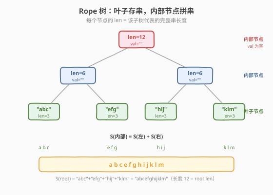
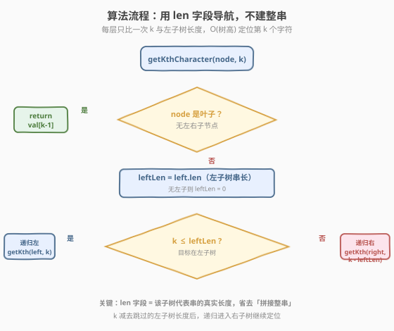
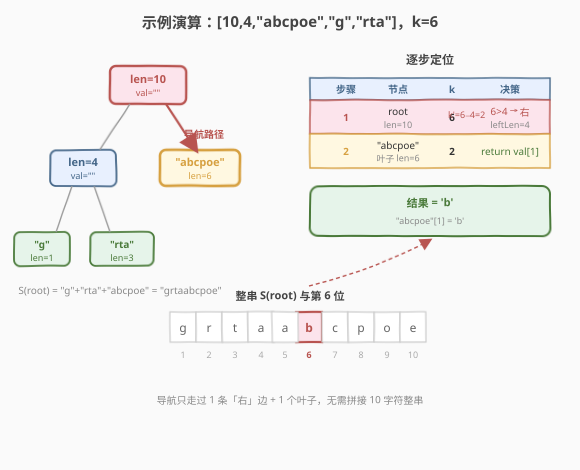

# 从 Rope 树中提取第 K 个字符

- **题目名称**：从 Rope 树中提取第 K 个字符
- **链接**：[2689. 从 Rope 树中提取第 K 个字符](https://leetcode.cn/problems/extract-kth-character-from-the-rope-tree/)
- **难度**：简单
- **标签**：树、深度优先搜索、二叉树

## 1. 题目概述

> ⚠️ 本题为 LeetCode 付费题，题意描述根据官方示例用例与 hints 重建，可能与官方题面有出入。

**Rope 树**（绳索树）是一种用二叉树表示字符串的数据结构。树的每个节点定义如下：

```python
# Definition for a rope tree node.
class RopeTreeNode:
    def __init__(self, len=0, val="", left=None, right=None):
        self.len = len      # 该子树所代表字符串的长度
        self.val = val      # 仅叶子节点有效：存放实际字符串片段；内部节点为空串
        self.left = left
        self.right = right
```

一棵 Rope 树 $T$ 中，节点 $u$ 表示的字符串 $S(u)$ 定义为：

- 若 $u$ 为**叶子节点**（无子节点）：$S(u) = u.\text{val}$；
- 若 $u$ 为**内部节点**（有子节点）：$S(u) = S(u.\text{left}) + S(u.\text{right})$（左右拼接，缺侧记空串）。

整棵树表示的字符串即 $S(\text{root})$。给定 Rope 树根节点 `root` 与整数 `k`，请返回 $S(\text{root})$ 中**第 $k$ 个字符**（$1$ 下标）。

> 💡 **`len` 的含义**：每个节点存了一个 `len`，它等于该子树代表的字符串总长度（叶子 $=\lvert\text{val}\rvert$，内部节点 $=$ 左右子长度之和）。这是后续 O(树高) 优化的关键——无需真正拼接字符串即可知道每条子树的串长。

**示例 1**：

```text
输入：root = [10,4,"abcpoe","g","rta"], k = 6

        root(len=10)
        /         \
   内部(len=4)   "abcpoe"(len=6)
     /     \
   "g"(1) "rta"(3)

S(root) = "g" + "rta" + "abcpoe" = "grtaabcpoe"
第 6 个字符 = 'b'
输出：'b'
```

**示例 2**：

```text
输入：root = [12,6,6,"abc","efg","hij","klm"], k = 3

              root(len=12)
           /              \
      内部(len=6)      内部(len=6)
       /      \         /      \
    "abc"   "efg"    "hij"   "klm"

S(root) = "abc"+"efg"+"hij"+"klm" = "abcefghijklm"
第 3 个字符 = 'c'
输出：'c'
```

**示例 3**：

```text
输入：root = ["ropetree"], k = 8
root 本身是叶子，val = "ropetree"（len=8）
S(root) = "ropetree"
第 8 个字符 = 'e'
输出：'e'
```

> ⚠️ **序列化格式**：示例中的数组是**层序遍历**结果——数组元素为 `int` 时表示一个内部节点（其值为 `len`，`val` 为空），为 `string` 时表示一个叶子节点（其值为 `val`，`len` $=\lvert\text{val}\rvert$）。如 `[10,4,"abcpoe","g","rta"]`：下标 0 的 `10`、下标 1 的 `4` 是内部节点，`"abcpoe"/"g"/"rta"` 是叶子。

**约束条件**（根据示例与 hints 重建）：

- 树中节点数 $n \ge 1$，每个节点最多 2 个子节点；
- 叶子节点的 `val` 为非空小写英文字符串，内部节点 `val` 为空串；
- $k$ 合法：$1 \le k \le S(\text{root})$ 的长度（即 $k \le \text{root.len}$）。

---

## 2. 解题思路

### 2.1 暴力思路：拼接整串再取第 k 个

最直接的做法完全照搬官方 hint：写一个递归函数 `build(node)` 返回 $S(\text{node})$，叶子直接返回 `val`，内部节点返回 `build(left) + build(right)`；在 `root` 上调用得到整串 `s = build(root)`，再 `return s[k-1]`。

```text
def build(node):
    if not node: return ""
    if not node.left and not node.right:   # 叶子
        return node.val
    return build(node.left) + build(node.right)   # 内部：左右拼接

s = build(root)
return s[k - 1]
```

问题：拼接整串要 $O(L)$ 的时间与空间，$L = \text{root.len}$ 是整串长度。当整串很长（如 $10^5$ 级别）时，仅仅为了取一个字符就构造整条字符串，浪费明显。能否**只走从根到目标字符的那一条路径**？

### 2.2 核心观察：用 `len` 字段导航，永不拼接字符串



关键在于：**每个节点的 `len` 就是它子树所代表字符串的真实长度**（叶子 $=\lvert\text{val}\rvert$，内部 $=$ 左长 + 右长，见示例验证：示例 1 中 $\text{root.len}=10$ 而 $\text{val}=""$ ，说明 `len` 不是 `val` 长度而是子树串长）。于是我们在任何内部节点都能 $O(1)$ 得知**左子树代表的串有多长**，从而决定第 $k$ 个字符在左还是在右：

设当前在节点 $u$、要找它代表串的第 $k$ 个字符（$1$ 下标）：

$$\text{leftLen} = \begin{cases} u.\text{left}.\text{len}, & u.\text{left}\ne\text{null} \\ 0, & \text{否则} \end{cases}$$

- 若 $k \le \text{leftLen}$：目标落在左子树，**递归左子树、$k$ 不变**；
- 否则：目标落在右子树，**递归右子树、$k \mathrel{-}= \text{leftLen}$**（跳过左子树的全部字符）；
- 递归到**叶子**时，直接返回 `val[k-1]`。

> 💡 **为什么不建串也行？** 因为「跳到哪边」只依赖**左侧串长**这一个数，而它已被 `left.len` 直接记录。每下沉一层做一次比较，从根到答案只走一条路径，全程不触碰其余字符。

### 2.3 算法流程图



1. `getKthCharacter(node, k)`：
   - `node` 为空 → 返回占位字符（约束下不会触发）；
   - `node` 是叶子（无左右子）→ 返回 `node.val[k-1]`；
   - 否则取 `leftLen = node.left.len if node.left else 0`：
     - $k \le \text{leftLen}$ → `getKthCharacter(node.left, k)`；
     - 否则 → `getKthCharacter(node.right, k - leftLen)`。

### 2.4 示例演算



以示例 1 `root = [10,4,"abcpoe","g","rta"]`、$k=6$ 演算：

| 步骤 | 当前节点 | k | leftLen | 决策 |
|------|----------|---|---------|------|
| 1 | `root`（内部，len=10） | 6 | 4（左子 len=4） | $6>4$ → 走右，$k'=6-4=2$ |
| 2 | 右子 `"abcpoe"`（叶子，len=6） | 2 | — | 叶子，返回 `val[1]` = `'b'` |

整串 $S(\text{root})=$ `"grtaabcpoe"`，第 6 位确为 `'b'`（g1 r2 t3 a4 a5 **b6**…）。导航全程只跨过 1 条「右」边、命中 1 个叶子，**没有拼接任何字符串**。

> 💡 **对比示例 2**（$k=3$）：root.leftLen=6，$3\le6$ 走左；左子内部节点的 leftLen=3，$3\le3$ 再走左，到 `"abc"` 叶子返回 `val[2]`$=$`'c'`。注意边界用 $\le$：$k$ 恰等于 leftLen 时仍属左子树。

---

## 3. 参考代码

### C++

```cpp
/**
 * Definition for a rope tree node.
 * struct RopeTreeNode {
 *     int len;
 *     string val;
 *     RopeTreeNode *left;
 *     RopeTreeNode *right;
 *     RopeTreeNode() : len(0), val(""), left(nullptr), right(nullptr) {}
 *     RopeTreeNode(int len, string val, RopeTreeNode *left, RopeTreeNode *right)
 *         : len(len), val(val), left(left), right(right) {}
 * };
 */
class Solution {
public:
    char getKthCharacter(RopeTreeNode* root, int k) {
        if (!root) return ' ';
        if (!root->left && !root->right)          // 叶子：直接取串中字符
            return root->val[k - 1];
        int leftLen = root->left ? root->left->len : 0;
        if (k <= leftLen)                         // 目标在左子树
            return getKthCharacter(root->left, k);
        return getKthCharacter(root->right, k - leftLen);  // 目标在右子树，跳过左子串
    }
};
```

> ⚠️ **易错点**：(1) 判叶子用「左右都为空」，而不是 `val` 是否为空——题目保证内部节点 `val` 为空、叶子 `val` 非空，但用结构判定更稳。(2) 边界用 `k <= leftLen`，当 $k$ 恰为 leftLen 时仍走左（第 leftLen 个字符是左子树最后一个字符）。(3) 递归到右子树时 `k` 必须减去 leftLen，否则相对位置错位。

### Python

```python
from typing import Optional


# Definition for a rope tree node.
# class RopeTreeNode:
#     def __init__(self, len=0, val="", left=None, right=None):
#         self.len = len
#         self.val = val
#         self.left = left
#         self.right = right
class Solution:
    def getKthCharacter(self, root: Optional[RopeTreeNode], k: int) -> str:
        if root is None:
            return ""
        if root.left is None and root.right is None:   # 叶子：直接取串中字符
            return root.val[k - 1]
        left_len = root.left.len if root.left else 0
        if k <= left_len:                              # 目标在左子树
            return self.getKthCharacter(root.left, k)
        return self.getKthCharacter(root.right, k - left_len)  # 目标在右子树，跳过左子串
```

> 💡 Python 中 `str[k-1]` 返回长度为 1 的字符串即字符，与函数返回类型 `str` 一致；C++ 中 `std::string::operator[]` 返回 `char`，函数签名返回 `char`。两者语义对应。

---

## 4. 复杂度分析

| 维度 | 复杂度 | 说明 |
|------|--------|------|
| 时间复杂度 | $O(h)$ | 每层只做一次比较与一次递归，$h$ 为树高（平衡 $h=\log L$，链状 $h=L$，$L$ 为整串长度）。不随整串长度 $O(L)$ 线性增长 |
| 空间复杂度 | $O(h)$ | 递归栈深度等于路径长度 $h$；不构造整串，无 $O(L)$ 的字符串开销 |
| 对照：暴力拼接 | $O(L)$ / $O(L)$ | 必须构造整条 $S(\text{root})$ 再取字符，时间空间都随整串长度线性增长 |

> 💡 本题难度为「简单」，整串规模有限时暴力拼接也能通过。但当整串很长（如频繁查询的单字符定位）时，`len` 导航把单次查询从 $O(L)$ 降到 $O(h)$，这正是 Rope 这种数据结构被发明出来的核心理由——支持 $O(\log n)$ 的随机访问而不物化整串。

---

## 5. 扩展：不依赖 `len` 的自算长度版本

若担心节点 `len` 字段未预先正确填充（或想脱离元数据），可现场递归计算子树串长：

```cpp
class Solution {
public:
    int length(RopeTreeNode* node) {           // 子树代表串的真实长度
        if (!node) return 0;
        if (!node->left && !node->right) return (int)node->val.size();
        return length(node->left) + length(node->right);
    }
    char getKthCharacter(RopeTreeNode* root, int k) {
        if (!root) return ' ';
        if (!root->left && !root->right) return root->val[k - 1];
        int leftLen = length(root->left);      // 每层现算左子树长度
        if (k <= leftLen) return getKthCharacter(root->left, k);
        return getKthCharacter(root->right, k - leftLen);
    }
};
```

代价：`length` 自身在退化（链状）树上是 $O(\text{子树大小})$，逐层调用累计最坏 $O(L^2)$；但对平衡树仍是 $O(L)$。因此**只有当 `len` 不可信时才用此版**，否则优先用直接读 `left.len` 的 $O(h)$ 版。也可对 `length` 加记忆化（哈希存每个节点算过的长度）回到 $O(L)$ 预处理 + $O(h)$ 查询，但已超出本题需求。

---

## 6. 面试要点

1. **为什么不直接拼接整串？什么时候必须用 `len` 导航？**

   > 拼接整串 $O(L)$，仅取一个字符时浪费在无关字符上的代价过大。`len` 导航只在根到目标的那条路径上比较，单次查询 $O(h)$。当整串很长、或要在同一棵 Rope 上反复随机访问时，$O(\log L)$ vs $O(L)$ 差距显著——这正是 Rope 数据结构的设计动机。

2. **`len` 字段为什么能直接当作子树串长用？依据是什么？**

   > 由示例 1 可直接验证：`root.val` 为空串但 `root.len=10`，说明 `len` 不是 `val` 的长度；而 $10$ 恰等于左右子串长度之和 $4+6$。结合 Rope 定义（内部节点串 = 左右拼接），`len` 即子树代表串的真实长度。叶子 `len` $=\lvert\text{val}\rvert$、内部 `len` $=$ 左 `len` + 右 `len`，二者在题目数据中保持一致。

3. **边界 $k \le \text{leftLen}$ 用 $\le$ 还是 $<$？为什么？**

   > 用 $\le$。第 $\text{leftLen}$ 个字符是左子树的最后一个字符，仍属左子树；只有 $k > \text{leftLen}$ 时目标才进入右子树。写成 `if (k <= leftLen)` 走左、否则走右，与「左子树占据 $[1,\text{leftLen}]$、右子树占据 $[\text{leftLen}+1,\ldots]$」的区间划分一致。

4. **判叶子为什么用「左右子都为空」而非「val 非空」？**

   > 题目约定内部节点 `val` 为空、叶子 `val` 非空，两者通常等价。但用结构（`left == null && right == null`）判定更稳健：它直接反映「该节点无可拼接的子串」，与 Rope 的递归定义对齐，不依赖 `val` 是否被题目填充。若某内部节点误留非空 `val`，按结构判定仍会正确地走拼接逻辑。

5. **若树退化为链（每个内部节点只有一个子节点），算法还成立吗？复杂度如何？**

   > 成立。单子节点的内部节点中，缺失的一侧 `leftLen`（或右侧）按 $0$ 处理：若只有左子、$k\le\text{left.len}$ 时走左，否则右子为空分支不会被命中（约束保证 $k$ 合法）。但链状树高 $h=L$，导航退化到 $O(L)$，与暴力持平——这正是平衡 Rope（近似 $O(\log L)$ 高）相对链式的优势所在。

> 💡 **一句话总结**：Rope 树叶子存串、内部节点拼串，而 `len` 字段已记录每个子树的真实串长——沿根到目标逐层用 $k$ 与 `left.len` 比一次即可定位，单查询 $O(h)$，永不物化整串。

---

## 7. 同类练习题

- [230. 二叉搜索树中第K小的元素](https://leetcode.cn/problems/kth-smallest-element-in-a-bst/)（[题解](../0201-0300/230_二叉搜索树中第K小的元素.md)）：同为「在树里找第 $k$ 个」，BST 用中序性质导航、本题用 `len` 元数据导航，对照「树结构元信息加速定位」的两种范式
- [606. 根据二叉树创建字符串](https://leetcode.cn/problems/construct-string-from-binary-tree/)（[题解](../0601-0700/606_根据二叉树创建字符串.md)）：方向相反的「树↔串」转换——把树按规则拼成字符串，承接 Rope「树表示串」的主题
- [988. 从叶结点开始的最小字符串](https://leetcode.cn/problems/smallest-string-starting-from-leaf/)（[题解](../0901-1000/988_从叶结点开始的最小字符串.md)）：在树上 DFS 收集叶到根的路径串并取最小，对照「树 + 字符串 + DFS」主题
- [2583. 二叉树中的第 K 大层和](https://leetcode.cn/problems/kth-largest-sum-in-a-binary-tree/)（[题解](../2501-2600/2583_二叉树中的第K大层和.md)）：二叉树上收集元数据（层和）再求第 $k$，对照「利用树形元数据回答第 $k$ 类查询」的思路
