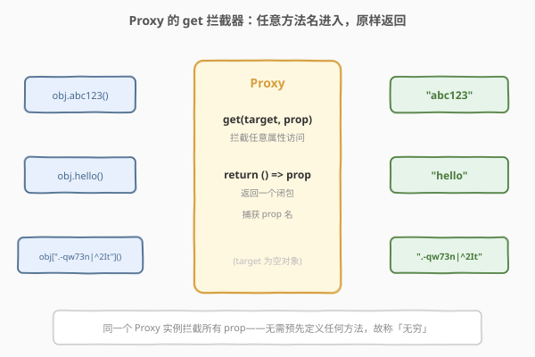
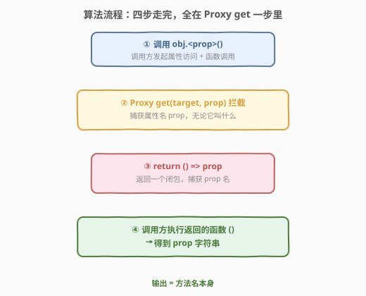
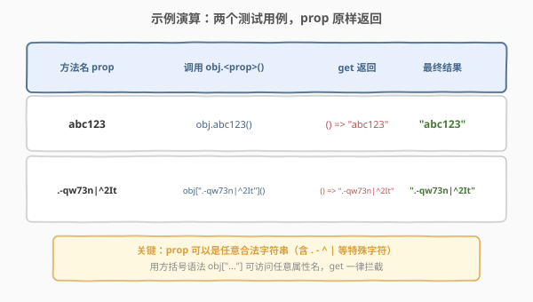

# LeetCode 无穷方法对象 题解

## 1. 题目概述

- **标题 / 题号**：无穷方法对象（#2690，easy）
- **链接**：https://leetcode.cn/problems/infinite-method-object/
- **难度**：简单
- **标签**：代理（Proxy）、元编程、动态分发、闭包

> ⚠️ 本题为 LeetCode 付费题，题意描述根据官方示例用例与 hints 重建，可能与官方题面有出入。

**题意**：请你编写一个函数 `createInfiniteObject`，它返回一个对象。这个对象可以被「无穷」地调用任意方法名——无论调用什么方法，它都返回**方法名本身**。

具体地，给定任意字符串 `prop` 作为方法名，执行 `obj.<prop>()`（或方括号语法 `obj[prop]()`）后应返回 `prop`。

**示例 1**：

```text
输入：prop = "abc123"
输出："abc123"
解释：
const obj = createInfiniteObject();
obj.abc123();   // "abc123"
```

**示例 2**：

```text
输入：prop = ".-qw73n|^2It"
输出：".-qw73n|^2It"
解释：
const obj = createInfiniteObject();
obj[".-qw73n|^2It"]();   // ".-qw73n|^2It"
```

**约束**：

- `prop` 是任意合法的 JavaScript 属性名字符串（可含特殊字符，需用方括号语法访问）。

> 💡 官方 hints 明确指出：本题的关键是 JavaScript 的 **Proxy**；需要覆写对象的 **get** 拦截器，让它**返回一个函数**，而这个函数返回 `prop`（即方法名）。题目官方以 JavaScript 为载体，但「动态分发」思想跨语言通用，下文给出 C++ 与 Python 的等价实现。

## 2. 解题思路

### 2.1 暴力思路：逐个枚举方法名

最直白的「能跑」写法：把每一个可能的方法名预先定义成对象上的属性。

```text
const obj = {
    abc123: () => "abc123",
    hello:  () => "hello",
    // ... 还有多少个？无穷个
};
```

问题：方法名是**无穷**的，不可能预先枚举所有可能的字符串；何况示例 2 的 `".-qw73n|^2It"` 含 `.`、`^`、`|` 等特殊字符，根本不能作为合法标识符用点语法声明。这条路从一开始就不可行——这正是题目叫「无穷」的原因。

> ⚠️ 核心矛盾在于：调用方用的方法名是**运行时动态确定**的，而对象的属性是**编写时静态定义**的。要打破「必须预先声明」这一限制，需要一种能在**运行时拦截任意属性访问**的机制。

### 2.2 核心观察：Proxy 的 get 拦截器——运行时拦截任意属性



**JavaScript 的 Proxy** 是一门**元编程**（metaprogramming）能力：它包裹一个目标对象（target），在外部访问对象时**插入一层拦截**。其中 `get` 拦截器（trap）会在**每一次属性读取**时被触发，无论属性叫什么名字——恰好解决「无穷」问题。

把题意翻译成 Proxy 语言：

1. `createInfiniteObject()` 返回 `new Proxy({}, { get(target, prop) { ... } })`；
2. 当调用方执行 `obj.<prop>()` 时，JS 引擎先读取属性 `obj.<prop>`——这触发 `get` 拦截器，拿到 `prop`；
3. `get` 不返回数据，而**返回一个函数** `() => prop`——一个闭包，捕获了属性名；
4. 调用方紧接着 `()` 调用这个函数，得到 `prop` 字符串本身。

关键：`get` 拦截器对**任意** `prop` 都生效，无需预先声明，因此对象拥有「无穷」个方法。

> 💡 **为什么返回的是函数而非直接返回 `prop`？** 因为 `obj.abc123` 的语义是「读取属性」，而 `obj.abc123()` 是「读取属性后调用它」。如果 `get` 直接返回字符串 `"abc123"`，那么 `obj.abc123()` 等价于 `"abc123"()`，会抛 `TypeError: "abc123" is not a function`。`get` 必须返回一个**可调用对象**（函数），让随后的 `()` 有东西可调。

> ⚠️ **闭包捕获 `prop`**：`get` 每次被触发时，`prop` 是该次访问的属性名。返回的箭头函数 `() => prop` 闭包捕获这个 `prop`，使得「先返回函数、后调用函数」两步之间 `prop` 不丢失。这与 2620 计数器闭包捕获 `n` 是同一机制——只是这里捕获的是方法名字符串。

### 2.3 算法流程图



整体只有四步，且第 ②③ 步都发生在 `get` 拦截器内部：

1. **调用** `obj.<prop>()`——调用方发起属性访问 + 函数调用；
2. **拦截** `Proxy get(target, prop)`——捕获属性名 `prop`，无论它叫什么；
3. **返回闭包** `return () => prop`——返回一个捕获了 `prop` 的箭头函数；
4. **执行** `()`——调用方拿到函数后调用它，得到 `prop` 字符串。

整个过程没有循环、没有状态，复杂度恒为常数。

### 2.4 示例演算



| 方法名 prop | 调用 | get 返回 | 最终结果 |
|-------------|------|----------|----------|
| `abc123` | `obj.abc123()` | `() => "abc123"` | `"abc123"` |
| `.-qw73n|^2It` | `obj[".-qw73n|^2It"]()` | `() => ".-qw73n|^2It"` | `".-qw73n|^2It"` |

两个用例的 `prop` 天差地别——普通标识符 vs 含 `.^|` 的特殊字符串——但走的是**同一条** `get` 拦截路径，输出都是 `prop` 本身。注意示例 2 必须用方括号语法 `obj["..."]()`，因为 `.-qw73n|^2It` 不是合法标识符，无法用点语法书写。

## 3. 参考代码

### JavaScript（写法一：Proxy + get 箭头函数，最简）

```javascript
/**
 * @return {Object}
 */
var createInfiniteObject = function () {
    return new Proxy(
        {},
        {
            get: (target, prop) => () => prop,
        }
    );
};

/**
 * const obj = createInfiniteObject();
 * obj.abc123();                 // "abc123"
 * obj[".-qw73n|^2It"]();         // ".-qw73n|^2It"
 */
```

> 💡 这是官方 hints 指向的写法：`get` 拦截器接收 `(target, prop)`，返回 `() => prop`。箭头函数隐式返回 `prop`，一行搞定。`target` 是空对象 `{}`，本题不往它身上写任何真实属性——所有属性访问都被 `get` 拦截，不会落到 target 上。

### JavaScript（写法二：显式 function，便于调试）

```javascript
var createInfiniteObject = function () {
    return new Proxy(
        {},
        {
            get(target, prop, receiver) {
                return function () {
                    return prop;
                };
            },
        }
    );
};
```

> 💡 与写法一等价，只是把箭头函数展开成显式 `function`。好处是可以在 `get` 内部 `console.log(prop)` 调试，观察每次被拦截的属性名。注意 `get` 的第三参数 `receiver` 在本题用不到。

### TypeScript

```typescript
function createInfiniteObject(): Record<string, () => string> {
    return new Proxy({} as Record<string, () => string>, {
        get: (_target, prop: string) => () => prop,
    });
}

/**
 * const obj = createInfiniteObject();
 * obj.abc123();   // "abc123"
 */
```

> 💡 TS 的 Proxy 类型较繁琐——`Proxy` 的泛型默认是 `object`，需用 `as` 断言成 `Record<string, () => string>` 让调用方拿到「属性全是函数」的类型。运行时行为与 JS 完全一致。

### Python

```python
# Python 无 Proxy，但有 __getattr__——属性查找失败时的兜底拦截
class InfiniteObject:
    def __getattr__(self, prop: str):
        return lambda: prop


def create_infinite_object() -> InfiniteObject:
    return InfiniteObject()

# obj = create_infinite_object()
# obj.abc123()                      # "abc123"
# getattr(obj, ".-qw73n|^2It")()     # ".-qw73n|^2It"
```

> 💡 Python 的 `__getattr__` 是 `get` 拦截器的等价物：当**常规属性查找失败**时（本类没有任何实例属性），解释器转而调用 `__getattr__(self, name)`。它返回 `lambda: prop`——与 JS 的 `() => prop` 完全对应。注意 Python 用 `getattr(obj, "特殊名")()` 访问含特殊字符的属性名，对应 JS 的方括号语法。

> ⚠️ Python 的 `__getattr__` 与 `__getattribute__` 的区别：前者只在查找失败时触发（本题够用），后者拦截**所有**访问（含已定义属性，更接近 Proxy 的 `get` 但更危险，易递归）。本题对象无真实属性，`__getattr__` 即可。

### C++

```cpp
#include <functional>
#include <string>

// C++ 是静态类型语言，没有运行时动态属性访问。
// 最接近的等价物是 operator[] + 字符串键，模拟 JS 的 obj["prop"]() 语法。
struct InfiniteObject {
    auto operator[](std::string prop) {
        // 捕获 prop，返回一个无参函数，调用时返回 prop
        return [prop = std::move(prop)]() { return prop; };
    }
};

InfiniteObject createInfiniteObject() {
    return InfiniteObject{};
}

// 用法：
//   auto obj = createInfiniteObject();
//   obj["abc123"]();            // "abc123"
//   obj[".-qw73n|^2It"]();      // ".-qw73n|^2It"
```

> 💡 C++ 无法做到 `obj.abc123()` 这种**编译期不存在的方法名**动态分发——方法名在 C++ 中必须是编译期已知的标识符。最接近的等价是重载 `operator[]` 接受任意字符串键，返回一个捕获该键的可调用对象，语法上对应 JS 的方括号访问 `obj["prop"]()`。语义一致：键进、键出。

> 💡 **额外附 JavaScript 原版**（题目官方语言，便于对照）：
> ```javascript
> var createInfiniteObject = function () {
>     return new Proxy({}, {
>         get: (target, prop) => () => prop,
>     });
> };
> ```

## 4. 复杂度分析

| 维度 | 复杂度 | 说明 |
|------|--------|------|
| **时间复杂度** | $O(1)$ 每次调用 | `get` 拦截器仅捕获 `prop` 并构造一个箭头函数，随后调用它返回字符串，无循环无搜索 |
| **空间复杂度** | $O(1)$ | 每个 Proxy 实例只持有一个空 target + 一个 `get` 拦截器闭包，不随方法名数量增长 |

> 💡 本题没有「规模」可言——方法名是无穷的，但每个请求的处理成本恒定，故复杂度恒为常数。考点在「元编程」概念的理解，而非性能。

## 5. 扩展：Proxy 的其他拦截器与跨语言元编程

- **Proxy 的 13 个 trap**：JS 的 Proxy 除了 `get`，还有 `set`（拦截赋值）、`has`（拦截 `in`）、`deleteProperty`、`apply`（拦截函数调用）、`construct`（拦截 `new`）等共 13 个拦截器。本题只用 `get`；2623 记忆函数可用 `apply` 拦截器把任意函数包成缓存版——二者同属「Proxy 元编程」家族，一个拦截属性读取、一个拦截函数调用。

- **`get` 返回函数的妙处**：`obj.prop()` 在 JS 中是两步操作——先 `obj.prop` 读取属性（触发 `get`），再 `()` 调用。`get` 返回一个函数，恰好让第二步 `()` 有东西可调。若 `get` 直接返回 `prop` 字符串，则 `"abc123"()` 报错。这条「读取返回可调用值」的模式，是动态分发（dynamic dispatch）的微观体现。

- **跨语言元编程对照**：
  - **Python `__getattr__`**：属性查找失败的兜底，对应 `get` trap（拦截缺失属性）；
  - **Python `__getattribute__`**：拦截所有访问，更接近 Proxy 的 `get`（但更易递归）；
  - **Ruby `method_missing`**：调用不存在的方法时触发，与本题语义几乎一致；
  - **C++ 没有运行时元编程**：方法名是编译期符号，无动态分发，只能用 `operator[]` + 字符串键模拟。

- **Reflect 配合**：生产代码中常写 `return () => Reflect.get(target, prop)`，用 `Reflect` 命名空间调用默认行为。本题要的是「覆盖」默认行为（返回函数而非读 target），故直接返回 `() => prop`，无需 `Reflect`。

## 6. 面试要点

1. **为什么不能预先定义所有方法名？**

   > 因为方法名是无穷的——题目就叫「无穷方法对象」。况且像 `".-qw73n|^2It"` 含 `.`、`^`、`|` 的字符串不是合法标识符，无法用点语法定义为对象属性。必须有一种**运行时动态拦截**任意属性访问的机制，即 Proxy。

2. **Proxy 的 `get` 拦截器何时触发？它接收哪些参数？**

   > 每一次读取代理对象的属性时触发，接收 `(target, prop, receiver)`：`target` 是被代理的原始对象，`prop` 是被访问的属性名（字符串或 Symbol），`receiver` 是最初触发读取的对象（通常是代理本身）。本题只需 `target` 和 `prop`。

3. **`get` 为什么返回的是函数而不是直接返回 `prop`？**

   > 因为 `obj.abc123()` 是「先读属性、再调用」两步。若 `get` 返回字符串 `"abc123"`，则 `obj.abc123()` 变成 `"abc123"()`——对字符串调用，抛 `TypeError`。`get` 必须返回一个**可调用**的函数，让随后的 `()` 能执行它并返回 `prop`。

4. **Python 的 `__getattr__` 和 Proxy 的 `get` 有什么区别？**

   > `__getattr__` 只在**常规属性查找失败**时触发（即属性不存在时兜底）；Proxy 的 `get` 拦截**所有**属性读取（包括 target 上已存在的属性）。本题对象没有任何真实属性，二者效果一致。若 target 有属性，`__getattr__` 不会触发而已存在的会先返回，而 Proxy 的 `get` 会全部拦截。

5. **C++ 为什么无法实现真正的「无穷方法对象」？**

   > C++ 是静态类型语言，方法名必须是编译期已知的标识符，运行时无法凭空「分发」一个不存在的方法名。最接近的等价是 `operator[]` 接受任意字符串键返回可调用对象，用方括号语法 `obj["prop"]()` 模拟，但这不是真正的方法调用。

## 同类练习题

| # | 题目 | 与本题的关联 |
|---|------|-------------|
| 2623 | [记忆函数](https://leetcode.cn/problems/memoize/)（[题解](../2601-2700/2623_记忆函数.md)） | 可用 Proxy 的 `apply` 拦截器把任意函数包成缓存版，与本题 `get` 拦截属性同属 Proxy 元编程家族——一个拦截函数调用、一个拦截属性读取 |
| 2618 | [检查是否是类的对象实例](https://leetcode.cn/problems/check-if-object-instance-of-class/)（[题解](../2601-2700/2618_检查是否是类的对象实例.md)） | 判定对象身份与原型链，对照 Proxy「包装对象」改写行为的元编程视角 |
| 2633 | [将对象转换为 JSON 字符串](https://leetcode.cn/problems/convert-object-to-json-string/)（[题解](../2601-2700/2633_将对象转换为JSON字符串.md)） | 递归遍历对象任意属性，与本题「运行时动态访问任意属性」的思路互为正反——一个是拦截访问、一个是枚举访问 |
| 2665 | [计数器 II](https://leetcode.cn/problems/counter-ii/)（[题解](../2601-2700/2665_计数器II.md)） | 返回含 `counter/reset/increment/decrement` 多个方法的对象，对照本题返回「无穷多方法」的对象——有限显式方法 vs 无穷动态方法 |
