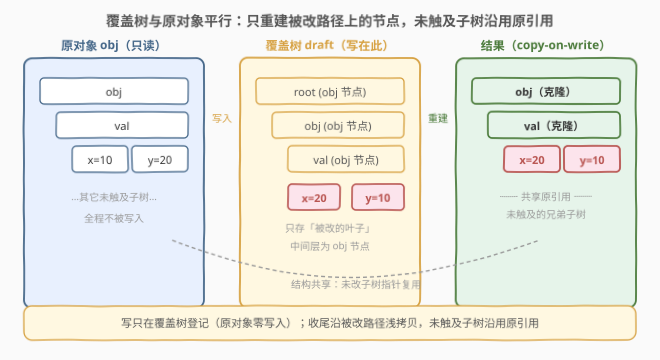
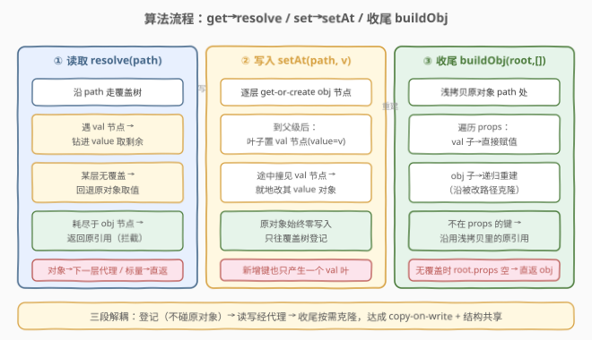

# LeetCode 不可变辅助工具 题解

## 1. 题目概述

- **标题 / 题号**：不可变辅助工具（#2691，hard）
- **链接**：https://leetcode.cn/problems/immutability-helper/
- **难度**：困难
- **标签**：代理模式、不可变数据、结构共享、深拷贝优化

> ⚠️ 本题为 LeetCode 付费题，题意描述根据官方示例用例与 hints 重建，可能与官方题面有出入。

**题意**：给定一个不可变的 JSON 对象 `obj` 与一个**变换函数数组** `mutators`。每个变换函数 `f` 接收一个**代理** `proxy`，可以像操作普通对象一样对 `proxy` 读属性、写属性（包括嵌套读写）：

- **读**：`proxy.a.b`、`proxy.arr[0]` —— 返回当前值（含此前变换已写入的修改）；
- **写**：`proxy.val += 1`、`proxy.arr[0] = 5`、`proxy.newKey = ...` —— 记录一次修改。

变换函数**按顺序**执行，彼此**共享累积状态**（前一个写入的值，后一个能读到）。所有变换执行完毕后，**返回一个新对象**，它反映了全部修改；**原对象 `obj` 必须保持不变**。为了高效，**只克隆被修改触及的节点**，未触及的子树沿用原引用（结构共享）。

**示例 1**：

```text
输入：obj = {"val":10}, mutators = [
        proxy => { proxy.val += 1; },
        proxy => { proxy.val -= 1; }
      ]
输出：{"val":10}
解释：变换 1 把 val 改成 11；变换 2 又改回 10。原对象仍为 {"val":10}。
```

**示例 2**：

```text
输入：obj = {"arr":[1,2,3]}, mutators = [
        proxy => { proxy.arr[0] = 5; proxy.newVal = proxy.arr[0] + proxy.arr[1]; }
      ]
输出：{"arr":[5,2,3],"newVal":7}
解释：arr[0] 写为 5；newVal = 5 + 2 = 7（新增键）。
```

**示例 3**：

```text
输入：obj = {"obj":{"val":{"x":10,"y":20}}}, mutators = [
        proxy => { let data = proxy.obj.val; let temp = data.x; data.x = data.y; data.y = temp; }
      ]
输出：{"obj":{"val":{"x":20,"y":10}}}
解释：取出 proxy.obj.val 的代理，借助临时变量交换 x、y。
```

**约束**：

- `obj` 是一个 JSON 对象（仅含对象/数组/数字/字符串/布尔/null，无函数、无环）；
- `1 <= mutators.length`，变换函数仅通过 `proxy` 读写属性、不调用方法（如 `push`）；
- 原对象不可变；返回值须等价于「把所有变换作用于 `obj` 的拷贝」的结果。

> 💡 本题属于 LeetCode JavaScript 系列，**仅开放 JavaScript / TypeScript 提交入口**，核心考点是 `Proxy` 与 **Immer 式不可变更新（copy-on-write + 结构共享）**。下文给出 JavaScript 提交版，并附 Python、C++ 的等价实现。

## 2. 解题思路

### 2.1 暴力思路：整体深拷贝 + 透传代理

最直白的「能跑」写法：先把 `obj` **整体深拷贝**一份，给变换函数一个**透传代理**（get/set 直接打到拷贝上）。所有变换在拷贝上原地修改，最后返回拷贝即可——原对象从头到尾没被碰过，天然不可变。

```text
helper(obj, mutators):
    copy = deepClone(obj)                       // 一次性整树复制
    proxy = Proxy(copy, get→copy[k], set→copy[k]=v)   // 透传
    for f in mutators: f(proxy)
    return copy
```

正确，但有一个硬伤：**永远整树复制**，哪怕变换只改了 `obj.a.b` 这一条路径，也要把整棵树 `O(n)` 拷一遍。题目 hints 明确要求「只克隆被修改触及的节点」，暴力法违背这一效率目标。

### 2.2 核心观察：覆盖树 + 收尾按需重建（copy-on-write）



把「修改」从「立即复制」解耦成两步：

1. **记录阶段**：所有 `proxy` 写操作只往一棵**覆盖树**（draft）里登记，**绝不碰原对象**。覆盖树与原对象结构平行，每个节点二选一：
   - `obj` 节点：`{kind:'obj', props: Map<key, 子节点>}` —— 该处只有**部分子属性**被改/新增；
   - `val` 节点：`{kind:'val', value}` —— 该子树被**整体替换**为一个具体值。

2. **重建阶段**：变换结束后，自顶向下**浅拷贝**原对象，遇到覆盖就递归重建被改子树，未触及的子树**直接沿用原引用**（结构共享）。

读写时如何解析当前值（含已登记的修改）？沿路径 `path` 走覆盖树：

| 覆盖树状态 | 当前值的来源 |
|------------|--------------|
| 走到 `val` 节点 | 该子树被整体替换 → 取 `val.value`，再向下钻取剩余路径 |
| 中途某层**无覆盖** | 回退到原对象对应位置取值 |
| 路径耗尽于 `obj` 节点 | 原对象此处是个对象/数组 → 返回原引用（交给代理拦截后续访问） |

`proxy` 的 get trap 只需：解析当前值，是对象/数组就**返回下一层代理**（深代理），是原始值就直接返回。set trap 只需：沿路径建 `obj` 节点到父级，在叶子放 `val` 节点。

> 💡 **为什么这套设计能满足「只克隆触及节点」？** 因为重建阶段只在**被改路径上**浅拷贝并递归，未改的兄弟子树 `spread` 后保留原引用——这正是 Immer、Immutable.js 等不可变库的核心：**写时复制 + 结构共享**，使得 `modify(obj.a.b)` 只产生从根到 `b` 这条链上的新节点，其余指针全部复用。

> ⚠️ **别把 `val` 节点写成「整树克隆」**。`val` 节点存的是变换函数**直接给出的值**（一个具体对象），不是原对象的拷贝；它只在「整棵子树被替换」时出现。叶子上的单值修改仍是 `val` 节点，但存的是一个标量。

### 2.3 算法流程图



三条并行主线：

- **读取 `resolve(path)`**：沿覆盖树下行；遇 `val` 节点则钻进其 `value`；某层无覆盖则回退原对象；路径耗尽于 `obj` 节点则返回原引用。
- **写入 `setAt(path, value)`**：沿路径逐层 `get-or-create` 出 `obj` 节点，到父级后把叶子置为 `val` 节点（若途中撞见 `val` 节点，则就地改其 `value` 对象）。
- **收尾 `buildObj(node, path)`**：浅拷贝原对象 `path` 处，遍历 `node.props`，`val` 子节点直接赋值、`obj` 子节点递归重建——未出现在 `props` 的键沿用浅拷贝里的原引用。

### 2.4 示例演算

![示例演算：obj={arr:[1,2,3]}，写入 arr[0]=5、newVal=7，覆盖树与最终重建结果](../images/p2691_example_walkthrough.svg)

以**示例 2** 为例，`obj = {"arr":[1,2,3]}`、变换为 `proxy.arr[0] = 5; proxy.newVal = proxy.arr[0] + proxy.arr[1]`：

| 步 | 操作 | 覆盖树变化 | 说明 |
|----|------|-----------|------|
| 1 | `proxy.arr[0] = 5` | root → arr(obj) → "0"(val 5) | get arr 无覆盖，回退原数组并包成代理；set "0" 沿路径建 obj 节点到 arr、叶放 val |
| 2 | 读 `proxy.arr[0]` | （无变化） | resolve [arr,"0"] 命中 val → 返回 5 |
| 3 | 读 `proxy.arr[1]` | （无变化） | resolve [arr,"1"] 无覆盖 → 回退原数组 arr[1] = 2 |
| 4 | `proxy.newVal = 7` | root → newVal(val 7) | 5 + 2 = 7；新增键，叶放 val |
| 5 | `buildObj(root, [])` | — | 浅拷贝 {arr:[1,2,3]} → 遍历 props：arr 递归重建为 [5,2,3]、newVal 赋 7 |

输出 `{"arr":[5,2,3],"newVal":7}`，与手算一致。对照**示例 1**：两次变换都在 `[val]` 写入，最终叶 val=10，重建得 `{"val":10}`；**示例 3** 的交换则沿 `obj→val` 建 obj 节点、在 `x`、`y` 各放一个 val 叶。

## 3. 参考代码

### JavaScript / TypeScript（提交语言，覆盖树 + copy-on-write）

```javascript
/**
 * @param {Object} obj
 * @param {Array<Function>} mutators
 * @return {Object}
 */
var helper = function (obj, mutators) {
    // 覆盖树节点：obj 节点（部分子属性被改）/ val 节点（整棵子树被替换为具体值）
    const objNode = () => ({ kind: 'obj', props: new Map() });
    const valNode = v => ({ kind: 'val', value: v });
    const root = objNode();

    // 原对象在 path 处的值（只读，绝不修改）
    const origAt = path => {
        let v = obj;
        for (const k of path) v = v[k];
        return v;
    };

    // 解析当前值（含已登记的修改）：沿 path 走覆盖树
    const resolve = path => {
        let node = root, i = 0;
        while (i < path.length) {
            if (node.kind === 'val') {                 // 整棵子树被替换 → 钻进 val.value
                let v = node.value;
                for (let j = i; j < path.length; j++) v = v[path[j]];
                return v;
            }
            const k = path[i];
            if (!node.props.has(k)) {                  // 该层无覆盖 → 回退原对象
                let v = origAt(path.slice(0, i + 1));
                for (let j = i + 1; j < path.length; j++) v = v[path[j]];
                return v;
            }
            node = node.props.get(k);
            i++;
        }
        // 路径耗尽：val 节点返回其值；obj 节点返回原引用交给代理拦截
        if (node.kind === 'val') return node.value;
        const o = origAt(path);
        return (o !== null && typeof o === 'object') ? o : {};
    };

    // 在 path 处登记一次写入
    const setAt = (path, value) => {
        let node = root;
        for (let i = 0; i < path.length - 1; i++) {
            const k = path[i];
            if (node.kind === 'val') {                 // 整体替换处就地改其 value 对象
                let v = node.value;
                for (let j = i; j < path.length - 1; j++) {
                    if (typeof v[path[j]] !== 'object' || v[path[j]] === null) v[path[j]] = {};
                    v = v[path[j]];
                }
                v[path[path.length - 1]] = value;
                return;
            }
            if (!node.props.has(k)) node.props.set(k, objNode());
            node = node.props.get(k);
        }
        const last = path[path.length - 1];
        if (node.kind === 'val') node.value[last] = value;
        else node.props.set(last, valNode(value));
    };

    // 收尾：浅拷贝 + 递归重建被改子树（未触及子树沿用原引用 = 结构共享）
    const buildObj = (node, path) => {
        const orig = origAt(path);
        const out = Array.isArray(orig) ? [...orig] : { ...orig };
        for (const [k, child] of node.props) {
            out[k] = child.kind === 'val' ? child.value : buildObj(child, [...path, k]);
        }
        return out;
    };

    // 绑定到某 path 的深代理：对象/数组返回下一层代理，原始值直接返回
    const makeProxy = path => new Proxy({}, {
        get(_, prop) {
            if (typeof prop !== 'string') return undefined;
            const v = resolve([...path, prop]);
            return (v !== null && typeof v === 'object') ? makeProxy([...path, prop]) : v;
        },
        set(_, prop, value) {
            if (typeof prop === 'string') setAt([...path, prop], value);
            return true;
        }
    });

    const proxy = makeProxy([]);
    for (const m of mutators) m(proxy);

    return root.props.size === 0 ? obj : buildObj(root, []);
};
```

TypeScript 版（带类型签名）：

```typescript
type Obj = { [k: string]: any };

function helper(obj: Obj, mutators: Array<(p: any) => void>): Obj {
    // 实现同上，省略类型注解的逐行版本
    return helperImpl(obj, mutators);
}
```

> 💡 **`get` trap 为何对对象返回「下一层代理」而非原值？** 因为返回原引用会让变换函数绕过代理直接改原对象（破坏不可变）；返回代理则把后续读写都纳入覆盖树。读原始值时则直接返回（标量按值传递，无需代理）。

> ⚠️ **数组索引在 JS 中是字符串键**：`proxy.arr[0]` 里的 `0` 会被 Proxy 当作字符串 `"0"`，与 `Map` 的键、对象属性一致，因此数组与对象用同一套路径逻辑即可，无需分支。

### Python（等价实现：覆盖树 + Draft 代理类）

```python
def helper(obj, mutators):
    # 覆盖树节点：{'kind':'obj','props':{}} 或 {'kind':'val','value':v}
    root = {'kind': 'obj', 'props': {}}

    def orig_at(path):
        v = obj
        for k in path:
            v = v[k]
        return v

    def resolve(path):
        node = root
        for i, k in enumerate(path):
            if node['kind'] == 'val':            # 整棵子树被替换 → 钻进 value
                v = node['value']
                for j in range(i, len(path)):
                    v = v[path[j]]
                return v
            if k not in node['props']:           # 无覆盖 → 回退原对象
                v = orig_at(path[:i + 1])
                for j in range(i + 1, len(path)):
                    v = v[path[j]]
                return v
            node = node['props'][k]
        if node['kind'] == 'val':               # 整体替换 → 返回其值
            return node['value']
        o = orig_at(path)                        # 路径耗尽于 obj 节点
        return o if isinstance(o, (dict, list)) else {}

    def set_at(path, value):
        node = root
        for i in range(len(path) - 1):
            k = path[i]
            if node['kind'] == 'val':           # 整体替换处就地改其值对象
                v = node['value']
                if not isinstance(v, dict):
                    return                       # 列表整体替换后写子属性：边缘情形，此处略
                for j in range(i, len(path) - 1):
                    if path[j] not in v or not isinstance(v[path[j]], (dict, list)):
                        v[path[j]] = {}
                    v = v[path[j]]
                v[path[-1]] = value
                return
            if k not in node['props']:
                node['props'][k] = {'kind': 'obj', 'props': {}}
            node = node['props'][k]
        last = path[-1]
        if node['kind'] == 'val':
            node['value'][last] = value
        else:
            node['props'][last] = {'kind': 'val', 'value': value}

    def build(node, path):
        orig = orig_at(path)
        out = list(orig) if isinstance(orig, list) else dict(orig)
        for k, child in node['props'].items():
            out[k] = child['value'] if child['kind'] == 'val' else build(child, path + (k,))
        return out

    class Draft:                                 # 代理：属性与下标访问都纳入覆盖树
        __slots__ = ('_path',)

        def __init__(self, path=()):
            object.__setattr__(self, '_path', path)

        def _get(self, key):
            v = resolve(self._path + (key,))
            return Draft(self._path + (key,)) if isinstance(v, (dict, list)) else v

        def __getattr__(self, key):              # proxy.val
            return self._get(key)

        def __setattr__(self, key, value):       # proxy.val = x
            set_at(self._path + (key,), value)

        def __getitem__(self, key):              # proxy.arr[0]
            return self._get(key)

        def __setitem__(self, key, value):       # proxy.arr[0] = 5
            set_at(self._path + (key,), value)

    proxy = Draft()
    for m in mutators:
        m(proxy)
    return obj if not root['props'] else build(root, ())
```

> 💡 Python 无 `Proxy`，用 `__getattr__/__setattr__/__getitem__/__setitem__` 模拟；`__slots__` + `object.__setattr__` 防止内部字段 `_path` 被拦截。数组下标须用整数（`proxy.arr[0]`），与 JS 的字符串键不同。

### C++（暴力深拷贝版：正确但非「最小克隆」）

```cpp
#include <nlohmann/json.hpp>
#include <functional>
#include <vector>

using json = nlohmann::json;

// 暴力版：深拷贝 obj，让变换函数直接改拷贝，原对象不动。
// 正确，但永远整树复制 O(n)；「只克隆触及节点」的覆盖树优化见 JS/Python 版。
class ImmutHelper {
    json draft_;  // obj 的深拷贝
public:
    json::reference operator[](const std::string& k) { return draft_[k]; }  // 读写均打到 draft_
    json::reference operator[](int i)             { return draft_[i]; }

    json run(const json& obj,
             const std::vector<std::function<void(ImmutHelper&)>>& mutators) {
        draft_ = obj;                       // 一次性整树拷贝
        for (auto& m : mutators) m(*this);
        return draft_;
    }
};
```

> ⚠️ C++ 无 `Proxy` 也无动态 JSON，难以既保持「变换函数 fluent 写法」又做覆盖树优化，故给出正确但非最优的深拷贝版作为对照。`nlohmann::json` 的 `operator[]` 返回引用，`h["val"] += 1`、`h["arr"][0] = 5`、`auto& d = h["obj"]["val"]; int t = d["x"]; d["x"] = d["y"]; d["y"] = t;` 均直接作用于 `draft_`，原 `obj` 不被触及。

## 4. 复杂度分析

| 维度 | 复杂度 | 说明 |
|------|--------|------|
| 时间复杂度 | $O(M\cdot L + R)$ | $M$ = 变换函数的属性读写总次数，$L$ = 最深路径长度（每次 `resolve`/`setAt` 沿路径走）；$R$ = 重建阶段触及的节点数 |
| 空间复杂度 | $O(T)$ | 覆盖树本身 $O(\text{写入数})$；结果对象只新建被改路径上的节点，未触及子树共享原引用 |
| 不可变性 | 原对象 $O(0)$ 写入 | 全程只读 `obj`（`origAt` 与浅拷贝 `spread`），从不写原对象 |

> 💡 与暴力深拷贝 $O(n)$ 时空相比，本解在「变换只触及少量路径」时近乎 $O(\text{触及数})$——这正是 Immer 在 Redux 等场景下高效的根因：$99\%$ 的 state 未变时，重建几乎零成本。

## 5. 扩展：Immer 与不可变更新的工程实践

本题是 [Immer](https://immerjs.github.io/immer/) 库 `produce(state, draft => { draft.x = 1; })` 的最小化复刻。围绕不可变更新有几个关键工程概念：

| 概念 | 含义 | 在本题的对应 |
|------|------|--------------|
| **写时复制 copy-on-write** | 写操作不就地改，而是沿路径复制一份再改 | 覆盖树登记 + 收尾 `buildObj` 沿路径浅拷贝 |
| **结构共享 structural sharing** | 未改子树复用原引用，新旧版本共享大部分内存 | `buildObj` 中未出现在 `props` 的键沿用 `spread` 的原引用 |
| **代理 draft** | 给变换函数一个可写视图，背后记录 diff | `makeProxy` 返回的深代理 + 覆盖树 |
| **时间旅行 time-travel** | 旧版本未被改坏，可随时回看 | 原对象 `obj` 始终不变，新旧状态并存 |

- **为何要不可变？** 不可变数据让「相等比较」退化为引用比较（`prev === next` 一眼判定是否变化），是 React/Redux 依赖检测、Memorization 的前提。可变更新会破坏引用稳定性，迫使框架深比较整树。
- **Immer 的进阶**：真实 Immer 还处理 Proxy 陷阱（`delete`/`has`/`ownKeys`）、生成 finalizer 冻结结果、检测「未改则返回原引用」（对应本题 `root.props.size === 0 ? obj : ...`）、支持 `produce` 嵌套与 patch 记录。本题只覆盖了 `get`/`set` 这一最小子集。
- **`val` 节点 = 整树替换 vs `obj` 节点 = 部分修改**：这一二分是覆盖树紧凑的关键——单值修改只占一个叶子 `val`，不必克隆原数组/对象。若一律深拷贝则退化回 2.1 暴力法。

> 💡 若把本题的 `mutators` 改成「异步变换」或「变换可读其它分支的最新值」，就触及 **可变 draft 的并发安全**问题：Immer 规定 draft 只在 `produce` 回调内有效、用后即弃，正是为了避免 draft 跨异步边界泄漏。本题变换为同步顺序执行，无此顾虑。

## 6. 面试要点

1. **为什么不能直接把原对象包成透传代理让变换函数改？**

   > 透传代理的 `get` 返回原对象的子对象真实引用，变换函数一旦 `proxy.obj.val.x = 1`，就直接改了原对象的嵌套节点，**破坏不可变**。必须用覆盖树拦截写、用「下一层代理」拦截读，才能保证原对象零写入。

2. **覆盖树里 `obj` 节点和 `val` 节点分别何时出现？为什么这样分？**

   > `obj` 节点出现在路径的**中间层**（某父级只有部分子属性被改），叶子处放 `val` 节点存具体值；当变换函数把整棵子树替换为一个新对象（`proxy.a = {...}`），该处也是 `val` 节点。二分让单值修改只占一个叶子，不必克隆整棵原对象——这是「最小克隆」的来源。

3. **`get` trap 对对象返回代理、对原始值直接返回，依据是什么？**

   > 对象是引用类型，返回原引用会绕过代理被直接改（破坏不可变）；返回代理把后续读写纳入覆盖树。原始值按值传递，复制即相等，直接返回既正确又省一个代理对象。判断标准是 `typeof v === 'object' && v !== null`。

4. **重建阶段如何保证「只克隆触及节点」？未触及子树安全共享原引用吗？**

   > `buildObj` 先 `spread` 浅拷贝原对象（只复制一层键），再遍历覆盖树的 `props` 递归重建被改子树；不在 `props` 的键沿用浅拷贝里的原引用。原对象全程只读，共享其子引用不会被改坏（变换早已写入覆盖树，不会回写原对象），故结构共享安全。

5. **本题与 Immer 的 `produce` 有何异同？少了什么？**

   > 本题 ≈ `produce(obj, draft => { mutators.forEach(f => f(draft)); })`。少了：`delete`/`has`/`ownKeys` 等 trap、结果冻结（`Object.freeze`）、自动「未改返回原引用」检测（本题手动 `root.props.size === 0 ? obj`）、patch 记录与异步支持。核心的「覆盖树 + copy-on-write + 结构共享」机制一致。

## 同类练习题

| # | 题目 | 与本题的关联 |
|---|------|-------------|
| 2627 | [函数防抖](https://leetcode.cn/problems/debounce/) | 同属 30 天 JS 系列，考察闭包封存私有状态，对照本题「闭包持覆盖树」体现闭包的两种用法 |
| 2623 | [记忆函数](https://leetcode.cn/problems/memoize/) | 用 Proxy/闭包拦截函数调用做缓存，与本题用 Proxy 拦截属性读写属同一族「元编程」题 |
| 2630 | [记忆函数 II](https://leetcode.cn/problems/memoize-ii/) | 进阶版记忆化，处理多参数与序列化，元编程难度递进 |
| 2634 | [过滤数组中的元素](https://leetcode.cn/problems/filter-elements-from-array/) | 手撕 `filter`，与本题「代理 + 覆盖树」同为「在不改原数据的前提下构造新数据」的思想 |
| 2629 | [复合函数](https://leetcode.cn/problems/function-composition/) | 高阶函数把多个函数串成管道，与本题「变换函数数组顺序作用于 draft」都是「函数作为值」的运用 |
