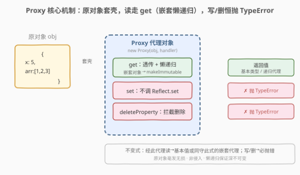
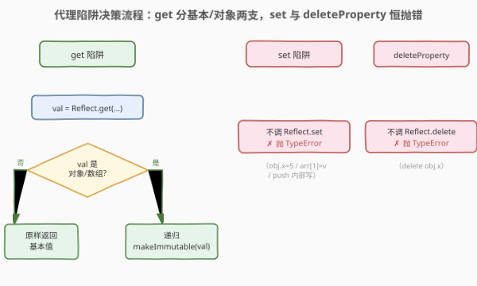
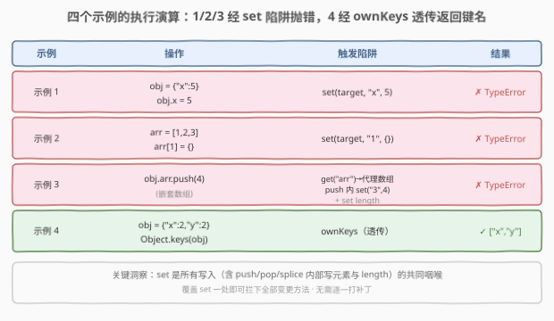

# 使对象不可变

- **题目名称**：使对象不可变
- **链接**：[2692. 使对象不可变](https://leetcode.cn/problems/make-object-immutable/)
- **难度**：中等
- **标签**：对象、Proxy、递归、不可变性

## 1. 题目概述

> ⚠️ 本题为 LeetCode 付费题，题意描述根据官方示例用例与 hints 重建，可能与官方题面有出入。函数签名 `makeImmutable(obj)` 亦为依惯例重建。

编写函数 `makeImmutable(obj)`，接收一个对象或数组 `obj`，返回其**不可变版本**：读取行为与原对象一致，但**任何修改尝试都应抛出错误**而非真正改变数据。具体要求（据 hints 与示例归纳）：

1. **读取放行**：访问属性（含嵌套）正常返回值；`Object.keys` 等反射操作正常工作。
2. **写入抛错**：`obj.x = 5` 这类赋值应抛错，而非真正写入。
3. **删除抛错**：`delete obj.x` 应抛错。
4. **数组变更方法抛错**：`push` / `pop` / `shift` / `splice` / `sort` 等会改变数组的方法应抛错（其内部会触发写入陷阱）。
5. **深不可变**：嵌套的对象/数组也必须是不可变的——对 `obj.arr.push(4)` 同样要抛错。

三条官方 hints 直接指向解法骨架：

- **hint 1**：JavaScript 有 `Proxy` 概念，它是本题的关键。
- **hint 2**：递归地使用 proxy，使使用者永远只能拿到一个代理对象。
- **hint 3**：覆盖 `set` 的行为，让它抛出正确的错误，而不是真正赋值。

**示例 1**（写入抛错）：

```text
输入：obj = {"x":5}
测试函数：(obj) => { obj.x = 5; return obj.x; }
预期：抛出错误（对 x 赋值被拦截）
```

**示例 2**（数组元素写入抛错）：

```text
输入：arr = [1,2,3]
测试函数：(arr) => { arr[1] = {}; return arr[2]; }
预期：抛出错误（对 arr[1] 赋值被拦截）
```

**示例 3**（嵌套数组 push 抛错）：

```text
输入：obj = {"arr":[1,2,3]}
测试函数：(obj) => { obj.arr.push(4); return 42; }
预期：抛出错误（push 内部写 arr[3]/length 被拦截）
```

**示例 4**（读取正常）：

```text
输入：obj = {"x":2,"y":2}
测试函数：(obj) => { return Object.keys(obj); }
预期：返回 ["x","y"]（反射读取不受影响）
```

**约束条件**（重建）：

- `obj` 为合法的 JSON 对象或数组（可嵌套）。
- 属性值为基本类型或对象/数组。
- 测试函数对返回值执行的修改操作应抛错，读取操作应正常返回。

> 💡 本题属 LeetCode「30 天 JavaScript」系列附近的**对象/Proxy** 专题，仅开放 JavaScript / TypeScript 提交入口，核心考察 `Proxy` 的陷阱（trap）与**递归**。本文以 JS 为提交语言，并给出 Python 概念等价实现。

---

## 2. 解题思路

### 2.1 暴力思路：Object.freeze 一把梭

最直白的"不可变"工具是 `Object.freeze`：

```javascript
var makeImmutable = function (obj) {
    return Object.freeze(obj);
};
```

看似一行解决，实则三处不达标：

| 缺陷 | 说明 |
|------|------|
| **浅冻结** | `freeze` 只冻最外层。`obj.arr` 仍是普通数组，`obj.arr.push(4)` 照样改成功 → **示例 3 失败**。需手写递归 `deepFreeze` 才能覆盖嵌套。 |
| **非严格模式静默失败** | 在 sloppy mode 下，对冻结对象赋值**不抛错而是被忽略**（静默失败）；题目要求"抛出错误"，行为不符。严格模式下虽抛 `TypeError`，但依赖运行模式不稳健。 |
| **侵入式** | `freeze` **原地改造**传入对象——调用方原来的 `obj` 也被冻住了，破坏了"返回一个不可变版本"的非侵入语义。 |

### 2.2 核心观察：Proxy + 递归 get + set 抛错



三条 hints 一一对应三块机制，拼出完整方案：

- **hint 1 → 用 `Proxy`**：`new Proxy(obj, handler)` 造一个"壳"，所有基本操作（读、写、删、枚举）都先过 `handler` 的陷阱。原对象不动，**非侵入**。
- **hint 2 → 递归代理（在 `get` 里做）**：`get` 陷阱透传读取；若取到的值本身是对象/数组，**就地再 `makeImmutable(val)` 套一层代理**再返回。于是使用者无论下钻多少层，拿到的永远是代理，**深不可变**由"懒递归"天然保证。
- **hint 3 → `set` 抛错**：覆盖 `set` 陷阱，**不调用 `Reflect.set`**，直接 `throw new TypeError(...)`。赋值被拦截成错误，"正确的错误"即"不真正写入"。

由此产生一条**不变式**：任意时刻，对返回值的写/删操作**必抛错**；而读操作要么返回基本值，要么返回一个同样守此不变式的嵌套代理。

| 陷阱 | 职责 | 对应示例 |
|------|------|----------|
| `get` | 透传读取；嵌套对象/数组递归套代理 | 示例 4 `Object.keys`、示例 3 取 `obj.arr` |
| `set` | 拦截赋值，抛 `TypeError`（不调 `Reflect.set`） | 示例 1 `obj.x=5`、示例 2 `arr[1]={}`、示例 3 `push` 内部写 |
| `deleteProperty` | 拦截删除，抛 `TypeError` | `delete obj.x` |

> ⚠️ **数组的 `push` 为什么也被拦住？** `arr.push(4)` 内部执行 `arr[arr.length] = 4` 并递增 `length`——这两步都走代理的 **`set` 陷阱**，于是被一并以 `TypeError` 拦下。无需为每个变更方法单独打补丁，`set` 是它们的**共同咽喉**。同理 `pop`/`splice`/`sort` 等也都会在写元素或 `length` 时触发 `set` 而抛错。

### 2.3 算法流程图



左侧 `get` 是"读取放行 + 懒递归"的分支：取值后按是否对象分两路——基本类型原样返回，对象/数组递归套代理。右侧 `set` / `deleteProperty` 是"恒抛错"的捷径：不经过任何真正写/删路径，直接 raise。

### 2.4 示例演算



- **示例 1**：`obj.x = 5` → `set(target,'x',5)` → 抛 `TypeError`。赋值未生效，`return obj.x` 永不执行。
- **示例 2**：`arr[1] = {}` → `set(target,'1',{})` → 抛 `TypeError`。
- **示例 3**：`obj.arr.push(4)` → `get('arr')` 返回嵌套代理数组 → `push(4)` 内部 `set(nested,'3',4)` → 抛 `TypeError`。
- **示例 4**：`Object.keys(obj)` → 走 `ownKeys` 陷阱（默认透传）→ `['x','y']`；不触达 `get`/`set`，正常返回。

---

## 3. 参考代码

### JavaScript（提交语言）

```javascript
/**
 * @param {Object|Array} obj
 * @return {Object|Array} 不可变版本（Proxy 包裹，非侵入）
 */
var makeImmutable = function (obj) {
    // 基本类型 / null 无需代理，原样返回
    if (typeof obj !== 'object' || obj === null) {
        return obj;
    }

    return new Proxy(obj, {
        // 读：透传；若值为对象/数组，递归套代理，保证深不可变
        get(target, key, receiver) {
            const val = Reflect.get(target, key, receiver);
            return (typeof val === 'object' && val !== null)
                ? makeImmutable(val)
                : val;
        },
        // 写：一律抛错（覆盖默认的"真正赋值"行为）
        set(target, key) {
            throw new TypeError(`Cannot set property: ${String(key)}`);
        },
        // 删：一律抛错
        deleteProperty(target, key) {
            throw new TypeError(`Cannot delete property: ${String(key)}`);
        },
    });
};
```

> 💡 三个陷阱各司其职：`get` 管"懒递归"、`set`/`deleteProperty` 管"恒抛错"。不调 `Reflect.set` 是关键——一旦调用，赋值就真的生效了，题目要求恰恰相反。`Reflect.get` 则用于正确透传（含 receiver，保证 getter 的 `this` 指向代理）。

### TypeScript

```typescript
function makeImmutable(obj: any): any {
    if (typeof obj !== 'object' || obj === null) {
        return obj;
    }
    return new Proxy(obj, {
        get(target: any, key: PropertyKey, receiver: any) {
            const val = Reflect.get(target, key, receiver);
            return (typeof val === 'object' && val !== null)
                ? makeImmutable(val)
                : val;
        },
        set(_t: any, key: PropertyKey) {
            throw new TypeError(`Cannot set property: ${String(key)}`);
        },
        deleteProperty(_t: any, key: PropertyKey) {
            throw new TypeError(`Cannot delete property: ${String(key)}`);
        },
    });
}
```

### Python（概念等价，types.MappingProxyType）

> 本题 LeetCode 仅开放 JS/TS，Python 版作概念对照。Python 没有 `Proxy`，但可用 `types.MappingProxyType`（dict 的**只读视图**，赋值即抛 `TypeError`）+ `tuple`（不可变序列）递归拼出等价语义。

```python
from types import MappingProxyType


def make_immutable(obj):
    """概念等价：dict -> 只读映射视图，list -> 不可变元组，基本类型原样返回。

    MappingProxyType 对键赋值会抛 TypeError（对应 JS 的 set 抛错）；
    tuple 对元素赋值、append 等同样抛 TypeError（对应数组的不可变）。
    """
    if isinstance(obj, dict):
        return MappingProxyType({k: make_immutable(v) for k, v in obj.items()})
    if isinstance(obj, list):
        return tuple(make_immutable(v) for v in obj)
    return obj  # int / str / bool / None 等基本类型
```

> ⚠️ Python 版有两点与 JS Proxy 不同：(1) `list` 被转成 `tuple`，**类型改变**（`type` 不再是 list），而 JS Proxy 保持原类型；(2) `MappingProxyType` 是**真·只读视图**而非拦截代理，不支持"自定义陷阱"。它仅作"不可变数据"的概念镜像，便于跨语言理解。

---

## 4. 复杂度分析

| 维度 | 复杂度 | 说明 |
|------|--------|------|
| 时间复杂度 | $O(1)$ | `makeImmutable` 本身只套一层代理，$O(1)$；每次读嵌套生成代理 $O(1)$；写/删 $O(1)$ 抛错。无 $O(n)$ 预处理 |
| 空间复杂度 | $O(1)$ | 仅按需创建代理（不计输入）；未缓存时每次读嵌套新建一个代理，单次常数开销，不随规模累积 |

> 💡 与"深拷贝 + freeze"方案 $O(n)$ 时空相比，Proxy 方案是**惰性**的：只在真正被访问的路径上才建代理，未触及的子树零开销。这也是 hint 2"递归使用 proxy"胜过"一次性深拷贝"的效率动因。

---

## 5. 扩展：Object.freeze vs Proxy，与"不可变更新"范式

| 方案 | 侵入性 | 深度 | 抛错时机 | 典型用途 |
|------|--------|------|----------|----------|
| **`Object.freeze`（浅）** | 原地改造 | 仅一层 | 严格模式抛 `TypeError`，sloppy 静默 | 冻配置常量 |
| **`deepFreeze`（递归 freeze）** | 原地改造 | 全深 | 同上 | Redux state 冻结 |
| **`Proxy`（本题）** | 非侵入 | 全深（懒） | 任意模式恒抛 | 运行时不可变视图 |
| **`structuredClone` + freeze** | 产副本 | 全深 | 同 freeze | 不可变快照 |

- **非侵入是 Proxy 的核心优势**：原对象毫发无损，"不可变版本"只是一个视图。若调用方仍持有原引用并直接修改它，那是调用方自己的事——视图保证的是"**经此视图访问**必被拦截"。
- **不可变更新（produce 新结构）vs 不可变视图（拦截写入）**：本题是后者——**阻止**修改。姊妹题 [2691. 不可变辅助工具](https://leetcode.cn/problems/immutability-helper/) 则是前者——按更新指令**产出一个新的不可变结构**（持久化数据结构 / structural sharing）。一拦一造，是"不可变"主题的两面。
- **缓存嵌套代理**：本实现每次 `get` 读嵌套都新建一个 `Proxy`，功能正确但重复访问同一嵌套会重复建。可用 `WeakMap` 缓存"原对象 → 其代理"，使同一路径恒返回同一代理实例，兼顾身份一致性与性能：

```javascript
const cache = new WeakMap();
function makeImmutable(obj) {
    if (typeof obj !== 'object' || obj === null) return obj;
    if (cache.has(obj)) return cache.get(obj);
    const proxy = new Proxy(obj, { /* 同上 */ });
    cache.set(obj, proxy);
    return proxy;
}
```

> 💡 一句话区分：**freeze 是"把原物冻住"**（侵入、需递归、依赖严格模式），**Proxy 是"给原物套个只能读的壳"**（非侵入、懒递归、恒抛错）。

---

## 6. 面试要点

1. **为什么 `Object.freeze` 不够？**

   > 三点：浅冻结（嵌套仍可改，示例 3 失败）、非严格模式静默失败而非抛错（不符题目"抛错"要求）、原地侵入（冻住了调用方原对象）。`deepFreeze` 能解决前两点但仍侵入，且依赖严格模式才抛错；Proxy 三点全免。

2. **递归代理在 `get` 里做，每次读嵌套都新建代理，有问题吗？**

   > 功能无问题——代理是轻量对象。性能上重复访问同一路径会重复建代理，可用 `WeakMap` 缓存原对象→代理消除重复（见扩展）。`WeakMap` 用弱引用，原对象可被 GC 时缓存条目自动消失，不泄漏。

3. **为什么 `set` 要抛 `TypeError` 而不是普通 `Error`？**

   > 语义上"对不可变数据赋值"属类型/操作违例，JS 原生（严格模式对冻结对象赋值、`Object.freeze` 后的写）抛的正是 `TypeError`，保持一致便于调用方按类型分支捕获。题目 judge 通常以"是否抛错"判定，`TypeError` 既正确又贴切。

4. **`arr.push(4)` 为什么不需要单独拦截 `push` 就会抛错？**

   > `push` 内部执行 `arr[len] = 4` 并递增 `length`，两步都走代理的 **`set` 陷阱**，被一并拦下。`set` 是所有写入（含数组变更方法内部写入）的**共同咽喉**，故无需为 `push`/`pop`/`splice`/`sort` 逐一打补丁。这也是 hint 3"覆盖 set 即可"的底气。

5. **Proxy 会影响 `Object.keys` / `JSON.stringify` 吗？**

   > `Object.keys` 走 `ownKeys` + `getOwnPropertyDescriptor` 陷阱，默认透传，返回真实键集（示例 4 验证）。`JSON.stringify` 走 `ownKeys` + `get`，`get` 透传取值（嵌套对象经代理再序列化，结果一致）。两者不触达 `set`，故正常工作。

> 💡 **一句话总结**：2692 = 「`new Proxy` 套壳：`get` 透传 + 嵌套懒递归，`set`/`deleteProperty` 恒抛 `TypeError`」。读放行、写必抛、深不可变由懒递归天然保证。

---

## 7. 同类练习题

- [2691. 不可变辅助工具](https://leetcode.cn/problems/immutability-helper/)：姊妹题——按更新指令**产出新的不可变结构**（持久化数据结构），与本题"拦截写入的视图"一造一拦，构成"不可变"主题两面
- [2690. 无穷方法对象](https://leetcode.cn/problems/infinite-method-object/)：同用 `Proxy` 的 JS 对象题，以 `get` 陷阱返回一个能链式无穷调用的方法，对照"自定义陷阱"的不同用法
- [2628. 完全相等的 JSON 对象](https://leetcode.cn/problems/json-deep-equal/)：沿 JSON 树递归遍历 + 类型分派做深度判等，与本题"沿 JSON 树递归套代理"共用同一骨架，一判等一包装
- [2705. 精简对象](https://leetcode.cn/problems/compact-object/)：递归遍历 JSON 树按类型分派删除假值，同属"JSON 文法递归"家族，巩固对象/数组递归范式
- [2625. 扁平化嵌套数组](https://leetcode.cn/problems/flatten-deeply-nested-array/)：递归遍历嵌套数组按深度剪枝，承接对嵌套结构的递归处理，对照"只读下钻"与"重组输出"
