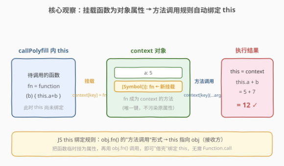
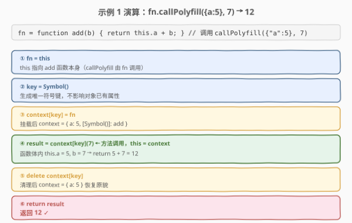

# 使用自定义上下文调用函数

- **题目名称**：使用自定义上下文调用函数
- **链接**：[2693. 使用自定义上下文调用函数](https://leetcode.cn/problems/call-function-with-custom-context/)
- **难度**：中等
- **标签**：函数、原型、this 绑定

## 1. 题目概述

增强所有函数，使其具有 `callPolyfill` 方法。该方法接收一个对象 `obj` 作为第一个参数，以及任意数量的附加参数。`obj` 成为函数的 `this` 上下文。附加参数将传递给该函数（即 `callPolyfill` 方法所属的函数）。

例如，如果有以下函数：

```javascript
function tax(price, taxRate) {
  const totalCost = price * (1 + taxRate);
  console.log(`The cost of ${this.item} is ${totalCost}`);
}
```

调用 `tax(10, 0.1)` 将输出 `"The cost of undefined is 11"`。这是因为 `this` 上下文未定义。

然而，调用 `tax.callPolyfill({item: "salad"}, 10, 0.1)` 将输出 `"The cost of salad is 11"`。`this` 上下文被正确设置，函数输出了适当的结果。

> 请在**不使用内置的 `Function.call` 方法**的情况下解决这个问题。

**示例 1**：

```text
输入：
fn = function add(b) {
  return this.a + b;
}
args = [{"a": 5}, 7]
输出：12
解释：
fn.callPolyfill({"a": 5}, 7); // 12
callPolyfill 将 "this" 上下文设置为 {"a": 5}，并将 7 作为参数传递。
```

**示例 2**：

```text
输入：
fn = function tax(price, taxRate) {
  return `The cost of the ${this.item} is ${price * taxRate}`;
}
args = [{"item": "burger"}, 10, 1.1]
输出："The cost of the burger is 11"
解释：
callPolyfill 将 "this" 上下文设置为 {"item": "burger"}，并将 10 和 1.1 作为附加参数传递。
```

**约束条件**：

- `typeof args[0] == 'object' and args[0] != null`
- `1 <= args.length <= 100`
- `2 <= JSON.stringify(args[0]).length <= 10^5`

> 💡 本题是 LeetCode「30 天 JavaScript」系列，**仅提供 JavaScript / TypeScript 提交入口**，核心考察对 `this` 绑定规则的理解与 `call` 的底层实现。本文以 JS 为提交语言，并给出 Python 概念等价实现。

---

## 2. 解题思路

### 2.1 取巧思路：直接用 bind / apply

题目只禁止 `Function.call`，并未禁止 `bind` 和 `apply`。最省事的写法是一行 `bind`：

```javascript
Function.prototype.callPolyfill = function(context, ...args) {
    return this.bind(context)(...args); // bind 返回绑定了 this 的新函数，立即调用
};
```

或用 `apply`：

```javascript
Function.prototype.callPolyfill = function(context, ...args) {
    return this.apply(context, args); // apply 接收数组参数
};
```

两者都能 AC，但**完全没有触及 `this` 绑定的本质**——`bind`/`apply` 内部就是用机制实现的，本题要求正是手写这个机制。面试中写这种"取巧答案"等于没答。

### 2.2 核心观察：利用"方法调用"的隐式绑定规则



JavaScript 的 `this` 绑定有四条规则，按优先级从低到高：

| 规则 | 触发形式 | `this` 指向 |
|------|----------|-------------|
| 默认绑定 | `fn()`（裸函数调用） | `undefined`（严格模式）/ 全局对象（非严格） |
| 隐式绑定（方法调用） | `obj.fn()` | `obj`（接收方对象） |
| 显式绑定 | `fn.call(obj)` / `apply` / `bind` | `obj` |
| `new` 绑定 | `new fn()` | 新创建的对象 |

题目禁用了**显式绑定**（`call`），但**隐式绑定**天然可用——只要让函数以"对象方法"的形式被调用即可。

关键洞察：**把函数临时挂载为 `context` 的一个属性，再用 `context[key](...args)` 调用它**。此时触发的是隐式绑定规则，函数体内的 `this` 自动指向 `context`（方法调用的接收方）。调用完毕后删除该属性，恢复对象原貌。

| 步骤 | 操作 | 作用 |
|------|------|------|
| 取函数 | `const fn = this` | `callPolyfill` 由函数调用，`this` = 被调函数 |
| 建唯一键 | `const key = Symbol()` | 保证不覆盖对象已有属性 |
| 挂载 | `context[key] = fn` | 让 fn 成为 context 的方法 |
| 调用 | `const result = context[key](...args)` | 方法调用 → `this` = context |
| 清理 | `delete context[key]` | 删除临时属性，不污染原对象 |
| 返回 | `return result` | 透传函数返回值 |

> ⚠️ **为什么用 `Symbol()` 而非固定字符串键（如 `__fn__`）？** 若 `context` 恰好已有 `__fn__` 属性，挂载会**覆盖原值**造成数据丢失。`Symbol()` 每次返回全局唯一符号，绝不会与任何字符串键冲突——这是生产级实现的关键。经典面试手写 `call` 常用 `'__fn' + Date.now()` 之类的随机键，但 `Symbol` 是最干净的方案。

### 2.3 算法流程图


六步线性流程，核心是第④步——`context[key](...args)` 这一刻 `this` 被绑定。前三步是"准备挂载"，后两步是"清理善后"。

### 2.4 示例演算



以**示例 1** 为例，`fn = function add(b) { return this.a + b; }`，调用 `fn.callPolyfill({"a":5}, 7)`：

1. **取函数**：`callPolyfill` 内 `this` 指向 `add` 函数本身（因为 `fn.callPolyfill(...)` 是方法调用，`callPolyfill` 内部的 `this` = `fn`）；
2. **建唯一键**：`key = Symbol()`，得一个全局唯一符号；
3. **挂载**：`context[key] = add`，此时 `context = { a: 5, [Symbol()]: add }`；
4. **调用**：`context[key](7)` → 方法调用，函数体内 `this = context`，故 `this.a + b = 5 + 7 = 12`；
5. **清理**：`delete context[key]`，`context` 恢复为 `{ a: 5 }`；
6. **返回**：`return 12`。

> 💡 注意第 1 步的 `this` 与第 4 步的 `this` **不是同一个 `this`**：第 1 步的 `this` 是 `callPolyfill` 自身的 `this`（=被调函数 `add`）；第 4 步的 `this` 是 `add` 函数体执行时的 `this`（=被绑定的 `context` 对象）。理解这两层 `this` 是本题的关键。

---

## 3. 参考代码

### JavaScript（提交语言）

```javascript
/**
 * @param {Object} context
 * @param {Array} args
 * @return {null|boolean|number|string|Array|Object}
 */
Function.prototype.callPolyfill = function (context, ...args) {
    const fn = this;            // callPolyfill 的 this = 被调函数
    const key = Symbol();       // 全局唯一键，不覆盖已有属性
    context[key] = fn;          // 挂载为方法
    const result = context[key](...args); // 方法调用 → this 绑定为 context
    delete context[key];        // 清理临时属性
    return result;             // 透传返回值
};
```

> 💡 六行即 AC。核心就一句 `context[key](...args)`——"挂上再以方法形式调"，`this` 绑定在这一刻自动发生。

### TypeScript

```typescript
type JSONValue =
    | null
    | boolean
    | number
    | string
    | JSONValue[]
    | { [key: string]: JSONValue };

interface Function {
    callPolyfill(
        context: Record<string, JSONValue>,
        ...args: JSONValue[]
    ): JSONValue;
}

Function.prototype.callPolyfill = function (
    context: Record<string, JSONValue>,
    ...args: JSONValue[]
): JSONValue {
    const fn = this as (...a: JSONValue[]) => JSONValue;
    const key = Symbol();
    (context as any)[key] = fn;
    const result = (context as any)[key](...args) as JSONValue;
    delete (context as any)[key];
    return result;
};
```

### Python（概念等价）

> 本题 LeetCode 仅开放 JS/TS，Python 版作概念对照。Python 没有"隐式 `this`"绑定——方法接收方是通过**显式第一个参数 `self`** 传递的，但"把函数临时绑到对象上再调用"的思想完全相通。

```python
import types


def call_polyfill(fn, context, *args):
    # types.MethodType(fn, context) 等价于把 fn 绑定为 context 的方法，
    # 调用时自动把 context 作为第一个参数（self）传入，对应 JS 的 this 绑定。
    bound = types.MethodType(fn, context)
    return bound(*args)


# 等价于 JS 的：
#   fn.callPolyfill({a: 5}, 7)  ->  fn 以 {a:5} 为 this 执行 (b=7)

# 示例对照
def add(self, b):
    return self.a + b


ctx = type("Ctx", (), {"a": 5})()  # 一个有 a=5 属性的对象
print(call_polyfill(add, ctx, 7))  # 12
```

> ⚠️ Python 与 JS 的关键差异：JS 的 `this` 是**隐式**绑定（由调用形式决定），Python 的 `self` 是**显式**参数（由 `types.MethodType` 在绑定时塞进第一个位置）。所以 Python 无需"挂载属性"技巧——`MethodType` 直接完成绑定，但思想一致：**让对象成为函数的接收方**。

---

## 4. 复杂度分析

| 维度 | 复杂度 | 说明 |
|------|--------|------|
| 时间复杂度 | $O(1)$ | 仅常数次属性读写 + 一次函数调用；函数本身执行的耗时与 `callPolyfill` 无关 |
| 空间复杂度 | $O(1)$ | 额外分配一个 `Symbol` 键和一个 `result` 引用；挂载的函数引用在 `delete` 后可被 GC |

> 💡 `callPolyfill` 本身的开销是常数级的——真正的计算量在被调函数体内，与 polyfill 实现无关。

---

## 5. 扩展：call / apply / bind 三兄弟与 this 绑定四规则

### 5.1 call、apply、bind 的区别

| 方法 | 参数形式 | 执行时机 | 返回值 |
|------|----------|----------|--------|
| `fn.call(obj, a, b)` | 逐个传参 | **立即执行** | 函数返回值 |
| `fn.apply(obj, [a, b])` | 数组传参 | **立即执行** | 函数返回值 |
| `fn.bind(obj, a, b)` | 逐个传参 | **不执行**，返回新函数 | 绑定了 `this` 的新函数 |

- `call` 与 `apply` 完全等价，只是参数传递形式不同（逐个 vs 数组）；
- `bind` 是"惰性"的——它返回一个**永久绑定**了 `this` 的新函数，不立即执行。

### 5.2 手写 call 的经典实现（字符串键版）

工业级实现（兼容旧引擎无 `Symbol` 时）用随机字符串键防冲突：

```javascript
Function.prototype.myCall = function (context, ...args) {
    context = context || globalThis; // null/undefined 时回退全局对象
    const key = "__fn_" + Math.random().toString(36).slice(2);
    context[key] = this;
    const result = context[key](...args);
    delete context[key];
    return result;
};
```

> ⚠️ 完整版还需处理 `context` 为 `null`/`undefined`（回退 `globalThis`）和原始值（`Object(context)` 装箱）的情况。本题约束保证 `context` 是非空对象，故省略这些处理。

### 5.3 this 绑定四规则优先级

优先级从高到低：`new` 绑定 > 显式绑定（call/apply/bind）> 隐式绑定（方法调用）> 默认绑定。

```javascript
function foo() { console.log(this.a); }
const obj1 = { a: 1, foo };
const obj2 = { a: 2 };

obj1.foo();              // 1  隐式绑定 → obj1
obj1.foo.call(obj2);     // 2  显式 > 隐式
new (obj1.foo.bind(obj2))(); // new > 显式（new 创建新对象，a 为 undefined）
foo();                   // undefined（严格模式默认绑定）
```

> 💡 本题的技巧正是**把"显式绑定"降级为"隐式绑定"来实现**——既然不能直接用 `call`（显式），就让函数以方法形式调用（隐式），殊途同归。

---

## 6. 面试要点

1. **为什么挂载为属性再以方法形式调用就能绑定 `this`？**

   > JavaScript 的隐式绑定规则：当函数作为对象的方法被调用（`obj.fn()`），函数执行时的 `this` 指向接收方对象 `obj`。把函数临时挂为 `context` 的属性，再以 `context[key]()` 调用，就触发了这条规则，`this` 自动指向 `context`。

2. **为什么要用 `Symbol()` 作为键，而不是固定字符串 `"fn"`？**

   > 若 `context` 已有同名属性（如恰好有 `fn` 键），挂载会覆盖原值导致数据丢失。`Symbol()` 每次生成全局唯一符号，绝不会与任何字符串键冲突。`delete context[key]` 后对象恢复原貌，零副作用。没有 `Symbol` 的旧环境可用随机字符串键（`"__fn_" + Math.random()`）近似。

3. **`callPolyfill` 里的 `this` 和最终函数体内的 `this` 是同一个吗？**

   > 不是。`callPolyfill` 里的 `this` 是被调函数本身（因为 `fn.callPolyfill()` 是方法调用，`this` = `fn`）；而最终函数体内的 `this` 是被绑定的 `context` 对象。两者层次不同：前者用来"拿到函数"，后者是"要绑定的目标"。

4. **不用 call/apply/bind，还有别的方式设置 `this` 吗？**

   > 有。（1）隐式绑定（本题方法）：挂为属性再方法调用；（2）`new` 绑定：`new` 构造函数时 `this` 指向新对象；（3）箭头函数：箭头函数本身没有 `this`，继承外层词法作用域的 `this`，虽不能"设置"但能"继承"。面试常考"还有哪些方式改变 this"——隐式绑定是最朴素的一种。

5. **`delete context[key]` 能删掉 `Symbol` 键吗？需要特别处理吗？**

   > 能。`delete` 对 `Symbol` 键和字符串键一视同仁，只要该属性是**可配置的**（`configurable: true`）。直接挂载的属性默认 `configurable: true`，所以 `delete context[symbolKey]` 正常生效。若 `context` 是被冻结（`Object.freeze`）的对象，`delete` 会静默失败（非严格模式）或抛 `TypeError`（严格模式），但本题约束不涉及冻结对象。

> 💡 **一句话总结**：2693 = 「`callPolyfill` 内 `this` = 被调函数；把函数挂为 `context` 的 `Symbol` 属性，以 `context[key](...args)` 方法调用触发隐式绑定，`this` 自动指向 `context`，最后 `delete` 清理」。本质是用手写"隐式绑定"替代被禁用的"显式绑定"。

---

## 7. 同类练习题

- [2666. 只允许一次函数调用](https://leetcode.cn/problems/allow-one-function-call/)：闭包 + 标志位保证函数只执行一次，与本题"闭包持状态"思想相通（[题解](../2601-2700/2666_只允许一次函数调用.md)）
- [2629. 复合函数](https://leetcode.cn/problems/function-composition/)：`reduceRight` 链式调用函数，考察函数作为一等公民与闭包传参（[题解](../2601-2700/2629_复合函数.md)）
- [2632. 柯里化](https://leetcode.cn/problems/curry/)：用闭包逐步收集参数，`this` 绑定与参数收集的思想交叉（[题解](../2601-2700/2632_柯里化.md)）
- [2667. 创建 Hello World 函数](https://leetcode.cn/problems/create-hello-world-function/)：最朴素的闭包返回函数，承接"函数返回函数 + this/参数"的理解（[题解](../2601-2700/2667_创建HelloWorld函数.md)）
