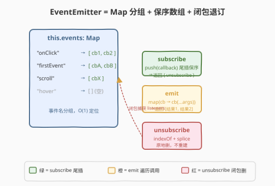
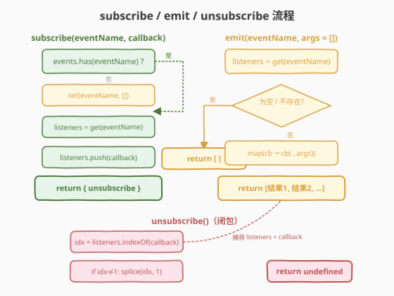

# 事件发射器

- **题目名称**：事件发射器
- **链接**：[2694. Event Emitter](https://leetcode.cn/problems/event-emitter/)
- **难度**：中等
- **标签**：设计、哈希表、闭包、发布订阅

## 1. 题目概述

设计一个 `EventEmitter` 类，接口与 Node.js / DOM 的 EventTarget 相似，支持**订阅事件**与**触发事件**。

**两个方法**：

- **`subscribe(eventName, callback)`**：订阅事件，接收事件名（字符串）和回调函数。一个事件可以有**多个监听器**，触发时按**订阅顺序**依次调用。返回一个对象 `{ unsubscribe }`，调用 `unsubscribe()` 可从订阅列表移除该回调并返回 `undefined`。可以假设传入 `subscribe` 的回调函数**互不引用相等**。
- **`emit(eventName, args = [])`**：触发事件，将 `args` 数组展开传给所有该事件的回调。若无订阅者返回**空数组** `[]`；否则按订阅顺序返回**所有回调的返回值数组**。

**示例 1**：

```text
输入：
actions = ["EventEmitter", "emit", "subscribe", "subscribe", "emit"]
values   = [[], ["firstEvent"], ["firstEvent", "function cb1() { return 5; }"], ["firstEvent", "function cb1() { return 6; }"], ["firstEvent"]]
输出：[[],["emitted",[]],["subscribed"],["subscribed"],["emitted",[5,6]]]
解释：
const emitter = new EventEmitter();
emitter.emit("firstEvent");                       // [], 无订阅者
emitter.subscribe("firstEvent", cb1);             // cb1 返回 5
emitter.subscribe("firstEvent", cb2);             // cb2 返回 6
emitter.emit("firstEvent");                       // [5, 6]
```

**示例 2**（emit 接收可选参数数组）：

```text
输入：
actions = ["EventEmitter", "subscribe", "emit", "emit"]
values   = [[], ["firstEvent", "function cb1(...args) { return args.join(','); }"], ["firstEvent", [1,2,3]], ["firstEvent", [3,4,6]]]
输出：[[],["subscribed"],["emitted",["1,2,3"]],["emitted",["3,4,6"]]]
解释：cb1 = (...args) => args.join(','); emit("firstEvent", [1,2,3]) → ["1,2,3"]
```

**示例 3**（unsubscribe 后 emit 返回空）：

```text
输入：
actions = ["EventEmitter", "subscribe", "emit", "unsubscribe", "emit"]
values   = [[], ["firstEvent", "(...args) => args.join(',')"], ["firstEvent", [1,2,3]], [0], ["firstEvent", [4,5,6]]]
输出：[[],["subscribed"],["emitted",["1,2,3"]],["unsubscribed",0],["emitted",[]]]
解释：sub.unsubscribe() 后无订阅者，emit 返回 []。
```

**示例 4**（退订第一个，保留第二个）：

```text
输入：
actions = ["EventEmitter", "subscribe", "subscribe", "unsubscribe", "emit"]
values   = [[], ["firstEvent", "x => x + 1"], ["firstEvent", "x => x + 2"], [0], ["firstEvent", [5]]]
输出：[[],["subscribed"],["subscribed"],["unsubscribed",0],["emitted",[7]]]
解释：退订 cb1（x => x+1）后仅剩 cb2（x => x+2），emit("firstEvent", [5]) → [5+2] = [7]。
```

**约束条件**：

- `1 <= actions.length <= 10`
- `values.length === actions.length`
- 所有测试用例均有效（无需处理退订不存在订阅的边界）
- 只有 4 种操作：`EventEmitter`、`emit`、`subscribe`、`unsubscribe`
- `emit` 接收 1 或 2 个参数（事件名 + 可选参数数组）
- `subscribe` 接收 2 个参数（事件名 + 回调）
- `unsubscribe` 接收 1 个参数（之前订阅的序号，从 0 开始）

> 💡 本题是 LeetCode「30 天 JavaScript」系列，**仅提供 JavaScript / TypeScript 提交入口**，核心考察**发布订阅模式**与**闭包封装 unsubscribe**。本文以 JS 为提交语言，并给出 TypeScript 与 Python 概念等价实现。

---

## 2. 解题思路

### 2.1 暴力思路：扁平订阅列表

用一个**单一的扁平数组**存储所有订阅记录 `{ eventName, callback }`，不区分事件名分组：

```javascript
class EventEmitter {
    constructor() { this.subs = []; }
    subscribe(eventName, callback) {
        this.subs.push({ eventName, callback });
        return {
            unsubscribe: () => {
                this.subs = this.subs.filter(s => s.callback !== callback);
            }
        };
    }
    emit(eventName, args = []) {
        return this.subs
            .filter(s => s.eventName === eventName)
            .map(s => s.callback(...args));
    }
}
```

可行但差劲，三个问题：

1. **`emit` 扫描全部订阅**：每次触发任一事件都要遍历**所有事件**的订阅记录做 `eventName` 过滤，复杂度 $O(N)$（$N$ = 全部订阅总数），而非仅扫该事件的 $O(k)$。
2. **`unsubscribe` 重建整个数组**：`.filter()` 分配新数组并拷贝全部未删元素，$O(N)$；若同一回调引用被用于多个事件名，还会**误删其它事件的同引用订阅**。
3. **无分组索引**：事件名仅是记录里的一个字段，查询时要逐条比对，丧失了"按事件名直接定位"的能力。

问题本质：把"按 key 分组"的 Map 结构退化成了"扁平线性表 + 字段过滤"，丢掉了 $O(1)$ 定位能力。

### 2.2 核心观察：Map 分组 + 闭包捕获精确退订



关键洞察：**用 `Map<eventName, callback[]>` 按事件名分组**，让 `emit` 的 $O(1)$ 事件定位 + $O(k)$ 遍历成为可能；**闭包捕获 `listeners` 数组引用与 `callback` 引用**，使 `unsubscribe` 精确定位删除而不重建。

数据结构：

| 字段 | 类型 | 职责 | 类比 |
|------|------|------|------|
| `this.events` | `Map<string, Function[]>` | 事件名 → 回调数组（保序） | "公告板按频道分栏" |
| `listeners`（闭包变量） | `Function[]` | subscribe 时捕获的该事件回调数组引用 | "该频道的登记簿" |
| `callback`（闭包变量） | `Function` | 本次订阅的回调引用 | "登记簿上的一行" |

**三条路径**：

- **`subscribe`**：若 `Map` 中无该事件名则 `set` 一个空数组；取出数组引用 `listeners`，`push(callback)`；返回 `{ unsubscribe }`，闭包捕获 `listeners` 与 `callback`，用 `indexOf` + `splice` **精确移除首个匹配**（不重建数组、不误删同引用的其它事件订阅）。
- **`emit`**：`Map.get(eventName)` 取出该事件的回调数组；为空或不存在则返回 `[]`；否则 `map(cb => cb(...args))` 按序调用并收集返回值。
- **`unsubscribe`**：`listeners.indexOf(callback)` 定位下标，`splice(idx, 1)` 原地删除——**O(k) 且不分配新数组**。

> ⚠️ **闭包必须捕获 `listeners` 数组引用而非 `eventName` 再回查**：若退订闭包内写 `this.events.get(eventName)`，当 `unsubscribe` 被异步调用时 `this` 绑定可能丢失（箭头函数无自有 `this`，此处闭包用的箭头函数捕获外层 `this`，但更稳妥的是直接捕获数组引用）。捕获 `listeners` 让退订**只依赖数组本身**，与 `this` / `Map` 状态解耦。由于我们只 `push` / `splice` 原地修改、**从不替换数组**，捕获的引用始终有效。

> 💡 **`indexOf` + `splice` vs `filter` 的取舍**：题目保证回调互不引用相等，两种删法结果一致。但 `splice` 原地删除 $O(k)$ 无额外分配；`filter` 重建数组 $O(N)$ 且会改变 `Map` 里的值引用（若闭包捕获的是旧引用则失效）。故 `splice` 更优。

### 2.3 算法流程图



上半为 **`subscribe` 路径**：取 Map → 无则建空数组 → 尾插回调 → 返回闭包 `unsubscribe`。右下为 **`emit` 路径**：取数组 → 空则 `[]` → 否则 `map` 展开调用收集返回值。左下为 **`unsubscribe` 路径**：`indexOf` 定位 → `splice` 原地删 → 返回 `undefined`。三条路径通过共享的 `listeners` 数组引用解耦。

### 2.4 示例演算

![示例 4 逐步演算：订阅 x+1 与 x+2，退订 x+1，emit [5] → [7]](../images/2694_event_emitter_walkthrough.svg)

以示例 4 为例追踪 `Map` 与回调数组的变化：

| 步骤 | 操作 | `events.get("firstEvent")` | 说明 |
|------|------|---------------------------|------|
| 1 | `new EventEmitter()` | `undefined`（Map 空） | 初始无任何订阅 |
| 2 | `subscribe("firstEvent", x => x+1)` | `[cb1]` | 建 `["firstEvent"] → []`，`push` cb1；返回闭包 `sub1` |
| 3 | `subscribe("firstEvent", x => x+2)` | `[cb1, cb2]` | 数组已存在，`push` cb2；返回闭包 `sub2` |
| 4 | `sub1.unsubscribe()` | `[cb2]` | 闭包 `indexOf(cb1)` = 0，`splice(0,1)` 原地删；cb1 移除 |
| 5 | `emit("firstEvent", [5])` | `[cb2]`（不变） | `map` → `cb2(5)` = 7 → 返回 `[7]` |

> 💡 **关键：退订 cb1 后数组从 `[cb1, cb2]` 变 `[cb2]`**，`emit` 只遍历到 cb2。若用暴力 `filter` 重建数组，闭包 `sub2` 捕获的旧引用会指向被丢弃的 `[cb1, cb2]`，导致后续退订失效——这正是 `splice` 原地删除的价值。

---

## 3. 参考代码

### JavaScript（提交语言）

```javascript
class EventEmitter {
    constructor() {
        // Map<eventName, Function[]>：按事件名分组，回调数组保序
        this.events = new Map();
    }

    /**
     * @param {string} eventName
     * @param {Function} callback
     * @return {Object}
     */
    subscribe(eventName, callback) {
        if (!this.events.has(eventName)) {
            this.events.set(eventName, []);
        }
        const listeners = this.events.get(eventName);
        listeners.push(callback);

        return {
            unsubscribe: () => {
                const idx = listeners.indexOf(callback);
                if (idx !== -1) {
                    listeners.splice(idx, 1);
                }
            }
        };
    }

    /**
     * @param {string} eventName
     * @param {Array} args
     * @return {Array}
     */
    emit(eventName, args = []) {
        const listeners = this.events.get(eventName);
        if (!listeners || listeners.length === 0) {
            return [];
        }
        return listeners.map(cb => cb(...args));
    }
}
```

> 💡 闭包箭头函数捕获 `listeners`（数组引用）与 `callback`，不依赖 `this`，即使 `unsubscribe` 被解构调用（`const { unsubscribe } = sub; unsubscribe();`）也安全。`splice` 原地删除保证数组引用不变，闭包始终指向正确的 `listeners`。

### TypeScript

```typescript
type Callback = (...args: any[]) => any;
type Subscription = { unsubscribe: () => void };

class EventEmitter {
    private events: Map<string, Callback[]> = new Map();

    subscribe(eventName: string, callback: Callback): Subscription {
        if (!this.events.has(eventName)) {
            this.events.set(eventName, []);
        }
        const listeners = this.events.get(eventName)!;
        listeners.push(callback);

        return {
            unsubscribe: () => {
                const idx = listeners.indexOf(callback);
                if (idx !== -1) {
                    listeners.splice(idx, 1);
                }
            }
        };
    }

    emit(eventName: string, args: any[] = []): any[] {
        const listeners = this.events.get(eventName);
        if (!listeners || listeners.length === 0) {
            return [];
        }
        return listeners.map(cb => cb(...args));
    }
}
```

### Python（概念等价）

> 本题 LeetCode 仅开放 JS/TS，Python 版作概念对照。Python 用 `dict` + `list` 等价 `Map` + `Function[]`，闭包用 `nonlocal` 捕获列表引用。

```python
from typing import Callable, Any


class EventEmitter:
    def __init__(self):
        self.events: dict[str, list[Callable]] = {}

    def subscribe(self, event_name: str, callback: Callable) -> dict:
        if event_name not in self.events:
            self.events[event_name] = []
        listeners = self.events[event_name]
        listeners.append(callback)

        def unsubscribe() -> None:
            idx = listeners.index(callback) if callback in listeners else -1
            if idx != -1:
                listeners.pop(idx)

        return {"unsubscribe": unsubscribe}

    def emit(self, event_name: str, args: list = []) -> list:
        listeners = self.events.get(event_name)
        if not listeners:
            return []
        return [cb(*args) for cb in listeners]
```

> ⚠️ Python 闭包捕获 `listeners`（`list` 是引用类型，`append` / `pop` 原地修改）与 `callback`，与 JS 行为一致。`list.index` 在元素不存在时抛 `ValueError`，故先 `in` 判定或 `try/except`。

---

## 4. 复杂度分析

| 维度 | 复杂度 | 说明 |
|------|--------|------|
| `subscribe` 时间 | $O(1)$ | `Map.has` + `Map.get` 均 $O(1)$，`push` 尾插均摊 $O(1)$ |
| `emit` 时间 | $O(k)$ | $k$ = 该事件的订阅数；`Map.get` $O(1)$ + `map` 遍历 $k$ 个回调；与全局订阅总数 $N$ 无关 |
| `unsubscribe` 时间 | $O(k)$ | `indexOf` + `splice` 在该事件的 $k$ 个回调中线性查找 + 原地移除 |
| 空间 | $O(N)$ | $N$ = 全部订阅总数；`Map` 存储 $N$ 个回调引用 + 事件名键 |

> 💡 对比暴力扁平列表：`emit` 从 $O(N)$ 降到 $O(k)$——当事件数远多于单事件订阅数时，优势显著。`unsubscribe` 用 `splice` 原地删避免 `filter` 的 $O(N)$ 重建分配。

---

## 5. 扩展：Node.js EventEmitter 与 once / removeAllListeners

| 能力 | 本题 | Node.js `EventEmitter` | 实现要点 |
|------|------|------------------------|----------|
| 多监听器保序 | ✅ 数组 `push` | ✅ 链表/数组 | 默认上限 10（`defaultMaxListeners`），超限告警 |
| 退订 | ✅ 闭包 `unsubscribe` | `removeListener` / `off` | Node 按引用删除，同 `splice` |
| `once` | ❌ | ✅ 自动退订 | 用 `wrapper` 包裹：调用后先 `splice` 再执行原回调 |
| `removeAllListeners` | ❌ | ✅ 按事件清空 | `Map.delete(eventName)` 或 `set(eventName, [])` |
| 同步 vs 异步 | 同步遍历调用 | 同步 | Node 的 emit 也是同步顺序调用监听器 |

**`once` 的经典实现**——包裹函数自删除后转发：

```javascript
once(eventName, callback) {
    if (!this.events.has(eventName)) this.events.set(eventName, []);
    const listeners = this.events.get(eventName);
    const wrapper = (...args) => {
        const idx = listeners.indexOf(wrapper);   // 用 wrapper 自身定位
        if (idx !== -1) listeners.splice(idx, 1); // 先退订再执行
        return callback(...args);
    };
    listeners.push(wrapper);
    return { unsubscribe: () => {
        const idx = listeners.indexOf(wrapper);
        if (idx !== -1) listeners.splice(idx, 1);
    }};
}
```

> 💡 `wrapper` 必须用 `indexOf(wrapper)` 而非 `indexOf(callback)`——注册的是 `wrapper`，`listeners` 里存的是它的引用。`once` 是 emit 时自删，`unsubscribe` 是用户主动删，两者都操作 `wrapper` 引用。

---

## 6. 面试要点

1. **为什么 unsubscribe 要捕获 `listeners` 数组引用而不是 `eventName` 回查 Map？**

   > 捕获数组引用让退订只依赖数组本身，与 `this` / `Map` 状态解耦。`unsubscribe` 可被解构后独立调用（`const { unsubscribe } = sub;`），此时箭头函数虽捕获外层 `this`，但直接用数组引用更稳妥且更高效——省去一次 `Map.get`。前提：实现中只 `push`/`splice` 原地修改，从不替换数组引用。

2. **`splice` 原地删除 vs `filter` 重建，为什么选 `splice`？**

   > 三点：① `splice` 原地修改不分配新数组，$O(k)$ 无额外空间；`filter` 重建 $O(N)$ 分配新数组。② `filter` 会生成新数组引用，若闭包捕获的是旧引用则退订失效。③ `filter` 按 `callback !== callback` 删除会移除**所有**同引用，而 `indexOf + splice` 只删**首个匹配**——更精确（虽然本题保证引用唯一，`splice` 仍是更稳健的通用选择）。

3. **`emit` 为什么要用 `map` 而非 `forEach`？**

   > `map` 收集每个回调的返回值组成结果数组，恰好满足"返回所有回调调用结果"的要求。`forEach` 返回 `undefined`、不收集结果。若无订阅者返回 `[]`，有则 `map` 生成等长结果数组——`map` 一行同时完成"调用 + 收集"。

4. **题目保证回调互不引用相等，如果不保证呢？**

   > 若同一回调引用被订阅两次（同事件或不同事件），`indexOf + splice` 只删首个匹配，第二个保留——可能与"退订该次订阅"语义冲突。此时应改用**唯一订阅 ID**：每次 `subscribe` 分配递增 `subId`，`listeners` 存 `{id, callback}`，`unsubscribe` 按 `id` 精确删除。这是 Node.js `EventEmitter` 内部的做法。

5. **在 emit 遍历回调数组的过程中，某个回调内部调用了 unsubscribe，会发生什么？**

   > `splice` 会修改正在遍历的数组，导致被删元素后方的回调**跳过**（数组前移、索引越位）。`map` 的遍历基于初始 `length`，`splice` 后剩余元素索引前移，可能跳过紧邻被删者的回调。解决：遍历前拷贝快照 `const snapshot = [...listeners]` 或倒序遍历。本题约束 `actions.length <= 10` 且用例不触发此场景，故无需处理。

> 💡 **一句话总结**：2694 = 「Map 按事件名分组 + 数组保序尾插；闭包捕获数组引用与回调引用，`indexOf` + `splice` 精确退订；`emit` 用 `map` 一行完成调用 + 收集」。发布订阅 = 分组索引 + 保序列表 + 闭包退订。

---

## 7. 同类练习题

- [2671. 频率跟踪器](https://leetcode.cn/problems/frequency-tracker/)：双 Map 维护「值→频率」与「频率→计数」，`add`/`delete` 时同步更新两个索引；与本题「Map 分组 + 原地增删」思想相通（[题解](../2601-2700/2671_频率跟踪器.md)）
- [2666. 只允许一次函数调用](https://leetcode.cn/problems/allow-one-function-call/)：闭包捕获 `called` 布尔标志，首次调用后置位拦截后续；与本题闭包捕获 `listeners` + `callback` 的封装思想一致（[题解](../2601-2700/2666_只允许一次函数调用.md)）
- [2622. 有时间限制的缓存](https://leetcode.cn/problems/cache-with-time-limit/)：`Map<key, {val, timer}>` + `setTimeout` 过期清理，覆盖时必须清旧 timer；与本题「Map 分组存储 + 闭包管理删除」结构相似（[题解](../2601-2700/2622_有时间限制的缓存.md)）
- [2676. 节流](https://leetcode.cn/problems/throttle/)：闭包 + `setTimeout` 管冷却窗口，首沿立即执行 / 尾沿续杯；同为「30 天 JS」系列的闭包设计题，对照"闭包捕获状态控制行为"（[题解](../2601-2700/2676_节流.md)）
