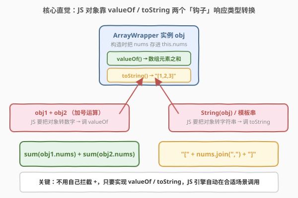
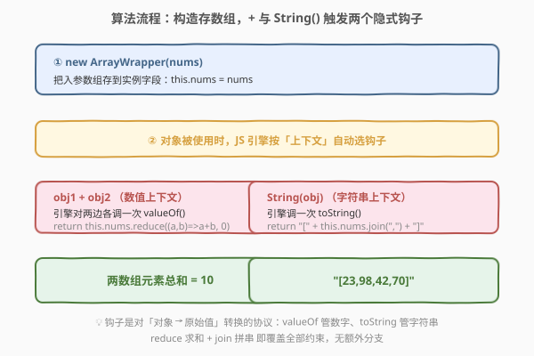
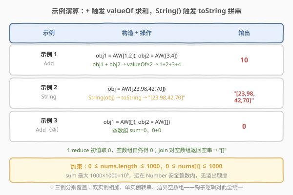

# LeetCode 包装数组 题解

## 1. 题目概述

- **标题 / 题号**：包装数组（#2695，easy）
- **链接**：https://leetcode.cn/problems/array-wrapper/
- **难度**：简单
- **标签**：面向对象、类型转换、运算符重载、`valueOf` / `toString`

**题意**：创建一个名为 `ArrayWrapper` 的类，它在其构造函数中接受一个整数数组作为参数。该类应具有以下两个特性：

- 当使用 `+` 运算符将两个该类的实例相加时，结果值为两个数组中**所有元素的总和**。
- 当在实例上调用 `String()` 函数时，它应返回一个由逗号分隔、括在方括号中的字符串，例如 `"[1,2,3]"`。

**示例 1**：

```text
输入：nums = [[1,2],[3,4]], operation = "Add"
输出：10
解释：
const obj1 = new ArrayWrapper([1,2]);
const obj2 = new ArrayWrapper([3,4]);
obj1 + obj2; // 10
```

**示例 2**：

```text
输入：nums = [[23,98,42,70]], operation = "String"
输出："[23,98,42,70]"
解释：
const obj = new ArrayWrapper([23,98,42,70]);
String(obj); // "[23,98,42,70]"
```

**示例 3**：

```text
输入：nums = [[],[]], operation = "Add"
输出：0
解释：
const obj1 = new ArrayWrapper([]);
const obj2 = new ArrayWrapper([]);
obj1 + obj2; // 0
```

**约束**：

- `0 <= nums.length <= 1000`
- `0 <= nums[i] <= 1000`
- `nums` 是传递给构造函数的数组。

> 💡 本题是 30 Days of JavaScript 系列中的**运算符重载**入门题。它不考算法复杂度，考的是「**对象 → 原始值**」的类型转换协议：JavaScript 不允许像 C++ 那样直接重载 `operator+`，但提供了 `valueOf` 与 `toString` 两个**隐式钩子**——引擎在需要把对象转成数字时会调 `valueOf`，需要转成字符串时会调 `toString`。只要把这两个钩子实现好，`obj1 + obj2` 与 `String(obj)` 就会自动得到题目要求的语义。

## 2. 解题思路

### 2.1 暴力思路：手写 `add` 方法

最直白的「能跑」写法，是给类再加一个显式的 `add` 方法、并在 `toString` 里手拼字符串，调用方自己调方法：

```text
class ArrayWrapper {
  add(other) { return this.sum + other.sum; }   // 但题目用 obj1 + obj2
}
```

问题：题目要求的是 `obj1 + obj2` 这种**运算符语法**，而非 `obj1.add(obj2)` 方法调用。如果只实现 `add` 方法，`obj1 + obj2` 会得到字符串拼接（默认 `"[object Object]"` 之类）或 `NaN`——因为 JS 的 `+` 对普通对象先走 `valueOf`/`toString`，缺省实现得不到数字。**我们不能改写 `+` 的语法，只能改写「对象被 `+` 看到时」如何转成原始值。**

> ⚠️ 这是本题最常见的误区：想「重载 `+`」，但 JS 没有 `operator+` 语法。正解是借道 **类型转换协议**——`+` 两边是对象时，引擎会调 `valueOf` 把对象转成数字再做加法。我们要做的是在 `valueOf` 里吐出「数组之和」，于是 `obj1 + obj2` 自然变成 `sum1 + sum2`。

### 2.2 核心观察：`valueOf` 与 `toString` 两个隐式钩子



**两条语言基石**：

1. **对象到原始值（Object to Primitive）的转换协议**：JS 是弱类型语言，当对象出现在需要原始值的位置（如 `+` 的操作数、`String()` 的参数），引擎不会报错，而是按既定协议调用对象上的特定方法把它「翻译」成原始值。这个协议的两个核心钩子就是：

   - **`valueOf()`**：返回对象的「原始值表示」，默认返回对象自身。**当上下文偏向数值**（如 `+` 两边要相加、`obj - 1`、`obj > 3`）时，引擎优先调 `valueOf`。
   - **`toString()`**：返回对象的字符串表示，默认返回 `"[object Object]"`。**当上下文偏向字符串**（如 `String(obj)`、模板字符串 `${obj}`、`obj + "str"`）时，引擎调 `toString`。

2. **钩子是对「对象 → 原始值」转换的协议**：我们不直接拦截 `+` 运算符，只需实现这两个钩子，引擎会在合适场景自动调用。`ArrayWrapper` 的实现就是：
   - 构造时把 `nums` 存进 `this.nums`；
   - `valueOf` 返回 `this.nums` 的元素之和（一个 number），于是 `obj1 + obj2 = valueOf(obj1) + valueOf(obj2) = sum1 + sum2`；
   - `toString` 返回 `"[" + this.nums.join(",") + "]"`，于是 `String(obj)` 得到题目要求的格式。

> 💡 **为什么 `+` 走 `valueOf` 而不是 `toString`？** JS 的 `+` 语义是「数字相加 或 字符串拼接」：引擎先对两边做 `ToPrimitive(默认 hint)`，默认 hint 下对象优先调 `valueOf`、若 `valueOf` 不返回原始值才退回 `toString`。`ArrayWrapper` 的 `valueOf` 返回了 number，所以 `+` 直接按数字加法进行。把对象转字符串的显式途径是 `String(obj)`，它直接走 `toString`（不经过 `valueOf`），这正是示例 2 的行为。

> ⚠️ **`toString` 不能只 `return this.nums`**：`nums` 是数组对象，`String([1,2,3])` 虽然恰好等于 `"1,2,3"`，但题目要求带方括号 `"[1,2,3]"`，故必须显式 `"[" + join(",") + "]"`。同理 `valueOf` 也不能返回数组本身——数组不是 number，`+` 会退化成字符串拼接。两个钩子**必须各自返回正确类型的原始值**。

### 2.3 算法流程图



整体只有两段：

1. **构造（一次性）**：`new ArrayWrapper(nums)` 把入参数组存到 `this.nums`，不做任何计算——延迟到真正需要时才算。
2. **使用时由引擎选钩子**：
   - `obj1 + obj2`：两边各调一次 `valueOf` → 各自 `reduce` 求和 → 两个 number 相加；
   - `String(obj)`：调一次 `toString` → `join(",")` 拼串 → 前后补方括号。

> 💡 **延迟求值**：构造时不预算 `sum`，每次 `+` 都重新 `reduce`。因为 `this.nums` 在生命周期里不变，也可以在构造时预算 `this.sum = nums.reduce(...)`、`valueOf` 直接返回 `this.sum`，把每次 `+` 的成本从 $O(n)$ 降到 $O(1)$。两种写法都能 AC，本题 $n \le 1000$、调用次数有限，差异可忽略；若构造后只加一次，反而预算更慢（多算一次），所以默认按需 `reduce` 更省。

### 2.4 示例演算



| 示例 | 构造 + 操作 | 触发钩子 | 输出 |
|------|-------------|----------|------|
| 示例 1（Add） | `obj1=AW([1,2])`，`obj2=AW([3,4])`，`obj1+obj2` | `valueOf` × 2 | $1+2+3+4=10$ |
| 示例 2（String） | `obj=AW([23,98,42,70])`，`String(obj)` | `toString` × 1 | `"[23,98,42,70]"` |
| 示例 3（空 Add） | `obj1=AW([])`，`obj2=AW([])`，`obj1+obj2` | `valueOf` × 2 | $0+0=0$ |

三例分别覆盖「双实例相加」「单实例转串」「边界空数组」。空数组时 `reduce` 初值 `0` 自然得 `0`，`join` 对空数组返回空串、再补方括号得 `"[]"`——钩子逻辑对边界天然统一，无需特判。

## 3. 参考代码

### JavaScript（写法一：构造函数 + 原型方法）

```javascript
/**
 * @param {number[]} nums
 * @return {void}
 */
var ArrayWrapper = function (nums) {
    this.nums = nums;
};

/**
 * @return {number}
 */
ArrayWrapper.prototype.valueOf = function () {
    return this.nums.reduce((a, b) => a + b, 0);
};

/**
 * @return {string}
 */
ArrayWrapper.prototype.toString = function () {
    return "[" + this.nums.join(",") + "]";
};

/**
 * const obj1 = new ArrayWrapper([1,2]);
 * const obj2 = new ArrayWrapper([3,4]);
 * obj1 + obj2; // 10
 * String(obj1); // "[1,2]"
 * String(obj2); // "[3,4]"
 */
```

> 💡 这是最贴近题目骨架的写法：构造函数存 `nums`；`valueOf` 用 `reduce` 求和、初值 `0`（关键——空数组也得 `0`）；`toString` 用 `join(",")` 拼元素、前后补方括号。`reduce` 初值给 `0` 同时保证空数组返回 `0` 而非报错。

### JavaScript（写法二：class 语法，更现代）

```javascript
class ArrayWrapper {
    constructor(nums) {
        this.nums = nums;
    }
    valueOf() {
        return this.nums.reduce((a, b) => a + b, 0);
    }
    toString() {
        return "[" + this.nums.join(",") + "]";
    }
}
```

> 💡 `class` 只是构造函数 + 原型方法的语法糖，`valueOf`/`toString` 仍挂在原型上。两者 AC 结果一致，`class` 更简洁、`this` 绑定语义更清晰。`valueOf`/`toString` 是 `Object.prototype` 上的同名方法的重写，属于**覆盖**而非新增。

### JavaScript（写法三：构造时预算 sum，valueOf O(1)）

```javascript
class ArrayWrapper {
    constructor(nums) {
        this.nums = nums;
        this.sum = nums.reduce((a, b) => a + b, 0); // 预算一次
    }
    valueOf() {
        return this.sum; // 每次相加 O(1)
    }
    toString() {
        return "[" + this.nums.join(",") + "]";
    }
}
```

> 💡 当同一实例被反复相加时，把 `sum` 在构造时算好缓存，`valueOf` 直接返回 `this.sum`，每次 `+` 降到 $O(1)$。代价是构造多算一次；若实例只加一次则反而更慢。按 $n \le 1000$、调用有限，三写法实际差异可忽略，按需 `reduce` 的写法一最省心。

### TypeScript

```typescript
class ArrayWrapper {
    private nums: number[];

    constructor(nums: number[]) {
        this.nums = nums;
    }

    valueOf(): number {
        return this.nums.reduce((a, b) => a + b, 0);
    }

    toString(): string {
        return "[" + this.nums.join(",") + "]";
    }
}

/**
 * const obj1 = new ArrayWrapper([1,2]);
 * const obj2 = new ArrayWrapper([3,4]);
 * obj1 + obj2; // 10
 * String(obj1); // "[1,2]"
 * String(obj2); // "[3,4]"
 */
```

> 💡 TS 与 JS 写法几乎一致，只是把 `nums` 显式声明为 `private number[]`，把「构造时存数组、外部不可改」的契约编入类型系统。`valueOf(): number` 与 `toString(): string` 的返回类型也让两个钩子的产出类型一目了然。

### C++

```cpp
#include <numeric>
#include <string>
#include <vector>

class ArrayWrapper {
public:
    explicit ArrayWrapper(std::vector<int> nums) : nums_(std::move(nums)) {}

    // C++ 可直接重载 operator+：obj1 + obj2 调用它
    int operator+(const ArrayWrapper& other) const {
        return sum() + other.sum();
    }

    // 显式转字符串：模仿 JS 的 String(obj) 行为
    std::string toString() const {
        std::string s = "[";
        for (size_t i = 0; i < nums_.size(); ++i) {
            if (i) s += ",";
            s += std::to_string(nums_[i]);
        }
        s += "]";
        return s;
    }

private:
    int sum() const {
        return std::accumulate(nums_.begin(), nums_.end(), 0);
    }
    std::vector<int> nums_;
};
```

> 💡 C++ 与 JS 的关键差异：C++ **能**直接重载 `operator+`，故无需借道 `valueOf` 的类型转换协议——`obj1 + obj2` 直接调用我们写的 `operator+`，返回 `int`。转字符串没有全局 `String()` 约定，用一个 `toString()` 成员模仿。`std::accumulate` 初值 `0` 对应 JS `reduce` 初值 `0`，空数组也得 `0`。C++ 这条路正是 JS `valueOf` 想绕道实现但做不到的「真·运算符重载」。

### Python

```python
class ArrayWrapper:
    def __init__(self, nums):
        self.nums = list(nums)

    # obj1 + obj2 触发
    def __add__(self, other):
        return sum(self.nums) + sum(other.nums)

    # str(obj) / String(obj) 触发
    def __str__(self):
        return "[" + ",".join(map(str, self.nums)) + "]"

# 使用：
# obj1 = ArrayWrapper([1,2]); obj2 = ArrayWrapper([3,4])
# obj1 + obj2          # 10
# str(obj1)            # "[1,2]"
```

> 💡 Python 也支持真·运算符重载：`+` 触发 `__add__`，`str()` 触发 `__str__`，对应 JS 的 `valueOf`/`toString`。`sum([])` 返回 `0`（初值即 0），与 JS `reduce` 给初值 `0` 一致；`",".join(map(str, []))` 对空列表返回空串，拼出 `"[]"`，边界行为与 JS 完全一致。注意 Python 是 `__str__`（人读）而非 `__repr__`（机器读），`str(obj)` 调前者。

> 💡 **三种语言范式对照**：JS 没有运算符重载语法，靠 `valueOf`/`toString` 这套「对象→原始值」协议让引擎在 `+` 与 `String()` 处自动调用——是**间接重载**；C++/Python 直接提供 `operator+`/`__add__`，是**直接重载**。理解这一差异，就理解了 JS 这套协议存在的全部意义：用统一的原语转换接口，弥补「无运算符重载语法」的缺憾。

## 4. 复杂度分析

| 维度 | 复杂度 | 说明 |
|------|--------|------|
| **构造时间** | $O(n)$ | 仅把 `nums` 引用存进 `this.nums`（写法一/二）或额外 `reduce` 预算 sum（写法三） |
| **每次 `+`（valueOf）** | $O(n)$ 写法一/二 / $O(1)$ 写法三 | `reduce` 遍历一次求和；预算版直接返回缓存 |
| **每次 `String()`（toString）** | $O(n)$ | `join` 遍历一次拼串 |
| **空间复杂度** | $O(n)$ | 存数组本身；预算版多存一个 `sum` 仍是 $O(n)$（不算 sum 即 $O(1)$ 额外） |

> 💡 本题 $n \le 1000$，且每个实例在一次用例里通常只被加/转串一两次，$O(n)$ 的 `reduce`/`join` 完全够用。考点在「类型转换协议」而非性能，按需 `reduce` 的写法一最省心、最贴近题目骨架。

## 5. 扩展：`ToPrimitive` 协议与 `Symbol.toPrimitive`

- **`ToPrimitive` 的 hint**：ES 规范定义了对象到原始值的转换算法 `ToPrimitive(input, hint)`，`hint` 取 `"number"` / `"string"` / `"default"` 三种。`+` 运算符用 `default` hint，对普通对象等价于 `number`（先 `valueOf` 后 `toString`）；而 `String()`、模板字符串用 `string` hint（直接 `toString`）。这就是为什么 `obj1 + obj2` 走 `valueOf` 而 `String(obj)` 走 `toString`——`hint` 不同。

- **`Symbol.toPrimitive`（ES6+）**：对象可定义 `[Symbol.toPrimitive](hint)` 方法，**优先级高于** `valueOf`/`toString`，能在一个方法里按 `hint` 分别返回数值或字符串。本题也可这么写：
  ```javascript
  class ArrayWrapper {
      constructor(nums) { this.nums = nums; }
      [Symbol.toPrimitive](hint) {
          if (hint === "number") return this.nums.reduce((a, b) => a + b, 0);
          return "[" + this.nums.join(",") + "]";
      }
  }
  ```
  这样 `obj1 + obj2`（`default`/`number` hint）与 `String(obj)`（`string` hint）都进同一方法、按 `hint` 分流。它比分写 `valueOf`/`toString` 更「集中」，但对本题而言两写法等价——题目骨架给的是 `valueOf`/`toString`，按骨架写即可。

- **何时 `valueOf` 会被绕过？** 若 `valueOf` 返回的不是原始值（如返回对象），`ToPrimitive` 会退回 `toString`。本题把 `valueOf` 返回 number，避免退化。另外 `String(obj)` 是**直接**走 `toString` 的捷径，不先问 `valueOf`——这与 `"" + obj`（走 `ToPrimitive(default)` 先 `valueOf`）有细微差别：若你的 `valueOf` 返回 number，`"" + obj` 会得到 `""` + 数字 = 数字字符串，而不是 `"[1,2,3]"`。题目用 `String(obj)` 测的就是 `toString` 路径，故不会被此差别坑到。

- **与 C++/Python 运算符重载的范式差异**：JS 无 `operator+` 语法，靠「原语转换协议」间接实现；C++ `operator+`、Python `__add__` 是直接重载。这一差异是 JS 语言设计的取舍：用统一的 `ToPrimitive` 接口覆盖所有「对象参与运算」场景，避免为每个运算符各开语法。掌握这条，就理解了 JS 为何偏偏用 `valueOf`/`toString` 这两个看起来「不相干」的方法来支撑 `+` 行为。

## 6. 面试要点

1. **为什么实现 `valueOf` 就能让 `obj1 + obj2` 返回两个数组的总和？**

   > 因为 JS 的 `+` 运算符在两边是对象时，会先按 `ToPrimitive(default)` 把对象转成原始值——默认 hint 下对象优先调 `valueOf`。`ArrayWrapper.valueOf` 返回 `this.nums` 的元素之和（一个 number），于是 `obj1 + obj2` 等价于 `valueOf(obj1) + valueOf(obj2)`，即两个数组之和相加，正是题目要求。我们并不重载 `+`，而是借道类型转换协议让引擎在 `+` 处自动调用我们的钩子。

2. **`String(obj)` 为什么走 `toString` 而不是 `valueOf`？**

   > `String(obj)` 是显式转字符串，规范规定它用 `string` hint 的 `ToPrimitive`，**直接**调 `toString`（不先问 `valueOf`）。这与 `+`（用 `default` hint、优先 `valueOf`）路径不同。故 `toString` 必须自己返回 `"[1,2,3]"` 格式，不能指望 `valueOf` 的数字被自动包方括号——两者是并行的两条钩子，各管各的上下文。

3. **`reduce` 的初值为什么必须给 `0`？不给会怎样？**

   > `reduce` 不给初值时，对空数组会抛 `TypeError: Reduce of empty array with no initial value`。本题示例 3 正是两个空数组相加，不给初值会直接报错。给 `0` 后空数组返回 `0`，`0 + 0 = 0`，与示例 3 一致。同理 `join` 对空数组返回空串，`"[" + "" + "]" = "[]"`，边界天然统一——两个钩子的初值/空集处理是本题最易翻车的小坑。

4. **能不能用 `Symbol.toPrimitive` 一把梭？它和分写 `valueOf`/`toString` 有何区别？**

   > 能。定义 `[Symbol.toPrimitive](hint)`，按 `hint === "number"` 返回数组之和、否则返回 `"[...]"` 字符串，`+` 与 `String()` 都会进这一个方法。`Symbol.toPrimitive` 优先级高于 `valueOf`/`toString`，是 ES6+ 的统一入口。区别在于：分写两个方法更贴合题目骨架、职责更清晰；`Symbol.toPrimitive` 更集中、能在一个方法里分流所有 hint。本题两写法 AC 结果一致，按骨架写 `valueOf`/`toString` 即可。

5. **构造时预算 `sum`（写法三）和按需 `reduce`（写法一）哪个好？**

   > 取决于实例被加的次数。若同一实例被反复相加 $k$ 次：按需版总成本 $O(kn)$，预算版 $O(n) + O(k)$。当 $k > 1$ 时预算版渐近更优；$k = 1$ 时按需版更省（预算版多算一次）。本题 $n \le 1000$、调用有限，差异可忽略，按需 `reduce` 的写法一最省心、也最贴题目骨架；若明确知道实例会复用，再上预算缓存。

## 同类练习题

| # | 题目 | 与本题的关联 |
|---|------|-------------|
| 2667 | [创建 Hello World 函数](https://leetcode.cn/problems/create-hello-world-function/)（[题解](../2601-2700/2667_创建HelloWorld函数.md)） | 同属 30 Days of JS 系列，考「函数是一等值 + 闭包」，对照本题考「对象 + 类型转换协议」——两题都是语言机制入门，一个函数侧、一个对象侧 |
| 2620 | [计数器](https://leetcode.cn/problems/counter/) | 闭包「记住可变状态」，是 JS 语言机制系列的姊妹题；本题的 `this.nums` 与原型方法也是「对象记住状态」的另一种封装范式 |
| 2694 | [事件发射器](https://leetcode.cn/problems/event-emitter/) | 同属 30 Days of JS，考 `on`/`emit`/`off` 的事件协议，对照本题的「对象→原始值」协议——两者都是给对象装一组约定好的钩子方法 |
| 2693 | [使用自定义上下文调用函数](https://leetcode.cn/problems/call-function-with-custom-context/) | 同属 30 Days of JS，考 `call`/`apply` 的 `this` 绑定机制——与本题 `valueOf`/`toString` 同为「对象参与 JS 语言机制的协议」思想，可对比学习 |
