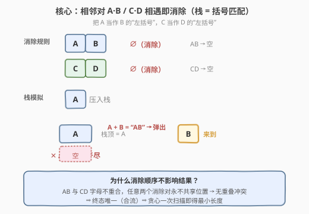
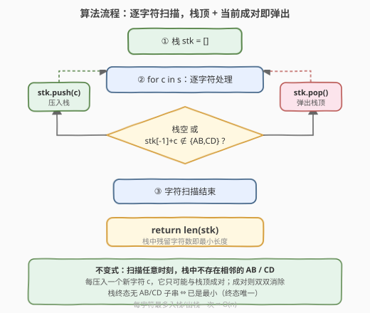
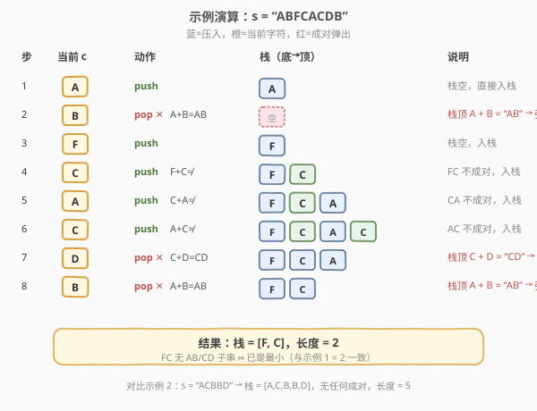

# LeetCode 删除子串后的字符串最小长度 题解

## 1. 题目概述

- **标题 / 题号**：删除子串后的字符串最小长度（#2696，easy）
- **链接**：https://leetcode.cn/problems/minimum-string-length-after-removing-substrings/
- **难度**：简单
- **标签**：栈、字符串、模拟

**题意**：给你一个仅由**大写**英文字母组成的字符串 `s`。

你可以对此字符串执行一些操作，在每一步操作中，你可以从 `s` 中删除**任意一个** `"AB"` 或 `"CD"` 子字符串。

通过执行操作，删除所有 `"AB"` 和 `"CD"` 子串，返回可获得的最终字符串的**最小**可能长度。

**注意**，删除子串后，重新连接出的字符串可能会产生新的 `"AB"` 或 `"CD"` 子串。

**示例 1**

```text
输入：s = "ABFCACDB"
输出：2
解释：你可以执行下述操作：
- 从 "ABFCACDB" 中删除子串 "AB"，得到 s = "FCACDB"。
- 从 "FCACDB" 中删除子串 "CD"，得到 s = "FCAB"。
- 从 "FCAB" 中删除子串 "AB"，得到 s = "FC"。
最终字符串的长度为 2。可以证明 2 是可获得的最小长度。
```

**示例 2**

```text
输入：s = "ACBBD"
输出：5
解释：无法执行操作，字符串长度不变。
```

**约束**：

- `1 <= s.length <= 100`
- `s` 仅由大写英文字母组成

## 2. 解题思路

### 2.1 暴力思路

反复扫描字符串，每次找到一个相邻的 `"AB"` 或 `"CD"` 就删除，直到某次扫描找不到为止。每次扫描 `O(n)`，最坏每轮只删掉一对（如 `"ABABAB…"`），需 `O(n)` 轮，总计 `O(n²)`。

更直观的写法是循环替换：`s = s.replace("AB","").replace("CD","")` 直到 `s` 不再变化。逻辑简单但效率低。

优化方向：删掉一对后，**新暴露出来的相邻关系只发生在被删处的两侧**——也就是说「新成对」只可能涉及**刚刚被删位置左边**的字符与后续字符。这天然适合用**栈**逐字符处理：每来一个新字符，只检查它是否与**栈顶**成对，成对就双双消除。

### 2.2 核心观察：栈 = 括号匹配



把 `A` 看作 `B` 的「左括号」、`C` 看作 `D` 的「左括号」，本问题与 [20. 有效的括号](../0001-0100/20_有效括号.md) 完全同构——后进的左括号最先被匹配，这正是栈的 LIFO 语义。

**核心策略**：

- 逐字符扫描 `s`，用一个栈保存「尚未被消除的字符」。
- 对当前字符 `c`：若**栈非空**且「栈顶 + `c`」恰好是 `"AB"` 或 `"CD"`，则弹出栈顶（这对一并消除）；否则把 `c` 压入栈。
- 扫描结束时，栈中残留字符数即为答案。

> 💡 **为什么消除顺序不影响最终结果？** 这是最关键的正确性保证。`"AB"` 与 `"CD"` 两类消除对的**字母集合互不相交**（一个用 A/B，一个用 C/D），因此任意两个消除对**永远不会共享同一个位置**——即不存在「同一处字符既属于 AB 又属于 CD」的冲突。在字符串重写系统中，这意味着**没有重叠红字（no overlapping redexes）**，从而系统是**合流的（confluent）**：无论按什么顺序消除，最终到达的不可约字符串**唯一**。所以贪心的一次扫描必然得到那个唯一的最小长度，无需回溯/枚举顺序。

> ⚠️ 这一点对「栈解法」必不可少：如果不同消除顺序能产生不同长度，贪心扫描就可能错过最优解。题目里「最小可能长度」之所以等于「任意一种消除到不能再消时的长度」，正源于此合流性。

### 2.3 算法流程图



整体只有一重遍历，每个字符最多入栈一次、出栈一次，因此总时间 $O(n)$。

**不变式**：扫描任意时刻，栈中**不存在相邻的 `AB` / `CD`**。每压入新字符 `c` 时，它只可能与栈顶成对（成对则双双消除，栈顶变回原状之前的字符），所以「无相邻对」始终成立。终止时栈即不可约字符串。

### 2.4 示例演算



以 `s = "ABFCACDB"` 为例：

| 步骤 | 当前 c | 动作 | 栈（底→顶） | 说明 |
|------|--------|------|-------------|------|
| 1 | A | push | `[A]` | 栈空，入栈 |
| 2 | B | pop | `[]` | 栈顶 A + B = "AB" → 弹出 |
| 3 | F | push | `[F]` | 栈空，入栈 |
| 4 | C | push | `[F, C]` | F + C 不成对，入栈 |
| 5 | A | push | `[F, C, A]` | C + A 不成对，入栈 |
| 6 | C | push | `[F, C, A, C]` | A + C 不成对，入栈 |
| 7 | D | pop | `[F, C, A]` | 栈顶 C + D = "CD" → 弹出 |
| 8 | B | pop | `[F, C]` | 栈顶 A + B = "AB" → 弹出 |

扫描结束，栈 = `[F, C]`，长度 = **2** ✓

对照示例 2 `s = "ACBBD"`：扫描中 `AC`、`CB`、`BB`、`BD` 均不成对，全部入栈，最终栈 = `[A, C, B, B, D]`，长度 = **5** ✓（无任何操作可执行，长度不变）。

## 3. 参考代码

### C++

```cpp
class Solution {
public:
    int minLength(string s) {
        string stk;
        for (char c : s) {
            if (!stk.empty() &&
                ((stk.back() == 'A' && c == 'B') ||
                 (stk.back() == 'C' && c == 'D'))) {
                stk.pop_back();   // 栈顶 + c 成对，一并消除
            } else {
                stk.push_back(c); // 否则压入栈
            }
        }
        return stk.size();
    }
};
```

### Python

```python
class Solution:
    def minLength(self, s: str) -> int:
        stk = []
        for c in s:
            if stk and ((stk[-1] == 'A' and c == 'B') or
                         (stk[-1] == 'C' and c == 'D')):
                stk.pop()    # 成对，弹出栈顶
            else:
                stk.append(c)  # 否则压入栈
        return len(stk)
```

> 💡 用字符串/列表当栈即可，无需 `std::stack`，因为最后要的正是「栈中残留内容」的长度。判定条件可写成两个显式 `&&` 分支，直观可读；若消除对变多，可改为 `pairs.count(stk[-1] + c)` 的集合查表写法。

## 4. 复杂度分析

| 维度 | 复杂度 | 说明 |
|------|--------|------|
| **时间** | $O(n)$ | 每个字符最多入栈一次、出栈一次，内层判断为 $O(1)$ |
| **空间** | $O(n)$ | 最坏情况无任何成对（如全为 `"E"`），全部入栈 |

> ⚠️ 没有「成对就 while 循环弹多次」的嵌套——本题每来一个字符至多弹一次（只与栈顶比较）。即便写成 `if` 单次判定也已正确，因为消除后栈顶与新字符已处理完毕，下一个字符会再与新的栈顶比较。

## 5. 扩展：消除对变多 / 不相交性是关键

- **消除对增多时**：若规则扩展为多组不相交字母对（如再加 `EF→∅`、`GH→∅`），栈解法**直接适用**——只要每对内部字母两两不跨组共享，合流性依然成立。把成对判定换成集合查表 `if stk and stk[-1]+c in {"AB","CD","EF","GH"}` 即可。
- **若字母有重叠则会出问题**：假设规则是 `AB→∅` 和 `BC→∅`（共享字母 `B`），那么 `"ABC"` 既可先消 `AB` 得 `"C"`（长 1），也可先消 `BC` 得 `"A"`（长 1）——这里长度恰好相同；但 `"ABBC"` 先消 `AB`→`"BC"`→`""`（长 0），先消 `BC`→`"AB"`→`""`（长 0）。能否合流需具体分析重叠结构。本题两组对字母完全不相交，是最干净的合流情形。
- **原地双指针解法**：若允许修改输入，可用 `top` 写指针模拟栈（左括号写入 `s[top]`，右括号检查 `s[top-1]` 并 `top--`），空间 $O(1)$，思路同 [20. 有效的括号](../0001-0100/20_有效括号.md) 的扩展解法。

## 6. 面试要点

**Q1：为什么用栈而不是反复扫描替换？**
> 反复扫描是 $O(n²)$；而消除一对后「新成对」只可能发生在被删位置的紧邻左侧与后续字符之间，恰好是 LIFO 关系，用栈每来一个字符只与栈顶比较一次，降到 $O(n)$。

**Q2：题目求「最小」长度，贪心消除为何就一定最小？**
> 因为消除规则满足合流性：`AB` 与 `CD` 字母集合不相交，任意两个消除对永不共享位置（无重叠红字），故无论消除顺序如何，最终不可约字符串唯一。所以「任意消到不能再消的结果」就是那个唯一的最小结果，贪心一次扫描即得。

**Q3：每来一个字符只比较一次栈顶够吗，需要 while 循环多次弹出吗？**
> 本题不需要。当前字符 `c` 至多与栈顶成一次对：成对就弹出栈顶，`c` 自身也随之消除（不入栈），处理结束，下一个字符自然与新栈顶比较。写成单次 `if` 即正确，不必写成 `while`。

**Q4：如何把代码泛化到多组消除对？**
> 用集合存所有「右半 + 左半」的拼接串，如 `pairs = {"AB","CD","EF"}`，判定改为 `if stk and stk[-1] + c in pairs: stk.pop()`。只要各组对字母两两不相交，合流性仍成立。

**Q5：与 [20. 有效的括号](../0001-0100/20_有效括号.md) 的本质区别是什么？**
> 20 题是「判定合法性」（左括号必须被同类型右括号闭合、且顺序正确，未闭合即非法）；本题是「计数残留」（把能消的都消掉，问剩多少）。20 题左右括号类型需一一对应（`(`↔`)`），而本题是固定字面对（`A`↔`B`、`C`↔`D`），不涉及类型匹配表，更简单。

## 同类练习题

| # | 题目 | 与本题的关联 |
|---|------|-------------|
| 20 | [有效的括号](https://leetcode.cn/problems/valid-parentheses/)（[题解](../0001-0100/20_有效括号.md)） | 栈匹配括号对的母题，本题是其「固定字面对」的简化变体 |
| 1047 | [删除字符串中的所有相邻重复项](https://leetcode.cn/problems/remove-all-adjacent-duplicates-in-string/) | 栈消除相邻相同对（`aa`/`bb`），结构完全同构，最贴近的姊妹题 |
| 1209 | [删除字符串中的所有相邻重复项 II](https://leetcode.cn/problems/remove-all-adjacent-duplicates-in-string-ii/) | 1047 升级版，需消去连续 k 个相同字符，栈存「字符 + 连续计数」 |
| 844 | [比较含退格的字符串](https://leetcode.cn/problems/backspace-string-compare/) | 栈模拟退格删除，更简单的栈模拟入门题 |
| 735 | [行星碰撞](https://leetcode.cn/problems/asteroid-collision/)（[题解](../0701-0800/735_行星碰撞.md)） | 栈模拟相邻碰撞，但碰撞是双向的（需比较大小），比本题复杂 |
