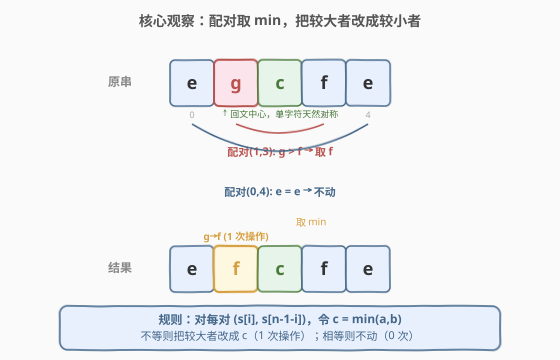
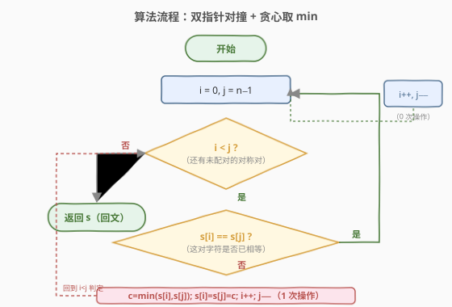
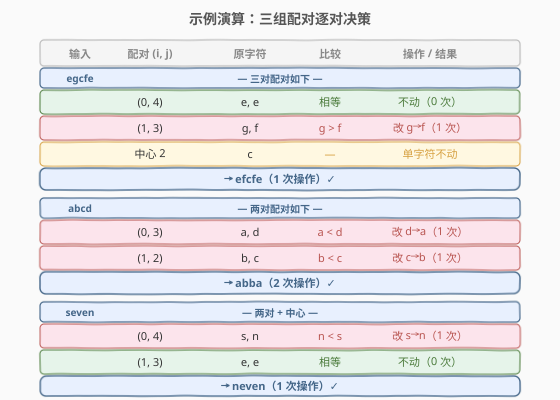

# 字典序最小回文串

- **题目名称**：字典序最小回文串
- **链接**：[2697. 字典序最小回文串](https://leetcode.cn/problems/lexicographically-smallest-palindrome/)
- **难度**：简单
- **标签**：贪心、双指针、字符串

## 1. 题目概述

给你一个由**小写英文字母**组成的字符串 `s`，在一步操作中你可以用**其他小写英文字母替换** `s` 中的一个字符。请你执行**尽可能少的操作**，使 `s` 变成一个**回文串**。如果执行**最少**操作次数的方案不止一种，则只需选取**字典序最小**的方案。返回最终的回文字符串。

字典序的定义：对于两个长度相同的字符串 `a` 和 `b`，在 `a` 和 `b` 出现不同的第一个位置，如果该位置上 `a` 中对应字母比 `b` 中对应字母在字母表中出现顺序更早，则认为 `a` 的字典序比 `b` 要小。

**示例 1**：

```text
输入：s = "egcfe"
输出："efcfe"
解释：将 "egcfe" 变成回文字符串的最小操作次数为 1，修改 1 次得到的字典序最小回文字符串是 "efcfe"，只需将 'g' 改为 'f'。
```

**示例 2**：

```text
输入：s = "abcd"
输出："abba"
解释：将 "abcd" 变成回文字符串的最小操作次数为 2，修改 2 次得到的字典序最小回文字符串是 "abba"。
```

**示例 3**：

```text
输入：s = "seven"
输出："neven"
解释：将 "seven" 变成回文字符串的最小操作次数为 1，修改 1 次得到的字典序最小回文字符串是 "neven"。
```

**约束条件**：

- $1 \le s.\text{length} \le 1000$
- `s` 仅由小写英文字母组成

> 💡 回文串的关键性质：**对称位置必须相等**。即下标 $i$ 与 $n-1-i$ 这一对必须相同。本题主导思想完全围绕「对称配对」展开——每个对称对独立决策，互不影响。

---

## 2. 解题思路

### 2.1 暴力思路：枚举所有改造方案

最朴素的思路：对每个对称对 $(i, n-1-i)$，若两字符不等，可以选「把左边改成右边」「把右边改成左边」甚至「把两边都改成第三个更小的字符」。枚举每对的所有选择，组合爆炸后挑选「操作数最少、字典序最小」的方案。

但这是不必要的复杂化。原因有二：

1. **「操作数最少」是逐对独立的最小化**：一对不等字符必须至少改 1 次才能相等，改两边成第三字符至少 2 次，操作数更多，**直接被「最少操作」约束淘汰**。
2. **「字典序最小」由前半部分决定**：回文串一旦确定，后半部分由前半镜像得到。所以字典序只看 $i < n/2$ 这半边的前若干位，**让靠前的位置尽量小**即可。

因此贪心就够，不必枚举。

### 2.2 核心观察：对称配对 + 贪心取 min



把字符串按下标 $i$ 与 $n-1-i$ **两两配对**，对每一对 $(a, b)$：

- 若 $a = b$：已是回文，**不动**（0 次操作）。
- 若 $a \neq b$：必须让它们相等。最小操作数是 1（只改一个），且字典序最小的选择是**把较大者改成较小者** $c = \min(a, b)$。这样前半位置 $i$ 上拿到的是较小的字符 $c$，使该位尽可能小。

> ⚠️ 为什么不「两边都改成更小的第三字符」？那需要 2 次操作，操作数比 1 次多，违反「最少操作优先」的第一目标。只有当**操作数相同**时才轮到字典序比较——而不等对的 1 次操作方案已是最少，无需再降。

> 💡 **字典序的「贪心优先级」直觉**：字典序比较像比大小数——**高位优先**。回文串前半部分的下标顺序就是字典序的高位到低位。让靠前的对称对拿到尽可能小的字符，等价于让高位尽量小，这与「贪心取 min」天然契合。对靠后位置做更小的选择（即便能更小）也救不回靠前位置的劣势。

### 2.3 算法流程图



用**双指针** $i$ 从左、$j$ 从右向中间对撞，每轮处理一对 $(s[i], s[j])$：

- $i \ge j$ 时所有对称对处理完毕，输出 `s`。
- 否则若 $s[i] = s[j]$：这对已对称，不动，$i{+}{+},\; j{-}{-}$。
- 否则令 $c = \min(s[i], s[j])$，把**两侧都写成 $c$**（即把较大的那个改成较小的），$i{+}{+},\; j{-}{-}$。

把两侧都写成 $c$ 是因为回文要求 $s[i]=s[j]$：较大的位置要改成 $c$，较小的位置原本就是 $c$（保持不变即可，等价于「只改较大者」一次操作）。

### 2.4 示例演算



以三个示例逐对验证：

**示例 1：`"egcfe"`**（$n=5$）

| 配对 | 原字符 | 比较 | 操作 | 结果 |
|------|--------|------|------|------|
| $(0,4)$ | `e, e` | 相等 | 0 次 | `e _ _ _ e` |
| $(1,3)$ | `g, f` | $g > f$ | 改 $g \to f$ | `_ f _ f _` |
| 中心 2 | `c` | — | 0 次 | `_ _ c _ _` |

拼起来：`efcfe`（1 次操作）$\checkmark$

**示例 2：`"abcd"`**（$n=4$）

| 配对 | 原字符 | 比较 | 操作 | 结果 |
|------|--------|------|------|------|
| $(0,3)$ | `a, d` | $a < d$ | 改 $d \to a$ | `a _ _ a` |
| $(1,2)$ | `b, c` | $b < c$ | 改 $c \to b$ | `_ b b _` |

拼起来：`abba`（2 次操作）$\checkmark$。注意 $(0,3)$ 取 $\min=`a`$ 而非 `d`，使高位 `a` 尽量小——这正是字典序最小的关键。

**示例 3：`"seven"`**（$n=5$）

| 配对 | 原字符 | 比较 | 操作 | 结果 |
|------|--------|------|------|------|
| $(0,4)$ | `s, n` | $n < s$ | 改 $s \to n$ | `n _ _ _ n` |
| $(1,3)$ | `e, e` | 相等 | 0 次 | `_ e _ e _` |
| 中心 2 | `v` | — | 0 次 | `_ _ v _ _` |

拼起来：`neven`（1 次操作）$\checkmark$

---

## 3. 参考代码

### C++

```cpp
class Solution {
public:
    string makeSmallestPalindrome(string s) {
        int i = 0, j = (int)s.size() - 1;
        while (i < j) {
            if (s[i] != s[j]) {
                char c = min(s[i], s[j]);   // 取较小字符
                s[i] = s[j] = c;            // 较大者改成 c，较小者保持不变
            }
            ++i;
            --j;
        }
        return s;
    }
};
```

### Python

```python
class Solution:
    def makeSmallestPalindrome(self, s: str) -> str:
        a = list(s)              # str 不可变，转 list 原地改
        i, j = 0, len(a) - 1
        while i < j:
            if a[i] != a[j]:
                c = min(a[i], a[j])   # 取较小字符
                a[i] = a[j] = c       # 较大者改成 c
            i += 1
            j -= 1
        return "".join(a)
```

> 💡 Python 中 `str` 是不可变对象，必须先转 `list` 改完再 `join` 回去；C++ 的 `std::string` 可变，直接原地修改。两端代码逻辑完全一致。

---

## 4. 复杂度分析

| 维度 | 复杂度 | 说明 |
|------|--------|------|
| 时间复杂度 | $O(n)$ | 双指针共走 $\lceil n/2 \rceil$ 对，每对 $O(1)$ 比较/赋值 |
| 空间复杂度 | $O(1)$（C++）/ $O(n)$（Python） | C++ 原地修改 `string`；Python 需转 `list`，逻辑上仍为额外 $O(n)$，但无递归栈 |

> 💡 严格按 LeetCode 约定，输出本身占 $O(n)$（必须返回长度为 $n$ 的字符串），故空间复杂度不计输出。C++ 原地修改输入 `string` 达到 $O(1)$ 额外空间；Python 因 `str` 不可变必须 $O(n)$ 工作区，这是语言语义差异，与算法无关。

---

## 5. 扩展：字典序最小与「最小操作」的双目标优化

本题是典型的**双目标优化**——**第一目标**操作数最少，**第二目标**（仅在前者并列时）字典序最小。处理这类问题的关键是**理清目标的优先级**：

1. **操作数是「硬约束」**：不等对至少 1 次操作，无法更少；相等对 0 次最优。所以「最小操作数 = 不等对的数量」是个**逐对独立的下界**，每对都取到下界即全局最优，互不牵扯。
2. **字典序是「软偏好」**：在每对都取最小操作数（1 次或 0 次）的前提下，再让前半位置尽量小。取 $\min(a,b)$ 正好同时满足「1 次操作」与「该位最小」。

> ⚠️ 如果题目改为「只要求回文、不限操作数，求字典序最小」，则答案会变成「全改成 `a`」（每个位置都最小）。正是「最少操作优先」这一硬约束，让「改两边成更小第三字符」的方案被淘汰，才把解空间收缩到「每对取 $\min$」这一唯一最优。**约束的优先级决定了贪心的形式**。

### 5.1 若允许「替换」之外的「插入/删除」操作

若操作改为「插入或删除一个字符」（类似 [1216. 验证回文串 III](https://leetcode.cn/problems/valid-palindrome-iii/) 那种「最多删 k 个」的设定），问题就不再逐对独立——插入/删除会改变下标对齐关系，需用**区间 DP** 求最长回文子序列。本题主打「原地替换不改变长度」，故贪心成立。

---

## 6. 面试要点

1. **为什么「取较小字符」一定最优？**

   > 不等对必须至少改 1 次才能相等（1 次是下界）。把较大者改成较小者 $c=\min(a,b)$ 正好 1 次，操作数达到下界；同时前半位置 $i$ 拿到 $c$（比保留较大者更小），字典序也最优。两个目标在该选择下同时达成，故为最优。

2. **「把两边都改成更小的第三字符」为何不行？**

   > 那需要 2 次操作（两边都改），操作数比 1 次多，违反「最少操作优先」的第一目标。只有当操作数并列时才轮到字典序比较——而 2 次永远比 1 次多，直接出局。

3. **为什么可以逐对独立决策、互不影响？**

   > 「替换」不改变字符串长度与下标对齐，对称对 $(i, n-1-i)$ 之间互不重叠、互不牵扯。每对取到自身操作数下界（不等对 1 次、相等对 0 次），全局操作数即达到下界之和，无「为整体牺牲局部」的权衡，故贪心成立。

4. **字典序为什么「前半位置优先」？**

   > 回文串一旦前半确定，后半由镜像得到。字典序比较从左到右首位起作用，前半的下标顺序正是「高位到低位」。让靠前的对称对拿到 $\min$ 字符，等价于让高位尽量小，这是字典序贪心的标准优先级。

5. **如果改成「不限操作数、只求字典序最小回文」会怎样？**

   > 答案退化为「全 `a`」——每个位置都改成字母表最小的 `a` 即可。正是因为「最少操作优先」这一硬约束把解空间收缩到「每对只改一次」，才让答案落在「取 $\min$」上。这反过来说明：**约束的优先级塑造了贪心的具体形态**。

---

## 7. 同类练习题

- [266. 回文排列](https://leetcode.cn/problems/palindrome-permutation/)：判断字符串重排后能否成回文。同样是「对称配对」视角，但只计数字符频率，不改字符，可对比「判定型」与本题「构造型」的对称思路
- [9. 回文数](https://leetcode.cn/problems/palindrome-number/)（[题解](../0001-0100/9_回文数.md)）：判断整数是否回文。回文判定母题，承接「对称位置相等」这一核心性质，可对比数字与字符串两种载体的对称判定
- [125. 验证回文串](https://leetcode.cn/problems/valid-palindrome/)：忽略大小写与非字母数字后判回文。双指针对撞判定的入门题，是本题双指针框架的判定版（只判不改）
- [680. 验证回文字符串 II](https://leetcode.cn/problems/valid-palindrome-ii/)：允许删一个字符后判回文。双指针 + 容错一对，承接本题的「对称对撞」但引入「删除改变对齐」的权衡，可对比「替换不改长度」与「删除改长度」的差别
- [214. 最短回文串](https://leetcode.cn/problems/shortest-palindrome/)：在前面加字符使成回文且最短。回文构造的进阶版，用 KMP 失败函数求最长前缀回文，承接本题「对称构造」走向「前缀对称 + 字符串匹配」
