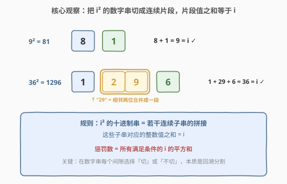
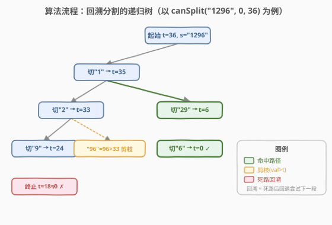
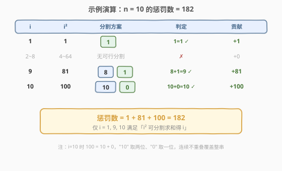

# 求一个整数的惩罚数

- **题目名称**：求一个整数的惩罚数
- **链接**：[2698. 求一个整数的惩罚数](https://leetcode.cn/problems/find-the-punishment-number-of-an-integer/)
- **难度**：中等
- **标签**：数学、回溯

## 1. 题目概述

给你一个正整数 $n$，请你返回 $n$ 的**惩罚数**。

$n$ 的惩罚数定义为所有满足以下条件 $i$ 的数的**平方和**：

- $1 \le i \le n$
- $i \times i$ 的十进制表示的字符串可以**分割成若干连续子字符串**，且这些子字符串对应的整数值之**和等于 $i$**。

**示例 1**：

```text
输入：n = 10
输出：182
解释：总共有 3 个范围在 [1, 10] 的整数 i 满足要求：
- 1 ，因为 1 * 1 = 1
- 9 ，因为 9 * 9 = 81 ，且 81 可以分割成 8 + 1 。
- 10 ，因为 10 * 10 = 100 ，且 100 可以分割成 10 + 0 。
因此，10 的惩罚数为 1 + 81 + 100 = 182
```

**示例 2**：

```text
输入：n = 37
输出：1478
解释：总共有 4 个范围在 [1, 37] 的整数 i 满足要求：
- 1 ，因为 1 * 1 = 1
- 9 ，因为 9 * 9 = 81 ，且 81 可以分割成 8 + 1 。
- 10 ，因为 10 * 10 = 100 ，且 100 可以分割成 10 + 0 。
- 36 ，因为 36 * 36 = 1296 ，且 1296 可以分割成 1 + 29 + 6 。
因此，37 的惩罚数为 1 + 81 + 100 + 1296 = 1478
```

**约束条件**：

- $1 \le n \le 1000$

> 💡 题眼是「把 $i^2$ 的数字串切成连续几段，让段值之和恰好等于 $i$」。每个间隙只有「切」或「不切」两种选择，这天然对应**回溯分割**——与 [93. 复原 IP 地址](https://leetcode.cn/problems/restore-ip-addresses/)、[131. 分割回文串](https://leetcode.cn/problems/palindrome-partitioning/) 同属「字符串连续分段 + 约束校验」家族。

---

## 2. 解题思路

### 2.1 暴力思路：枚举每个 i，穷举所有分割

最直接的拆解：对 $i$ 从 $1$ 遍历到 $n$，每个 $i$ 取 $s = \text{str}(i^2)$，尝试 $s$ 的**所有可能切法**，看是否存在一种切法使各段之和等于 $i$。若存在，就把 $i^2$ 累加进答案。

长度为 $L$ 的数字串有 $L-1$ 个间隙，每个间隙「切/不切」二选一，故共 $2^{L-1}$ 种切法。$n \le 1000$ 时 $i^2 \le 10^6$ 最多 7 位，$2^6=64$ 种切法，规模极小。

但纯枚举（生成全部 $2^{L-1}$ 种再逐一求和判断）会做无用功：很多分支段值早已超过 $i$ 还在继续切。加上**剪枝**即可把搜索树压到极小。

### 2.2 核心观察：递归切分 + 超上剪枝



把判定问题写成递归 $\text{canSplit}(s, \text{pos}, \text{target})$：从 $s$ 的第 $\text{pos}$ 位起，能否切出若干连续段，使段值之和恰为 $\text{target}$（初始 $\text{target}=i$）。

**两步决策**：

1. **选第一段**：从 $\text{pos}$ 起往后吃 $s[\text{pos}:j+1]$ 作为一段，得整数值 $\text{val}$。
2. **递归剩余**：在 $j+1$ 处继续切，目标和减为 $\text{target}-\text{val}$。

**两个剪枝/终止**：

- **超上剪枝**：边吃数字边累乘 $\text{val}=\text{val}\times 10+d$，一旦 $\text{val}>\text{target}$ 立即 `break`。因为继续往后吃数字只会让 $\text{val}$ 更大（所有数字非负），不可能再凑出 $\text{target}$，整个分支作废。
- **终止判定**：$\text{pos}$ 走到串尾时，返回 $\text{target}==0$——切完了，看剩余目标是否恰好归零。

> ⚠️ 注意「段可以有前导 0」吗？如 $i=10$，$100$ 切成 $10+0$，后一段就是单字符 `"0"`，值为 0。本题对子串对应的**整数值**没有禁止前导 0 的约束（不像复原 IP 那样禁 `"01"`），所以 `"0"` 合法、值为 0。累乘 $0\times10+d$ 自然处理，无需特判。

> 💡 **为什么不用 DP？** 判定问题只问「能否」、不问方案数或最值，且 $L\le7$ 极短，回溯 + 剪枝已足够快。DP 反而要额外状态 $(\text{pos},\text{target})$ 与记忆化开销。回溯是这类「分段 + 求和等于定值」问题的最自然写法。

### 2.3 算法流程图



以 $i=36$、$s=\text{"1296"}$、$\text{target}=36$ 为例展开递归树：

- 先切 `"1"`（$\text{val}=1\le36$）→ 递归 $\text{target}=35$：
  - 切 `"2"` → $\text{target}=33$：再切 `"9"` 得 $\text{target}=24$，最后切 `"6"`，串尾剩 $24-6=18\ne0$，**死路回溯**。
  - 回溯后改切 `"29"`（$\text{val}=29\le35$）→ $\text{target}=6$：再切 `"6"`，串尾 $6-6=0$，**命中 ✓**。
- （其他首段如 `"12"`、`"129"` 也会被探索，但只要已找到命中即可 `return true` 提前结束。）

图中绿色为命中路径，橙色为 $\text{val}>\text{target}$ 的剪枝，红色为切完未归零的死路。**回溯的本质**：某段切法走不通时，退回上一层换一种切法继续试，直到找到任一可行解即可返回。

### 2.4 示例演算



以 $n=10$ 逐个验证：

| $i$ | $i^2$ | 分割方案 | 判定 | 贡献 |
|-----|-------|----------|------|------|
| 1 | 1 | `[1]` | $1=1$ ✓ | $+1$ |
| 2~8 | 4~64 | 无可行分割 | ✗ | $+0$ |
| 9 | 81 | `[8][1]` | $8+1=9$ ✓ | $+81$ |
| 10 | 100 | `[10][0]` | $10+0=10$ ✓ | $+100$ |

惩罚数 $= 1 + 81 + 100 = 182$ $\checkmark$

注意 $i=10$ 时 $100$ 切成 `"10"` 与 `"0"` 两段：前者吃两位得 10，后者单字符 `"0"` 得 0，连续不重叠地覆盖了整个串 `"100"`。

---

## 3. 参考代码

### C++

```cpp
class Solution {
public:
    int punishmentNumber(int n) {
        int ans = 0;
        for (int i = 1; i <= n; ++i) {
            int sq = i * i;
            string s = to_string(sq);
            if (canSplit(s, 0, i)) {
                ans += sq;
            }
        }
        return ans;
    }

private:
    // 从 s[pos] 起，能否切成若干连续段，使段值之和 == target
    bool canSplit(const string& s, int pos, int target) {
        if (pos == (int)s.size()) {
            return target == 0;        // 切完，看是否恰好归零
        }
        int val = 0;
        for (int j = pos; j < (int)s.size(); ++j) {
            val = val * 10 + (s[j] - '0');   // 逐位吃成一段
            if (val > target) {
                break;                      // 超上剪枝：再吃只会更大
            }
            if (canSplit(s, j + 1, target - val)) {
                return true;                // 任一可行即返回
            }
        }
        return false;
    }
};
```

### Python

```python
class Solution:
    def punishmentNumber(self, n: int) -> int:
        # 从 s[pos] 起，能否切成若干连续段，使段值之和 == target
        def can_split(s: str, pos: int, target: int) -> bool:
            if pos == len(s):
                return target == 0          # 切完，看是否恰好归零
            val = 0
            for j in range(pos, len(s)):
                val = val * 10 + (ord(s[j]) - ord('0'))  # 逐位吃成一段
                if val > target:
                    break                   # 超上剪枝
                if can_split(s, j + 1, target - val):
                    return True             # 任一可行即返回
            return False

        ans = 0
        for i in range(1, n + 1):
            sq = i * i
            if can_split(str(sq), 0, i):
                ans += sq
        return ans
```

> 💡 两版逻辑完全一致：外层枚举 $i$，内层 `canSplit` 做「逐位累乘成段 + 超上剪枝 + 递归剩余目标」的回溯。`break` 是剪枝关键——它把「按 $j$ 扩展同一段」的循环提前砍掉，避免无意义地继续吃数字。

---

## 4. 复杂度分析

| 维度 | 复杂度 | 说明 |
|------|--------|------|
| 时间复杂度 | $O\!\left(n \cdot 2^{d-1}\right)$，$d\le7$ | 每个数字串最多 $d$ 位、$d-1$ 个间隙共 $2^{d-1}$ 种切法；$n=1000$ 时 $i^2\le10^6$ 即 $d\le7$，故 $2^{d-1}\le64$，总操作约 $6.4\times10^4$，剪枝后实际更小 |
| 空间复杂度 | $O(d)$ | 递归栈深度等于数字串长度 $d\le7$；C++ 额外 $O(d)$ 存临时串，Python 同理 |

> 💡 $2^{d-1}=2^{O(\log n)}$，故严格写成 $O(n^{1+o(1)})$，对 $n\le1000$ 的约束可视为**常数级**。若把 $d$ 视为常数，时间退化为 $O(n)$——遍历 $n$ 个 $i$，每个 $i$ 的判定是常数时间。

---

## 5. 扩展：预处理 + 打表

由于 $n\le1000$，满足条件的 $i$ 在 $[1,1000]$ 内是个**固定有限集**。可以在本地一次性跑上述算法把全部「合格 $i$」求出，存成数组，线上查询时只累加不超过 $n$ 的项：

```cpp
// 预计算结果（合格 i 在 [1,1000] 内固定，可打表）
// 示例：1, 9, 10, 36, 45, 55, 82, 91, 99, 100, 235, 297, 369, 370, 379, 414, ...
// 查询时二分找上界，累加对应平方
```

这种「离线打表 + 在线求和」是竞赛题面对小数据范围的常见加速手段。不过本题 $O(n)$ 直接做已绰绰有余，打表仅在「单次查询、$n$ 巨大且约束不变」时才有意义。

> ⚠️ 打表依赖约束 $n\le1000$ 这一**题目承诺**。若约束放宽到 $10^9$，合格集合随 $n$ 增长，必须回到回溯判定（且需注意 $i^2$ 位数增长带来的复杂度变化）。

---

## 6. 面试要点

1. **为什么「逐位累乘 + 超上即 break」是正确的剪枝？**

   > 累乘 $\text{val}=\text{val}\times10+d$ 中每位数字 $d\ge0$，故 $\text{val}$ 关于 $j$ **单调不减**。一旦 $\text{val}>\text{target}$，继续往后吃数字只会让 $\text{val}$ 更大或相等，不可能再凑出 $\text{target}$，故当前及更长的首段全部作废，`break` 安全。这把 $2^{d-1}$ 的朴素枚举压成了带单调性的剪枝搜索。

2. **回溯在哪里「回退」？体现在哪个语句？**

   > 在 `for j` 循环里：固定 $\text{pos}$ 后，先按 $j=\text{pos}$ 切一段并递归；若该递归返回 `false`（死路），循环自然推进到 $j+1$，**换一种首段长度再试**——这就是回退。递归返回 `false` 不修改任何全局状态（无选/撤销动作），因为每层只用局部变量 `val`，天然干净。

3. **终止条件 `pos == len → return target == 0` 的含义？**

   > 切到串尾表示「整串已被若干连续段不重叠地覆盖完」。此时若剩余 $\text{target}=0$，说明各段之和恰好等于初始 $i$，命中；否则 $\text{target}>0$（不可能 $<0$，因为剪枝保证每段 $\le$ 当时 target），说明和不够 $i$，死路。注意每段都 $\le$ 当时 target，故剩余 target 单调下降、不会变负。

4. **子串允许前导 0 吗？为何不影响答案？**

   > 题目只要求「子串对应的整数值」，未禁前导 0。如 $i=10$ 用到 `"0"` 这一段、值为 0。累乘 $0\times10+d$ 自动处理 `"0"`→0、`"00"`→0 等，无需特判。这与 [93. 复原 IP 地址](https://leetcode.cn/problems/restore-ip-addresses/) 不同——后者禁 `"01"`，需要额外 `s[pos]=='0' && j>pos` 时剪掉多段。

5. **能否把判定换成 DP/记忆化？何时值得？**

   > 状态 $(\text{pos},\text{target})$ 可记忆化，但 $\text{target}\le i\le1000$、$\text{pos}\le7$，状态空间小却被回溯剪枝压缩得更小，记忆化收益有限、反而有哈希开销。当 $n$ 显著增大、数字串变长、且要回答多次查询时，记忆化或打表才划算。

---

## 7. 同类练习题

- [93. 复原 IP 地址](https://leetcode.cn/problems/restore-ip-addresses/)：把字符串切成 4 段并校验每段是合法 IP。与本题同属「字符串连续分段 + 约束校验」回溯，可对比「禁前导 0」与本题「允许前导 0」的剪枝差异
- [131. 分割回文串](https://leetcode.cn/problems/palindrome-partitioning/)：把字符串切成若干回文子串。回溯分段的母题，约束从「段值求和」换成「段是回文」，框架完全一致
- [306. 累加数](https://leetcode.cn/problems/additive-number/)：把数字串切成满足斐波那契关系的序列。同为「数字串连续分段 + 数值约束」回溯，约束从「段和等于定值」换成「相邻段递推」
- [842. 将数组拆分成斐波那契序列](https://leetcode.cn/problems/split-array-into-fibonacci-sequence/)：306 的「返回任一可行解」版，与本题「判定能否」对照，可体会「构造型」与「判定型」回溯的写法区别
- [39. 组合总和](https://leetcode.cn/problems/combination-sum/)：从候选数中选若干求和等于目标。同为「回溯求和等于定值」，但候选是离散数字而非字符串连续段，可对比「下标选择」与「段长度选择」两类分支
