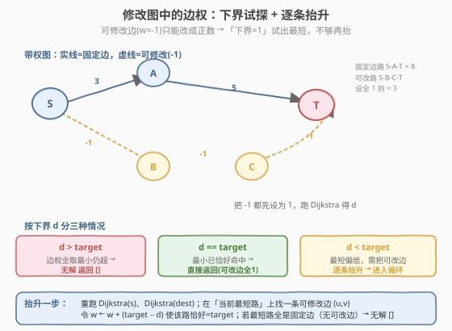
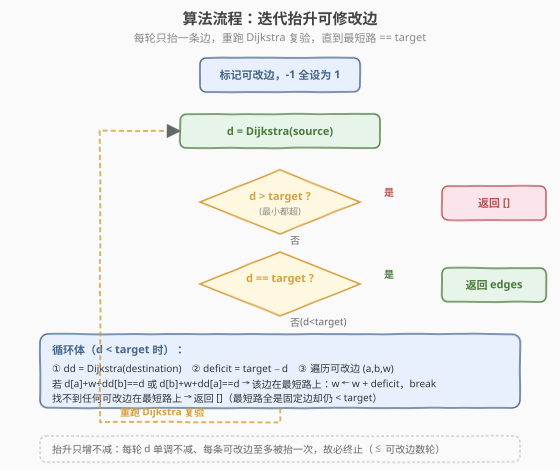
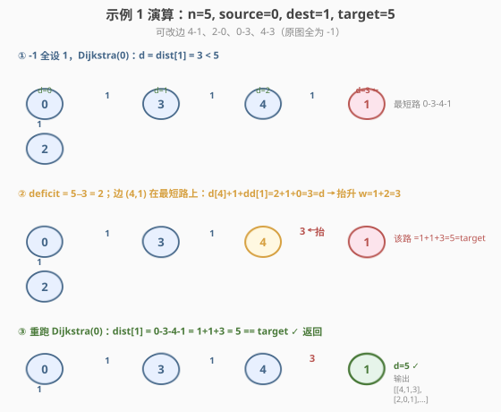

# 修改图中的边权

- **题目名称**：修改图中的边权
- **链接**：[2699. 修改图中的边权](https://leetcode.cn/problems/modify-graph-edge-weights/)
- **难度**：困难
- **标签**：图、最短路径、堆/优先队列

## 1. 题目概述

给你一个 $n$ 个节点的**无向带权连通**图，节点编号 $0$ 到 $n-1$，再给你一个整数数组 `edges`，其中 `edges[i] = [a_i, b_i, w_i]` 表示节点 $a_i$ 和 $b_i$ 之间有一条权为 $w_i$ 的边。

部分边的权为 $-1$（$w_i=-1$），其余边的权都为**正**数（$w_i>0$）。你需要将所有权为 $-1$ 的边都修改为范围 $[1, 2\times10^9]$ 中的**正整数**，使得从节点 `source` 到节点 `destination` 的**最短距离**为整数 `target`。如果有多种修改方案可以使 `source` 和 `destination` 之间的最短距离等于 `target`，你可以返回任意一种方案。

如果存在使 `source` 到 `destination` 最短距离为 `target` 的方案，请返回包含所有边的数组（包括未修改边权的边）。如果不存在这样的方案，返回一个**空数组**。

**注意**：你不能修改一开始边权为正数的边。

**示例 1**：

```text
输入：n = 5, edges = [[4,1,-1],[2,0,-1],[0,3,-1],[4,3,-1]], source = 0, destination = 1, target = 5
输出：[[4,1,1],[2,0,1],[0,3,3],[4,3,1]]
解释：上图展示了一个满足题意的修改方案，从 0 到 1 的最短距离为 5。
```

**示例 2**：

```text
输入：n = 3, edges = [[0,1,-1],[0,2,5]], source = 0, destination = 2, target = 6
输出：[]
解释：没有方法通过修改边权为 -1 的边，使得 0 到 2 的最短距离等于 6，所以返回空数组。
```

**示例 3**：

```text
输入：n = 4, edges = [[1,0,4],[1,2,3],[2,3,5],[0,3,-1]], source = 0, destination = 2, target = 6
输出：[[1,0,4],[1,2,3],[2,3,5],[0,3,1]]
解释：上图展示了一个满足题意的修改方案，从 0 到 2 的最短距离为 6。
```

**约束条件**：

- $1 \le n \le 100$
- $1 \le \text{edges.length} \le n(n-1)/2$
- $\text{edges[i].length} == 3$
- $0 \le a_i, b_i \lt n$
- $w_i = -1$ 或者 $1 \le w_i \le 10^7$
- $a_i \ne b_i$
- $0 \le \text{source}, \text{destination} \lt n$
- $\text{source} \ne \text{destination}$
- $1 \le \text{target} \le 10^9$
- 输入的图是连通图，且没有自环和重边。

> 💡 题眼是「**只能把 $-1$ 边改大**（从 $-1$ 变成 $[1,2\times10^9]$ 的正数），固定边动不了」。这决定了改边只会**增加或不变**路径长度，于是最短路有天然**下界**（可改边全取最小 $1$）与**上界**（只用固定边）。把这两端用 Dijkstra 卡住后，把缺口「逐条」摊到最短路上的可改边即可——与 [743. 网络延迟时间](../0701-0800/743_网络延迟时间.md) 的堆优化 Dijkstra 模板一脉相承，多了一层「改边权 + 复跑」的循环。

---

## 2. 解题思路

### 2.1 暴力思路：枚举每条 $-1$ 边的权？

可改边权范围 $[1, 2\times10^9]$，数量最多 $n(n-1)/2\approx 4950$ 条，组合空间天文数字，穷举不现实。即使把权离散化到「$1$ 或某几个候选」，$2^{4950}$ 也无法承受。

> ⚠️ 关键不在「试哪些权」，而在「**让某条最短路恰好等于 $target$**」——这把搜索问题变成了**构造问题**。

### 2.2 核心观察：下界试探 + 逐条抬升



可改边只能改成**正数**，于是改边**只会让路径变长或不变**。由此推出两条判据：

1. **下界判据**：把所有 $-1$ 边都设为最小值 $1$，跑一次 Dijkstra 得 $d=\text{dist}[\text{source}\to\text{dest}]$。这是「能取到的最短」：
   - 若 $d \gt \text{target}$：边权全取最小还超 $\text{target}$，再改大只会更超 → **无解**，返回 `[]`。
   - 若 $d == \text{target}$：最小已恰好命中，可改边全留 $1$ 即满足，**直接返回**。
   - 若 $d \lt \text{target}$：最短路过低，需要把某些可改边**改大**来补齐缺口，进入下一步。

2. **逐条抬升**（当 $d \lt \text{target}$）：缺口 $\text{deficit}=\text{target}-d \gt 0$。重跑 Dijkstra(source) 和 Dijkstra(destination)，在「**当前最短路**」上找一条可改边 $(u,v)$（满足 $\text{dist}_s[u]+w+\text{dist}_t[v]==d$ 或对称方向），把它从 $w$ 抬到 $w+\text{deficit}$——这样该路径恰好变为 $\text{target}$。然后**重跑 Dijkstra 复验**：若新的 $d==\text{target}$ 则返回；若仍 $\lt\text{target}$ 说明另有等长/更短的路径，再抬一条；若最短路全是固定边（找不到可改边）却仍 $\lt\text{target}$ → **无解**（固定边抬不动）。

> ⚠️ **为什么「逐条抬」而不是「一条定终身」？** 把其余可改边一股脑设成 $2\times10^9$（清空）再只抬一条的做法**会失效**：当最短路本身由**多条可改边**串联而成时，清空其中任何一条都会把这条最短路打断，剩下的固定边路又 $>\text{target}$，反而构不出 $\text{target}$。正确做法是**只抬、不清空**——保持其余可改边为 $1$，每轮只动最短路上的一条，重跑复验，让最短路单调逼近 $\text{target}$。

> 💡 **「上界判据」隐含在循环里**：若某轮最短路长度 $\lt\text{target}$ 却**全是固定边**（找不到可改边抬），循环返回 `[]`——这正是「固定边最短路已 $\lt\text{target}$ 且无法改大」的无解情形，无需单独写一次「只用固定边的 Dijkstra」。

### 2.3 算法流程图



要点：

- **只增不减**：每轮只把某条可改边**加大** $\text{deficit}$，故所有路径长度**单调不减**，新的 $d$ 必落在新值 $[\text{旧 }d,\ \text{target}]$ 内，永远不会反向超过 $\text{target}$。
- **每条边至多抬一次**：被抬过的边所在路径已 $\ge\text{target}$，下一轮若 $d\lt\text{target}$，最短路必**不走**它，故不会再被选中。所以循环至多跑「可改边数」轮，必然终止。
- **无解的两个出口**：① 下界 $d\gt\text{target}$；② 某轮 $d\lt\text{target}$ 但最短路无可改边（固定边已最短却不够）。

### 2.4 示例演算



以示例 1（$n=5$，可改边 $4\text{-}1,2\text{-}0,0\text{-}3,4\text{-}3$，$\text{target}=5$）走一遍：

| 步骤 | 操作 | 关键结果 |
|------|------|----------|
| ① 下界试探 | $-1$ 全设 $1$，Dijkstra(0) | $\text{dist}[1]=0\text{-}3\text{-}4\text{-}1=1+1+1=3\lt5$ |
| ② 抬升一条 | $\text{deficit}=2$；边 $(4,1)$ 在最短路上（$\text{dist}_s[4]+1+\text{dist}_t[1]=2+1+0=3=d$） | $w_{4,1}\leftarrow 1+2=3$ |
| ③ 复验 | 重跑 Dijkstra(0) | $\text{dist}[1]=0\text{-}3\text{-}4\text{-}1=1+1+3=5==\text{target}$ ✓ |

输出 $[[4,1,3],[2,0,1],[0,3,1],[4,3,1]]$（与官方示例 $[[4,1,1],[0,3,3],\dots]$ 是两种不同但都合法的方案，均使最短路 $=5$）。

> 💡 示例 2 的「无解」由判据①直接命中：可改边 $0\text{-}1$ 设 $1$ 后 $\text{dist}[2]=0\text{-}2=5\lt6$，进入循环；但最短路 $0\text{-}2$（权 $5$ 固定）**无可改边**，循环返回 `[]`。

---

## 3. 参考代码

### C++

```cpp
class Solution {
public:
    vector<vector<int>> modifiedGraphEdges(int n, vector<vector<int>>& edges,
                                           int source, int destination, int target) {
        const long long INF = 2e9;
        int m = edges.size();
        vector<char> modifiable(m, 0);
        for (int i = 0; i < m; ++i) {
            if (edges[i][2] == -1) {            // 标记可改边
                modifiable[i] = 1;
                edges[i][2] = 1;                // 先全部设为下界 1
            }
        }

        auto dijkstra = [&](int s) {
            vector<vector<pair<int, long long>>> g(n);
            for (auto& e : edges) {
                int a = e[0], b = e[1];
                long long w = e[2];
                g[a].push_back({b, w});
                g[b].push_back({a, w});
            }
            vector<long long> dist(n, INF);
            dist[s] = 0;
            priority_queue<pair<long long, int>, vector<pair<long long, int>>, greater<>> pq;
            pq.push({0, s});
            while (!pq.empty()) {
                auto [d, u] = pq.top(); pq.pop();
                if (d > dist[u]) continue;
                for (auto& [v, w] : g[u]) {
                    long long nd = d + w;
                    if (nd < dist[v]) {
                        dist[v] = nd;
                        pq.push({nd, v});
                    }
                }
            }
            return dist;
        };

        // 下界判据
        auto dist = dijkstra(source);
        if (dist[destination] > target) return {};
        if (dist[destination] == target) return edges;

        // 逐条抬升
        while (true) {
            dist = dijkstra(source);
            if (dist[destination] == target) return edges;
            if (dist[destination] > target) return {};        // 保险（只增不减下不会触发）
            auto dist_t = dijkstra(destination);
            long long deficit = (long long)target - dist[destination];
            bool bumped = false;
            for (int i = 0; i < m; ++i) {
                if (!modifiable[i]) continue;
                int a = edges[i][0], b = edges[i][1];
                long long w = edges[i][2];
                // 该边是否落在某条最短路上（无向 → 两方向都判）
                bool onPath = false;
                if (dist[a] < INF && dist_t[b] < INF && dist[a] + w + dist_t[b] == dist[destination]) onPath = true;
                if (dist[b] < INF && dist_t[a] < INF && dist[b] + w + dist_t[a] == dist[destination]) onPath = true;
                if (onPath) {
                    edges[i][2] = (int)(w + deficit);        // 抬升，使该路恰好 = target
                    bumped = true;
                    break;
                }
            }
            if (!bumped) return {};                          // 最短路全是固定边却仍 < target
        }
    }
};
```

### Python

```python
class Solution:
    def modifiedGraphEdges(self, n: int, edges: List[List[int]],
                           source: int, destination: int, target: int) -> List[List[int]]:
        import heapq
        INF = 2 * 10 ** 9

        # 标记可改边，并把 -1 暂时设为下界 1
        modifiable = [e[2] == -1 for e in edges]
        for e in edges:
            if e[2] == -1:
                e[2] = 1

        def dijkstra(s: int):
            g = [[] for _ in range(n)]
            for a, b, w in edges:
                g[a].append((b, w))
                g[b].append((a, w))
            dist = [INF] * n
            dist[s] = 0
            h = [(0, s)]
            while h:
                d, u = heapq.heappop(h)
                if d > dist[u]:
                    continue
                for v, w in g[u]:
                    nd = d + w
                    if nd < dist[v]:
                        dist[v] = nd
                        heapq.heappush(h, (nd, v))
            return dist

        # 下界判据：可改边全取 1 时若仍 > target，则无解
        dist = dijkstra(source)
        if dist[destination] > target:
            return []
        if dist[destination] == target:
            return edges

        # 逐条抬升：当前最短路 < target，每轮抬一条可改边补齐缺口
        while True:
            dist = dijkstra(source)
            if dist[destination] == target:
                return edges
            if dist[destination] > target:        # 保险（只增不减下不会触发）
                return []
            dist_t = dijkstra(destination)
            deficit = target - dist[destination]
            bumped = False
            for i, e in enumerate(edges):
                if not modifiable[i]:
                    continue
                a, b, w = e
                # 该边是否落在某条最短路上（无向 → 两方向都判）
                if (dist[a] < INF and dist_t[b] < INF
                        and dist[a] + w + dist_t[b] == dist[destination]):
                    on_path = True
                elif (dist[b] < INF and dist_t[a] < INF
                        and dist[b] + w + dist_t[a] == dist[destination]):
                    on_path = True
                else:
                    on_path = False
                if on_path:
                    e[2] = w + deficit            # 抬升，使该路恰好 = target
                    bumped = True
                    break
            if not bumped:                        # 最短路全是固定边却仍 < target
                return []
```

> 💡 两版逻辑完全一致：①标记可改边并设下界 $1$；②一次 Dijkstra 过下界判据；③`while` 循环里「重跑两端 Dijkstra → 找最短路上的可改边 → 抬 $\text{deficit}$ → 复验」。`dist` 用 `long long` / Python 大整数，避免 $\text{dist}_s[u]+w+\text{dist}_t[v]$ 在比较时溢出（虽然权 $\le 10^9$，求和可达 $3\times10^9$ 超出 `int`）。

---

## 4. 复杂度分析

| 维度 | 复杂度 | 说明 |
|------|--------|------|
| 时间复杂度 | $O\!\left(k\cdot E\log V\right)$，$k$ 为抬升轮数 | 每轮两次堆优化 Dijkstra（$O(E\log V)$）+ 一次 $O(E)$ 找边；$k\le$ 可改边数 $\le E$，最坏 $O(E^2\log V)$，但实际 $k$ 很小（多数 $1\sim2$ 轮即收敛） |
| 空间复杂度 | $O(V+E)$ | 邻接表 $O(E)$、距离数组 $O(V)$、堆 $O(V)$；$V=n\le100$、$E\le n(n-1)/2\le4950$ |

> 💡 $n\le100$ 极小，即便最坏 $E^2\log V\approx 4950^2\times7\approx1.7\times10^8$ 的理论上界，实测也远到不了——抬升只增不减、每条边至多抬一次，且多数用例 $k$ 为个位数。若追求理论更紧，可改为「一轮内把最短路上**所有**可改边按比例分摊缺口」做到 $O(E\log V)$ 单趟，但实现复杂且本题无此必要。

---

## 5. 扩展：为什么「一条定终身 + 清空其余」会失效

直观上似乎可以「找一条可改边 $(u,v)$，令 $w=\text{target}-\text{dist}_s[u]-\text{dist}_t[v]$，其余可改边全设 $2\times10^9$」一蹴而就。但当**最短路本身由多条可改边串联**时它崩了：

设 $\text{source}=0,\text{dest}=4,\text{target}=10$，固定边 $0\text{-}1=6,1\text{-}4=6$（固定路 $=12$），可改边 $0\text{-}2,2\text{-}4$。下界试探 $d=0\text{-}2\text{-}4=2\lt10$。若清空其一（设 $2\times10^9$）、只抬另一条，则 $0\text{-}2\text{-}4$ 这条链被打断，只剩固定路 $12\ne10$——两次单边抬升都失败。而**正确解** $0\text{-}2=1,2\text{-}4=9$（保持其一为 $1$、只抬另一条）能让 $0\text{-}2\text{-}4=10$。

> ⚠️ 根因：清空可改边会**破坏**多段可改最短路的连通性。本解法「只抬不清空」保住其余可改边为 $1$，让多段链始终可用，逐步把缺口摊到链上某一段，故对单段/多段可改最短路都成立。

---

## 6. 面试要点

1. **为什么可改边「只能让最短路变长或不变」？这如何化作判据？**

   > 可改边从 $-1$ 改成的正数 $\ge1$，而 $-1$ 在计算时若视作「不存在」则相当于把它从图里删了再重新加回——加边只会让最短路**更短或不变**。故「全设 $1$」给出**下界** $d_{\min}$：$d_{\min}\gt\text{target}$ 则无解（改大只会更大）；$d_{\min}==\text{target}$ 直接返回。「只用固定边」给出**上界** $d_{\max}$（删可改边后最短路）：$d_{\max}\lt\text{target}$ 也无解（固定边动不了）。本解法把上界判据折叠进循环（找不到可改边即触发），无需单独跑。

2. **「抬升 deficit」为什么恰好让该最短路变为 target？**

   > 设被抬边 $(u,v)$ 在最短路上：$\text{dist}_s[u]+w+\text{dist}_t[v]=d$。抬成 $w'=w+\text{deficit}$ 后，该路 $=\text{dist}_s[u]+w'+\text{dist}_t[v]=d+\text{deficit}=d+(\text{target}-d)=\text{target}$。又因只增不减，其余路径 $\ge$ 原 $d$，故新最短路落在 $[d,\text{target}]$，绝不反向超过 target。

3. **循环为何必终止、不会无限抬同一条边？**

   > 抬过的边所在路径已 $\ge\text{target}$。下一轮若 $d\lt\text{target}$，最短路必**不走**这条已 $\ge\text{target}$ 的边（走了就 $\ge\text{target}\gt d$），故它不会再满足「在最短路上」的判定、不会被二次选中。每条可改边至多抬一次 $\Rightarrow$ 轮数 $\le$ 可改边数 $\le E$。

4. **无解的判定有几处？分别在何时触发？**

   > 两处：①下界试探后 $d\gt\text{target}$（边权全最小仍超）→ 立即返回 `[]`；②循环中 $d\lt\text{target}$ 但当前最短路**找不到任何可改边**（即全是固定边，固定路已最短却不够 target）→ 返回 `[]`。后者本质是「上界判据」的延迟触发。

5. **距离为什么用 `long long` / 大整数？溢出会怎样？**

   > 边权可达 $10^9$（固定）或抬升后接近 $10^9$，而 $\text{dist}_s[u]+w+\text{dist}_t[v]$ 三项求和可达 $3\times10^9$，超过 32 位 `int` 上限 $\approx2.1\times10^9$。若用 `int` 会回绕成负数，使 `==d` 判定**误判命中**、抬错边，得到看似合法实则错误的答案。Python 原生大整数无此虑；C++ 必须显式 `long long`。

---

## 7. 同类练习题

- [743. 网络延迟时间](https://leetcode.cn/problems/network-delay-time/)：堆优化 Dijkstra 单源最短路母题。本题的 Dijkstra 子过程即此模板，可对照「建邻接表 + 小根堆松弛」的标准写法
- [2642. 设计可以求最短路径的图类](https://leetcode.cn/problems/design-graph-with-shortest-path-calculator/)：把 Dijkstra 封装成按需查询的图类。同样 $n\le100$、正权、堆优化，可对比「单次查询」与本题「反复改边 + 复跑」的调用模式
- [1631. 最小体力消耗路径](https://leetcode.cn/problems/path-with-minimum-effort/)：二分答案 + BFS/并查集判定。同样是「最短路 + 二分/判定」组合，可对比「二分找阈值」与本题「下界试探找阈值」的两种切入
- [2045. 到达目的地的第二短时间](https://leetcode.cn/problems/second-minimum-time-to-reach-destination/)：求**次短路**而非最短路。同为无向正权图 + 堆优化，扩展到「第 $k$ 短」的松弛思路，可体会 Dijkstra 的可推广性
- [882. 细分图中的可到达节点](https://leetcode.cn/problems/reachable-nodes-in-subdivided-graph/)：把每条边细分成多个虚拟节点后跑 Dijkstra。同为「改图结构 + 跑最短路」的构造型图论题，可对比「边权变换」与「边分裂」两类预处理
