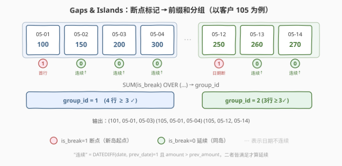
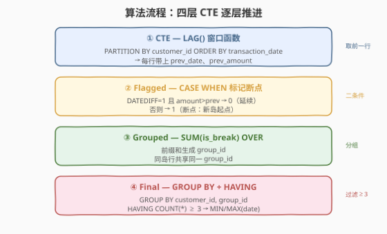
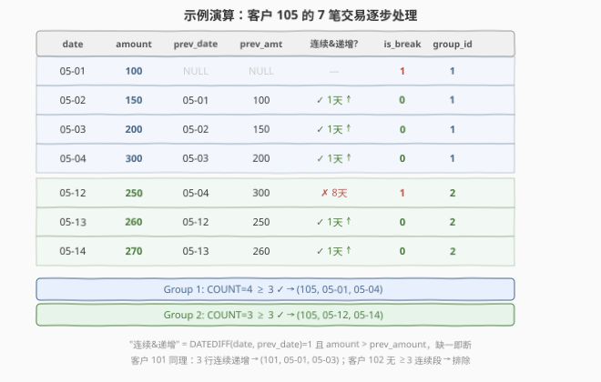

# LeetCode 连续递增交易 题解

## 1. 题目概述

- **标题 / 题号**：连续递增交易（#2701，hard）
- **链接**：https://leetcode.cn/problems/consecutive-transactions-with-increasing-amounts/
- **难度**：困难
- **标签**：数据库、SQL、窗口函数、LAG、DATEDIFF、Gaps & Islands、连续性问题、LeetCode 锁题

> ⚠️ **锁题说明**：本题是 LeetCode **Plus 会员专享**题，官方题目正文被付费墙遮挡。下表的表结构与示例数据系通过 LeetCode GraphQL 接口的 `exampleTestcases` / `mysqlSchemas` 字段取得（属未锁字段，可离线核验），题面文字与输出列名为依据该样例与题意重建；如与官方正文有出入，以官方为准。

**题意**：给定 `Transactions` 表，每行记录一笔交易：交易 ID、客户 ID、交易日期和金额。编写 SQL 查询，找出**至少连续三天 `amount` 递增**的客户，输出 `customer_id`、连续交易期的起始日期和结束日期。一个客户可以有**多组**连续递增交易。

**表结构**：

```text
Table: Transactions
+------------------+------+
| Column Name       | Type |
+------------------+------+
| transaction_id   | int  |  ← 主键
| customer_id       | int  |
| transaction_date | date |
| amount            | int  |
+------------------+------+
transaction_id 是该表的主键。
每行包含唯一 (customer_id, transaction_date) 及对应金额。
```

> 💡 **关键约束**：`(customer_id, transaction_date)` 唯一——每个客户每天最多一笔交易。"连续"指**日历日期相差 1 天**（`DATEDIFF = 1`），"递增"指 `amount` **严格大于**前一笔。两个条件**同时满足**才算延续，缺一即断。

**示例 1**：

```text
输入：
Transactions 表:
+----------------+-------------+------------------+--------+
| transaction_id | customer_id | transaction_date | amount |
+----------------+-------------+------------------+--------+
| 1              | 101         | 2023-05-01       | 100    |
| 2              | 101         | 2023-05-02       | 150    |
| 3              | 101         | 2023-05-03       | 200    |
| 4              | 102         | 2023-05-01       | 50     |
| 5              | 102         | 2023-05-03       | 100    |
| 6              | 102         | 2023-05-04       | 200    |
| 7              | 105         | 2023-05-01       | 100    |
| 8              | 105         | 2023-05-02       | 150    |
| 9              | 105         | 2023-05-03       | 200    |
| 10             | 105         | 2023-05-04       | 300    |
| 11             | 105         | 2023-05-12       | 250    |
| 12             | 105         | 2023-05-13       | 260    |
| 13             | 105         | 2023-05-14       | 270    |
+----------------+-------------+------------------+--------+

输出：
+-------------+-------------------+-----------------+
| customer_id | consecutive_start | consecutive_end |
+-------------+-------------------+-----------------+
| 101         | 2023-05-01        | 2023-05-03      |
| 105         | 2023-05-01        | 2023-05-04      |
| 105         | 2023-05-12        | 2023-05-14      |
+-------------+-------------------+-----------------+
```

**解释**：

- 客户 101：05-01→05-02→05-03，连续 3 天、金额 100→150→200 严格递增 → 输出
- 客户 102：05-01→05-03 日期不连续（跳了 2 天），05-03→05-04 仅 2 天 → 无 ≥3 连续段 → 排除
- 客户 105：有**两组**——05-01→05-04（4 天连续递增）和 05-12→05-14（3 天连续递增）→ 两组均输出

**约束**：

- `transaction_id` 是主键
- `(customer_id, transaction_date)` 唯一
- 结果按 `customer_id, consecutive_start, consecutive_end` **升序**排列

> 💡 本题是 SQL **Gaps & Islands**（间隙与孤岛）模式的双条件升级版——同时要求"日期连续"和"金额递增"两个条件。与 [180. 连续出现的数字](../0101-0200/180_连续出现的数字.md)（单条件连续）和 [603. 连续空余座位](../0601-0700/603_连续空余座位.md)（单条件连续）相比，本题的断点判定是**两个条件的逻辑与**——任一不满足即断。

## 2. 解题思路

### 2.1 暴力思路：过程式逐行扫描

最直觉的做法是按客户分组、按日期排序后逐行扫描，维护"当前连续递增段"：若当前行的日期恰好是前一行 +1 天且金额更大，则继续；否则断开。当段长 ≥ 3 时记录该段的起止日期。

这在过程式语言中很自然，但 **SQL 没有循环语句**——需要把"行间关系"转化为"集合操作"。核心技巧是 **Gaps & Islands**：标记断点 → 前缀和分组。

### 2.2 核心观察：Gaps & Islands（断点标记 + 前缀和分组）



**关键洞察**：对每个客户的交易序列（按日期排序），用 `LAG()` 取出前一行的日期和金额，然后判定当前行是否**延续**了递增序列：

$$\text{continues}(i) \iff \text{DATEDIFF}(\text{date}_i, \text{date}_{i-1}) = 1 \land \text{amount}_i > \text{amount}_{i-1}$$

- **延续**（`is_break = 0`）：两个条件都满足 → 当前行与前一行属于同一"岛"
- **断点**（`is_break = 1`）：任一条件不满足（含首行 `prev` 为 `NULL`）→ 当前行开启新"岛"

对 `is_break` 做**前缀和**（`SUM(is_break) OVER (...)`）即得 `group_id`——同一岛内所有行共享同一 `group_id`。最后 `GROUP BY customer_id, group_id` + `HAVING COUNT(*) >= 3` 即可筛选出长度 ≥ 3 的连续递增段。

> 💡 **为什么首行 `is_break = 1`？** `LAG()` 对每个分区的首行返回 `NULL`，`DATEDIFF(date, NULL)` 为 `NULL`，`NULL = 1` 为 `UNKNOWN`（非 `TRUE`），`CASE` 走 `ELSE` 分支 → `is_break = 1`。这是正确行为——首行天然是新岛的起点。

> ⚠️ **双条件的逻辑与**：本题的"延续"要求**日期连续 AND 金额递增**，是 180/603 的单条件版升级。日期不连续（如 05-04→05-12 差 8 天）或金额不递增（如 300→250 递减），任一不满足都会产生断点。

### 2.3 算法流程图



四层 CTE 逐层推进：

1. **CTE** — `LAG() OVER (PARTITION BY customer_id ORDER BY transaction_date)`：每行带上前一行的日期和金额
2. **Flagged** — `CASE WHEN DATEDIFF=1 AND amount>prev THEN 0 ELSE 1 END`：标记断点（0=延续，1=断点）
3. **Grouped** — `SUM(is_break) OVER (PARTITION BY customer_id ORDER BY transaction_date)`：前缀和生成 `group_id`
4. **Final** — `GROUP BY customer_id, group_id HAVING COUNT(*) >= 3`：筛选长段，取 `MIN/MAX(transaction_date)`

### 2.4 示例演算

以客户 105（7 笔交易、两组连续段）为例逐步演算：



| date | amount | prev_date | prev_amt | 连续&递增? | is_break | group_id |
|------|--------|-----------|----------|------------|----------|----------|
| 05-01 | 100 | NULL | NULL | — | 1 | 1 |
| 05-02 | 150 | 05-01 | 100 | ✓ 1天 ↑ | 0 | 1 |
| 05-03 | 200 | 05-02 | 150 | ✓ 1天 ↑ | 0 | 1 |
| 05-04 | 300 | 05-03 | 200 | ✓ 1天 ↑ | 0 | 1 |
| 05-12 | 250 | 05-04 | 300 | ✗ 8天 | 1 | 2 |
| 05-13 | 260 | 05-12 | 250 | ✓ 1天 ↑ | 0 | 2 |
| 05-14 | 270 | 05-13 | 260 | ✓ 1天 ↑ | 0 | 2 |

- **Group 1**（05-01 ~ 05-04）：`COUNT = 4 ≥ 3` ✓ → `(105, 2023-05-01, 2023-05-04)`
- **Group 2**（05-12 ~ 05-14）：`COUNT = 3 ≥ 3` ✓ → `(105, 2023-05-12, 2023-05-14)`

> 💡 **05-12 的断点原因**：`DATEDIFF(05-12, 05-04) = 8 ≠ 1`，日期不连续 → `is_break = 1`。注意此时金额 250 < 300 也不递增，但**任一条件不满足即断**——日期条件先触发。

## 3. 参考代码

### SQL（解法 A：LAG + Gaps & Islands，推荐）

```sql
WITH CTE AS (
    SELECT
        customer_id,
        transaction_date,
        amount,
        LAG(transaction_date) OVER (PARTITION BY customer_id ORDER BY transaction_date) AS prev_date,
        LAG(amount) OVER (PARTITION BY customer_id ORDER BY transaction_date) AS prev_amount
    FROM Transactions
),
Flagged AS (
    SELECT
        customer_id,
        transaction_date,
        amount,
        CASE
            WHEN DATEDIFF(transaction_date, prev_date) = 1
             AND amount > prev_amount
            THEN 0
            ELSE 1
        END AS is_break
    FROM CTE
),
Grouped AS (
    SELECT
        customer_id,
        transaction_date,
        amount,
        SUM(is_break) OVER (PARTITION BY customer_id ORDER BY transaction_date) AS group_id
    FROM Flagged
)
SELECT
    customer_id,
    MIN(transaction_date) AS consecutive_start,
    MAX(transaction_date) AS consecutive_end
FROM Grouped
GROUP BY customer_id, group_id
HAVING COUNT(*) >= 3
ORDER BY customer_id, consecutive_start;
```

> 💡 **写法要点**（四层 CTE 逐层推进）：
> - **`CTE`**：`LAG() OVER (PARTITION BY customer_id ORDER BY transaction_date)` 取前一行的日期和金额。`PARTITION BY customer_id` 确保不跨客户取前一行——客户切换时 `LAG` 返回 `NULL`，天然产生断点。
> - **`Flagged`**：`CASE WHEN DATEDIFF=1 AND amount>prev THEN 0 ELSE 1`——两个条件都满足才延续（`0`），否则断点（`1`）。首行 `prev` 为 `NULL`，三值逻辑使条件为 `UNKNOWN` → 走 `ELSE` → `is_break=1`，正确开启第一组。
> - **`Grouped`**：`SUM(is_break) OVER (PARTITION BY customer_id ORDER BY transaction_date)` 做前缀和——断点处 `+1` 递增 `group_id`，延续处 `+0` 保持不变。同组所有行共享同一 `group_id`。
> - **外层**：`GROUP BY customer_id, group_id` 把同组行聚合，`HAVING COUNT(*) >= 3` 筛选长段，`MIN/MAX(transaction_date)` 取起止日期。`ORDER BY customer_id, consecutive_start` 满足题目排序要求。

### SQL（解法 B：LEFT JOIN 自连接）

```sql
WITH T AS (
    SELECT
        t1.*,
        SUM(
            CASE
                WHEN t2.customer_id IS NULL THEN 1
                ELSE 0
            END
        ) OVER (ORDER BY customer_id, transaction_date) AS s
    FROM
        Transactions AS t1
        LEFT JOIN Transactions AS t2
            ON t1.customer_id = t2.customer_id
            AND t1.amount > t2.amount
            AND DATEDIFF(t1.transaction_date, t2.transaction_date) = 1
)
SELECT
    customer_id,
    MIN(transaction_date) AS consecutive_start,
    MAX(transaction_date) AS consecutive_end
FROM T
GROUP BY customer_id, s
HAVING COUNT(1) >= 3
ORDER BY customer_id, consecutive_start;
```

> 💡 **写法要点**（LEFT JOIN + 前缀和，一步到位）：
> - `LEFT JOIN` 对每行 `t1` 尝试在 `t2` 中找到"前一天 + 同客户 + 金额更小"的行。因 `(customer_id, transaction_date)` 唯一，每个 `t1` 最多匹配一行 `t2`。
> - **匹配到 `t2`**（`t2.customer_id IS NOT NULL`）→ `t1` 延续了递增序列 → `CASE` 返回 `0`。
> - **未匹配**（`t2.customer_id IS NULL`）→ `t1` 是断点（首行 / 日期不连续 / 金额不递增）→ `CASE` 返回 `1`。
> - `SUM(...) OVER (ORDER BY customer_id, transaction_date)` 做全局前缀和生成 `s`——注意此处**不分客户分区**，`s` 全局递增但因 `GROUP BY customer_id, s` 双列分组，不同客户的组不会混淆。
> - 比**解法 A 少一层 CTE**，但 `LEFT JOIN` 自连接在大数据量时可能产生 $O(n^2)$ 的中间结果（无索引时），解法 A 的窗口函数仅一次排序 $O(n \log n)$。

### Python（pandas）

```python
import pandas as pd

def consecutive_transactions(transactions: pd.DataFrame) -> pd.DataFrame:
    df = transactions.sort_values(['customer_id', 'transaction_date']).reset_index(drop=True)
    prev_date = df.groupby('customer_id')['transaction_date'].shift(1)
    prev_amount = df.groupby('customer_id')['amount'].shift(1)
    continues = (df['transaction_date'] - prev_date == pd.Timedelta(days=1)) & (df['amount'] > prev_amount)
    df['group_id'] = (~continues).cumsum()
    grouped = df.groupby(['customer_id', 'group_id']).agg(
        consecutive_start=('transaction_date', 'min'),
        consecutive_end=('transaction_date', 'max'),
        n=('transaction_id', 'count')
    ).reset_index()
    result = grouped[grouped['n'] >= 3][['customer_id', 'consecutive_start', 'consecutive_end']]
    return result.sort_values(['customer_id', 'consecutive_start'])
```

> 💡 **pandas 对照**：`groupby('customer_id')['col'].shift(1)` 等价于 SQL 的 `LAG(col) OVER (PARTITION BY customer_id ORDER BY ...)`——按客户分组后取上一行。`~continues` 取反（延续→`False`→`0`，断点→`True`→`1`），`cumsum()` 做前缀和生成 `group_id`，与 SQL 的 `SUM(is_break) OVER` 完全对应。首行 `prev_date` 为 `NaT`，`NaT == Timedelta(days=1)` 为 `False`，`~False = True` → 断点，与 SQL 三值逻辑殊途同归。

## 4. 复杂度分析

| 维度 | 复杂度 | 说明 |
|------|--------|------|
| **时间（解法 A LAG）** | $O(n \log n)$ | $n$ = `Transactions` 行数。`LAG() OVER (PARTITION BY ... ORDER BY ...)` 需按 `(customer_id, transaction_date)` 排序 $O(n \log n)$，排序后单趟扫描赋值 $O(n)$。前缀和 `SUM() OVER` 同理再排一次。外层 `GROUP BY` 排序 $O(n \log n)$ |
| **时间（解法 B LEFT JOIN）** | $O(n^2)$ ~ $O(n \log n)$ | 自连接最坏 Nested Loop $O(n^2)$；若 `(customer_id, transaction_date)` 有索引且优化器选 Hash Join，可降为 $O(n \log n)$。大数据量时解法 A 更稳定 |
| **空间** | $O(n)$ | CTE 物化中间结果 / 窗口函数排序缓冲 / JOIN 中间结果 |
| **结果行数** | $O(n)$ | 最坏每个客户一组、每组恰好 3 行，结果行数 $\leq n/3$ |

> ⚠️ **解法 B 的 `LEFT JOIN` 性能风险**：自连接 `Transactions t1 LEFT JOIN Transactions t2` 在无索引时退化为 $O(n^2)$。解法 A 的窗口函数仅需排序、无 JOIN 展开，通常更优。面试中推荐先写解法 A（LAG + 前缀和），再提解法 B 作为"少一层 CTE"的替代写法。

## 5. 扩展

### 5.1 DATEDIFF 与日期连续性判定

`DATEDIFF(date1, date2)` 返回 `date1 - date2` 的天数差（`date1` 在后为正）。本题用 `DATEDIFF(transaction_date, prev_date) = 1` 判定"恰好相差一天"。

> ⚠️ **`DATEDIFF` 的参数顺序**：`DATEDIFF(t1.date, t2.date) = 1` 表示 `t1` 比 `t2` 晚 1 天。写反会得到 `-1`，条件不成立。记忆口诀："大的日期在前"。

跨数据库的日期差函数：

| 数据库 | 日期差函数 | 示例 |
|--------|-----------|------|
| MySQL | `DATEDIFF(d1, d2)` | `DATEDIFF('2023-05-02', '2023-05-01') = 1` |
| PostgreSQL | `d1 - d2`（返回 `INTERVAL`） | `('2023-05-02'::date - '2023-05-01'::date) = 1` |
| SQL Server | `DATEDIFF(day, d2, d1)` | `DATEDIFF(day, '2023-05-01', '2023-05-02') = 1` |
| SQLite | `julianday(d1) - julianday(d2)` | `CAST(julianday(d1) - julianday(d2) AS INT) = 1` |

> 💡 **SQL Server 的 `DATEDIFF` 参数顺序与 MySQL 相反**：MySQL 是 `DATEDIFF(d1, d2)`（d1−d2），SQL Server 是 `DATEDIFF(unit, d2, d1)`（d1−d2，需指定时间单位）。跨库迁移时注意。

### 5.2 Gaps & Islands 与连续性问题的难度梯度

| 题号 | 连续条件 | 段长要求 | 输出 | 难度 |
|------|---------|----------|------|------|
| **603** | `free=1`（单条件） | ≥ 2 | 段内所有 `seat_id` | 简单 |
| **197** | `temperature > prev`（单条件+日期连续） | ≥ 2 | 满足条件的行 | 简单 |
| **180** | `num` 相同（单条件） | ≥ 3 | 去重后的 `num` | 中等 |
| **601** | `visit_count > 100`（单条件+阈值） | ≥ 3 | 段内全部完整行 | 困难 |
| **2701** | 日期连续 **AND** 金额递增（**双条件**） | ≥ 3 | 起止日期 | 困难 |

> 💡 **本题的独特之处**：2701 是连续性问题中少见的**双条件 Gaps & Islands**——断点判定需"日期连续 AND 金额递增"两个条件的逻辑与。掌握 180/603 的单条件版本后，2701 只需在 `CASE WHEN` 中多加一个 `AND` 条件。这是"单条件 → 双条件"的自然推广，也是面试中区分"背模板"与"理解原理"的试金石。

### 5.3 如果题目改为"非严格递增"（允许相等）？

将 `amount > prev_amount` 改为 `amount >= prev_amount` 即可——断点条件从"严格递增"放宽为"非递减"。`CASE WHEN` 的一处符号改动即可适应。这是 Gaps & Islands 模式的灵活性优势。

## 6. 面试要点

1. **为什么用 Gaps & Islands 而不是多重自连接？**

   - 多重自连接（如 `JOIN ... ON ... JOIN ... ON ...`）需 N-1 次连接来判定"N 连续"，代码量与段长成正比，且大数据量时 $O(n^N)$ 爆炸。Gaps & Islands 用"断点标记 + 前缀和"把任意长度的连续段压缩为同组，一次排序 + 一次扫描 $O(n \log n)$，且段长阈值 `HAVING COUNT >= N` 一处可调。**面试首选 Gaps & Islands**。

2. **`PARTITION BY customer_id` 在 `LAG` 和 `SUM` 中的作用？**

   - `LAG() OVER (PARTITION BY customer_id ORDER BY transaction_date)` 确保只取**同一客户**的上一行——客户切换时 `LAG` 返回 `NULL`，天然产生断点。`SUM(is_break) OVER (PARTITION BY customer_id ORDER BY transaction_date)` 的前缀和**在每个客户内重置**，使 `group_id` 在客户内从 1 开始递增。因外层 `GROUP BY customer_id, group_id` 双列分组，不同客户即使 `group_id` 相同也不会混淆。

3. **解法 A 和解法 B 的核心区别是什么？**

   - 解法 A 用 `LAG()` 显式取前一行数据，再用 `CASE WHEN` 判定延续/断点——逻辑分层清晰、可读性强。解法 B 用 `LEFT JOIN` 在一条 SQL 中完成"查找前驱 + 标记断点"——少一层 CTE 但自连接性能风险更大。两者数学等价：`LEFT JOIN` 找不到匹配 ⟺ `LAG` 取到的 `prev` 不满足条件。

4. **首行为什么 `is_break = 1`？需要 `COALESCE` 处理 `NULL` 吗？**

   - `LAG()` 对每个分区首行返回 `NULL`。`DATEDIFF(date, NULL)` 为 `NULL`，`NULL = 1` 为 `UNKNOWN`（非 `TRUE`），`CASE` 走 `ELSE` → `is_break = 1`。这是正确行为——首行天然是新岛起点。**无需 `COALESCE` 或 `IS NOT NULL`**——SQL 三值逻辑自动处理，这正是窗口函数比自连接更简洁的原因之一。

5. **如果允许同一客户同一天多笔交易，解法会怎样变化？**

   - 题目保证 `(customer_id, transaction_date)` 唯一，故同一客户每天最多一笔。若放宽此约束，`LAG` 取到的"前一行"可能是同一天的另一笔交易，`DATEDIFF = 0 ≠ 1` → 断点。需改用 `ROW_NUMBER()` 按 `(customer_id, transaction_date, transaction_id)` 排序后取前一笔，并在 `CASE` 中额外判定"同一天算延续还是断点"——题意需明确"连续"的定义。

> 💡 **一句话总结**：2701 是 SQL Gaps & Islands 的**双条件升级版**——"日期连续 AND 金额递增"两个条件的逻辑与决定断点。掌握 `LAG → CASE 标记断点 → SUM 前缀和分组 → HAVING 筛选` 四步流水线，所有"连续 N 次满足条件"类 SQL 题都能套用。

## 同类练习题

| # | 题目 | 与本题的关联 |
|---|------|-------------|
| 180 | [连续出现的数字](../0101-0200/180_连续出现的数字.md) | SQL Gaps & Islands 母题，单条件连续（`num` 相同），2701 的"降条件"基础版 |
| 601 | [体育馆的人流量](../0601-0700/601_体育馆的人流量.md) | SQL 连续性问题的 Hard 版，段长 ≥ 3 + 阈值过滤 + 输出整段完整行，2701 的同难度对照 |
| 603 | [连续空余座位](../0601-0700/603_连续空余座位.md) | SQL 连续性问题入门版，段长 ≥ 2，对比 2701 的双条件断点判定 |
| 197 | [上升的温度](https://leetcode.cn/problems/rising-temperature/) | SQL `DATEDIFF` + 自连接，"相邻日期 + 递增"的行间比较，2701 单笔判定的原子版 |
