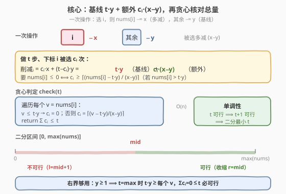
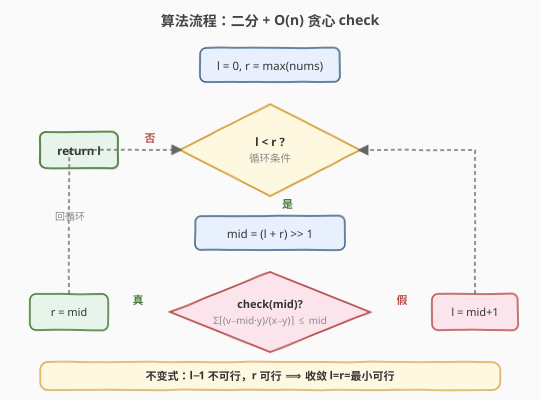

# LeetCode 使数字变为非正数的最小操作次数 题解

## 1. 题目概述

- **标题 / 题号**：使数字变为非正数的最小操作次数（#2702，hard）
- **链接**：https://leetcode.cn/problems/minimum-operations-to-make-numbers-non-positive/
- **难度**：困难
- **标签**：数组、二分查找

> ⚠️ 本题为 LeetCode Plus 会员专享题（🔒），官方题面需登录查看。下方题目描述取自官方题面，与官方一致。

**题意**：给定一个 **下标从 0 开始** 的整数数组 `nums`，以及两个整数 `x` 和 `y`（满足 $y < x$）。在每一次操作中，你需要选择一个满足 $0 \le i < \text{nums.length}$ 的下标 $i$，并执行：

- 将 `nums[i]` 减去 $x$。
- 将除了下标 $i$ 外，其他位置的值都减去 $y$。

返回使得 `nums` 中的所有整数都 **小于等于零** 所需的最小操作次数。

**示例 1**

```text
输入：nums = [3,4,1,7,6], x = 4, y = 2
输出：3
解释：需要进行三次操作。其中一种最优操作序列如下：
操作 1: 选择 i = 3。然后, nums = [1,2,-1,3,4].
操作 2: 选择 i = 3。然后, nums = [-1,0,-3,-1,2].
操作 3: 选择 i = 4。然后, nums = [-3,-2,-5,-3,-2].
现在 nums 中的所有数字都是非正数。因此返回 3。
```

**示例 2**

```text
输入：nums = [1,2,1], x = 2, y = 1
输出：1
解释：在 i = 1 处执行一次操作，得到 nums = [0,0,0]。所有正数都被移除，返回 1。
```

**约束**：

- $1 \le \text{nums.length} \le 10^5$
- $1 \le \text{nums}[i] \le 10^9$
- $1 \le y < x \le 10^9$

> 💡 关键约束是 $y < x$：被选中的那个下标额外多承受 $x - y$ 的削减（相对其它位置），这正是后面贪心判定的分母来源。

## 2. 解题思路

### 2.1 暴力思路

最直白地，从 $t = 0$ 开始逐步递增操作次数，对每个 $t$ 问「能否在 $t$ 步内让所有数 $\le 0$」。但判定本身若朴素地「枚举每步选哪个下标」，组合数为 $n^t$，立刻爆炸。

突破口在于先把判定问题想清楚：**给定 $t$ 步，是否存在一种选下标的方案使全部归零**——这其实可以贪心求出每个下标「至少被选几次」，再核对总数是否够分。

### 2.2 核心观察：二分答案 + 贪心验证



**操作效果拆解**：做 $t$ 步，若下标 $i$ 被选中了 $c_i$ 次，则它被削减的总量为

$$
\text{削减}_i = c_i \cdot x + (t - c_i) \cdot y = t \cdot y + c_i \cdot (x - y)
$$

即每个位置都有一个「基线削减」$t \cdot y$（每步它要么被选要么不被选，都至少减 $y$），被选中则额外多减 $(x - y)$。要 $\text{nums}[i] \le 0$，只需

$$
c_i \cdot (x - y) \ge \text{nums}[i] - t \cdot y
$$

**贪心判定 $\text{check}(t)$**：对每个 $v = \text{nums}[i]$，

- 若 $v \le t \cdot y$：基线已够，$c_i = 0$；
- 否则需 $c_i = \left\lceil\dfrac{v - t \cdot y}{x - y}\right\rceil$ 次。

把所有 $c_i$ 求和，若 $\sum c_i \le t$ 则 $t$ 步**可行**（剩下的 $t - \sum c_i$ 步随便选谁都行，反正基线已满足）。判定是 $O(n)$ 的，完美匹配 hint。

**单调性 → 二分**：若 $t$ 步可行，则 $t+1$ 步也必然可行（多做一步不破坏「全部 $\le 0$」）。可行与否关于 $t$ 单调，故在 $[0,\, \max(\text{nums})]$ 上二分找最小可行 $t$。

> ⚠️ **上界为何取 $\max(\text{nums})$**：因为 $y \ge 1$，当 $t = \max(\text{nums})$ 时 $t \cdot y \ge \max(\text{nums}) \ge$ 每个 $v$，所有位置基线即满足、$\sum c_i = 0 \le t$，必定可行。所以右边界到此为止足够。

### 2.3 算法流程图



二分为「左闭右闭」模板：`check(mid)` 为真则收缩右界 `r = mid`，否则抬升左界 `l = mid + 1`，终态 $l = r$ 即答案。

**不变式**：任意时刻，`r` 始终是「已知可行」的操作次数，`l` 始终是「已知不可行」的下一候选，二者夹住最小可行值。

### 2.4 示例演算

![示例演算：nums=[3,4,1,7,6]](../images/p2702_example_walkthrough.svg)

以 `nums = [3,4,1,7,6], x = 4, y = 2`（$x-y=2$，$\max=7$，二分区间 $[0,7]$）为例：

| $t$ | $t \cdot y$ | 各 $v - t \cdot y$ | 各需 $c_i=\lceil\cdot/2\rceil$ | $\sum c_i$ | $\le t$? | 动作 |
|----|------------|-------------------|----------------------------|-----------|---------|------|
| 3 | 6 | $[-3,-2,-5,1,0]$ | $[0,0,0,1,0]$ | 1 | ✓ | $r=3$ |
| 1 | 2 | $[1,2,-1,5,4]$ | $[1,1,0,3,2]$ | 7 | ✗ | $l=2$ |
| 2 | 4 | $[-1,0,-3,3,2]$ | $[0,0,0,2,1]$ | 3 | ✗ | $l=3$ |

二分轨迹：$mid{=}3\to r{=}3$，$mid{=}1\to l{=}2$，$mid{=}2\to l{=}3$，$l{=}r{=}3$ 收敛，答案 **3** ✓。

对照示例 2 `nums = [1,2,1], x = 2, y = 1`（$x-y=1$）：$t{=}1$ 时 $t \cdot y=1$，超额 $[0,1,0]$，需 $[0,1,0]$，$\sum=1\le 1$ ✓，收敛得答案 **1** ✓。

## 3. 参考代码

### C++

```cpp
class Solution {
public:
    int minOperations(vector<int>& nums, int x, int y) {
        int l = 0, r = *max_element(nums.begin(), nums.end());
        auto check = [&](long long t) {
            long long cnt = 0;
            for (int v : nums) {
                long long base = t * y;          // 基线削减
                if (v > base) {
                    // ceil((v - base) / (x - y))，整数上取整
                    cnt += (v - base + (x - y) - 1) / (x - y);
                    if (cnt > t) return false;   // 提前剪枝
                }
            }
            return cnt <= t;
        };
        while (l < r) {
            long long mid = (l + r) >> 1;
            if (check(mid)) r = mid;
            else            l = mid + 1;
        }
        return l;
    }
};
```

### Python

```python
class Solution:
    def minOperations(self, nums: List[int], x: int, y: int) -> int:
        def check(t: int) -> bool:
            cnt = 0
            base = t * y                     # 基线削减
            d = x - y
            for v in nums:
                if v > base:
                    # ceil((v - base) / d)，整数上取整，规避浮点精度
                    cnt += (v - base + d - 1) // d
                    if cnt > t:              # 提前剪枝
                        return False
            return cnt <= t

        l, r = 0, max(nums)
        while l < r:
            mid = (l + r) >> 1
            if check(mid):
                r = mid
            else:
                l = mid + 1
        return l
```

> 💡 两处工程细节：① 用 `(a + d - 1) // d` 做整数上取整，避免 $10^9$ 级数值走浮点 `ceil` 丢精度；② `t * y` 可达 $10^{18}$，C++ 中把 `t` 提升为 `long long` 再乘，并加 `cnt > t` 提前剪枝，最坏 $\sum c_i$ 也可达 $10^{14}$ 量级（$n \cdot \lceil 10^9/1\rceil$），用 64 位承接。

## 4. 复杂度分析

| 维度 | 复杂度 | 说明 |
|------|--------|------|
| **时间** | $O(n \log M)$ | $M = \max(\text{nums}) \le 10^9$，二分约 $\log M \approx 30$ 轮，每轮 $O(n)$ 扫一遍 |
| **空间** | $O(1)$ | 只用常数个变量，原地判定 |

> ⚠️ 注意 $n$ 与 $\log M$ 的乘积规模：$10^5 \times 30 = 3 \times 10^6$，远在时限内。真正要防的是中间乘积溢出（见代码注释），不是循环层数。

## 5. 扩展：若 $x = y$ 或 $y > x$ 会怎样

- **$x = y$**（即 $x - y = 0$）：被选与不被选没有差别，每步所有位置都减 $x$，答案退化为 $\lceil \max(\text{nums}) / x \rceil$，分母为零的公式不再适用、需特判。题目用 $y < x$ 严格约束规避了这一退化。
- **$y > x$**：基线削减反而比被选更多，最优策略应是「尽量不选任何人」？但每步必须选一个下标，反而会拖累该位置——此时问题失去单调贪心结构（被选成了「惩罚」），需另谋他法。本题的 $y < x$ 保证了「被选 = 加快归零」，贪心下界 $\sum c_i$ 才有意义。

> 💡 这类「操作有全员基线 + 单点额外」的题，**关键永远是分离出基线项与额外项**：基线由总步数决定，额外由被选次数决定，二者解耦后即可贪心核对总量。

## 6. 面试要点

**Q1：为什么可以二分？**
> 因为「$t$ 步可行」关于 $t$ 单调：$t$ 可行 $\Rightarrow$ $t+1$ 可行（多做一步只是再多减些，已归零的不会变正）。单调性是二分答案的充要前提。

**Q2：贪心判定 check 为什么正确？不必关心「谁在第几步被选」吗？**
> 不必。我们把每个位置 $i$ 需要的「被选次数」$c_i$ 独立算出，只核对 $\sum c_i \le t$。因为每步恰选一个下标、$\sum c_i$ 步即可满足所有超额需求，剩下的步数随便分配都不会让任何位置变正（基线 $t \cdot y$ 已够或超额已被补足）。选下标的**顺序**不影响最终总量，只看次数。

**Q3：上界为什么是 $\max(\text{nums})$ 而非更大？**
> 因 $y \ge 1$，$t = \max(\text{nums})$ 时 $t \cdot y \ge \max(\text{nums}) \ge$ 每个 $v$，所有位置基线即满足、$c_i$ 全为 0、$\sum c_i = 0 \le t$，必可行。取更大只会徒增轮次。

**Q4：有哪些溢出陷阱？**
> 三处：① `t * y` 可达 $10^{18}$（$t, y \le 10^9$）；② `v - t*y` 在可行解处已为非正，但在不可行小 $t$ 处为正且可达 $10^9$；③ 累加的 `cnt` 最坏 $n \cdot 10^9 \approx 10^{14}$。C++ 一律用 `long long`；Python 原生大整数无虞，但仍建议 `cnt > t` 提前剪枝。

**Q5：和 [875. 爱吃香蕉的珂珂](../0801-0900/875_爱吃香蕉的珂珂.md) 这类二分答案题的本质区别？**
> 框架完全同构（二分 + $O(n)$ 贪心验证），区别在 check 的「额外项」来源：875 的额外项是「这一堆香蕉要几小时」的逐堆求和；本题的额外项是「这个位置要被选几次」的逐位置求和，且多了一层「基线 $t \cdot y$」的拆解。掌握了「基线 + 额外」的分离技巧，二者可互相迁移。

## 同类练习题

| # | 题目 | 与本题的关联 |
|---|------|-------------|
| 875 | [爱吃香蕉的珂珂](https://leetcode.cn/problems/koko-eating-bananas/)（[题解](../0801-0900/875_爱吃香蕉的珂珂.md)） | 二分答案 + $O(n)$ 贪心验证的母题，框架最贴近本题 |
| 1011 | [在 D 天内送达包裹的能力](https://leetcode.cn/problems/capacity-to-ship-packages-within-d-days/)（[题解](../1001-1100/1011_在D天内送达包裹的能力.md)） | 二分答案 + 贪心划分验证，check 同为「逐元素累加核对上限」 |
| 410 | [分割数组的最大值](https://leetcode.cn/problems/split-array-largest-sum/)（[题解](../0401-0500/410_分割数组的最大值.md)） | 二分答案 + 贪心划分，check 思路与 1011 几乎一致，难度升级为困难 |
| 719 | [找出第 K 小的数对距离](https://leetcode.cn/problems/find-k-th-smallest-pair-distance/)（[题解](../0701-0800/719_找出第K小的数对距离.md)） | 二分答案 + 双指针计数，check 换成「数对计数 $\le$ mid」 |
| 378 | [有序矩阵中第 K 小的元素](https://leetcode.cn/problems/kth-smallest-element-in-a-sorted-matrix/)（[题解](../0301-0400/378_有序矩阵中第K小的元素.md)） | 二分值域 + 左下角计数，check 换成「$\le$ mid 的元素个数」 |
