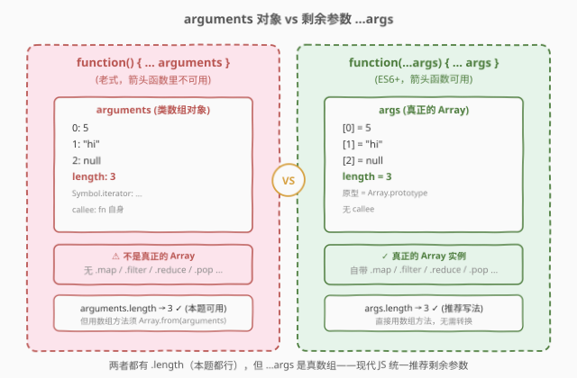
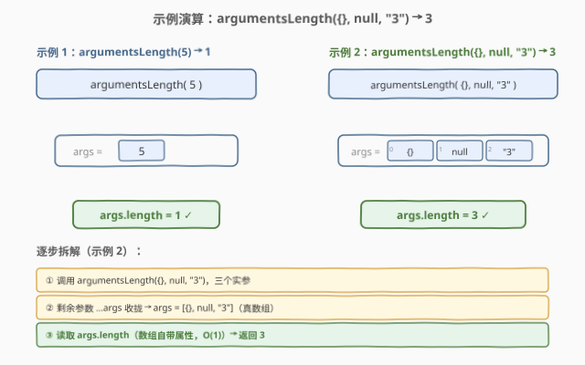

# 返回传递的参数的长度

- **题目名称**：返回传递的参数的长度
- **链接**：[2703. 返回传递的参数的长度](https://leetcode.cn/problems/return-length-of-arguments-passed/)
- **难度**：简单
- **标签**：JavaScript、剩余参数、可变参数函数、arguments 对象

## 1. 题目概述

请你编写一个函数 `argumentsLength`，返回传递给该函数的**参数数量**。

**示例 1**：

```text
输入：args = [5]
输出：1
解释：argumentsLength(5); // 1
      只传递了一个值给函数，因此它应返回 1。
```

**示例 2**：

```text
输入：args = [{}, null, "3"]
输出：3
解释：argumentsLength({}, null, "3"); // 3
      传递了三个值给函数，因此它应返回 3。
```

**约束条件**：

- `args` 是一个有效的 JSON 数组
- `0 <= args.length <= 100`

> 💡 本题是 LeetCode「30 天 JavaScript」系列题目，考查的不是算法复杂度，而是 **JS 可变参数（variadic function）** 的语言机制：如何接收不定数量的实参。核心考点有两个——**剩余参数 `...args`**（ES6+ 现代写法）与**历史遗留的 `arguments` 对象**（ES5 写法）。下文以 JS 为提交语言，并给出 Python / C++ 概念等价实现。

---

## 2. 解题思路

### 2.1 暴力思路：用 `arguments` 对象

最"原始"的写法是依赖函数体内隐式可用的 `arguments` 对象——它是一个**类数组对象**，自动收集所有传入的实参，自带一个 `.length` 属性：

```javascript
var argumentsLength = function() {
    return arguments.length;
};
```

这能通过测试，但 `arguments` 是 ES5 时代的产物，有两个致命短板：(1) **箭头函数没有 `arguments`**——箭头函数不绑定自己的 `arguments`，它取的是外层函数的；(2) **`arguments` 不是真正的数组**，没有 `.map` / `.filter` / `.reduce` 等数组方法。本题只需读 `.length`，两者都行；但工程上现代 JS 一律推荐剩余参数。

### 2.2 核心观察：剩余参数 `...args`——把实参收拢成真数组


剩余参数（rest parameters）语法 `...args` 会在函数声明时"张开一个口袋"，把调用处传入的**所有实参**按顺序收拢进一个**真正的 `Array` 实例** `args`。收拢完成后，`args` 就是一个普通数组——它有 `.length`、有 `.map`、有一切数组方法。

| 步 | 动作 | 说明 |
|----|------|------|
| 收拢 | `...args` 收集散落实参 | 按位置 0, 1, 2, … 填入数组，与调用处顺序一致 |
| 计数 | `args.length` | 数组自带的属性，$O(1)$ 直接读取，无需遍历 |

> 💡 **`...` 的两种含义**。同一个 `...` 在 JS 中有两种截然相反的作用：在**函数声明**中 `function(...args)` 是**收集**（rest，把散落实参收成数组）；在**函数调用**中 `fn(...arr)` 是**展开**（spread，把数组拆成散落实参）。本题用的是收集方向。

> ⚠️ **剩余参数必须是最后一个形参**。`function(a, ...args, b)` 会报 `SyntaxError`——`...` 之后的参数无法定位。正常用法是 `function(...args)`（全收）或 `function(first, ...rest)`（跳过第一个，收剩余）。

### 2.3 算法流程图



整体只有一个动作：声明 `...args` 形参 → 读取 `args.length` → 返回。没有循环、没有分支、没有状态。

对比两种写法的关键差异：

| 维度 | `arguments` 对象 | `...args` 剩余参数 |
|------|------------------|---------------------|
| **类型** | 类数组对象（Array-like），非 Array | 真正的 `Array` 实例 |
| **可用范围** | 普通函数可用，**箭头函数不可用** | 所有函数 / 箭头函数均可用 |
| **`.length`** | ✅ 有，返回实参数量 | ✅ 有，返回数组长度 |
| **数组方法** | ❌ 无 `.map` / `.filter` / `.pop` 等 | ✅ 全部可用 |
| **转换成本** | 需 `Array.from(arguments)` 或 `[...arguments]` 才能用数组方法 | 零成本，直接用 |
| **年代** | ES5（遗留） | ES6+（现代推荐） |

> 💡 **为什么箭头函数没有 `arguments`？** 箭头函数的设计哲学是"不绑定自己的 `this` / `arguments` / `super` / `new.target`"——它们全部沿袭外层作用域。这是为了让回调函数自然访问外层上下文而刻意为之。但这也意味着箭头函数里写 `arguments` 拿到的是**外层函数**的实参，极易出错。剩余参数没有此限制，是箭头函数接收可变参数的**唯一正确方式**。

### 2.4 示例演算



以**示例 2**（`argumentsLength({}, null, "3")`）为例：

| 步 | 状态 | 说明 |
|----|------|------|
| ① 调用 | `argumentsLength({}, null, "3")` | 三个实参传入 |
| ② 收拢 | `args = [{}, null, "3"]` | `...args` 按位置填入真数组：`args[0]={}, args[1]=null, args[2]="3"` |
| ③ 计数 | `args.length` → `3` | 数组 `.length` 是内部维护的属性，$O(1)$ 直接返回，不遍历 |

输出 `3`，与示例一致。注意 `args` 里元素的**类型各异**——空对象 `{}`、`null`、字符串 `"3"` 都能正确收拢，因为剩余参数不关心实参类型，只按位置收进数组。

---

## 3. 参考代码

### JavaScript / TypeScript（提交语言）

```javascript
/**
 * @param {...(null|boolean|number|string|Array|Object)} args
 * @return {number}
 */
var argumentsLength = function(...args) {
    return args.length;
};

/**
 * argumentsLength(1, 2, 3); // 3
 */
```

TypeScript 版：

```typescript
type JSONValue = null | boolean | number | string | JSONValue[] | { [key: string]: JSONValue };

function argumentsLength(...args: JSONValue[]): number {
    return args.length;
};
```

> 💡 **一行解法**。整个函数体只有 `return args.length`——这是本题的"妙处"：它不考算法，考的是你是否知道 `...args` 这个语法。会用剩余参数，题目就变成了"读一个数组属性"。

### Python（概念等价）

> 本题 LeetCode 仅开放 JS / TS，Python 版作概念对照。Python 用 `*args` 收集可变位置参数，语义与 JS 剩余参数一致——收拢成一个元组（tuple），`len(args)` 取数量。

```python
from typing import Any

class Solution:
    def argumentsLength(self, *args: Any) -> int:
        return len(args)
```

> ⚠️ **Python 的 `*args` 收成元组而非列表**。JS 的 `...args` 收成 `Array`（可变），Python 的 `*args` 收成 `tuple`（不可变）。读长度都只需 `len()` / `.length`，但若要原地修改，Python 须先 `list(args)`。

### C++（概念等价）

> C++ 没有语言层面的"剩余参数"语法糖。等价手段是**可变参数模板**（variadic template），用 `sizeof...(args)` 在编译期取参数包大小。但 LeetCode 本题无法用 C++ 提交，此处仅作概念对照。

```cpp
#include <cstddef>

// 可变参数模板：参数包 Args... 收集所有实参类型
template <typename... Args>
int argumentsLength(Args&&... args) {
    return sizeof...(args);   // 编译期取参数包大小，结果为编译期常量
}
```

> ⚠️ **C++ 的 `sizeof...(args)` 是编译期常量**。与 JS / Python 的运行期可变参数不同，C++ 可变参数模板的实参数量在**编译期**就已确定，`sizeof...` 返回的是 `size_t` 常量。若需要运行期收集不定参数，C++ 须手动传入 `std::vector` 或用 C 风格 `va_list`（后者不安全，不推荐）。

---

## 4. 复杂度分析

| 维度 | 复杂度 | 说明 |
|------|--------|------|
| 时间复杂度 | $O(1)$ | `args.length` 是数组内部维护的属性，直接读取，无需遍历 |
| 空间复杂度 | $O(n)$ | `...args` 把 $n$ 个实参收拢成一个长度为 $n$ 的数组；若不计输出（仅读长度不实际使用数组内容），严格说仍需 $O(n)$ 分配 |

> ⚠️ 本题 $n \le 100$，空间开销可忽略。若只关心"数量"而不需要数组内容，理论上 `arguments.length` 写法可以零分配（不建数组），但 JS 引擎实现细节各异，工程上不应为此微优化而放弃剩余参数的类型安全与可读性。

---

## 5. 扩展：`arguments` 对象与剩余参数的工程细节

**`arguments` 对象的"类数组"本质。** `arguments` 之所以"不是数组却像数组"，是因为它有整数下标（`arguments[0]`）和 `.length` 属性，但其原型链指向的是 `Object.prototype` 而非 `Array.prototype`。ECMAScript 规范称这类对象为 **Array-like exotic object**。要在 `arguments` 上用数组方法，须先转换：

```javascript
function legacy() {
    var arr = Array.from(arguments);   // 方式一：Array.from
    var arr2 = [...arguments];          // 方式二：展开语法（spread）
    // var arr3 = Array.prototype.slice.call(arguments); // 方式三：ES5 老写法
    return arr.map(x => x * 2);         // 现在可以用数组方法了
}
```

**剩余参数的局限：必须是最后一个形参。** `...args` 收集的是"从该位置起的所有剩余实参"，因此它后面不能再有具名形参——`function(a, ...args, b)` 是语法错误。如果需要"跳过前几个再收剩余"，写成 `function(first, second, ...rest)` 即可。

**箭头函数与 `arguments`。** 箭头函数 `() => { ... }` 不绑定自己的 `arguments`。在箭头函数内访问 `arguments`，拿到的是**最近一层普通函数**的 `arguments`（若有）或 `ReferenceError`（若在全局作用域）。这是新手常见陷阱：

```javascript
const arrow = (...args) => {
    // return arguments.length;  // ✗ 可能拿到外层的 arguments，或直接报错
    return args.length;           // ✓ 箭头函数唯一正确的可变参数方式
};
```

> 💡 **一句话区分 rest 与 spread**：`...` 出现在**形参列表**（声明处）是**收集**（rest），把散落实参聚成数组；出现在**实参列表**（调用处）是**展开**（spread），把数组拆成散落实参。二者一聚一散，方向相反。本题只用 rest（收集）。

---

## 6. 面试要点

1. **剩余参数 `...args` 和 `arguments` 对象有什么区别？**

   > 三点：(1) `...args` 是真正的 `Array` 实例，有全部数组方法；`arguments` 是类数组对象，没有 `.map` / `.filter` 等。(2) `...args` 在箭头函数中可用；`arguments` 在箭头函数中**不绑定**，会沿袭外层。(3) `...args` 是 ES6+ 语法，语义清晰；`arguments` 是 ES5 遗留物，现代代码推荐避免。两者都有 `.length`，本题都行，但工程上一律选剩余参数。

2. **箭头函数里能直接用 `arguments` 吗？**

   > 不能。箭头函数不绑定自己的 `arguments`，函数体内访问 `arguments` 会取到外层（最近一层普通函数）的 `arguments`，或抛 `ReferenceError`。箭头函数接收可变参数的**唯一正确方式**是剩余参数 `(...args) => { ... }`。

3. **`...args` 在函数声明和函数调用中分别是什么含义？**

   > 声明处 `function(...args)` 是**剩余参数**（rest），把散落实参**收拢**成数组；调用处 `fn(...arr)` 是**展开语法**（spread），把数组**拆散**成实参。同一个 `...`，一聚一散，方向相反。判断依据是它出现在形参列表还是实参列表。

4. **`args.length` 是 $O(1)$ 吗？为什么？**

   > 是。JS 数组内部维护了一个长度字段，`.length` 属性的读取是 $O(1)$ 的直接访问，不需要遍历。这与 C++ 的 `sizeof...`（编译期常量）和 Python 的 `len(tuple)`（也是 $O(1)$，因为元组记录了长度）一致——三者都不需要实际数数。

5. **如果不需要数组内容、只想知道"传了几个参数"，有零分配的写法吗？**

   > `arguments.length` 不显式创建数组对象，理论分配更少；但 JS 引擎对剩余参数的优化已非常成熟，且 `arguments` 的陷阱（箭头函数不可用、类数组无方法）远大于那点分配开销。工程上不应为微优化而牺牲类型安全与可读性——一律用 `...args`。

> 💡 **一句话总结**：2703 = 「剩余参数 `...args` 收拢实参 + `.length` 读长度」。一行 `return args.length` 搞定，$O(1)$ 时间。考点不在算法，而在你是否知道 `...args` 这个 ES6 语法——它是箭头函数接收可变参数的唯一正确姿势，也是 `arguments` 对象的现代替代。

---

## 7. 同类练习题

- [2704. 判断一个值是否为指定类型](https://leetcode.cn/problems/to-be-or-not-to-be/)：同为 30 天 JS 系列的 2700 档题，考查闭包工厂函数（返回一个判断器），与本题共用"JS 语言特性"考查风格
- [2705. 精简对象](https://leetcode.cn/problems/compact-object/)：30 天 JS 系列进阶题，把"真值筛选"搬到递归对象上，与 [2634 过滤数组](../2601-2700/2634_过滤数组中的元素.md) 共用真值判定思想
- [2666. 只允许一次函数调用](https://leetcode.cn/problems/allow-one-function-call/)：30 天 JS 系列题，考查闭包 + 状态标记，与本题同属"JS 函数机制"专题
- [2629. 函数组合](https://leetcode.cn/problems/function-composition/)：30 天 JS 系列题，考查高阶函数（函数接收函数、返回函数），与本题同属 JS 函数式编程基础
- [2626. 数组归约运算](https://leetcode.cn/problems/array-reduce-transformation/)（[站内题解](../2601-2700/2626_数组归约运算.md)）：`reduce` 高阶函数的内核手写，与本题同属 30 天 JS 函数式三件套家族
