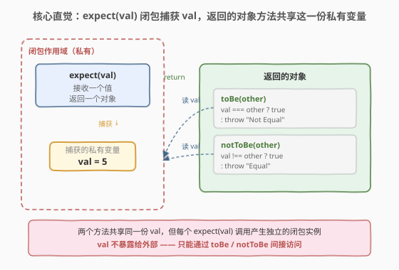
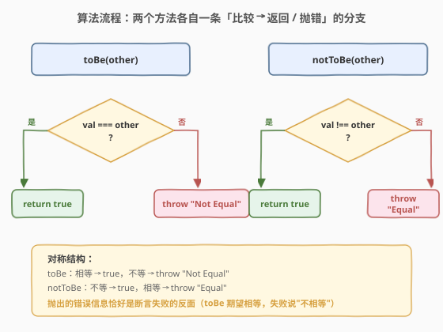
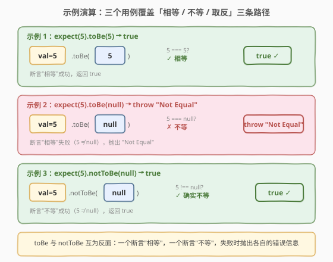

# LeetCode 相等还是不相等 题解

## 1. 题目概述

- **标题 / 题号**：相等还是不相等（#2704，easy）
- **链接**：https://leetcode.cn/problems/to-be-or-not-to-be/
- **难度**：简单
- **标签**：闭包、断言、错误抛出

**题意**：请你编写一个名为 `expect` 的函数，用于帮助开发人员测试他们的代码。它应该接受任何值 `val` 并返回一个包含以下两个函数的对象：

- `toBe(val)`：接受另一个值，并在两个值相等（`===`）时返回 `true`。如果它们不相等，则应抛出错误 `"Not Equal"`。
- `notToBe(val)`：接受另一个值，并在两个值不相等（`!==`）时返回 `true`。如果它们相等，则应抛出错误 `"Equal"`。

**示例 1**：

```text
输入：func = () => expect(5).toBe(5)
输出：{"value": true}
解释：5 === 5 因此该表达式返回 true。
```

**示例 2**：

```text
输入：func = () => expect(5).toBe(null)
输出：{"error": "Not Equal"}
解释：5 !== null 因此抛出错误 "Not Equal"。
```

**示例 3**：

```text
输入：func = () => expect(5).notToBe(null)
输出：{"value": true}
解释：5 !== null 因此该表达式返回 true。
```

**约束**：

- `val` 可以是任何合法的 JavaScript 值（包括 `null`、`undefined`、对象等）
- 本题仅开放 JavaScript / TypeScript 提交

> 💡 本题是 LeetCode「30 天 JavaScript」系列题目，不考算法复杂度，考的是**闭包捕获 + 严格相等判定 + `throw` 抛错**——这是前端测试框架（Jest 的 `expect().toBe()`、Vitest 的 `expect()`）中最基础的断言原语。下文以 JS 为提交语言，并给出 Python 的等价实现。

## 2. 解题思路

### 2.1 暴力思路：用类 + 实例字段存值

最直白的写法：写一个**类** `Expect`，构造函数接收 `val` 存到实例字段 `this.val`，`toBe` / `notToBe` 读这个字段做比较：

```text
class Expect:
    def __init__(self, val): self.val = val
    def toBe(self, other): ...   # self.val === other ?
    def notToBe(self, other): ...
```

逻辑没错，但**过度工程化**了——题目只需要一个返回两个方法的对象，用类是杀鸡用牛刀。更朴素地说，连实例字段都不需要：`val` 是 `expect` 函数的参数，内层方法直接通过**闭包**就能访问它，无需显式存储到 `this` 上。

### 2.2 核心观察：闭包捕获 + throw 抛错



把 `expect(val)` 看作一个**工厂函数**：它接收 `val`，不做任何计算，直接**返回一个对象字面量**，其中两个方法 `toBe` 和 `notToBe` 各自引用了外层参数 `val`——这就是闭包。

**三要素拆解**：

| 要素 | 作用 | 本题体现 |
|------|------|----------|
| **闭包** | 内层函数捕获外层变量 | `toBe` / `notToBe` 闭包捕获 `expect(val)` 的参数 `val` |
| **严格相等** | `===` 不做类型转换 | `5 === "5"` 为 `false`（数值 ≠ 字符串），`==` 则会为 `true` |
| **throw** | 抛出异常打断执行流 | 断言失败时 `throw "Not Equal"` / `throw "Equal"` |

> 💡 **为什么用 `===` 而非 `==`？** 测试框架的断言必须**精确**：`expect(5).toBe("5")` 应当失败（类型不同），用 `==` 会做隐式转换（`5 == "5"` 为 `true`），产生假阳性。`===` 同时比较值与类型，是断言的正确语义。

> ⚠️ **`throw` 抛的是字符串而非 `Error` 对象**：本题要求 `throw "Not Equal"`（字符串），LeetCode 的判题器用 `try/catch` 捕获后检查 `error === "Not Equal"`。工程实践中更推荐 `throw new Error("Not Equal")`（携带调用栈），但本题严格按题意抛字符串即可。

### 2.3 算法流程图



两个方法结构**完全对称**，各自只有一条判断：

- **toBe(other)**：`val === other` → 是则 `return true`，否则 `throw "Not Equal"`
- **notToBe(other)**：`val !== other` → 是则 `return true`，否则 `throw "Equal"`

> 💡 **错误信息是断言的反面**：`toBe` 期望"相等"，失败时说"Not Equal"（不相等）；`notToBe` 期望"不等"，失败时说"Equal"（相等）。错误信息描述的是**断言失败的原因**，而非断言本身。

### 2.4 示例演算



三个示例恰好覆盖三条执行路径：

| 示例 | 调用 | 判定 | 路径 | 结果 |
|------|------|------|------|------|
| 1 | `expect(5).toBe(5)` | `5 === 5` → `true` | toBe 成功 | `{"value": true}` |
| 2 | `expect(5).toBe(null)` | `5 === null` → `false` | toBe 失败 | `{"error": "Not Equal"}` |
| 3 | `expect(5).notToBe(null)` | `5 !== null` → `true` | notToBe 成功 | `{"value": true}` |

每次 `expect(val)` 调用都创建一个**独立的闭包实例**——`val` 绑定在该次调用的作用域中，与其它 `expect` 调用互不干扰。这与 2620 计数器、2666 只允许一次函数调用的闭包私有状态模式同构。

## 3. 参考代码

### JavaScript（提交语言：闭包 + 对象字面量）

```javascript
/**
 * @param {any} val
 * @return {Object}
 */
var expect = function (val) {
    return {
        toBe: function (other) {
            if (val === other) return true;
            throw "Not Equal";
        },
        notToBe: function (other) {
            if (val !== other) return true;
            throw "Equal";
        },
    };
};
```

> 💡 `val` 是 `expect` 的参数，`toBe` / `notToBe` 通过闭包直接引用它，无需存到 `this` 或外部变量。两个方法共享同一份 `val`，且该值对外部完全不可见——只能通过这两个方法间接访问。

**箭头函数简写**：

```javascript
var expect = (val) => ({
    toBe: (other) => {
        if (val === other) return true;
        throw "Not Equal";
    },
    notToBe: (other) => {
        if (val !== other) return true;
        throw "Equal";
    },
});
```

### Python（概念等价）

> 本题 LeetCode 仅开放 JS/TS，Python 版作概念对照。Python 的 `==` 类似 JS 的 `===`（不做字符串与数字的隐式转换），但用户可重写 `__eq__`，严格程度略有差异。

```python
class Expect:
    """Python 概念等价：用类模拟闭包捕获 val 的效果"""
    def __init__(self, val):
        self._val = val          # 等价于闭包捕获的 val

    def to_be(self, other):
        if self._val == other:
            return True
        raise ValueError("Not Equal")

    def not_to_be(self, other):
        if self._val != other:
            return True
        raise ValueError("Equal")


def expect(val):
    """闭包写法：更贴近 JS 原题"""
    def to_be(other):
        if val == other:
            return True
        raise ValueError("Not Equal")

    def not_to_be(other):
        if val != other:
            return True
        raise ValueError("Equal")

    return type("ExpectResult", (), {"toBe": to_be, "notToBe": not_to_be})()
```

> ⚠️ Python 用 `raise` 对应 JS 的 `throw`，用 `ValueError` 对应 JS 抛出的字符串错误。闭包写法中 `to_be` / `not_to_be` 直接引用外层 `val`，与 JS 版语义一致——Python 闭包同样支持捕获外层变量（只读无需 `nonlocal`，因为未重新赋值）。

## 4. 复杂度分析

| 维度 | 复杂度 | 说明 |
|------|--------|------|
| **时间** | $O(1)$ | 一次严格相等比较 + 一次返回或 throw，无循环 |
| **空间** | $O(1)$ | 闭包仅持有 `val` 的引用，返回的对象固定两个方法 |

> 💡 本题没有"规模"可言，复杂度恒为常数；考点在**闭包封装**与**throw 语义**而非性能。

## 5. 扩展：TypeScript 类型约束与 throw 的工程实践

### 5.1 TypeScript 版本

TypeScript 可以为 `expect` 的返回类型定义精确的类型约束，让调用方获得类型提示：

```typescript
type ToBeOrNotToBe = {
    toBe: (val: any) => boolean;
    notToBe: (val: any) => boolean;
};

function expect(val: any): ToBeOrNotToBe {
    return {
        toBe: (other: any) => {
            if (val === other) return true;
            throw "Not Equal";
        },
        notToBe: (other: any) => {
            if (val !== other) return true;
            throw "Equal";
        },
    };
}
```

### 5.2 throw 字符串 vs throw new Error()

本题要求抛出字符串 `"Not Equal"`，但工程实践中更推荐抛出 `Error` 对象：

| 写法 | 调用栈 | 捕获方式 | 适用场景 |
|------|--------|----------|----------|
| `throw "Not Equal"` | ❌ 无 | `catch(e)` 中 `e === "Not Equal"` | LeetCode 判题（本题要求） |
| `throw new Error("Not Equal")` | ✅ 有 | `catch(e)` 中 `e.message === "Not Equal"` | 工程实践（Jest / Vitest） |

> ⚠️ **生产代码中永远 `throw new Error()`**：字符串 throw 不携带调用栈，调试时无法定位抛出位置；`Error` 对象自动捕获调用栈，是工程规范。本题按题意抛字符串即可，但理解两者差异很重要。

### 5.3 这就是 Jest 的 expect().toBe()

本题的 `expect(val).toBe(other)` 正是 Jest / Vitest 断言 API 的最小化原型：

```javascript
// Jest 的真实 expect
expect(result).toBe(42);          // 本题的 toBe
expect(result).not.toBe(null);    // 本题的 notToBe
```

Jest 的完整 `expect` 返回一个 **matcher 对象**，包含 `toBe`、`toEqual`（深度相等）、`toHaveLength`、`toThrow` 等几十个方法。本题只要求实现 `toBe` 和 `notToBe` 两个最基础的断言，但模式完全一致：**工厂函数 + 闭包捕获实际值 + 返回断言方法集**。

## 6. 面试要点

1. **什么是闭包？本题中闭包捕获了什么？**

   > 闭包是函数与其词法作用域的组合——内层函数可以访问外层函数的变量，即使外层函数已返回。本题中 `expect(val)` 返回的对象方法 `toBe` / `notToBe` 闭包捕获了 `expect` 的参数 `val`。`expect(5)` 调用结束后，`val=5` 仍被两个方法持有，不会随栈帧销毁而消失。

2. **`===` 和 `==` 有什么区别？为什么断言用 `===`？**

   > `==` 做隐式类型转换（`5 == "5"` 为 `true`），`===` 不转换、同时比较值与类型（`5 === "5"` 为 `false`）。断言必须精确：`expect(5).toBe("5")` 应当失败（数值 ≠ 字符串），用 `==` 会假阳性。测试框架一律使用严格相等。

3. **`throw` 抛字符串和抛 `Error` 对象有什么区别？**

   > 抛字符串 `throw "Not Equal"` 不携带调用栈，`catch` 捕获到的是原始字符串；抛 `new Error("Not Equal")` 携带调用栈和 `.message`，便于调试定位。本题判题器要求字符串，但工程中应始终 `throw new Error()`。

4. **每次 `expect(val)` 调用是否创建独立的 `val`？多个 `expect` 之间会串台吗？**

   > 不会。每次 `expect(val)` 调用都创建一个**新的闭包作用域**，`val` 绑定在该次调用的栈帧上。`expect(5).toBe(5)` 和 `expect(10).toBe(10)` 中的 `val` 分别是 `5` 和 `10`，互不干扰。这与 2620 计数器中"每个 `createCounter` 返回的计数器持有独立 `n`"是同一模式。

5. **能否用全局变量代替闭包？有什么问题？**

   > 可以但不推荐。全局变量 `g_val` 存值会让多个 `expect` 调用共享同一个变量——`expect(5)` 设置 `g_val=5`，`expect(10)` 覆盖为 `10`，之前 `expect(5)` 返回的方法再调 `toBe` 时读到的是 `10` 而非 `5`，发生串台。闭包让每个 `expect` 实例持有私有 `val`，是封装的标准做法。

> 💡 **一句话总结**：2704 = 「闭包捕获 `val` + 对象返回 `toBe`/`notToBe` 两个方法，严格相等判定 + throw 抛错」。本质是 Jest `expect().toBe()` 断言原语的最小化实现。

## 同类练习题

| # | 题目 | 与本题的关联 |
|---|------|-------------|
| 2620 | [计数器](https://leetcode.cn/problems/counter/)（[题解](../2601-2700/2620_计数器.md)） | 同属「闭包 + 可变私有状态」范式，把本题的只读 `val` 换成可自增的 `n` 即得计数器 |
| 2666 | [只允许一次函数调用](https://leetcode.cn/problems/allow-one-function-call/)（[题解](../2601-2700/2666_只允许一次函数调用.md)） | 同属「闭包封装私有状态」家族，捕获布尔开关而非比较值，对照「只读捕获」与「可变捕获」 |
| 2703 | [返回传递的参数的长度](https://leetcode.cn/problems/return-length-of-arguments-passed/) | JS 函数基础题，`arguments` 与 rest 参数，同属 JS 30 天系列的前序练习 |
| 2705 | [精简对象](https://leetcode.cn/problems/compact-object/) | JS 对象操作题，紧邻本题的 JS 30 天系列后续练习，从函数闭包转向对象遍历 |
