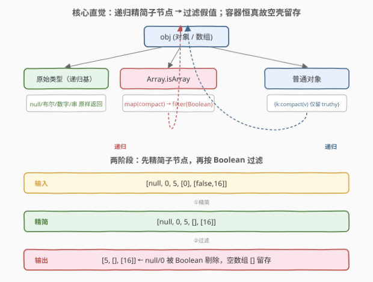
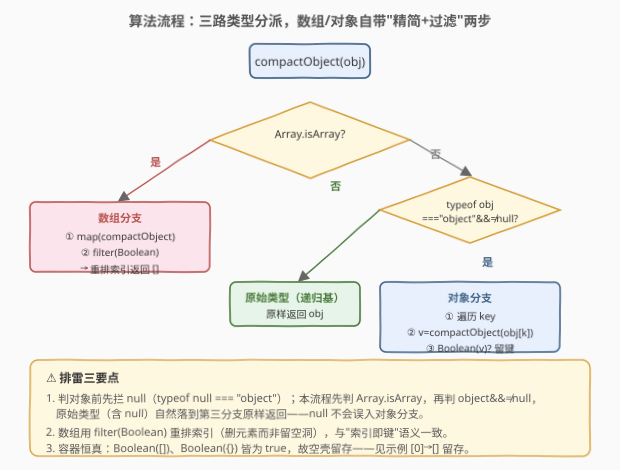

# LeetCode 精简对象 题解

## 1. 题目概述

- **标题 / 题号**：精简对象（#2705，medium）
- **链接**：https://leetcode.cn/problems/compact-object/
- **难度**：中等
- **标签**：递归、JSON、类型分派、深度优先

**题意**：给定一个对象或数组 `obj`，返回一个**精简对象**。

**精简对象**与原始对象相同，只是将包含**假**值的键移除。该操作适用于对象及其嵌套对象。数组被视为索引作为键的对象。当 `Boolean(value)` 返回 `false` 时，值被视为**假**值。

你可以假设 `obj` 是 `JSON.parse` 的输出结果。换句话说，它是有效的 JSON。

**示例 1**：

```text
输入：obj = [null, 0, false, 1]
输出：[1]
解释：数组中的所有假值已被移除。
```

**示例 2**：

```text
输入：obj = {"a": null, "b": [false, 1]}
输出：{"b": [1]}
解释：obj["a"] 和 obj["b"][0] 包含假值，因此被移除。
```

**示例 3**：

```text
输入：obj = [null, 0, 5, [0], [false, 16]]
输出：[5, [], [16]]
解释：obj[0], obj[1], obj[3][0], 和 obj[4][0] 包含假值，因此被移除。
```

**约束**：

- `obj` 是一个有效的 JSON 对象；
- $2 \le \text{JSON.stringify(obj).length} \le 10^6$。

> 💡 本题是 LeetCode「30 天 JavaScript」系列题目，**仅提供 JavaScript / TypeScript 提交入口**，核心考察**递归 + 类型分派 + 假值过滤**。它与 [2633. 将对象转换为 JSON 字符串](2633_将对象转换为JSON字符串.md) 是同一族姊妹题：2633 沿 JSON 文法**递归序列化**一棵树，2705 沿 JSON 文法**递归精简**一棵树——同一套类型分派骨架，换个动作（拼字符串 vs 删假值）。本文以 JS 为提交语言，并给出 Python 概念等价实现。

## 2. 解题思路

### 2.1 暴力思路：先 `JSON.stringify` 再 `JSON.parse` 凑活

一种取巧写法是 `JSON.parse(JSON.stringify(obj).replace(...))`，但正则删假值极易误伤字符串内容（字符串值 `"false"` 也是假值吗？不是——它是非空字符串，真值）。**更本质的问题**是：假值的判定与结构的递归是**同构**的，必须先下钻到子结构精简、再在当前层判定去留。靠字符串拼接绕不开这层递归，正则反而引入新坑。

### 2.2 核心观察：递归 + 类型分派 + 假值过滤



JSON 值的文法本身就是**递归**的——数组和对象的"元素 / 值"又是 JSON 值。精简操作天然沿文法递归：先钻到子结构把它精简成"准值"，再在当前层用 `Boolean()` 判定该准值去留。

按类型分三条分支：

| 分支 | 判定条件 | 动作 | 递归？ |
|------|----------|------|--------|
| **原始类型** | `null` / 布尔 / 数字 / 字符串 | 原样返回（递归基） | 否 |
| **数组** | `Array.isArray(obj)` | 每个元素递归精简 → `filter(Boolean)` → 重排索引 | 是 |
| **对象** | 其余（`typeof === "object" && obj !== null`） | 每个值递归精简 → 仅留 `Boolean(v)` 为真的键 | 是 |

**关键直觉：两阶段——先精简子节点，再过滤假值。** 数组的 `filter(Boolean)` 和对象的"留键"都是第二阶段；第一阶段（`map(compactObject)` / 遍历键调 `compactObject(v)`）先把嵌套结构压平。

> 💡 **为什么空容器（`[]` / `{}`）会被保留？** 因为 JS 中 `Boolean([])` 与 `Boolean({})` 都返回 `true`——**任何对象（含空数组、空对象）都是真值**。示例 3 中 `[0]` 先被精简成 `[]`，而 `[]` 是真值，故留存为 `[]`；`[false, 16]` 精简成 `[16]`，亦留存。这正是"先精简、再过滤"的精髓：子结构先压平，再用 `Boolean` 判定压平后的准值。

> ⚠️ **排雷要点：判对象前先拦 `null`。** `typeof null === "object"` 是 JS 历史遗留设计。若先判 `typeof === "object"`，`null` 会误入对象分支，对 `null` 调 `Object.keys` 直接报错。本解法用 `Array.isArray` 先分流数组，再用 `typeof obj === "object" && obj !== null` 兜底对象，使 `null`（原始类型）自然落到第三分支原样返回——与 [2633](2633_将对象转换为JSON字符串.md) 中"先 `===` 收口、再拦 `null`"的排雷思路同构。

### 2.3 算法流程图



决策是**自顶向下判定、自底向上精简**的：

1. 先判 `Array.isArray`（数组分支：`map(compactObject)` → `filter(Boolean)` → 重排索引）；
2. 否则判 `typeof obj === "object" && obj !== null`（对象分支：遍历键、`v = compactObject(obj[k])`、`Boolean(v)` 为真才留键）；
3. 兜底为原始类型（`null` / 布尔 / 数字 / 字符串）——原样返回，由父层决定取舍。

第 1、2 步会**递归**调用自身，把子结构逐层精简，直到撞上原始类型这一递归基。

### 2.4 示例演算

![示例演算：[null,0,5,[0],[false,16]] 两阶段精简](../images/p2705_compact_walkthrough.svg)

以**示例 3** `obj = [null, 0, 5, [0], [false, 16]]` 为例，两阶段逐元素演算：

| 元素（原值） | ① `compactObject(元素)` | ② `Boolean(精简值)` | 去留 |
|--------------|------------------------|---------------------|------|
| `null` | `null`（原始，原样返回） | `false` ✗ | 删 |
| `0` | `0`（原始，原样返回） | `false` ✗ | 删 |
| `5` | `5`（原始，原样返回） | `true` ✓ | 留 `5` |
| `[0]` | `[]`（内层 `0` 被过滤） | `true` ✓（空数组恒真） | 留 `[]` |
| `[false, 16]` | `[16]`（内层 `false` 被过滤） | `true` ✓ | 留 `[16]` |

① 精简后得 `[null, 0, 5, [], [16]]`，② `filter(Boolean)` 删掉 `null`、`0`（假值），保留 `5`、`[]`、`[16]`，重排索引即输出 `[5, [], [16]]`。

> 💡 **嵌套下钻细节**：以 `[false, 16]` 为例，它本身是数组 → ① `map(compactObject)` 得 `[false, 16]`（两元素都是原始类型，原样返回）→ ② `filter(Boolean)` 把 `false` 删掉得 `[16]`。回到父层，`Boolean([16])` 为 `true` 故留存。`[0]` 同理先精简成 `[]`，因 `Boolean([]) = true` 而留存——**空容器恒真**是本题最易踩坑的点。

## 3. 参考代码

### JavaScript / TypeScript（提交语言）

```javascript
/**
 * @param {Object|Array} obj
 * @return {Object|Array}
 */
function compactObject(obj) {
    // 1. 数组：每个元素递归精简 + filter(Boolean) 删假值并重排索引
    if (Array.isArray(obj)) {
        return obj.map(compactObject).filter(Boolean);
    }
    // 2. 对象：每个值递归精简，仅留 Boolean(v) 为真的键（先拦 null，避免误入）
    if (obj !== null && typeof obj === "object") {
        const result = {};
        for (const key of Object.keys(obj)) {
            const val = compactObject(obj[key]);
            if (Boolean(val)) {
                result[key] = val;
            }
        }
        return result;
    }
    // 3. 原始类型（null / 布尔 / 数字 / 字符串）：原样返回，由父层决定取舍
    return obj;
}
```

TypeScript 版（带类型标注）：

```typescript
type JSONValue = null | boolean | number | string | JSONValue[] | { [key: string]: JSONValue };
type Obj = Record<string, JSONValue> | Array<JSONValue>;

function compactObject(obj: Obj): Obj {
    if (Array.isArray(obj)) {
        return (obj as Array<JSONValue>).map(compactObject).filter(Boolean) as Obj;
    }
    if (obj !== null && typeof obj === "object") {
        const src = obj as Record<string, JSONValue>;
        const result: Record<string, JSONValue> = {};
        for (const key of Object.keys(src)) {
            const val = compactObject(src[key]);
            if (Boolean(val)) {
                result[key] = val as JSONValue;
            }
        }
        return result;
    }
    return obj;
}
```

> 💡 **数组用 `filter(Boolean)` 重排索引**：题目说"数组被视为索引作为键的对象"，删假值键后索引需重排。若改用 `delete arr[i]` 会留下空洞（sparse array），`JSON.stringify` 会把空洞渲染成 `null`，导致 `[]` 变 `[null,...]`——错误。`filter(Boolean)` 天然重排索引，与示例输出一致。

> 💡 **`filter(Boolean)` 的等价展开**：`arr.filter(Boolean)` 等价于 `arr.filter(x => Boolean(x))`。`Boolean` 作为函数引用传入，对每个元素调用，恰好等价于"保留真值"。注意 `filter(Boolean)` 与 `filter(x => x)` 在本题**等价**（都保留真值），但 `Boolean` 语义更贴合题面"当 `Boolean(value)` 返回 `false` 时为假值"。

### Python（概念等价）

> 本题 LeetCode 仅开放 JS/TS，Python 版作概念对照。⚠️ **核心差异**：Python 中空容器（`[]`、`{}`）是**假值**（`bool([]) === False`），而 JS 中空容器是**真值**（`Boolean([]) === true`）。故 Python 版**不能**直接用 `if x` / `filter(None, ...)` 过滤，必须手写一个复刻 JS `Boolean` 语义的判定函数——否则示例 3 的 `[]` 会被误删，输出变成 `[5, [16]]` 而非 `[5, [], [16]]`。

```python
def _js_truthy(v):
    """复刻 JS Boolean()：容器（list/dict）恒为真，仅原始假值返回 False。"""
    if v is None:
        return False
    if isinstance(v, bool):
        return v
    if isinstance(v, (int, float)):
        return v != 0
    if isinstance(v, str):
        return v != ""
    return True  # list / dict（含空容器）恒真——JS Boolean([])===true


def compact_object(obj):
    # 1. 列表：递归精简每个元素 + 过滤 JS 意义下的假值
    if isinstance(obj, list):
        compacted = [compact_object(x) for x in obj]
        return [x for x in compacted if _js_truthy(x)]
    # 2. 字典：递归精简每个值，仅留 JS 真值键
    if isinstance(obj, dict):
        result = {}
        for k, v in obj.items():
            cv = compact_object(v)
            if _js_truthy(cv):
                result[k] = cv
        return result
    # 3. 原始类型：原样返回，由父层决定取舍
    return obj
```

> ⚠️ **Python 的 `bool`/`int` 陷阱**：`isinstance(True, int)` 为 `True`，故判定中 `bool` 必须先于 `int` 单独处理（否则 `True` 会走 `int` 分支，虽结果恰好一致但语义不清）。这与 [2633](2633_将对象转换为JSON字符串.md) 中"`bool` 是 `int` 子类、`str(True)` 得 `"True"`"的陷阱同源——两语言类型系统的差异点。

## 4. 复杂度分析

| 维度 | 复杂度 | 说明 |
|------|--------|------|
| 时间复杂度 | $O(n)$ | $n$ 为所有层级的键 / 元素总数；每个节点至多被访问常数次，递归无重复下钻 |
| 空间复杂度 | $O(n)$ | 输出结构与输入同阶；递归栈 $O(h)$（$h$ 为嵌套深度），通常 $h \ll n$ |

> 💡 本质是**一次结构同构的遍历**：递归沿 JSON 树逐层下钻，每个节点先精简子节点、再用 `Boolean` 判定自身去留。`map` + `filter` 各遍历一次子节点，合计常数次，总时间 $O(n)$。输出结构不含被删的假值节点，规模不超过输入，故空间 $O(n)$。

## 5. 扩展：`Boolean` 的真值表与陷阱

- **JS 的假值全集**：`false`、`0`、`-0`、`0n`（BigInt 零）、`""`（空串）、`null`、`undefined`、`NaN`。这八种以外**一切为真**——包括空数组 `[]`、空对象 `{}`、字符串 `"false"`（非空字符串）、`new Boolean(false)`（对象包装器，真值）。本题输入是合法 JSON，不含 `undefined` / `NaN` / `BigInt` / 函数，故实际只需应对 `false` / `0` / `""` / `null` 四种。
- **`Boolean(x)` vs `!!x` vs `x`**：三者在本题等价（`Boolean(x)` 与 `!!x` 完全一致；`if (x)` 也按相同真值表短路）。`filter(Boolean)` 用的是第一种，语义最贴合题面。注意 `filter(x => x === true)` 是**错的**——它只留 `true`，会误删 `5`、`"a"` 等非布尔真值。
- **空容器的去留**：这是本题与"通用过滤"题（如 [2634. 过滤数组中的元素](2634_过滤数组中的元素.md)）的分水岭。2634 用谓词函数 `fn` 显式判每个元素，空容器是否留取决于 `fn([])`；本题的"谓词"固定为 `Boolean`，而 JS 里 `Boolean([])` 恒真，故空壳一律留存。若改用 Python 的 `bool([])`（假值），语义就变了——这也是 Python 版必须手写 `_js_truthy` 的根因。
- **就地修改 vs 新建**：本解法返回**新建**的结构（数组 `map`/`filter` 产出新数组，对象新建 `result`）。若要求就地修改，数组需用 `splice` 反向删除（正向遍历会错位），对象可直接 `delete` 键——但新建更简洁且无副作用，是首选。

> 💡 工程实践中，"递归 + 类型分派"是处理任意嵌套 JSON 的通用骨架——序列化（2633）、深度相等（2628）、精简（本题）、扁平化（2625）都是这套骨架换不同动作。掌握它，就抓住了 JSON 操作类题目的母题。

## 6. 面试要点

1. **为什么空数组 `[]` 会被保留，而 `0` 会被删除？**

   > 因为 JS 中 `Boolean([])` 返回 `true`（任何对象都是真值），而 `Boolean(0)` 返回 `false`。本题的"假值"判定固定为 `Boolean(value)`，所以 `[0]` 先递归精简成 `[]`，再在父层被 `Boolean([]) = true` 判定为真而留存；`0` 则直接被 `Boolean(0) = false` 删除。这是"先精简子节点、再过滤"两阶段设计的直接体现。

2. **为什么判对象前要先拦 `null`？**

   > 因为 `typeof null === "object"` 是 JS 历史遗留设计。若先判 `typeof === "object"`，`null` 会误入对象分支，对 `null` 调 `Object.keys` 直接报错。本解法用 `obj !== null && typeof obj === "object"` 兜底，使 `null`（原始类型）落到第三分支原样返回——与 [2633](2633_将对象转换为JSON字符串.md) 中"先 `===` 收口再拦 `null`"同构，都是"先排雷、再分派"。

3. **数组为什么用 `filter(Boolean)` 而不是 `delete` 删索引？**

   > 题目说"数组被视为索引作为键的对象"，删假值键后索引需重排。`delete arr[i]` 会留下空洞（sparse array），`JSON.stringify` 把空洞渲染成 `null`，导致 `[]` 错变 `[null,...]`。`filter(Boolean)` 天然重排索引，与示例输出 `[5, [], [16]]` 一致。

4. **为什么 `filter(Boolean)` 不能写成 `filter(x => x === true)`？**

   > 因为 `=== true` 只匹配布尔 `true`，会误删 `5`、`"abc"`、`[]` 等所有非布尔的真值。`Boolean(x)` 的真值表涵盖一切非假值（数字非零、非空字符串、对象等），`filter(Boolean)` 才是"保留真值"的正确写法。

5. **递归的终止条件是什么？会不会无限递归？**

   > 终止条件是撞上**原始类型**（`null` / 布尔 / 数字 / 字符串）——它们没有子结构，原样返回。数组和对象的元素 / 值才是 JSON 值，会触发递归。题目保证输入是合法 JSON（无环、无函数），故递归必然在有限深度内终止于原始类型叶子。

> 💡 **一句话总结**：2705 = 「沿 JSON 文法递归 + 三分支类型分派 + `Boolean` 过滤」。原始类型原样返回是递归基；数组 `map(compact)+filter(Boolean)`、对象 `{k:compact(v) 仅留真值}` 是递归步。先拦 `null` 排雷，两阶段"先精简子节点、再过滤假值"，空容器恒真故空壳留存——一次遍历 $O(n)$ 搞定。

## 同类练习题

| # | 题目 | 与本题的关联 |
|---|------|-------------|
| 2633 | [将对象转换为 JSON 字符串](https://leetcode.cn/problems/convert-object-to-json-string/)（[题解](2633_将对象转换为JSON字符串.md)） | 沿 JSON 文法**递归序列化**一棵树，与本题**递归精简**共用同一套类型分派骨架，一序列化一精简 |
| 2628 | [完全相等的 JSON 对象](https://leetcode.cn/problems/json-deep-equal/)（[题解](2628_完全相等的JSON对象.md)） | 沿 JSON 文法**递归比对**两棵树，复用类型分派骨架与"先拦 `null`"排雷，一判等一精简 |
| 2625 | [扁平化嵌套数组](https://leetcode.cn/problems/flatten-deeply-nested-array/)（[题解](2625_扁平化嵌套数组.md)） | 递归遍历嵌套数组按深度剪枝，同属"JSON 文法递归"家族，巩固对数组/对象递归的运用 |
| 2634 | [过滤数组中的元素](https://leetcode.cn/problems/filter-elements-from-array/) | 用谓词函数显式过滤数组元素，与本题"谓词固定为 `Boolean`"形成对照——理解了通用过滤，本题是其特例 |
| 2692 | [使对象不可变](https://leetcode.cn/problems/make-object-immutable/) | 沿 JSON 树递归冻结对象，同属"JSON 文法递归 + 类型分派"家族，一冻结一精简 |
