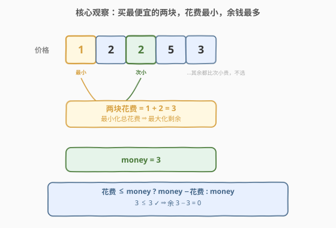
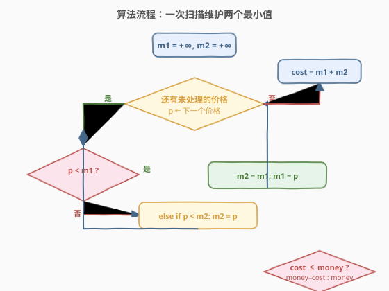
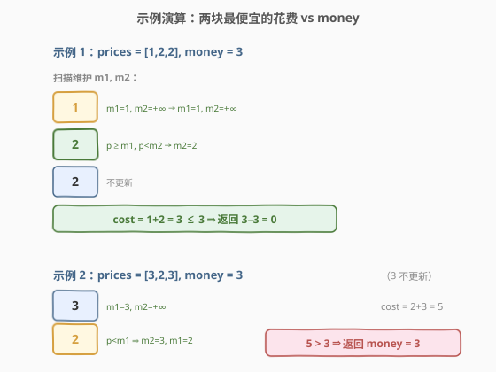

# LeetCode 购买两块巧克力 题解

## 1. 题目概述

- **标题 / 题号**：购买两块巧克力（#2706，easy）
- **链接**：https://leetcode.cn/problems/buy-two-chocolates/
- **难度**：简单
- **标签**：贪心、数组、排序

**题意**：给你一个整数数组 `prices`，表示商店里若干巧克力的价格；同时给你一个整数 `money`，表示你一开始拥有的钱数。你必须购买**恰好两块**巧克力，且剩余钱数必须**非负**。你想**最小化**购买两块巧克力的总花费。请返回购买两块巧克力后**最多能剩下多少钱**；如果购买任意两块都超过你拥有的钱，返回 `money`。

**示例 1**：

```text
输入：prices = [1,2,2], money = 3
输出：0
解释：购买价格为 1 和 2 的两块巧克力，剩余 3 - 3 = 0 块钱。
```

**示例 2**：

```text
输入：prices = [3,2,3], money = 3
输出：3
解释：购买任意两块巧克力都会超过你拥有的钱，所以返回 3。
```

**约束**：

- $2 \le \text{prices.length} \le 50$
- $1 \le \text{prices}[i] \le 100$
- $1 \le \text{money} \le 100$

> 💡 关键转化：要「最大化剩余钱数」即「最小化总花费」。两块的总花费越小，剩余越多。于是只需关注**最小的两个价格**——其它任何组合的花费都不小于它，不可能留下更多钱。

## 2. 解题思路

### 2.1 暴力思路：枚举所有两块组合

最朴素的思路：枚举所有下标对 $(i, j)$（$i \neq j$），计算 $prices[i] + prices[j]$，若 $\le money$ 则更新剩余最大值，否则忽略。最后若没有任何合法组合，返回 `money`。

时间复杂度 $O(n^2)$，对 $n \le 50$ 完全够用。但这是把「选最小」这一本质淹没在枚举里——其实只需知道**最小的两个数**，根本不必两两试。

### 2.2 核心观察：只取最便宜的两块



设数组中最小值为 $m_1$、次小值为 $m_2$（$m_1 \le m_2$）。任意两块的花费 $prices[i] + prices[j]$ 必然满足：

$$prices[i] + prices[j] \ge m_1 + m_2$$

因为 $m_1, m_2$ 是所有价格中最小的两个，任何其它挑选都不会更便宜。所以**总花费最小值就是 $m_1 + m_2$**。于是：

- 若 $m_1 + m_2 \le money$：买这两块，返回 $money - (m_1 + m_2)$；
- 否则：任何组合都超支，返回 $money$。

> ⚠️ 「恰好两块」是硬约束，不能只买一块省更多钱。所以最小花费下界由两个最小价格决定，而非单个最小价格。这正是「取次小」的必要性。

### 2.3 算法流程图



求两个最小值有两种等价实现：

- **排序**：`sort(prices)` 后取前两个，$O(n \log n)$，写法最简；
- **一次扫描**：维护 $m_1 \le m_2$，遍历每个价格 $p$ 更新两者，$O(n)$，单次遍历最优。

逻辑流程：初始化 $m_1 = m_2 = +\infty$，对每个 $p$：
- 若 $p < m_1$：原 $m_1$ 成为新次小，即 $m_2 = m_1$，再 $m_1 = p$；
- 否则若 $p < m_2$：$m_2 = p$（$p$ 落在 $[m_1, m_2)$ 区间，仅刷新次小）。

遍历结束后 $\text{cost} = m_1 + m_2$，按上式返回。

### 2.4 示例演算



**示例 1：`prices = [1,2,2], money = 3`**

| 步骤 | 当前价格 | m1 | m2 | 说明 |
|------|----------|----|----|------|
| 初值 | — | $+\infty$ | $+\infty$ | — |
| 1 | 1 | 1 | $+\infty$ | $p < m_1$，更新 m1 |
| 2 | 2 | 1 | 2 | $p \ge m_1$ 且 $p < m_2$，更新 m2 |
| 3 | 2 | 1 | 2 | 不更新 |

$\text{cost} = 1 + 2 = 3 \le 3 \Rightarrow$ 返回 $3 - 3 = 0$ $\checkmark$

**示例 2：`prices = [3,2,3], money = 3`**

| 步骤 | 当前价格 | m1 | m2 | 说明 |
|------|----------|----|----|------|
| 初值 | — | $+\infty$ | $+\infty$ | — |
| 1 | 3 | 3 | $+\infty$ | $p < m_1$，更新 m1 |
| 2 | 2 | 2 | 3 | $p < m_1$，旧 m1 作 m2，再更新 m1 |
| 3 | 3 | 2 | 3 | 不更新 |

$\text{cost} = 2 + 3 = 5 > 3 \Rightarrow$ 返回 $money = 3$ $\checkmark$

> 💡 第 2 步把「原先的最小」降级为「次小」是关键：遇到比当前最小更小的值时，旧的最小自然变成第二小，必须先存走再覆盖，否则次小信息会丢失。

## 3. 参考代码

### C++

```cpp
class Solution {
public:
    int buyChoco(vector<int>& prices, int money) {
        int m1 = INT_MAX, m2 = INT_MAX;
        for (int p : prices) {
            if (p < m1) { m2 = m1; m1 = p; }   // 更小的出现：旧最小降级为次小
            else if (p < m2) m2 = p;           // 仅落在 [m1, m2) 区间：刷新次小
        }
        int cost = m1 + m2;
        return cost <= money ? money - cost : money;
    }
};
```

### Python

```python
class Solution:
    def buyChoco(self, prices: List[int], money: int) -> int:
        m1 = m2 = float('inf')
        for p in prices:
            if p < m1:
                m2, m1 = m1, p      # 旧最小降级为次小
            elif p < m2:
                m2 = p
        cost = m1 + m2
        return money - cost if cost <= money else money
```

> 💡 Python 里 `m2, m1 = m1, p` 是**元组解包**，右侧先整体求值再赋值，天然避免了「先改 m1 再赋 m2」的顺序陷阱，比 C++ 的 `m2 = m1; m1 = p` 更不容易写错。若想代码更短，可直接 `prices.sort()` 取前两个，但复杂度升到 $O(n \log n)$——数据量 $n \le 50$ 时两者实际都可，一次扫描更体现思路。

## 4. 复杂度分析

| 维度 | 复杂度 | 说明 |
|------|--------|------|
| 时间复杂度 | $O(n)$ | 一次扫描，每个价格 $O(1)$ 更新两个最小值 |
| 空间复杂度 | $O(1)$ | 仅维护两个标量 $m_1, m_2$，无额外数据结构 |

> 💡 若用排序法，时间 $O(n \log n)$、空间 $O(\log n)$（排序栈）。本题 $n \le 50$，两者实测无差异；一次扫描是「求前 $k$ 小」$k$ 为常数时的通用最优写法。

## 5. 扩展：求「前 k 小」的一次扫描模板

本题是「求数组前 $k$ 小」当 $k=2$ 的特例。一次扫描维护 $k$ 个最小值的思路可推广：

- 维护长度为 $k$ 的有序小数组（或最小堆），逐元素插入并保持有序；
- 新元素比当前第 $k$ 小更小时，替换并重新找位；
- $k$ 为常数时整体 $O(n)$，$k$ 较大时退化到 $O(n \log k)$。

> ⚠️ 当 $k$ 不再是常数（如「第 $k$ 小」$k$ 与 $n$ 同阶），应改用**快速选择**（$O(n)$ 期望）或**堆**（$O(n \log k)$）。本题 $k=2$ 为常数，故一次扫描足矣，无需引入堆或选择算法的复杂度。

### 5.1 若问题改为「至多买 k 块、剩余非负、最大化剩余」

则变成「选至多 $k$ 个最小的使总和 $\le money$」——可排序后从最小开始累加，贪心地多买一块更小的总能进一步减少剩余，直到加不下为止。这承接「**正数前提下贪心取最小累加**」的滑动窗口/背包思想。

## 6. 面试要点

1. **为什么只需最小的两个价格？**

   > 要最大化剩余钱数等价于最小化两块总花费。任意两块的花费 $\ge m_1 + m_2$（最小与次小之和），所以最小花费就是 $m_1 + m_2$，其它组合不会更省，无需枚举。

2. **遇到比当前最小还小的值时，为什么要先存旧最小再覆盖？**

   > 旧的最小在更新后会变成新的次小。若直接 `m1 = p` 而不先把 `m1` 存入 `m2`，原先的最小值就丢了，次小会错位。正确顺序是 `m2 = m1; m1 = p`（或 Python 的元组解包）。

3. **「恰好两块」这个约束如何影响下界？**

   > 它把花费下界从「单个最小」抬到「两个最小之和」。若允许只买一块，答案会是 $money - m_1$（可能更大）；「恰好两块」强制取次小，下界变为 $m_1 + m_2$，这是次小值存在的根本原因。

4. **一次扫描法相比排序法优势在哪？**

   > 复杂度从 $O(n \log n)$ 降到 $O(n)$，空间从 $O(\log n)$ 降到 $O(1)$，且不修改输入。对 $n$ 很大的「求前 $k$ 小」场景（$k$ 为常数）尤其重要；本题 $n$ 小但思路可迁移。

5. **如果数组长度恰好为 2 怎么办？**

   > 约束保证 $n \ge 2$，故必然有合法的两个最小值。一次扫描会正确地把两者分别放入 $m_1, m_2$，无需对边界做特判；若 $n=2$，第二个元素只会走 `else if` 或直接 `if` 一条分支，逻辑仍正确。

## 同类练习题

| # | 题目 | 与本题的关联 |
|---|------|-------------|
| 704 | [二分查找](https://leetcode.cn/problems/binary-search/)（[题解](../0701-0800/704_二分查找.md)） | 基础数组分治。本题是线性扫描找极值，可对比「无序找最小」与「有序找目标」的两种数组基本操作 |
| 215 | [数组中的第K个最大元素](https://leetcode.cn/problems/kth-largest-element-in-an-array/) | 求第 $k$ 大/小的通用化。本题是 $k=2$ 的特例，可对比一次扫描与快速选择/堆在 $k$ 增大时的取舍 |
| 414 | [第三大的数](https://leetcode.cn/problems/third-maximum-number/) | 一次扫描维护前 3 个不同最大值。与本题维护前 2 小同属「常数个极值」模板，多了去重判断 |
| 2656 | [最大总和](https://leetcode.cn/problems/maximum-sum-with-exactly-k-elements/) | 从数组选 $k$ 个使和最大。与本题「选 2 个使和最小」对称，可对比取最大与取最小的对称贪心 |
| 53 | [最大子数组和](https://leetcode.cn/problems/maximum-subarray/)（[题解](../0001-0100/53_最大子数组和.md)） | 在线维护极值的思想母题。本题维护两个最小值与 Kadane 维护当前最大和都是「一次扫描滚动更新极值」的范式 |
