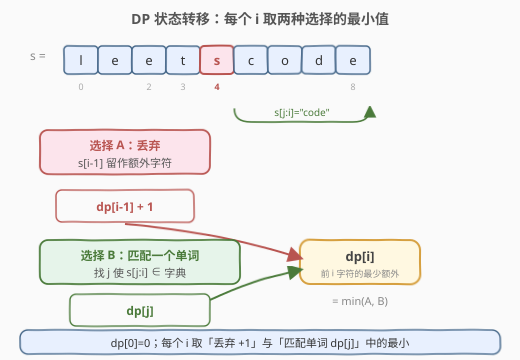
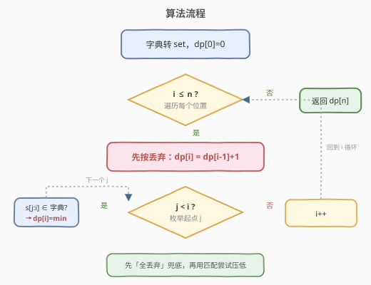
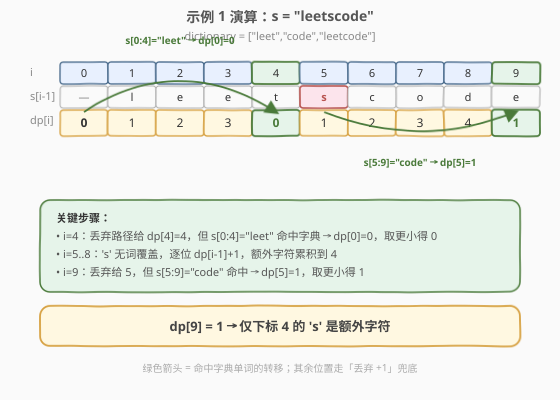

# LeetCode 字符串中的额外字符 题解

## 1. 题目概述

- **标题 / 题号**：字符串中的额外字符（#2707，medium）
- **链接**：https://leetcode.cn/problems/extra-characters-in-a-string/
- **难度**：中等
- **标签**：动态规划、字符串、哈希表、字典树

**题意**：给你一个下标从 **0** 开始的字符串 `s` 和一个单词字典 `dictionary`。你需要将 `s` 分割成若干个 **互不重叠** 的子字符串，每个子字符串都在 `dictionary` 中出现过。`s` 中可能会有一些 **额外的字符** 不在任何子字符串中。

请你采取最优策略分割 `s`，使剩下的字符 **最少**。

**示例 1**：

```text
输入：s = "leetscode", dictionary = ["leet","code","leetcode"]
输出：1
解释：将 s 分成两个子字符串：下标 0 到 3 的 "leet" 和下标 5 到 8 的 "code"。
只有 1 个字符没有使用（下标为 4 的 's'），所以返回 1。
```

**示例 2**：

```text
输入：s = "sayhelloworld", dictionary = ["hello","world"]
输出：3
解释：将 s 分成两个子字符串：下标 3 到 7 的 "hello" 和下标 8 到 12 的 "world"。
下标 0、1 和 2 的字符 "say" 没有使用，所以返回 3。
```

**约束**：

- `1 <= s.length <= 50`
- `1 <= dictionary.length <= 50`
- `1 <= dictionary[i].length <= 50`
- `dictionary[i]` 和 `s` 只包含小写英文字母
- `dictionary` 中的单词互不相同

> 💡 这题本质是 [139. 单词拆分](https://leetcode.cn/problems/word-break/) 的「最小化残余」变体：139 问「能否完全拆分」，本题问「最优拆分后最少剩多少」。约束很小（`n <= 50`），$O(n^2)$ DP 足够。

## 2. 解题思路

### 2.1 暴力思路

枚举所有分割方案（在每个位置选「断/不断」），检查每段是否在字典中，统计残余字符取最小 → $O(2^n)$ 指数级，超时。瓶颈在于「剩余后缀怎么分」被反复重算，存在大量重叠子问题。

### 2.2 核心观察：一维 DP 最小额外字符



定义 `dp[i]` 为**前 i 个字符（`s[0..i-1]`）的最少额外字符数**。对每个新位置 `i`，只有两种互斥的「最后一手」：

- **选择 A（丢弃）**：把 `s[i-1]` 当作额外字符，则 `dp[i] = dp[i-1] + 1`。
- **选择 B（匹配一个单词）**：若存在 `j < i` 使 `s[j..i-1]` 在字典中，则这段被整词覆盖、无残余，`dp[i] = dp[j]`。

两者取最小。**先用 A 兜底**（每个位置最坏多一个额外字符），**再用 B 压低**（一旦匹配到词就能继承 `dp[j]`，可能更小）。

$$dp[i] = \min\Big(\;dp[i-1]+1,\;\;\min_{\substack{j<i\\s[j:i]\in \text{dict}}} dp[j]\;\Big)$$

边界 `dp[0] = 0`（空前缀无残余），答案 `dp[n]`。

> 💡 与 139 的同构：139 的 `dp[i]` 是布尔「前 i 字符能否拆」，转移是 `dp[j] ∧ s[j:i]∈dict`；本题把布尔换成**整数最小值**，多一个「丢弃 +1」的兜底分支，其余结构完全一致。

### 2.3 算法流程图



### 2.4 示例演算



以**示例 1**（`s = "leetscode"`，`dictionary = ["leet","code","leetcode"]`）为例，`dp` 表如下（绿色列为命中单词的转移）：

| i | s[i-1] | 丢弃 dp[i-1]+1 | 命中单词的转移 | dp[i] |
|---|--------|----------------|------------------|-------|
| 0 | — | — | — | 0 |
| 1 | l | 1 | — | 1 |
| 2 | e | 2 | — | 2 |
| 3 | e | 3 | — | 3 |
| 4 | t | 4 | s[0:4]="leet" → dp[0]=0 | **0** |
| 5 | s | 1 | — | 1 |
| 6 | c | 2 | — | 2 |
| 7 | o | 3 | — | 3 |
| 8 | d | 4 | — | 4 |
| 9 | e | 5 | s[5:9]="code" → dp[5]=1 | **1** |

最终 `dp[9] = 1`，对应下标 4 的 `'s'` 为额外字符。✓

## 3. 参考代码

### C++

```cpp
class Solution {
public:
    int minExtraChar(string s, vector<string>& dictionary) {
        unordered_set<string> dict(dictionary.begin(), dictionary.end());
        int n = s.size();
        vector<int> dp(n + 1, 0);
        for (int i = 1; i <= n; i++) {
            dp[i] = dp[i - 1] + 1;                      // 兜底：s[i-1] 作额外字符
            for (int j = 0; j < i; j++) {
                if (dict.count(s.substr(j, i - j))) {   // s[j:i] 命中字典
                    dp[i] = min(dp[i], dp[j]);
                }
            }
        }
        return dp[n];
    }
};
```

### Python

```python
class Solution:
    def minExtraChar(self, s: str, dictionary: List[str]) -> int:
        word_set = set(dictionary)
        n = len(s)
        dp = [0] * (n + 1)
        for i in range(1, n + 1):
            dp[i] = dp[i - 1] + 1                       # 兜底：s[i-1] 作额外字符
            for j in range(i):
                if s[j:i] in word_set:                 # s[j:i] 命中字典
                    dp[i] = min(dp[i], dp[j])
        return dp[n]
```

## 4. 复杂度分析

| 维度 | 复杂度 | 说明 |
|------|--------|------|
| 时间复杂度 | $O(n^2 \cdot m)$ | $n$ 个位置，每个内层枚举 $j$ 共 $O(n^2)$ 次，每次 `substr + hash` 取 $O(m)$（$m$=子串平均长度）；$n \le 50$ 足够小 |
| 空间复杂度 | $O(n + k \cdot m)$ | `dp` 数组 $O(n)$ + 字典 `set` $O(k \cdot m)$（$k$=词数） |

> 💡 可把内层复杂度降到 $O(n \cdot L_{\max})$：只枚举 $j = \max(0, i-L_{\max}) \dots i-1$，因为字典中最长的词长度 $L_{\max}$ 限制了能命中的子串长度。也可按字典中存在的词长集合去重，只尝试「有可能命中」的长度。

## 5. 扩展：字典树 + 倒序匹配

当 `n` 较大时（如 `s.length` 提到 $10^5$ 量级），`substr + hash` 的常数会成为瓶颈，可用**字典树（Trie）** 加速匹配：

把字典的所有词插入 Trie。枚举起点 `j`（而非终点 `i`），从 `s[j]` 起沿 Trie 向下走，**每经过一个完整单词的结束节点**就得到一个匹配 `s[j : j+len]`，更新 `dp[j+len] = min(dp[j+len], dp[j])`。这样一次 Trie 下探就能找出所有以 `j` 开头的命中词，无需对每个终点重新做哈希查找。

```cpp
struct Trie {
    Trie* ch[26] = {};
    bool end = false;
    void insert(const string& w) {
        Trie* p = this;
        for (char c : w) {
            int k = c - 'a';
            if (!p->ch[k]) p->ch[k] = new Trie();
            p = p->ch[k];
        }
        p->end = true;
    }
};

int minExtraChar(string s, vector<string>& dictionary) {
    Trie* root = new Trie();
    for (auto& w : dictionary) root->insert(w);
    int n = s.size();
    vector<int> dp(n + 1, 0);
    for (int j = 0; j < n; j++) {
        dp[j + 1] = min(dp[j + 1], dp[j] + 1);        // 兜底丢弃
        Trie* p = root;
        for (int k = j; k < n && p->ch[s[k] - 'a']; k++) {
            p = p->ch[s[k] - 'a'];
            if (p->end) dp[k + 1] = min(dp[k + 1], dp[j]); // s[j:k+1] 命中
        }
    }
    return dp[n];
}
```

> ⚠️ Trie 版把「枚举终点查哈希」换成「枚举起点走 Trie」，匹配总量仍是所有命中词数之和，常数更小；但本题 $n \le 50$，`set` 版已足够，Trie 主要体现标签里「字典树」的解法谱系。

## 6. 面试要点

1. **`dp[i]` 的含义是什么？和 139 题的区别在哪？**

   - `dp[i]` = 前 `i` 个字符按最优分割后的**最少额外字符数**；139 的 `dp[i]` 是「能否完全拆分」的布尔值。
   - 结构同构：都是「前缀结果 `dp[j]` + 增量段 `s[j:i]`」的组合；本题多一个「丢弃 +1」的兜底分支，把布尔最优化成了整数最小化。

2. **为什么必须先赋 `dp[i] = dp[i-1] + 1` 再尝试匹配？**

   - 这个兜底值代表「最坏情况下第 `i-1` 个字符是额外的」。后续匹配只会取 `min` 压低它，不会变差。
   - 若不兜底，`dp[i]` 初值会是 0，则任何不匹配的位置会被错误地记成 0 个额外字符。

3. **内层循环能优化吗？两种思路分别适用什么场景？**

   - **长度裁剪**：内层 `j` 只从 $\max(0, i - L_{\max})$ 到 $i-1$，因为更长的子串不可能命中字典。适合字典词长较短且集中。
   - **字典树**：枚举起点走 Trie，一次下探找全所有命中词，避免重复哈希。适合 $n$ 大、字典也大的场景。
   - 本题 $n \le 50$，朴素 $O(n^2)$ 即可，优化是锦上添花。

4. **题目说子串「互不重叠」，DP 怎么体现？**

   - 转移 `dp[i] = dp[j]`（命中时）意味着前 `j` 个字符和 `s[j:i]` 这段是**前后拼接、不重叠**的两部分。每个位置只被「丢弃」或「被某个单词覆盖」一次，天然不重叠。

5. **答案有可能等于 `n` 吗？**

   - 可能。当字典中没有任何词能匹配 `s` 的任一段时，每个字符都走「丢弃 +1」，`dp[n] = n`。例：`s = "abc"`，`dictionary = ["xyz"]` → 返回 3。

## 同类练习题

| # | 题目 | 与本题的关联 |
|---|------|-------------|
| 139 | [单词拆分](https://leetcode.cn/problems/word-break/)（[题解](../0101-0200/139_单词拆分.md)） | DP 判定能否完全拆分，是本题的布尔版母题，转移结构完全同构 |
| 140 | [单词拆分 II](https://leetcode.cn/problems/word-break-ii/) | 在 139 基础上枚举所有拆分方案，记忆化 DFS |
| 472 | [连接词](https://leetcode.cn/problems/concatenated-words/) | 判断一个词能否由其它词拼成，字典树 + DFS，延续「子串是否在字典中」的匹配模式 |
| 1408 | [数组中的字符串匹配](https://leetcode.cn/problems/string-matching-in-an-array/) | 子串匹配的朴素版，无 DP，可作 KMP/Trie 的练习 |
| 676 | [实现一个魔法字典](https://leetcode.cn/problems/implement-magic-dictionary/) | 字典树的变体应用，支持「至多一个字符不同」的查询 |
