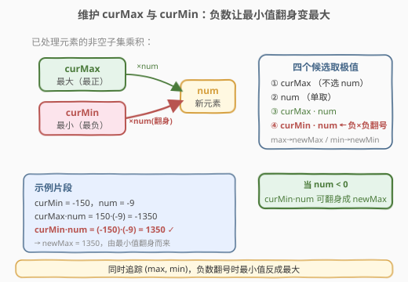
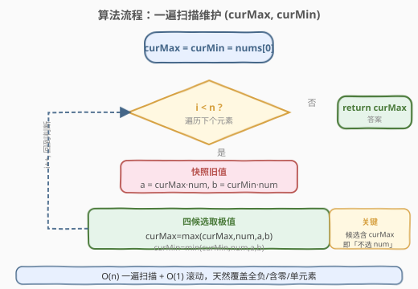
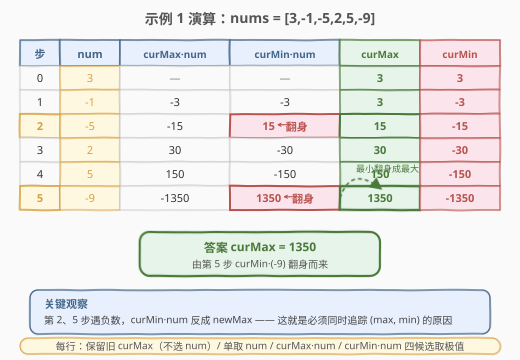

# 一个小组的最大实力值

- **题目名称**：一个小组的最大实力值
- **链接**：[2708. 一个小组的最大实力值](https://leetcode.cn/problems/maximum-strength-of-a-group/)
- **难度**：中等
- **标签**：贪心、位运算、数组、动态规划、回溯、枚举、排序

## 1. 题目概述

给你一个下标从 **0** 开始的整数数组 `nums`，表示班级中所有学生在一次考试中的成绩。老师想选出一部分同学组成一个 **非空** 小组，使这个小组的 **实力值** 最大。小组实力值定义为选中学生成绩的乘积：`nums[i0] * nums[i1] * ... * nums[ik]`。

返回能得到的最大实力值。

**示例 1**：

```text
输入：nums = [3,-1,-5,2,5,-9]
输出：1350
解释：选择下标 [0,2,3,4,5] 的学生，实力值 = 3 * (-5) * 2 * 5 * (-9) = 1350。
```

**示例 2**：

```text
输入：nums = [-4,-5,-4]
输出：20
解释：选择下标 [0,1] 的学生，实力值 = (-4) * (-5) = 20。
```

**约束条件**：

- `1 <= nums.length <= 13`
- `-9 <= nums[i] <= 9`

> 💡 本题是「选子集使乘积最大」，与 [152. 乘积最大子数组](https://leetcode.cn/problems/maximum-product-subarray/) 同源——都因负数参与而需同时追踪最大/最小值。区别：152 选**连续子数组**，本题选**任意子集**（可跳过元素），所以转移更自由、约束也更小（`n <= 13`）。

---

## 2. 解题思路

### 2.1 暴力思路

`n <= 13`，可直接**位掩码枚举**所有 $2^n - 1$ 个非空子集，对每个子集算乘积取最大 → $O(n \cdot 2^n)$，约 $13 \times 8192 \approx 10^5$，可过。但缺乏对「负数翻号」的利用，常数也偏大。

### 2.2 核心观察：同时维护最大 / 最小乘积



子集乘积的关键难点是**负数**：一个当前最小的（最负）乘积，再乘一个负数就翻身变成最大的（最正）。因此必须同时维护扫描到当前位置时所有子集乘积的**最大值**与**最小值**。

设 `curMax` / `curMin` 分别为「已处理元素能组成的非空子集乘积」的最大 / 最小值。对每个新元素 `num`，子集要么**不含 `num`**（保留旧的 `curMax`/`curMin`），要么**含 `num`**：单取 `num`，或把 `num` 拼进旧子集（`curMax*num`、`curMin*num`）。取四个候选的极值：

$$
\text{newMax} = \max(\text{curMax},\; \text{num},\; \text{curMax}\cdot\text{num},\; \text{curMin}\cdot\text{num})
$$

$$
\text{newMin} = \min(\text{curMin},\; \text{num},\; \text{curMax}\cdot\text{num},\; \text{curMin}\cdot\text{num})
$$

用**快照**旧值算两者（避免 `curMax` 先更新影响 `curMin`）。初始 `curMax = curMin = nums[0]`（首元素必属某子集，保证「已选非空」），从下标 1 起迭代，答案为 `curMax`。

> 💡 与 152 的区别：152 是连续子数组，转移只有「续接上一段」或「从当前重开」；本题是子集，多了「直接跳过 `num` 不选」这一支（即保留旧 `curMax`/`curMin`），所以候选里要显式保留 `curMax` 本身。

### 2.3 算法流程图



### 2.4 示例演算



以**示例 1**（`nums = [3,-1,-5,2,5,-9]`）为例，每步维护 `(curMax, curMin)`：

| 步 | num | curMax·num | curMin·num | 新 curMax | 新 curMin |
|----|-----|------------|------------|-----------|-----------|
| 0  | 3   | —          | —          | 3         | 3         |
| 1  | -1  | -3         | -3         | 3         | -3        |
| 2  | -5  | -15        | 15         | **15**    | -15       |
| 3  | 2   | 30         | -30        | 30        | -30       |
| 4  | 5   | 150        | -150       | 150       | -150      |
| 5  | -9  | -1350      | **1350**   | **1350**  | -1350     |

最终 `curMax = 1350`。注意第 2 步：`curMin(-3) * (-5) = 15` 翻身成为新最大；第 5 步同理 `(-150) * (-9) = 1350`。✓

---

## 3. 参考代码

### C++

```cpp
class Solution {
public:
    long long maxStrength(vector<int>& nums) {
        long long curMax = nums[0], curMin = nums[0];
        for (int i = 1; i < (int)nums.size(); i++) {
            long long num = nums[i];
            long long a = curMax * num, b = curMin * num;   // 快照旧值
            curMax = max({curMax, num, a, b});
            curMin = min({curMin, num, a, b});
        }
        return curMax;
    }
};
```

### Python

```python
class Solution:
    def maxStrength(self, nums: List[int]) -> int:
        cur_max = cur_min = nums[0]
        for num in nums[1:]:
            a, b = cur_max * num, cur_min * num          # 快照旧值
            cur_max = max(cur_max, num, a, b)
            cur_min = min(cur_min, num, a, b)
        return cur_max
```

---

## 4. 复杂度分析

| 维度 | 复杂度 | 说明 |
|------|--------|------|
| 时间复杂度 | $O(n)$ | 一次遍历，每个元素 $O(1)$ 转移 |
| 空间复杂度 | $O(1)$ | 只维护两个滚动变量 |

---

## 5. 扩展：贪心 + 排序 O(n log n)

按符号分类讨论也能 $O(n \log n)$ 解决，体现「贪心 / 排序」标签：

1. **正数全取**：正数（$1\sim 9$）相乘只会让正积更大，必选。
2. **负数成对取**：两个负数相乘得正。把负数按值升序排（最负在前），**成对地从最大绝对值开始取**；负数个数为奇数时，丢弃绝对值最小（最接近 0）的那个。
3. **兜底**：若取完后选中为空（无正数、负数 $\le 1$ 个），有 `0` 则取 `0`，否则只能取那唯一负数。

```python
class Solution:
    def maxStrength(self, nums: List[int]) -> int:
        pos = [x for x in nums if x > 0]
        neg = sorted(x for x in nums if x < 0)          # 升序：最负在前
        has_zero = any(x == 0 for x in nums)
        if len(neg) % 2 == 1:
            neg.pop()                                   # 丢弃绝对值最小的负数
        selected = pos + neg
        if selected:
            p = 1
            for x in selected:
                p *= x
            return p
        return 0 if has_zero else nums[0]               # 兜底：取 0 或唯一负数
```

> ⚠️ 贪心分支多、边界碎（全负、单负、含零），DP 版一行转移天然覆盖所有情况，更不易写错。

---

## 6. 面试要点

1. **为什么要同时维护 `curMin`？**

   - 负数会把「最小（最负）」乘成「最大（最正）」。只看 `curMax` 会漏掉这种翻身机会，如示例第 5 步 `(-150) * (-9) = 1350`。

2. **`curMax` 转移里为什么保留 `curMax` 本身？**

   - 这代表「不选 `num`」。子集可跳过任意元素，所以旧的最大子集乘积直接继承下来，不被 `num` 污染。

3. **和 152. 乘积最大子数组的区别？**

   - 152 选连续子数组，转移是「续接上一段 vs 从当前重开」；本题选子集，多了「直接跳过 `num`」一支（保留旧 `curMax`/`curMin`）。本质都是追踪 (max, min) 对负数翻号。

4. **初始值为何取 `nums[0]` 而非 0 / 1？**

   - 子集非空，首元素必属某个子集；用 `nums[0]` 作种子保证「已选非空」，后续转移才有意义。取 0 会被负积错压，取 1 会引入空子集的虚假乘积。

5. **数据范围 `n <= 13` 暗示什么？**

   - 支持位掩码枚举 $O(n \cdot 2^n)$；但 $O(n)$ DP 远优于枚举，本题是个「小数据不逼你暴力」的友好题。

---

## 7. 同类练习题

- [152. 乘积最大子数组](https://leetcode.cn/problems/maximum-product-subarray/)（[题解](../0101-0200/152_乘积最大子数组.md)）：连续子数组求最大乘积，同样维护 (max, min) 对负数翻号，是本题的「连续版」母题
- [238. 除自身以外数组的乘积](https://leetcode.cn/problems/product-of-array-except-self/)：前缀/后缀乘积，乘积家族的另一形态
- [628. 三个数的最大乘积](https://leetcode.cn/problems/maximum-product-of-three-numbers/)：排序后取「三最大」或「两最小 × 一最大」，贪心分类讨论的同类
- [713. 乘积小于 K 的子数组](https://leetcode.cn/problems/subarray-product-less-than-k/)：连续子数组乘积 + 滑窗，乘积主题的另一变体
- [1979. 找出数组的最大公约数](https://leetcode.cn/problems/find-greatest-common-divisor-of-array/)：小数组贪心/数学，数据范围友好的练手题
