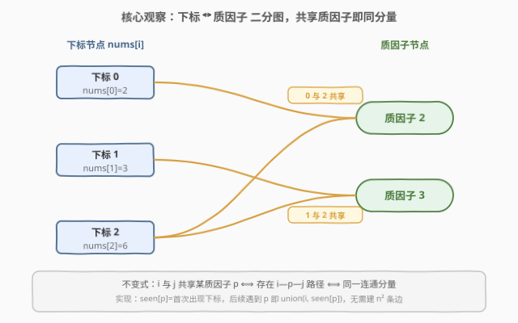
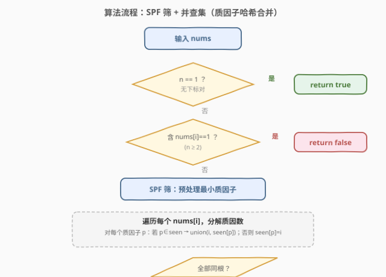
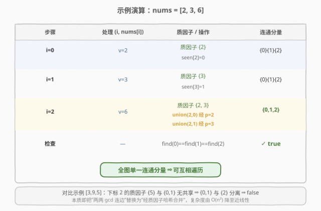

# LeetCode 最大公约数遍历 题解

## 1. 题目概述

- **标题 / 题号**：最大公约数遍历（#2709，hard）
- **链接**：https://leetcode.cn/problems/greatest-common-divisor-traversal/
- **难度**：困难
- **标签**：并查集、数组、数学、数论、质因数分解、欧几里得算法

**题意**：给你一个下标从 **0** 开始的整数数组 `nums`，你可以在一些下标之间遍历。对于两个下标 `i` 和 `j`（`i != j`），当且仅当 $\gcd(\text{nums}[i], \text{nums}[j]) > 1$ 时，我们可以在两个下标之间通行，其中 $\gcd$ 是两个数的**最大公约数**。

你需要判断 `nums` 数组中**任意**两个满足 `i < j` 的下标 `i` 和 `j`，是否存在若干次通行可以从 `i` 遍历到 `j`。

如果任意满足条件的下标对都可以遍历，那么返回 `true`，否则返回 `false`。

> 💡 **题意转译**：把每个下标视作图中的一个节点，`gcd > 1` 视作一条无向边。问整张图是否是**一个连通分量**（任意两点可达）。

**示例 1**：

```text
输入：nums = [2,3,6]
输出：true
解释：总共有 3 个下标对：(0,1)、(0,2) 和 (1,2)。
0 -> 2 -> 1：gcd(2,6)=2>1，gcd(6,3)=3>1，故 0 与 1 可达。
其余下标对均直接或间接可达，返回 true。
```

**示例 2**：

```text
输入：nums = [3,9,5]
输出：false
解释：下标 2 的值为 5，与其余值（3、9）的 gcd 均为 1，无法到达，返回 false。
```

**示例 3**：

```text
输入：nums = [4,3,12,8]
输出：true
解释：6 个下标对之间都存在可行遍历，返回 true。
```

**约束**：

- $1 \le \text{nums.length} \le 10^5$
- $1 \le \text{nums}[i] \le 10^5$

## 2. 解题思路

### 2.1 暴力思路

最朴素的图建模：对每一对下标 `(i, j)` 计算 $\gcd$，若 `> 1` 就连一条无向边，然后用 BFS/DFS/并查集判整图是否连通。

> ⚠️ **复杂度爆炸**：下标对数量是 $O(n^2)$，当 $n = 10^5$ 时高达 $10^{10}$ 量级，**必然 TLE**。必须把“两两连边”这一步替换掉。

### 2.2 核心观察：质因子二分图（并查集 + 质因子哈希合并）

关键洞察：两个下标 `i`、`j` 之间能间接可达，本质是因为存在一条“下标 → 质因子 → 下标”的中转路径。具体地：

- 若 $\gcd(\text{nums}[i], \text{nums}[j]) > 1$，说明 `nums[i]` 与 `nums[j]` **共享至少一个质因子** $p$；
- 反之，若 `nums[i]` 与 `nums[j]` 共享某质因子 $p$，则 $\gcd \ge p > 1$，二者直接可达。

于是可以把问题改造成一张 **二分图**：左部是「下标」节点，右部是「质因子」节点，`nums[i]` 的每个质因子 $p$ 连一条边 `i — p`。此时：

> **不变式**：下标 `i` 与 `j` 在同一连通分量 ⟺ 它们共享某个质因子（直接或经多跳中转）。

整张图连通 ⟺ 所有下标节点同属一个分量。这样**无需枚举 $O(n^2)$ 条边**，每个 `nums[i]` 只需分解出（至多 $\log$ 个）质因子，按“质因子 → 首次出现下标”哈希合并即可。



**两个边界**：

- `n == 1`：没有下标对，**恒真**，直接返回 `true`。
- 某个 `nums[i] == 1` 且 `n >= 2`：`1` 没有任何质因子，它永远无法连边，必成孤立点 ⟹ 返回 `false`。

### 2.3 算法流程图

预处理用 **SPF 筛**（最小质因子数组）让每个数的质因数分解变成 $O(\log)$ 的“不断除以最小质因子”循环，整体近线性。



### 2.4 示例演算

以 `nums = [2, 3, 6]` 走一遍，重点看 `i=2` 如何把 `0`、`1` 两个分量并入：



## 3. 参考代码

### C++

```cpp
class Solution {
    int spf[100001];
public:
    bool canTraverseAllPairs(vector<int>& nums) {
        int n = nums.size();
        if (n == 1) return true;                 // 无下标对，恒真

        int mx = *max_element(nums.begin(), nums.end());
        for (int i = 2; i <= mx; ++i) spf[i] = i;
        for (int i = 2; (long long)i * i <= mx; ++i)
            if (spf[i] == i)
                for (int j = i * i; j <= mx; j += i)
                    if (spf[j] == j) spf[j] = i; // 最小质因子

        vector<int> pa(n), ra(n, 0);
        iota(pa.begin(), pa.end(), 0);
        function<int(int)> find = [&](int x) {
            while (pa[x] != x) { pa[x] = pa[pa[x]]; x = pa[x]; }  // 路径折叠
            return x;
        };
        auto unite = [&](int x, int y) {
            x = find(x); y = find(y);
            if (x == y) return;
            if (ra[x] < ra[y]) swap(x, y);
            pa[y] = x;
            if (ra[x] == ra[y]) ra[x]++;
        };

        unordered_map<int,int> seen;             // 质因子 -> 首次出现的下标
        for (int i = 0; i < n; ++i) {
            int x = nums[i];
            if (x == 1) return false;            // 1 无质因子，n>=2 时必孤立
            int last = -1;
            while (x > 1) {
                int p = spf[x];
                if (p != last) {                 // 同一质因子只处理一次
                    if (seen.count(p)) unite(i, seen[p]);
                    else seen[p] = i;
                    last = p;
                }
                x /= p;
            }
        }

        int root = find(0);
        for (int i = 1; i < n; ++i)
            if (find(i) != root) return false;
        return true;
    }
};
```

### Python

```python
class Solution:
    def canTraverseAllPairs(self, nums: List[int]) -> bool:
        n = len(nums)
        if n == 1:
            return True

        mx = max(nums)
        # 最小质因子筛
        spf = list(range(mx + 1))
        i = 2
        while i * i <= mx:
            if spf[i] == i:
                for j in range(i * i, mx + 1, i):
                    if spf[j] == j:
                        spf[j] = i
            i += 1

        # 并查集
        pa = list(range(n))
        ra = [0] * n

        def find(x):
            while pa[x] != x:
                pa[x] = pa[pa[x]]
                x = pa[x]
            return x

        def unite(x, y):
            x, y = find(x), find(y)
            if x == y:
                return
            if ra[x] < ra[y]:
                x, y = y, x
            pa[y] = x
            if ra[x] == ra[y]:
                ra[x] += 1

        seen = {}  # 质因子 -> 首次出现的下标
        for i, v in enumerate(nums):
            if v == 1:
                return False
            x = v
            last = -1
            while x > 1:
                p = spf[x]
                if p != last:
                    if p in seen:
                        unite(i, seen[p])
                    else:
                        seen[p] = i
                    last = p
                x //= p

        root = find(0)
        return all(find(i) == root for i in range(1, n))
```

## 4. 复杂度分析

| 维度 | 复杂度 | 说明 |
|------|--------|------|
| 时间 | $O\!\big((n + M)\log M + n\,\alpha(n)\big)$ | SPF 筛 $O(M\log\log M)$ 视作 $O(M\log M)$；每个数分解 $O(\log)$；并查集合并近似 $O(\alpha)$。$M = \max(\text{nums}) \le 10^5$ |
| 空间 | $O(n + M)$ | SPF 数组 $O(M)$、并查集 $O(n)$、质因子哈希表最坏 $O(M/\ln M)$ 个质数 |
| 边数 | $O\!\sum_i \omega(\text{nums}[i])$ | 只连“下标—质因子”边，每数质因子个数 $\omega \le \log$，彻底替代 $O(n^2)$ 两两边 |

> 💡 **为何近线性**：把 $O(n^2)$ 条“下标-下标”边压缩为 $O(n\log M)$ 条“下标-质因子”边，是本题从 TLE 到 AC 的关键。

## 5. 扩展：不用 SPF 筛的试除分解

若不想预筛（例如值域极大但元素稀少），可对每个数做 $O(\sqrt{v})$ 试除分解。本题 $v \le 10^5$，$\sqrt v \approx 316$，$n = 10^5$ 时约 $3 \times 10^7$ 次操作，亦可 AC，但常数略大。SPF 筛版本更稳更快，推荐。

## 6. 面试要点

> **Q1：为什么“共享质因子”等价于“gcd > 1”？**
> **A**：$\gcd(a,b) > 1$ ⟺ $a$、$b$ 至少有一个 $>1$ 的公共因子 ⟺ 二者的质因子集合有交集。把公共质因子作为中转节点，gcd 边就被质因子路径精确刻画。

> **Q2：为什么 `nums[i] == 1` 一定返回 false？**
> **A**：`1` 没有任何质因子，无法在二分图里与任何质因子节点连边，必成孤立分量；只要 $n \ge 2$，整图就不连通。`n == 1` 时无下标对，单独恒真。

> **Q3：SPF 筛相对每次试除分解的优势？**
> **A**：SPF 预处理 $O(M)$ 后，单次分解变成“不断除以最小质因子”的 $O(\log v)$ 循环，无需重复试除；总时间从 $O(n\sqrt{M})$ 降到近 $O(n\log M)$，$n=10^5$ 下差距明显。

> **Q4：并查集为何只存“首次出现下标”而不是所有同质因子下标两两 union？**
> **A**：同质因子 $p$ 的所有下标只需都和“代表下标”合并即可（传递性），后续遇到 $p$ 直接 `union(i, seen[p])`，每条质因子-下标关系只处理一次，边数从 $O(k^2)$（$k$ 为同因子下标数）降到 $O(k)$。

> **Q5：最后为何要遍历检查所有下标同根，不能只查连通分量计数？**
> **A**：两者等价，均可。实践中“`find(i) == find(0)` 对所有 $i$ 成立”即整图连通。若用分量计数，需在 union 时维护计数、末尾判 `count == 1`，写法略繁。

## 同类练习题

| # | 题目 | 与本题的关联 |
|---|------|-------------|
| 952 | [按公因数计算最大组件大小](https://leetcode.cn/problems/largest-component-size-by-common-factor/) | 同款“质因子二分图 + 并查集”，求最大分量而非判连通，本题是其判连通版。 |
| 1998 | [数组的最大公因数排序](https://leetcode.cn/problems/gcd-sort-of-an-array/) | 质因子并查集判“能否经交换使数组有序”，同为质因子哈希合并套路。 |
| 1627 | [带阈值的图连通性](https://leetcode.cn/problems/graph-connectivity-with-threshold/) | 判定连通查询，质因子分解 + 并查集离线处理，思路同源。 |
| 547 | [省份数量](https://leetcode.cn/problems/number-of-provinces/) | 并查集判连通分量的母题，去掉质因子分解层即是。 |
| 918 | [环形子数组的最大和](https://leetcode.cn/problems/maximum-sum-circular-subarray/) | 虽不同套路，同为“把朴素 $O(n^2)$ 降维”的思路训练（Kadane 环形变体）。 |
