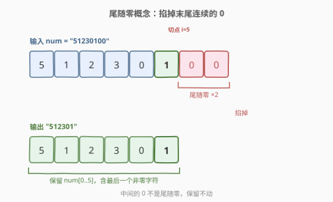
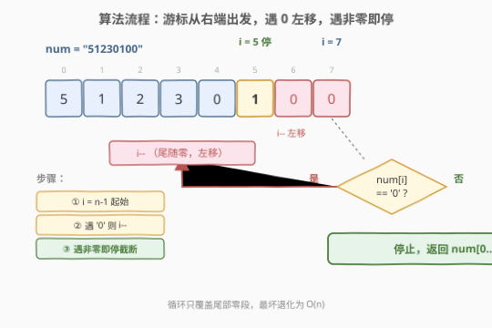
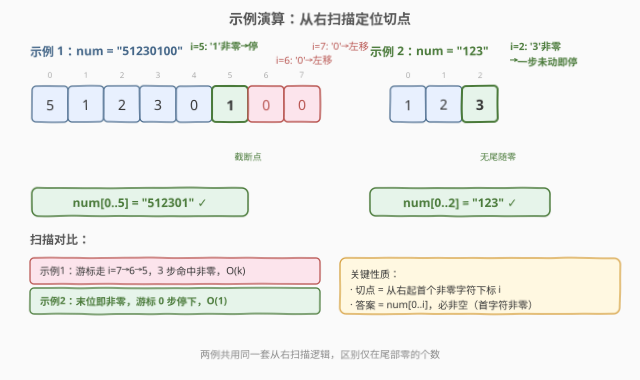

# LeetCode 移除字符串中的尾随零 题解

## 1. 题目概述

- **标题 / 题号**：移除字符串中的尾随零（#2710，easy）
- **链接**：https://leetcode.cn/problems/remove-trailing-zeros-from-a-string/
- **难度**：简单
- **标签**：字符串

**题意**：给你一个用字符串表示的正整数 `num`，请你以字符串形式返回**不含尾随零**的整数 `num`。

**示例 1**：

```text
输入：num = "51230100"
输出："512301"
解释：整数 "51230100" 有 2 个尾随零，移除并返回整数 "512301"。
```

**示例 2**：

```text
输入：num = "123"
输出："123"
解释：整数 "123" 不含尾随零，返回整数 "123"。
```

**约束**：

- `1 <= num.length <= 1000`
- `num` 仅由数字 `0` 到 `9` 组成
- `num` 不含前导零

> 💡 本题是 LeetCode 周赛 347 第一题，考查的纯粹是**字符串从右向左扫描**的基本功。关键约束是「不含前导零且是正整数」——这保证串首一定是非零字符，因此无论尾部有多少个 `0`，答案至少有一位非零数字，绝不会变成空串。下文以 C++ / Python 两种语言给出实现，并对比「手写从右扫描」与「语言内置 `rstrip`」两种写法。

## 2. 解题思路

### 2.1 暴力思路：转整数去零再转回字符串

最朴素的直觉是把字符串转成数值类型，整数本身就**天然不带尾随零**（`51230100` 存成 `int` 就是 `51230100`，再 `to_string` 出来……等等，整数 `51230100` 打印出来仍然带零，因为数值 `51230100` 的尾随零是真实位值，不是「无意义的零」）。

这条路不仅方向错了——**数值化根本不消除尾随零**——而且还有一个硬约束：`num.length <= 1000`，意味着 `num` 可能是 1000 位十进制数，**远超 64 位整数**（`int64` 上限约 19 位），强行转换必然溢出。即便用大整数库也只是绕远路，本题压根不需要算术。

### 2.2 核心观察：从右往左找最后一个非零字符



字符串视角的本质：**尾随零 = 末尾一段连续的 `'0'` 字符**。只要找到从右往左看**第一个不是 `'0'` 的字符**的下标 `i`，那么 `num[0..i]`（含 `i`）就是答案。

三个关键点让这个观察直接落地：

| 观察 | 说明 |
|------|------|
| **从右扫即可** | 尾随零在末尾，从右往左遇到第一个非零字符就停下，不必遍历整串 |
| **答案不会为空** | 约束保证「不含前导零且是正整数」，串首必是非零字符，故 `i` 至少为 `0`，`num[0..i]` 至少一位 |
| **纯字符比较** | 只比较 `num[i] == '0'`，不涉及算术，天然支持 1000 位长串 |

> 💡 **为什么不是从左扫到第一个零就停？** 因为字符串中间也可能有 `0`（如 `"51230100"` 中间的 `0` 不是尾随零）。尾随零的判定必须看「其后是否还有非零字符」，从右扫能天然利用「右端全是零」这一性质，一次扫描定位切点，$O(k)$ 内完成（$k$ 为尾随零个数）。

### 2.3 算法流程图



整体只有一个循环 + 一次截断，没有分支嵌套、没有状态机：

1. 游标 `i` 从最后一个下标 `n-1` 出发；
2. 只要 `num[i] == '0'` 就 `i--`（向左移动）；
3. 一旦 `num[i] != '0'`（命中最后一个非零字符），停止；
4. 截取 `num[0..i]` 作为答案返回。

> ⚠️ **边界自洽性**。因为约束保证首字符非零，循环最坏也会停在 `i=0`（串首非零字符），不会越界到 `i=-1`。但若题目去掉「不含前导零」约束（例如允许 `"000"`），则 `i` 可能走成 `-1`，截取会返回空串——这是该模板的隐含前提，面试时值得主动点出。

### 2.4 示例演算



以**示例 1**（`num = "51230100"`）为例：

| 步 | `i` | `num[i]` | 判定 | 说明 |
|----|-----|----------|------|------|
| ① 起始 | 7 | `'0'` | 继续左移 | 末位是零，属尾随零 |
| ② 左移 | 6 | `'0'` | 继续左移 | 仍为零，继续 |
| ③ 左移 | 5 | `'1'` | 停止 | 命中非零字符，切点定在 `i=5` |
| ④ 截取 | — | — | 返回 `num[0..5]` | `"512301"` ✓ |

以**示例 2**（`num = "123"`）为例：

| 步 | `i` | `num[i]` | 判定 | 说明 |
|----|-----|----------|------|------|
| ① 起始 | 2 | `'3'` | 停止 | 末位已是非零，无尾随零 |
| ② 截取 | — | — | 返回 `num[0..2]` | `"123"` ✓ |

示例 2 的游标一步未动就停止——这正是「不含尾随零」时从右扫描的最好情况，$O(1)$。

## 3. 参考代码

### C++（从右扫描 + 原地 `resize`）

```cpp
class Solution {
public:
    string removeTrailingZeros(string num) {
        int i = num.size() - 1;
        while (i >= 0 && num[i] == '0') {
            i--;
        }
        num.resize(i + 1);   // 原地截断到 [0, i]，O(1) 额外空间
        return num;
    }
};
```

> 💡 用 `num.resize(i + 1)` 而非 `num.substr(0, i + 1)`，可**原地**缩短字符串，避免再分配一份拷贝，额外空间为 $O(1)$（`resize` 只调整内部长度字段，通常不重新分配）。若用 `substr` 则返回新串，额外空间 $O(n)$。

### Python（从右扫描）

```python
class Solution:
    def removeTrailingZeros(self, num: str) -> str:
        i = len(num) - 1
        while i >= 0 and num[i] == '0':
            i -= 1
        return num[:i + 1]
```

### Python（内置 `rstrip` 一行解法）

```python
class Solution:
    def removeTrailingZeros(self, num: str) -> str:
        return num.rstrip('0')
```

> 💡 **`rstrip('0')` 的妙处**。Python 字符串自带 `rstrip` 方法，可一次性剔除末尾所有指定字符。它内部就是从右扫描，与手写循环等价。此处能安全使用，前提仍是约束保证「串首非零」——否则 `rstrip('0')` 对 `"000"` 会返回 `""`，但本题不会出现这种情况。

> ⚠️ **C++ 没有等价的 `rstrip`**。C++ 标准库的 `std::string` 没有「剔除末尾指定字符」的单方法，需手写循环或用 `find_last_not_of` 定位最后一个非目标字符：
> ```cpp
> // find_last_not_of 版：一次定位最后一个非 '0' 字符
> auto p = num.find_last_not_of('0');
> num.resize(p + 1);   // p == string::npos 时会越界，但本题保证 p 有效
> ```
> `find_last_not_of` 语义与手写循环一致，任选其一。

## 4. 复杂度分析

| 维度 | 复杂度 | 说明 |
|------|--------|------|
| 时间复杂度 | $O(k)$，最坏 $O(n)$ | 从右扫描，最多经过 $k$ 个尾随零（$k$ 为尾随零个数）；最坏情况全串除首字符外都是零时，退化为 $O(n)$ |
| 空间复杂度 | $O(1)$ 额外 / $O(n)$ 输出 | C++ `resize` 原地截断只动长度字段，额外 $O(1)$；Python 切片返回新串，输出占用 $O(n)$（不计输出则 $O(1)$） |

> 💡 本题 $n \le 1000$，无论哪种写法都在常数级耗时，复杂度分析的意义更多在于说明「扫描范围只覆盖尾部零」这一结构特性，而非真要担心性能。

## 5. 扩展：字符串的「掐尾 / 掐头」操作族

本题属于字符串裁剪家族的一员，掌握这套操作的共性能快速应对一类题：

| 操作 | 语义 | C++ | Python |
|------|------|-----|--------|
| **掐尾**（本题） | 剔除末尾指定字符 | 手写循环 / `find_last_not_of` + `resize` | `s.rstrip(ch)` |
| **掐头** | 剔除开头指定字符 | `find_first_not_of` + `substr` | `s.lstrip(ch)` |
| **掐两端** | 剔除首尾指定字符 | `find_first_not_of` / `find_last_not_of` 组合 | `s.strip(ch)` |

> ⚠️ **`strip` / `rstrip` / `lstrip` 的参数是「字符集合」而非「子串」**。`"abc300".rstrip('0')` 剔除末尾所有 `0` 得 `"abc3"`；但 `"aabbaa".rstrip('a')` 会剔除末尾所有 `a` 得 `"aabb"`，而不是把 `"aa"` 当后缀去匹配。这是新手常见误解。

另一个相关的工程场景是**解析带空白的输入**：行末的换行符、多余空格常用 `rstrip()` 清理，其内核与本题完全一致——从右扫到第一个不属于目标集的字符即停。可以说，**58 题「最后一个单词的长度」的从右扫描思想**就是本题的孪生题：它先 `rstrip` 掉尾随空格，再从右数非空格字符，本质都依赖「从右往左定位第一个满足某条件的字符」这一操作。

## 6. 面试要点

1. **为什么不直接转成整数处理？**

   > 两个理由：(1) 方向错——数值化并不消除尾随零，`51230100` 的整数表示打印出来仍是 `51230100`，尾随零是真实位值；(2) 溢出——`num.length <= 1000`，可能 1000 位，远超 `int64`（约 19 位），无法用原生整型承载。本题是纯字符处理，不应引入算术。

2. **从右扫描为什么不会越界到 `i = -1`？**

   > 因为约束保证「不含前导零且是正整数」，串首必是非零字符，循环最坏也会停在 `i = 0`。若放宽约束允许全零串（如 `"000"`），则 `i` 会走到 `-1`，`num[0..i]` 变空串——这是模板的隐含前提，面试时应主动点出并讨论边界。

3. **手写循环和 `rstrip('0')` 哪个更好？**

   > 工程上优先用语言内置的 `rstrip`，语义清晰、不易出错、性能与手写等价（内部也是从右扫描）。手写循环的价值在于跨语言通用（C++ 无 `rstrip`）和便于面试时展示思路。两者在本题约束下行为完全一致。

4. **时间复杂度是 $O(n)$ 还是 $O(k)$？**

   > 严格说是 $O(k)$，$k$ 为尾随零个数，因为游标只在尾随零段移动。但最坏情况（串首一个非零、其后全是零，如 `"1000"`）下 $k = n - 1$，退化为 $O(n)$。回答时给出「$O(k)$，最坏 $O(n)$」更精确，体现对扫描范围的理解。

5. **如果输入可能有前导零（如 `"001200"`），本解法还成立吗？**

   > 部分成立：从右扫尾随零的逻辑不受影响，仍能正确去掉尾部零得到 `"0012"`。但若想同时去掉前导零，需额外从左扫到第一个非零字符作为左切点——这正是「掐两端」的 `strip` 场景。本题约束排除了前导零，故无需左扫。

> 💡 **一句话总结**：2710 = 「从右往左扫到第一个非零字符，截断尾部」。$O(k)$ 时间、$O(1)$ 额外空间（C++ `resize` 原地）。考点不在算法复杂度，而在「字符串从右扫描定位切点」这一基本操作——它与 58 题数最后一个单词同源，是字符串裁剪家族的母题动作。

## 同类练习题

| # | 题目 | 与本题的关联 |
|---|------|-------------|
| 58 | [最后一个单词的长度](https://leetcode.cn/problems/length-of-last-word/) | 同一套「从右往左扫到第一个满足条件字符」的母题动作，先掐尾随空格再数非空格字符，与本题掐尾随零同构 |
| 8 | [字符串转换整数 (atoi)](https://leetcode.cn/problems/string-to-integer-atoi/) | 同样是字符串逐字符扫描处理数字，本题是其退化版（只掐尾、不算值），可对照 atoi 的从前向后扫描与从前导空白处理 |
| 9 | [回文数](https://leetcode.cn/problems/palindrome-number/) | 把数字当字符串/逐位处理，与本题同属「不数值化、走字符位」的数字串处理范式，可对比其反转一半的思路 |
