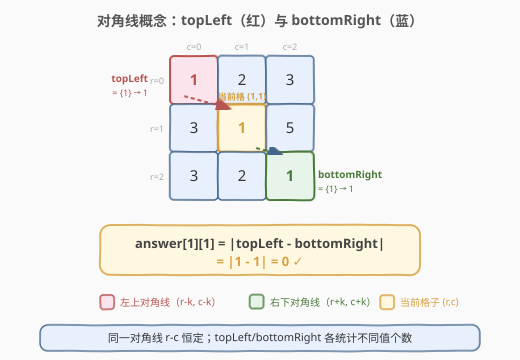
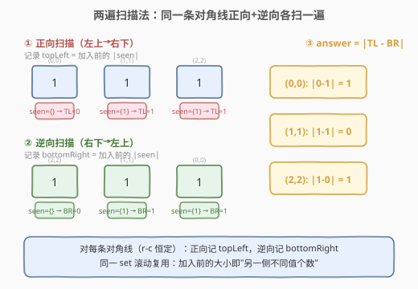
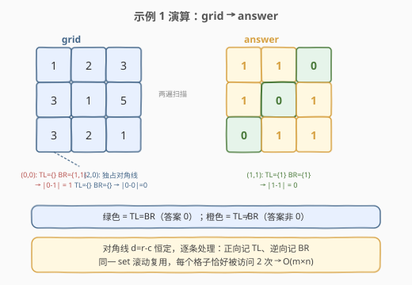

# LeetCode 对角线上不同值的数量差 题解

## 1. 题目概述

- **标题 / 题号**：对角线上不同值的数量差（#2711，medium）
- **链接**：https://leetcode.cn/problems/difference-of-number-of-distinct-values-on-diagonals/
- **难度**：中等
- **标签**：数组、哈希表、矩阵

**题意**：给你一个 `m x n` 的矩阵 `grid`，对每个单元格 `(r, c)` 计算：

- **`topLeft[r][c]`**：`(r, c)` **左上角对角线**上**不同值**的个数（即所有 `(r-k, c-k)` 格子的值去重计数）。
- **`bottomRight[r][c]`**：`(r, c)` **右下角对角线**上**不同值**的个数（即所有 `(r+k, c+k)` 格子的值去重计数）。
- `answer[r][c] = |topLeft[r][c] - bottomRight[r][c]|`。

> 💡 **矩阵对角线**指从顶行或最左列某格出发、向右下方走到矩阵末尾的对角线。同一条对角线上所有格子满足 `r - c` 恒定。

**示例 1**：

```text
输入：grid = [[1,2,3],[3,1,5],[3,2,1]]
输出：[[1,1,0],[1,0,1],[0,1,1]]
```

| 格子 | 右下对角线 | 左上对角线 | answer |
|------|-----------|-----------|--------|
| (0,0) | [1,1] → 1 | [] → 0 | \|1-0\| = 1 |
| (1,2) | [] → 0 | [2] → 1 | \|0-1\| = 1 |
| (1,1) | [1] → 1 | [1] → 1 | \|1-1\| = 0 |

**示例 2**：

```text
输入：grid = [[1]]
输出：[[0]]
```

**约束**：

- `m == grid.length`，`n == grid[i].length`
- `1 <= m, n <= 50`
- `1 <= grid[i][j] <= 50`

## 2. 解题思路

### 2.1 暴力思路

对每个格子 `(r, c)`，分别向左上、向右下扫描整条对角线，用集合去重后取大小之差。共 $m \times n$ 个格子，每格最多扫 $\max(m, n)$ 步，总计 $O(m \cdot n \cdot (m+n))$。由于 $m, n \le 50$，暴力也能过，但每个格子的集合是独立重建的，做了大量重复工作。

### 2.2 核心观察：对角线两遍扫描



**关键性质**：同一条主对角线上所有格子的 `r - c` 恒定。这意味着：

- **正向扫描**（从左上到右下）：沿对角线依次走过格子 `(r_1,c_1), (r_2,c_2), \dots`，用一个滚动集合 `seen` 记录已经过的值。在走到格子 `(r,c)` **之前**，`seen` 里装的就是它的**左上对角线**上所有值 → `topLeft = |seen|`（加入前的大小）。

- **逆向扫描**（从右下到左上）：沿同一对角线反向走，用另一个滚动集合 `seen`。在走到格子 `(r,c)` **之前**，`seen` 里装的就是它的**右下对角线**上所有值 → `bottomRight = |seen|`（加入前的大小）。

最终 `answer[r][c] = |topLeft - bottomRight|`。

> 💡 这招的精髓是**复用前驱信息**：每条对角线只需正向走一遍拿到所有 `topLeft`、逆向走一遍拿到所有 `bottomRight`，无需对每格重建集合。同一条对角线上相邻格子只差一个元素，滚动集合的增量更新是 $O(1)$。

### 2.3 算法流程图



### 2.4 示例演算



以**示例 1** 中主对角线 `d = r - c = 0`（格子 `(0,0), (1,1), (2,2)`，值均为 `1`）为例：

| 步骤 | 当前格 | seen（加入前） | 记录值 | 加入后 seen |
|------|--------|---------------|--------|------------|
| 正向 1 | (0,0) | {} | topLeft = 0 | {1} |
| 正向 2 | (1,1) | {1} | topLeft = 1 | {1} |
| 正向 3 | (2,2) | {1} | topLeft = 1 | {1} |
| 逆向 1 | (2,2) | {} | bottomRight = 0 | {1} |
| 逆向 2 | (1,1) | {1} | bottomRight = 1 | {1} |
| 逆向 3 | (0,0) | {1} | bottomRight = 1 | {1} |

汇总：`(0,0)=|0-1|=1`，`(1,1)=|1-1|=0`，`(2,2)=|1-0|=1`。✓

## 3. 参考代码

### C++

```cpp
class Solution {
public:
    vector<vector<int>> differenceOfDistinctValues(vector<vector<int>>& grid) {
        int m = grid.size(), n = grid[0].size();
        vector<vector<int>> ans(m, vector<int>(n, 0));

        // 每条主对角线 r-c 恒定，取值范围 -(n-1) .. m-1
        for (int d = -(n - 1); d <= m - 1; d++) {
            vector<pair<int,int>> cells;      // 对角线上所有格子，按 r 升序
            for (int r = max(0, d); r < m && r - d < n; r++) {
                cells.emplace_back(r, r - d);
            }

            // 正向扫描：topLeft = 加入前的集合大小
            unordered_set<int> seen;
            for (auto& [r, c] : cells) {
                ans[r][c] = seen.size();     // topLeft
                seen.insert(grid[r][c]);
            }

            // 逆向扫描：bottomRight = 加入前的集合大小
            seen.clear();
            for (int i = (int)cells.size() - 1; i >= 0; i--) {
                auto [r, c] = cells[i];
                ans[r][c] = abs(ans[r][c] - (int)seen.size());  // |topLeft - bottomRight|
                seen.insert(grid[r][c]);
            }
        }
        return ans;
    }
};
```

### Python

```python
class Solution:
    def differenceOfDistinctValues(self, grid: List[List[int]]) -> List[List[int]]:
        m, n = len(grid), len(grid[0])
        ans = [[0] * n for _ in range(m)]

        for d in range(-(n - 1), m):
            cells = [(r, r - d) for r in range(max(0, d), m) if r - d < n]

            seen = set()
            for r, c in cells:
                ans[r][c] = len(seen)               # topLeft
                seen.add(grid[r][c])

            seen.clear()
            for r, c in reversed(cells):
                ans[r][c] = abs(ans[r][c] - len(seen))  # |topLeft - bottomRight|
                seen.add(grid[r][c])

        return ans
```

## 4. 复杂度分析

| 维度 | 复杂度 | 说明 |
|------|--------|------|
| 时间复杂度 | $O(m \cdot n)$ | 每个格子恰好被访问 2 次（正向+逆向），集合操作均摊 $O(1)$（值域 $1\sim50$） |
| 空间复杂度 | $O(m \cdot n)$ | 答案矩阵 $O(m \cdot n)$ + 滚动集合 $O(\min(m,n))$ + 对角线格子列表 $O(\min(m,n))$ |

> 💡 值域 $1 \le \text{grid}[i][j] \le 50$ 很小，集合元素数不超过 $\min(m,n) \le 50$。若追求极致常数，可用 `bool seen[51]` 数组代替哈希集，消除哈希开销。

## 5. 扩展：数组代替哈希集

当值域有界且较小时（本题 $1 \sim 50$），用定长 `bool` 数组替代 `unordered_set` 可显著降低常数：

```cpp
class Solution {
public:
    vector<vector<int>> differenceOfDistinctValues(vector<vector<int>>& grid) {
        int m = grid.size(), n = grid[0].size();
        vector<vector<int>> ans(m, vector<int>(n, 0));

        for (int d = -(n - 1); d <= m - 1; d++) {
            vector<pair<int,int>> cells;
            for (int r = max(0, d); r < m && r - d < n; r++)
                cells.emplace_back(r, r - d);

            vector<bool> seen(51, false);
            int cnt = 0;
            for (auto& [r, c] : cells) {
                ans[r][c] = cnt;
                if (!seen[grid[r][c]]) { seen[grid[r][c]] = true; cnt++; }
            }

            fill(seen.begin(), seen.end(), false);
            cnt = 0;
            for (int i = (int)cells.size() - 1; i >= 0; i--) {
                auto [r, c] = cells[i];
                ans[r][c] = abs(ans[r][c] - cnt);
                if (!seen[grid[r][c]]) { seen[grid[r][c]] = true; cnt++; }
            }
        }
        return ans;
    }
};
```

> ⚠️ 数组版用 `cnt` 手动维护大小，比每次调 `.size()` 更快；`fill` 重置比逐个清零更高效。适合对延迟敏感的场景。

## 6. 面试要点

1. **为什么用 `r - c` 而不是 `r + c` 标识对角线？**

   - `r - c` 标识的是**主对角线方向**（左上到右下），正是本题所需的。`r + c` 标识的是**副对角线方向**（左下到右上），方向不同。题目明确定义对角线是"向右下方向走"的，所以用 `r - c`。

2. **两遍扫描为什么是对每条对角线独立做，而不是全局两遍？**

   - 不同对角线互不相交，各自有独立的 `topLeft`/`bottomRight` 语义。全局两遍无法复用集合——一条对角线走到边界后，`seen` 不能跨到另一条对角线继续用。逐条处理天然隔离了各对角线的集合状态。

3. **滚动集合的核心操作是什么？**

   - **加入前记录大小**：`topLeft = |seen|`（正向）/ `bottomRight = |seen|`（逆向），此时 `seen` 装的恰好是"当前格另一侧"的所有值。
   - **加入后继续走**：把当前格的值加入 `seen`，供下一个格子的查询。这就是"前驱信息复用"——相邻格只差一个元素的增量。

4. **暴力解法的时间复杂度是多少？为什么不需要它？**

   - 暴力 $O(m \cdot n \cdot (m+n))$，每个格子独立重建两个集合。本题 $m,n \le 50$ 时约 $50^3 \approx 1.25 \times 10^5$，能过但不优雅。两遍扫描 $O(m \cdot n)$ 更优且思路清晰，是面试期望的解法。

5. **如果值域很大（如 $10^9$），算法需要改吗？**

   - 不需要。`unordered_set` / Python `set` 不依赖值域大小，哈希操作均摊 $O(1)$。数组版（扩展 5）才依赖值域有界，值域大时退回哈希集即可。

## 同类练习题

| # | 题目 | 与本题的关联 |
|---|------|-------------|
| 766 | [托普利茨矩阵](https://leetcode.cn/problems/toeplitz-matrix/) | 同一条对角线上所有值相同，本质也是利用 `r-c` 恒定遍历对角线 |
| 1572 | [矩阵对角线元素的和](https://leetcode.cn/problems/matrix-diagonal-sum/) | 主副对角线求和，对角线遍历的基础练习 |
| 1329 | [将矩阵按对角线排序](https://leetcode.cn/problems/sort-the-matrix-diagonally/) | 按 `r-c` 分组提取每条对角线排序后回填，扩展为对角线分组操作 |
| 2352 | [相等行列对](https://leetcode.cn/problems/equal-row-and-column-pairs/) | 矩阵行列哈希匹配，延续"矩阵遍历 + 集合/哈希"的套路 |
