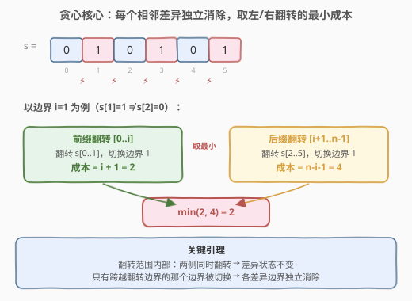
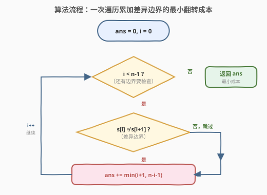
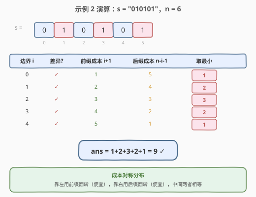

# LeetCode 使所有字符相等的最小成本 题解

## 1. 题目概述

- **标题 / 题号**：使所有字符相等的最小成本（#2712，medium）
- **链接**：https://leetcode.cn/problems/minimum-cost-to-make-all-characters-equal/
- **难度**：中等
- **标签**：贪心、字符串、动态规划

**题意**：给你一个下标从 **0** 开始、长度为 `n` 的二进制字符串 `s`，你可以对其执行两种操作：

1. 选中一个下标 `i` 并且反转从下标 `0` 到下标 `i`（包括两端）的所有字符，成本为 `i + 1`。
2. 选中一个下标 `i` 并且反转从下标 `i` 到下标 `n - 1`（包括两端）的所有字符，成本为 `n - i`。

返回使字符串内所有字符 **相等** 需要的 **最小成本**。

**反转** 字符意味着：如果原来的值是 '0'，则反转后值变为 '1'，反之亦然。

**示例 1**：

```text
输入：s = "0011"
输出：2
解释：执行第二种操作，选中下标 i = 2，可以得到 s = "0000"，成本为 2。
可以证明 2 是使所有字符相等的最小成本。
```

**示例 2**：

```text
输入：s = "010101"
输出：9
解释：依次执行操作（第一/二种分别标为 ①/②）：
① i=2：s = "101101"，成本 3
① i=1：s = "011101"，成本 2
① i=0：s = "111101"，成本 1
② i=4：s = "111110"，成本 2
② i=5：s = "111111"，成本 1
总成本 = 3+2+1+2+1 = 9
```

**约束**：

- `1 <= s.length == n <= 10^5`
- `s[i]` 为 `'0'` 或 `'1'`

> 💡 两种操作分别从左端和右端翻转一个前缀/后缀。关键观察：每次翻转只影响**翻转边界处**的那一个相邻差异，而内部的差异对不变——这让问题简化为「逐个消除相邻差异」。

## 2. 解题思路

### 2.1 暴力思路

枚举所有操作序列的排列（每步选操作类型和下标 `i`），模拟翻转过程，取使所有字符相等的最小总成本。状态空间是指数级 $O(2^n \cdot n!)$，完全不可行。

瓶颈在于：操作之间有复杂的叠加效应，且同一中间状态会被反复到达，缺乏直接的最优子结构。

### 2.2 核心观察：相邻差异 + 贪心取最小



定义**边界** `i` 为 `s[i]` 与 `s[i+1]` 之间的位置（`0 ≤ i ≤ n-2`）。当 `s[i] ≠ s[i+1]` 时，边界 `i` 是一个**差异边界**，需要被消除。

**关键引理**：每种翻转操作恰好切换一个边界的状态——

| 操作 | 翻转范围 | 恰好切换的边界 |
|------|----------|----------------|
| 前缀翻转 `[0..i]`，成本 `i+1` | `s[0]..s[i]` | 边界 `i`（`s[i]` 翻了、`s[i+1]` 没翻） |
| 后缀翻转 `[i..n-1]`，成本 `n-i` | `s[i]..s[n-1]` | 边界 `i-1`（`s[i-1]` 没翻、`s[i]` 翻了） |

> ⚠️ 翻转范围**内部**的边界两侧同时翻转，差异状态不变（同为 0→同为 1，差异仍在）；翻转范围**外部**的边界两侧都不翻转，也不变。只有**跨越翻转边界**的那一个边界被切换。

因此，每个差异边界 `i` 可以独立消除，有两种等价方式：

- **前缀翻转** `[0..i]`，成本 `i+1` → 切换边界 `i`
- **后缀翻转** `[i+1..n-1]`，成本 `n-(i+1) = n-i-1` → 切换边界 `i`

取较小者即可，各差异边界互不干扰：

$$\text{answer} = \sum_{\substack{i=0 \\ s[i] \neq s[i+1]}}^{n-2} \min\big(i+1,\;\; n-i-1\big)$$

### 2.3 算法流程图



### 2.4 示例演算



以**示例 2**（`s = "010101"`，`n = 6`）为例，遍历所有边界：

| 边界 i | s[i] | s[i+1] | 差异? | 前缀成本 i+1 | 后缀成本 n-i-1 | 取最小 |
|--------|------|--------|-------|--------------|-----------------|--------|
| 0 | 0 | 1 | ✓ | 1 | 5 | **1** |
| 1 | 1 | 0 | ✓ | 2 | 4 | **2** |
| 2 | 0 | 1 | ✓ | 3 | 3 | **3** |
| 3 | 1 | 0 | ✓ | 4 | 2 | **2** |
| 4 | 0 | 1 | ✓ | 5 | 1 | **1** |

总成本 $= 1+2+3+2+1 = 9$。✓

> 💡 观察成本呈**对称分布**：靠左的边界用前缀翻转更便宜，靠右的边界用后缀翻转更便宜，正中间两者相等。这与直觉一致——短的那段翻转成本更低。

## 3. 参考代码

### C++

```cpp
class Solution {
public:
    long long minimumCost(string s) {
        int n = s.size();
        long long ans = 0;
        for (int i = 0; i < n - 1; i++) {
            if (s[i] != s[i + 1]) {
                ans += min(i + 1, n - i - 1);
            }
        }
        return ans;
    }
};
```

### Python

```python
class Solution:
    def minimumCost(self, s: str) -> int:
        n = len(s)
        ans = 0
        for i in range(n - 1):
            if s[i] != s[i + 1]:
                ans += min(i + 1, n - i - 1)
        return ans
```

## 4. 复杂度分析

| 维度 | 复杂度 | 说明 |
|------|--------|------|
| 时间复杂度 | $O(n)$ | 单次遍历所有相邻字符对，每个位置 $O(1)$ |
| 空间复杂度 | $O(1)$ | 仅维护累加器 `ans`，无额外数据结构 |

## 5. 扩展：前后缀 DP

官方 hint 给出的 DP 解法思路同样可行，且更通用：

定义 `prefix[i]` = 使 `s[0..i-1]` 全部等于 `s[i]` 的最小成本，`suffix[i]` = 使 `s[i+1..n-1]` 全部等于 `s[i]` 的最小成本。

- 若 `s[i-1] == s[i]`：`prefix[i] = prefix[i-1]`（前缀已一致）
- 若 `s[i-1] != s[i]`：`prefix[i] = prefix[i-1] + i`（翻转前缀 `[0..i-1]`，成本 `i`）

后缀同理反向递推。最终答案 $= \min_i \big(\text{prefix}[i] + \text{suffix}[i]\big)$。

```cpp
class Solution {
public:
    long long minimumCost(string s) {
        int n = s.size();
        vector<long long> prefix(n), suffix(n);
        prefix[0] = 0;
        for (int i = 1; i < n; i++) {
            prefix[i] = prefix[i - 1] + (s[i - 1] != s[i] ? i : 0);
        }
        suffix[n - 1] = 0;
        for (int i = n - 2; i >= 0; i--) {
            suffix[i] = suffix[i + 1] + (s[i + 1] != s[i] ? (n - i - 1) : 0);
        }
        long long ans = LLONG_MAX;
        for (int i = 0; i < n; i++) {
            ans = min(ans, prefix[i] + suffix[i]);
        }
        return ans;
    }
};
```

> 💡 DP 与贪心等价：展开 `prefix[i] + suffix[i]` 后，每个差异边界 `j` 贡献恰好一次 $\min(j+1,\; n-j-1)$，与贪心公式一致。贪心版本省去了 $O(n)$ 空间。

## 6. 面试要点

1. **为什么每个差异边界可以独立处理？**

   - 前缀翻转 `[0..i]` 只切换边界 `i`，后缀翻转 `[i+1..n-1]` 也只切换边界 `i`，而翻转范围内部的边界两侧同时翻转、差异状态不变。因此各差异边界互不干扰，可独立取最小。

2. **为什么答案不依赖最终全 0 还是全 1？**

   - 无论目标是全 0 还是全 1，需要消除的差异边界集合完全相同（所有 `s[i] ≠ s[i+1]` 的位置）。目标字符只决定「翻转后的值」，不影响「哪些边界需要切换」及成本。

3. **贪心和 DP 的关系？**

   - DP 的 `prefix[i] + suffix[i]` 展开后，每个差异边界 `j` 恰好贡献 $\min(j+1, n-j-1)$ 一次。贪心是 DP 的化简——去掉冗余的「以 `i` 为锚点」枚举，直接按边界累加。

4. **成本为什么是对称的？**

   - 边界 `i` 的前缀成本 `i+1` 和后缀成本 `n-i-1` 之和恒为 `n`。靠左的边界前缀短、成本低；靠右的边界后缀短、成本低。在 `i = (n-2)/2` 附近两者相等。

5. **数据溢出需要注意什么？**

   - $n \le 10^5$，最坏情况（交替 0101…）成本之和约为 $\sum \min(i+1, n-i-1) \approx \frac{n^2}{4} \approx 2.5 \times 10^9$，超过 `int` 上界。C++ 返回值和累加器需用 `long long`。

## 同类练习题

| # | 题目 | 与本题的关联 |
|---|------|-------------|
| 152 | [乘积最大子数组](https://leetcode.cn/problems/maximum-product-subarray/)（[题解](../0101-0200/152_乘积最大子数组.md)） | 滚动 DP，同样只需一次遍历，对照「线性扫描 + 局部决策」的思路 |
| 918 | [环形子数组的最大和](https://leetcode.cn/problems/maximum-sum-circular-subarray/) | Kadane 变体，一次遍历维护极值，与本题「一次扫描累加最优」异曲同工 |
| 1758 | [生成交替二进制字符串的最少操作数](https://leetcode.cn/problems/minimum-changes-to-make-alternating-binary-string/) | 二进制字符串贪心，目标字符决定操作数，与本题「目标字符不影响差异边界集合」可对照 |
| 3226 | [使两个整数相等的位数操作](https://leetcode.cn/problems/number-of-bit-changes-to-make-two-integers-equal/) | 逐位贪心消除差异，与本题逐边界消除差异的贪心范式同构 |
| 165 | [比较版本号](https://leetcode.cn/problems/compare-version-numbers/)（[题解](../0101-0200/165_比较版本号.md)） | 字符串分段 + 逐段比较，延续「线性扫描逐段处理」的贪心思路 |
