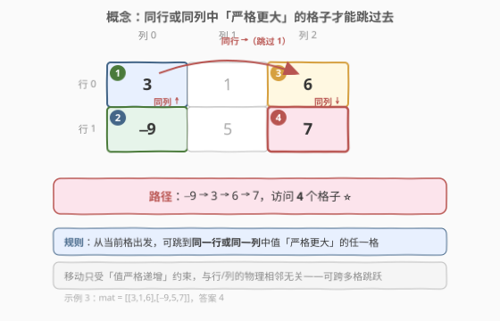
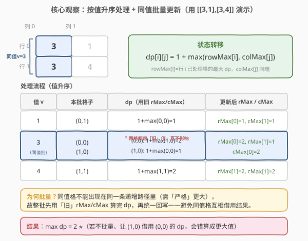

# 矩阵中严格递增的单元格数

- **题目名称**：矩阵中严格递增的单元格数
- **链接**：[2713. 矩阵中严格递增的单元格数](https://leetcode.cn/problems/maximum-strictly-increasing-cells-in-a-matrix/)
- **难度**：困难
- **标签**：记忆化搜索、数组、动态规划、矩阵、排序、哈希表

## 1. 题目概述

给定一个下标从 1 开始、大小为 $m \times n$ 的整数矩阵 `mat`，你可以选择任一单元格作为**初始单元格**。从当前单元格出发，你可以移动到**同一行或同一列**中的任何其他单元格，但前提是目标单元格的值**严格大于**当前单元格的值。你可以多次重复这一过程，直到无法再移动。求从某个单元格出发，所能访问的单元格的**最大数量**。

**示例 1**：

```text
输入：mat = [[3,1],[3,4]]
输出：2
解释：无论从哪个格子出发，最多只能访问 2 个单元格。
```

**示例 2**：

```text
输入：mat = [[1,1],[1,1]]
输出：1
解释：目标必须严格大于当前值，所有值都相等，故只能访问 1 个单元格。
```

**示例 3**：

```text
输入：mat = [[3,1,6],[-9,5,7]]
输出：4
解释：从第 2 行第 1 列的 −9 出发：−9 → 3 → 6 → 7，访问 4 个单元格。
```

**约束条件**：

- $m == \text{mat.length}$，$n == \text{mat}[i].\text{length}$
- $1 \le m, n \le 10^5$
- $1 \le m \cdot n \le 10^5$
- $-10^5 \le \text{mat}[i][j] \le 10^5$

> 💡 注意 $m \cdot n \le 10^5$ 这一关键约束：格子总数被限制在 $10^5$，允许 $O(mn \log mn)$ 的排序做法；但单行/单列可能很长，朴素「枚举同行的所有更大格」会退化到 $O(mn \cdot \max(m,n))$ 超时。突破口在于**按值排序 + 只维护每行/每列的历史最优**。

---

## 2. 解题思路

### 2.1 暴力思路

定义 $\text{dp}[i][j]$ 为从 $(i,j)$ 出发能访问的最大单元格数。转移时枚举同行、同列中所有值严格更大的格子取最大：

$$\text{dp}[i][j] = 1 + \max_{\substack{(i',j') \in \text{同行或同列}\\\text{mat}[i'][j'] > \text{mat}[i][j]}} \text{dp}[i'][j']$$

若值各不相同，可按值**降序**处理（先算大值再算小值），保证依赖已就绪。但单格转移要扫整行整列，最坏 $O(\max(m,n))$，总计 $O(mn \cdot \max(m,n))$，当 $m=1, n=10^5$ 时退化为 $10^{10}$，超时。

> 💡 **瓶颈**：转移要遍历整行整列找「更大的格子里的最优 dp」。能否不枚举、只记一个汇总值？答案是可以——每行/每列只需保留「目前为止已处理格子中 dp 的最大值」。

### 2.2 核心观察：按值升序 + 行列最优汇总



把转移反过来——**按值升序**处理（先算小值再算大值）。处理到格子 $(i,j)$（值为 $v$）时，所有值 $< v$ 的格子都已算完；其中与 $(i,j)$ 同行或同列的格子里 dp 最大者，就是 $(i,j)$ 能接上的最长前驱。我们不必逐个枚举这些前驱，只需为每行、每列各维护一个汇总量：

- $\text{rowMax}[i]$：行 $i$ 中**已处理**格子的 dp 最大值；
- $\text{colMax}[j]$：列 $j$ 中**已处理**格子的 dp 最大值。

于是转移降为 $O(1)$：

$$\text{dp}[i][j] = 1 + \max(\text{rowMax}[i],\ \text{colMax}[j])$$

算完 $(i,j)$ 后回写：$\text{rowMax}[i] = \max(\text{rowMax}[i], \text{dp}[i][j])$，$\text{colMax}[j]$ 同理。这样每行/每列只存「历史最优」，无需遍历整行整列。

> ⚠️ **为何升序而非降序？** 降序（先大后小）时，$(i,j)$ 依赖更大的格子，得遍历整行整列找它们——汇总值会指向「未处理的更小格」导致错误。升序（先小后大）则 $(i,j)$ 依赖更小的格，而这些更小格已处理完毕，`rowMax/colMax` 正好汇总了它们的最优，$O(1)$ 即可转移。

### 2.3 同值批量处理：保证「严格」递增



题目要求值**严格**更大，所以**同值的格子不能出现在同一条路径里**。若逐格处理，处理完一个值为 $v$ 的格子后立刻回写 `rowMax/colMax`，同行/同列的另一个同值格就会读到这个刚写入的值，错误地「接上」同值前驱。

正确做法是**按值分组、整批处理**：

1. 把所有格子按值升序排序，相同值的格子归为一组；
2. 对组内每个格子 $(i,j)$，用**当前（旧）的** `rowMax[i]`、`colMax[j]` 计算 $\text{dp}[i][j]$（组内格子互不借用彼此的结果）；
3. 整组的 dp 算完后，再用这些 dp **统一回写** `rowMax/colMax`。

这样同值格彼此隔离，严格递增得以保证。例：`[[3,1],[3,4]]` 中两个 $3$ 一批，都用「旧」`rowMax/colMax`（此时只反映了值 $1$ 的格子）算 dp，互不影响。

### 2.4 算法流程

1. 遍历矩阵，把每个格子按值分桶（用 `map<值, vector<(i,j)>>` 或排序数组）；
2. 初始化 `rowMax[0..m-1]=0`、`colMax[0..n-1]=0`、`ans=0`；
3. 按值升序遍历每组：
   - **计算**：对组内每个 $(i,j)$，`dp = 1 + max(rowMax[i], colMax[j])`，更新 `ans`；
   - **回写**：对组内每个 $(i,j)$，`rowMax[i] = max(rowMax[i], dp)`、`colMax[j] = max(colMax[j], dp)`；
4. 返回 `ans`。

### 2.5 示例演算

![示例演算：mat = [[3,1,6],[−9,5,7]]，按值升序逐格推进](../images/p2713_example_walkthrough.svg)

以 `mat = [[3,1,6],[-9,5,7]]` 为例。按值升序：$-9, 1, 3, 5, 6, 7$（值各不相同，每组只 1 格）。`rM=[r0,r1]`、`cM=[c0,c1,c2]` 初值全 0。

- **$-9$** $(1,0)$：`dp = 1 + max(rM[1]=0, cM[0]=0) = 1`。回写 `rM=[0,1]`、`cM=[1,0,0]`。
- **$1$** $(0,1)$：`dp = 1 + max(rM[0]=0, cM[1]=0) = 1`。回写 `rM=[1,1]`、`cM=[1,1,0]`。
- **$3$** $(0,0)$：`dp = 1 + max(rM[0]=1, cM[0]=1) = 2`。回写 `rM=[2,1]`、`cM=[2,1,0]`。
- **$5$** $(1,1)$：`dp = 1 + max(rM[1]=1, cM[1]=1) = 2`。回写 `rM=[2,2]`、`cM=[2,2,0]`。
- **$6$** $(0,2)$：`dp = 1 + max(rM[0]=2, cM[2]=0) = 3`。回写 `rM=[3,2]`、`cM=[2,2,3]`。
- **$7$** $(1,2)$：`dp = 1 + max(rM[1]=2, cM[2]=3) = 4` ⭐。回写 `rM=[3,4]`、`cM=[2,2,4]`。

最终 dp 矩阵 $\begin{bmatrix}2&1&3\\1&2&4\end{bmatrix}$，`ans = 4`，对应路径 $-9 \to 3 \to 6 \to 7$。

> 💡 第 5 步 $6$ 在列 $2$ 上：此时 `cM[2]` 还是 $0$（列 2 此前无更小格），它只能接行 0 的历史最优 $rM[0]=2$；正是它在第 5 步把 `cM[2]` 抬到 $3$，第 6 步 $7$ 才能接到 $3$ 得到 $4$——这体现了「按值升序、行列汇总」层层抬高的过程。

---

## 3. 参考代码

### C++

```cpp
class Solution {
public:
    int maxIncreasingCells(vector<vector<int>>& mat) {
        int m = mat.size(), n = mat[0].size();
        // 按值分桶：map 自动按 key（值）升序遍历
        map<int, vector<pair<int, int>>> byVal;
        for (int i = 0; i < m; ++i)
            for (int j = 0; j < n; ++j)
                byVal[mat[i][j]].emplace_back(i, j);

        vector<int> rowMax(m, 0), colMax(n, 0);
        int ans = 0;
        for (auto& [val, cells] : byVal) {
            // 阶段一：用「旧」rowMax/colMax 算本组 dp（同值互不借用）
            vector<int> dp(cells.size());
            for (int k = 0; k < (int)cells.size(); ++k) {
                auto [i, j] = cells[k];
                dp[k] = 1 + max(rowMax[i], colMax[j]);
                ans = max(ans, dp[k]);
            }
            // 阶段二：整组算完后统一回写
            for (int k = 0; k < (int)cells.size(); ++k) {
                auto [i, j] = cells[k];
                rowMax[i] = max(rowMax[i], dp[k]);
                colMax[j] = max(colMax[j], dp[k]);
            }
        }
        return ans;
    }
};
```

### Python

```python
class Solution:
    def maxIncreasingCells(self, mat: List[List[int]]) -> int:
        m, n = len(mat), len(mat[0])
        from collections import defaultdict
        by_val = defaultdict(list)
        for i in range(m):
            for j in range(n):
                by_val[mat[i][j]].append((i, j))

        row_max = [0] * m
        col_max = [0] * n
        ans = 0
        for val in sorted(by_val):                      # 值升序
            cells = by_val[val]
            # 阶段一：用「旧」row_max/col_max 算本组 dp（同值互不借用）
            dp = [1 + max(row_max[i], col_max[j]) for i, j in cells]
            ans = max(ans, max(dp))
            # 阶段二：整组算完后统一回写
            for (i, j), d in zip(cells, dp):
                row_max[i] = max(row_max[i], d)
                col_max[j] = max(col_max[j], d)
        return ans
```

> ⚠️ **两个易错点**：
> 1. **必须分两阶段（先全算、再全写）**：若边算边回写，同值且同行/同列的格子会读到彼此刚写入的 dp，破坏「严格递增」。把「计算」和「回写」拆成两个循环是本题的核心正确性保证。
> 2. **用 `map`/`sorted` 而非 `unordered_map`**：必须按值**升序**遍历，`std::map` 的 key 天然有序；Python 用 `sorted(by_val)`。若用无序容器，需先取出 key 排序再遍历。

---

## 4. 复杂度分析

| 维度 | 复杂度 | 说明 |
|------|--------|------|
| 时间复杂度 | $O(mn \log(mn))$ | 分桶/排序 $O(mn \log mn)$ + 扫描 $mn$ 个格每格 $O(1)$ 转移 |
| 空间复杂度 | $O(mn + m + n)$ | 存所有格子 $O(mn)$ + `rowMax` $O(m)$ + `colMax` $O(n)$；不显式存 dp 矩阵可省到 $O(m+n)$（见扩展） |

> ⚠️ 关键在 $m \cdot n \le 10^5$ 这一约束：格子总数被压在 $10^5$，$O(mn \log mn) \approx 1.7 \times 10^6$ 稳过。难点不是「能否枚举路径」，而是把「遍历整行整列找更大格」压缩成「读行列汇总值」的 $O(1)$ 转移——这是从 $O(mn \cdot \max(m,n))$ 降到 $O(mn \log mn)$ 的关键。

---

## 5. 扩展：与 329 矩阵中递增路径的对照

本题与经典的 [329. 矩阵中的最长递增路径](https://leetcode.cn/problems/longest-increasing-path-in-a-matrix/) 是一对镜像题，核心都是「严格递增 + 按值排序 DP」，差异在移动规则与转移代价：

| 维度 | 329（最长递增路径） | 2713（严格递增单元格数） |
|------|----------------------|--------------------------|
| 移动规则 | 上下左右**相邻** 4 方向 | 同行或同列**任意远**跳跃 |
| 转移代价 | 每格只看 4 个邻居，$O(1)$ | 同行/同列格子可达 $O(\max(m,n))$ 个 |
| 汇总技巧 | 不需汇总，直接查 4 邻居 | 必须 `rowMax/colMax` 汇总，否则超时 |
| 同值处理 | 记忆化 DFS 天然按值递归，无同值污染 | 需显式「同值批量」避免互相借用 |
| 实现范式 | 记忆化 DFS / 拓扑排序 | 按值分桶 + 两阶段 DP |

> 💡 **共性骨架**：两者都依赖「严格递增 ⇒ 按值排序后无环 ⇒ 可 DP」这一拓扑结构。329 因邻居少直接 DFS+记忆化即可；2713 因「同行/同列可远跳」必须用行列汇总把 $O(\text{行/列长})$ 转移压成 $O(1)$。记住「严格递增 + 转移范围大」⇒ 想到「按值排序 + 维护每维度历史最优」。

---

## 6. 面试要点

1. **为什么要按值升序处理？能否降序？**

   > 转移 $\text{dp}[i][j]$ 依赖值更小的格子。升序处理时，算到 $(i,j)$ 时所有更小值的格子已就绪，`rowMax/colMax` 正好汇总它们的最优，$O(1)$ 转移。若降序（先大后小），$(i,j)$ 依赖更大的格，但此时 `rowMax/colMax` 还没算到更小的格，且要遍历整行整列找更大的格，退化到 $O(\max(m,n))$ 每格。

2. **为什么 `rowMax/colMax` 能代替遍历整行整列？**

   > 我们要找同行/同列中「值更小的格子里的最大 dp」。按值升序处理保证：处理 $(i,j)$ 时，行 $i$ 与列 $j$ 中所有值更小的格子都已回写过 `rowMax[i]/colMax[j]`，这两个量正是它们 dp 的最大值。后续（值更大）的格子还没处理，本就不该参与（它们值更大，不是合法前驱）。故汇总值精确代表合法前驱最优，无需遍历。

3. **为什么同值格子必须「批量」处理（先全算、再全写）？**

   > 题目要求严格递增，同值格不能在同一路径。若逐格处理，处理完同值格 A 后立即回写，同行/同列的另一个同值格 B 会读到 A 的 dp，错误地「接上」同值前驱。两阶段法让组内所有格子都用「旧」汇总值算 dp，互不借用，保证严格性。这本质是把同值格视为「同一时间层」并行计算。

4. **如果值各不相同，还需要批量处理吗？**

   > 不需要——每值只有一格，没有同值污染。但代码层面统一用「分组 + 两阶段」最简洁，对无重复值也正确（每组规模为 1，两阶段等价于边算边写）。所以无需特判，统一批量处理即可。

5. **为何空间可优化到 $O(m+n)$？**

   > 转移只需 `rowMax[i]` 和 `colMax[j]`，不需要显式 dp 矩阵。组内 dp 用临时数组存，用完即弃；最终答案只需全局 `ans` 取 max。故除存格子坐标 $O(mn)$ 外，额外空间仅 `rowMax` $O(m)$ + `colMax` $O(n)$。若用「原地排序格子数组」甚至可省去 map 的开销。

> 💡 **一句话总结**：2713 = 严格递增 ⇒ 按值升序 DP；同行/同列远跳 ⇒ 用 `rowMax/colMax` 把 $O(\max(m,n))$ 转移压成 $O(1)$；同值不能同路 ⇒ 整批「先算后写」隔离。三步合一，$O(mn \log mn)$ 解决。

---

## 7. 同类练习题

- [329. 矩阵中的最长递增路径](https://leetcode.cn/problems/longest-increasing-path-in-a-matrix/)：经典 4 方向相邻版，记忆化 DFS + 拓扑序，对照本题「远跳需行列汇总」的差异
- [2328. 网格图中递增路径的个数](https://leetcode.cn/problems/number-of-increasing-paths-in-a-grid/)：329 的计数版（求路径数取模），同骨架按值排序 DP，转移改求和
- [2617. 网格图中最少访问的格子数](https://leetcode.cn/problems/minimum-visits-grid/)（[站内题解](../2601-2700/2617_网格图中最少访问的格子数.md)）：同样在网格中按规则跳跃并优化转移范围，可对照「按值/位置排序 + 单调数据结构汇总」的思路
- [6308. 矩阵中严格递增的单元格数](https://leetcode.cn/problems/maximum-strictly-increasing-cells-in-a-matrix/)：即本题，难度困难，周赛 348
