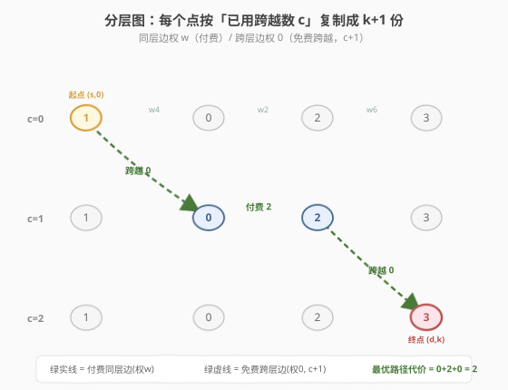
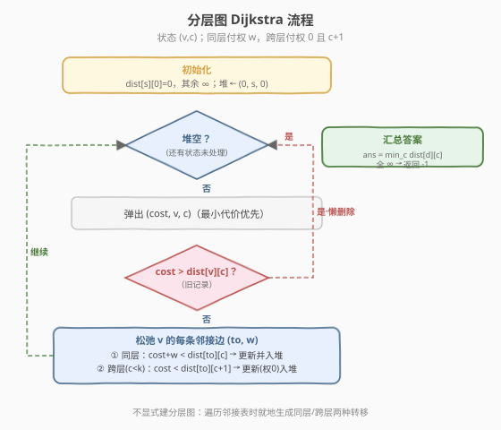
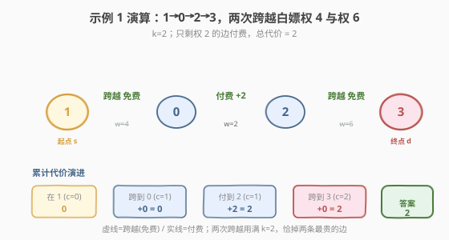

# 找到 K 次跨越的最短路径

- **题目名称**：找到 K 次跨越的最短路径
- **链接**：[2714. 找到 K 次跨越的最短路径](https://leetcode.cn/problems/find-shortest-path-with-k-hops/)
- **难度**：困难
- **标签**：图、最短路径、Dijkstra、堆/优先队列、状态扩展（分层图）

## 1. 题目概述

> ⚠️ 本题为 LeetCode 付费题，题意描述根据官方示例用例与 hints 重建，可能与官方题面有出入。函数签名 `shortestPathWithKHops(n, edges, s, d, k)` 也是依据 hints（参数命名为 `s`/`d`）与示例用例推断，请以官方题面为准。

给定一个含 `n` 个节点（编号 `0` 到 `n-1`）的**无向带权图**，边列表 `edges[i] = [u, v, w]` 表示 `u` 与 `v` 之间有一条权值为 `w` 的边。再给定起点 `s`、终点 `d`，以及整数 `k`。

> 💡 所谓「跨越（hop）」：在从 `s` 走到 `d` 的一条路径上，你可以**至多选择 `k` 条边**，把它们视为「免费跨越」——这 `k` 条边的权值按 `0` 计入总代价。其余边的权值照常累加。求从 `s` 到 `d` 的**最小总代价**；若 `d` 不可达，返回 `-1`。

**示例 1**：

```text
输入：n = 4, edges = [[0,1,4],[0,2,2],[2,3,6]], s = 1, d = 3, k = 2
输出：2
解释：1→0→2→3 的总权 4+2+6=12。用 2 次跨越免费走掉两条最贵的边（权 4 与权 6），只剩权 2，代价 2。
```

**示例 2**：

```text
输入：n = 7, edges = [[3,1,9],[3,2,4],[4,0,9],[0,5,6],[3,6,2],[6,0,4],[1,2,4]], s = 4, d = 1, k = 2
输出：6
解释：4→0→6→3→1 总权 9+4+2+9=24。两次跨越免费走掉两条权 9 的边，剩 4+2=6。
```

**示例 3**：

```text
输入：n = 5, edges = [[0,4,2],[0,1,3],[0,2,1],[2,1,4],[1,3,4],[3,4,7]], s = 2, d = 3, k = 1
输出：3
解释：2→0→4→3 总权 1+2+7=10。一次跨越免费走掉权 7 的边，剩 1+2=3，优于走 2→1→3（8，跨越后 4）。
```

**约束条件**（依 hints 与用例推断）：

- `1 <= n <= ?`，节点编号 `0..n-1`
- `edges[i] = [u, v, w]`，`u != v`，`w > 0`（正权）
- `0 <= k`，跨越次数预算
- 图为无向图，可能不连通；`s` 与 `d` 为合法节点编号

---

## 2. 解题思路

### 2.1 暴力思路：枚举哪些边「跨越」——为什么行不通

最直白的想法：先找出 `s` 到 `d` 的一条路径，再从路径上的边里挑至多 `k` 条最大的「免费跨越」。但这只对**固定的一条路径**成立——真正最优解可能压根不在「不用跨越时的最短路径」上。例如示例 3 中，不跨越的最短路是 `2→1→3`（权 8），但最优解走了 `2→0→4→3`（不跨越权 10，但跨越掉权 7 后只要 3）。**路径选择与跨越选择是耦合的**，不能分两步贪心。

> ⚠️ 若进一步去枚举「每条边是否被跨越」，则是 $2^{E}$ 组合，爆炸。必须把「已用跨越次数」吸收进状态，做**带维度的最短路**。

### 2.2 核心观察：分层图（状态扩展）+ Dijkstra



把原图里每个节点 `v` 复制成 $k+1$ 份副本 $(v, 0), (v, 1), \dots, (v, k)$，第二维 `c` 表示**到该点为止已经用掉的跨越次数**。这张「分层图」上跑一次堆优化 Dijkstra，就能让「选路径」与「选跨越」同时被最优地决定：

- **同层普通边（权 `w`）**：对原图每条无向边 $(u, v, w)$，在每一层 `c` 内连 $(u, c) \leftrightarrow (v, c)$，权 `w`——表示「这条边照常走，不消耗跨越」。
- **跨层免费边（权 `0`）**：对每条边 $(u, v, w)$，再连 $(u, c) \to (v, c{+}1)$ 与 $(v, c) \to (u, c{+}1)$，权 `0`——表示「把这条边当作跨越免费走过，跨越次数 +1」，只对 `c < k` 可用。

> 💡 **为什么这样建图就对？** 跨层边权为 `0`、且严格让 `c` 递增，于是「走一次跨层边 = 用掉一次跨越」。Dijkstra 在 $(s, 0)$ 出发，由于所有边权 $\geq 0$，贪心成立；最终 `dist[(d, c)]` 就是「到达 `d`、恰好用 `c` 次跨越」的最小代价。**至多 `k` 次**则取 $\min_{0 \le c \le k} dist[(d,c)]$，若全为 $\infty$ 则 `-1`。

> ⚠️ 官方 hint 把答案指向「节点 $(d, k)$」——那对应「恰好用满 `k` 次跨越」。由于跨越免费、用得多只会更省（或持平），多数用例下 $\min_c dist[(d,c)]$ 与 $dist[(d,k)]$ 同值。但稳妥写法是取**所有层 `c` 的最小值**，以兼容「路径边数不足以用满 `k` 次跨越」的情形（见 §5）。

### 2.3 算法流程图



### 2.4 示例演算

以示例 1 `n=4, edges=[[0,1,4],[0,2,2],[2,3,6]], s=1, d=3, k=2` 演算。图结构：`1—0(4)—2(2)—3(6)`（链状）。下表记录 `(节点, c)` 的最短估计 `dist` 随堆弹出的演进（INF 表示尚未松弛）。



| 步骤 | 弹出 `(d,(v,c))` | 关键松弛 | dist 变化要点 |
|------|------------------|----------|--------------|
| 0 | — | 起点 `(1,0)=0` 入堆 | `(1,0)=0`，余 $\infty$ |
| 1 | `(0,(1,0))` | 边 `1—0(4)`：同层→`(0,0)=4`；跨层→`(0,1)=0` | `(0,1)=0` 抢先（权 0 更小） |
| 2 | `(0,(0,1))` | 边 `0—2(2)`：同层→`(2,1)=2`；跨层→`(2,2)=0` | `(2,2)=0` |
| 3 | `(0,(2,2))` | 边 `2—3(6)`：同层→`(3,2)=6`；跨层已用满（c=k） | `(3,2)=6` |
| 4 | `(2,(2,1))` | 边 `2—3(6)`：跨层→`(3,2)=2`（更优） | `(3,2)` 刷新为 `2` ✅ |
| … | 其余弹出不产生更优值 | — | — |

最终 `dist[(3,0)]=12`、`dist[(3,1)]=6`、`dist[(3,2)]=2`，$\min = 2$。注意第 4 步是关键：从 `(2,1)` 出发用一次跨越免费走 `2—3`，把代价从 6 降到 0，叠加 `(2,1)=2` 得 `(3,2)=2`。

---

## 3. 参考代码

### C++

```cpp
class Solution {
  public:
    int shortestPathWithKHops(int n, vector<vector<int>>& edges, int s, int d, int k) {
        // 无向邻接表
        vector<vector<pair<int,int>>> g(n);
        for (auto& e : edges) {
            g[e[0]].push_back({e[1], e[2]});
            g[e[1]].push_back({e[0], e[2]});
        }

        const int INF = INT_MAX / 2;
        // dist[v][c]：到 v、已用 c 次跨越 的最小代价
        vector<vector<int>> dist(n, vector<int>(k + 1, INF));
        dist[s][0] = 0;

        // 最小堆：(代价, 节点, 已用跨越次数)
        priority_queue<tuple<int,int,int>, vector<tuple<int,int,int>>, greater<>> pq;
        pq.push({0, s, 0});

        while (!pq.empty()) {
            auto [cost, v, c] = pq.top(); pq.pop();
            if (cost > dist[v][c]) continue;                 // 懒删除
            if (v == d) return cost;                          // 已是最小，可提前返回
            for (auto& [to, w] : g[v]) {
                // 同层普通边：不消耗跨越
                if (cost + w < dist[to][c]) {
                    dist[to][c] = cost + w;
                    pq.push({dist[to][c], to, c});
                }
                // 跨层免费边：消耗一次跨越
                if (c + 1 <= k && cost < dist[to][c + 1]) {
                    dist[to][c + 1] = cost;
                    pq.push({cost, to, c + 1});
                }
            }
        }

        int ans = INF;
        for (int c = 0; c <= k; ++c) ans = min(ans, dist[d][c]);
        return ans == INF ? -1 : ans;
    }
};
```

### Python

```python
class Solution:
    def shortestPathWithKHops(self, n: int, edges: List[List[int]], s: int, d: int, k: int) -> int:
        g = [[] for _ in range(n)]
        for u, v, w in edges:
            g[u].append((v, w))
            g[v].append((u, w))

        INF = float('inf')
        # dist[v][c]：到 v、已用 c 次跨越 的最小代价
        dist = [[INF] * (k + 1) for _ in range(n)]
        dist[s][0] = 0

        pq = [(0, s, 0)]  # 最小堆：(代价, 节点, 已用跨越次数)
        while pq:
            cost, v, c = heapq.heappop(pq)
            if cost > dist[v][c]:          # 懒删除
                continue
            if v == d:                    # 已是最小，可提前返回
                return cost
            for to, w in g[v]:
                # 同层普通边：不消耗跨越
                if cost + w < dist[to][c]:
                    dist[to][c] = cost + w
                    heapq.heappush(pq, (dist[to][c], to, c))
                # 跨层免费边：消耗一次跨越
                if c + 1 <= k and cost < dist[to][c + 1]:
                    dist[to][c + 1] = cost
                    heapq.heappush(pq, (cost, to, c + 1))

        ans = min(dist[d][c] for c in range(k + 1))
        return -1 if ans == INF else ans
```

> 💡 两个写法上的小心思：
> - **提前返回**：由于 Dijkstra 弹出即定最值，一旦 `(d, c)` 被弹出，`cost` 就是「恰好 `c` 次跨越」下的最优；但题目要「至多 `k` 次」，严格说应在所有层取 min。提前返回之所以正确，是因为**跨越免费、多用的代价非增**——在能用满 `k` 次的连通图里，先弹出的小 `c` 对应的代价不会比大 `c` 更小（大 `c` 可把同样的边免费化）。若担心「边数不足用不满 `k`」，去掉提前返回、最后取 min 即最稳妥版本（如上代码末尾的循环）。
> - **懒删除**：与 [743. 网络延迟时间](../0701-0800/743_网络延迟时间.md) 同套路，堆中残留旧记录，弹出时 `cost > dist[v][c]` 即跳过。

---

## 4. 复杂度分析

| 维度 | 复杂度 | 说明 |
|------|--------|------|
| 时间复杂度 | $O\big(E\cdot k\cdot \log(nk)\big)$ | 状态数 $n(k{+}1)$；每条原图边在每个状态可产生 2 条松弛（同层 + 跨层），共 $O(Ek)$ 次入堆，每次堆操作 $O(\log(nk))$ |
| 空间复杂度 | $O(n\cdot k + E)$ | `dist` 表 $O(nk)$、邻接表 $O(E)$、堆最坏 $O(Ek)$ |

> ⚠️ 关键在于**无需显式建出整张分层图**（官方 hint 第 6 条也强调）：遍历原图邻接表时**就地**生成同层/跨层两种转移即可，否则 $O(Ek)$ 条边的显式建图既费空间又费常数。当 `k` 很大（如 $k \ge n$）时，可把 `k` 截断到 $n-1$（一条简单路径最多 $n-1$ 条边，跨越次数再多是浪费）。

---

## 5. 扩展：与 787 的对照，以及「恰好 k」变体

- **与 [787. K 站中转内最便宜的航班](../0701-0800/787_K站中转内最便宜的航班.md) 的同与异**：两者都是「带次数预算的最短路」。787 限制**中转次数**（每坐一段航班次数 +1，预算 = 最多经过的中间点数），常用限制松弛的 Bellman-Ford（`k+1` 轮）；本题限制**免费跨越次数**（每免费走一段次数 +1），且图无向、边权任意正数，用分层 Dijkstra 更自然。本质都是「把次数塞进状态维度」。
- **「至多 k」vs「恰好 k」**：本题题面按「至多 `k` 次」理解，故答案取 $\min_{c\le k} dist[(d,c)]$。若官方实为「恰好 `k` 次」（官方 hint 直指 $(d,k)$），把末尾改为返回 `dist[d][k]`（仍为 $\infty$ 则 `-1`）即可——两种写法只差一行，可视实际题面切换。示例 1/2/3 在两种口径下答案一致（[2, 6, 3]），因为最优都恰好用满了 `k` 次跨越。
- **0-1 BFS / 双端队列替代**：当所有边权只取 `0` 或某正常数时，可退化为 0-1 BFS；但本题边权 `w` 任意，必须用堆。

---

## 6. 面试要点

1. **为什么不能「先定路径再挑最大的 k 条边免费」？**

   - 路径选择与跨越选择**耦合**：不跨越时的最短路，加上跨越后未必仍最优（示例 3 即反例）。必须把「已用跨越数」并入状态统一求最优。

2. **分层图的状态为什么是 $(v, c)$ 而不是只记录 `v`？**

   - 只记 `v` 丢掉了「还能免费几次」的信息，无法区分「到 `v` 时预算还剩多少」的两条路径孰优。加一维 `c` 后，转移里同层（付费）/ 跨层（免费 +1）两种选择都显式可表达，Dijkstra 自然给出最优组合。

3. **跨层边为什么是单向（`c → c+1`）且权 0？**

   - 单向且 `c` 严格递增，保证「走一次跨层边 = 用一次跨越」，不会循环刷次数；权 0 对应「免费跨越」。所有边权 $\ge 0$，Dijkstra 贪心成立。

4. **为什么可以不显式建分层图？**

   - 显式建图要把每条原图边复制 $k+1$ 份并连两组边，空间常数大。遍历邻接表时**就地**生成同层/跨层转移，逻辑等价但省去显式存边，是竞赛/面试的标准写法。

5. **`k` 很大怎么办？**

   - 一条简单路径至多 $n-1$ 条边，跨越超过 $n-1$ 次无意义，可令 `k = min(k, n-1)` 截断，把状态数压回 $O(n^2)$ 量级。

6. **何时返回 `-1`？**

   - Dijkstra 结束后若 `dist[d][c]` 对所有 `c` 仍为 $\infty$，说明 `d` 不可达（即便白嫖也走不到），返回 `-1`。

---

## 7. 同类练习题

- [743. 网络延迟时间](https://leetcode.cn/problems/network-delay-time/)：堆优化 Dijkstra 单源最短路，本题的母题（不含跨越维度）
- [787. K 站中转内最便宜的航班](https://leetcode.cn/problems/cheapest-flights-within-k-stops/)：限制松弛 Bellman-Ford，把「次数预算」塞进松弛轮数的姊妹题
- [1928. 规定时间内到达终点的最小花费](https://leetcode.cn/problems/minimum-cost-to-reach-destination-with-time/)：分层 Dijkstra 的另一变体，把「剩余时间」作为状态第二维
- [1786. 从第一个节点出发到最后一个节点的受限路径数](https://leetcode.cn/problems/number-of-restricted-paths-from-first-to-last-node/)：按最短路距离分层的图上 DP/计数
- [1514. 概率最大的路径](https://leetcode.cn/problems/path-with-maximum-probability/)：Dijkstra 变体（取大 + 堆），体会「堆优化 + 状态扩展」的通用骨架
